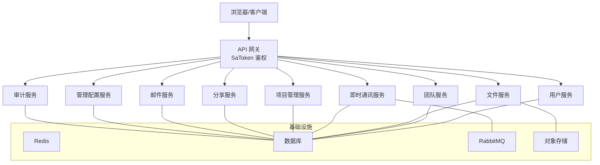
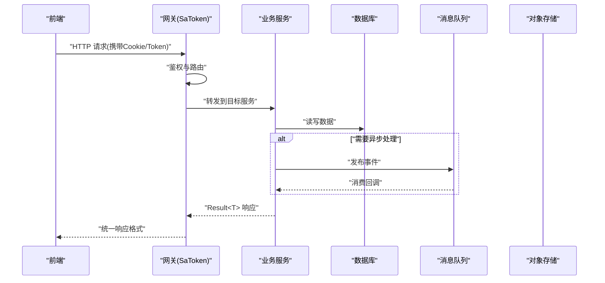
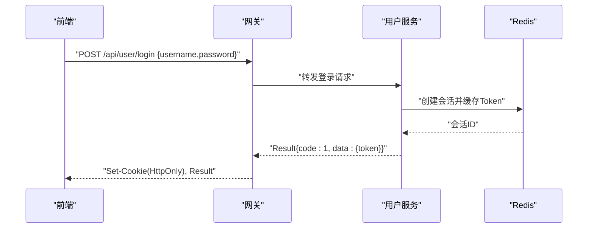
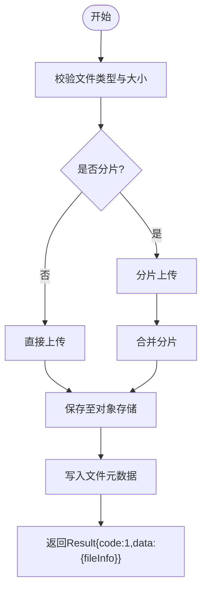
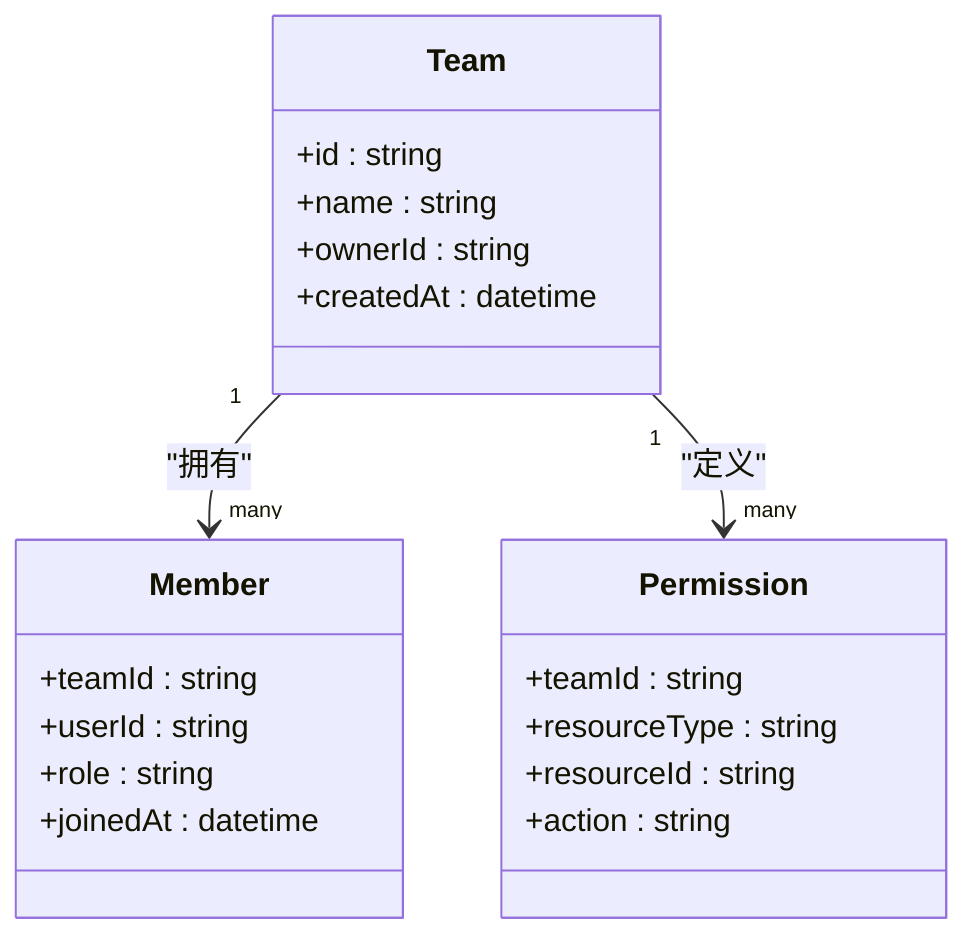
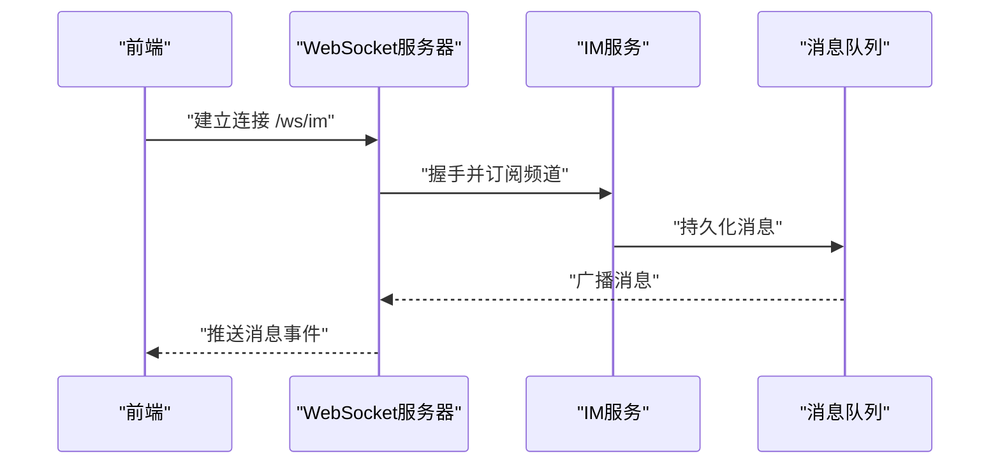
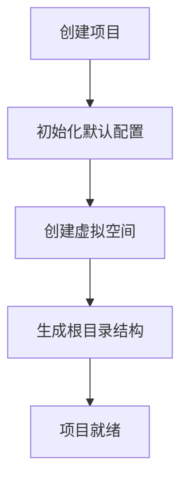
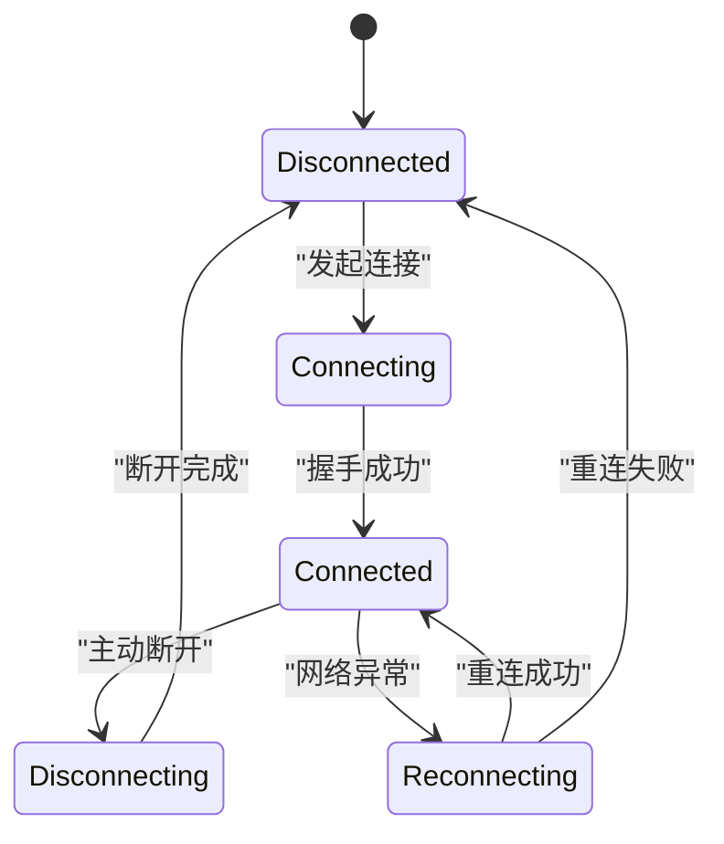
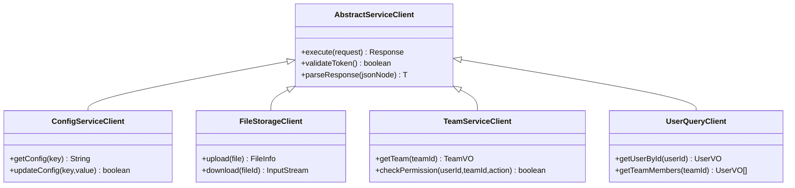
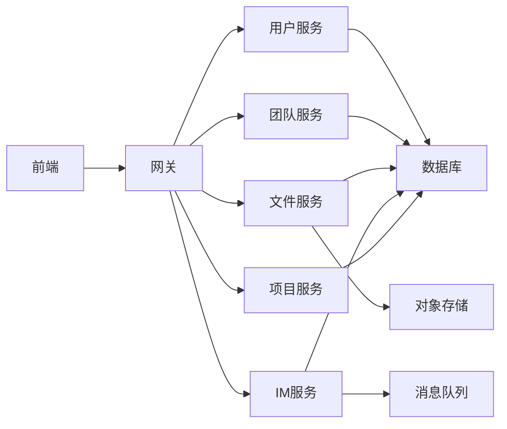

# API接口文档

<cite>
**本文引用的文件**   
- [zxyz-gateway 网关配置](file://ZXYZdatabaseBack/zxyz-gateway/src/main/resources/application.yml)
- [SaToken过滤器配置测试](file://ZXYZdatabaseBack/zxyz-gateway/src/test/java/uno/acloud/gateway/filter/SaTokenFilterConfigTest.java)
- [用户服务控制器](file://ZXYZdatabaseBack/zxyz-user-service/src/main/java/uno/acloud/user/controller)
- [团队服务控制器](file://ZXYZdatabaseBack/zxyz-team-service/src/main/java/uno/acloud/team/controller)
- [文件服务控制器](file://ZXYZdatabaseBack/zxyz-file-service/src/main/java/uno/acloud/file/controller)
- [即时通讯服务控制器](file://ZXYZdatabaseBack/zxyz-im-service/src/main/java/uno/acloud/im/controller)
- [项目管理服务控制器](file://ZXYZdatabaseBack/zxyz-project-service/src/main/java/uno/acloud/project/controller)
- [前端API封装 - 认证](file://ZXYZdatabaseFront/src/api/auth.js)
- [前端API封装 - 文件](file://ZXYZdatabaseFront/src/api/files.js)
- [前端API封装 - IM](file://ZXYZdatabaseFront/src/api/im.js)
- [前端API封装 - 团队](file://ZXYZdatabaseFront/src/api/team.js)
- [前端API封装 - 项目](file://ZXYZdatabaseFront/src/api/project.js)
- [前端WebSocket工具](file://ZXYZdatabaseFront/src/utils/imWebSocket.js)
- [前端请求封装](file://ZXYZdatabaseFront/src/utils/request.js)
- [统一错误处理](file://ZXYZdatabaseFront/src/utils/error.js)
- [内部客户端抽象类](file://ZXYZdatabaseBack/zxyz-common/src/main/java/uno/acloud/client/AbstractServiceClient.java)
- [配置服务客户端](file://ZXYZdatabaseBack/zxyz-common/src/main/java/uno/acloud/client/ConfigServiceClient.java)
- [文件存储客户端](file://ZXYZdatabaseBack/zxyz-common/src/main/java/uno/acloud/client/FileStorageClient.java)
- [团队服务客户端](file://ZXYZdatabaseBack/zxyz-common/src/main/java/uno/acloud/client/TeamServiceClient.java)
- [用户查询客户端](file://ZXYZdatabaseBack/zxyz-common/src/main/java/uno/acloud/client/UserQueryClient.java)
- [服务响应解析器](file://ZXYZdatabaseBack/zxyz-common/src/main/java/uno/acloud/client/ServiceResponseParser.java)
- [架构设计文档](file://docs/architecture.md)
- [API契约文档](file://docs/api-contract.md)
</cite>

## 目录
1. [简介](#简介)
2. [项目结构](#项目结构)
3. [核心组件](#核心组件)
4. [架构总览](#架构总览)
5. [详细组件分析](#详细组件分析)
6. [依赖关系分析](#依赖关系分析)
7. [性能考虑](#性能考虑)
8. [故障排查指南](#故障排查指南)
9. [结论](#结论)
10. [附录](#附录)

## 简介
本文件为 ZXYZ 项目的完整 API 接口文档，覆盖 RESTful 设计规范、公共接口（用户认证、文件操作、团队协作、即时通讯、项目管理）、WebSocket 实时通信协议、内部服务调用接口、版本管理与向后兼容策略，以及弃用接口迁移指南。文档同时提供请求与响应示例、错误码说明和最佳实践建议，帮助开发者快速集成与排障。

## 项目结构
ZXYZ 采用微服务架构，包含多个后端 Maven 模块与一个 Vue 前端工程：
- 网关层：统一鉴权、路由转发、跨域与安全过滤
- 业务服务：用户、团队、文件、IM、项目、分享、邮件、审计、管理配置等
- 通用库：服务间客户端、事件、权限、工具类等
- 前端：Vue 3 + Element Plus + Pinia，封装 API 调用、状态管理与 WebSocket 桥接

**图表来源** 
- [zxyz-gateway 网关配置](file://ZXYZdatabaseBack/zxyz-gateway/src/main/resources/application.yml)
- [架构设计文档](file://docs/architecture.md)

**章节来源**
- [zxyz-gateway 网关配置](file://ZXYZdatabaseBack/zxyz-gateway/src/main/resources/application.yml)
- [架构设计文档](file://docs/architecture.md)

## 核心组件
- 网关与鉴权：通过 SaToken 进行统一鉴权，拦截 /api/internal/** 内部端点，确保仅内网可访问；对外接口返回统一 Result<T> 结构，code=1 表示成功。
- 服务间调用：窄端点 + 投影模式，使用 ServiceClient + X-Internal-Service-Token 鉴权；禁止返回胖 DTO，提供方与调用方投影类独立演进。
- 异步通信：RabbitMQ Topic Exchange zxyz.topic 用于事件驱动与解耦。
- 前端封装：request.js 统一请求封装，error.js 统一错误处理，imWebSocket.js 管理 WebSocket 连接与消息。

**章节来源**
- [内部客户端抽象类](file://ZXYZdatabaseBack/zxyz-common/src/main/java/uno/acloud/client/AbstractServiceClient.java)
- [服务响应解析器](file://ZXYZdatabaseBack/zxyz-common/src/main/java/uno/acloud/client/ServiceResponseParser.java)
- [前端请求封装](file://ZXYZdatabaseFront/src/utils/request.js)
- [统一错误处理](file://ZXYZdatabaseFront/src/utils/error.js)

## 架构总览
整体采用“网关 + 多业务服务 + 基础设施”的分层架构。外部请求经网关统一鉴权后路由至对应服务；服务间通过窄端点进行同步调用，或通过 MQ 进行异步事件处理。前端通过 HTTP 与 WebSocket 两种通道与后端交互。

**图表来源** 
- [zxyz-gateway 网关配置](file://ZXYZdatabaseBack/zxyz-gateway/src/main/resources/application.yml)
- [架构设计文档](file://docs/architecture.md)

## 详细组件分析

### 用户认证接口
- 注册：POST /api/user/register
- 登录：POST /api/user/login
- 登出：POST /api/user/logout
- 权限验证：GET /api/user/permission
- 会话校验：GET /api/user/session

请求与响应遵循统一 Result<T> 结构，登录成功后设置 HttpOnly Cookie（Sa-Token UUID token + Redis session）。

**图表来源** 
- [用户服务控制器](file://ZXYZdatabaseBack/zxyz-user-service/src/main/java/uno/acloud/user/controller)
- [前端API封装 - 认证](file://ZXYZdatabaseFront/src/api/auth.js)

**章节来源**
- [用户服务控制器](file://ZXYZdatabaseBack/zxyz-user-service/src/main/java/uno/acloud/user/controller)
- [前端API封装 - 认证](file://ZXYZdatabaseFront/src/api/auth.js)

### 文件操作接口
- 上传：POST /api/file/upload
- 下载：GET /api/file/download/{fileId}
- 删除：DELETE /api/file/{fileId}
- 列表：GET /api/file/list?folderId=&page=&size=
- 版本管理：GET /api/file/version/{fileId}, POST /api/file/version/{fileId}/restore

支持分片上传、断点续传与并发控制，响应中包含文件元数据与下载链接。

**图表来源** 
- [文件服务控制器](file://ZXYZdatabaseBack/zxyz-file-service/src/main/java/uno/acloud/file/controller)
- [前端API封装 - 文件](file://ZXYZdatabaseFront/src/api/files.js)

**章节来源**
- [文件服务控制器](file://ZXYZdatabaseBack/zxyz-file-service/src/main/java/uno/acloud/file/controller)
- [前端API封装 - 文件](file://ZXYZdatabaseFront/src/api/files.js)

### 团队协作接口
- 团队管理：POST /api/team/create, GET /api/team/list, PUT /api/team/update
- 成员操作：POST /api/team/member/add, DELETE /api/team/member/remove
- 权限控制：GET /api/team/permission/{teamId}, PUT /api/team/permission/{teamId}

支持角色与权限模型，基于团队维度进行资源隔离与访问控制。

**图表来源** 
- [团队服务控制器](file://ZXYZdatabaseBack/zxyz-team-service/src/main/java/uno/acloud/team/controller)
- [前端API封装 - 团队](file://ZXYZdatabaseFront/src/api/team.js)

**章节来源**
- [团队服务控制器](file://ZXYZdatabaseBack/zxyz-team-service/src/main/java/uno/acloud/team/controller)
- [前端API封装 - 团队](file://ZXYZdatabaseFront/src/api/team.js)

### 即时通讯接口
- 聊天：POST /api/im/message, GET /api/im/conversation/{conversationId}/messages
- 推送：WebSocket /ws/im (事件驱动)
- 房间管理：POST /api/im/conversation, DELETE /api/im/conversation/{conversationId}

支持私聊、群聊、消息已读回执、在线状态同步与历史消息分页加载。

**图表来源** 
- [即时通讯服务控制器](file://ZXYZdatabaseBack/zxyz-im-service/src/main/java/uno/acloud/im/controller)
- [前端WebSocket工具](file://ZXYZdatabaseFront/src/utils/imWebSocket.js)

**章节来源**
- [即时通讯服务控制器](file://ZXYZdatabaseBack/zxyz-im-service/src/main/java/uno/acloud/im/controller)
- [前端WebSocket工具](file://ZXYZdatabaseFront/src/utils/imWebSocket.js)

### 项目管理接口
- 项目创建：POST /api/project/create
- 配置管理：GET /api/project/config/{projectId}, PUT /api/project/config/{projectId}
- 虚拟空间：GET /api/project/space/{projectId}/files

支持项目级配置、虚拟文件夹映射与资源隔离。

**图表来源** 
- [项目管理服务控制器](file://ZXYZdatabaseBack/zxyz-project-service/src/main/java/uno/acloud/project/controller)
- [前端API封装 - 项目](file://ZXYZdatabaseFront/src/api/project.js)

**章节来源**
- [项目管理服务控制器](file://ZXYZdatabaseBack/zxyz-project-service/src/main/java/uno/acloud/project/controller)
- [前端API封装 - 项目](file://ZXYZdatabaseFront/src/api/project.js)

### WebSocket 实时通信协议
- 连接建立：GET /ws/im?token={token}&teamId={teamId}
- 消息格式：JSON 结构，包含 type、payload、timestamp
- 事件类型：message、typing、read_receipt、user_status_change
- 状态管理：连接状态（connected/disconnecting/disconnected）、重连机制、心跳保活

**图表来源** 
- [前端WebSocket工具](file://ZXYZdatabaseFront/src/utils/imWebSocket.js)
- [即时通讯服务控制器](file://ZXYZdatabaseBack/zxyz-im-service/src/main/java/uno/acloud/im/controller)

**章节来源**
- [前端WebSocket工具](file://ZXYZdatabaseFront/src/utils/imWebSocket.js)
- [即时通讯服务控制器](file://ZXYZdatabaseBack/zxyz-im-service/src/main/java/uno/acloud/im/controller)

### 内部服务调用接口
- 窄端点设计：/api/internal/**，仅限内网访问
- 投影模式：返回调用方专用 Projection VO，避免耦合
- 内部鉴权：X-Internal-Service-Token 头校验
- 客户端实现：AbstractServiceClient + 具体 ServiceClient

**图表来源** 
- [内部客户端抽象类](file://ZXYZdatabaseBack/zxyz-common/src/main/java/uno/acloud/client/AbstractServiceClient.java)
- [配置服务客户端](file://ZXYZdatabaseBack/zxyz-common/src/main/java/uno/acloud/client/ConfigServiceClient.java)
- [文件存储客户端](file://ZXYZdatabaseBack/zxyz-common/src/main/java/uno/acloud/client/FileStorageClient.java)
- [团队服务客户端](file://ZXYZdatabaseBack/zxyz-common/src/main/java/uno/acloud/client/TeamServiceClient.java)
- [用户查询客户端](file://ZXYZdatabaseBack/zxyz-common/src/main/java/uno/acloud/client/UserQueryClient.java)

**章节来源**
- [内部客户端抽象类](file://ZXYZdatabaseBack/zxyz-common/src/main/java/uno/acloud/client/AbstractServiceClient.java)
- [服务响应解析器](file://ZXYZdatabaseBack/zxyz-common/src/main/java/uno/acloud/client/ServiceResponseParser.java)

## 依赖关系分析
服务间依赖清晰，通过网关统一入口，内部调用通过窄端点与 Token 鉴权保护。前端依赖后端提供的 REST 与 WebSocket 接口。

**图表来源** 
- [zxyz-gateway 网关配置](file://ZXYZdatabaseBack/zxyz-gateway/src/main/resources/application.yml)
- [架构设计文档](file://docs/architecture.md)

**章节来源**
- [zxyz-gateway 网关配置](file://ZXYZdatabaseBack/zxyz-gateway/src/main/resources/application.yml)
- [架构设计文档](file://docs/architecture.md)

## 性能考虑
- 连接池与超时：合理配置 HTTP 客户端连接池与超时时间，避免连接耗尽
- 缓存策略：热点数据使用 Redis 缓存，减少数据库压力
- 异步处理：耗时操作通过 MQ 异步化，提升响应速度
- 分页与限流：列表接口强制分页，关键接口实施限流保护
- 压缩与传输：启用 Gzip 压缩，大文件分块传输

[本节为通用指导，无需特定文件引用]

## 故障排查指南
- 鉴权失败：检查 SaToken 配置与 Cookie 是否正确传递
- 内部端点访问被拒：确认请求来自内网且携带有效 X-Internal-Service-Token
- 消息推送失败：检查 WebSocket 连接状态与 MQ 消费者是否正常
- 文件上传失败：验证对象存储配置与权限
- 统一错误处理：前端 error.js 捕获并展示错误信息，后端统一返回 Result 结构

**章节来源**
- [统一错误处理](file://ZXYZdatabaseFront/src/utils/error.js)
- [前端请求封装](file://ZXYZdatabaseFront/src/utils/request.js)
- [SaToken过滤器配置测试](file://ZXYZdatabaseBack/zxyz-gateway/src/test/java/uno/acloud/gateway/filter/SaTokenFilterConfigTest.java)

## 结论
ZXYZ 项目通过清晰的微服务架构与统一的网关鉴权，提供了完整的 RESTful API 与 WebSocket 实时通信能力。内部服务调用遵循窄端点与投影模式，确保了系统的可扩展性与安全性。前端封装简化了集成复杂度，统一的错误处理提升了用户体验。建议在生产环境中严格遵循版本管理与兼容性策略，平滑迁移弃用接口。

[本节为总结性内容，无需特定文件引用]

## 附录

### API 版本管理策略
- 版本号嵌入 URL：/api/v1/**
- 向后兼容：新增字段不破坏现有客户端，废弃字段保留至少两个大版本
- 弃用通知：通过响应头 X-Deprecated-Since 与 X-Removal-Version 提示
- 迁移指南：提供并行接口与迁移脚本，逐步淘汰旧版本

### 错误码规范
- code: 1 表示成功，其他值为错误码
- 常见错误码：
  - 400: 参数错误
  - 401: 未授权
  - 403: 权限不足
  - 404: 资源不存在
  - 500: 服务器内部错误

### 请求与响应示例
- 登录请求：POST /api/user/login {username:"test", password:"123456"}
- 登录响应：{code:1, data:{token:"uuid-token"}, message:"success"}
- 文件上传响应：{code:1, data:{fileId:"file-123", url:"https://oss..."}, message:"uploaded"}

[本节为示例性内容，无需特定文件引用]