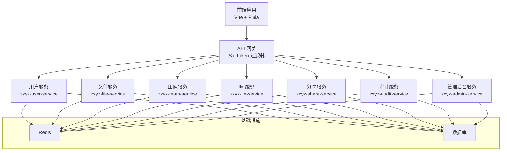
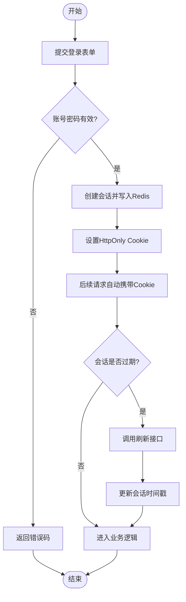
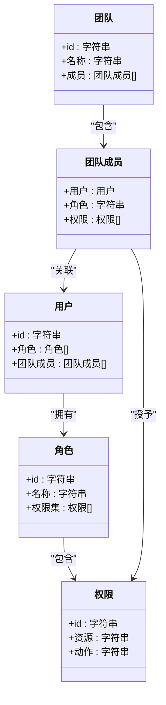
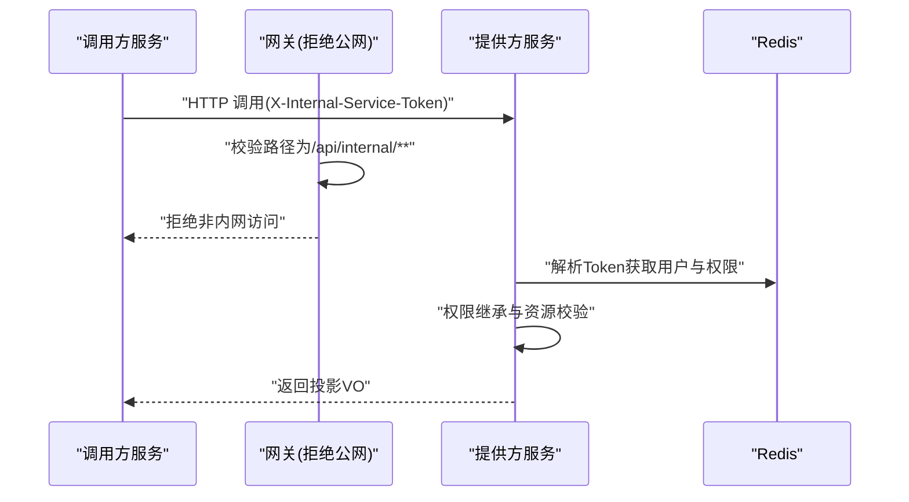
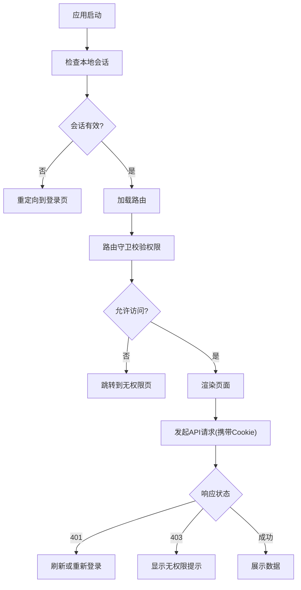
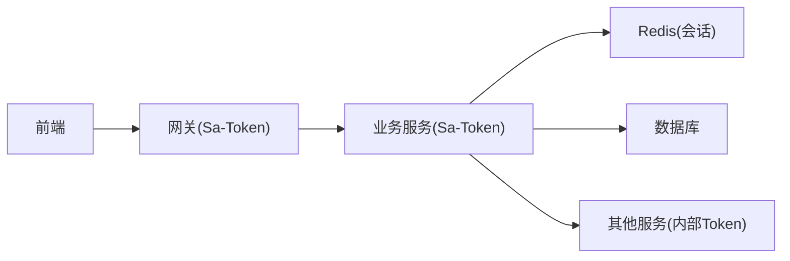

# API认证与授权

<cite>
**本文引用的文件**   
- [SaTokenConfigure.java](file://ZXYZdatabaseBack/zxyz-admin-service/src/main/java/uno/acloud/admin/config/SaTokenConfigure.java)
- [application.yml](file://ZXYZdatabaseBack/zxyz-admin-service/src/main/resources/application.yml)
- [application.yml](file://ZXYZdatabaseBack/zxyz-gateway/src/main/resources/application.yml)
- [SaTokenFilterConfigTest.java](file://ZXYZdatabaseBack/zxyz-gateway/src/test/java/uno/acloud/gateway/filter/SaTokenFilterConfigTest.java)
- [auth.js](file://ZXYZdatabaseFront/src/api/auth.js)
- [createApiClient.js](file://ZXYZdatabaseFront/src/utils/createApiClient.js)
- [request.js](file://ZXYZdatabaseFront/src/utils/request.js)
- [permission.js](file://ZXYZdatabaseFront/src/router/guards/permission.js)
- [currentUser.js](file://ZXYZdatabaseFront/src/store/currentUser.js)
- [session.js](file://ZXYZdatabaseFront/src/store/session.js)
- [useLoginForm.js](file://ZXYZdatabaseFront/src/composables/useLoginForm.js)
- [TeamPermissionPolicyTest.java](file://ZXYZdatabaseBack/zxyz-common/src/test/java/uno/acloud/common/TeamPermissionPolicyTest.java)
- [AbstractServiceClient.java](file://ZXYZdatabaseBack/zxyz-common/src/main/java/uno/acloud/client/AbstractServiceClient.java)
- [config.json](file://nacos-config/zxyz-static.yml)
- [zxyz-user-service.yml](file://nacos-config/zxyz-user-service.yml)
- [zxyz-file-service.yml](file://nacos-config/zxyz-file-service.yml)
- [zxyz-team-service.yml](file://nacos-config/zxyz-team-service.yml)
- [zxyz-im-service.yml](file://nacos-config/zxyz-im-service.yml)
- [zxyz-share-service.yml](file://nacos-config/zxyz-share-service.yml)
- [schema_user.sql](file://ZXYZdatabaseBack/sql/schema_user.sql)
</cite>

## 目录
1. [简介](#简介)
2. [项目结构](#项目结构)
3. [核心组件](#核心组件)
4. [架构总览](#架构总览)
5. [详细组件分析](#详细组件分析)
6. [依赖关系分析](#依赖关系分析)
7. [性能考量](#性能考量)
8. [故障排查指南](#故障排查指南)
9. [结论](#结论)
10. [附录](#附录)

## 简介
本文件面向 ZXYZ 项目的 API 认证与授权，基于 Sa-Token 实现统一鉴权。文档覆盖以下要点：
- 统一认证架构：JWT 令牌生成、Redis 会话存储、HttpOnly Cookie 安全机制
- 用户认证流程：登录校验、令牌刷新、多设备登录管理
- 权限控制模型：RBAC 角色权限、团队权限隔离、资源级权限控制
- 内部服务鉴权：服务间 Token 传递、权限继承、跨服务权限验证
- 前端集成：自动登录检查、权限守卫、路由拦截
- 接口调用示例、权限验证代码示例、常见安全问题防护方案

## 项目结构
后端采用微服务架构（多个 Maven 模块），网关层通过 Sa-Token Filter 进行统一鉴权；各业务服务在各自配置中启用 Sa-Token；公共模块提供通用客户端与权限策略；前端通过 HttpOnly Cookie 与后端交互，并在路由层做权限守卫。



图表来源
- [application.yml](file://ZXYZdatabaseBack/zxyz-gateway/src/main/resources/application.yml)
- [application.yml](file://ZXYZdatabaseBack/zxyz-admin-service/src/main/resources/application.yml)

章节来源
- [application.yml](file://ZXYZdatabaseBack/zxyz-gateway/src/main/resources/application.yml)
- [application.yml](file://ZXYZdatabaseBack/zxyz-admin-service/src/main/resources/application.yml)

## 核心组件
- 网关层 Sa-Token 过滤器：统一拦截请求，校验令牌、注入上下文、拒绝公网访问内部端点
- 业务服务 Sa-Token 配置：在各服务中启用注解式鉴权、会话存储、Cookie 策略
- 前端认证工具：封装登录、登出、自动刷新、权限判断与路由守卫
- 权限策略：RBAC 角色、团队维度隔离、资源级细粒度控制
- 内部服务客户端：服务间调用携带内部 Token，支持权限继承与跨服务验证

章节来源
- [SaTokenConfigure.java](file://ZXYZdatabaseBack/zxyz-admin-service/src/main/java/uno/acloud/admin/config/SaTokenConfigure.java)
- [SaTokenFilterConfigTest.java](file://ZXYZdatabaseBack/zxyz-gateway/src/test/java/uno/acloud/gateway/filter/SaTokenFilterConfigTest.java)
- [auth.js](file://ZXYZdatabaseFront/src/api/auth.js)
- [createApiClient.js](file://ZXYZdatabaseFront/src/utils/createApiClient.js)
- [request.js](file://ZXYZdatabaseFront/src/utils/request.js)
- [permission.js](file://ZXYZdatabaseFront/src/router/guards/permission.js)
- [currentUser.js](file://ZXYZdatabaseFront/src/store/currentUser.js)
- [session.js](file://ZXYZdatabaseFront/src/store/session.js)
- [useLoginForm.js](file://ZXYZdatabaseFront/src/composables/useLoginForm.js)
- [AbstractServiceClient.java](file://ZXYZdatabaseBack/zxyz-common/src/main/java/uno/acloud/client/AbstractServiceClient.java)

## 架构总览
整体认证链路如下：
- 前端通过 HttpOnly Cookie 持有 Sa-Token UUID，避免 XSS 窃取
- 网关层对每个请求执行 Sa-Token 校验，解析会话并注入当前用户上下文
- 业务服务使用注解或 AOP 进行 RBAC 与团队权限校验
- 内部服务调用通过 X-Internal-Service-Token 传递身份，目标服务校验并继承权限

```mermaid
sequenceDiagram
participant U as "用户浏览器"
participant G as "API 网关(Sa-Token)"
participant S as "业务服务(含Sa-Token)"
participant R as "Redis(会话)"
participant D as "数据库"
U->>G : "POST /api/user/login {账号,密码}"
G->>S : "转发登录请求"
S->>D : "校验账号密码"
D-->>S : "用户信息"
S->>R : "写入会话{token,用户,权限,团队}"
S-->>G : "返回{code : 1, data : token}"
G-->>U : "Set-Cookie : satoken=UUID; HttpOnly; SameSite=Lax"
U->>G : "GET /api/file/list (携带Cookie)"
G->>G : "Sa-Token 校验+会话加载"
G->>S : "转发请求(已带上下文)"
S->>S : "RBAC/团队/资源权限校验"
S-->>G : "返回数据"
G-->>U : "响应结果"
```

图表来源
- [application.yml](file://ZXYZdatabaseBack/zxyz-gateway/src/main/resources/application.yml)
- [application.yml](file://ZXYZdatabaseBack/zxyz-admin-service/src/main/resources/application.yml)
- [auth.js](file://ZXYZdatabaseFront/src/api/auth.js)
- [request.js](file://ZXYZdatabaseFront/src/utils/request.js)

## 详细组件分析

### 统一认证架构（Sa-Token）
- JWT 令牌：Sa-Token 默认以 UUID 作为 token 值，结合 Redis 会话存储，兼顾无状态校验与有状态扩展能力
- Redis 会话：会话包含用户标识、角色、团队、权限集合等，便于快速鉴权与多设备管理
- HttpOnly Cookie：前端不直接操作 Cookie，降低 XSS 风险；配合 SameSite 与 Secure 提升 CSRF/XSS 防护

章节来源
- [SaTokenConfigure.java](file://ZXYZdatabaseBack/zxyz-admin-service/src/main/java/uno/acloud/admin/config/SaTokenConfigure.java)
- [application.yml](file://ZXYZdatabaseBack/zxyz-admin-service/src/main/resources/application.yml)
- [application.yml](file://ZXYZdatabaseBack/zxyz-gateway/src/main/resources/application.yml)

### 用户认证流程（登录、刷新、多设备）
- 登录：前端提交账号密码至用户服务，成功后设置 HttpOnly Cookie，后续请求自动携带
- 刷新：前端在请求前检测本地会话有效期，必要时发起刷新接口更新会话
- 多设备：同一用户可在多设备同时登录，服务端按 token 维度管理会话，支持强制下线指定设备



图表来源
- [auth.js](file://ZXYZdatabaseFront/src/api/auth.js)
- [request.js](file://ZXYZdatabaseFront/src/utils/request.js)
- [useLoginForm.js](file://ZXYZdatabaseFront/src/composables/useLoginForm.js)

章节来源
- [auth.js](file://ZXYZdatabaseFront/src/api/auth.js)
- [request.js](file://ZXYZdatabaseFront/src/utils/request.js)
- [useLoginForm.js](file://ZXYZdatabaseFront/src/composables/useLoginForm.js)

### 权限控制模型（RBAC、团队隔离、资源级）
- RBAC 角色权限：用户拥有角色，角色绑定权限集合，接口通过注解声明所需权限
- 团队权限隔离：所有资源归属团队，鉴权时校验用户在该团队的权限范围
- 资源级权限控制：针对具体资源（如文件、项目、对话）进行细粒度校验



图表来源
- [TeamPermissionPolicyTest.java](file://ZXYZdatabaseBack/zxyz-common/src/test/java/uno/acloud/common/TeamPermissionPolicyTest.java)
- [schema_user.sql](file://ZXYZdatabaseBack/sql/schema_user.sql)

章节来源
- [TeamPermissionPolicyTest.java](file://ZXYZdatabaseBack/zxyz-common/src/test/java/uno/acloud/common/TeamPermissionPolicyTest.java)
- [schema_user.sql](file://ZXYZdatabaseBack/sql/schema_user.sql)

### 内部服务鉴权（服务间 Token 传递、权限继承、跨服务验证）
- 服务间调用：通过 AbstractServiceClient 构造请求头 X-Internal-Service-Token
- 权限继承：被调服务解析上游 Token，继承其用户与权限上下文
- 跨服务验证：网关拒绝公网访问 /api/internal/**，仅允许内网服务调用



图表来源
- [AbstractServiceClient.java](file://ZXYZdatabaseBack/zxyz-common/src/main/java/uno/acloud/client/AbstractServiceClient.java)
- [SaTokenFilterConfigTest.java](file://ZXYZdatabaseBack/zxyz-gateway/src/test/java/uno/acloud/gateway/filter/SaTokenFilterConfigTest.java)

章节来源
- [AbstractServiceClient.java](file://ZXYZdatabaseBack/zxyz-common/src/main/java/uno/acloud/client/AbstractServiceClient.java)
- [SaTokenFilterConfigTest.java](file://ZXYZdatabaseBack/zxyz-gateway/src/test/java/uno/acloud/gateway/filter/SaTokenFilterConfigTest.java)

### 前端认证集成（自动登录检查、权限守卫、路由拦截）
- 自动登录检查：应用启动时检查本地会话有效性，必要时触发刷新
- 权限守卫：路由守卫根据用户权限决定页面可访问性
- 请求拦截：统一拦截器附加 Cookie，处理 401/403 跳转与提示



图表来源
- [permission.js](file://ZXYZdatabaseFront/src/router/guards/permission.js)
- [currentUser.js](file://ZXYZdatabaseFront/src/store/currentUser.js)
- [session.js](file://ZXYZdatabaseFront/src/store/session.js)
- [createApiClient.js](file://ZXYZdatabaseFront/src/utils/createApiClient.js)
- [request.js](file://ZXYZdatabaseFront/src/utils/request.js)

章节来源
- [permission.js](file://ZXYZdatabaseFront/src/router/guards/permission.js)
- [currentUser.js](file://ZXYZdatabaseFront/src/store/currentUser.js)
- [session.js](file://ZXYZdatabaseFront/src/store/session.js)
- [createApiClient.js](file://ZXYZdatabaseFront/src/utils/createApiClient.js)
- [request.js](file://ZXYZdatabaseFront/src/utils/request.js)

## 依赖关系分析
- 网关与服务均依赖 Sa-Token 进行统一鉴权
- 会话数据存储在 Redis，保证高可用与水平扩展
- 前端依赖 HttpOnly Cookie 与统一的请求拦截器
- 内部服务通过抽象客户端传递 Token，避免硬编码



图表来源
- [application.yml](file://ZXYZdatabaseBack/zxyz-gateway/src/main/resources/application.yml)
- [application.yml](file://ZXYZdatabaseBack/zxyz-admin-service/src/main/resources/application.yml)
- [AbstractServiceClient.java](file://ZXYZdatabaseBack/zxyz-common/src/main/java/uno/acloud/client/AbstractServiceClient.java)

章节来源
- [application.yml](file://ZXYZdatabaseBack/zxyz-gateway/src/main/resources/application.yml)
- [application.yml](file://ZXYZdatabaseBack/zxyz-admin-service/src/main/resources/application.yml)
- [AbstractServiceClient.java](file://ZXYZdatabaseBack/zxyz-common/src/main/java/uno/acloud/client/AbstractServiceClient.java)

## 性能考量
- 会话缓存：将用户、角色、权限集合缓存于 Redis，减少数据库查询
- 令牌刷新：前端按需刷新，避免频繁全量校验
- 内部调用：使用窄端点与投影 VO，减少数据传输与序列化开销
- 网关过滤：集中鉴权，避免重复逻辑分散在各服务

[本节为通用指导，无需引用具体文件]

## 故障排查指南
- 登录失败：检查账号密码、用户状态、验证码策略
- 401 未认证：确认 Cookie 是否携带、会话是否过期、网关是否放行
- 403 无权限：检查 RBAC 角色与团队权限、资源级权限配置
- 内部调用失败：确认 X-Internal-Service-Token 是否正确、路径是否为 /api/internal/**
- 前端路由守卫异常：检查本地会话状态、权限数据是否加载完成

章节来源
- [SaTokenFilterConfigTest.java](file://ZXYZdatabaseBack/zxyz-gateway/src/test/java/uno/acloud/gateway/filter/SaTokenFilterConfigTest.java)
- [permission.js](file://ZXYZdatabaseFront/src/router/guards/permission.js)
- [request.js](file://ZXYZdatabaseFront/src/utils/request.js)

## 结论
ZXYZ 项目通过 Sa-Token 实现了统一的认证与授权体系，结合 Redis 会话与 HttpOnly Cookie 提升了安全性与可扩展性。RBAC 与团队权限隔离满足复杂业务场景，内部服务鉴权保障跨服务调用安全。前端集成完善，具备自动登录检查、权限守卫与路由拦截能力。建议在生产环境持续优化会话缓存策略与令牌刷新机制，确保高并发下的稳定与安全。

[本节为总结，无需引用具体文件]

## 附录

### 认证接口调用示例（路径参考）
- 登录：POST /api/user/login
- 登出：POST /api/user/logout
- 刷新会话：POST /api/user/token/refresh
- 获取当前用户：GET /api/user/current

章节来源
- [auth.js](file://ZXYZdatabaseFront/src/api/auth.js)
- [request.js](file://ZXYZdatabaseFront/src/utils/request.js)

### 权限验证代码示例（路径参考）
- 网关过滤器测试：SaTokenFilterConfigTest
- 团队权限策略测试：TeamPermissionPolicyTest
- 内部服务客户端：AbstractServiceClient

章节来源
- [SaTokenFilterConfigTest.java](file://ZXYZdatabaseBack/zxyz-gateway/src/test/java/uno/acloud/gateway/filter/SaTokenFilterConfigTest.java)
- [TeamPermissionPolicyTest.java](file://ZXYZdatabaseBack/zxyz-common/src/test/java/uno/acloud/common/TeamPermissionPolicyTest.java)
- [AbstractServiceClient.java](file://ZXYZdatabaseBack/zxyz-common/src/main/java/uno/acloud/client/AbstractServiceClient.java)

### 常见安全问题防护方案
- 防 XSS：使用 HttpOnly Cookie，禁止前端读取
- 防 CSRF：SameSite=Lax 与 Secure 标志
- 防重放：请求签名与时间戳校验（可选）
- 防越权：RBAC + 团队隔离 + 资源级校验
- 防会话劫持：定期刷新会话、强制下线指定设备

[本节为通用指导，无需引用具体文件]