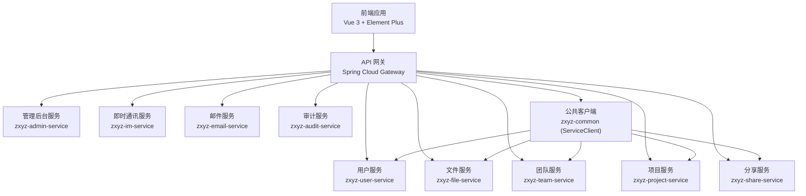
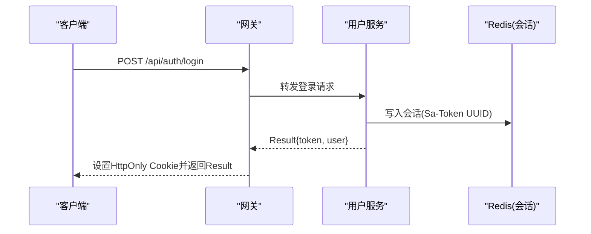
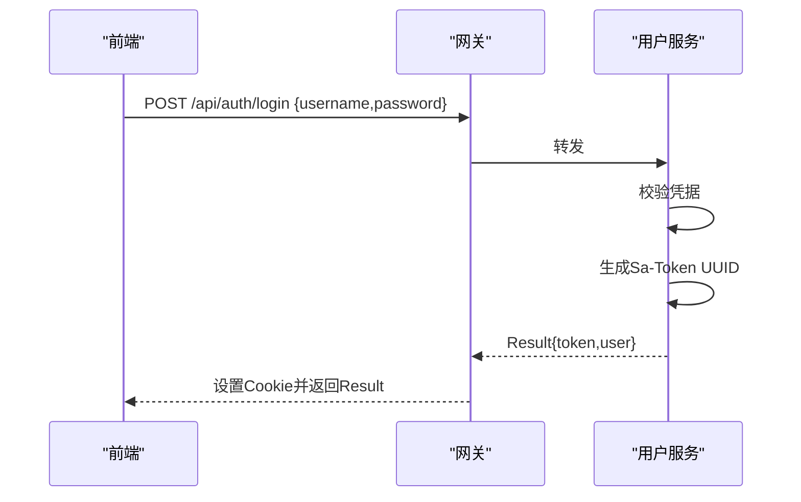
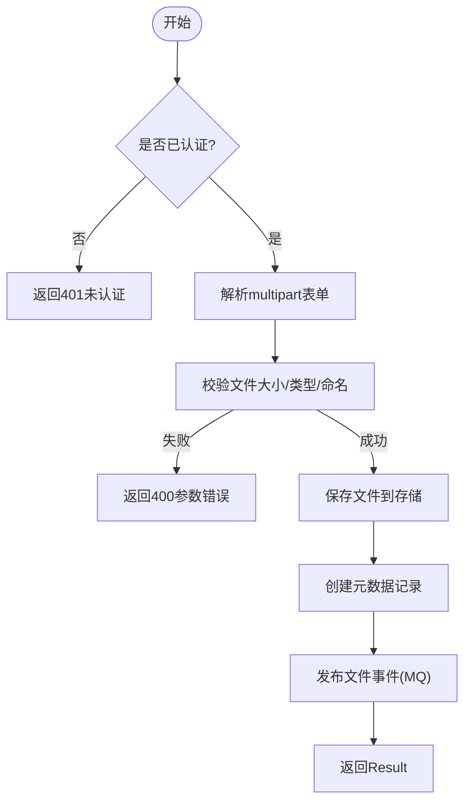
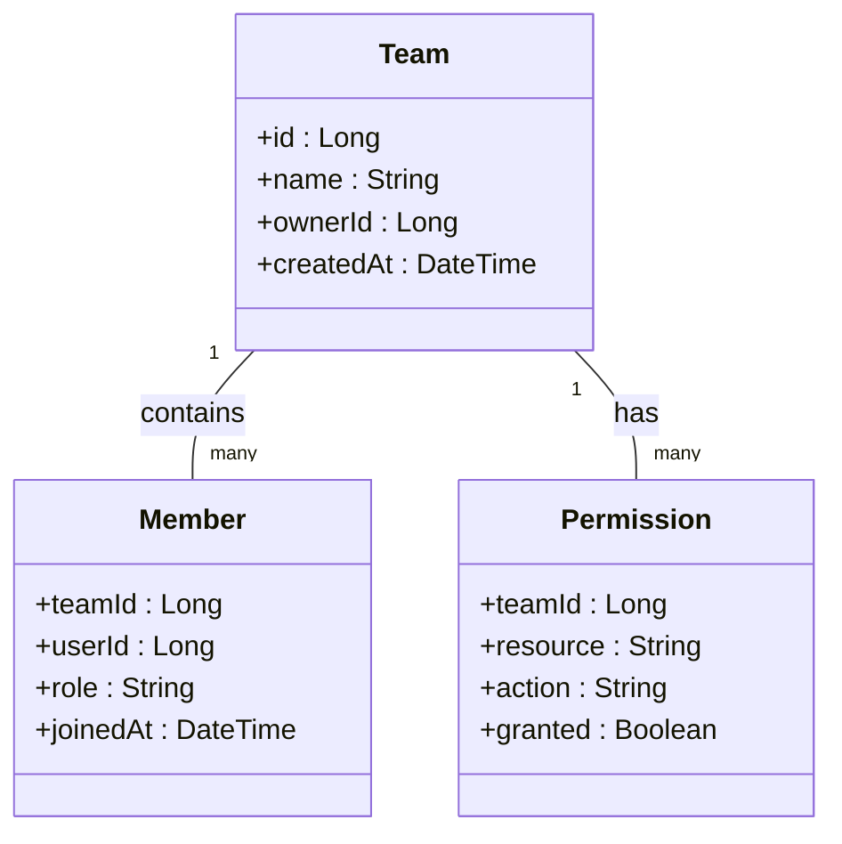
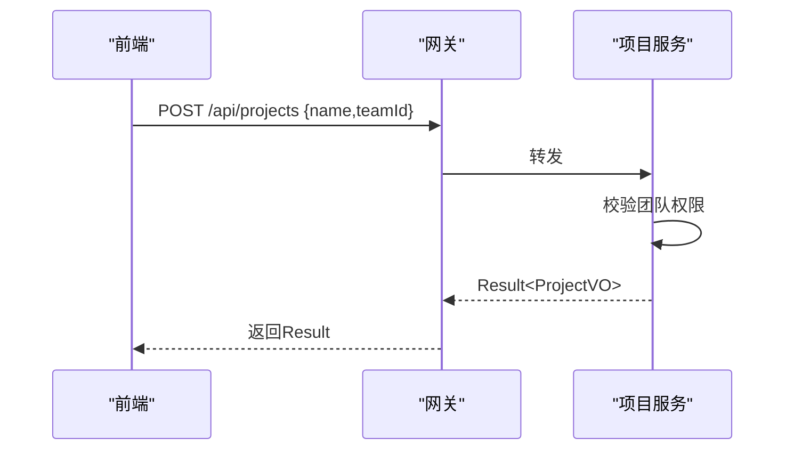
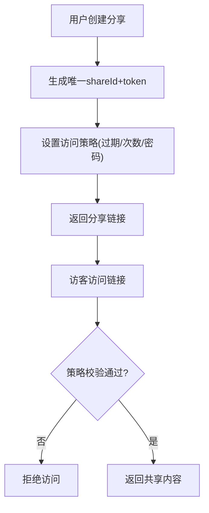
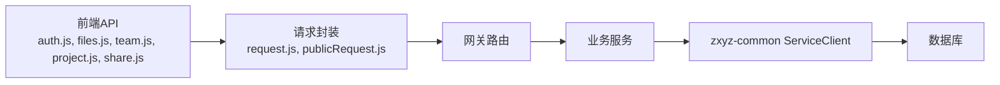

# RESTful API接口

<cite>
**本文引用的文件**   
- [api-contract.md](file://docs/api-contract.md)
- [architecture.md](file://docs/architecture.md)
- [zxyz-gateway.yml](file://nacos-config/zxyz-gateway.yml)
- [application.yml](file://ZXYZdatabaseBack/zxyz-gateway/src/main/resources/application.yml)
- [SaTokenConfigure.java](file://ZXYZdatabaseBack/zxyz-admin-service/src/main/java/uno/acloud/admin/config/SaTokenConfigure.java)
- [AbstractServiceClient.java](file://ZXYZdatabaseBack/zxyz-common/src/main/java/uno/acloud/client/AbstractServiceClient.java)
- [UserQueryClient.java](file://ZXYZdatabaseBack/zxyz-common/src/main/java/uno/acloud/client/UserQueryClient.java)
- [TeamServiceClient.java](file://ZXYZdatabaseBack/zxyz-common/src/main/java/uno/acloud/client/TeamServiceClient.java)
- [FileStorageClient.java](file://ZXYZdatabaseBack/zxyz-common/src/main/java/uno/acloud/client/FileStorageClient.java)
- [ConfigServiceClient.java](file://ZXYZdatabaseBack/zxyz-common/src/main/java/uno/acloud/client/ConfigServiceClient.java)
- [ServiceResponseParser.java](file://ZXYZdatabaseBack/zxyz-common/src/main/java/uno/acloud/client/ServiceResponseParser.java)
- [auth.js](file://ZXYZdatabaseFront/src/api/auth.js)
- [files.js](file://ZXYZdatabaseFront/src/api/files.js)
- [team.js](file://ZXYZdatabaseFront/src/api/team.js)
- [project.js](file://ZXYZdatabaseFront/src/api/project.js)
- [share.js](file://ZXYZdatabaseFront/src/api/share.js)
- [request.js](file://ZXYZdatabaseFront/src/utils/request.js)
- [publicRequest.js](file://ZXYZdatabaseFront/src/utils/publicRequest.js)
- [errorModel.js](file://ZXYZdatabaseFront/src/utils/errorModel.js)
- [createApiClient.js](file://ZXYZdatabaseFront/src/utils/createApiClient.js)
- [schema_user.sql](file://ZXYZdatabaseBack/sql/schema_user.sql)
- [schema_file.sql](file://ZXYZdatabaseBack/sql/schema_file.sql)
- [schema_team.sql](file://ZXYZdatabaseBack/sql/schema_team.sql)
- [schema_project.sql](file://ZXYZdatabaseBack/sql/schema_project.sql)
- [schema_share.sql](file://ZXYZdatabaseBack/sql/schema_share.sql)
</cite>

## 目录
1. [引言](#引言)
2. [项目结构](#项目结构)
3. [核心组件](#核心组件)
4. [架构总览](#架构总览)
5. [详细组件分析](#详细组件分析)
6. [依赖关系分析](#依赖关系分析)
7. [性能考虑](#性能考虑)
8. [故障排查指南](#故障排查指南)
9. [结论](#结论)
10. [附录](#附录)

## 引言
本文件为 ZXYZ 项目的统一 RESTful API 接口文档，覆盖用户认证、文件操作、团队协作、项目管理与分享功能。文档基于仓库中的服务定义、前端调用与数据库模型进行归纳，确保前后端一致性与可维护性。所有接口遵循统一的 Result<T> 响应格式、错误码规范与分页参数约定；内部服务间通过 ServiceClient + X-Internal-Service-Token 鉴权，外部仅暴露 Gateway 入口。

## 项目结构
- 后端采用微服务架构（多个独立 Maven 模块），网关统一入口，Nacos 配置与服务注册，RabbitMQ 异步通信。
- 前端使用 Vue 3 Composition API + Element Plus，API 层按领域拆分（auth、files、team、project、share 等），统一请求封装与错误处理。
- 数据库脚本位于 sql 目录，涵盖用户、文件、团队、项目、分享等核心实体。

**图表来源** 
- [architecture.md](file://docs/architecture.md)
- [zxyz-gateway.yml](file://nacos-config/zxyz-gateway.yml)

**章节来源**
- [architecture.md](file://docs/architecture.md)

## 核心组件
- 统一响应体 Result<T>：code=1 表示成功，data 承载业务数据，message 描述信息，分页字段包含 total、pageNum、pageSize、pages。
- 认证与会话：Sa-Token 基于 HttpOnly Cookie + Redis Session，Gateway 过滤器拦截 /api/internal/** 拒绝公网访问。
- 服务间调用：zxyz-common 提供 AbstractServiceClient 及具体 Client（UserQueryClient、TeamServiceClient、FileStorageClient、ConfigServiceClient），统一注入 X-Internal-Service-Token 并解析 ServiceResponseParser。
- 前端 API 层：按领域划分 js 文件，统一 request.js 与 publicRequest.js 封装，errorModel.js 标准化错误展示。

**章节来源**
- [SaTokenConfigure.java](file://ZXYZdatabaseBack/zxyz-admin-service/src/main/java/uno/acloud/admin/config/SaTokenConfigure.java)
- [AbstractServiceClient.java](file://ZXYZdatabaseBack/zxyz-common/src/main/java/uno/acloud/client/AbstractServiceClient.java)
- [UserQueryClient.java](file://ZXYZdatabaseBack/zxyz-common/src/main/java/uno/acloud/client/UserQueryClient.java)
- [TeamServiceClient.java](file://ZXYZdatabaseBack/zxyz-common/src/main/java/uno/acloud/client/TeamServiceClient.java)
- [FileStorageClient.java](file://ZXYZdatabaseBack/zxyz-common/src/main/java/uno/acloud/client/FileStorageClient.java)
- [ConfigServiceClient.java](file://ZXYZdatabaseBack/zxyz-common/src/main/java/uno/acloud/client/ConfigServiceClient.java)
- [ServiceResponseParser.java](file://ZXYZdatabaseBack/zxyz-common/src/main/java/uno/acloud/client/ServiceResponseParser.java)
- [request.js](file://ZXYZdatabaseFront/src/utils/request.js)
- [publicRequest.js](file://ZXYZdatabaseFront/src/utils/publicRequest.js)
- [errorModel.js](file://ZXYZdatabaseFront/src/utils/errorModel.js)

## 架构总览
- 网关层：统一鉴权、路由转发、限流与审计，拦截内部端点。
- 服务层：各业务域独立部署，对外暴露 REST 接口，对内通过 zxyz-common 的 ServiceClient 调用。
- 数据层：MySQL 持久化，迁移脚本由 Flyway/Liquibase 管理（见各服务 db/migration）。
- 消息层：RabbitMQ Topic Exchange zxyz.topic 用于事件驱动（如用户删除、审计日志）。

**图表来源** 
- [zxyz-gateway.yml](file://nacos-config/zxyz-gateway.yml)
- [application.yml](file://ZXYZdatabaseBack/zxyz-gateway/src/main/resources/application.yml)
- [SaTokenConfigure.java](file://ZXYZdatabaseBack/zxyz-admin-service/src/main/java/uno/acloud/admin/config/SaTokenConfigure.java)

## 详细组件分析

### 统一API设计规范
- HTTP方法
  - GET：查询资源（支持分页、排序、过滤）
  - POST：创建资源或执行动作
  - PUT：全量更新资源
  - PATCH：部分更新资源
  - DELETE：删除资源
- URL路径设计
  - 名词复数形式，层级不超过3级，避免动词
  - 示例：/api/users、/api/teams/{teamId}/members、/api/files/{fileId}/versions
- 请求响应格式
  - 统一 Result<T>：code、message、data、分页字段
  - 时间戳统一 ISO-8601
  - 文件上传使用 multipart/form-data，下载直接返回二进制流
- 分页查询参数
  - pageNum、pageSize、orderBy、sortDir
- 错误码规范
  - 业务错误码以 code 区分，通用HTTP状态码保持语义正确
  - 常见：400 参数错误、401 未认证、403 无权限、404 不存在、500 服务器错误

**章节来源**
- [api-contract.md](file://docs/api-contract.md)

### 用户认证接口
- 注册：POST /api/auth/register
  - 请求体：username、password、email、验证码（可选）
  - 响应：Result<UserVO>
- 登录：POST /api/auth/login
  - 请求体：username、password
  - 响应：Result<TokenVO>，服务端设置 HttpOnly Cookie
- 登出：POST /api/auth/logout
  - 请求头：携带会话Cookie
  - 响应：Result<Void>
- 密码管理
  - 修改密码：PUT /api/auth/password
  - 重置密码：POST /api/auth/password/reset（需邮箱验证码）

**图表来源** 
- [auth.js](file://ZXYZdatabaseFront/src/api/auth.js)
- [request.js](file://ZXYZdatabaseFront/src/utils/request.js)

**章节来源**
- [schema_user.sql](file://ZXYZdatabaseBack/sql/schema_user.sql)
- [auth.js](file://ZXYZdatabaseFront/src/api/auth.js)

### 文件操作接口
- 上传：POST /api/files/upload
  - 内容类型：multipart/form-data
  - 字段：file、folderId、teamId（可选）、metadata（JSON）
  - 响应：Result<FileVO>
- 下载：GET /api/files/{fileId}/download
  - 响应：二进制流，Content-Disposition 指定文件名
- 删除：DELETE /api/files/{fileId}
  - 软删除至回收站，支持恢复
- 批量操作：POST /api/files/batch
  - 请求体：{actions:[{type:"delete|move|rename",targetIds:[],params:{}}]}
  - 响应：Result<BatchResultVO>
- 版本管理：GET/POST /api/files/{fileId}/versions
  - 列表版本、创建新版本、回滚版本

**图表来源** 
- [files.js](file://ZXYZdatabaseFront/src/api/files.js)
- [FileStorageClient.java](file://ZXYZdatabaseBack/zxyz-common/src/main/java/uno/acloud/client/FileStorageClient.java)

**章节来源**
- [schema_file.sql](file://ZXYZdatabaseBack/sql/schema_file.sql)
- [files.js](file://ZXYZdatabaseFront/src/api/files.js)

### 团队协作接口
- 团队CRUD
  - 创建：POST /api/teams
  - 查询：GET /api/teams/{teamId}
  - 更新：PUT /api/teams/{teamId}
  - 删除：DELETE /api/teams/{teamId}
- 成员管理
  - 添加成员：POST /api/teams/{teamId}/members
  - 移除成员：DELETE /api/teams/{teamId}/members/{userId}
  - 角色变更：PATCH /api/teams/{teamId}/members/{userId}/role
- 权限控制
  - 检查权限：GET /api/teams/{teamId}/permissions/check?resource={}&action={}
  - 授予/撤销权限：POST/PATCH /api/teams/{teamId}/permissions

**图表来源** 
- [team.js](file://ZXYZdatabaseFront/src/api/team.js)
- [TeamServiceClient.java](file://ZXYZdatabaseBack/zxyz-common/src/main/java/uno/acloud/client/TeamServiceClient.java)
- [schema_team.sql](file://ZXYZdatabaseBack/sql/schema_team.sql)

**章节来源**
- [schema_team.sql](file://ZXYZdatabaseBack/sql/schema_team.sql)
- [team.js](file://ZXYZdatabaseFront/src/api/team.js)

### 项目管理接口
- 项目生命周期
  - 创建：POST /api/projects
  - 查询：GET /api/projects/{projectId}
  - 更新：PUT /api/projects/{projectId}
  - 删除：DELETE /api/projects/{projectId}
- 配置管理
  - 获取配置：GET /api/projects/{projectId}/config
  - 更新配置：PUT /api/projects/{projectId}/config
- 虚拟空间
  - 空间列表：GET /api/projects/{projectId}/spaces
  - 空间切换：POST /api/projects/{projectId}/spaces/current

**图表来源** 
- [project.js](file://ZXYZdatabaseFront/src/api/project.js)

**章节来源**
- [schema_project.sql](file://ZXYZdatabaseBack/sql/schema_project.sql)
- [project.js](file://ZXYZdatabaseFront/src/api/project.js)

### 分享功能接口
- 分享链接管理
  - 创建分享：POST /api/shares
  - 查询列表：GET /api/shares
  - 删除分享：DELETE /api/shares/{shareId}
- 访问控制
  - 访问令牌验证：GET /api/shares/{shareId}/access?token={}
  - 限制策略：过期时间、下载次数、密码保护

**图表来源** 
- [share.js](file://ZXYZdatabaseFront/src/api/share.js)

**章节来源**
- [schema_share.sql](file://ZXYZdatabaseBack/sql/schema_share.sql)
- [share.js](file://ZXYZdatabaseFront/src/api/share.js)

## 依赖关系分析
- 前端API模块依赖统一请求封装，错误处理集中化。
- 后端服务通过 zxyz-common 的 ServiceClient 进行内部调用，避免重复实现。
- 网关统一拦截内部端点，保障安全。

**图表来源** 
- [auth.js](file://ZXYZdatabaseFront/src/api/auth.js)
- [files.js](file://ZXYZdatabaseFront/src/api/files.js)
- [team.js](file://ZXYZdatabaseFront/src/api/team.js)
- [project.js](file://ZXYZdatabaseFront/src/api/project.js)
- [share.js](file://ZXYZdatabaseFront/src/api/share.js)
- [request.js](file://ZXYZdatabaseFront/src/utils/request.js)
- [publicRequest.js](file://ZXYZdatabaseFront/src/utils/publicRequest.js)
- [AbstractServiceClient.java](file://ZXYZdatabaseBack/zxyz-common/src/main/java/uno/acloud/client/AbstractServiceClient.java)

**章节来源**
- [createApiClient.js](file://ZXYZdatabaseFront/src/utils/createApiClient.js)
- [AbstractServiceClient.java](file://ZXYZdatabaseBack/zxyz-common/src/main/java/uno/acloud/client/AbstractServiceClient.java)

## 性能考虑
- 分页查询默认 pageSize=20，最大不超过100，避免大结果集。
- 文件上传分片与断点续传（前端实现），后端支持并发写入。
- 缓存热点数据（用户信息、团队配置）于 Redis。
- 异步处理耗时操作（文件转码、邮件发送）通过 RabbitMQ。

[本节为通用指导，不直接分析具体文件]

## 故障排查指南
- 认证失败：检查 Cookie 是否设置、Sa-Token 是否有效、网关过滤器是否放行。
- 权限错误：确认用户角色与资源权限映射是否正确。
- 文件上传失败：检查大小限制、MIME类型、存储空间配额。
- 分享链接无效：核对 token、过期时间、访问次数限制。

**章节来源**
- [errorModel.js](file://ZXYZdatabaseFront/src/utils/errorModel.js)
- [SaTokenConfigure.java](file://ZXYZdatabaseBack/zxyz-admin-service/src/main/java/uno/acloud/admin/config/SaTokenConfigure.java)

## 结论
ZXYZ 项目通过清晰的 RESTful 设计规范、统一的响应格式与错误处理机制，实现了高内聚、低耦合的微服务架构。前端与后端职责明确，服务间调用安全可控，具备良好的可扩展性与可维护性。

[本节为总结，不直接分析具体文件]

## 附录
- 统一响应体 Result<T> 字段说明
  - code: 业务状态码（1=成功）
  - message: 提示信息
  - data: 业务数据对象
  - total/pageNum/pageSize/pages: 分页字段
- 常见错误码
  - 400: 参数错误
  - 401: 未认证
  - 403: 无权限
  - 404: 资源不存在
  - 500: 服务器内部错误

**章节来源**
- [api-contract.md](file://docs/api-contract.md)