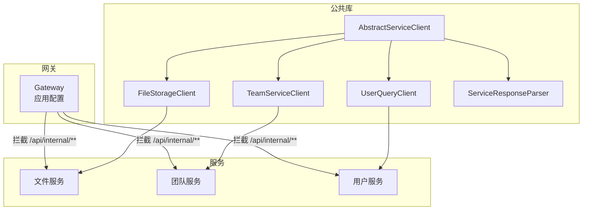
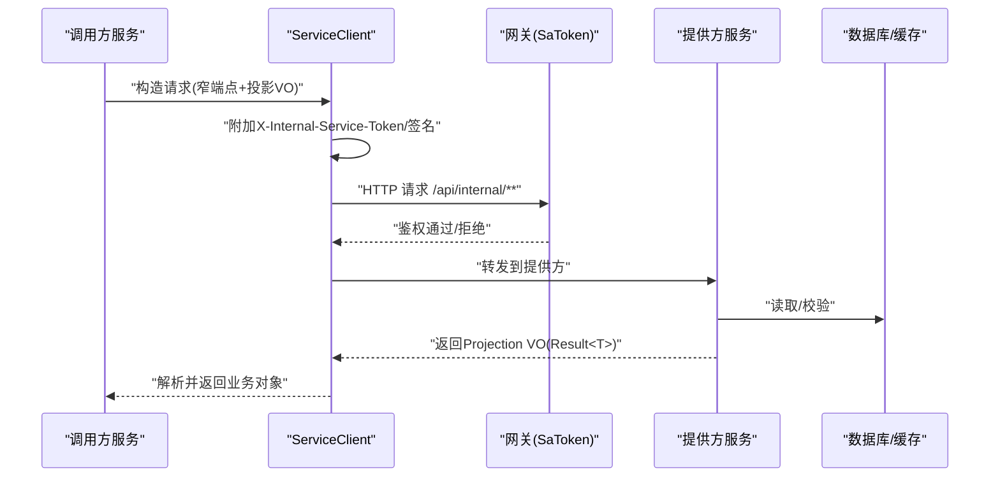
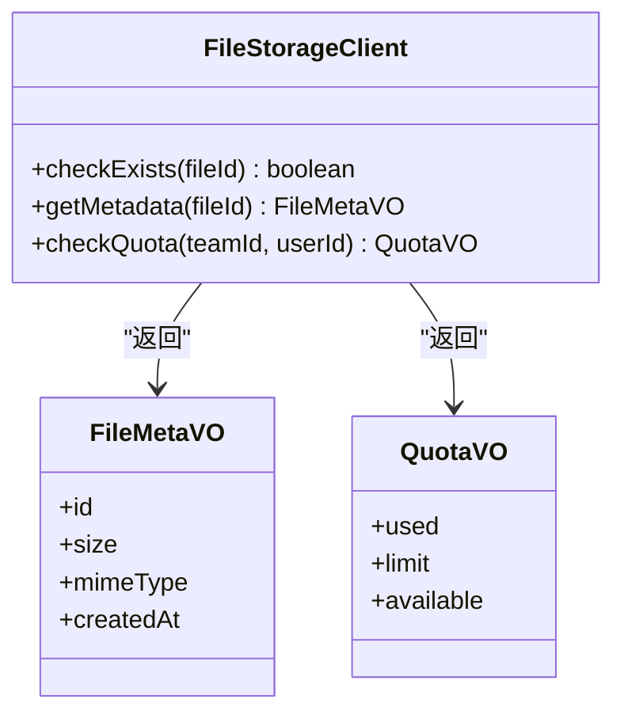
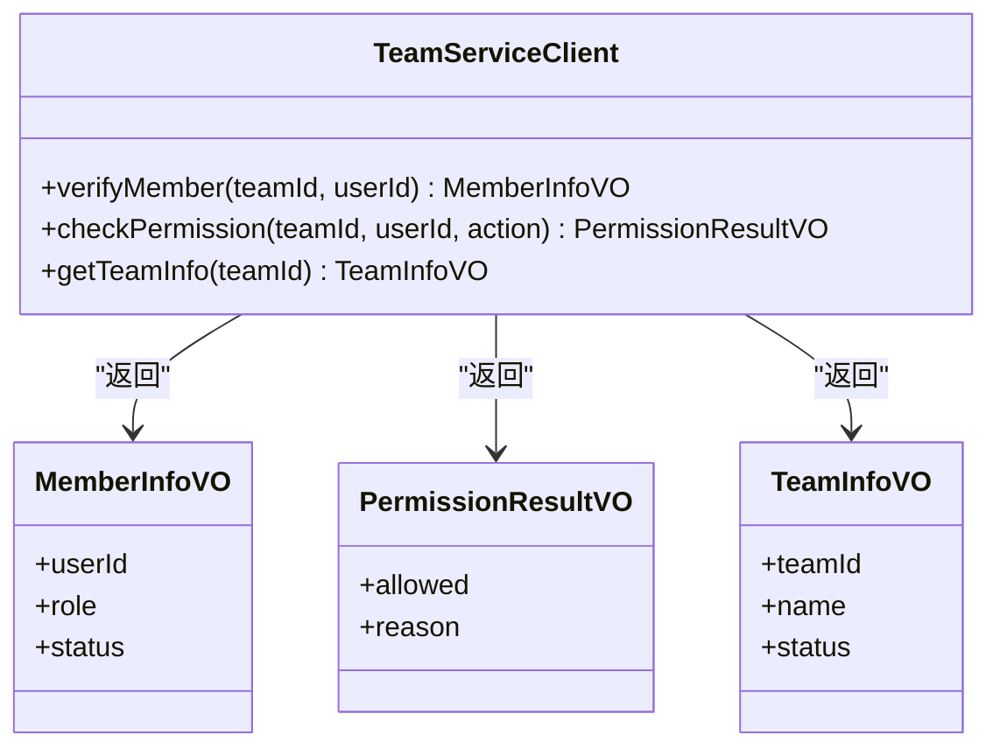
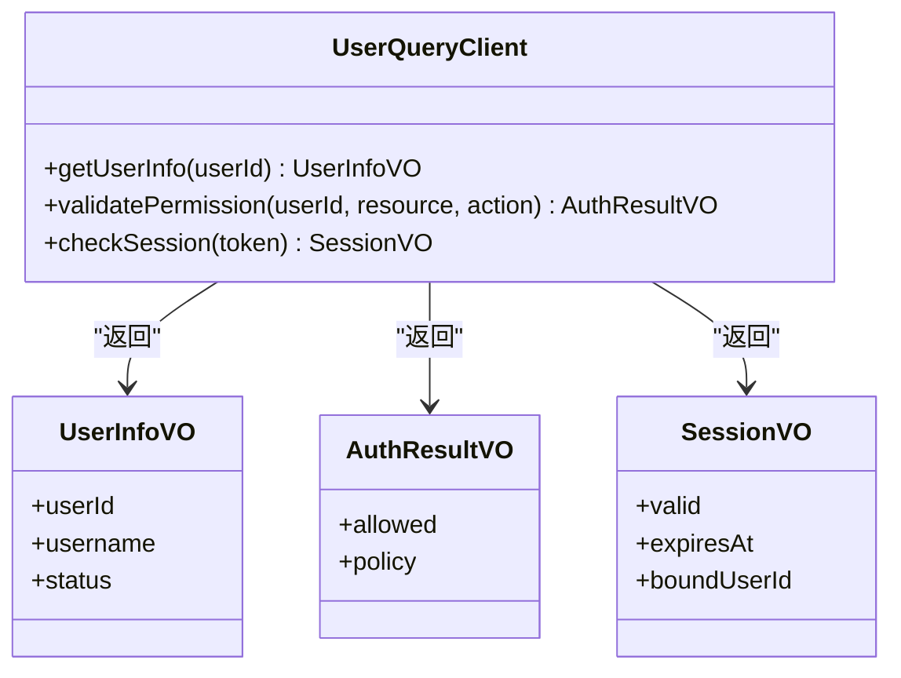
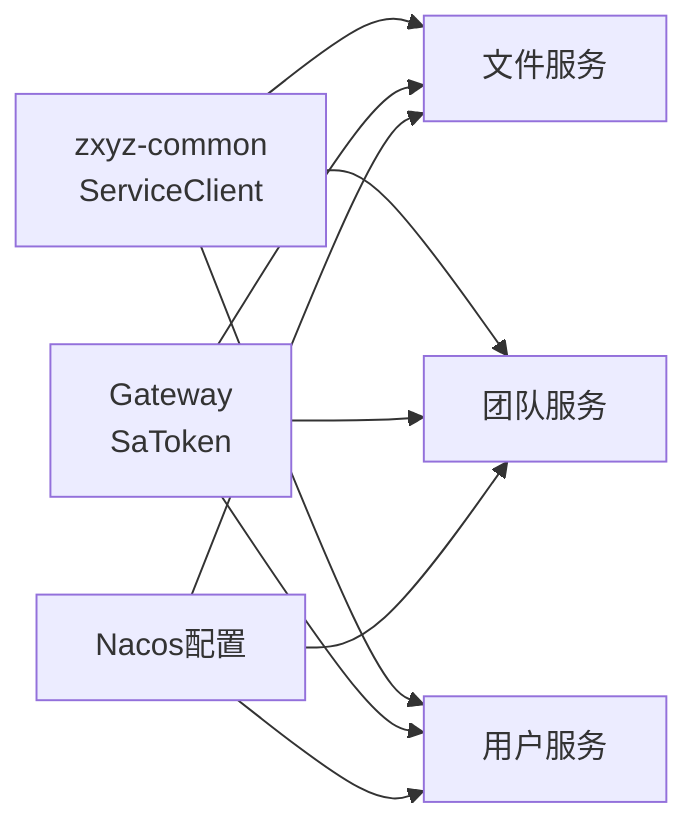

# 内部服务接口

<cite>
**本文引用的文件**   
- [AbstractServiceClient.java](file://ZXYZdatabaseBack/zxyz-common/src/main/java/uno/acloud/client/AbstractServiceClient.java)
- [FileStorageClient.java](file://ZXYZdatabaseBack/zxyz-common/src/main/java/uno/acloud/client/FileStorageClient.java)
- [TeamServiceClient.java](file://ZXYZdatabaseBack/zxyz-common/src/main/java/uno/acloud/client/TeamServiceClient.java)
- [UserQueryClient.java](file://ZXYZdatabaseBack/zxyz-common/src/main/java/uno/acloud/client/UserQueryClient.java)
- [ServiceResponseParser.java](file://ZXYZdatabaseBack/zxyz-common/src/main/java/uno/acloud/client/ServiceResponseParser.java)
- [application.yml](file://ZXYZdatabaseBack/zxyz-gateway/src/main/resources/application.yml)
- [SaTokenConfigure.java](file://ZXYZdatabaseBack/ZXYZdatabaseBack/zxyz-admin-service/src/main/java/uno/acloud/admin/config/SaTokenConfigure.java)
- [zxyz-file-service.yml](file://nacos-config/zxyz-file-service.yml)
- [zxyz-team-service.yml](file://nacos-config/zxyz-team-service.yml)
- [zxyz-user-service.yml](file://nacos-config/zxyz-user-service.yml)
- [api-contract.md](file://docs/api-contract.md)
- [architecture.md](file://docs/architecture.md)
</cite>

## 目录
1. [简介](#简介)
2. [项目结构](#项目结构)
3. [核心组件](#核心组件)
4. [架构总览](#架构总览)
5. [详细组件分析](#详细组件分析)
6. [依赖关系分析](#依赖关系分析)
7. [性能与可靠性](#性能与可靠性)
8. [故障排查指南](#故障排查指南)
9. [结论](#结论)
10. [附录](#附录)

## 简介
本文件为 ZXYZ 项目的“内部服务接口”规范文档，聚焦微服务间同步通信的约定与实践。内容涵盖：
- 内部鉴权机制：X-Internal-Service-Token
- 窄端点设计原则与投影 VO 模式
- 各服务的内部接口清单（文件、团队、用户）
- 错误处理、超时重试、熔断降级策略
- 请求/响应示例与安全最佳实践（Token 生成验证、签名、防重放）

本规范适用于所有后端服务开发者与集成方，确保跨服务调用的一致性与安全性。

## 项目结构
ZXYZ 采用多模块 Maven 工程，包含多个独立的后端服务与公共库。内部服务通信通过 zxyz-common 中的 ServiceClient 抽象与各具体客户端实现完成；网关层通过 SaToken 过滤器拒绝公网访问 /api/internal/** 路径。

图表来源
- [application.yml](file://ZXYZdatabaseBack/zxyz-gateway/src/main/resources/application.yml)
- [AbstractServiceClient.java](file://ZXYZdatabaseBack/zxyz-common/src/main/java/uno/acloud/client/AbstractServiceClient.java)
- [FileStorageClient.java](file://ZXYZdatabaseBack/zxyz-common/src/main/java/uno/acloud/client/FileStorageClient.java)
- [TeamServiceClient.java](file://ZXYZdatabaseBack/zxyz-common/src/main/java/uno/acloud/client/TeamServiceClient.java)
- [UserQueryClient.java](file://ZXYZdatabaseBack/zxyz-common/src/main/java/uno/acloud/client/UserQueryClient.java)
- [ServiceResponseParser.java](file://ZXYZdatabaseBack/zxyz-common/src/main/java/uno/acloud/client/ServiceResponseParser.java)

章节来源
- [api-contract.md](file://docs/api-contract.md)
- [architecture.md](file://docs/architecture.md)

## 核心组件
- AbstractServiceClient：统一封装 HTTP 客户端能力，注入 X-Internal-Service-Token 等通用头，提供统一的响应解析与异常转换。
- FileStorageClient：面向文件服务的内部调用客户端，暴露文件存在性检查、元数据查询、存储配额检查等窄端点方法。
- TeamServiceClient：面向团队服务的内部调用客户端，暴露成员验证、权限检查、团队信息查询等方法。
- UserQueryClient：面向用户服务的内部调用客户端，暴露用户信息获取、权限验证、会话检查等方法。
- ServiceResponseParser：统一解析 Result<T> 响应体，提取 code/data/message，并转换为业务异常或成功结果。

章节来源
- [AbstractServiceClient.java](file://ZXYZdatabaseBack/zxyz-common/src/main/java/uno/acloud/client/AbstractServiceClient.java)
- [FileStorageClient.java](file://ZXYZdatabaseBack/zxyz-common/src/main/java/uno/acloud/client/FileStorageClient.java)
- [TeamServiceClient.java](file://ZXYZdatabaseBack/zxyz-common/src/main/java/uno/acloud/client/TeamServiceClient.java)
- [UserQueryClient.java](file://ZXYZdatabaseBack/zxyz-common/src/main/java/uno/acloud/client/UserQueryClient.java)
- [ServiceResponseParser.java](file://ZXYZdatabaseBack/zxyz-common/src/main/java/uno/acloud/client/ServiceResponseParser.java)

## 架构总览
内部服务调用的端到端流程如下：
- 调用方通过 ServiceClient 发起 HTTP 请求，自动附加 X-Internal-Service-Token 与必要签名参数。
- 请求经 Gateway，被 SaToken 过滤器拦截，校验内部 Token 与路径白名单，拒绝公网访问。
- 目标服务接收请求，进行二次鉴权与权限校验，返回仅包含调用方所需字段的 Projection VO。
- 调用方通过 ServiceResponseParser 解析响应，统一处理成功与失败分支。

图表来源
- [application.yml](file://ZXYZdatabaseBack/zxyz-gateway/src/main/resources/application.yml)
- [AbstractServiceClient.java](file://ZXYZdatabaseBack/zxyz-common/src/main/java/uno/acloud/client/AbstractServiceClient.java)
- [ServiceResponseParser.java](file://ZXYZdatabaseBack/zxyz-common/src/main/java/uno/acloud/client/ServiceResponseParser.java)

## 详细组件分析

### 内部鉴权与网关拦截
- 内部 Token 机制：调用方在请求头中携带 X-Internal-Service-Token，由提供方基于共享密钥或注册中心配置进行校验。
- 网关拦截：/api/internal/** 路径由 Gateway 的 SaToken 过滤器强制校验，未通过则直接拒绝，防止公网暴露。
- 安全建议：Token 应短生命周期、最小权限、按服务维度隔离；必要时结合签名与时间戳防重放。

章节来源
- [application.yml](file://ZXYZdatabaseBack/zxyz-gateway/src/main/resources/application.yml)
- [SaTokenConfigure.java](file://ZXYZdatabaseBack/ZXYZdatabaseBack/zxyz-admin-service/src/main/java/uno/acloud/admin/config/SaTokenConfigure.java)

### 文件服务内部接口
- 文件存在性检查：用于快速判断文件是否存在，避免重复上传或无效下载。
- 元数据查询：返回调用方所需的精简字段（如大小、类型、创建时间），禁止返回完整实体。
- 存储配额检查：返回当前团队/用户的可用空间与已用空间，供上层决策。

图表来源
- [FileStorageClient.java](file://ZXYZdatabaseBack/zxyz-common/src/main/java/uno/acloud/client/FileStorageClient.java)

章节来源
- [FileStorageClient.java](file://ZXYZdatabaseBack/zxyz-common/src/main/java/uno/acloud/client/FileStorageClient.java)

### 团队服务内部接口
- 成员验证：校验指定用户是否为团队成员及角色。
- 权限检查：基于角色/策略判断对资源的操作权限。
- 团队信息查询：返回调用方需要的团队基本信息与状态。

图表来源
- [TeamServiceClient.java](file://ZXYZdatabaseBack/zxyz-common/src/main/java/uno/acloud/client/TeamServiceClient.java)

章节来源
- [TeamServiceClient.java](file://ZXYZdatabaseBack/zxyz-common/src/main/java/uno/acloud/client/TeamServiceClient.java)

### 用户服务内部接口
- 用户信息获取：返回调用方所需的用户基础信息与状态。
- 权限验证：基于用户上下文与策略进行权限判定。
- 会话检查：校验会话有效性、过期时间与绑定信息。

图表来源
- [UserQueryClient.java](file://ZXYZdatabaseBack/zxyz-common/src/main/java/uno/acloud/client/UserQueryClient.java)

章节来源
- [UserQueryClient.java](file://ZXYZdatabaseBack/zxyz-common/src/main/java/uno/acloud/client/UserQueryClient.java)

### 响应解析与统一错误模型
- 统一响应体：Result<T>，code=1 表示成功，其他为错误码。
- 解析器职责：将 JSON 映射为 VO，提取 data/message，并在非成功时抛出标准化异常。
- 错误分类：网络异常、鉴权失败、业务校验失败、服务端异常等，便于调用方区分处理。

章节来源
- [ServiceResponseParser.java](file://ZXYZdatabaseBack/zxyz-common/src/main/java/uno/acloud/client/ServiceResponseParser.java)

## 依赖关系分析
- 调用方依赖 zxyz-common 中的 ServiceClient 抽象与各具体客户端。
- 网关依赖 SaToken 过滤器对内部路径进行强校验。
- 各服务通过 Nacos 配置管理内部 Token、超时、重试、熔断等参数。

图表来源
- [AbstractServiceClient.java](file://ZXYZdatabaseBack/zxyz-common/src/main/java/uno/acloud/client/AbstractServiceClient.java)
- [application.yml](file://ZXYZdatabaseBack/zxyz-gateway/src/main/resources/application.yml)
- [zxyz-file-service.yml](file://nacos-config/zxyz-file-service.yml)
- [zxyz-team-service.yml](file://nacos-config/zxyz-team-service.yml)
- [zxyz-user-service.yml](file://nacos-config/zxyz-user-service.yml)

章节来源
- [zxyz-file-service.yml](file://nacos-config/zxyz-file-service.yml)
- [zxyz-team-service.yml](file://nacos-config/zxyz-team-service.yml)
- [zxyz-user-service.yml](file://nacos-config/zxyz-user-service.yml)

## 性能与可靠性
- 超时设置：为每个 ServiceClient 设置合理的连接、读、写超时，避免级联雪崩。
- 重试策略：对幂等 GET 类接口可启用有限次重试，带指数退避与抖动；POST/PUT 谨慎使用。
- 熔断降级：当提供方错误率或延迟超过阈值时触发熔断，返回降级结果或缓存数据。
- 限流保护：对高频内部接口实施限流，防止突发流量压垮下游。
- 监控告警：记录调用耗时、成功率、错误码分布，设置阈值告警。

章节来源
- [zxyz-file-service.yml](file://nacos-config/zxyz-file-service.yml)
- [zxyz-team-service.yml](file://nacos-config/zxyz-team-service.yml)
- [zxyz-user-service.yml](file://nacos-config/zxyz-user-service.yml)

## 故障排查指南
- 鉴权失败：检查 X-Internal-Service-Token 是否正确传递且未被篡改；确认网关与提供方 Token 一致。
- 超时错误：检查网络连通性、提供方负载、数据库慢查询；适当调整超时与重试。
- 熔断触发：查看错误率与延迟指标，定位提供方异常；临时降级至缓存或默认值。
- 响应解析异常：确认 Result 结构与字段命名一致性；避免引入不必要的 treeToValue。
- 日志追踪：为每次内部调用添加 traceId，串联网关、调用方、提供方日志。

章节来源
- [ServiceResponseParser.java](file://ZXYZdatabaseBack/zxyz-common/src/main/java/uno/acloud/client/ServiceResponseParser.java)
- [application.yml](file://ZXYZdatabaseBack/zxyz-gateway/src/main/resources/application.yml)

## 结论
通过统一的 ServiceClient、严格的内部 Token 鉴权、窄端点与投影 VO 模式，以及完善的错误处理与可靠性策略，ZXYZ 实现了稳定、安全、高效的微服务间通信。建议在迭代过程中持续完善监控与治理，保持接口契约的稳定演进。

## 附录

### 内部接口清单与示例
- 文件服务内部接口
  - 文件存在性检查
    - 请求示例：GET /api/internal/file/exist?fileId=xxx
    - 响应示例：{"code":1,"data":{"exists":true},"message":"success"}
  - 元数据查询
    - 请求示例：GET /api/internal/file/metadata?fileId=xxx
    - 响应示例：{"code":1,"data":{"size":1024,"mimeType":"image/png","createdAt":"2024-01-01T00:00:00Z"},"message":"success"}
  - 存储配额检查
    - 请求示例：GET /api/internal/file/quota?teamId=xxx&userId=yyy
    - 响应示例：{"code":1,"data":{"used":5000,"limit":10000,"available":5000},"message":"success"}

- 团队服务内部接口
  - 成员验证
    - 请求示例：GET /api/internal/team/member?teamId=xxx&userId=yyy
    - 响应示例：{"code":1,"data":{"userId":"yyy","role":"member","status":"active"},"message":"success"}
  - 权限检查
    - 请求示例：GET /api/internal/team/permission?teamId=xxx&userId=yyy&action=delete
    - 响应示例：{"code":1,"data":{"allowed":true,"reason":"role-based"},"message":"success"}
  - 团队信息查询
    - 请求示例：GET /api/internal/team/info?teamId=xxx
    - 响应示例：{"code":1,"data":{"teamId":"xxx","name":"Alpha","status":"active"},"message":"success"}

- 用户服务内部接口
  - 用户信息获取
    - 请求示例：GET /api/internal/user/info?userId=yyy
    - 响应示例：{"code":1,"data":{"userId":"yyy","username":"alice","status":"active"},"message":"success"}
  - 权限验证
    - 请求示例：GET /api/internal/user/auth?userId=yyy&resource=file&action=download
    - 响应示例：{"code":1,"data":{"allowed":true,"policy":"rbac"},"message":"success"}
  - 会话检查
    - 请求示例：GET /api/internal/user/session?token=zzz
    - 响应示例：{"code":1,"data":{"valid":true,"expiresAt":"2024-12-31T23:59:59Z","boundUserId":"yyy"},"message":"success"}

### 安全最佳实践
- Token 生成与验证
  - 使用服务维度的共享密钥生成短期有效的 X-Internal-Service-Token。
  - 提供方校验 Token 的完整性与时效性，拒绝过期或伪造令牌。
- 接口签名
  - 对关键接口增加签名参数（如 timestamp、nonce、sign），防止篡改与重放。
- 防重放攻击
  - 服务端维护 nonce 集合或使用时间窗口去重，拒绝重复请求。
- 最小权限原则
  - 内部接口仅暴露必要字段与方法，避免泄露敏感数据。
- 传输安全
  - 内网通信建议使用 HTTPS 或 mTLS，避免明文传输。

章节来源
- [api-contract.md](file://docs/api-contract.md)
- [architecture.md](file://docs/architecture.md)