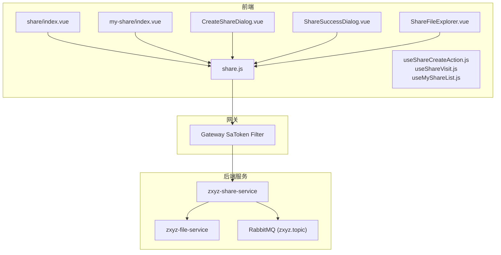
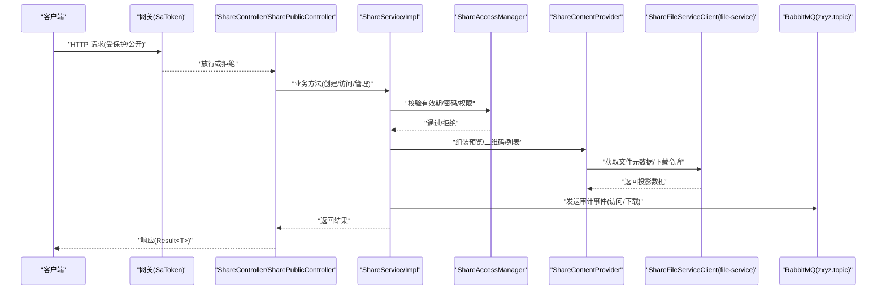
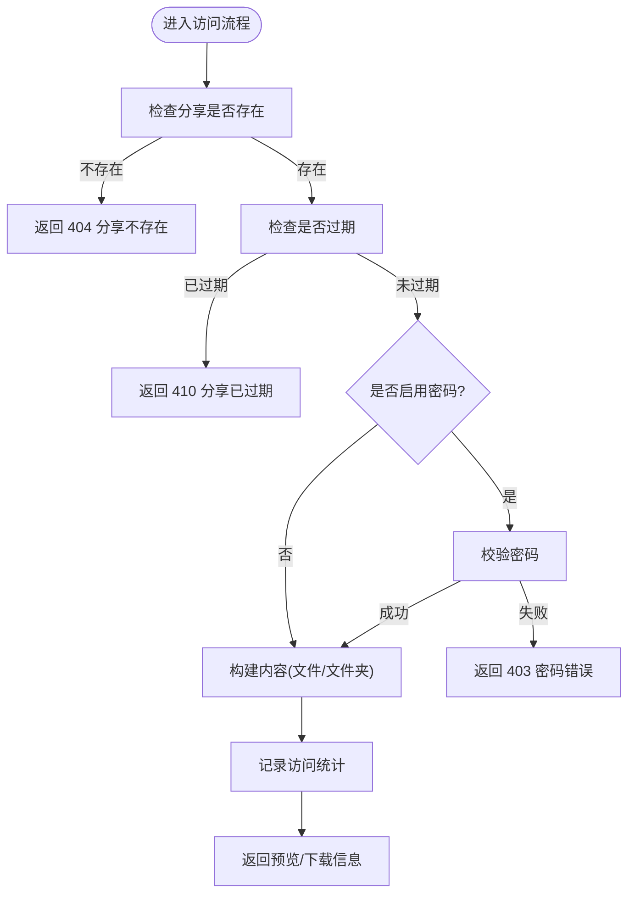
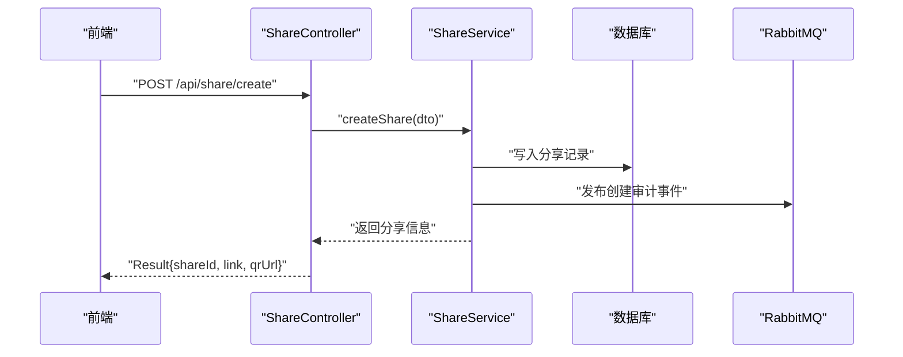
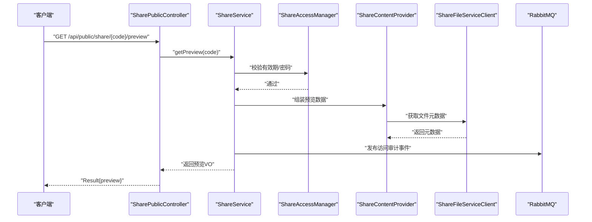
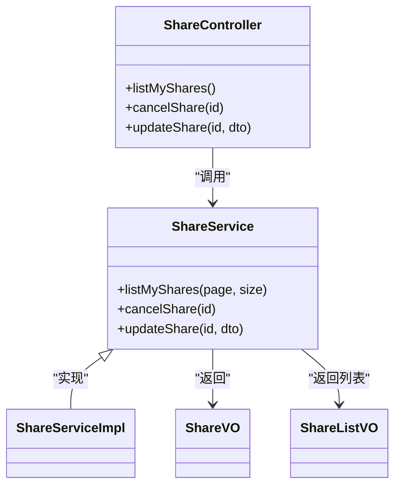
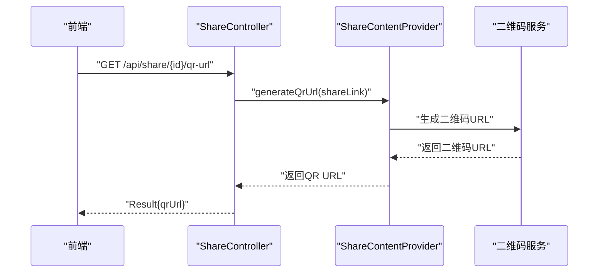
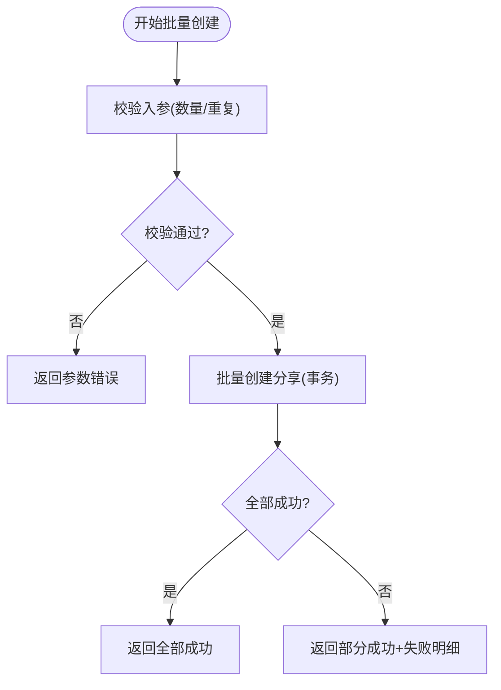
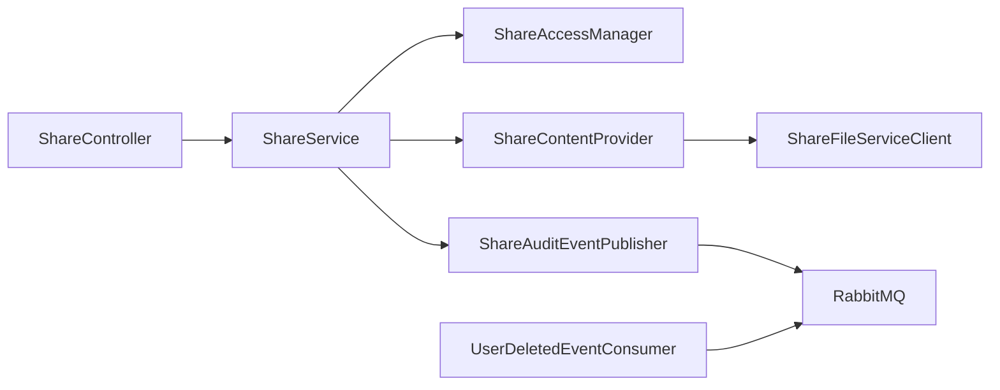

# 分享管理接口

<cite>
**本文引用的文件**   
- [schema_share.sql](file://ZXYZdatabaseBack/sql/schema_share.sql)
- [zxyz-share-service/pom.xml](file://ZXYZdatabaseBack/zxyz-share-service/pom.xml)
- [ZxyzShareApplication.java](file://ZXYZdatabaseBack/zxyz-share-service/src/main/java/uno/acloud/share/ZxyzShareApplication.java)
- [application.yml](file://ZXYZdatabaseBack/zxyz-share-service/src/main/resources/application.yml)
- [application-dev.yml](file://ZXYZdatabaseBack/zxyz-share-service/src/main/resources/application-dev.yml)
- [application-prod.yml](file://ZXYZdatabaseBack/zxyz-share-service/src/main/resources/application-prod.yml)
- [ShareService.java](file://ZXYZdatabaseBack/zxyz-share-service/src/main/java/uno/acloud/share/service/ShareService.java)
- [ShareServiceImpl.java](file://ZXYZdatabaseBack/zxyz-share-service/src/main/java/uno/acloud/share/service/impl/ShareServiceImpl.java)
- [ShareAccessManager.java](file://ZXYZdatabaseBack/zxyz-share-service/src/main/java/uno/acloud/share/service/ShareAccessManager.java)
- [ShareContentProvider.java](file://ZXYZdatabaseBack/zxyz-share-service/src/main/java/uno/acloud/share/service/ShareContentProvider.java)
- [ShareController.java](file://ZXYZdatabaseBack/zxyz-share-service/src/main/java/uno/acloud/share/controller/ShareController.java)
- [SharePublicController.java](file://ZXYZdatabaseBack/zxyz-share-service/src/main/java/uno/acloud/share/controller/SharePublicController.java)
- [ShareFileServiceClient.java](file://ZXYZdatabaseBack/zxyz-share-service/src/main/java/uno/acloud/share/infrastructure/client/ShareFileServiceClient.java)
- [ShareAccessRateLimiter.java](file://ZXYZdatabaseBack/zxyz-share-service/src/main/java/uno/acloud/share/service/ShareAccessRateLimiter.java)
- [ShareDTO.java](file://ZXYZdatabaseBack/zxyz-share-service/src/main/java/uno/acloud/share/dto/ShareDTO.java)
- [ShareVO.java](file://ZXYZdatabaseBack/zxyz-share-service/src/main/java/uno/acloud/share/vo/ShareVO.java)
- [ShareListVO.java](file://ZXYZdatabaseBack/zxyz-share-service/src/main/java/uno/acloud/share/vo/ShareListVO.java)
- [ShareDownloadVO.java](file://ZXYZdatabaseBack/zxyz-share-service/src/main/java/uno/acloud/share/vo/ShareDownloadVO.java)
- [SharePreviewVO.java](file://ZXYZdatabaseBack/zxyz-share-service/src/main/java/uno/acloud/share/vo/SharePreviewVO.java)
- [ShareAuditEventPublisher.java](file://ZXYZdatabaseBack/zxyz-share-service/src/main/java/uno/acloud/share/mq/ShareAuditEventPublisher.java)
- [UserDeletedEventConsumer.java](file://ZXYZdatabaseBack/zxyz-share-service/src/main/java/uno/acloud/share/mq/UserDeletedEventConsumer.java)
- [share.js](file://ZXYZdatabaseFront/src/api/share.js)
- [CreateShareDialog.vue](file://ZXYZdatabaseFront/src/components/CreateShareDialog.vue)
- [ShareSuccessDialog.vue](file://ZXYZdatabaseFront/src/components/ShareSuccessDialog.vue)
- [useShareCreateAction.js](file://ZXYZdatabaseFront/src/composables/useShareCreateAction.js)
- [useShareVisit.js](file://ZXYZdatabaseFront/src/composables/useShareVisit.js)
- [useMyShareList.js](file://ZXYZdatabaseFront/src/composables/useMyShareList.js)
- [ShareFileExplorer.vue](file://ZXYZdatabaseFront/src/components/ShareFileExplorer.vue)
- [share/index.vue](file://ZXYZdatabaseFront/src/views/share/index.vue)
- [my-share/index.vue](file://ZXYZdatabaseFront/src/views/my-share/index.vue)
- [api-contract.md](file://docs/api-contract.md)
- [architecture.md](file://docs/architecture.md)
</cite>

## 目录
1. [简介](#简介)
2. [项目结构](#项目结构)
3. [核心组件](#核心组件)
4. [架构总览](#架构总览)
5. [详细组件分析](#详细组件分析)
6. [依赖关系分析](#依赖关系分析)
7. [性能与限流](#性能与限流)
8. [故障排查指南](#故障排查指南)
9. [结论](#结论)
10. [附录：API 规范与示例](#附录api-规范与示例)

## 简介
本文件为 ZXYZ 项目的“分享管理”RESTful API 文档，覆盖以下能力：
- 分享链接创建：支持文件分享、文件夹分享；可设置有效期、密码保护、访问权限。
- 分享访问：公开访问、密码验证、访问统计（含下载计数）。
- 分享管理：查看我的分享、取消分享、更新分享设置（如密码、有效期、权限）。
- 安全与风控：权限模型、访问控制策略、防盗链机制、下载限流策略。
- 扩展能力：分享二维码生成、分享链接预览、批量分享。

该服务基于微服务架构，采用窄端点与投影模式，内部调用通过 ServiceClient + X-Internal-Service-Token 鉴权，异步事件通过 RabbitMQ Topic Exchange zxyz.topic 传递。

## 项目结构
分享功能由后端 share-service 模块与前端 share 相关页面/组件共同实现：
- 后端 share-service
  - Controller：对外 REST 接口（认证用户）与公开接口（匿名访问）
  - Service：分享生命周期、访问控制、内容提供、限流等
  - Infrastructure：对 file-service 的客户端调用
  - MQ：审计事件发布、用户删除事件消费
  - VO/DTO：对外投影与请求体
- 前端
  - API 封装：share.js
  - 交互组件：CreateShareDialog、ShareSuccessDialog、ShareFileExplorer
  - 组合式逻辑：useShareCreateAction、useShareVisit、useMyShareList
  - 视图页：share/index.vue、my-share/index.vue

图表来源
- [share/index.vue](file://ZXYZdatabaseFront/src/views/share/index.vue)
- [my-share/index.vue](file://ZXYZdatabaseFront/src/views/my-share/index.vue)
- [share.js](file://ZXYZdatabaseFront/src/api/share.js)
- [ZxyzShareApplication.java](file://ZXYZdatabaseBack/zxyz-share-service/src/main/java/uno/acloud/share/ZxyzShareApplication.java)
- [ShareController.java](file://ZXYZdatabaseBack/zxyz-share-service/src/main/java/uno/acloud/share/controller/ShareController.java)
- [SharePublicController.java](file://ZXYZdatabaseBack/zxyz-share-service/src/main/java/uno/acloud/share/controller/SharePublicController.java)
- [ShareFileServiceClient.java](file://ZXYZdatabaseBack/zxyz-share-service/src/main/java/uno/acloud/share/infrastructure/client/ShareFileServiceClient.java)

章节来源
- [ZxyzShareApplication.java](file://ZXYZdatabaseBack/zxyz-share-service/src/main/java/uno/acloud/share/ZxyzShareApplication.java)
- [application.yml](file://ZXYZdatabaseBack/zxyz-share-service/src/main/resources/application.yml)
- [application-dev.yml](file://ZXYZdatabaseBack/zxyz-share-service/src/main/resources/application-dev.yml)
- [application-prod.yml](file://ZXYZdatabaseBack/zxyz-share-service/src/main/resources/application-prod.yml)
- [pom.xml](file://ZXYZdatabaseBack/zxyz-share-service/pom.xml)

## 核心组件
- 控制器层
  - ShareController：受保护的分享管理接口（创建、查询、更新、取消）
  - SharePublicController：公开的分享访问接口（预览、下载、密码校验）
- 服务层
  - ShareService/ShareServiceImpl：分享生命周期管理、权限校验、统计记录
  - ShareAccessManager：访问控制策略（有效期、密码、权限）
  - ShareContentProvider：内容聚合（文件/文件夹）、二维码生成、预览数据组装
  - ShareAccessRateLimiter：访问与下载限流
- 基础设施
  - ShareFileServiceClient：调用 file-service 获取文件元数据与下载令牌
  - MQ：ShareAuditEventPublisher（审计事件）、UserDeletedEventConsumer（清理失效分享）
- 数据模型
  - DTO/VO：ShareDTO、ShareVO、ShareListVO、ShareDownloadVO、SharePreviewVO
- 数据库
  - schema_share.sql：分享表结构与索引

章节来源
- [ShareController.java](file://ZXYZdatabaseBack/zxyz-share-service/src/main/java/uno/acloud/share/controller/ShareController.java)
- [SharePublicController.java](file://ZXYZdatabaseBack/zxyz-share-service/src/main/java/uno/acloud/share/controller/SharePublicController.java)
- [ShareService.java](file://ZXYZdatabaseBack/zxyz-share-service/src/main/java/uno/acloud/share/service/ShareService.java)
- [ShareServiceImpl.java](file://ZXYZdatabaseBack/zxyz-share-service/src/main/java/uno/acloud/share/service/impl/ShareServiceImpl.java)
- [ShareAccessManager.java](file://ZXYZdatabaseBack/zxyz-share-service/src/main/java/uno/acloud/share/service/ShareAccessManager.java)
- [ShareContentProvider.java](file://ZXYZdatabaseBack/zxyz-share-service/src/main/java/uno/acloud/share/service/ShareContentProvider.java)
- [ShareAccessRateLimiter.java](file://ZXYZdatabaseBack/zxyz-share-service/src/main/java/uno/acloud/share/service/ShareAccessRateLimiter.java)
- [ShareFileServiceClient.java](file://ZXYZdatabaseBack/zxyz-share-service/src/main/java/uno/acloud/share/infrastructure/client/ShareFileServiceClient.java)
- [schema_share.sql](file://ZXYZdatabaseBack/sql/schema_share.sql)

## 架构总览
分享服务在网关层统一鉴权后，将受保护接口路由到 ShareController，公开接口允许匿名访问但需满足分享条件（密码、有效期）。服务层通过 ShareAccessManager 进行权限判定，ShareContentProvider 聚合内容并生成预览/二维码，必要时调用 file-service 获取下载令牌。所有访问与下载行为通过 MQ 上报审计事件，便于后续分析与合规。

图表来源
- [ShareController.java](file://ZXYZdatabaseBack/zxyz-share-service/src/main/java/uno/acloud/share/controller/ShareController.java)
- [SharePublicController.java](file://ZXYZdatabaseBack/zxyz-share-service/src/main/java/uno/acloud/share/controller/SharePublicController.java)
- [ShareService.java](file://ZXYZdatabaseBack/zxyz-share-service/src/main/java/uno/acloud/share/service/ShareService.java)
- [ShareServiceImpl.java](file://ZXYZdatabaseBack/zxyz-share-service/src/main/java/uno/acloud/share/service/impl/ShareServiceImpl.java)
- [ShareAccessManager.java](file://ZXYZdatabaseBack/zxyz-share-service/src/main/java/uno/acloud/share/service/ShareAccessManager.java)
- [ShareContentProvider.java](file://ZXYZdatabaseBack/zxyz-share-service/src/main/java/uno/acloud/share/service/ShareContentProvider.java)
- [ShareFileServiceClient.java](file://ZXYZdatabaseBack/zxyz-share-service/src/main/java/uno/acloud/share/infrastructure/client/ShareFileServiceClient.java)

## 详细组件分析

### 分享权限模型与访问控制
- 权限维度
  - 分享类型：文件分享、文件夹分享
  - 访问方式：公开访问、密码保护
  - 有效期：创建时间至过期时间
  - 访问者身份：匿名用户、已登录用户（用于统计）
- 访问控制流程
  - 校验分享是否存在且未过期
  - 若启用密码，则校验密码
  - 根据分享类型决定内容聚合策略（单文件或文件夹树）
  - 记录访问统计（访问次数、下载次数、最近访问时间）

图表来源
- [ShareAccessManager.java](file://ZXYZdatabaseBack/zxyz-share-service/src/main/java/uno/acloud/share/service/ShareAccessManager.java)
- [ShareServiceImpl.java](file://ZXYZdatabaseBack/zxyz-share-service/src/main/java/uno/acloud/share/service/impl/ShareServiceImpl.java)

章节来源
- [schema_share.sql](file://ZXYZdatabaseBack/sql/schema_share.sql)
- [ShareAccessManager.java](file://ZXYZdatabaseBack/zxyz-share-service/src/main/java/uno/acloud/share/service/ShareAccessManager.java)
- [ShareServiceImpl.java](file://ZXYZdatabaseBack/zxyz-share-service/src/main/java/uno/acloud/share/service/impl/ShareServiceImpl.java)

### 分享创建接口（文件/文件夹、有效期、密码）
- 输入参数
  - 资源标识：文件ID或文件夹ID
  - 分享类型：file/folder
  - 有效期：expireAt（可选）
  - 密码：password（可选）
  - 权限：allowDownload（可选）
- 处理逻辑
  - 校验资源归属与权限
  - 生成唯一分享码
  - 持久化分享记录
  - 返回分享链接与二维码数据
- 输出
  - 分享链接、二维码URL、有效期、是否密码保护

图表来源
- [ShareController.java](file://ZXYZdatabaseBack/zxyz-share-service/src/main/java/uno/acloud/share/controller/ShareController.java)
- [ShareServiceImpl.java](file://ZXYZdatabaseBack/zxyz-share-service/src/main/java/uno/acloud/share/service/impl/ShareServiceImpl.java)
- [ShareAuditEventPublisher.java](file://ZXYZdatabaseBack/zxyz-share-service/src/main/java/uno/acloud/share/mq/ShareAuditEventPublisher.java)

章节来源
- [ShareController.java](file://ZXYZdatabaseBack/zxyz-share-service/src/main/java/uno/acloud/share/controller/ShareController.java)
- [ShareServiceImpl.java](file://ZXYZdatabaseBack/zxyz-share-service/src/main/java/uno/acloud/share/service/impl/ShareServiceImpl.java)
- [ShareDTO.java](file://ZXYZdatabaseBack/zxyz-share-service/src/main/java/uno/acloud/share/dto/ShareDTO.java)

### 分享访问接口（公开访问、密码验证、访问统计）
- 公开接口
  - GET /api/public/share/{code}/preview：获取分享预览（文件名、大小、是否密码保护、是否允许下载）
  - GET /api/public/share/{code}/download：触发下载（需要密码时先校验）
- 密码校验
  - POST /api/public/share/{code}/verify-password：提交密码并获取临时访问令牌
- 访问统计
  - 每次访问与下载均记录统计（访问IP、UA、时间戳、是否成功）

图表来源
- [SharePublicController.java](file://ZXYZdatabaseBack/zxyz-share-service/src/main/java/uno/acloud/share/controller/SharePublicController.java)
- [ShareServiceImpl.java](file://ZXYZdatabaseBack/zxyz-share-service/src/main/java/uno/acloud/share/service/impl/ShareServiceImpl.java)
- [ShareAccessManager.java](file://ZXYZdatabaseBack/zxyz-share-service/src/main/java/uno/acloud/share/service/ShareAccessManager.java)
- [ShareContentProvider.java](file://ZXYZdatabaseBack/zxyz-share-service/src/main/java/uno/acloud/share/service/ShareContentProvider.java)
- [ShareFileServiceClient.java](file://ZXYZdatabaseBack/zxyz-share-service/src/main/java/uno/acloud/share/infrastructure/client/ShareFileServiceClient.java)

章节来源
- [SharePublicController.java](file://ZXYZdatabaseBack/zxyz-share-service/src/main/java/uno/acloud/share/controller/SharePublicController.java)
- [ShareServiceImpl.java](file://ZXYZdatabaseBack/zxyz-share-service/src/main/java/uno/acloud/share/service/impl/ShareServiceImpl.java)
- [ShareVO.java](file://ZXYZdatabaseBack/zxyz-share-service/src/main/java/uno/acloud/share/vo/ShareVO.java)
- [SharePreviewVO.java](file://ZXYZdatabaseBack/zxyz-share-service/src/main/java/uno/acloud/share/vo/SharePreviewVO.java)

### 分享管理接口（查看我的分享、取消分享、更新设置）
- 查看我的分享
  - GET /api/share/my：分页查询当前用户的分享列表（支持按状态、时间筛选）
- 取消分享
  - DELETE /api/share/{id}：立即失效分享
- 更新分享设置
  - PUT /api/share/{id}：更新密码、有效期、下载权限等

图表来源
- [ShareController.java](file://ZXYZdatabaseBack/zxyz-share-service/src/main/java/uno/acloud/share/controller/ShareController.java)
- [ShareService.java](file://ZXYZdatabaseBack/zxyz-share-service/src/main/java/uno/acloud/share/service/ShareService.java)
- [ShareServiceImpl.java](file://ZXYZdatabaseBack/zxyz-share-service/src/main/java/uno/acloud/share/service/impl/ShareServiceImpl.java)
- [ShareVO.java](file://ZXYZdatabaseBack/zxyz-share-service/src/main/java/uno/acloud/share/vo/ShareVO.java)
- [ShareListVO.java](file://ZXYZdatabaseBack/zxyz-share-service/src/main/java/uno/acloud/share/vo/ShareListVO.java)

章节来源
- [ShareController.java](file://ZXYZdatabaseBack/zxyz-share-service/src/main/java/uno/acloud/share/controller/ShareController.java)
- [ShareService.java](file://ZXYZdatabaseBack/zxyz-share-service/src/main/java/uno/acloud/share/service/ShareService.java)
- [ShareServiceImpl.java](file://ZXYZdatabaseBack/zxyz-share-service/src/main/java/uno/acloud/share/service/impl/ShareServiceImpl.java)
- [ShareListVO.java](file://ZXYZdatabaseBack/zxyz-share-service/src/main/java/uno/acloud/share/vo/ShareListVO.java)

### 分享二维码生成与链接预览
- 二维码生成
  - 服务端生成分享链接的二维码图片URL（短链+签名防篡改）
  - 前端可直接渲染二维码组件
- 链接预览
  - 预览接口返回文件基本信息、是否密码保护、是否允许下载、剩余有效期

图表来源
- [ShareContentProvider.java](file://ZXYZdatabaseBack/zxyz-share-service/src/main/java/uno/acloud/share/service/ShareContentProvider.java)
- [ShareController.java](file://ZXYZdatabaseBack/zxyz-share-service/src/main/java/uno/acloud/share/controller/ShareController.java)

章节来源
- [ShareContentProvider.java](file://ZXYZdatabaseBack/zxyz-share-service/src/main/java/uno/acloud/share/service/ShareContentProvider.java)
- [SharePreviewVO.java](file://ZXYZdatabaseBack/zxyz-share-service/src/main/java/uno/acloud/share/vo/SharePreviewVO.java)

### 批量分享
- 场景：一次性为多个文件或文件夹创建分享
- 实现要点
  - 批量入参校验（数量上限、重复ID去重）
  - 事务性创建（部分失败回滚或记录失败明细）
  - 返回每个资源的分享结果（成功/失败原因）

章节来源
- [ShareController.java](file://ZXYZdatabaseBack/zxyz-share-service/src/main/java/uno/acloud/share/controller/ShareController.java)
- [ShareServiceImpl.java](file://ZXYZdatabaseBack/zxyz-share-service/src/main/java/uno/acloud/share/service/impl/ShareServiceImpl.java)

## 依赖关系分析
- 外部依赖
  - file-service：文件元数据与下载令牌
  - RabbitMQ：审计事件与用户删除事件
- 内部依赖
  - 网关：SaToken 鉴权与内部端点拦截
  - 配置中心：Nacos 动态配置（限流阈值、有效期默认值等）

图表来源
- [ShareController.java](file://ZXYZdatabaseBack/zxyz-share-service/src/main/java/uno/acloud/share/controller/ShareController.java)
- [ShareService.java](file://ZXYZdatabaseBack/zxyz-share-service/src/main/java/uno/acloud/share/service/ShareService.java)
- [ShareAccessManager.java](file://ZXYZdatabaseBack/zxyz-share-service/src/main/java/uno/acloud/share/service/ShareAccessManager.java)
- [ShareContentProvider.java](file://ZXYZdatabaseBack/zxyz-share-service/src/main/java/uno/acloud/share/service/ShareContentProvider.java)
- [ShareFileServiceClient.java](file://ZXYZdatabaseBack/zxyz-share-service/src/main/java/uno/acloud/share/infrastructure/client/ShareFileServiceClient.java)
- [ShareAuditEventPublisher.java](file://ZXYZdatabaseBack/zxyz-share-service/src/main/java/uno/acloud/share/mq/ShareAuditEventPublisher.java)
- [UserDeletedEventConsumer.java](file://ZXYZdatabaseBack/zxyz-share-service/src/main/java/uno/acloud/share/mq/UserDeletedEventConsumer.java)

章节来源
- [architecture.md](file://docs/architecture.md)
- [api-contract.md](file://docs/api-contract.md)

## 性能与限流
- 访问限流
  - 针对分享访问与下载接口实施速率限制（IP/分享码维度）
  - 默认阈值可通过 Nacos 动态调整
- 下载限流
  - 结合 file-service 的下载令牌与分片下载，避免大文件阻塞
- 缓存建议
  - 分享元数据短期缓存（Redis），降低高频访问压力
- 审计事件
  - 异步上报，避免同步阻塞主流程

章节来源
- [ShareAccessRateLimiter.java](file://ZXYZdatabaseBack/zxyz-share-service/src/main/java/uno/acloud/share/service/ShareAccessRateLimiter.java)
- [application.yml](file://ZXYZdatabaseBack/zxyz-share-service/src/main/resources/application.yml)
- [application-dev.yml](file://ZXYZdatabaseBack/zxyz-share-service/src/main/resources/application-dev.yml)
- [application-prod.yml](file://ZXYZdatabaseBack/zxyz-share-service/src/main/resources/application-prod.yml)

## 故障排查指南
- 常见问题
  - 分享不存在：检查分享码是否正确、是否被删除
  - 分享已过期：确认 expireAt 时间与当前时间
  - 密码错误：提示重新输入或联系分享者
  - 权限不足：检查分享是否允许下载、访问者是否为分享所有者
  - 频率限制：等待一段时间或减少请求频率
- 日志与审计
  - 关注 MQ 审计事件（访问/下载）
  - 查看服务日志中的异常堆栈与限流告警
- 恢复步骤
  - 更新分享设置（延长有效期、重置密码）
  - 重新生成分享链接并分发

章节来源
- [ShareAccessManager.java](file://ZXYZdatabaseBack/zxyz-share-service/src/main/java/uno/acloud/share/service/ShareAccessManager.java)
- [ShareAccessRateLimiter.java](file://ZXYZdatabaseBack/zxyz-share-service/src/main/java/uno/acloud/share/service/ShareAccessRateLimiter.java)
- [ShareAuditEventPublisher.java](file://ZXYZdatabaseBack/zxyz-share-service/src/main/java/uno/acloud/share/mq/ShareAuditEventPublisher.java)

## 结论
分享管理接口围绕“创建-访问-管理”的主线，结合严格的权限模型与访问控制策略，确保分享的安全性与可控性。通过限流、审计与异步事件机制，系统在可用性与安全性之间取得平衡。前端以组件化与组合式逻辑提升用户体验，后端以窄端点与投影模式保证服务间解耦与演进灵活性。

## 附录：API 规范与示例

### 通用约定
- 响应结构：Result<T>，code=1 表示成功
- 认证：受保护接口需携带会话 Cookie（Sa-Token），公开接口无需认证
- 内部端点：/api/internal/** 仅内网访问，网关拒绝公网

### 分享创建
- 路径：POST /api/share/create
- 请求体字段：resourceId、resourceType(file/folder)、expireAt、password、allowDownload
- 响应体字段：shareId、link、qrUrl、expireAt、isPasswordProtected、allowDownload
- 错误码：参数错误、权限不足、资源不存在

章节来源
- [ShareController.java](file://ZXYZdatabaseBack/zxyz-share-service/src/main/java/uno/acloud/share/controller/ShareController.java)
- [ShareDTO.java](file://ZXYZdatabaseBack/zxyz-share-service/src/main/java/uno/acloud/share/dto/ShareDTO.java)
- [ShareVO.java](file://ZXYZdatabaseBack/zxyz-share-service/src/main/java/uno/acloud/share/vo/ShareVO.java)

### 分享访问（预览）
- 路径：GET /api/public/share/{code}/preview
- 响应体字段：fileName、fileSize、isPasswordProtected、allowDownload、remainingDays
- 错误码：分享不存在、已过期、密码错误

章节来源
- [SharePublicController.java](file://ZXYZdatabaseBack/zxyz-share-service/src/main/java/uno/acloud/share/controller/SharePublicController.java)
- [SharePreviewVO.java](file://ZXYZdatabaseBack/zxyz-share-service/src/main/java/uno/acloud/share/vo/SharePreviewVO.java)

### 分享访问（下载）
- 路径：GET /api/public/share/{code}/download
- 说明：若启用密码，需先调用 verify-password 获取临时令牌
- 响应体字段：downloadToken、expiresIn、downloadUrl
- 错误码：分享不存在、已过期、密码错误、频率限制

章节来源
- [SharePublicController.java](file://ZXYZdatabaseBack/zxyz-share-service/src/main/java/uno/acloud/share/controller/SharePublicController.java)
- [ShareDownloadVO.java](file://ZXYZdatabaseBack/zxyz-share-service/src/main/java/uno/acloud/share/vo/ShareDownloadVO.java)

### 密码校验
- 路径：POST /api/public/share/{code}/verify-password
- 请求体字段：password
- 响应体字段：token、expiresIn
- 错误码：密码错误、分享不存在

章节来源
- [SharePublicController.java](file://ZXYZdatabaseBack/zxyz-share-service/src/main/java/uno/acloud/share/controller/SharePublicController.java)

### 查看我的分享
- 路径：GET /api/share/my?page=1&size=20
- 响应体字段：total、page、size、items[shareId、link、resourceType、status、expireAt]
- 错误码：无

章节来源
- [ShareController.java](file://ZXYZdatabaseBack/zxyz-share-service/src/main/java/uno/acloud/share/controller/ShareController.java)
- [ShareListVO.java](file://ZXYZdatabaseBack/zxyz-share-service/src/main/java/uno/acloud/share/vo/ShareListVO.java)

### 取消分享
- 路径：DELETE /api/share/{id}
- 响应体字段：success
- 错误码：分享不存在、权限不足

章节来源
- [ShareController.java](file://ZXYZdatabaseBack/zxyz-share-service/src/main/java/uno/acloud/share/controller/ShareController.java)

### 更新分享设置
- 路径：PUT /api/share/{id}
- 请求体字段：password、expireAt、allowDownload
- 响应体字段：updatedFields
- 错误码：分享不存在、权限不足、参数错误

章节来源
- [ShareController.java](file://ZXYZdatabaseBack/zxyz-share-service/src/main/java/uno/acloud/share/controller/ShareController.java)
- [ShareDTO.java](file://ZXYZdatabaseBack/zxyz-share-service/src/main/java/uno/acloud/share/dto/ShareDTO.java)

### 二维码生成
- 路径：GET /api/share/{id}/qr-url
- 响应体字段：qrUrl
- 错误码：分享不存在、权限不足

章节来源
- [ShareController.java](file://ZXYZdatabaseBack/zxyz-share-service/src/main/java/uno/acloud/share/controller/ShareController.java)
- [ShareContentProvider.java](file://ZXYZdatabaseBack/zxyz-share-service/src/main/java/uno/acloud/share/service/ShareContentProvider.java)

### 批量分享
- 路径：POST /api/share/batch-create
- 请求体字段：items[{resourceId, resourceType, expireAt, password, allowDownload}]
- 响应体字段：results[{resourceId, success, message}]
- 错误码：参数错误、权限不足、部分失败

章节来源
- [ShareController.java](file://ZXYZdatabaseBack/zxyz-share-service/src/main/java/uno/acloud/share/controller/ShareController.java)
- [ShareServiceImpl.java](file://ZXYZdatabaseBack/zxyz-share-service/src/main/java/uno/acloud/share/service/impl/ShareServiceImpl.java)

### 前端集成要点
- API 封装：share.js
- 创建分享：CreateShareDialog.vue + useShareCreateAction.js
- 访问分享：useShareVisit.js + ShareFileExplorer.vue
- 我的分享：my-share/index.vue + useMyShareList.js

章节来源
- [share.js](file://ZXYZdatabaseFront/src/api/share.js)
- [CreateShareDialog.vue](file://ZXYZdatabaseFront/src/components/CreateShareDialog.vue)
- [ShareSuccessDialog.vue](file://ZXYZdatabaseFront/src/components/ShareSuccessDialog.vue)
- [useShareCreateAction.js](file://ZXYZdatabaseFront/src/composables/useShareCreateAction.js)
- [useShareVisit.js](file://ZXYZdatabaseFront/src/composables/useShareVisit.js)
- [useMyShareList.js](file://ZXYZdatabaseFront/src/composables/useMyShareList.js)
- [ShareFileExplorer.vue](file://ZXYZdatabaseFront/src/components/ShareFileExplorer.vue)
- [share/index.vue](file://ZXYZdatabaseFront/src/views/share/index.vue)
- [my-share/index.vue](file://ZXYZdatabaseFront/src/views/my-share/index.vue)