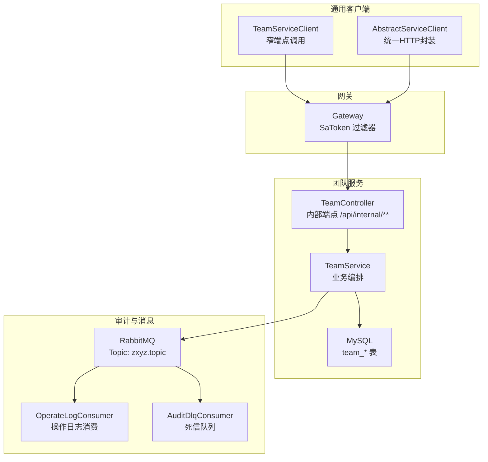
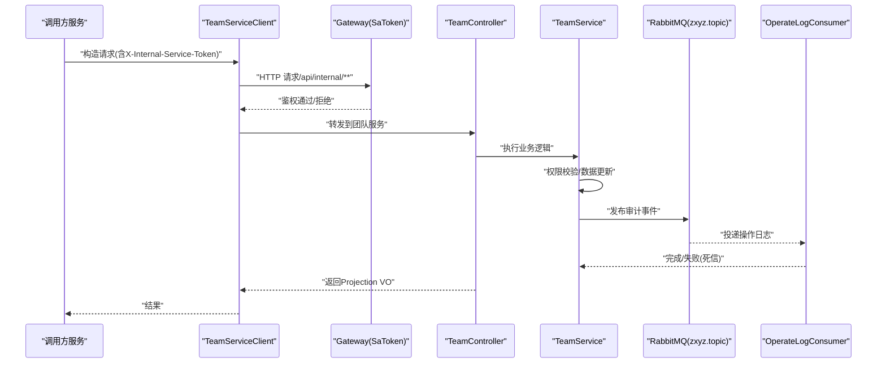
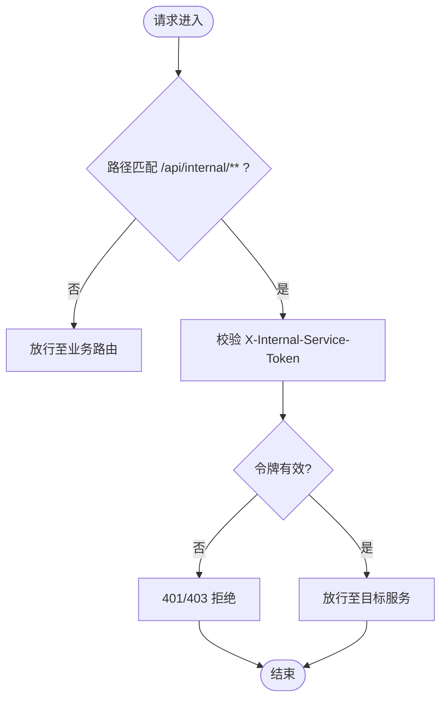
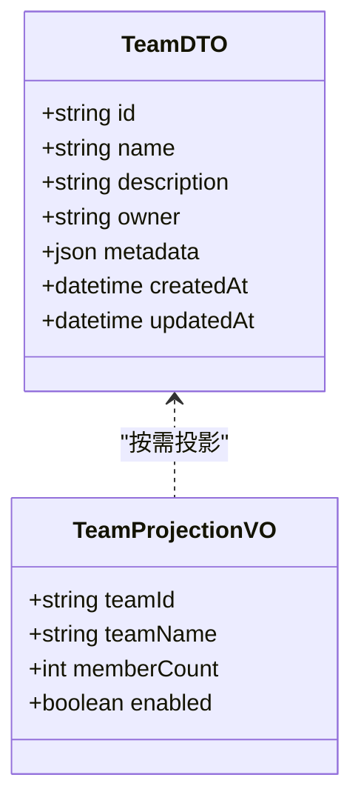
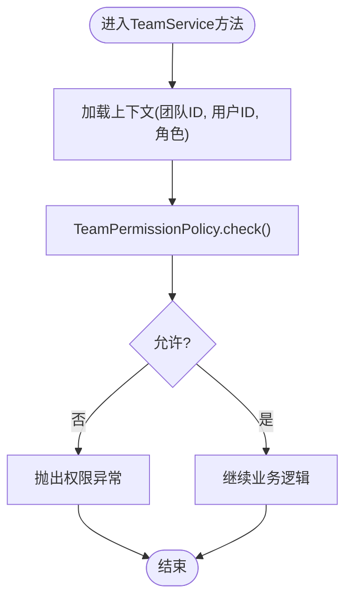
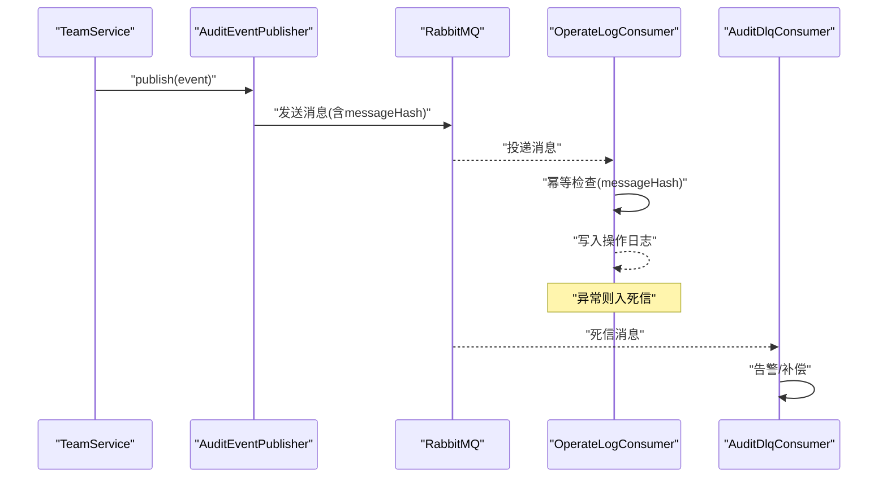
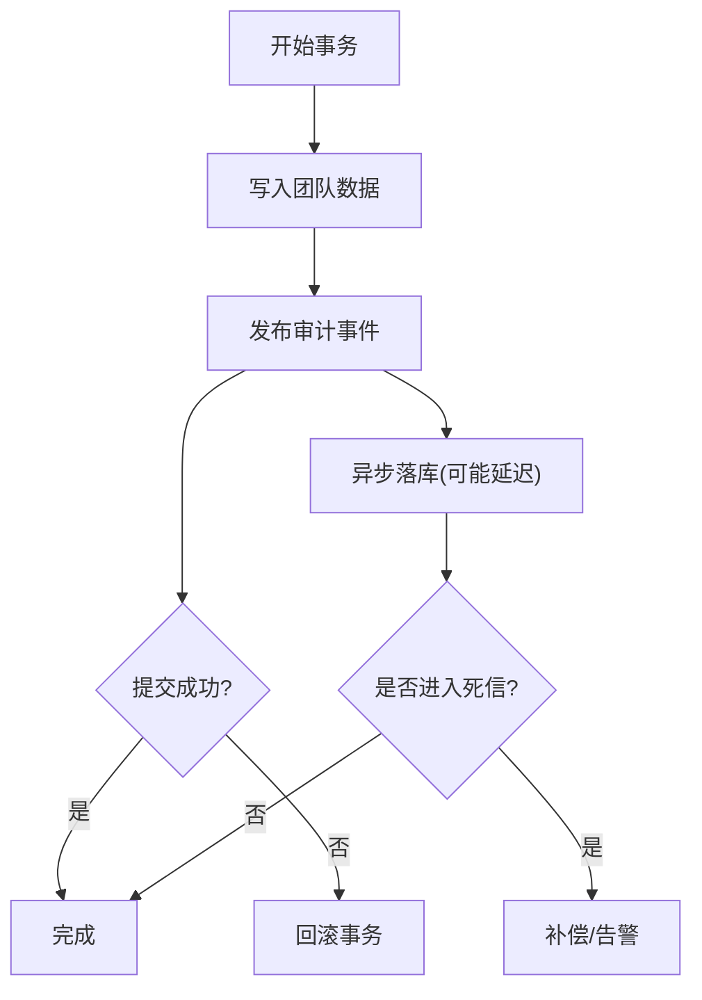
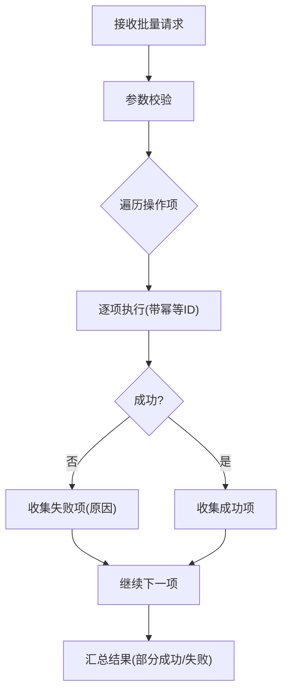
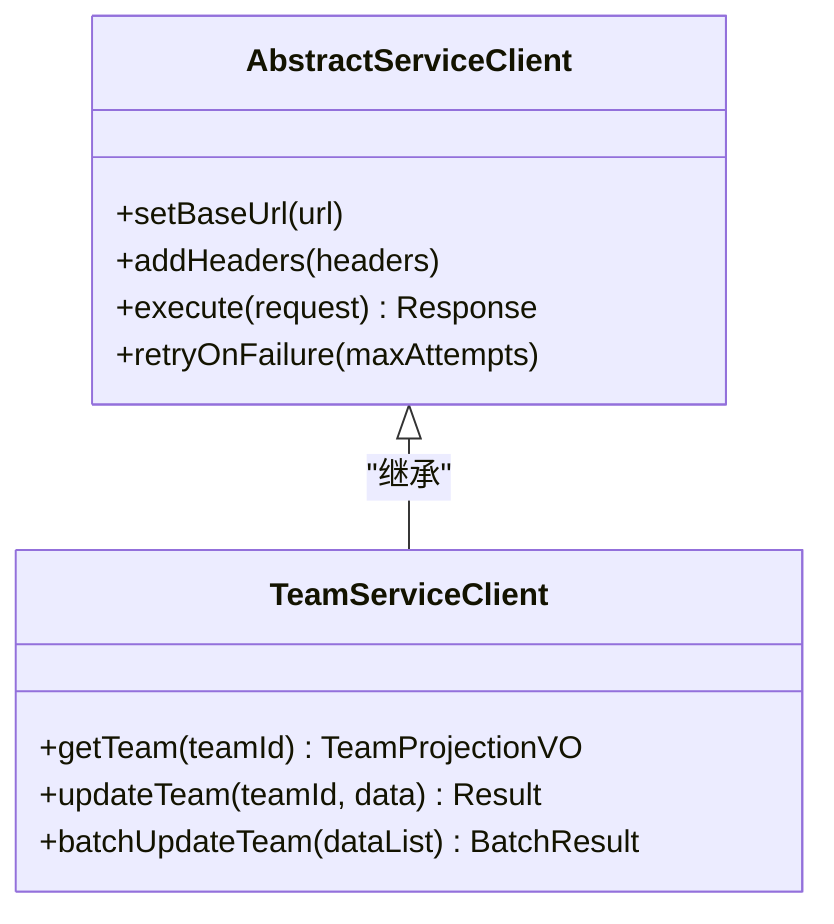
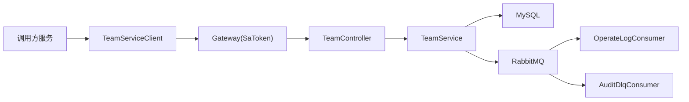

# 团队内部服务接口

<cite>
**本文引用的文件**   
- [zxyz-team-service/src/main/java/uno/acloud/team/controller/TeamController.java](file://ZXYZdatabaseBack/zxyz-team-service/src/main/java/uno/acloud/team/controller/TeamController.java)
- [zxyz-team-service/src/main/java/uno/acloud/team/service/TeamService.java](file://ZXYZdatabaseBack/zxyz-team-service/src/main/java/uno/acloud/team/service/TeamService.java)
- [zxyz-common/src/main/java/uno/acloud/client/AbstractServiceClient.java](file://ZXYZdatabaseBack/zxyz-common/src/main/java/uno/acloud/client/AbstractServiceClient.java)
- [zxyz-common/src/main/java/uno/acloud/client/TeamServiceClient.java](file://ZXYZdatabaseBack/zxyz-common/src/main/java/uno/acloud/client/TeamServiceClient.java)
- [zxyz-gateway/src/main/java/uno/acloud/gateway/filter/SaTokenFilterConfig.java](file://ZXYZdatabaseBack/zxyz-gateway/src/main/java/uno/acloud/gateway/filter/SaTokenFilterConfig.java)
- [zxyz-audit-service/src/main/java/uno/acloud/audit/mq/OperateLogConsumer.java](file://ZXYZdatabaseBack/zxyz-audit-service/src/main/java/uno/acloud/audit/mq/OperateLogConsumer.java)
- [zxyz-audit-service/src/main/java/uno/acloud/audit/mq/AuditDlqConsumer.java](file://ZXYZdatabaseBack/zxyz-audit-service/src/main/java/uno/acloud/audit/mq/AuditDlqConsumer.java)
- [zxyz-common/src/main/java/uno/acloud/common/event/AuditEventPublisher.java](file://ZXYZdatabaseBack/zxyz-common/src/main/java/uno/acloud/common/event/AuditEventPublisher.java)
- [zxyz-common/src/main/java/uno/acloud/common/permission/TeamPermissionPolicy.java](file://ZXYZdatabaseBack/zxyz-common/src/main/java/uno/acloud/common/permission/TeamPermissionPolicy.java)
- [nacos-config/zxyz-team-service.yml](file://nacos-config/zxyz-team-service.yml)
- [nacos-config/zxyz-dynamic.yml](file://nacos-config/zxyz-dynamic.yml)
- [docker-compose.yml](file://docker-compose.yml)
</cite>

## 目录
1. [简介](#简介)
2. [项目结构](#项目结构)
3. [核心组件](#核心组件)
4. [架构总览](#架构总览)
5. [详细组件分析](#详细组件分析)
6. [依赖关系分析](#依赖关系分析)
7. [性能考虑](#性能考虑)
8. [故障排查指南](#故障排查指南)
9. [结论](#结论)
10. [附录](#附录)

## 简介
本文件为 ZXYZ 项目的“团队内部服务”RESTful API 文档，聚焦于服务间调用、系统级权限管理、跨服务权限验证、团队数据同步与批量操作。文档覆盖：
- 内部服务鉴权机制（X-Internal-Service-Token）
- 数据投影模式（Projection VO）
- 异步消息处理（RabbitMQ Topic Exchange）
- 事务一致性保证策略
- 完整请求/响应示例与错误处理说明（服务不可用、数据不一致、权限校验失败等）

## 项目结构
后端采用微服务架构，团队相关能力由 zxyz-team-service 提供；其他服务通过 zxyz-common 中的 ServiceClient 进行窄端点调用；网关层通过 SaToken 过滤器拒绝公网访问 /api/internal/**；审计与幂等通过 RabbitMQ 异步化实现。

图表来源
- [zxyz-team-service/src/main/java/uno/acloud/team/controller/TeamController.java](file://ZXYZdatabaseBack/zxyz-team-service/src/main/java/uno/acloud/team/controller/TeamController.java)
- [zxyz-common/src/main/java/uno/acloud/client/AbstractServiceClient.java](file://ZXYZdatabaseBack/zxyz-common/src/main/java/uno/acloud/client/AbstractServiceClient.java)
- [zxyz-common/src/main/java/uno/acloud/client/TeamServiceClient.java](file://ZXYZdatabaseBack/zxyz-common/src/main/java/uno/acloud/client/TeamServiceClient.java)
- [zxyz-gateway/src/main/java/uno/acloud/gateway/filter/SaTokenFilterConfig.java](file://ZXYZdatabaseBack/zxyz-gateway/src/main/java/uno/acloud/gateway/filter/SaTokenFilterConfig.java)
- [zxyz-audit-service/src/main/java/uno/acloud/audit/mq/OperateLogConsumer.java](file://ZXYZdatabaseBack/zxyz-audit-service/src/main/java/uno/acloud/audit/mq/OperateLogConsumer.java)
- [zxyz-audit-service/src/main/java/uno/acloud/audit/mq/AuditDlqConsumer.java](file://ZXYZdatabaseBack/zxyz-audit-service/src/main/java/uno/acloud/audit/mq/AuditDlqConsumer.java)

章节来源
- [docker-compose.yml](file://docker-compose.yml)
- [nacos-config/zxyz-team-service.yml](file://nacos-config/zxyz-team-service.yml)

## 核心组件
- 内部端点控制器（TeamController）：暴露 /api/internal/** 的窄端点，供其他服务调用，返回 Projection VO。
- 团队服务（TeamService）：编排团队数据读写、权限校验、事件发布与批量操作。
- 通用客户端（AbstractServiceClient + TeamServiceClient）：封装 HTTP 调用、签名生成、重试与超时控制。
- 网关过滤器（SaTokenFilterConfig）：拦截 /api/internal/**，校验 X-Internal-Service-Token，拒绝公网访问。
- 审计与消息（OperateLogConsumer + AuditDlqConsumer + AuditEventPublisher）：基于 RabbitMQ 的异步操作日志与幂等保障。

章节来源
- [zxyz-team-service/src/main/java/uno/acloud/team/controller/TeamController.java](file://ZXYZdatabaseBack/zxyz-team-service/src/main/java/uno/acloud/team/controller/TeamController.java)
- [zxyz-team-service/src/main/java/uno/acloud/team/service/TeamService.java](file://ZXYZdatabaseBack/zxyz-team-service/src/main/java/uno/acloud/team/service/TeamService.java)
- [zxyz-common/src/main/java/uno/acloud/client/AbstractServiceClient.java](file://ZXYZdatabaseBack/zxyz-common/src/main/java/uno/acloud/client/AbstractServiceClient.java)
- [zxyz-common/src/main/java/uno/acloud/client/TeamServiceClient.java](file://ZXYZdatabaseBack/zxyz-common/src/main/java/uno/acloud/client/TeamServiceClient.java)
- [zxyz-gateway/src/main/java/uno/acloud/gateway/filter/SaTokenFilterConfig.java](file://ZXYZdatabaseBack/zxyz-gateway/src/main/java/uno/acloud/gateway/filter/SaTokenFilterConfig.java)
- [zxyz-audit-service/src/main/java/uno/acloud/audit/mq/OperateLogConsumer.java](file://ZXYZdatabaseBack/zxyz-audit-service/src/main/java/uno/acloud/audit/mq/OperateLogConsumer.java)
- [zxyz-audit-service/src/main/java/uno/acloud/audit/mq/AuditDlqConsumer.java](file://ZXYZdatabaseBack/zxyz-audit-service/src/main/java/uno/acloud/audit/mq/AuditDlqConsumer.java)
- [zxyz-common/src/main/java/uno/acloud/common/event/AuditEventPublisher.java](file://ZXYZdatabaseBack/zxyz-common/src/main/java/uno/acloud/common/event/AuditEventPublisher.java)

## 架构总览
内部服务调用链路遵循“窄端点 + 投影模式”，并通过网关统一鉴权。关键流程如下：
- 调用方通过 TeamServiceClient 发起请求，携带 X-Internal-Service-Token。
- Gateway 的 SaToken 过滤器校验令牌并放行至目标服务。
- TeamController 接收请求，调用 TeamService 执行业务逻辑。
- TeamService 执行权限校验、数据变更、发布审计事件到 RabbitMQ。
- Audit 服务消费消息，落库操作日志，异常进入死信队列。

图表来源
- [zxyz-common/src/main/java/uno/acloud/client/TeamServiceClient.java](file://ZXYZdatabaseBack/zxyz-common/src/main/java/uno/acloud/client/TeamServiceClient.java)
- [zxyz-gateway/src/main/java/uno/acloud/gateway/filter/SaTokenFilterConfig.java](file://ZXYZdatabaseBack/zxyz-gateway/src/main/java/uno/acloud/gateway/filter/SaTokenFilterConfig.java)
- [zxyz-team-service/src/main/java/uno/acloud/team/controller/TeamController.java](file://ZXYZdatabaseBack/zxyz-team-service/src/main/java/uno/acloud/team/controller/TeamController.java)
- [zxyz-team-service/src/main/java/uno/acloud/team/service/TeamService.java](file://ZXYZdatabaseBack/zxyz-team-service/src/main/java/uno/acloud/team/service/TeamService.java)
- [zxyz-audit-service/src/main/java/uno/acloud/audit/mq/OperateLogConsumer.java](file://ZXYZdatabaseBack/zxyz-audit-service/src/main/java/uno/acloud/audit/mq/OperateLogConsumer.java)

## 详细组件分析

### 内部服务鉴权机制（X-Internal-Service-Token）
- 令牌来源：各服务启动时从配置中心获取或动态下发，用于构建 X-Internal-Service-Token。
- 网关校验：SaToken 过滤器对 /api/internal/** 路径强制校验令牌，非法或缺失直接拒绝。
- 服务端校验：TeamController/TeamService 可二次校验调用方身份（如白名单、服务名），防止令牌伪造。

图表来源
- [zxyz-gateway/src/main/java/uno/acloud/gateway/filter/SaTokenFilterConfig.java](file://ZXYZdatabaseBack/zxyz-gateway/src/main/java/uno/acloud/gateway/filter/SaTokenFilterConfig.java)

章节来源
- [zxyz-gateway/src/main/java/uno/acloud/gateway/filter/SaTokenFilterConfig.java](file://ZXYZdatabaseBack/zxyz-gateway/src/main/java/uno/acloud/gateway/filter/SaTokenFilterConfig.java)
- [nacos-config/zxyz-dynamic.yml](file://nacos-config/zxyz-dynamic.yml)

### 数据投影模式（Projection VO）
- 原则：内部接口仅返回调用方所需的字段（Projection VO），禁止返回胖 DTO。
- 演进：提供方与调用方的投影类独立演进，不放入公共模块，避免耦合。
- 映射：使用 JsonNode 手动字段映射，不使用 treeToValue，确保类型安全与可控性。

图表来源
- [zxyz-team-service/src/main/java/uno/acloud/team/controller/TeamController.java](file://ZXYZdatabaseBack/zxyz-team-service/src/main/java/uno/acloud/team/controller/TeamController.java)
- [zxyz-team-service/src/main/java/uno/acloud/team/service/TeamService.java](file://ZXYZdatabaseBack/zxyz-team-service/src/main/java/uno/acloud/team/service/TeamService.java)

章节来源
- [zxyz-team-service/src/main/java/uno/acloud/team/controller/TeamController.java](file://ZXYZdatabaseBack/zxyz-team-service/src/main/java/uno/acloud/team/controller/TeamController.java)
- [zxyz-team-service/src/main/java/uno/acloud/team/service/TeamService.java](file://ZXYZdatabaseBack/zxyz-team-service/src/main/java/uno/acloud/team/service/TeamService.java)

### 跨服务权限验证（TeamPermissionPolicy）
- 策略：基于团队维度与角色/权限模型进行校验，支持细粒度资源访问控制。
- 校验点：在 TeamService 中集中校验，避免在各 Controller 重复实现。
- 扩展：新增权限规则通过策略类扩展，保持开闭原则。

图表来源
- [zxyz-common/src/main/java/uno/acloud/common/permission/TeamPermissionPolicy.java](file://ZXYZdatabaseBack/zxyz-common/src/main/java/uno/acloud/common/permission/TeamPermissionPolicy.java)
- [zxyz-team-service/src/main/java/uno/acloud/team/service/TeamService.java](file://ZXYZdatabaseBack/zxyz-team-service/src/main/java/uno/acloud/team/service/TeamService.java)

章节来源
- [zxyz-common/src/main/java/uno/acloud/common/permission/TeamPermissionPolicy.java](file://ZXYZdatabaseBack/zxyz-common/src/main/java/uno/acloud/common/permission/TeamPermissionPolicy.java)
- [zxyz-team-service/src/main/java/uno/acloud/team/service/TeamService.java](file://ZXYZdatabaseBack/zxyz-team-service/src/main/java/uno/acloud/team/service/TeamService.java)

### 异步消息处理与幂等（RabbitMQ Topic Exchange）
- 主题：zxyz.topic，按领域划分 Routing Key（如 audit.operate）。
- 生产者：TeamService 通过 AuditEventPublisher 发布审计事件。
- 消费者：OperateLogConsumer 消费并落库；失败进入死信队列，由 AuditDlqConsumer 处理。
- 幂等：消息体包含唯一标识（如 messageHash），数据库层面去重。

图表来源
- [zxyz-common/src/main/java/uno/acloud/common/event/AuditEventPublisher.java](file://ZXYZdatabaseBack/zxyz-common/src/main/java/uno/acloud/common/event/AuditEventPublisher.java)
- [zxyz-audit-service/src/main/java/uno/acloud/audit/mq/OperateLogConsumer.java](file://ZXYZdatabaseBack/zxyz-audit-service/src/main/java/uno/acloud/audit/mq/OperateLogConsumer.java)
- [zxyz-audit-service/src/main/java/uno/acloud/audit/mq/AuditDlqConsumer.java](file://ZXYZdatabaseBack/zxyz-audit-service/src/main/java/uno/acloud/audit/mq/AuditDlqConsumer.java)

章节来源
- [zxyz-common/src/main/java/uno/acloud/common/event/AuditEventPublisher.java](file://ZXYZdatabaseBack/zxyz-common/src/main/java/uno/acloud/common/event/AuditEventPublisher.java)
- [zxyz-audit-service/src/main/java/uno/acloud/audit/mq/OperateLogConsumer.java](file://ZXYZdatabaseBack/zxyz-audit-service/src/main/java/uno/acloud/audit/mq/OperateLogConsumer.java)
- [zxyz-audit-service/src/main/java/uno/acloud/audit/mq/AuditDlqConsumer.java](file://ZXYZdatabaseBack/zxyz-audit-service/src/main/java/uno/acloud/audit/mq/AuditDlqConsumer.java)

### 事务一致性保证
- 本地事务：TeamService 内数据写操作使用声明式事务。
- 最终一致：审计事件通过消息异步落库，允许短暂不一致。
- 补偿机制：死信队列触发告警与人工/自动补偿流程。
- 幂等设计：消息唯一键 + 数据库唯一约束，避免重复处理。

图表来源
- [zxyz-team-service/src/main/java/uno/acloud/team/service/TeamService.java](file://ZXYZdatabaseBack/zxyz-team-service/src/main/java/uno/acloud/team/service/TeamService.java)
- [zxyz-common/src/main/java/uno/acloud/common/event/AuditEventPublisher.java](file://ZXYZdatabaseBack/zxyz-common/src/main/java/uno/acloud/common/event/AuditEventPublisher.java)
- [zxyz-audit-service/src/main/java/uno/acloud/audit/mq/AuditDlqConsumer.java](file://ZXYZdatabaseBack/zxyz-audit-service/src/main/java/uno/acloud/audit/mq/AuditDlqConsumer.java)

章节来源
- [zxyz-team-service/src/main/java/uno/acloud/team/service/TeamService.java](file://ZXYZdatabaseBack/zxyz-team-service/src/main/java/uno/acloud/team/service/TeamService.java)
- [zxyz-common/src/main/java/uno/acloud/common/event/AuditEventPublisher.java](file://ZXYZdatabaseBack/zxyz-common/src/main/java/uno/acloud/common/event/AuditEventPublisher.java)
- [zxyz-audit-service/src/main/java/uno/acloud/audit/mq/AuditDlqConsumer.java](file://ZXYZdatabaseBack/zxyz-audit-service/src/main/java/uno/acloud/audit/mq/AuditDlqConsumer.java)

### 批量操作接口
- 场景：批量添加/移除团队成员、批量更新团队状态等。
- 设计：单接口接收列表参数，内部分批处理，失败项记录并返回部分成功结果。
- 幂等：每条操作附带唯一 ID，避免重复提交。

图表来源
- [zxyz-team-service/src/main/java/uno/acloud/team/controller/TeamController.java](file://ZXYZdatabaseBack/zxyz-team-service/src/main/java/uno/acloud/team/controller/TeamController.java)
- [zxyz-team-service/src/main/java/uno/acloud/team/service/TeamService.java](file://ZXYZdatabaseBack/zxyz-team-service/src/main/java/uno/acloud/team/service/TeamService.java)

章节来源
- [zxyz-team-service/src/main/java/uno/acloud/team/controller/TeamController.java](file://ZXYZdatabaseBack/zxyz-team-service/src/main/java/uno/acloud/team/controller/TeamController.java)
- [zxyz-team-service/src/main/java/uno/acloud/team/service/TeamService.java](file://ZXYZdatabaseBack/zxyz-team-service/src/main/java/uno/acloud/team/service/TeamService.java)

### 服务间调用客户端（TeamServiceClient）
- 职责：封装 HTTP 调用、签名生成、重试与超时控制。
- 抽象：AbstractServiceClient 提供通用能力（如签名、Header 注入）。
- 窄端点：仅暴露必要接口，减少攻击面与耦合。

图表来源
- [zxyz-common/src/main/java/uno/acloud/client/AbstractServiceClient.java](file://ZXYZdatabaseBack/zxyz-common/src/main/java/uno/acloud/client/AbstractServiceClient.java)
- [zxyz-common/src/main/java/uno/acloud/client/TeamServiceClient.java](file://ZXYZdatabaseBack/zxyz-common/src/main/java/uno/acloud/client/TeamServiceClient.java)

章节来源
- [zxyz-common/src/main/java/uno/acloud/client/AbstractServiceClient.java](file://ZXYZdatabaseBack/zxyz-common/src/main/java/uno/acloud/client/AbstractServiceClient.java)
- [zxyz-common/src/main/java/uno/acloud/client/TeamServiceClient.java](file://ZXYZdatabaseBack/zxyz-common/src/main/java/uno/acloud/client/TeamServiceClient.java)

## 依赖关系分析
- 调用链：调用方服务 → TeamServiceClient → Gateway(SaToken) → TeamController → TeamService → DB/MQ。
- 解耦：通过窄端点与投影 VO 降低耦合；审计与主流程异步解耦。
- 风险点：令牌泄露、消息堆积、死信积压、权限策略误配。

图表来源
- [zxyz-common/src/main/java/uno/acloud/client/TeamServiceClient.java](file://ZXYZdatabaseBack/zxyz-common/src/main/java/uno/acloud/client/TeamServiceClient.java)
- [zxyz-gateway/src/main/java/uno/acloud/gateway/filter/SaTokenFilterConfig.java](file://ZXYZdatabaseBack/zxyz-gateway/src/main/java/uno/acloud/gateway/filter/SaTokenFilterConfig.java)
- [zxyz-team-service/src/main/java/uno/acloud/team/controller/TeamController.java](file://ZXYZdatabaseBack/zxyz-team-service/src/main/java/uno/acloud/team/controller/TeamController.java)
- [zxyz-team-service/src/main/java/uno/acloud/team/service/TeamService.java](file://ZXYZdatabaseBack/zxyz-team-service/src/main/java/uno/acloud/team/service/TeamService.java)
- [zxyz-audit-service/src/main/java/uno/acloud/audit/mq/OperateLogConsumer.java](file://ZXYZdatabaseBack/zxyz-audit-service/src/main/java/uno/acloud/audit/mq/OperateLogConsumer.java)
- [zxyz-audit-service/src/main/java/uno/acloud/audit/mq/AuditDlqConsumer.java](file://ZXYZdatabaseBack/zxyz-audit-service/src/main/java/uno/acloud/audit/mq/AuditDlqConsumer.java)

章节来源
- [docker-compose.yml](file://docker-compose.yml)
- [nacos-config/zxyz-team-service.yml](file://nacos-config/zxyz-team-service.yml)

## 性能考虑
- 连接池与超时：合理设置 HTTP 客户端连接池大小与超时时间，避免雪崩。
- 分页与投影：内部接口尽量返回最小必要字段，减少网络传输。
- 异步化：耗时操作（如审计落库）走消息队列，提升吞吐。
- 缓存热点：团队基础信息可短期缓存，注意失效策略。
- 限流与熔断：对批量接口实施限流，下游异常快速失败。

[本节为通用指导，不直接分析具体文件]

## 故障排查指南
- 服务不可用
  - 现象：调用方收到 5xx 或连接超时。
  - 排查：检查服务健康、网关路由、Nacos 配置、连接池与超时。
- 数据不一致
  - 现象：主流程成功但审计未落库。
  - 排查：查看 MQ 消费日志、死信队列、幂等键冲突。
- 权限校验失败
  - 现象：401/403 或业务层权限异常。
  - 排查：确认 X-Internal-Service-Token、调用方白名单、TeamPermissionPolicy 规则。
- 批量操作部分失败
  - 现象：部分成功、部分失败。
  - 排查：定位失败项原因码，检查幂等键与并发冲突。

章节来源
- [zxyz-audit-service/src/main/java/uno/acloud/audit/mq/AuditDlqConsumer.java](file://ZXYZdatabaseBack/zxyz-audit-service/src/main/java/uno/acloud/audit/mq/AuditDlqConsumer.java)
- [zxyz-common/src/main/java/uno/acloud/common/permission/TeamPermissionPolicy.java](file://ZXYZdatabaseBack/zxyz-common/src/main/java/uno/acloud/common/permission/TeamPermissionPolicy.java)

## 结论
团队内部服务通过“窄端点 + 投影模式 + 网关统一鉴权 + 异步审计”的设计，实现了高内聚、低耦合、可扩展的服务间协作。配合事务与幂等策略，在保证一致性的同时提升了系统吞吐与稳定性。建议在生产环境持续监控 MQ 堆积、死信数量与权限策略命中率，及时优化。

[本节为总结，不直接分析具体文件]

## 附录

### 接口清单与示例（内部端点 /api/internal/**）
- 获取团队信息
  - 方法：GET
  - 路径：/api/internal/team/{teamId}
  - 请求头：X-Internal-Service-Token
  - 响应：TeamProjectionVO（teamId, teamName, memberCount, enabled）
  - 错误：401（令牌无效）、403（无权限）、404（团队不存在）
- 更新团队信息
  - 方法：PUT
  - 路径：/api/internal/team/{teamId}
  - 请求体：需更新的字段（最小集）
  - 响应：Result<TeamProjectionVO>
  - 错误：400（参数校验失败）、403（无权限）、500（服务异常）
- 批量更新团队状态
  - 方法：POST
  - 路径：/api/internal/team/batch/update
  - 请求体：[{teamId, action, params}, ...]
  - 响应：BatchResult（successCount, failedItems）
  - 错误：400（参数校验失败）、403（无权限）、500（服务异常）

章节来源
- [zxyz-team-service/src/main/java/uno/acloud/team/controller/TeamController.java](file://ZXYZdatabaseBack/zxyz-team-service/src/main/java/uno/acloud/team/controller/TeamController.java)
- [zxyz-team-service/src/main/java/uno/acloud/team/service/TeamService.java](file://ZXYZdatabaseBack/zxyz-team-service/src/main/java/uno/acloud/team/service/TeamService.java)

### 错误码与处理建议
- 401：X-Internal-Service-Token 缺失或无效，检查网关配置与服务令牌下发。
- 403：权限不足，核对 TeamPermissionPolicy 与调用方白名单。
- 404：资源不存在，检查团队 ID 有效性。
- 400：参数校验失败，检查请求体结构与必填字段。
- 500：服务异常，查看日志与依赖服务健康状态。
- 503：服务不可用，检查部署与 Nacos 注册。

章节来源
- [zxyz-gateway/src/main/java/uno/acloud/gateway/filter/SaTokenFilterConfig.java](file://ZXYZdatabaseBack/zxyz-gateway/src/main/java/uno/acloud/gateway/filter/SaTokenFilterConfig.java)
- [zxyz-common/src/main/java/uno/acloud/common/permission/TeamPermissionPolicy.java](file://ZXYZdatabaseBack/zxyz-common/src/main/java/uno/acloud/common/permission/TeamPermissionPolicy.java)