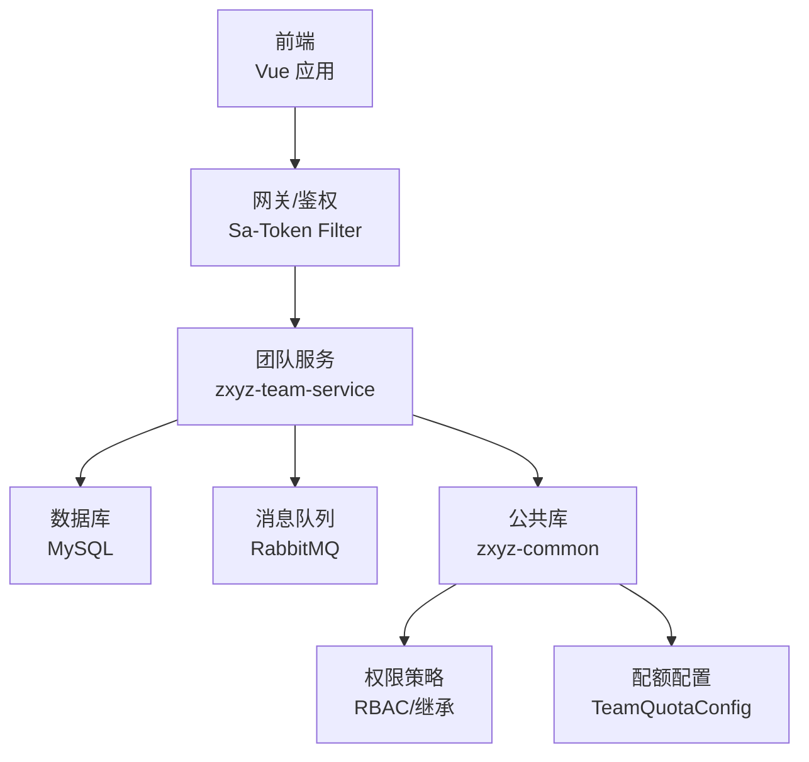
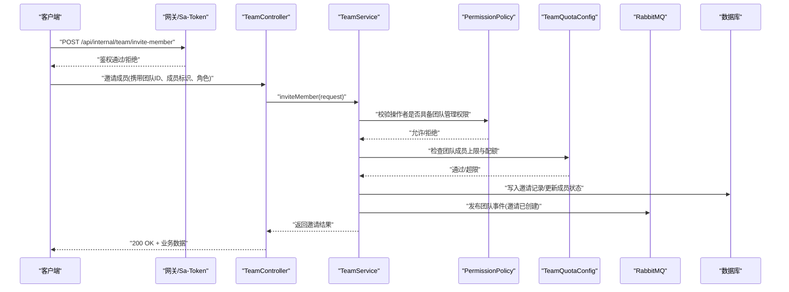
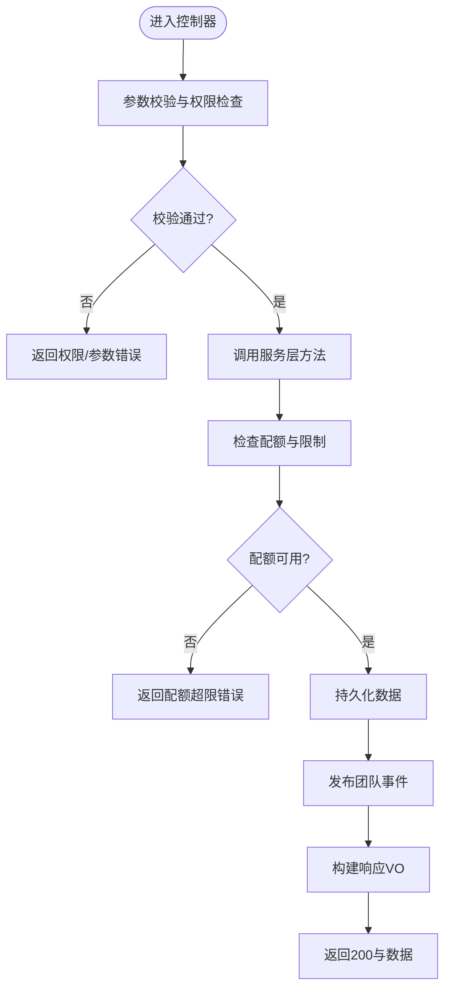
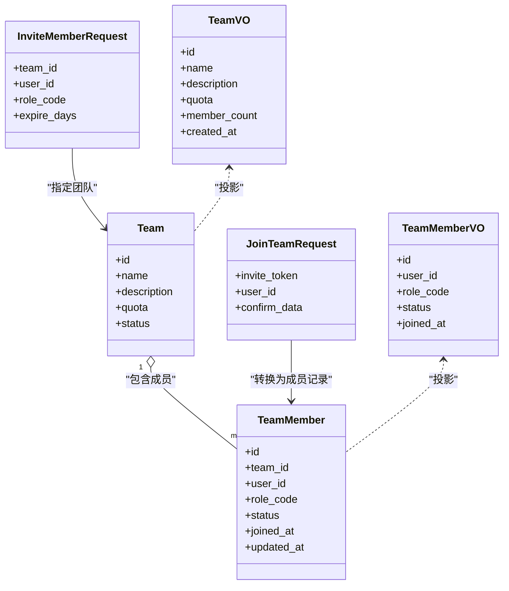
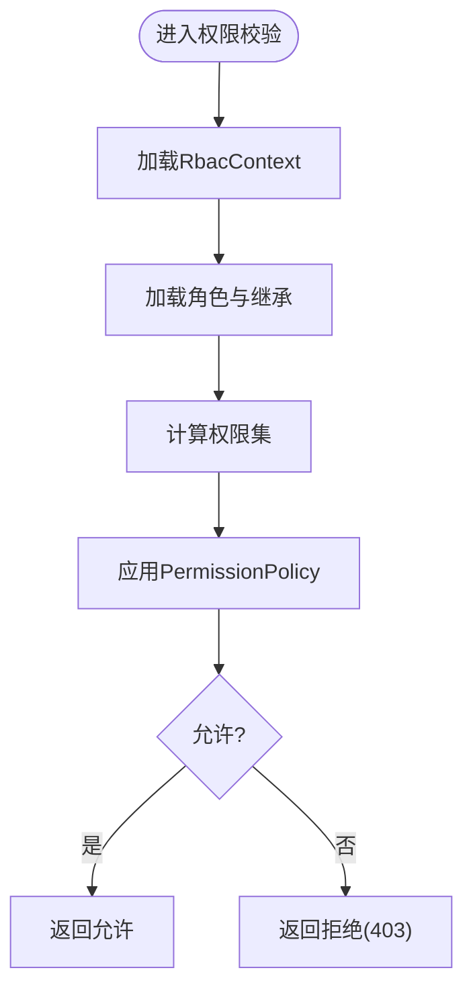
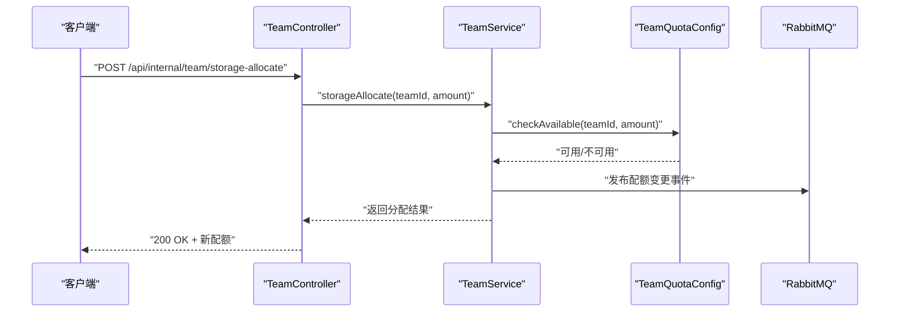
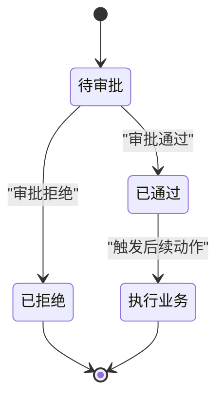
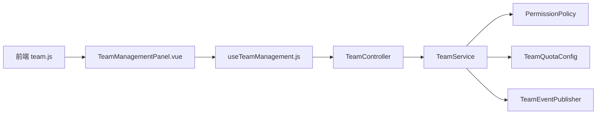

# 团队协作接口

<cite>
**本文引用的文件**   
- [zxyz-team-service/.../controller/TeamController.java](file://ZXYZdatabaseBack/zxyz-team-service/src/main/java/uno/acloud/team/controller/TeamController.java)
- [zxyz-team-service/.../service/TeamService.java](file://ZXYZdatabaseBack/zxyz-team-service/src/main/java/uno/acloud/team/service/TeamService.java)
- [zxyz-team-service/.../entity/Team.java](file://ZXYZdatabaseBack/zxyz-team-service/src/main/java/uno/acloud/team/entity/Team.java)
- [zxyz-team-service/.../entity/TeamMember.java](file://ZXYZdatabaseBack/zxyz-team-service/src/main/java/uno/acloud/team/entity/TeamMember.java)
- [zxyz-team-service/.../dto/request/CreateTeamRequest.java](file://ZXYZdatabaseBack/zxyz-team-service/src/main/java/uno/acloud/team/dto/request/CreateTeamRequest.java)
- [zxyz-team-service/.../dto/request/UpdateTeamRequest.java](file://ZXYZdatabaseBack/zxyz-team-service/src/main/java/uno/acloud/team/dto/request/UpdateTeamRequest.java)
- [zxyz-team-service/.../dto/request/InviteMemberRequest.java](file://ZXYZdatabaseBack/zxyz-team-service/src/main/java/uno/acloud/team/dto/request/InviteMemberRequest.java)
- [zxyz-team-service/.../dto/request/JoinTeamRequest.java](file://ZXYZdatabaseBack/zxyz-team-service/src/main/java/uno/acloud/team/dto/request/JoinTeamRequest.java)
- [zxyz-team-service/.../vo/response/TeamVO.java](file://ZXYZdatabaseBack/zxyz-team-service/src/main/java/uno/acloud/team/vo/response/TeamVO.java)
- [zxyz-team-service/.../vo/response/TeamMemberVO.java](file://ZXYZdatabaseBack/zxyz-team-service/src/main/java/uno/acloud/team/vo/response/TeamMemberVO.java)
- [zxyz-common/.../permission/PermissionPolicy.java](file://ZXYZdatabaseBack/zxyz-common/src/main/java/uno/acloud/common/permission/PermissionPolicy.java)
- [zxyz-common/.../permission/RbacContext.java](file://ZXYZdatabaseBack/zxyz-common/src/main/java/uno/acloud/common/permission/RbacContext.java)
- [zxyz-common/.../permission/RoleDefinition.java](file://ZXYZdatabaseBack/zxyz-common/src/main/java/uno/acloud/common/permission/RoleDefinition.java)
- [zxyz-common/.../config/TeamQuotaConfig.java](file://ZXYZdatabaseBack/zxyz-common/src/main/java/uno/acloud/common/config/TeamQuotaConfig.java)
- [zxyz-common/.../event/TeamEventPublisher.java](file://ZXYZdatabaseBack/zxyz-common/src/main/java/uno/acloud/common/event/TeamEventPublisher.java)
- [nacos-config/zxyz-team-service.yml](file://nacos-config/zxyz-team-service.yml)
- [ZXYZdatabaseFront/src/api/team.js](file://ZXYZdatabaseFront/src/api/team.js)
- [ZXYZdatabaseFront/src/components/team-settings/TeamManagementPanel.vue](file://ZXYZdatabaseFront/src/components/team-settings/TeamManagementPanel.vue)
- [ZXYZdatabaseFront/src/components/team-settings/TeamMemberPanel.vue](file://ZXYZdatabaseFront/src/components/team-settings/TeamMemberPanel.vue)
- [ZXYZdatabaseFront/src/components/team-settings/TeamStoragePanel.vue](file://ZXYZdatabaseFront/src/components/team-settings/TeamStoragePanel.vue)
- [ZXYZdatabaseFront/src/composables/team/useTeamManagement.js](file://ZXYZdatabaseFront/src/composables/team/useTeamManagement.js)
- [ZXYZdatabaseFront/src/composables/team/useTeamStorageAllocation.js](file://ZXYZdatabaseFront/src/composables/team/useTeamStorageAllocation.js)
</cite>

## 目录
1. [简介](#简介)
2. [项目结构](#项目结构)
3. [核心组件](#核心组件)
4. [架构总览](#架构总览)
5. [详细组件分析](#详细组件分析)
6. [依赖关系分析](#依赖关系分析)
7. [性能与扩展性](#性能与扩展性)
8. [故障排查指南](#故障排查指南)
9. [结论](#结论)
10. [附录：API 契约与示例](#附录api-契约与示例)

## 简介
本文件为 ZXYZ 项目的“团队协作”RESTful API 接口文档，覆盖团队生命周期管理、成员管理（邀请、加入、移除、角色分配）、权限控制（RBAC 模型、自定义角色、权限继承）、配额与存储分配、访问控制以及审批流程处理。文档面向前后端开发者与集成方，提供清晰的接口定义、请求/响应示例、错误码说明与最佳实践建议。

## 项目结构
ZXYZ 采用微服务架构，团队能力由 zxyz-team-service 提供服务，前端通过 Vue 3 + Element Plus 调用后端 REST 接口。团队相关的前端模块集中在 src/components/team-settings 与 src/composables/team 中，后端控制器与领域逻辑位于 zxyz-team-service 的 controller、service、entity、dto、vo 等包下。权限与策略在 zxyz-common 中统一实现，配置由 Nacos 集中管理。

图表来源
- [zxyz-team-service/.../controller/TeamController.java](file://ZXYZdatabaseBack/zxyz-team-service/src/main/java/uno/acloud/team/controller/TeamController.java)
- [zxyz-common/.../permission/PermissionPolicy.java](file://ZXYZdatabaseBack/zxyz-common/src/main/java/uno/acloud/common/permission/PermissionPolicy.java)
- [zxyz-common/.../config/TeamQuotaConfig.java](file://ZXYZdatabaseBack/zxyz-common/src/main/java/uno/acloud/common/config/TeamQuotaConfig.java)

章节来源
- [ZXYZdatabaseFront/src/api/team.js](file://ZXYZdatabaseFront/src/api/team.js)
- [ZXYZdatabaseFront/src/components/team-settings/TeamManagementPanel.vue](file://ZXYZdatabaseFront/src/components/team-settings/TeamManagementPanel.vue)
- [ZXYZdatabaseFront/src/components/team-settings/TeamMemberPanel.vue](file://ZXYZdatabaseFront/src/components/team-settings/TeamMemberPanel.vue)
- [ZXYZdatabaseFront/src/components/team-settings/TeamStoragePanel.vue](file://ZXYZdatabaseFront/src/components/team-settings/TeamStoragePanel.vue)
- [ZXYZdatabaseFront/src/composables/team/useTeamManagement.js](file://ZXYZdatabaseFront/src/composables/team/useTeamManagement.js)
- [ZXYZdatabaseFront/src/composables/team/useTeamStorageAllocation.js](file://ZXYZdatabaseFront/src/composables/team/useTeamStorageAllocation.js)

## 核心组件
- 团队控制器（TeamController）：暴露团队 CRUD、成员管理、配额与存储、权限策略校验等 HTTP 端点。
- 团队服务（TeamService）：编排团队生命周期、成员状态机、配额检查、事件发布与事务边界。
- 实体与 DTO/VO：Team、TeamMember 作为持久化模型；CreateTeamRequest、UpdateTeamRequest、InviteMemberRequest、JoinTeamRequest 作为入参；TeamVO、TeamMemberVO 作为出参投影。
- 权限与配额：PermissionPolicy、RbacContext、RoleDefinition 提供 RBAC 与继承策略；TeamQuotaConfig 提供配额阈值与限制。
- 事件：TeamEventPublisher 用于发布团队变更事件（如成员加入、配额调整），供审计与异步处理。

章节来源
- [zxyz-team-service/.../controller/TeamController.java](file://ZXYZdatabaseBack/zxyz-team-service/src/main/java/uno/acloud/team/controller/TeamController.java)
- [zxyz-team-service/.../service/TeamService.java](file://ZXYZdatabaseBack/zxyz-team-service/src/main/java/uno/acloud/team/service/TeamService.java)
- [zxyz-team-service/.../entity/Team.java](file://ZXYZdatabaseBack/zxyz-team-service/src/main/java/uno/acloud/team/entity/Team.java)
- [zxyz-team-service/.../entity/TeamMember.java](file://ZXYZdatabaseBack/zxyz-team-service/src/main/java/uno/acloud/team/entity/TeamMember.java)
- [zxyz-team-service/.../dto/request/CreateTeamRequest.java](file://ZXYZdatabaseBack/zxyz-team-service/src/main/java/uno/acloud/team/dto/request/CreateTeamRequest.java)
- [zxyz-team-service/.../dto/request/UpdateTeamRequest.java](file://ZXYZdatabaseBack/zxyz-team-service/src/main/java/uno/acloud/team/dto/request/UpdateTeamRequest.java)
- [zxyz-team-service/.../dto/request/InviteMemberRequest.java](file://ZXYZdatabaseBack/zxyz-team-service/src/main/java/uno/acloud/team/dto/request/InviteMemberRequest.java)
- [zxyz-team-service/.../dto/request/JoinTeamRequest.java](file://ZXYZdatabaseBack/zxyz-team-service/src/main/java/uno/acloud/team/dto/request/JoinTeamRequest.java)
- [zxyz-team-service/.../vo/response/TeamVO.java](file://ZXYZdatabaseBack/zxyz-team-service/src/main/java/uno/acloud/team/vo/response/TeamVO.java)
- [zxyz-team-service/.../vo/response/TeamMemberVO.java](file://ZXYZdatabaseBack/zxyz-team-service/src/main/java/uno/acloud/team/vo/response/TeamMemberVO.java)
- [zxyz-common/.../permission/PermissionPolicy.java](file://ZXYZdatabaseBack/zxyz-common/src/main/java/uno/acloud/common/permission/PermissionPolicy.java)
- [zxyz-common/.../permission/RbacContext.java](file://ZXYZdatabaseBack/zxyz-common/src/main/java/uno/acloud/common/permission/RbacContext.java)
- [zxyz-common/.../permission/RoleDefinition.java](file://ZXYZdatabaseBack/zxyz-common/src/main/java/uno/acloud/common/permission/RoleDefinition.java)
- [zxyz-common/.../config/TeamQuotaConfig.java](file://ZXYZdatabaseBack/zxyz-common/src/main/java/uno/acloud/common/config/TeamQuotaConfig.java)
- [zxyz-common/.../event/TeamEventPublisher.java](file://ZXYZdatabaseBack/zxyz-common/src/main/java/uno/acloud/common/event/TeamEventPublisher.java)

## 架构总览
下图展示一次“邀请成员并加入团队”的典型调用链，包括网关鉴权、控制器路由、服务编排、权限校验、配额检查、事件发布与响应返回。

图表来源
- [zxyz-team-service/.../controller/TeamController.java](file://ZXYZdatabaseBack/zxyz-team-service/src/main/java/uno/acloud/team/controller/TeamController.java)
- [zxyz-team-service/.../service/TeamService.java](file://ZXYZdatabaseBack/zxyz-team-service/src/main/java/uno/acloud/team/service/TeamService.java)
- [zxyz-common/.../permission/PermissionPolicy.java](file://ZXYZdatabaseBack/zxyz-common/src/main/java/uno/acloud/common/permission/PermissionPolicy.java)
- [zxyz-common/.../config/TeamQuotaConfig.java](file://ZXYZdatabaseBack/zxyz-common/src/main/java/uno/acloud/common/config/TeamQuotaConfig.java)
- [zxyz-common/.../event/TeamEventPublisher.java](file://ZXYZdatabaseBack/zxyz-common/src/main/java/uno/acloud/common/event/TeamEventPublisher.java)

## 详细组件分析

### 团队管理接口（CRUD）
- 创建团队
  - 方法：POST /api/internal/team/create
  - 入参：CreateTeamRequest（名称、描述、初始管理员、配额策略等）
  - 行为：校验权限、初始化团队、设置默认配额、发布“团队创建”事件
  - 响应：TeamVO（团队基本信息、配额、创建时间等）
- 更新团队
  - 方法：PUT /api/internal/team/update
  - 入参：UpdateTeamRequest（可更新字段：名称、描述、配额策略等）
  - 行为：权限校验、版本冲突检测、更新团队信息、发布“团队更新”事件
  - 响应：TeamVO
- 删除团队
  - 方法：DELETE /api/internal/team/delete/{teamId}
  - 行为：软删除或归档、清理成员关联、发布“团队删除”事件
  - 响应：成功标志与提示
- 查询团队
  - 方法：GET /api/internal/team/detail/{teamId}
  - 行为：按团队ID查询，返回投影 VO
  - 响应：TeamVO

图表来源
- [zxyz-team-service/.../controller/TeamController.java](file://ZXYZdatabaseBack/zxyz-team-service/src/main/java/uno/acloud/team/controller/TeamController.java)
- [zxyz-team-service/.../service/TeamService.java](file://ZXYZdatabaseBack/zxyz-team-service/src/main/java/uno/acloud/team/service/TeamService.java)
- [zxyz-common/.../config/TeamQuotaConfig.java](file://ZXYZdatabaseBack/zxyz-common/src/main/java/uno/acloud/common/config/TeamQuotaConfig.java)

章节来源
- [zxyz-team-service/.../controller/TeamController.java](file://ZXYZdatabaseBack/zxyz-team-service/src/main/java/uno/acloud/team/controller/TeamController.java)
- [zxyz-team-service/.../service/TeamService.java](file://ZXYZdatabaseBack/zxyz-team-service/src/main/java/uno/acloud/team/service/TeamService.java)
- [zxyz-team-service/.../dto/request/CreateTeamRequest.java](file://ZXYZdatabaseBack/zxyz-team-service/src/main/java/uno/acloud/team/dto/request/CreateTeamRequest.java)
- [zxyz-team-service/.../dto/request/UpdateTeamRequest.java](file://ZXYZdatabaseBack/zxyz-team-service/src/main/java/uno/acloud/team/dto/request/UpdateTeamRequest.java)
- [zxyz-team-service/.../vo/response/TeamVO.java](file://ZXYZdatabaseBack/zxyz-team-service/src/main/java/uno/acloud/team/vo/response/TeamVO.java)

### 成员管理接口（邀请、加入、移除、角色分配）
- 邀请成员
  - 方法：POST /api/internal/team/invite-member
  - 入参：InviteMemberRequest（团队ID、被邀请人标识、角色、有效期等）
  - 行为：权限校验、配额检查（成员上限）、生成邀请令牌、写入邀请记录、发布“邀请已创建”事件
  - 响应：邀请详情（令牌、过期时间、当前成员数等）
- 加入团队
  - 方法：POST /api/internal/team/join-team
  - 入参：JoinTeamRequest（邀请令牌、用户标识、确认信息等）
  - 行为：验证邀请有效性、状态机转换（待确认→已加入）、更新成员表、发布“成员已加入”事件
  - 响应：TeamMemberVO（成员角色、加入时间、状态）
- 移除成员
  - 方法：DELETE /api/internal/team/remove-member/{teamId}/{memberId}
  - 行为：权限校验（需团队管理员或更高权限）、状态机转换（已加入→已移除）、清理资源引用、发布“成员已移除”事件
  - 响应：成功标志
- 角色分配
  - 方法：PUT /api/internal/team/assign-role/{teamId}/{memberId}
  - 入参：角色定义（角色编码、权限集合、继承规则等）
  - 行为：权限策略校验、更新成员角色、计算权限继承、发布“角色已变更”事件
  - 响应：TeamMemberVO（含最新角色与权限集）

图表来源
- [zxyz-team-service/.../entity/Team.java](file://ZXYZdatabaseBack/zxyz-team-service/src/main/java/uno/acloud/team/entity/Team.java)
- [zxyz-team-service/.../entity/TeamMember.java](file://ZXYZdatabaseBack/zxyz-team-service/src/main/java/uno/acloud/team/entity/TeamMember.java)
- [zxyz-team-service/.../dto/request/InviteMemberRequest.java](file://ZXYZdatabaseBack/zxyz-team-service/src/main/java/uno/acloud/team/dto/request/InviteMemberRequest.java)
- [zxyz-team-service/.../dto/request/JoinTeamRequest.java](file://ZXYZdatabaseBack/zxyz-team-service/src/main/java/uno/acloud/team/dto/request/JoinTeamRequest.java)
- [zxyz-team-service/.../vo/response/TeamVO.java](file://ZXYZdatabaseBack/zxyz-team-service/src/main/java/uno/acloud/team/vo/response/TeamVO.java)
- [zxyz-team-service/.../vo/response/TeamMemberVO.java](file://ZXYZdatabaseBack/zxyz-team-service/src/main/java/uno/acloud/team/vo/response/TeamMemberVO.java)

章节来源
- [zxyz-team-service/.../controller/TeamController.java](file://ZXYZdatabaseBack/zxyz-team-service/src/main/java/uno/acloud/team/controller/TeamController.java)
- [zxyz-team-service/.../service/TeamService.java](file://ZXYZdatabaseBack/zxyz-team-service/src/main/java/uno/acloud/team/service/TeamService.java)
- [zxyz-team-service/.../dto/request/InviteMemberRequest.java](file://ZXYZdatabaseBack/zxyz-team-service/src/main/java/uno/acloud/team/dto/request/InviteMemberRequest.java)
- [zxyz-team-service/.../dto/request/JoinTeamRequest.java](file://ZXYZdatabaseBack/zxyz-team-service/src/main/java/uno/acloud/team/dto/request/JoinTeamRequest.java)
- [zxyz-team-service/.../vo/response/TeamMemberVO.java](file://ZXYZdatabaseBack/zxyz-team-service/src/main/java/uno/acloud/team/vo/response/TeamMemberVO.java)

### 权限控制接口（RBAC、自定义角色、权限继承）
- 权限模型
  - 角色定义（RoleDefinition）：角色编码、权限集合、继承关系
  - 上下文（RbacContext）：当前用户、团队、角色、会话信息
  - 策略（PermissionPolicy）：基于角色的访问控制、权限继承计算、策略执行
- 常用端点
  - 获取权限策略：GET /api/internal/team/policy/{teamId}
  - 校验权限：POST /api/internal/team/check-permission
  - 自定义角色管理：POST /api/internal/team/custom-role（增删改查）
- 执行流程
  - 解析 RbacContext → 加载角色与继承 → 计算权限集 → 策略判定 → 返回允许/拒绝

图表来源
- [zxyz-common/.../permission/PermissionPolicy.java](file://ZXYZdatabaseBack/zxyz-common/src/main/java/uno/acloud/common/permission/PermissionPolicy.java)
- [zxyz-common/.../permission/RbacContext.java](file://ZXYZdatabaseBack/zxyz-common/src/main/java/uno/acloud/common/permission/RbacContext.java)
- [zxyz-common/.../permission/RoleDefinition.java](file://ZXYZdatabaseBack/zxyz-common/src/main/java/uno/acloud/common/permission/RoleDefinition.java)

章节来源
- [zxyz-common/.../permission/PermissionPolicy.java](file://ZXYZdatabaseBack/zxyz-common/src/main/java/uno/acloud/common/permission/PermissionPolicy.java)
- [zxyz-common/.../permission/RbacContext.java](file://ZXYZdatabaseBack/zxyz-common/src/main/java/uno/acloud/common/permission/RbacContext.java)
- [zxyz-common/.../permission/RoleDefinition.java](file://ZXYZdatabaseBack/zxyz-common/src/main/java/uno/acloud/common/permission/RoleDefinition.java)

### 团队配额与存储分配
- 配额维度
  - 成员数量上限、存储空间上限、文件数量上限、并发操作限制等
- 配置来源
  - TeamQuotaConfig 从 Nacos 读取团队配额策略（可按团队或全局）
- 常见操作
  - 查询配额：GET /api/internal/team/quota/{teamId}
  - 调整配额：PUT /api/internal/team/update-quota/{teamId}
  - 存储分配：POST /api/internal/team/storage-allocate/{teamId}
- 执行要点
  - 预检查配额可用性 → 原子更新配额 → 发布“配额变更”事件 → 通知存储系统

图表来源
- [zxyz-common/.../config/TeamQuotaConfig.java](file://ZXYZdatabaseBack/zxyz-common/src/main/java/uno/acloud/common/config/TeamQuotaConfig.java)
- [zxyz-common/.../event/TeamEventPublisher.java](file://ZXYZdatabaseBack/zxyz-common/src/main/java/uno/acloud/common/event/TeamEventPublisher.java)

章节来源
- [zxyz-common/.../config/TeamQuotaConfig.java](file://ZXYZdatabaseBack/zxyz-common/src/main/java/uno/acloud/common/config/TeamQuotaConfig.java)
- [nacos-config/zxyz-team-service.yml](file://nacos-config/zxyz-team-service.yml)

### 审批流程处理
- 场景
  - 成员加入审批、角色升级审批、配额调整审批
- 流程
  - 提交申请 → 创建审批单 → 等待审批人决策 → 通过后执行业务动作 → 发布“审批完成”事件
- 关键要素
  - 审批状态机（待审批、已通过、已拒绝）
  - 审批人权限校验（需具备团队管理或更高权限）
  - 审计日志记录（操作前后值对比）

[此图为概念流程图，不直接映射具体源码文件]

## 依赖关系分析
- 控制器依赖服务层，服务层依赖权限策略、配额配置与事件发布器
- 前端通过 team.js 调用后端接口，组件与组合式函数封装业务交互
- Nacos 配置驱动团队服务行为（如配额阈值、开关策略）

图表来源
- [ZXYZdatabaseFront/src/api/team.js](file://ZXYZdatabaseFront/src/api/team.js)
- [ZXYZdatabaseFront/src/components/team-settings/TeamManagementPanel.vue](file://ZXYZdatabaseFront/src/components/team-settings/TeamManagementPanel.vue)
- [ZXYZdatabaseFront/src/composables/team/useTeamManagement.js](file://ZXYZdatabaseFront/src/composables/team/useTeamManagement.js)
- [zxyz-team-service/.../controller/TeamController.java](file://ZXYZdatabaseBack/zxyz-team-service/src/main/java/uno/acloud/team/controller/TeamController.java)
- [zxyz-team-service/.../service/TeamService.java](file://ZXYZdatabaseBack/zxyz-team-service/src/main/java/uno/acloud/team/service/TeamService.java)
- [zxyz-common/.../permission/PermissionPolicy.java](file://ZXYZdatabaseBack/zxyz-common/src/main/java/uno/acloud/common/permission/PermissionPolicy.java)
- [zxyz-common/.../config/TeamQuotaConfig.java](file://ZXYZdatabaseBack/zxyz-common/src/main/java/uno/acloud/common/config/TeamQuotaConfig.java)
- [zxyz-common/.../event/TeamEventPublisher.java](file://ZXYZdatabaseBack/zxyz-common/src/main/java/uno/acloud/common/event/TeamEventPublisher.java)

章节来源
- [ZXYZdatabaseFront/src/api/team.js](file://ZXYZdatabaseFront/src/api/team.js)
- [ZXYZdatabaseFront/src/components/team-settings/TeamManagementPanel.vue](file://ZXYZdatabaseFront/src/components/team-settings/TeamManagementPanel.vue)
- [ZXYZdatabaseFront/src/composables/team/useTeamManagement.js](file://ZXYZdatabaseFront/src/composables/team/useTeamManagement.js)

## 性能与扩展性
- 幂等性与重试：对邀请、加入、配额调整等接口设计幂等键，支持客户端重试
- 缓存与投影：使用窄端点与投影 VO，减少数据传输与序列化开销
- 异步解耦：通过 RabbitMQ 发布事件，避免同步阻塞
- 配额预检：在写前进行配额可用性检查，降低回滚成本
- 水平扩展：无状态控制器与服务实例，配合 Nacos 动态配置与限流

[本节为通用指导，不直接分析具体文件]

## 故障排查指南
- 权限拒绝（403）
  - 检查 RbacContext 是否正确注入
  - 确认角色与权限继承是否生效
  - 查看 PermissionPolicy 的策略配置
- 成员冲突（重复邀请、重复加入）
  - 检查成员状态机与唯一约束
  - 审查邀请令牌有效性与去重逻辑
- 配额超限（429/业务错误）
  - 核对 TeamQuotaConfig 的阈值与团队配额
  - 查看配额变更事件与存储系统同步状态
- 事件未消费
  - 检查 RabbitMQ Topic Exchange 与消费者订阅
  - 查看审计与延迟队列（DLQ）消息

章节来源
- [zxyz-common/.../permission/PermissionPolicy.java](file://ZXYZdatabaseBack/zxyz-common/src/main/java/uno/acloud/common/permission/PermissionPolicy.java)
- [zxyz-common/.../config/TeamQuotaConfig.java](file://ZXYZdatabaseBack/zxyz-common/src/main/java/uno/acloud/common/config/TeamQuotaConfig.java)
- [zxyz-common/.../event/TeamEventPublisher.java](file://ZXYZdatabaseBack/zxyz-common/src/main/java/uno/acloud/common/event/TeamEventPublisher.java)

## 结论
本文件系统化梳理了 ZXYZ 团队协作的 RESTful API，涵盖团队与成员管理、RBAC 权限模型、配额与存储分配、审批流程与事件驱动架构。通过统一的权限策略与配额配置，结合前后端协作的最佳实践，确保系统在可扩展性与安全性方面达到生产要求。

[本节为总结，不直接分析具体文件]

## 附录：API 契约与示例
以下列出常用接口的基本契约与示例格式（以路径与方法为主，具体字段请参考对应 DTO/VO 文件）。

- 团队管理
  - POST /api/internal/team/create
    - 请求体：CreateTeamRequest
    - 响应体：TeamVO
  - PUT /api/internal/team/update
    - 请求体：UpdateTeamRequest
    - 响应体：TeamVO
  - DELETE /api/internal/team/delete/{teamId}
    - 响应体：成功标志
  - GET /api/internal/team/detail/{teamId}
    - 响应体：TeamVO

- 成员管理
  - POST /api/internal/team/invite-member
    - 请求体：InviteMemberRequest
    - 响应体：邀请详情（令牌、过期时间、成员数）
  - POST /api/internal/team/join-team
    - 请求体：JoinTeamRequest
    - 响应体：TeamMemberVO
  - DELETE /api/internal/team/remove-member/{teamId}/{memberId}
    - 响应体：成功标志
  - PUT /api/internal/team/assign-role/{teamId}/{memberId}
    - 请求体：角色定义（角色编码、权限集合、继承规则）
    - 响应体：TeamMemberVO

- 权限控制
  - GET /api/internal/team/policy/{teamId}
    - 响应体：权限策略（角色、权限集、继承关系）
  - POST /api/internal/team/check-permission
    - 请求体：权限校验上下文（用户、团队、角色、操作）
    - 响应体：允许/拒绝

- 配额与存储
  - GET /api/internal/team/quota/{teamId}
    - 响应体：当前配额与使用情况
  - PUT /api/internal/team/update-quota/{teamId}
    - 请求体：新配额配置
    - 响应体：更新后的配额
  - POST /api/internal/team/storage-allocate/{teamId}
    - 请求体：分配量
    - 响应体：新配额与分配结果

- 错误码与常见场景
  - 403 权限拒绝：检查角色与策略
  - 409 成员冲突：重复邀请或加入
  - 429 配额超限：调整配额或等待释放
  - 500 内部错误：查看事件与审计日志

章节来源
- [zxyz-team-service/.../controller/TeamController.java](file://ZXYZdatabaseBack/zxyz-team-service/src/main/java/uno/acloud/team/controller/TeamController.java)
- [zxyz-team-service/.../service/TeamService.java](file://ZXYZdatabaseBack/zxyz-team-service/src/main/java/uno/acloud/team/service/TeamService.java)
- [zxyz-team-service/.../dto/request/CreateTeamRequest.java](file://ZXYZdatabaseBack/zxyz-team-service/src/main/java/uno/acloud/team/dto/request/CreateTeamRequest.java)
- [zxyz-team-service/.../dto/request/UpdateTeamRequest.java](file://ZXYZdatabaseBack/zxyz-team-service/src/main/java/uno/acloud/team/dto/request/UpdateTeamRequest.java)
- [zxyz-team-service/.../dto/request/InviteMemberRequest.java](file://ZXYZdatabaseBack/zxyz-team-service/src/main/java/uno/acloud/team/dto/request/InviteMemberRequest.java)
- [zxyz-team-service/.../dto/request/JoinTeamRequest.java](file://ZXYZdatabaseBack/zxyz-team-service/src/main/java/uno/acloud/team/dto/request/JoinTeamRequest.java)
- [zxyz-team-service/.../vo/response/TeamVO.java](file://ZXYZdatabaseBack/zxyz-team-service/src/main/java/uno/acloud/team/vo/response/TeamVO.java)
- [zxyz-team-service/.../vo/response/TeamMemberVO.java](file://ZXYZdatabaseBack/zxyz-team-service/src/main/java/uno/acloud/team/vo/response/TeamMemberVO.java)
- [zxyz-common/.../permission/PermissionPolicy.java](file://ZXYZdatabaseBack/zxyz-common/src/main/java/uno/acloud/common/permission/PermissionPolicy.java)
- [zxyz-common/.../permission/RbacContext.java](file://ZXYZdatabaseBack/zxyz-common/src/main/java/uno/acloud/common/permission/RbacContext.java)
- [zxyz-common/.../permission/RoleDefinition.java](file://ZXYZdatabaseBack/zxyz-common/src/main/java/uno/acloud/common/permission/RoleDefinition.java)
- [zxyz-common/.../config/TeamQuotaConfig.java](file://ZXYZdatabaseBack/zxyz-common/src/main/java/uno/acloud/common/config/TeamQuotaConfig.java)
- [zxyz-common/.../event/TeamEventPublisher.java](file://ZXYZdatabaseBack/zxyz-common/src/main/java/uno/acloud/common/event/TeamEventPublisher.java)
- [ZXYZdatabaseFront/src/api/team.js](file://ZXYZdatabaseFront/src/api/team.js)
- [ZXYZdatabaseFront/src/components/team-settings/TeamManagementPanel.vue](file://ZXYZdatabaseFront/src/components/team-settings/TeamManagementPanel.vue)
- [ZXYZdatabaseFront/src/components/team-settings/TeamMemberPanel.vue](file://ZXYZdatabaseFront/src/components/team-settings/TeamMemberPanel.vue)
- [ZXYZdatabaseFront/src/components/team-settings/TeamStoragePanel.vue](file://ZXYZdatabaseFront/src/components/team-settings/TeamStoragePanel.vue)
- [ZXYZdatabaseFront/src/composables/team/useTeamManagement.js](file://ZXYZdatabaseFront/src/composables/team/useTeamManagement.js)
- [ZXYZdatabaseFront/src/composables/team/useTeamStorageAllocation.js](file://ZXYZdatabaseFront/src/composables/team/useTeamStorageAllocation.js)
- [nacos-config/zxyz-team-service.yml](file://nacos-config/zxyz-team-service.yml)