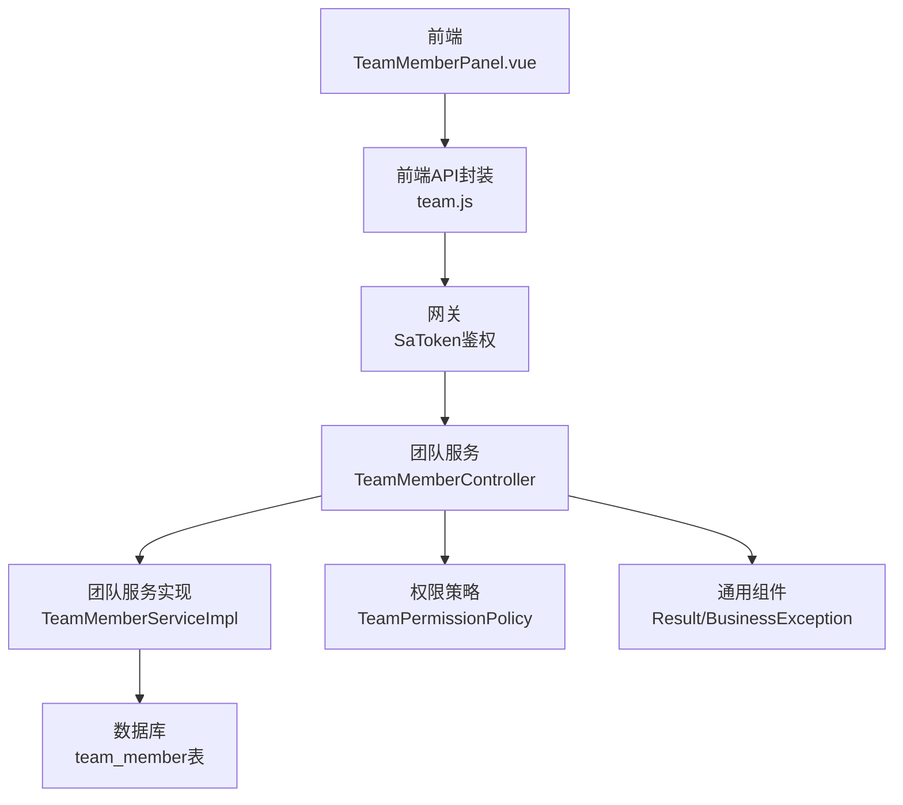
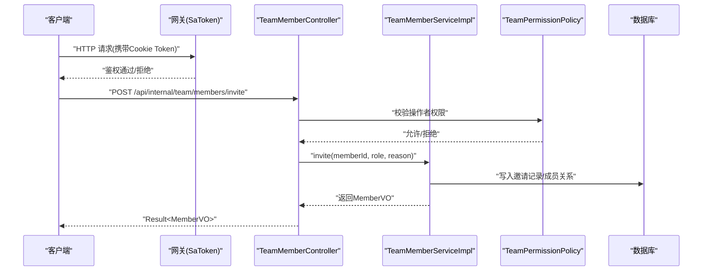
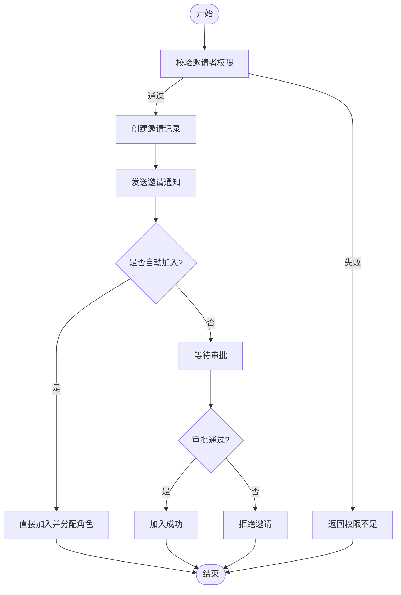
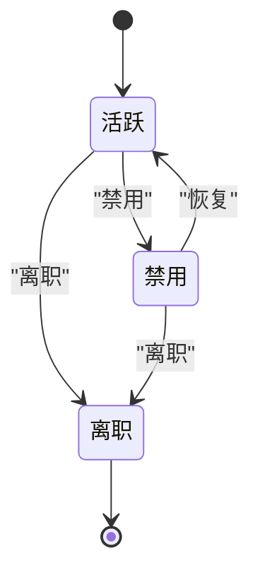
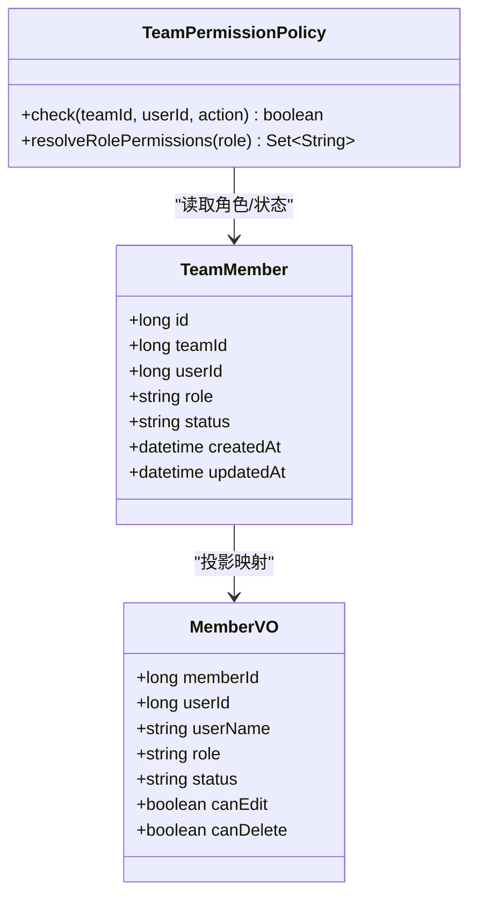
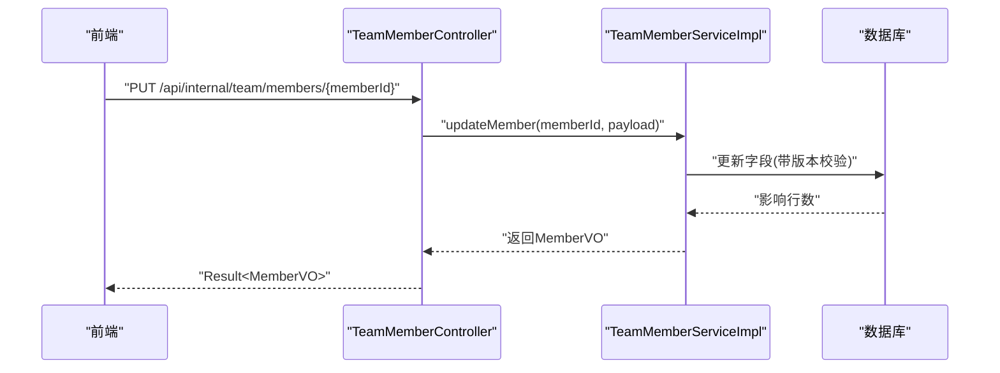
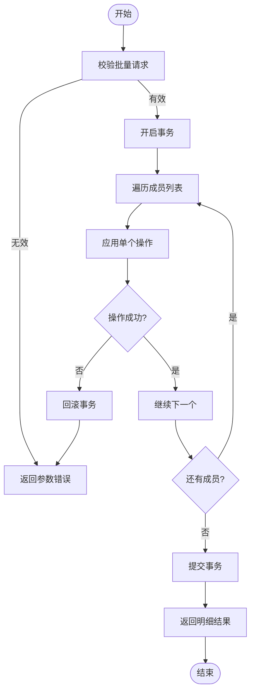
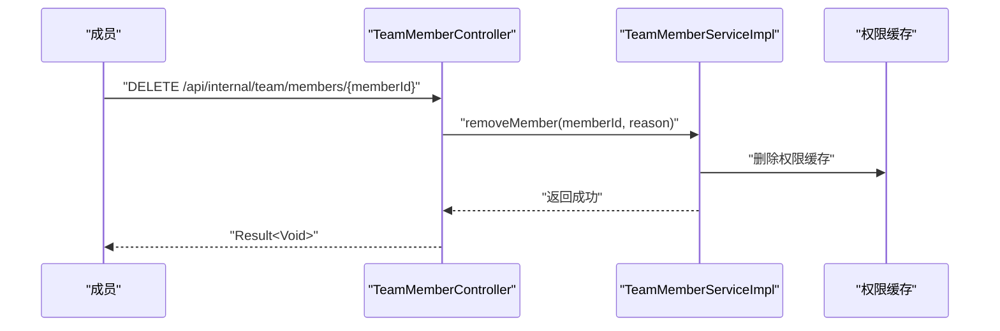
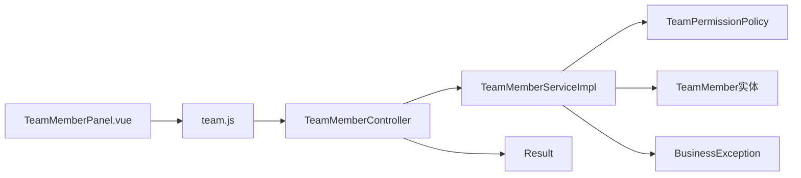

# 团队成员管理接口

<cite>
**本文引用的文件**
- [zxyz-team-service/src/main/java/uno/acloud/team/controller/TeamMemberController.java](file://ZXYZdatabaseBack/zxyz-team-service/src/main/java/uno/acloud/team/controller/TeamMemberController.java)
- [zxyz-team-service/src/main/java/uno/acloud/team/service/TeamMemberService.java](file://ZXYZdatabaseBack/zxyz-team-service/src/main/java/uno/acloud/team/service/TeamMemberService.java)
- [zxyz-team-service/src/main/java/uno/acloud/team/service/impl/TeamMemberServiceImpl.java](file://ZXYZdatabaseBack/zxyz-team-service/src/main/java/uno/acloud/team/service/impl/TeamMemberServiceImpl.java)
- [zxyz-team-service/src/main/java/uno/acloud/team/entity/TeamMember.java](file://ZXYZdatabaseBack/zxyz-team-service/src/main/java/uno/acloud/team/entity/TeamMember.java)
- [zxyz-team-service/src/main/java/uno/acloud/team/dto/request/InviteMemberRequest.java](file://ZXYZdatabaseBack/zxyz-team-service/src/main/java/uno/acloud/team/dto/request/InviteMemberRequest.java)
- [zxyz-team-service/src/main/java/uno/acloud/team/dto/request/BatchUpdateMemberStatusRequest.java](file://ZXYZdatabaseBack/zxyz-team-service/src/main/java/uno/acloud/team/dto/request/BatchUpdateMemberStatusRequest.java)
- [zxyz-team-service/src/main/java/uno/acloud/team/dto/response/MemberVO.java](file://ZXYZdatabaseBack/zxyz-team-service/src/main/java/uno/acloud/team/dto/response/MemberVO.java)
- [zxyz-common/src/main/java/uno/acloud/common/web/Result.java](file://ZXYZdatabaseBack/zxyz-common/src/main/java/uno/acloud/common/web/Result.java)
- [zxyz-common/src/main/java/uno/acloud/common/exception/BusinessException.java](file://ZXYZdatabaseBack/zxyz-common/src/main/java/uno/acloud/common/exception/BusinessException.java)
- [zxyz-common/src/main/java/uno/acloud/common/permission/TeamPermissionPolicy.java](file://ZXYZdatabaseBack/zxyz-common/src/main/java/uno/acloud/common/permission/TeamPermissionPolicy.java)
- [nacos-config/zxyz-team-service.yml](file://nacos-config/zxyz-team-service.yml)
- [ZXYZdatabaseFront/src/api/team.js](file://ZXYZdatabaseFront/src/api/team.js)
- [ZXYZdatabaseFront/src/components/team-settings/TeamMemberPanel.vue](file://ZXYZdatabaseFront/src/components/team-settings/TeamMemberPanel.vue)
- [ZXYZdatabaseFront/src/composables/team/useTeamManagement.js](file://ZXYZdatabaseFront/src/composables/team/useTeamManagement.js)
</cite>

## 目录
1. [简介](#简介)
2. [项目结构](#项目结构)
3. [核心组件](#核心组件)
4. [架构总览](#架构总览)
5. [详细组件分析](#详细组件分析)
6. [依赖分析](#依赖分析)
7. [性能考虑](#性能考虑)
8. [故障排查指南](#故障排查指南)
9. [结论](#结论)
10. [附录：接口清单与示例](#附录接口清单与示例)

## 简介
本文件为 ZXYZ 项目的“团队成员管理”RESTful API 文档，覆盖成员邀请与加入、成员状态管理（活跃、禁用、离职）、角色分配、成员信息更新、批量操作等能力。同时说明审批流程、权限继承机制、冲突处理与退出流程，并提供请求/响应示例与错误处理说明，帮助前后端开发者快速集成与联调。

## 项目结构
团队管理相关能力集中在 zxyz-team-service 模块，采用传统分层（controller → service/impl → mapper → entity），并通过 zxyz-common 提供统一响应体、异常与权限策略。前端通过 Vue 3 + Element Plus 调用 team.js 封装的接口，并在 TeamMemberPanel 中实现交互。

图表来源
- [zxyz-team-service/src/main/java/uno/acloud/team/controller/TeamMemberController.java](file://ZXYZdatabaseBack/zxyz-team-service/src/main/java/uno/acloud/team/controller/TeamMemberController.java)
- [zxyz-team-service/src/main/java/uno/acloud/team/service/impl/TeamMemberServiceImpl.java](file://ZXYZdatabaseBack/zxyz-team-service/src/main/java/uno/acloud/team/service/impl/TeamMemberServiceImpl.java)
- [zxyz-common/src/main/java/uno/acloud/common/web/Result.java](file://ZXYZdatabaseBack/zxyz-common/src/main/java/uno/acloud/common/web/Result.java)
- [zxyz-common/src/main/java/uno/acloud/common/permission/TeamPermissionPolicy.java](file://ZXYZdatabaseBack/zxyz-common/src/main/java/uno/acloud/common/permission/TeamPermissionPolicy.java)
- [ZXYZdatabaseFront/src/components/team-settings/TeamMemberPanel.vue](file://ZXYZdatabaseFront/src/components/team-settings/TeamMemberPanel.vue)
- [ZXYZdatabaseFront/src/api/team.js](file://ZXYZdatabaseFront/src/api/team.js)

章节来源
- [zxyz-team-service/src/main/java/uno/acloud/team/controller/TeamMemberController.java](file://ZXYZdatabaseBack/zxyz-team-service/src/main/java/uno/acloud/team/controller/TeamMemberController.java)
- [zxyz-team-service/src/main/java/uno/acloud/team/service/impl/TeamMemberServiceImpl.java](file://ZXYZdatabaseBack/zxyz-team-service/src/main/java/uno/acloud/team/service/impl/TeamMemberServiceImpl.java)
- [ZXYZdatabaseFront/src/api/team.js](file://ZXYZdatabaseFront/src/api/team.js)
- [ZXYZdatabaseFront/src/components/team-settings/TeamMemberPanel.vue](file://ZXYZdatabaseFront/src/components/team-settings/TeamMemberPanel.vue)

## 核心组件
- 控制器层：对外暴露 REST 端点，负责参数校验、权限检查与结果包装。
- 服务层：实现业务编排，包括邀请、加入、状态变更、角色分配、批量操作、冲突处理与审计事件发布。
- 实体与DTO：成员实体、请求对象与返回视图对象分离，遵循窄端点+投影模式。
- 权限策略：基于角色的访问控制，支持成员角色与权限继承。
- 通用组件：统一响应 Result<T> 与业务异常 BusinessException。

章节来源
- [zxyz-team-service/src/main/java/uno/acloud/team/controller/TeamMemberController.java](file://ZXYZdatabaseBack/zxyz-team-service/src/main/java/uno/acloud/team/controller/TeamMemberController.java)
- [zxyz-team-service/src/main/java/uno/acloud/team/service/TeamMemberService.java](file://ZXYZdatabaseBack/zxyz-team-service/src/main/java/uno/acloud/team/service/TeamMemberService.java)
- [zxyz-team-service/src/main/java/uno/acloud/team/service/impl/TeamMemberServiceImpl.java](file://ZXYZdatabaseBack/zxyz-team-service/src/main/java/uno/acloud/team/service/impl/TeamMemberServiceImpl.java)
- [zxyz-common/src/main/java/uno/acloud/common/web/Result.java](file://ZXYZdatabaseBack/zxyz-common/src/main/java/uno/acloud/common/web/Result.java)
- [zxyz-common/src/main/java/uno/acloud/common/exception/BusinessException.java](file://ZXYZdatabaseBack/zxyz-common/src/main/java/uno/acloud/common/exception/BusinessException.java)
- [zxyz-common/src/main/java/uno/acloud/common/permission/TeamPermissionPolicy.java](file://ZXYZdatabaseBack/zxyz-common/src/main/java/uno/acloud/common/permission/TeamPermissionPolicy.java)

## 架构总览
团队管理接口在网关层进行 SaToken 认证，进入团队服务后由控制器路由到服务层，服务层执行权限校验、业务逻辑与数据持久化，必要时发布异步事件（如邮件邀请、审计日志）。

图表来源
- [zxyz-team-service/src/main/java/uno/acloud/team/controller/TeamMemberController.java](file://ZXYZdatabaseBack/zxyz-team-service/src/main/java/uno/acloud/team/controller/TeamMemberController.java)
- [zxyz-team-service/src/main/java/uno/acloud/team/service/impl/TeamMemberServiceImpl.java](file://ZXYZdatabaseBack/zxyz-team-service/src/main/java/uno/acloud/team/service/impl/TeamMemberServiceImpl.java)
- [zxyz-common/src/main/java/uno/acloud/common/permission/TeamPermissionPolicy.java](file://ZXYZdatabaseBack/zxyz-common/src/main/java/uno/acloud/common/permission/TeamPermissionPolicy.java)

## 详细组件分析

### 成员邀请与加入流程
- 邀请：管理员或具备邀请权限的成员发起邀请，系统生成邀请记录并发送通知（邮件/站内信），被邀请人需在有效期内完成加入。
- 加入：被邀请人通过链接或申请入口提交加入请求，经审批通过后成为正式成员。
- 审批：根据团队策略配置，可能需负责人审批；支持批量审批与拒绝。
- 冲突处理：重复邀请时返回冲突提示；同一邮箱/账号已存在时给出明确错误码。

图表来源
- [zxyz-team-service/src/main/java/uno/acloud/team/service/impl/TeamMemberServiceImpl.java](file://ZXYZdatabaseBack/zxyz-team-service/src/main/java/uno/acloud/team/service/impl/TeamMemberServiceImpl.java)
- [zxyz-team-service/src/main/java/uno/acloud/team/dto/request/InviteMemberRequest.java](file://ZXYZdatabaseBack/zxyz-team-service/src/main/java/uno/acloud/team/dto/request/InviteMemberRequest.java)
- [zxyz-common/src/main/java/uno/acloud/common/permission/TeamPermissionPolicy.java](file://ZXYZdatabaseBack/zxyz-common/src/main/java/uno/acloud/common/permission/TeamPermissionPolicy.java)

章节来源
- [zxyz-team-service/src/main/java/uno/acloud/team/controller/TeamMemberController.java](file://ZXYZdatabaseBack/zxyz-team-service/src/main/java/uno/acloud/team/controller/TeamMemberController.java)
- [zxyz-team-service/src/main/java/uno/acloud/team/service/impl/TeamMemberServiceImpl.java](file://ZXYZdatabaseBack/zxyz-team-service/src/main/java/uno/acloud/team/service/impl/TeamMemberServiceImpl.java)
- [zxyz-team-service/src/main/java/uno/acloud/team/dto/request/InviteMemberRequest.java](file://ZXYZdatabaseBack/zxyz-team-service/src/main/java/uno/acloud/team/dto/request/InviteMemberRequest.java)

### 成员状态管理（活跃、禁用、离职）
- 活跃：正常参与协作，拥有角色赋予的权限。
- 禁用：临时限制访问，保留历史数据与审计记录。
- 离职：终止成员关系，清理即时权限，保留必要审计与归档数据。
- 批量操作：支持对多个成员一次性变更状态，便于组织调整。

图表来源
- [zxyz-team-service/src/main/java/uno/acloud/team/entity/TeamMember.java](file://ZXYZdatabaseBack/zxyz-team-service/src/main/java/uno/acloud/team/entity/TeamMember.java)
- [zxyz-team-service/src/main/java/uno/acloud/team/dto/request/BatchUpdateMemberStatusRequest.java](file://ZXYZdatabaseBack/zxyz-team-service/src/main/java/uno/acloud/team/dto/request/BatchUpdateMemberStatusRequest.java)

章节来源
- [zxyz-team-service/src/main/java/uno/acloud/team/entity/TeamMember.java](file://ZXYZdatabaseBack/zxyz-team-service/src/main/java/uno/acloud/team/entity/TeamMember.java)
- [zxyz-team-service/src/main/java/uno/acloud/team/dto/request/BatchUpdateMemberStatusRequest.java](file://ZXYZdatabaseBack/zxyz-team-service/src/main/java/uno/acloud/team/dto/request/BatchUpdateMemberStatusRequest.java)
- [zxyz-team-service/src/main/java/uno/acloud/team/service/impl/TeamMemberServiceImpl.java](file://ZXYZdatabaseBack/zxyz-team-service/src/main/java/uno/acloud/team/service/impl/TeamMemberServiceImpl.java)

### 成员角色分配与权限继承
- 角色分配：支持为成员设置角色（如成员、协作者、管理员），不同角色对应不同权限集合。
- 权限继承：成员权限由其角色决定，若存在多级角色或组角色，按策略合并计算最终权限。
- 冲突处理：当角色变更导致权限提升或降低时，需记录审计并触发权限缓存刷新。

图表来源
- [zxyz-team-service/src/main/java/uno/acloud/team/entity/TeamMember.java](file://ZXYZdatabaseBack/zxyz-team-service/src/main/java/uno/acloud/team/entity/TeamMember.java)
- [zxyz-team-service/src/main/java/uno/acloud/team/dto/response/MemberVO.java](file://ZXYZdatabaseBack/zxyz-team-service/src/main/java/uno/acloud/team/dto/response/MemberVO.java)
- [zxyz-common/src/main/java/uno/acloud/common/permission/TeamPermissionPolicy.java](file://ZXYZdatabaseBack/zxyz-common/src/main/java/uno/acloud/common/permission/TeamPermissionPolicy.java)

章节来源
- [zxyz-team-service/src/main/java/uno/acloud/team/entity/TeamMember.java](file://ZXYZdatabaseBack/zxyz-team-service/src/main/java/uno/acloud/team/entity/TeamMember.java)
- [zxyz-team-service/src/main/java/uno/acloud/team/dto/response/MemberVO.java](file://ZXYZdatabaseBack/zxyz-team-service/src/main/java/uno/acloud/team/dto/response/MemberVO.java)
- [zxyz-common/src/main/java/uno/acloud/common/permission/TeamPermissionPolicy.java](file://ZXYZdatabaseBack/zxyz-common/src/main/java/uno/acloud/common/permission/TeamPermissionPolicy.java)

### 成员信息更新
- 可更新字段：昵称、头像、备注、联系方式等（具体以接口定义为准）。
- 校验规则：必填项校验、格式校验、长度限制。
- 并发控制：避免多人同时修改导致覆盖，使用乐观锁或版本号。

图表来源
- [zxyz-team-service/src/main/java/uno/acloud/team/controller/TeamMemberController.java](file://ZXYZdatabaseBack/zxyz-team-service/src/main/java/uno/acloud/team/controller/TeamMemberController.java)
- [zxyz-team-service/src/main/java/uno/acloud/team/service/impl/TeamMemberServiceImpl.java](file://ZXYZdatabaseBack/zxyz-team-service/src/main/java/uno/acloud/team/service/impl/TeamMemberServiceImpl.java)

章节来源
- [zxyz-team-service/src/main/java/uno/acloud/team/controller/TeamMemberController.java](file://ZXYZdatabaseBack/zxyz-team-service/src/main/java/uno/acloud/team/controller/TeamMemberController.java)
- [zxyz-team-service/src/main/java/uno/acloud/team/service/impl/TeamMemberServiceImpl.java](file://ZXYZdatabaseBack/zxyz-team-service/src/main/java/uno/acloud/team/service/impl/TeamMemberServiceImpl.java)

### 批量成员操作
- 支持批量启用/禁用/离职、批量角色调整。
- 事务性：批量操作应保证原子性，任一失败则整体回滚。
- 反馈：返回每个子操作的明细结果，便于前端展示。

图表来源
- [zxyz-team-service/src/main/java/uno/acloud/team/service/impl/TeamMemberServiceImpl.java](file://ZXYZdatabaseBack/zxyz-team-service/src/main/java/uno/acloud/team/service/impl/TeamMemberServiceImpl.java)
- [zxyz-team-service/src/main/java/uno/acloud/team/dto/request/BatchUpdateMemberStatusRequest.java](file://ZXYZdatabaseBack/zxyz-team-service/src/main/java/uno/acloud/team/dto/request/BatchUpdateMemberStatusRequest.java)

章节来源
- [zxyz-team-service/src/main/java/uno/acloud/team/service/impl/TeamMemberServiceImpl.java](file://ZXYZdatabaseBack/zxyz-team-service/src/main/java/uno/acloud/team/service/impl/TeamMemberServiceImpl.java)
- [zxyz-team-service/src/main/java/uno/acloud/team/dto/request/BatchUpdateMemberStatusRequest.java](file://ZXYZdatabaseBack/zxyz-team-service/src/main/java/uno/acloud/team/dto/request/BatchUpdateMemberStatusRequest.java)

### 成员退出流程
- 主动退出：成员可自行退出团队，需确认并记录审计。
- 被动移除：管理员可将成员移除，理由可选。
- 资源回收：退出后清理会话、权限缓存与临时数据。

图表来源
- [zxyz-team-service/src/main/java/uno/acloud/team/controller/TeamMemberController.java](file://ZXYZdatabaseBack/zxyz-team-service/src/main/java/uno/acloud/team/controller/TeamMemberController.java)
- [zxyz-team-service/src/main/java/uno/acloud/team/service/impl/TeamMemberServiceImpl.java](file://ZXYZdatabaseBack/zxyz-team-service/src/main/java/uno/acloud/team/service/impl/TeamMemberServiceImpl.java)

章节来源
- [zxyz-team-service/src/main/java/uno/acloud/team/controller/TeamMemberController.java](file://ZXYZdatabaseBack/zxyz-team-service/src/main/java/uno/acloud/team/controller/TeamMemberController.java)
- [zxyz-team-service/src/main/java/uno/acloud/team/service/impl/TeamMemberServiceImpl.java](file://ZXYZdatabaseBack/zxyz-team-service/src/main/java/uno/acloud/team/service/impl/TeamMemberServiceImpl.java)

## 依赖分析
- 控制器依赖服务层与权限策略，服务层依赖数据访问与缓存。
- 统一响应与异常由 zxyz-common 提供，确保跨服务一致性。
- 前端通过 team.js 调用后端接口，TeamMemberPanel 负责UI交互。

图表来源
- [ZXYZdatabaseFront/src/components/team-settings/TeamMemberPanel.vue](file://ZXYZdatabaseFront/src/components/team-settings/TeamMemberPanel.vue)
- [ZXYZdatabaseFront/src/api/team.js](file://ZXYZdatabaseFront/src/api/team.js)
- [zxyz-team-service/src/main/java/uno/acloud/team/controller/TeamMemberController.java](file://ZXYZdatabaseBack/zxyz-team-service/src/main/java/uno/acloud/team/controller/TeamMemberController.java)
- [zxyz-team-service/src/main/java/uno/acloud/team/service/impl/TeamMemberServiceImpl.java](file://ZXYZdatabaseBack/zxyz-team-service/src/main/java/uno/acloud/team/service/impl/TeamMemberServiceImpl.java)
- [zxyz-common/src/main/java/uno/acloud/common/web/Result.java](file://ZXYZdatabaseBack/zxyz-common/src/main/java/uno/acloud/common/web/Result.java)
- [zxyz-common/src/main/java/uno/acloud/common/exception/BusinessException.java](file://ZXYZdatabaseBack/zxyz-common/src/main/java/uno/acloud/common/exception/BusinessException.java)

章节来源
- [ZXYZdatabaseFront/src/api/team.js](file://ZXYZdatabaseFront/src/api/team.js)
- [ZXYZdatabaseFront/src/components/team-settings/TeamMemberPanel.vue](file://ZXYZdatabaseFront/src/components/team-settings/TeamMemberPanel.vue)
- [zxyz-team-service/src/main/java/uno/acloud/team/controller/TeamMemberController.java](file://ZXYZdatabaseBack/zxyz-team-service/src/main/java/uno/acloud/team/controller/TeamMemberController.java)
- [zxyz-team-service/src/main/java/uno/acloud/team/service/impl/TeamMemberServiceImpl.java](file://ZXYZdatabaseBack/zxyz-team-service/src/main/java/uno/acloud/team/service/impl/TeamMemberServiceImpl.java)

## 性能考虑
- 批量操作使用事务与分批处理，避免长事务与内存溢出。
- 权限计算结果缓存，减少频繁查询。
- 邀请通知异步化，避免阻塞主流程。
- 数据库索引优化：teamId、userId、status、role 等常用查询字段建立索引。

[本节为通用指导，不直接分析具体文件]

## 故障排查指南
- 常见错误
  - 重复邀请：返回冲突码，提示已存在邀请或成员。
  - 权限不足：操作者不具备所需角色或权限。
  - 成员不存在：目标成员ID无效或不在当前团队。
  - 参数校验失败：必填项缺失、格式错误。
- 定位方法
  - 查看网关日志确认鉴权是否通过。
  - 检查服务层异常堆栈与业务异常码。
  - 核对数据库记录与缓存一致性。
  - 前端控制台与网络面板查看请求/响应。

章节来源
- [zxyz-common/src/main/java/uno/acloud/common/exception/BusinessException.java](file://ZXYZdatabaseBack/zxyz-common/src/main/java/uno/acloud/common/exception/BusinessException.java)
- [zxyz-common/src/main/java/uno/acloud/common/web/Result.java](file://ZXYZdatabaseBack/zxyz-common/src/main/java/uno/acloud/common/web/Result.java)

## 结论
团队管理接口围绕邀请、加入、状态、角色与批量操作构建，结合权限策略与统一异常体系，形成稳定可靠的协作基础。建议在生产环境完善审计、监控与告警，确保问题可追溯与快速恢复。

[本节为总结，不直接分析具体文件]

## 附录：接口清单与示例

### 接口清单
- 邀请成员
  - 方法：POST
  - 路径：/api/internal/team/members/invite
  - 权限：团队管理员或具备邀请权限的角色
  - 请求体：InviteMemberRequest
  - 响应：Result<MemberVO>
- 加入成员（审批通过）
  - 方法：POST
  - 路径：/api/internal/team/members/join
  - 权限：被邀请人或审批人
  - 请求体：{ inviteId, action }
  - 响应：Result<MemberVO>
- 更新成员信息
  - 方法：PUT
  - 路径：/api/internal/team/members/{memberId}
  - 权限：管理员或本人
  - 请求体：{ nickname, avatar, remark, ... }
  - 响应：Result<MemberVO>
- 批量更新成员状态
  - 方法：POST
  - 路径：/api/internal/team/members/batch/status
  - 权限：管理员
  - 请求体：BatchUpdateMemberStatusRequest
  - 响应：Result<List<BatchResult>>
- 移除成员（退出/移除）
  - 方法：DELETE
  - 路径：/api/internal/team/members/{memberId}
  - 权限：管理员或本人
  - 响应：Result<Void>

### 请求示例（JSON）
- 邀请成员
  - 请求体：{ "teamId": "T001", "userId": "U123", "role": "member", "reason": "项目协作" }
- 加入成员
  - 请求体：{ "inviteId": "INV001", "action": "accept" }
- 更新成员信息
  - 请求体：{ "nickname": "张三", "avatar": "https://...", "remark": "新同事" }
- 批量更新状态
  - 请求体：{ "memberIds": ["M001","M002"], "status": "disabled", "reason": "组织架构调整" }

### 响应示例（JSON）
- 成功
  - { "code": 1, "message": "成功", "data": { /* MemberVO */ } }
- 失败
  - { "code": 403, "message": "权限不足", "data": null }
  - { "code": 409, "message": "重复邀请", "data": null }
  - { "code": 404, "message": "成员不存在", "data": null }

### 错误处理说明
- 重复邀请：返回冲突码，提示已存在邀请或成员，前端可引导用户查看邀请状态。
- 权限不足：检查操作者角色与团队策略，必要时升级权限。
- 成员不存在：确认成员ID与团队上下文是否正确。
- 参数校验失败：根据错误消息修正请求体。

章节来源
- [zxyz-team-service/src/main/java/uno/acloud/team/controller/TeamMemberController.java](file://ZXYZdatabaseBack/zxyz-team-service/src/main/java/uno/acloud/team/controller/TeamMemberController.java)
- [zxyz-team-service/src/main/java/uno/acloud/team/service/impl/TeamMemberServiceImpl.java](file://ZXYZdatabaseBack/zxyz-team-service/src/main/java/uno/acloud/team/service/impl/TeamMemberServiceImpl.java)
- [zxyz-common/src/main/java/uno/acloud/common/web/Result.java](file://ZXYZdatabaseBack/zxyz-common/src/main/java/uno/acloud/common/web/Result.java)
- [zxyz-common/src/main/java/uno/acloud/common/exception/BusinessException.java](file://ZXYZdatabaseBack/zxyz-common/src/main/java/uno/acloud/common/exception/BusinessException.java)
- [ZXYZdatabaseFront/src/api/team.js](file://ZXYZdatabaseFront/src/api/team.js)
- [ZXYZdatabaseFront/src/components/team-settings/TeamMemberPanel.vue](file://ZXYZdatabaseFront/src/components/team-settings/TeamMemberPanel.vue)
- [ZXYZdatabaseFront/src/composables/team/useTeamManagement.js](file://ZXYZdatabaseFront/src/composables/team/useTeamManagement.js)
- [nacos-config/zxyz-team-service.yml](file://nacos-config/zxyz-team-service.yml)