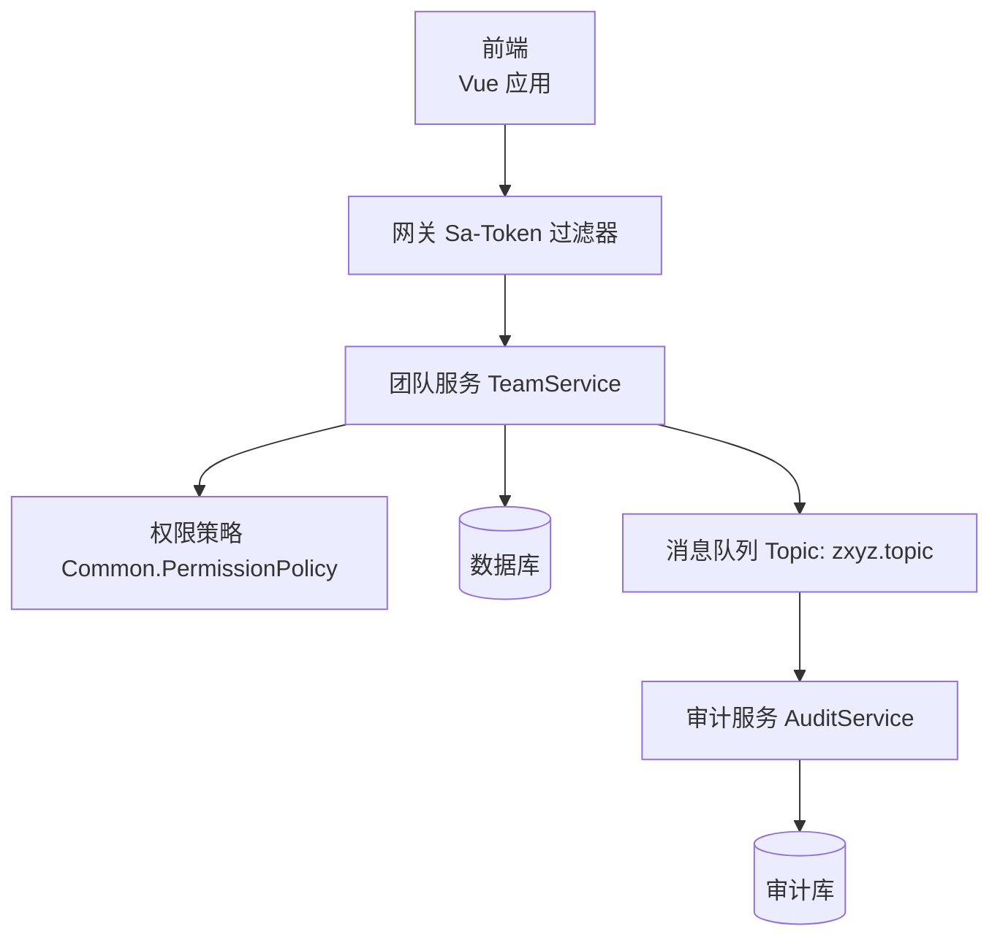
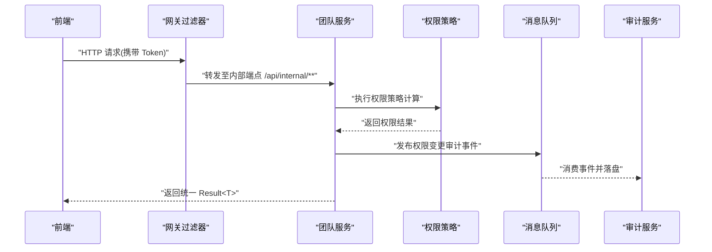
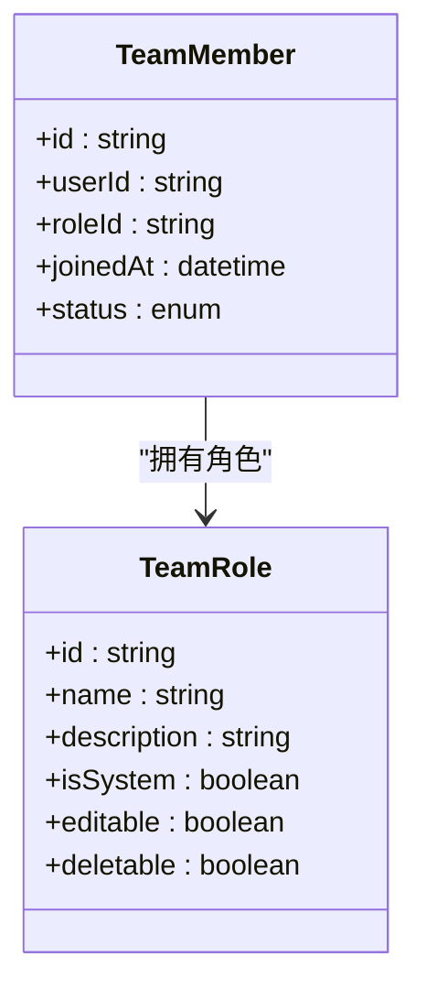
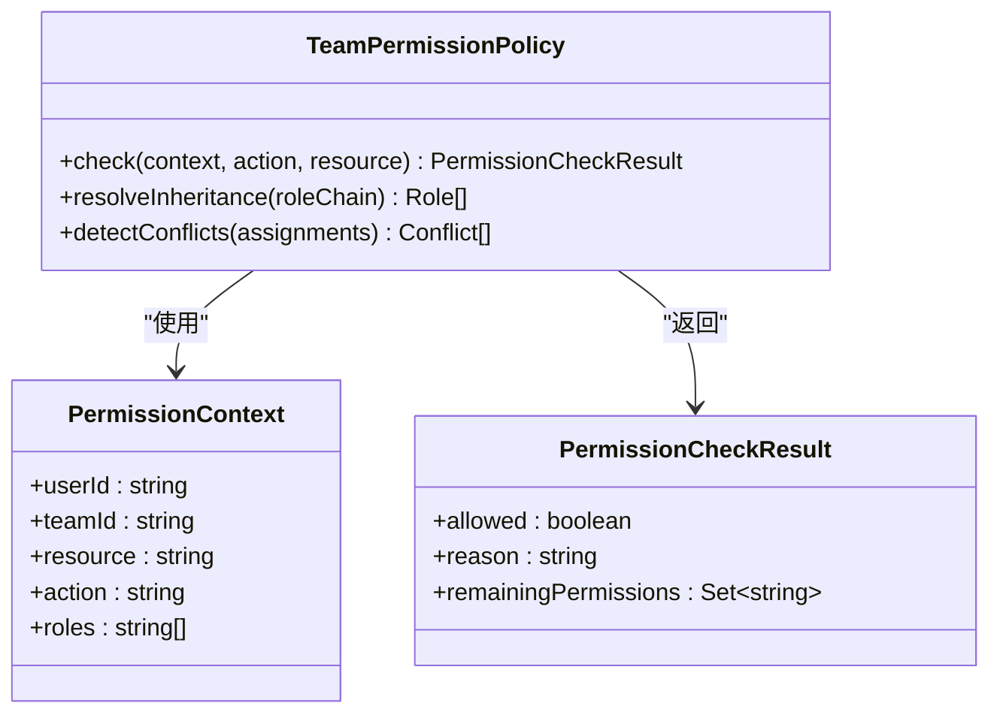
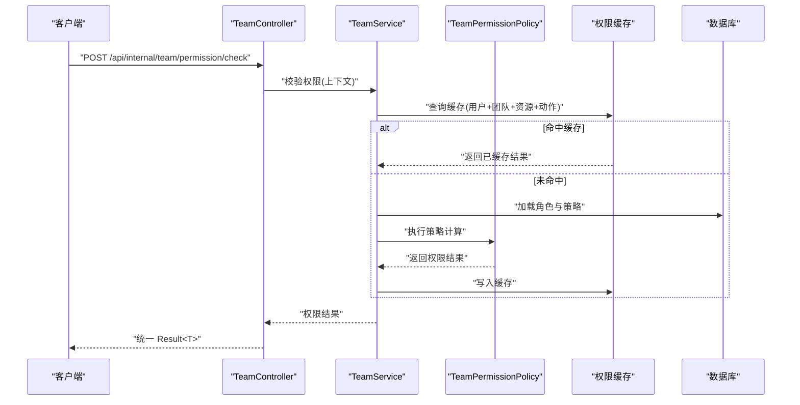
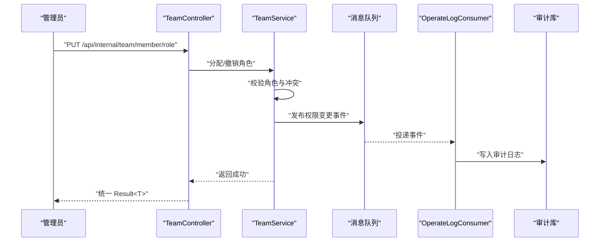
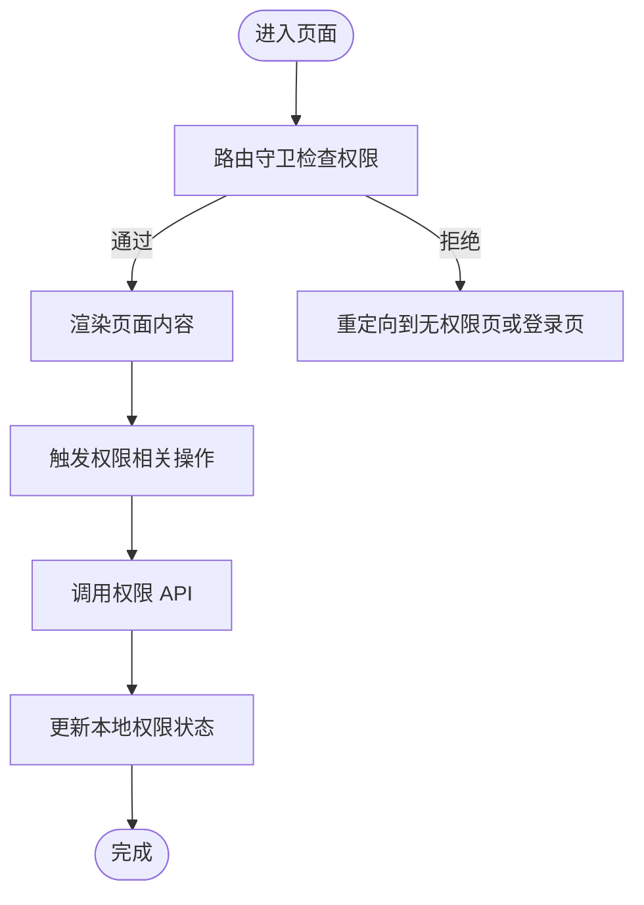
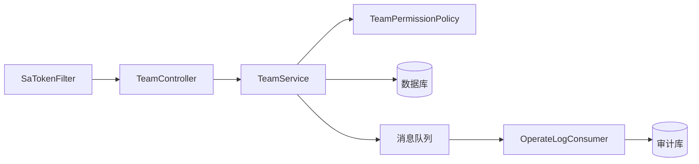

# 团队权限控制接口

<cite>
**本文引用的文件**   
- [zxyz-team-service/src/main/java/uno/acloud/team/controller/TeamController.java](file://ZXYZdatabaseBack/zxyz-team-service/src/main/java/uno/acloud/team/controller/TeamController.java)
- [zxyz-team-service/src/main/java/uno/acloud/team/service/TeamService.java](file://ZXYZdatabaseBack/zxyz-team-service/src/main/java/uno/acloud/team/service/TeamService.java)
- [zxyz-team-service/src/main/java/uno/acloud/team/entity/TeamRole.java](file://ZXYZdatabaseBack/zxyz-team-service/src/main/java/uno/acloud/team/entity/TeamRole.java)
- [zxyz-team-service/src/main/java/uno/acloud/team/entity/TeamMember.java](file://ZXYZdatabaseBack/zxyz-team-service/src/main/java/uno/acloud/team/entity/TeamMember.java)
- [zxyz-common/src/main/java/uno/acloud/common/permission/TeamPermissionPolicy.java](file://ZXYZdatabaseBack/zxyz-common/src/main/java/uno/acloud/common/permission/TeamPermissionPolicy.java)
- [zxyz-common/src/main/java/uno/acloud/common/permission/PermissionCheckResult.java](file://ZXYZdatabaseBack/zxyz-common/src/main/java/uno/acloud/common/permission/PermissionCheckResult.java)
- [zxyz-common/src/main/java/uno/acloud/common/permission/PermissionContext.java](file://ZXYZdatabaseBack/zxyz-common/src/main/java/uno/acloud/common/permission/PermissionContext.java)
- [zxyz-audit-service/src/main/java/uno/acloud/audit/mq/OperateLogConsumer.java](file://ZXYZdatabaseBack/zxyz-audit-service/src/main/java/uno/acloud/audit/mq/OperateLogConsumer.java)
- [zxyz-gateway/src/main/java/uno/acloud/gateway/filter/SaTokenFilterConfig.java](file://ZXYZdatabaseBack/zxyz-gateway/src/main/java/uno/acloud/gateway/filter/SaTokenFilterConfig.java)
- [ZXYZdatabaseFront/src/api/permission.js](file://ZXYZdatabaseFront/src/api/permission.js)
- [ZXYZdatabaseFront/src/constants/teamPermissions.js](file://ZXYZdatabaseFront/src/constants/teamPermissions.js)
- [ZXYZdatabaseFront/src/components/RoleManagementPanel.vue](file://ZXYZdatabaseFront/src/components/RoleManagementPanel.vue)
- [ZXYZdatabaseFront/src/composables/useTeamPermissionActions.js](file://ZXYZdatabaseFront/src/composables/useTeamPermissionActions.js)
- [ZXYZdatabaseFront/src/router/guards/permission.js](file://ZXYZdatabaseFront/src/router/guards/permission.js)
</cite>

## 目录
1. [简介](#简介)
2. [项目结构](#项目结构)
3. [核心组件](#核心组件)
4. [架构总览](#架构总览)
5. [详细组件分析](#详细组件分析)
6. [依赖关系分析](#依赖关系分析)
7. [性能与缓存](#性能与缓存)
8. [故障排查指南](#故障排查指南)
9. [结论](#结论)
10. [附录：API 定义与示例](#附录api-定义与示例)

## 简介
本文件面向 ZXYZ 项目的“团队权限控制”能力，基于 RBAC（角色-权限）模型提供 RESTful API，覆盖以下关键能力：
- 自定义角色创建与管理
- 权限策略定义与校验
- 成员角色分配与撤销
- 权限继承规则说明
- 权限验证接口
- 权限粒度控制、角色模板、权限审计日志、权限缓存机制

同时给出完整的请求/响应示例与错误处理说明，涵盖权限冲突、角色循环依赖、权限验证失败等常见业务场景。

## 项目结构
后端采用微服务架构，团队权限相关能力主要由 zxyz-team-service 暴露对外接口，zxyz-common 提供权限策略与上下文，zxyz-audit-service 负责审计日志消费与落盘，zxyz-gateway 统一鉴权拦截内部端点。前端通过 Vue 3 + Element Plus 调用权限相关 API，并在路由守卫中进行前端侧权限校验。

图表来源
- [zxyz-team-service/src/main/java/uno/acloud/team/controller/TeamController.java](file://ZXYZdatabaseBack/zxyz-team-service/src/main/java/uno/acloud/team/controller/TeamController.java)
- [zxyz-common/src/main/java/uno/acloud/common/permission/TeamPermissionPolicy.java](file://ZXYZdatabaseBack/zxyz-common/src/main/java/uno/acloud/common/permission/TeamPermissionPolicy.java)
- [zxyz-audit-service/src/main/java/uno/acloud/audit/mq/OperateLogConsumer.java](file://ZXYZdatabaseBack/zxyz-audit-service/src/main/java/uno/acloud/audit/mq/OperateLogConsumer.java)
- [zxyz-gateway/src/main/java/uno/acloud/gateway/filter/SaTokenFilterConfig.java](file://ZXYZdatabaseBack/zxyz-gateway/src/main/java/uno/acloud/gateway/filter/SaTokenFilterConfig.java)

章节来源
- [zxyz-team-service/src/main/java/uno/acloud/team/controller/TeamController.java](file://ZXYZdatabaseBack/zxyz-team-service/src/main/java/uno/acloud/team/controller/TeamController.java)
- [zxyz-common/src/main/java/uno/acloud/common/permission/TeamPermissionPolicy.java](file://ZXYZdatabaseBack/zxyz-common/src/main/java/uno/acloud/common/permission/TeamPermissionPolicy.java)
- [zxyz-audit-service/src/main/java/uno/acloud/audit/mq/OperateLogConsumer.java](file://ZXYZdatabaseBack/zxyz-audit-service/src/main/java/uno/acloud/audit/mq/OperateLogConsumer.java)
- [zxyz-gateway/src/main/java/uno/acloud/gateway/filter/SaTokenFilterConfig.java](file://ZXYZdatabaseBack/zxyz-gateway/src/main/java/uno/acloud/gateway/filter/SaTokenFilterConfig.java)

## 核心组件
- 团队服务控制器：对外暴露团队、角色、成员、权限校验等 REST 接口
- 团队服务：实现角色管理、成员分配、权限计算与审计事件发布
- 权限策略：封装 RBAC 策略、继承规则、冲突检测与结果封装
- 审计消费者：消费权限变更事件并持久化审计日志
- 网关过滤器：对内部端点进行鉴权拦截，防止公网访问
- 前端权限模块：调用权限 API、维护本地权限状态、路由级权限守卫

章节来源
- [zxyz-team-service/src/main/java/uno/acloud/team/controller/TeamController.java](file://ZXYZdatabaseBack/zxyz-team-service/src/main/java/uno/acloud/team/controller/TeamController.java)
- [zxyz-team-service/src/main/java/uno/acloud/team/service/TeamService.java](file://ZXYZdatabaseBack/zxyz-team-service/src/main/java/uno/acloud/team/service/TeamService.java)
- [zxyz-common/src/main/java/uno/acloud/common/permission/TeamPermissionPolicy.java](file://ZXYZdatabaseBack/zxyz-common/src/main/java/uno/acloud/common/permission/TeamPermissionPolicy.java)
- [zxyz-audit-service/src/main/java/uno/acloud/audit/mq/OperateLogConsumer.java](file://ZXYZdatabaseBack/zxyz-audit-service/src/main/java/uno/acloud/audit/mq/OperateLogConsumer.java)
- [zxyz-gateway/src/main/java/uno/acloud/gateway/filter/SaTokenFilterConfig.java](file://ZXYZdatabaseBack/zxyz-gateway/src/main/java/uno/acloud/gateway/filter/SaTokenFilterConfig.java)

## 架构总览
下图展示了从前端到后端的完整权限控制链路，包括认证、授权、策略计算与审计。

图表来源
- [zxyz-gateway/src/main/java/uno/acloud/gateway/filter/SaTokenFilterConfig.java](file://ZXYZdatabaseBack/zxyz-gateway/src/main/java/uno/acloud/gateway/filter/SaTokenFilterConfig.java)
- [zxyz-team-service/src/main/java/uno/acloud/team/controller/TeamController.java](file://ZXYZdatabaseBack/zxyz-team-service/src/main/java/uno/acloud/team/controller/TeamController.java)
- [zxyz-common/src/main/java/uno/acloud/common/permission/TeamPermissionPolicy.java](file://ZXYZdatabaseBack/zxyz-common/src/main/java/uno/acloud/common/permission/TeamPermissionPolicy.java)
- [zxyz-audit-service/src/main/java/uno/acloud/audit/mq/OperateLogConsumer.java](file://ZXYZdatabaseBack/zxyz-audit-service/src/main/java/uno/acloud/audit/mq/OperateLogConsumer.java)

## 详细组件分析

### 角色与成员数据模型
- 团队角色：包含角色标识、名称、描述、是否系统内置、是否可删除、是否可编辑等元信息
- 团队成员：包含成员标识、用户标识、角色标识、加入时间、状态等

图表来源
- [zxyz-team-service/src/main/java/uno/acloud/team/entity/TeamRole.java](file://ZXYZdatabaseBack/zxyz-team-service/src/main/java/uno/acloud/team/entity/TeamRole.java)
- [zxyz-team-service/src/main/java/uno/acloud/team/entity/TeamMember.java](file://ZXYZdatabaseBack/zxyz-team-service/src/main/java/uno/acloud/team/entity/TeamMember.java)

章节来源
- [zxyz-team-service/src/main/java/uno/acloud/team/entity/TeamRole.java](file://ZXYZdatabaseBack/zxyz-team-service/src/main/java/uno/acloud/team/entity/TeamRole.java)
- [zxyz-team-service/src/main/java/uno/acloud/team/entity/TeamMember.java](file://ZXYZdatabaseBack/zxyz-team-service/src/main/java/uno/acloud/team/entity/TeamMember.java)

### 权限策略与上下文
- 权限策略：封装 RBAC 策略、继承规则、冲突检测、结果封装
- 权限上下文：承载当前用户、团队、资源、操作等上下文信息
- 权限检查结果：包含允许/拒绝、原因、剩余权限集合等

图表来源
- [zxyz-common/src/main/java/uno/acloud/common/permission/TeamPermissionPolicy.java](file://ZXYZdatabaseBack/zxyz-common/src/main/java/uno/acloud/common/permission/TeamPermissionPolicy.java)
- [zxyz-common/src/main/java/uno/acloud/common/permission/PermissionContext.java](file://ZXYZdatabaseBack/zxyz-common/src/main/java/uno/acloud/common/permission/PermissionContext.java)
- [zxyz-common/src/main/java/uno/acloud/common/permission/PermissionCheckResult.java](file://ZXYZdatabaseBack/zxyz-common/src/main/java/uno/acloud/common/permission/PermissionCheckResult.java)

章节来源
- [zxyz-common/src/main/java/uno/acloud/common/permission/TeamPermissionPolicy.java](file://ZXYZdatabaseBack/zxyz-common/src/main/java/uno/acloud/common/permission/TeamPermissionPolicy.java)
- [zxyz-common/src/main/java/uno/acloud/common/permission/PermissionContext.java](file://ZXYZdatabaseBack/zxyz-common/src/main/java/uno/acloud/common/permission/PermissionContext.java)
- [zxyz-common/src/main/java/uno/acloud/common/permission/PermissionCheckResult.java](file://ZXYZdatabaseBack/zxyz-common/src/main/java/uno/acloud/common/permission/PermissionCheckResult.java)

### 权限验证流程（序列图）

图表来源
- [zxyz-team-service/src/main/java/uno/acloud/team/controller/TeamController.java](file://ZXYZdatabaseBack/zxyz-team-service/src/main/java/uno/acloud/team/controller/TeamController.java)
- [zxyz-team-service/src/main/java/uno/acloud/team/service/TeamService.java](file://ZXYZdatabaseBack/zxyz-team-service/src/main/java/uno/acloud/team/service/TeamService.java)
- [zxyz-common/src/main/java/uno/acloud/common/permission/TeamPermissionPolicy.java](file://ZXYZdatabaseBack/zxyz-common/src/main/java/uno/acloud/common/permission/TeamPermissionPolicy.java)

章节来源
- [zxyz-team-service/src/main/java/uno/acloud/team/controller/TeamController.java](file://ZXYZdatabaseBack/zxyz-team-service/src/main/java/uno/acloud/team/controller/TeamController.java)
- [zxyz-team-service/src/main/java/uno/acloud/team/service/TeamService.java](file://ZXYZdatabaseBack/zxyz-team-service/src/main/java/uno/acloud/team/service/TeamService.java)
- [zxyz-common/src/main/java/uno/acloud/common/permission/TeamPermissionPolicy.java](file://ZXYZdatabaseBack/zxyz-common/src/main/java/uno/acloud/common/permission/TeamPermissionPolicy.java)

### 权限变更与审计流程（序列图）

图表来源
- [zxyz-team-service/src/main/java/uno/acloud/team/controller/TeamController.java](file://ZXYZdatabaseBack/zxyz-team-service/src/main/java/uno/acloud/team/controller/TeamController.java)
- [zxyz-team-service/src/main/java/uno/acloud/team/service/TeamService.java](file://ZXYZdatabaseBack/zxyz-team-service/src/main/java/uno/acloud/team/service/TeamService.java)
- [zxyz-audit-service/src/main/java/uno/acloud/audit/mq/OperateLogConsumer.java](file://ZXYZdatabaseBack/zxyz-audit-service/src/main/java/uno/acloud/audit/mq/OperateLogConsumer.java)

章节来源
- [zxyz-team-service/src/main/java/uno/acloud/team/controller/TeamController.java](file://ZXYZdatabaseBack/zxyz-team-service/src/main/java/uno/acloud/team/controller/TeamController.java)
- [zxyz-team-service/src/main/java/uno/acloud/team/service/TeamService.java](file://ZXYZdatabaseBack/zxyz-team-service/src/main/java/uno/acloud/team/service/TeamService.java)
- [zxyz-audit-service/src/main/java/uno/acloud/audit/mq/OperateLogConsumer.java](file://ZXYZdatabaseBack/zxyz-audit-service/src/main/java/uno/acloud/audit/mq/OperateLogConsumer.java)

### 前端权限控制集成
- 前端 API 层：封装权限相关接口调用
- 常量定义：团队权限枚举与映射
- 组件：角色管理面板
- Composable：团队权限操作封装
- 路由守卫：基于用户权限进行页面级访问控制

图表来源
- [ZXYZdatabaseFront/src/api/permission.js](file://ZXYZdatabaseFront/src/api/permission.js)
- [ZXYZdatabaseFront/src/constants/teamPermissions.js](file://ZXYZdatabaseFront/src/constants/teamPermissions.js)
- [ZXYZdatabaseFront/src/components/RoleManagementPanel.vue](file://ZXYZdatabaseFront/src/components/RoleManagementPanel.vue)
- [ZXYZdatabaseFront/src/composables/useTeamPermissionActions.js](file://ZXYZdatabaseFront/src/composables/useTeamPermissionActions.js)
- [ZXYZdatabaseFront/src/router/guards/permission.js](file://ZXYZdatabaseFront/src/router/guards/permission.js)

章节来源
- [ZXYZdatabaseFront/src/api/permission.js](file://ZXYZdatabaseFront/src/api/permission.js)
- [ZXYZdatabaseFront/src/constants/teamPermissions.js](file://ZXYZdatabaseFront/src/constants/teamPermissions.js)
- [ZXYZdatabaseFront/src/components/RoleManagementPanel.vue](file://ZXYZdatabaseFront/src/components/RoleManagementPanel.vue)
- [ZXYZdatabaseFront/src/composables/useTeamPermissionActions.js](file://ZXYZdatabaseFront/src/composables/useTeamPermissionActions.js)
- [ZXYZdatabaseFront/src/router/guards/permission.js](file://ZXYZdatabaseFront/src/router/guards/permission.js)

## 依赖关系分析
- 控制器依赖服务层，服务层依赖权限策略与数据库、消息队列
- 网关过滤器对内部端点进行鉴权拦截
- 审计服务独立消费权限变更事件，避免主流程阻塞
- 前端通过 API 层与后端交互，路由守卫进行前端侧权限校验

图表来源
- [zxyz-team-service/src/main/java/uno/acloud/team/controller/TeamController.java](file://ZXYZdatabaseBack/zxyz-team-service/src/main/java/uno/acloud/team/controller/TeamController.java)
- [zxyz-team-service/src/main/java/uno/acloud/team/service/TeamService.java](file://ZXYZdatabaseBack/zxyz-team-service/src/main/java/uno/acloud/team/service/TeamService.java)
- [zxyz-common/src/main/java/uno/acloud/common/permission/TeamPermissionPolicy.java](file://ZXYZdatabaseBack/zxyz-common/src/main/java/uno/acloud/common/permission/TeamPermissionPolicy.java)
- [zxyz-audit-service/src/main/java/uno/acloud/audit/mq/OperateLogConsumer.java](file://ZXYZdatabaseBack/zxyz-audit-service/src/main/java/uno/acloud/audit/mq/OperateLogConsumer.java)
- [zxyz-gateway/src/main/java/uno/acloud/gateway/filter/SaTokenFilterConfig.java](file://ZXYZdatabaseBack/zxyz-gateway/src/main/java/uno/acloud/gateway/filter/SaTokenFilterConfig.java)

章节来源
- [zxyz-team-service/src/main/java/uno/acloud/team/controller/TeamController.java](file://ZXYZdatabaseBack/zxyz-team-service/src/main/java/uno/acloud/team/controller/TeamController.java)
- [zxyz-team-service/src/main/java/uno/acloud/team/service/TeamService.java](file://ZXYZdatabaseBack/zxyz-team-service/src/main/java/uno/acloud/team/service/TeamService.java)
- [zxyz-common/src/main/java/uno/acloud/common/permission/TeamPermissionPolicy.java](file://ZXYZdatabaseBack/zxyz-common/src/main/java/uno/acloud/common/permission/TeamPermissionPolicy.java)
- [zxyz-audit-service/src/main/java/uno/acloud/audit/mq/OperateLogConsumer.java](file://ZXYZdatabaseBack/zxyz-audit-service/src/main/java/uno/acloud/audit/mq/OperateLogConsumer.java)
- [zxyz-gateway/src/main/java/uno/acloud/gateway/filter/SaTokenFilterConfig.java](file://ZXYZdatabaseBack/zxyz-gateway/src/main/java/uno/acloud/gateway/filter/SaTokenFilterConfig.java)

## 性能与缓存
- 权限缓存：在权限校验路径中优先读取缓存，减少数据库与策略计算开销
- 缓存键设计：基于用户、团队、资源、动作组合，确保细粒度命中
- 失效策略：角色分配/撤销、策略变更后主动失效相关缓存
- 异步审计：权限变更事件通过消息队列异步处理，降低主流程延迟
- 网关鉴权：统一拦截内部端点，避免重复鉴权逻辑

章节来源
- [zxyz-team-service/src/main/java/uno/acloud/team/service/TeamService.java](file://ZXYZdatabaseBack/zxyz-team-service/src/main/java/uno/acloud/team/service/TeamService.java)
- [zxyz-common/src/main/java/uno/acloud/common/permission/TeamPermissionPolicy.java](file://ZXYZdatabaseBack/zxyz-common/src/main/java/uno/acloud/common/permission/TeamPermissionPolicy.java)
- [zxyz-audit-service/src/main/java/uno/acloud/audit/mq/OperateLogConsumer.java](file://ZXYZdatabaseBack/zxyz-audit-service/src/main/java/uno/acloud/audit/mq/OperateLogConsumer.java)
- [zxyz-gateway/src/main/java/uno/acloud/gateway/filter/SaTokenFilterConfig.java](file://ZXYZdatabaseBack/zxyz-gateway/src/main/java/uno/acloud/gateway/filter/SaTokenFilterConfig.java)

## 故障排查指南
- 权限验证失败：检查权限上下文、角色分配、策略配置与缓存一致性
- 权限冲突：查看角色分配是否存在互斥策略，必要时调整角色或策略
- 角色循环依赖：检查角色继承链是否存在环，必要时重构角色层级
- 审计日志缺失：确认消息队列消费正常、审计库写入成功
- 网关拦截：确认内部端点前缀与鉴权配置正确

章节来源
- [zxyz-team-service/src/main/java/uno/acloud/team/service/TeamService.java](file://ZXYZdatabaseBack/zxyz-team-service/src/main/java/uno/acloud/team/service/TeamService.java)
- [zxyz-common/src/main/java/uno/acloud/common/permission/TeamPermissionPolicy.java](file://ZXYZdatabaseBack/zxyz-common/src/main/java/uno/acloud/common/permission/TeamPermissionPolicy.java)
- [zxyz-audit-service/src/main/java/uno/acloud/audit/mq/OperateLogConsumer.java](file://ZXYZdatabaseBack/zxyz-audit-service/src/main/java/uno/acloud/audit/mq/OperateLogConsumer.java)
- [zxyz-gateway/src/main/java/uno/acloud/gateway/filter/SaTokenFilterConfig.java](file://ZXYZdatabaseBack/zxyz-gateway/src/main/java/uno/acloud/gateway/filter/SaTokenFilterConfig.java)

## 结论
本接口文档围绕 RBAC 模型提供了团队权限控制的完整能力，涵盖角色管理、权限策略、成员分配、权限验证、审计与缓存等关键环节。通过网关统一鉴权、服务间解耦与异步审计，系统在安全性与性能上取得平衡。建议在生产环境结合监控与告警，持续优化权限策略与缓存策略。

## 附录：API 定义与示例

### 通用约定
- 统一响应结构：code=1 表示成功；其他值表示异常，message 描述错误信息
- 认证方式：HttpOnly Cookie（Sa-Token UUID token + Redis session）
- 内部端点：/api/internal/** 由网关 SaToken 过滤器拦截，禁止公网访问

### 角色管理接口
- 创建角色
  - 方法：POST
  - 路径：/api/internal/team/role/create
  - 请求体：{ name, description, isSystem, editable, deletable }
  - 响应：{ code, message, data: roleId }
  - 错误：角色名重复、系统角色不可编辑等
- 更新角色
  - 方法：PUT
  - 路径：/api/internal/team/role/update
  - 请求体：{ id, name, description, editable, deletable }
  - 响应：{ code, message }
  - 错误：角色不存在、系统角色不可修改等
- 删除角色
  - 方法：DELETE
  - 路径：/api/internal/team/role/delete
  - 请求体：{ id }
  - 响应：{ code, message }
  - 错误：角色被引用、系统角色不可删除等
- 获取角色列表
  - 方法：GET
  - 路径：/api/internal/team/role/list
  - 查询参数：teamId
  - 响应：{ code, message, data: [roles] }

章节来源
- [zxyz-team-service/src/main/java/uno/acloud/team/controller/TeamController.java](file://ZXYZdatabaseBack/zxyz-team-service/src/main/java/uno/acloud/team/controller/TeamController.java)
- [zxyz-team-service/src/main/java/uno/acloud/team/service/TeamService.java](file://ZXYZdatabaseBack/zxyz-team-service/src/main/java/uno/acloud/team/service/TeamService.java)

### 成员角色分配与撤销接口
- 分配角色
  - 方法：PUT
  - 路径：/api/internal/team/member/role
  - 请求体：{ teamId, userId, roleId, action: "assign" }
  - 响应：{ code, message }
  - 错误：权限冲突、角色循环依赖、成员不存在等
- 撤销角色
  - 方法：DELETE
  - 路径：/api/internal/team/member/role
  - 请求体：{ teamId, userId, roleId, action: "revoke" }
  - 响应：{ code, message }
  - 错误：成员无该角色、系统角色不可撤销等
- 获取成员角色
  - 方法：GET
  - 路径：/api/internal/team/member/roles
  - 查询参数：teamId, userId
  - 响应：{ code, message, data: [roles] }

章节来源
- [zxyz-team-service/src/main/java/uno/acloud/team/controller/TeamController.java](file://ZXYZdatabaseBack/zxyz-team-service/src/main/java/uno/acloud/team/controller/TeamController.java)
- [zxyz-team-service/src/main/java/uno/acloud/team/service/TeamService.java](file://ZXYZdatabaseBack/zxyz-team-service/src/main/java/uno/acloud/team/service/TeamService.java)

### 权限验证接口
- 校验权限
  - 方法：POST
  - 路径：/api/internal/team/permission/check
  - 请求体：{ teamId, userId, resource, action }
  - 响应：{ code, message, data: { allowed, reason, remainingPermissions } }
  - 错误：上下文无效、策略解析失败等
- 批量校验
  - 方法：POST
  - 路径：/api/internal/team/permission/batch-check
  - 请求体：{ teamId, userId, checks: [{ resource, action }] }
  - 响应：{ code, message, data: [results] }

章节来源
- [zxyz-team-service/src/main/java/uno/acloud/team/controller/TeamController.java](file://ZXYZdatabaseBack/zxyz-team-service/src/main/java/uno/acloud/team/controller/TeamController.java)
- [zxyz-common/src/main/java/uno/acloud/common/permission/TeamPermissionPolicy.java](file://ZXYZdatabaseBack/zxyz-common/src/main/java/uno/acloud/common/permission/TeamPermissionPolicy.java)

### 权限策略与继承规则
- 策略定义
  - 支持按资源与动作维度定义允许/拒绝策略
  - 策略优先级：显式拒绝 > 显式允许 > 默认拒绝
- 继承规则
  - 角色可继承父角色权限
  - 继承链需无环，否则拒绝分配
- 冲突检测
  - 同一资源与动作存在互斥策略时，分配将失败并返回冲突详情

章节来源
- [zxyz-common/src/main/java/uno/acloud/common/permission/TeamPermissionPolicy.java](file://ZXYZdatabaseBack/zxyz-common/src/main/java/uno/acloud/common/permission/TeamPermissionPolicy.java)

### 权限审计日志
- 事件类型：角色分配、撤销、策略变更
- 消费方：OperateLogConsumer 消费 zxyz.topic 主题事件
- 存储：审计库记录操作人、对象、动作、时间戳、前后值

章节来源
- [zxyz-audit-service/src/main/java/uno/acloud/audit/mq/OperateLogConsumer.java](file://ZXYZdatabaseBack/zxyz-audit-service/src/main/java/uno/acloud/audit/mq/OperateLogConsumer.java)

### 权限缓存机制
- 缓存键：user:team:resource:action
- 缓存内容：权限结果与剩余权限集合
- 失效时机：角色分配/撤销、策略变更后主动失效
- 命中率优化：批量校验合并缓存查询

章节来源
- [zxyz-team-service/src/main/java/uno/acloud/team/service/TeamService.java](file://ZXYZdatabaseBack/zxyz-team-service/src/main/java/uno/acloud/team/service/TeamService.java)
- [zxyz-common/src/main/java/uno/acloud/common/permission/TeamPermissionPolicy.java](file://ZXYZdatabaseBack/zxyz-common/src/main/java/uno/acloud/common/permission/TeamPermissionPolicy.java)

### 前端集成要点
- API 调用：permission.js 封装权限相关接口
- 常量定义：teamPermissions.js 定义权限枚举
- 组件：RoleManagementPanel.vue 提供角色管理界面
- Composable：useTeamPermissionActions.js 封装权限操作逻辑
- 路由守卫：permission.js 进行页面级权限控制

章节来源
- [ZXYZdatabaseFront/src/api/permission.js](file://ZXYZdatabaseFront/src/api/permission.js)
- [ZXYZdatabaseFront/src/constants/teamPermissions.js](file://ZXYZdatabaseFront/src/constants/teamPermissions.js)
- [ZXYZdatabaseFront/src/components/RoleManagementPanel.vue](file://ZXYZdatabaseFront/src/components/RoleManagementPanel.vue)
- [ZXYZdatabaseFront/src/composables/useTeamPermissionActions.js](file://ZXYZdatabaseFront/src/composables/useTeamPermissionActions.js)
- [ZXYZdatabaseFront/src/router/guards/permission.js](file://ZXYZdatabaseFront/src/router/guards/permission.js)