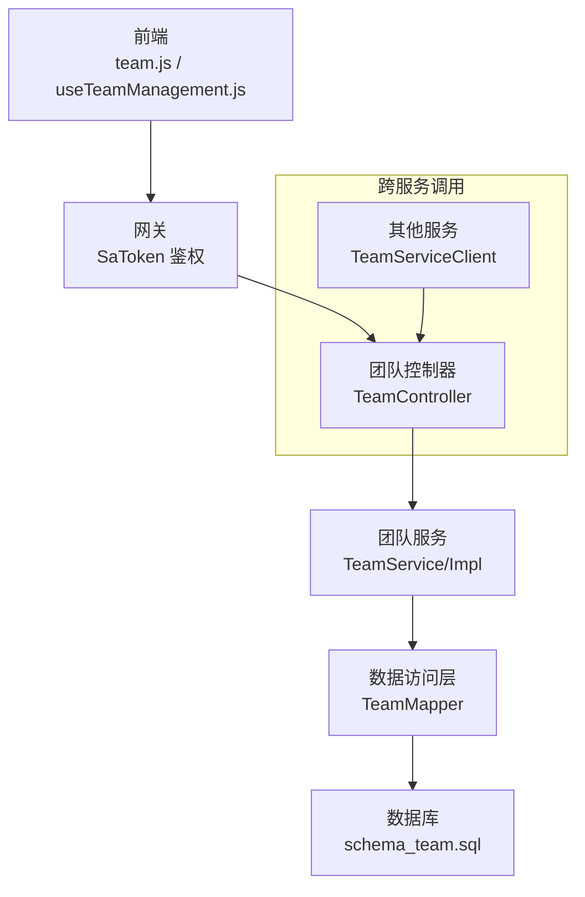
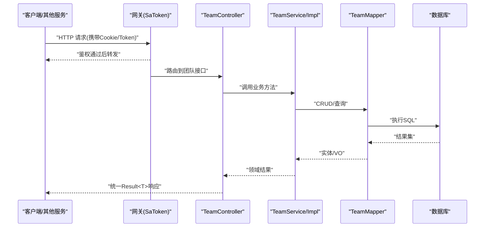
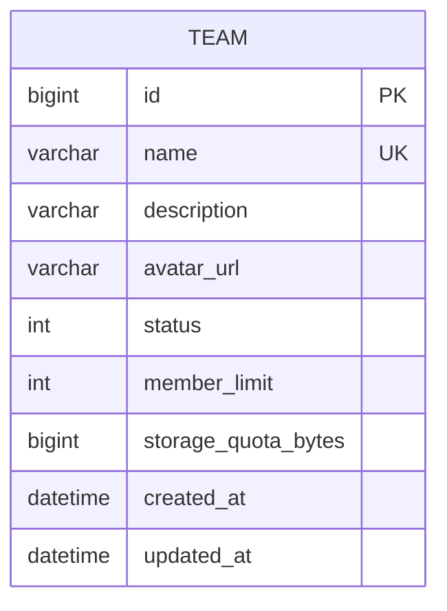
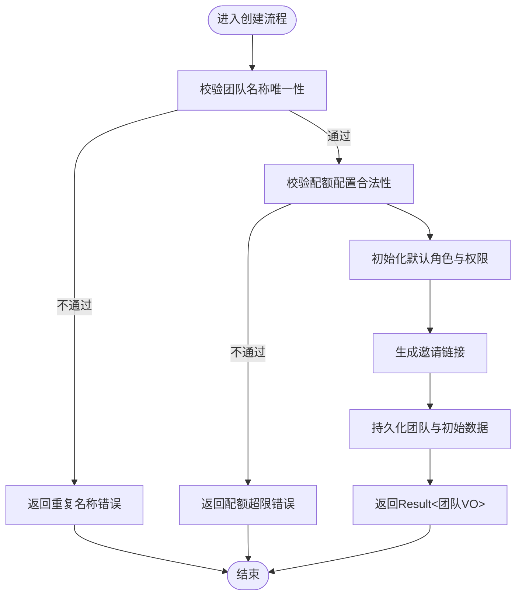
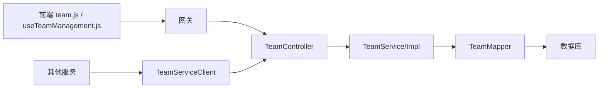

# 团队管理接口

<cite>
**本文引用的文件**
- [zxyz-team-service/src/main/java/uno/acloud/team/controller/TeamController.java](file://ZXYZdatabaseBack/zxyz-team-service/src/main/java/uno/acloud/team/controller/TeamController.java)
- [zxyz-team-service/src/main/java/uno/acloud/team/service/TeamService.java](file://ZXYZdatabaseBack/zxyz-team-service/src/main/java/uno/acloud/team/service/TeamService.java)
- [zxyz-team-service/src/main/java/uno/acloud/team/service/impl/TeamServiceImpl.java](file://ZXYZdatabaseBack/zxyz-team-service/src/main/java/uno/acloud/team/service/impl/TeamServiceImpl.java)
- [zxyz-team-service/src/main/java/uno/acloud/team/entity/Team.java](file://ZXYZdatabaseBack/zxyz-team-service/src/main/java/uno/acloud/team/entity/Team.java)
- [zxyz-team-service/src/main/java/uno/acloud/team/mapper/TeamMapper.java](file://ZXYZdatabaseBack/zxyz-team-service/src/main/java/uno/acloud/team/mapper/TeamMapper.java)
- [zxyz-team-service/src/main/resources/db/migration/V1__init_team_schema.sql](file://ZXYZdatabaseBack/zxyz-team-service/src/main/resources/db/migration/V1__init_team_schema.sql)
- [zxyz-common/src/main/java/uno/acloud/common/web/Result.java](file://ZXYZdatabaseBack/zxyz-common/src/main/java/uno/acloud/common/web/Result.java)
- [zxyz-common/src/main/java/uno/acloud/client/TeamServiceClient.java](file://ZXYZdatabaseBack/zxyz-common/src/main/java/uno/acloud/client/TeamServiceClient.java)
- [ZXYZdatabaseFront/src/api/team.js](file://ZXYZdatabaseFront/src/api/team.js)
- [ZXYZdatabaseFront/src/components/team-settings/TeamManagementPanel.vue](file://ZXYZdatabaseFront/src/components/team-settings/TeamManagementPanel.vue)
- [ZXYZdatabaseFront/src/composables/team/useTeamManagement.js](file://ZXYZdatabaseFront/src/composables/team/useTeamManagement.js)
- [nacos-config/zxyz-team-service.yml](file://nacos-config/zxyz-team-service.yml)
</cite>

## 目录
1. [简介](#简介)
2. [项目结构](#项目结构)
3. [核心组件](#核心组件)
4. [架构总览](#架构总览)
5. [详细组件分析](#详细组件分析)
6. [依赖分析](#依赖分析)
7. [性能考虑](#性能考虑)
8. [故障排查指南](#故障排查指南)
9. [结论](#结论)
10. [附录：接口契约与示例](#附录接口契约与示例)

## 简介
本文件为 ZXYZ 项目的“团队管理”RESTful API 文档，覆盖团队 CRUD、基本信息管理（名称、描述、头像、状态）、配额配置、生命周期管理（创建、查询、更新、删除），以及团队创建流程、权限初始化、默认角色分配、邀请链接生成等关键业务。文档同时提供请求/响应示例与常见错误处理说明（如重复团队名、权限不足、配额超限等）。

## 项目结构
团队管理能力由后端 zxyz-team-service 模块提供，采用传统分层（controller → service/impl → mapper → entity），并通过 zxyz-common 中的 TeamServiceClient 被其他服务调用。前端通过 Vue 的 team.js 与 useTeamManagement.js 组合式函数调用后端接口，并在 TeamManagementPanel.vue 中组织交互。

图表来源
- [zxyz-team-service/src/main/java/uno/acloud/team/controller/TeamController.java](file://ZXYZdatabaseBack/zxyz-team-service/src/main/java/uno/acloud/team/controller/TeamController.java)
- [zxyz-team-service/src/main/java/uno/acloud/team/service/TeamService.java](file://ZXYZdatabaseBack/zxyz-team-service/src/main/java/uno/acloud/team/service/TeamService.java)
- [zxyz-team-service/src/main/java/uno/acloud/team/service/impl/TeamServiceImpl.java](file://ZXYZdatabaseBack/zxyz-team-service/src/main/java/uno/acloud/team/service/impl/TeamServiceImpl.java)
- [zxyz-team-service/src/main/java/uno/acloud/team/mapper/TeamMapper.java](file://ZXYZdatabaseBack/zxyz-team-service/src/main/java/uno/acloud/team/mapper/TeamMapper.java)
- [zxyz-common/src/main/java/uno/acloud/client/TeamServiceClient.java](file://ZXYZdatabaseBack/zxyz-common/src/main/java/uno/acloud/client/TeamServiceClient.java)

章节来源
- [zxyz-team-service/src/main/java/uno/acloud/team/controller/TeamController.java](file://ZXYZdatabaseBack/zxyz-team-service/src/main/java/uno/acloud/team/controller/TeamController.java)
- [zxyz-team-service/src/main/java/uno/acloud/team/service/TeamService.java](file://ZXYZdatabaseBack/zxyz-team-service/src/main/java/uno/acloud/team/service/TeamService.java)
- [zxyz-team-service/src/main/java/uno/acloud/team/service/impl/TeamServiceImpl.java](file://ZXYZdatabaseBack/zxyz-team-service/src/main/java/uno/acloud/team/service/impl/TeamServiceImpl.java)
- [zxyz-team-service/src/main/java/uno/acloud/team/mapper/TeamMapper.java](file://ZXYZdatabaseBack/zxyz-team-service/src/main/java/uno/acloud/team/mapper/TeamMapper.java)
- [zxyz-common/src/main/java/uno/acloud/client/TeamServiceClient.java](file://ZXYZdatabaseBack/zxyz-common/src/main/java/uno/acloud/client/TeamServiceClient.java)

## 核心组件
- 控制器层：对外暴露 REST 端点，负责参数校验、权限检查、统一响应封装。
- 服务层：实现团队领域逻辑，包括创建、更新、删除、成员与权限初始化、配额校验、邀请链接生成等。
- 数据访问层：基于 MyBatis Mapper 操作团队表。
- 实体模型：团队领域对象，包含名称、描述、头像、状态、配额等字段。
- 通用响应：统一 Result<T> 包装返回体。

章节来源
- [zxyz-team-service/src/main/java/uno/acloud/team/controller/TeamController.java](file://ZXYZdatabaseBack/zxyz-team-service/src/main/java/uno/acloud/team/controller/TeamController.java)
- [zxyz-team-service/src/main/java/uno/acloud/team/service/TeamService.java](file://ZXYZdatabaseBack/zxyz-team-service/src/main/java/uno/acloud/team/service/TeamService.java)
- [zxyz-team-service/src/main/java/uno/acloud/team/service/impl/TeamServiceImpl.java](file://ZXYZdatabaseBack/zxyz-team-service/src/main/java/uno/acloud/team/service/impl/TeamServiceImpl.java)
- [zxyz-team-service/src/main/java/uno/acloud/team/entity/Team.java](file://ZXYZdatabaseBack/zxyz-team-service/src/main/java/uno/acloud/team/entity/Team.java)
- [zxyz-team-service/src/main/java/uno/acloud/team/mapper/TeamMapper.java](file://ZXYZdatabaseBack/zxyz-team-service/src/main/java/uno/acloud/team/mapper/TeamMapper.java)
- [zxyz-common/src/main/java/uno/acloud/common/web/Result.java](file://ZXYZdatabaseBack/zxyz-common/src/main/java/uno/acloud/common/web/Result.java)

## 架构总览
团队管理接口遵循“窄端点 + 投影模式”，内部服务间调用通过 TeamServiceClient 发起，使用 X-Internal-Service-Token 鉴权；外部客户端经由网关 SaToken 过滤器进行认证授权。

图表来源
- [zxyz-team-service/src/main/java/uno/acloud/team/controller/TeamController.java](file://ZXYZdatabaseBack/zxyz-team-service/src/main/java/uno/acloud/team/controller/TeamController.java)
- [zxyz-team-service/src/main/java/uno/acloud/team/service/impl/TeamServiceImpl.java](file://ZXYZdatabaseBack/zxyz-team-service/src/main/java/uno/acloud/team/service/impl/TeamServiceImpl.java)
- [zxyz-team-service/src/main/java/uno/acloud/team/mapper/TeamMapper.java](file://ZXYZdatabaseBack/zxyz-team-service/src/main/java/uno/acloud/team/mapper/TeamMapper.java)

## 详细组件分析

### 团队实体与数据模型
- 团队实体包含基础信息（名称、描述、头像URL）、状态（启用/禁用）、配额（成员上限、存储空间等）及审计字段（创建时间、更新时间）。
- 数据库迁移脚本定义团队表结构与索引策略。

图表来源
- [zxyz-team-service/src/main/java/uno/acloud/team/entity/Team.java](file://ZXYZdatabaseBack/zxyz-team-service/src/main/java/uno/acloud/team/entity/Team.java)
- [zxyz-team-service/src/main/resources/db/migration/V1__init_team_schema.sql](file://ZXYZdatabaseBack/zxyz-team-service/src/main/resources/db/migration/V1__init_team_schema.sql)

章节来源
- [zxyz-team-service/src/main/java/uno/acloud/team/entity/Team.java](file://ZXYZdatabaseBack/zxyz-team-service/src/main/java/uno/acloud/team/entity/Team.java)
- [zxyz-team-service/src/main/resources/db/migration/V1__init_team_schema.sql](file://ZXYZdatabaseBack/zxyz-team-service/src/main/resources/db/migration/V1__init_team_schema.sql)

### 控制器层（REST 端点）
- 提供团队的增删改查、基本信息更新、状态切换、配额配置、邀请链接生成等端点。
- 所有响应统一封装为 Result<T>，code=1 表示成功。

章节来源
- [zxyz-team-service/src/main/java/uno/acloud/team/controller/TeamController.java](file://ZXYZdatabaseBack/zxyz-team-service/src/main/java/uno/acloud/team/controller/TeamController.java)
- [zxyz-common/src/main/java/uno/acloud/common/web/Result.java](file://ZXYZdatabaseBack/zxyz-common/src/main/java/uno/acloud/common/web/Result.java)

### 服务层（业务逻辑）
- 团队创建：校验名称唯一性、配额合法性；初始化默认角色与权限；生成邀请链接；持久化并返回投影 VO。
- 团队更新：支持名称、描述、头像、状态、配额的局部更新；权限与配额变更需二次校验。
- 团队删除：软删除或硬删除策略（依据实现），清理关联资源与权限。
- 邀请链接：生成一次性或有效期链接，记录审计日志。

图表来源
- [zxyz-team-service/src/main/java/uno/acloud/team/service/impl/TeamServiceImpl.java](file://ZXYZdatabaseBack/zxyz-team-service/src/main/java/uno/acloud/team/service/impl/TeamServiceImpl.java)

章节来源
- [zxyz-team-service/src/main/java/uno/acloud/team/service/TeamService.java](file://ZXYZdatabaseBack/zxyz-team-service/src/main/java/uno/acloud/team/service/TeamService.java)
- [zxyz-team-service/src/main/java/uno/acloud/team/service/impl/TeamServiceImpl.java](file://ZXYZdatabaseBack/zxyz-team-service/src/main/java/uno/acloud/team/service/impl/TeamServiceImpl.java)

### 数据访问层（Mapper）
- 提供团队表的插入、更新、删除、查询等方法，配合分页与条件查询。
- 建议对名称、状态等高频查询字段建立索引以提升性能。

章节来源
- [zxyz-team-service/src/main/java/uno/acloud/team/mapper/TeamMapper.java](file://ZXYZdatabaseBack/zxyz-team-service/src/main/java/uno/acloud/team/mapper/TeamMapper.java)

### 跨服务调用（TeamServiceClient）
- 其他服务通过 TeamServiceClient 调用团队能力，使用内部令牌鉴权，避免公网暴露。
- 返回投影 VO，保持窄端点与解耦。

章节来源
- [zxyz-common/src/main/java/uno/acloud/client/TeamServiceClient.java](file://ZXYZdatabaseBack/zxyz-common/src/main/java/uno/acloud/client/TeamServiceClient.java)

### 前端集成（Vue 3）
- team.js 封装 HTTP 请求，useTeamManagement.js 组合式函数管理团队状态与交互，TeamManagementPanel.vue 组织界面。
- 统一处理 Result<T> 响应，展示错误提示与成功反馈。

章节来源
- [ZXYZdatabaseFront/src/api/team.js](file://ZXYZdatabaseFront/src/api/team.js)
- [ZXYZdatabaseFront/src/composables/team/useTeamManagement.js](file://ZXYZdatabaseFront/src/composables/team/useTeamManagement.js)
- [ZXYZdatabaseFront/src/components/team-settings/TeamManagementPanel.vue](file://ZXYZdatabaseFront/src/components/team-settings/TeamManagementPanel.vue)

## 依赖分析
- 控制器依赖服务层，服务层依赖 Mapper 与实体，Mapper 依赖数据库。
- 跨服务调用通过 TeamServiceClient 完成，避免直接耦合数据库。
- 前端依赖 team.js 与 useTeamManagement.js，最终通过网关访问后端。

图表来源
- [zxyz-team-service/src/main/java/uno/acloud/team/controller/TeamController.java](file://ZXYZdatabaseBack/zxyz-team-service/src/main/java/uno/acloud/team/controller/TeamController.java)
- [zxyz-team-service/src/main/java/uno/acloud/team/service/impl/TeamServiceImpl.java](file://ZXYZdatabaseBack/zxyz-team-service/src/main/java/uno/acloud/team/service/impl/TeamServiceImpl.java)
- [zxyz-team-service/src/main/java/uno/acloud/team/mapper/TeamMapper.java](file://ZXYZdatabaseBack/zxyz-team-service/src/main/java/uno/acloud/team/mapper/TeamMapper.java)
- [zxyz-common/src/main/java/uno/acloud/client/TeamServiceClient.java](file://ZXYZdatabaseBack/zxyz-common/src/main/java/uno/acloud/client/TeamServiceClient.java)

章节来源
- [zxyz-team-service/src/main/java/uno/acloud/team/controller/TeamController.java](file://ZXYZdatabaseBack/zxyz-team-service/src/main/java/uno/acloud/team/controller/TeamController.java)
- [zxyz-team-service/src/main/java/uno/acloud/team/service/impl/TeamServiceImpl.java](file://ZXYZdatabaseBack/zxyz-team-service/src/main/java/uno/acloud/team/service/impl/TeamServiceImpl.java)
- [zxyz-team-service/src/main/java/uno/acloud/team/mapper/TeamMapper.java](file://ZXYZdatabaseBack/zxyz-team-service/src/main/java/uno/acloud/team/mapper/TeamMapper.java)
- [zxyz-common/src/main/java/uno/acloud/client/TeamServiceClient.java](file://ZXYZdatabaseBack/zxyz-common/src/main/java/uno/acloud/client/TeamServiceClient.java)

## 性能考虑
- 对团队名称、状态等高频查询字段建立索引，减少全表扫描。
- 分页查询限制每页大小，避免大数据量传输。
- 服务间调用使用投影 VO，减少冗余字段传输。
- 邀请链接生成采用异步任务或缓存策略，降低同步阻塞。

[本节为通用指导，无需特定文件引用]

## 故障排查指南
- 重复团队名：检查名称唯一性约束与业务校验逻辑，确认输入去重与提示。
- 权限不足：核对 SaToken 权限策略与角色分配，确保创建者具备团队创建权限。
- 配额超限：校验成员上限与存储配额配置，必要时调整系统配置或提示升级。
- 邀请链接失效：检查链接有效期与一次性使用策略，确认是否已被使用或过期。

章节来源
- [zxyz-team-service/src/main/java/uno/acloud/team/service/impl/TeamServiceImpl.java](file://ZXYZdatabaseBack/zxyz-team-service/src/main/java/uno/acloud/team/service/impl/TeamServiceImpl.java)
- [zxyz-team-service/src/main/java/uno/acloud/team/controller/TeamController.java](file://ZXYZdatabaseBack/zxyz-team-service/src/main/java/uno/acloud/team/controller/TeamController.java)

## 结论
团队管理接口以清晰的分层架构与统一的响应格式提供服务，涵盖完整的 CRUD、基本信息管理、配额配置与生命周期管理。通过网关鉴权与服务间窄端点调用，保障安全与可维护性。前端以组合式函数与组件封装交互，提升开发效率与用户体验。

[本节为总结，无需特定文件引用]

## 附录：接口契约与示例

### 通用约定
- 认证方式：HttpOnly Cookie（Sa-Token UUID token + Redis session），网关 SaToken 过滤器校验。
- 响应格式：统一 Result<T>，code=1 表示成功，data 为业务数据，message 为提示信息。
- 内部端点：/api/internal/** 仅内网访问，禁止公网暴露。

章节来源
- [zxyz-common/src/main/java/uno/acloud/common/web/Result.java](file://ZXYZdatabaseBack/zxyz-common/src/main/java/uno/acloud/common/web/Result.java)
- [nacos-config/zxyz-team-service.yml](file://nacos-config/zxyz-team-service.yml)

### 团队创建
- 路径：POST /api/team
- 请求体：包含团队名称、描述、头像URL、初始成员列表、配额配置等。
- 响应：返回团队ID、名称、邀请链接等。
- 错误场景：
  - 重复团队名：code≠1，message提示名称已存在。
  - 配额超限：code≠1，message提示超出限额。
  - 权限不足：code≠1，message提示无创建权限。

章节来源
- [zxyz-team-service/src/main/java/uno/acloud/team/controller/TeamController.java](file://ZXYZdatabaseBack/zxyz-team-service/src/main/java/uno/acloud/team/controller/TeamController.java)
- [zxyz-team-service/src/main/java/uno/acloud/team/service/impl/TeamServiceImpl.java](file://ZXYZdatabaseBack/zxyz-team-service/src/main/java/uno/acloud/team/service/impl/TeamServiceImpl.java)

### 团队查询
- 路径：GET /api/team/{id}
- 响应：返回团队基本信息、状态、配额等。
- 错误场景：团队不存在、权限不足。

章节来源
- [zxyz-team-service/src/main/java/uno/acloud/team/controller/TeamController.java](file://ZXYZdatabaseBack/zxyz-team-service/src/main/java/uno/acloud/team/controller/TeamController.java)

### 团队更新
- 路径：PUT /api/team/{id}
- 请求体：支持部分更新（名称、描述、头像、状态、配额）。
- 错误场景：重复名称、配额超限、权限不足。

章节来源
- [zxyz-team-service/src/main/java/uno/acloud/team/controller/TeamController.java](file://ZXYZdatabaseBack/zxyz-team-service/src/main/java/uno/acloud/team/controller/TeamController.java)
- [zxyz-team-service/src/main/java/uno/acloud/team/service/impl/TeamServiceImpl.java](file://ZXYZdatabaseBack/zxyz-team-service/src/main/java/uno/acloud/team/service/impl/TeamServiceImpl.java)

### 团队删除
- 路径：DELETE /api/team/{id}
- 行为：根据策略执行软删除或硬删除，清理关联资源。
- 错误场景：权限不足、团队不存在。

章节来源
- [zxyz-team-service/src/main/java/uno/acloud/team/controller/TeamController.java](file://ZXYZdatabaseBack/zxyz-team-service/src/main/java/uno/acloud/team/controller/TeamController.java)
- [zxyz-team-service/src/main/java/uno/acloud/team/service/impl/TeamServiceImpl.java](file://ZXYZdatabaseBack/zxyz-team-service/src/main/java/uno/acloud/team/service/impl/TeamServiceImpl.java)

### 邀请链接生成
- 路径：POST /api/team/{id}/invite-link
- 请求体：可选有效期、一次性使用标志。
- 响应：返回邀请链接与有效期。
- 错误场景：团队不存在、权限不足。

章节来源
- [zxyz-team-service/src/main/java/uno/acloud/team/controller/TeamController.java](file://ZXYZdatabaseBack/zxyz-team-service/src/main/java/uno/acloud/team/controller/TeamController.java)
- [zxyz-team-service/src/main/java/uno/acloud/team/service/impl/TeamServiceImpl.java](file://ZXYZdatabaseBack/zxyz-team-service/src/main/java/uno/acloud/team/service/impl/TeamServiceImpl.java)

### 前端调用示例
- team.js：封装 HTTP 请求，处理 Result<T> 响应。
- useTeamManagement.js：组合式函数管理团队状态与交互。
- TeamManagementPanel.vue：组织界面与用户操作。

章节来源
- [ZXYZdatabaseFront/src/api/team.js](file://ZXYZdatabaseFront/src/api/team.js)
- [ZXYZdatabaseFront/src/composables/team/useTeamManagement.js](file://ZXYZdatabaseFront/src/composables/team/useTeamManagement.js)
- [ZXYZdatabaseFront/src/components/team-settings/TeamManagementPanel.vue](file://ZXYZdatabaseFront/src/components/team-settings/TeamManagementPanel.vue)