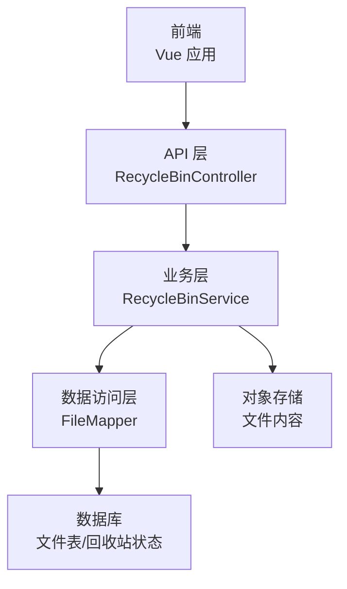
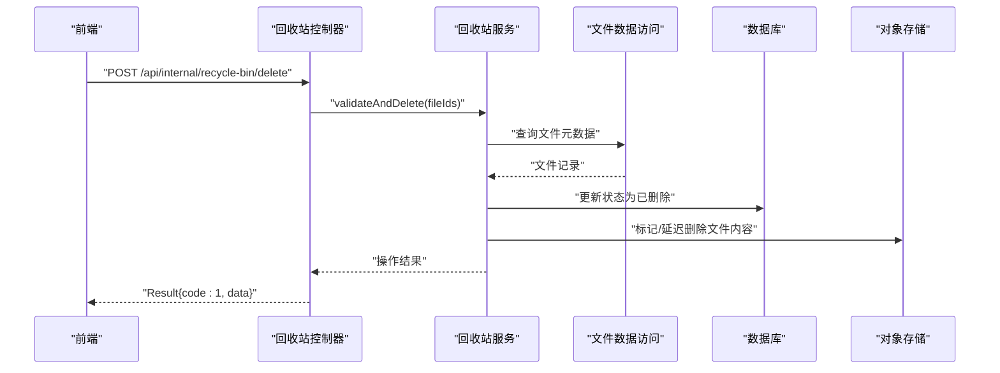
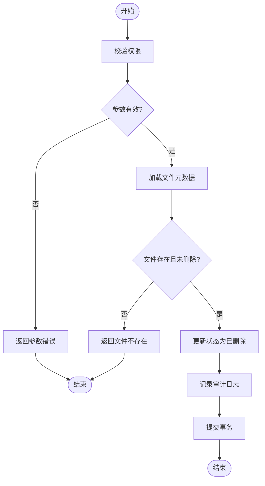
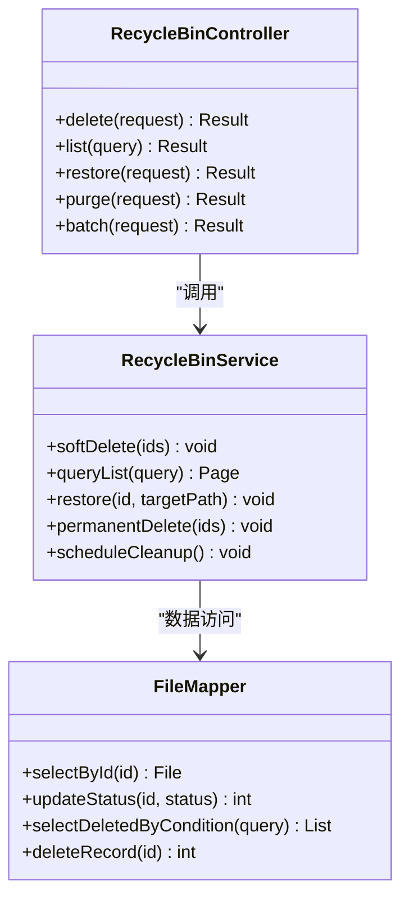

# 回收站管理接口

<cite>
**本文引用的文件**   
- [zxyz-file-service/src/main/java/uno/acloud/file/controller/RecycleBinController.java](file://ZXYZdatabaseBack/zxyz-file-service/src/main/java/uno/acloud/file/controller/RecycleBinController.java)
- [zxyz-file-service/src/main/java/uno/acloud/file/service/impl/RecycleBinService.java](file://ZXYZdatabaseBack/zxyz-file-service/src/main/java/uno/acloud/file/service/impl/RecycleBinService.java)
- [zxyz-file-service/src/main/java/uno/acloud/file/mapper/FileMapper.java](file://ZXYZdatabaseBack/zxyz-file-service/src/main/java/uno/acloud/file/mapper/FileMapper.java)
- [ZXYZdatabaseBack/zxyz-file-service/src/main/resources/db/migration/V1__init_file_schema.sql](file://ZXYZdatabaseBack/zxyz-file-service/src/main/resources/db/migration/V1__init_file_schema.sql)
- [ZXYZdatabaseFront/src/api/files.js](file://ZXYZdatabaseFront/src/api/files.js)
- [ZXYZdatabaseFront/src/composables/useRecycleBinActions.js](file://ZXYZdatabaseFront/src/composables/useRecycleBinActions.js)
- [ZXYZdatabaseFront/src/composables/useRecycleBinList.js](file://ZXYZdatabaseFront/src/composables/useRecycleBinList.js)
- [ZXYZdatabaseFront/src/components/RecycleBinExplorer.vue](file://ZXYZdatabaseFront/src/components/RecycleBinExplorer.vue)
- [ZXYZdatabaseFront/src/views/recycle-bin/index.vue](file://ZXYZdatabaseFront/src/views/recycle-bin/index.vue)
</cite>

## 目录
1. [简介](#简介)
2. [项目结构](#项目结构)
3. [核心组件](#核心组件)
4. [架构总览](#架构总览)
5. [详细组件分析](#详细组件分析)
6. [依赖分析](#依赖分析)
7. [性能考虑](#性能考虑)
8. [故障排查指南](#故障排查指南)
9. [结论](#结论)
10. [附录](#附录)

## 简介
本文件为 ZXYZ 项目的“回收站管理”RESTful API 接口文档，覆盖以下能力：
- 文件软删除（移入回收站）
- 回收站列表查询（分页、筛选、排序）
- 文件恢复（从回收站恢复到原路径或指定路径）
- 永久删除（彻底清除回收站中的文件）
- 批量操作（批量移入回收站、批量恢复、批量永久删除）
- 定时清理任务与自动清理规则（按保留策略清理过期数据）
- 存储空间回收（释放被软删除占用的存储）

说明：
- 本项目采用微服务架构，文件相关能力由 zxyz-file-service 提供。
- 内部端点统一以 /api/internal/** 暴露，受网关鉴权保护；对外通过网关路由到各服务。
- 响应体遵循统一的 Result<T> 结构，code=1 表示成功。

## 项目结构
与回收站相关的后端实现位于 zxyz-file-service 模块，前端交互位于 ZXYZdatabaseFront 的 files API、composables 与页面组件中。数据库迁移脚本定义了文件表结构与回收站状态字段。

图表来源
- [zxyz-file-service/src/main/java/uno/acloud/file/controller/RecycleBinController.java](file://ZXYZdatabaseBack/zxyz-file-service/src/main/java/uno/acloud/file/controller/RecycleBinController.java)
- [zxyz-file-service/src/main/java/uno/acloud/file/service/impl/RecycleBinService.java](file://ZXYZdatabaseBack/zxyz-file-service/src/main/java/uno/acloud/file/service/impl/RecycleBinService.java)
- [zxyz-file-service/src/main/java/uno/acloud/file/mapper/FileMapper.java](file://ZXYZdatabaseBack/zxyz-file-service/src/main/java/uno/acloud/file/mapper/FileMapper.java)
- [ZXYZdatabaseBack/zxyz-file-service/src/main/resources/db/migration/V1__init_file_schema.sql](file://ZXYZdatabaseBack/zxyz-file-service/src/main/resources/db/migration/V1__init_file_schema.sql)

章节来源
- [zxyz-file-service/src/main/java/uno/acloud/file/controller/RecycleBinController.java](file://ZXYZdatabaseBack/zxyz-file-service/src/main/java/uno/acloud/file/controller/RecycleBinController.java)
- [zxyz-file-service/src/main/java/uno/acloud/file/service/impl/RecycleBinService.java](file://ZXYZdatabaseBack/zxyz-file-service/src/main/java/uno/acloud/file/service/impl/RecycleBinService.java)
- [zxyz-file-service/src/main/java/uno/acloud/file/mapper/FileMapper.java](file://ZXYZdatabaseBack/zxyz-file-service/src/main/java/uno/acloud/file/mapper/FileMapper.java)
- [ZXYZdatabaseBack/zxyz-file-service/src/main/resources/db/migration/V1__init_file_schema.sql](file://ZXYZdatabaseBack/zxyz-file-service/src/main/resources/db/migration/V1__init_file_schema.sql)

## 核心组件
- RecycleBinController：定义回收站相关 REST 端点，包括软删除、列表查询、恢复、永久删除及批量操作。
- RecycleBinService：封装回收站业务逻辑，校验权限、处理事务、协调存储与数据库变更。
- FileMapper：数据访问层，负责文件记录与回收站状态的读写。
- 前端 API 与 Composables：files.js 调用后端接口；useRecycleBinActions.js 与 useRecycleBinList.js 封装交互逻辑；RecycleBinExplorer.vue 与 recycle-bin/index.vue 提供用户界面。

章节来源
- [zxyz-file-service/src/main/java/uno/acloud/file/controller/RecycleBinController.java](file://ZXYZdatabaseBack/zxyz-file-service/src/main/java/uno/acloud/file/controller/RecycleBinController.java)
- [zxyz-file-service/src/main/java/uno/acloud/file/service/impl/RecycleBinService.java](file://ZXYZdatabaseBack/zxyz-file-service/src/main/java/uno/acloud/file/service/impl/RecycleBinService.java)
- [zxyz-file-service/src/main/java/uno/acloud/file/mapper/FileMapper.java](file://ZXYZdatabaseBack/zxyz-file-service/src/main/java/uno/acloud/file/mapper/FileMapper.java)
- [ZXYZdatabaseFront/src/api/files.js](file://ZXYZdatabaseFront/src/api/files.js)
- [ZXYZdatabaseFront/src/composables/useRecycleBinActions.js](file://ZXYZdatabaseFront/src/composables/useRecycleBinActions.js)
- [ZXYZdatabaseFront/src/composables/useRecycleBinList.js](file://ZXYZdatabaseFront/src/composables/useRecycleBinList.js)
- [ZXYZdatabaseFront/src/components/RecycleBinExplorer.vue](file://ZXYZdatabaseFront/src/components/RecycleBinExplorer.vue)
- [ZXYZdatabaseFront/src/views/recycle-bin/index.vue](file://ZXYZdatabaseFront/src/views/recycle-bin/index.vue)

## 架构总览
回收站管理的请求流程如下：
- 前端通过 files.js 发起 HTTP 请求至后端控制器。
- 控制器进行参数校验与权限检查后，调用服务层执行具体业务。
- 服务层在事务内更新文件状态（软删除/恢复/永久删除），并协调对象存储完成实际文件内容的删除或还原。
- 数据访问层持久化变更，返回统一结果给前端。

图表来源
- [zxyz-file-service/src/main/java/uno/acloud/file/controller/RecycleBinController.java](file://ZXYZdatabaseBack/zxyz-file-service/src/main/java/uno/acloud/file/controller/RecycleBinController.java)
- [zxyz-file-service/src/main/java/uno/acloud/file/service/impl/RecycleBinService.java](file://ZXYZdatabaseBack/zxyz-file-service/src/main/java/uno/acloud/file/service/impl/RecycleBinService.java)
- [zxyz-file-service/src/main/java/uno/acloud/file/mapper/FileMapper.java](file://ZXYZdatabaseBack/zxyz-file-service/src/main/java/uno/acloud/file/mapper/FileMapper.java)

## 详细组件分析

### 接口定义与行为
- 软删除（移入回收站）
  - 方法：POST
  - 路径：/api/internal/recycle-bin/delete
  - 请求体：包含要删除的文件 ID 列表、可选目标团队/空间上下文
  - 行为：将文件状态置为“已删除”，记录删除时间与操作人，不立即删除物理文件
  - 权限：需具备对文件的删除权限
  - 错误：文件不存在、权限不足、批量失败部分回滚

- 回收站列表查询
  - 方法：GET
  - 路径：/api/internal/recycle-bin/list
  - 查询参数：页码、每页大小、筛选条件（如团队、时间范围）、排序字段
  - 行为：仅返回状态为“已删除”的记录，支持分页与排序
  - 权限：需具备查看回收站的权限

- 文件恢复
  - 方法：POST
  - 路径：/api/internal/recycle-bin/restore
  - 请求体：文件 ID、可选目标路径（默认恢复到原始路径）
  - 行为：将文件状态恢复为正常，必要时重建目录结构
  - 权限：需具备对目标路径的写入权限
  - 冲突：同名文件冲突时的处理策略（跳过/覆盖/重命名）

- 永久删除
  - 方法：DELETE
  - 路径：/api/internal/recycle-bin/purge
  - 请求体：文件 ID 列表
  - 行为：从数据库移除记录并从对象存储删除物理文件
  - 权限：需具备对回收站的管理权限
  - 风险：不可恢复，需谨慎操作

- 批量操作
  - 方法：POST
  - 路径：/api/internal/recycle-bin/batch
  - 请求体：操作类型（delete/restore/purge）、文件 ID 列表、附加参数
  - 行为：原子性或分批次执行，返回每个子操作的执行结果
  - 幂等性：建议客户端重试时携带唯一请求标识

- 定时清理任务
  - 触发方式：调度器按配置周期执行
  - 规则：超过保留期的“已删除”记录将被永久删除，同时释放对象存储占用
  - 可配置项：保留天数、批处理大小、并发度、失败重试策略

章节来源
- [zxyz-file-service/src/main/java/uno/acloud/file/controller/RecycleBinController.java](file://ZXYZdatabaseBack/zxyz-file-service/src/main/java/uno/acloud/file/controller/RecycleBinController.java)
- [zxyz-file-service/src/main/java/uno/acloud/file/service/impl/RecycleBinService.java](file://ZXYZdatabaseBack/zxyz-file-service/src/main/java/uno/acloud/file/service/impl/RecycleBinService.java)
- [zxyz-file-service/src/main/java/uno/acloud/file/mapper/FileMapper.java](file://ZXYZdatabaseBack/zxyz-file-service/src/main/java/uno/acloud/file/mapper/FileMapper.java)

### 软删除机制与数据模型
- 软删除通过在文件记录上设置状态字段为“已删除”，并记录删除时间与操作人信息。
- 物理文件内容暂存于对象存储，待回收站清理任务或手动永久删除时再释放。
- 恢复操作将状态改回“正常”，并尽可能恢复原始路径与元数据。

图表来源
- [zxyz-file-service/src/main/java/uno/acloud/file/service/impl/RecycleBinService.java](file://ZXYZdatabaseBack/zxyz-file-service/src/main/java/uno/acloud/file/service/impl/RecycleBinService.java)
- [zxyz-file-service/src/main/java/uno/acloud/file/mapper/FileMapper.java](file://ZXYZdatabaseBack/zxyz-file-service/src/main/java/uno/acloud/file/mapper/FileMapper.java)

### 数据保留策略与自动清理
- 保留策略：根据配置的天数阈值，超过阈值的“已删除”记录进入清理队列。
- 清理任务：周期性扫描、分批处理、并发执行，失败重试与死信队列保障可靠性。
- 存储空间回收：清理完成后同步通知对象存储删除物理文件，释放空间。

章节来源
- [zxyz-file-service/src/main/java/uno/acloud/file/service/impl/RecycleBinService.java](file://ZXYZdatabaseBack/zxyz-file-service/src/main/java/uno/acloud/file/service/impl/RecycleBinService.java)

### 前端交互与调用示例
- 调用入口：ZXYZdatabaseFront/src/api/files.js 封装了回收站相关 API 调用。
- 交互逻辑：useRecycleBinActions.js 提供批量操作、恢复、永久删除等动作；useRecycleBinList.js 负责列表加载、筛选与分页。
- 界面展示：RecycleBinExplorer.vue 渲染回收站文件列表与操作按钮；recycle-bin/index.vue 作为页面容器组织功能。

章节来源
- [ZXYZdatabaseFront/src/api/files.js](file://ZXYZdatabaseFront/src/api/files.js)
- [ZXYZdatabaseFront/src/composables/useRecycleBinActions.js](file://ZXYZdatabaseFront/src/composables/useRecycleBinActions.js)
- [ZXYZdatabaseFront/src/composables/useRecycleBinList.js](file://ZXYZdatabaseFront/src/composables/useRecycleBinList.js)
- [ZXYZdatabaseFront/src/components/RecycleBinExplorer.vue](file://ZXYZdatabaseFront/src/components/RecycleBinExplorer.vue)
- [ZXYZdatabaseFront/src/views/recycle-bin/index.vue](file://ZXYZdatabaseFront/src/views/recycle-bin/index.vue)

## 依赖分析
- 控制器依赖服务层，服务层依赖数据访问层与对象存储客户端。
- 前端依赖后端提供的内部端点，并通过网关鉴权。
- 数据库迁移脚本定义了文件表结构与回收站状态字段，确保数据一致性。

图表来源
- [zxyz-file-service/src/main/java/uno/acloud/file/controller/RecycleBinController.java](file://ZXYZdatabaseBack/zxyz-file-service/src/main/java/uno/acloud/file/controller/RecycleBinController.java)
- [zxyz-file-service/src/main/java/uno/acloud/file/service/impl/RecycleBinService.java](file://ZXYZdatabaseBack/zxyz-file-service/src/main/java/uno/acloud/file/service/impl/RecycleBinService.java)
- [zxyz-file-service/src/main/java/uno/acloud/file/mapper/FileMapper.java](file://ZXYZdatabaseBack/zxyz-file-service/src/main/java/uno/acloud/file/mapper/FileMapper.java)

章节来源
- [zxyz-file-service/src/main/java/uno/acloud/file/controller/RecycleBinController.java](file://ZXYZdatabaseBack/zxyz-file-service/src/main/java/uno/acloud/file/controller/RecycleBinController.java)
- [zxyz-file-service/src/main/java/uno/acloud/file/service/impl/RecycleBinService.java](file://ZXYZdatabaseBack/zxyz-file-service/src/main/java/uno/acloud/file/service/impl/RecycleBinService.java)
- [zxyz-file-service/src/main/java/uno/acloud/file/mapper/FileMapper.java](file://ZXYZdatabaseBack/zxyz-file-service/src/main/java/uno/acloud/file/mapper/FileMapper.java)

## 性能考虑
- 批量操作应使用分页与分批处理，避免一次性处理过大请求导致超时。
- 列表查询应合理使用索引（如团队ID、状态、删除时间），提升检索效率。
- 清理任务应控制并发度与批大小，避免对数据库与对象存储造成压力峰值。
- 对象存储删除可采用异步任务与重试机制，降低主链路耗时。

## 故障排查指南
- 文件不存在
  - 现象：接口返回文件不存在错误
  - 排查：确认文件ID是否正确，检查是否已被永久删除
  - 解决：重新选择文件或刷新列表

- 权限不足
  - 现象：接口返回权限不足错误
  - 排查：检查当前用户对文件或目标路径的权限
  - 解决：调整权限或切换有权限的用户

- 存储空间不足
  - 现象：恢复或上传失败，提示存储空间不足
  - 排查：检查团队或用户的配额使用情况
  - 解决：清理回收站或扩容配额

- 批量操作部分失败
  - 现象：部分文件操作成功，部分失败
  - 排查：查看返回结果中的子操作状态，定位失败原因
  - 解决：针对失败项重试或修正参数

章节来源
- [zxyz-file-service/src/main/java/uno/acloud/file/service/impl/RecycleBinService.java](file://ZXYZdatabaseBack/zxyz-file-service/src/main/java/uno/acloud/file/service/impl/RecycleBinService.java)

## 结论
回收站管理接口提供了完整的文件生命周期管理能力，涵盖软删除、恢复、永久删除与批量操作，并结合定时清理任务实现自动化存储回收。通过清晰的权限校验、事务一致性与错误处理机制，保障了系统的稳定性与用户体验。前端与后端的解耦设计使得功能扩展与维护更加便捷。

## 附录
- 数据库表结构参考：V1__init_file_schema.sql 定义了文件表与回收站状态字段。
- 前端 API 封装：files.js 提供统一的接口调用方法。
- 交互逻辑：useRecycleBinActions.js 与 useRecycleBinList.js 封装常用操作与列表管理。

章节来源
- [ZXYZdatabaseBack/zxyz-file-service/src/main/resources/db/migration/V1__init_file_schema.sql](file://ZXYZdatabaseBack/zxyz-file-service/src/main/resources/db/migration/V1__init_file_schema.sql)
- [ZXYZdatabaseFront/src/api/files.js](file://ZXYZdatabaseFront/src/api/files.js)
- [ZXYZdatabaseFront/src/composables/useRecycleBinActions.js](file://ZXYZdatabaseFront/src/composables/useRecycleBinActions.js)
- [ZXYZdatabaseFront/src/composables/useRecycleBinList.js](file://ZXYZdatabaseFront/src/composables/useRecycleBinList.js)