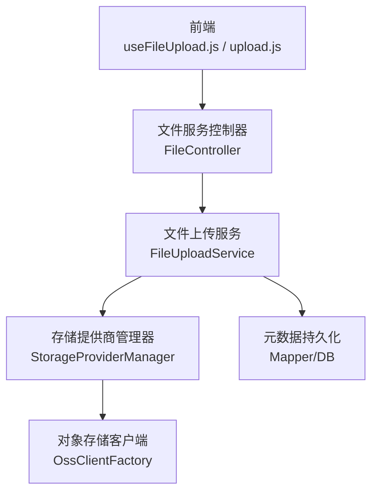
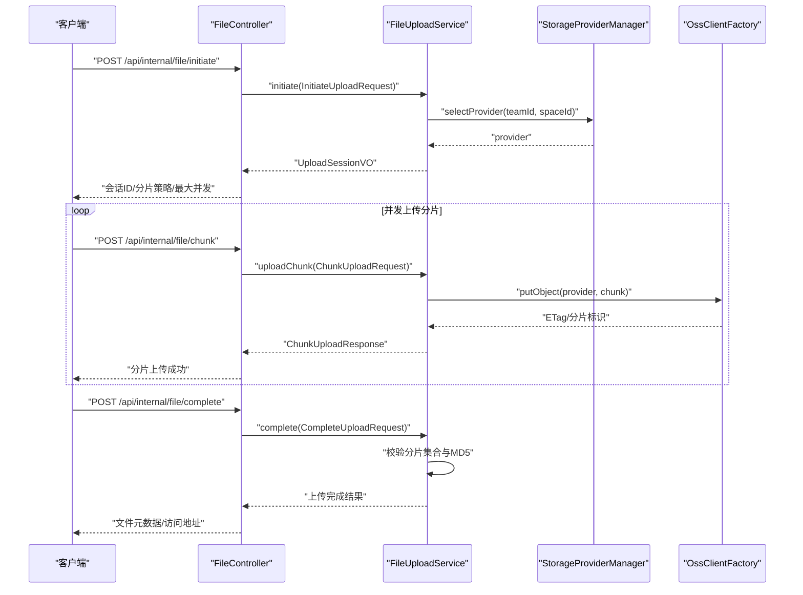
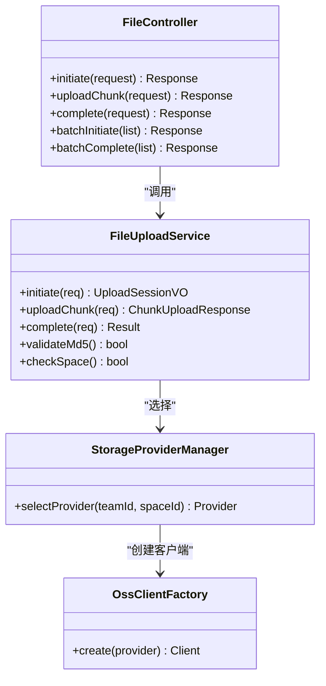

# 文件上传接口

<cite>
**本文引用的文件**   
- [zxyz-file-service/src/main/java/uno/acloud/file/controller/FileController.java](file://ZXYZdatabaseBack/zxyz-file-service/src/main/java/uno/acloud/file/controller/FileController.java)
- [zxyz-file-service/src/main/java/uno/acloud/file/service/impl/FileUploadService.java](file://ZXYZdatabaseBack/zxyz-file-service/src/main/java/uno/acloud/file/service/impl/FileUploadService.java)
- [zxyz-file-service/src/main/java/uno/acloud/file/storage/StorageProviderManager.java](file://ZXYZdatabaseBack/zxyz-file-service/src/main/java/uno/acloud/file/storage/StorageProviderManager.java)
- [zxyz-file-service/src/main/java/uno/acloud/file/dto/ChunkUploadRequest.java](file://ZXYZdatabaseBack/zxyz-file-service/src/main/java/uno/acloud/file/dto/ChunkUploadRequest.java)
- [zxyz-file-service/src/main/java/uno/acloud/file/dto/ChunkUploadResponse.java](file://ZXYZdatabaseBack/zxyz-file-service/src/main/java/uno/acloud/file/dto/ChunkUploadResponse.java)
- [zxyz-file-service/src/main/java/uno/acloud/file/dto/InitiateUploadRequest.java](file://ZXYZdatabaseBack/zxyz-file-service/src/main/java/uno/acloud/file/dto/InitiateUploadRequest.java)
- [zxyz-file-service/src/main/java/uno/acloud/file/dto/CompleteUploadRequest.java](file://ZXYZdatabaseBack/zxyz-file-service/src/main/java/uno/acloud/file/dto/CompleteUploadRequest.java)
- [zxyz-file-service/src/main/java/uno/acloud/file/vo/UploadSessionVO.java](file://ZXYZdatabaseBack/zxyz-file-service/src/main/java/uno/acloud/file/vo/UploadSessionVO.java)
- [zxyz-file-service/src/main/java/uno/acloud/file/infrastructure/oss/OssClientFactory.java](file://ZXYZdatabaseBack/zxyz-file-service/src/main/java/uno/acloud/file/infrastructure/oss/OssClientFactory.java)
- [zxyz-file-service/src/main/resources/application.yml](file://ZXYZdatabaseBack/zxyz-file-service/src/main/resources/application.yml)
- [nacos-config/zxyz-file-service.yml](file://nacos-config/zxyz-file-service.yml)
- [ZXYZdatabaseFront/src/api/files.js](file://ZXYZdatabaseFront/src/api/files.js)
- [ZXYZdatabaseFront/src/composables/useFileUpload.js](file://ZXYZdatabaseFront/src/composables/useFileUpload.js)
- [ZXYZdatabaseFront/src/services/upload.js](file://ZXYZdatabaseFront/src/services/upload.js)
- [ZXYZdatabaseFront/src/utils/uploadProgress.js](file://ZXYZdatabaseFront/src/utils/uploadProgress.js)
- [ZXYZdatabaseFront/src/models/upload.js](file://ZXYZdatabaseFront/src/models/upload.js)
- [ZXYZdatabaseBack/zxyz-common/src/main/java/uno/acloud/common/web/Result.java](file://ZXYZdatabaseBack/zxyz-common/src/main/java/uno/acloud/common/web/Result.java)
</cite>

## 目录
1. [简介](#简介)
2. [项目结构](#项目结构)
3. [核心组件](#核心组件)
4. [架构总览](#架构总览)
5. [详细组件分析](#详细组件分析)
6. [依赖关系分析](#依赖关系分析)
7. [性能考虑](#性能考虑)
8. [故障排查指南](#故障排查指南)
9. [结论](#结论)
10. [附录：API契约与示例](#附录api契约与示例)

## 简介
本文件为 ZXYZ 项目的“文件上传 RESTful API”完整文档，覆盖分片上传（初始化、上传分片、确认上传）、断点续传、并发上传、批量上传、MD5 校验、存储提供商选择、进度回调、错误重试策略与存储空间预检查等高级能力。文档同时提供请求/响应示例与常见异常场景处理建议，便于前后端开发与联调。

## 项目结构
- 后端服务：文件上传相关逻辑位于 zxyz-file-service 模块，包含控制器、服务层、存储抽象与 DTO/VO 定义。
- 前端：Vue 3 + Composition API，封装了上传流程、并发控制、进度上报与重试策略。
- 配置：Nacos 集中管理，application.yml 与 nacos 配置项共同决定行为。

图表来源
- [zxyz-file-service/src/main/java/uno/acloud/file/controller/FileController.java](file://ZXYZdatabaseBack/zxyz-file-service/src/main/java/uno/acloud/file/controller/FileController.java)
- [zxyz-file-service/src/main/java/uno/acloud/file/service/impl/FileUploadService.java](file://ZXYZdatabaseBack/zxyz-file-service/src/main/java/uno/acloud/file/service/impl/FileUploadService.java)
- [zxyz-file-service/src/main/java/uno/acloud/file/storage/StorageProviderManager.java](file://ZXYZdatabaseBack/zxyz-file-service/src/main/java/uno/acloud/file/storage/StorageProviderManager.java)
- [zxyz-file-service/src/main/java/uno/acloud/file/infrastructure/oss/OssClientFactory.java](file://ZXYZdatabaseBack/zxyz-file-service/src/main/java/uno/acloud/file/infrastructure/oss/OssClientFactory.java)

章节来源
- [zxyz-file-service/src/main/java/uno/acloud/file/controller/FileController.java](file://ZXYZdatabaseBack/zxyz-file-service/src/main/java/uno/acloud/file/controller/FileController.java)
- [zxyz-file-service/src/main/java/uno/acloud/file/service/impl/FileUploadService.java](file://ZXYZdatabaseBack/zxyz-file-service/src/main/java/uno/acloud/file/service/impl/FileUploadService.java)
- [zxyz-file-service/src/main/java/uno/acloud/file/storage/StorageProviderManager.java](file://ZXYZdatabaseBack/zxyz-file-service/src/main/java/uno/acloud/file/storage/StorageProviderManager.java)
- [zxyz-file-service/src/main/resources/application.yml](file://ZXYZdatabaseBack/zxyz-file-service/src/main/resources/application.yml)
- [nacos-config/zxyz-file-service.yml](file://nacos-config/zxyz-file-service.yml)

## 核心组件
- FileController：对外暴露分片上传、确认上传、批量上传等 REST 端点。
- FileUploadService：编排上传会话、分片校验、并发上传、断点续传、MD5 校验与最终合并。
- StorageProviderManager：根据租户/团队/空间策略选择具体存储提供商。
- OssClientFactory：创建并复用对象存储客户端实例。
- DTO/VO：统一请求/响应结构与上传会话信息。

章节来源
- [zxyz-file-service/src/main/java/uno/acloud/file/controller/FileController.java](file://ZXYZdatabaseBack/zxyz-file-service/src/main/java/uno/acloud/file/controller/FileController.java)
- [zxyz-file-service/src/main/java/uno/acloud/file/service/impl/FileUploadService.java](file://ZXYZdatabaseBack/zxyz-file-service/src/main/java/uno/acloud/file/service/impl/FileUploadService.java)
- [zxyz-file-service/src/main/java/uno/acloud/file/storage/StorageProviderManager.java](file://ZXYZdatabaseBack/zxyz-file-service/src/main/java/uno/acloud/file/storage/StorageProviderManager.java)
- [zxyz-file-service/src/main/java/uno/acloud/file/infrastructure/oss/OssClientFactory.java](file://ZXYZdatabaseBack/zxyz-file-service/src/main/java/uno/acloud/file/infrastructure/oss/OssClientFactory.java)
- [zxyz-file-service/src/main/java/uno/acloud/file/dto/ChunkUploadRequest.java](file://ZXYZdatabaseBack/zxyz-file-service/src/main/java/uno/acloud/file/dto/ChunkUploadRequest.java)
- [zxyz-file-service/src/main/java/uno/acloud/file/dto/ChunkUploadResponse.java](file://ZXYZdatabaseBack/zxyz-file-service/src/main/java/uno/acloud/file/dto/ChunkUploadResponse.java)
- [zxyz-file-service/src/main/java/uno/acloud/file/dto/InitiateUploadRequest.java](file://ZXYZdatabaseBack/zxyz-file-service/src/main/java/uno/acloud/file/dto/InitiateUploadRequest.java)
- [zxyz-file-service/src/main/java/uno/acloud/file/dto/CompleteUploadRequest.java](file://ZXYZdatabaseBack/zxyz-file-service/src/main/java/uno/acloud/file/dto/CompleteUploadRequest.java)
- [zxyz-file-service/src/main/java/uno/acloud/file/vo/UploadSessionVO.java](file://ZXYZdatabaseBack/zxyz-file-service/src/main/java/uno/acloud/file/vo/UploadSessionVO.java)

## 架构总览
上传流程采用“会话+分片”的通用模式：
- 初始化阶段：生成唯一会话 ID、计算全局 MD5、确定分片大小与策略、预检存储空间。
- 分片阶段：客户端并发上传分片，服务端按分片索引落盘或直写对象存储，记录已上传分片集合。
- 确认阶段：校验全部分片完整性（含 MD5），合并元数据，完成上传。

图表来源
- [zxyz-file-service/src/main/java/uno/acloud/file/controller/FileController.java](file://ZXYZdatabaseBack/zxyz-file-service/src/main/java/uno/acloud/file/controller/FileController.java)
- [zxyz-file-service/src/main/java/uno/acloud/file/service/impl/FileUploadService.java](file://ZXYZdatabaseBack/zxyz-file-service/src/main/java/uno/acloud/file/service/impl/FileUploadService.java)
- [zxyz-file-service/src/main/java/uno/acloud/file/storage/StorageProviderManager.java](file://ZXYZdatabaseBack/zxyz-file-service/src/main/java/uno/acloud/file/storage/StorageProviderManager.java)
- [zxyz-file-service/src/main/java/uno/acloud/file/infrastructure/oss/OssClientFactory.java](file://ZXYZdatabaseBack/zxyz-file-service/src/main/java/uno/acloud/file/infrastructure/oss/OssClientFactory.java)

## 详细组件分析

### 分片上传协议与数据结构
- 初始化请求 InitiateUploadRequest
  - 字段：teamId、spaceId、fileName、fileSize、md5、chunkSize、concurrency、storageStrategy
  - 作用：建立上传会话、计算分片数量、返回 UploadSessionVO
- 分片请求 ChunkUploadRequest
  - 字段：sessionId、chunkIndex、chunkMd5、data
  - 作用：上传单个分片，支持幂等与断点续传
- 确认请求 CompleteUploadRequest
  - 字段：sessionId、totalChunks、fileMd5
  - 作用：触发完整性校验与最终合并
- 响应 UploadSessionVO
  - 字段：sessionId、maxConcurrency、chunkSize、expiresAt、strategy
- 分片响应 ChunkUploadResponse
  - 字段：chunkIndex、status、message

章节来源
- [zxyz-file-service/src/main/java/uno/acloud/file/dto/InitiateUploadRequest.java](file://ZXYZdatabaseBack/zxyz-file-service/src/main/java/uno/acloud/file/dto/InitiateUploadRequest.java)
- [zxyz-file-service/src/main/java/uno/acloud/file/dto/ChunkUploadRequest.java](file://ZXYZdatabaseBack/zxyz-file-service/src/main/java/uno/acloud/file/dto/ChunkUploadRequest.java)
- [zxyz-file-service/src/main/java/uno/acloud/file/dto/CompleteUploadRequest.java](file://ZXYZdatabaseBack/zxyz-file-service/src/main/java/uno/acloud/file/dto/CompleteUploadRequest.java)
- [zxyz-file-service/src/main/java/uno/acloud/file/vo/UploadSessionVO.java](file://ZXYZdatabaseBack/zxyz-file-service/src/main/java/uno/acloud/file/vo/UploadSessionVO.java)
- [zxyz-file-service/src/main/java/uno/acloud/file/dto/ChunkUploadResponse.java](file://ZXYZdatabaseBack/zxyz-file-service/src/main/java/uno/acloud/file/dto/ChunkUploadResponse.java)

### 分片大小限制与并发策略
- 分片大小：由 InitiateUploadRequest.chunkSize 决定，服务端会校验范围并规范化。
- 并发上限：由 UploadSessionVO.maxConcurrency 控制，避免单会话占用过多资源。
- 过期时间：UploadSessionVO.expiresAt 用于清理未完成会话。

章节来源
- [zxyz-file-service/src/main/java/uno/acloud/file/service/impl/FileUploadService.java](file://ZXYZdatabaseBack/zxyz-file-service/src/main/java/uno/acloud/file/service/impl/FileUploadService.java)
- [zxyz-file-service/src/main/java/uno/acloud/file/vo/UploadSessionVO.java](file://ZXYZdatabaseBack/zxyz-file-service/src/main/java/uno/acloud/file/vo/UploadSessionVO.java)

### MD5 校验机制
- 全局 MD5：在初始化时计算并缓存，确认阶段再次校验，确保文件完整性。
- 分片 MD5：每个分片携带 chunkMd5，服务端校验分片内容一致性。
- 失败处理：MD5 不匹配将拒绝确认并返回明确错误码。

章节来源
- [zxyz-file-service/src/main/java/uno/acloud/file/service/impl/FileUploadService.java](file://ZXYZdatabaseBack/zxyz-file-service/src/main/java/uno/acloud/file/service/impl/FileUploadService.java)

### 存储提供商选择逻辑
- 选择依据：teamId/spaceId 映射到具体 provider；可结合 storageStrategy 动态切换。
- 工厂模式：通过 OssClientFactory 获取对应客户端实例，支持多后端（如本地、S3、OSS）。
- 权限隔离：不同 provider 使用独立命名空间与鉴权策略。

章节来源
- [zxyz-file-service/src/main/java/uno/acloud/file/storage/StorageProviderManager.java](file://ZXYZdatabaseBack/zxyz-file-service/src/main/java/uno/acloud/file/storage/StorageProviderManager.java)
- [zxyz-file-service/src/main/java/uno/acloud/file/infrastructure/oss/OssClientFactory.java](file://ZXYZdatabaseBack/zxyz-file-service/src/main/java/uno/acloud/file/infrastructure/oss/OssClientFactory.java)

### 断点续传与并发上传
- 断点续传：服务端维护 sessionId 对应的已上传分片集合，重复上传同一分片幂等。
- 并发上传：客户端基于 maxConcurrency 并发发送分片，服务端对同一会话进行限流与去重。
- 进度回调：前端通过 uploadProgress.js 上报进度，服务端可选回写进度状态。

章节来源
- [zxyz-file-service/src/main/java/uno/acloud/file/service/impl/FileUploadService.java](file://ZXYZdatabaseBack/zxyz-file-service/src/main/java/uno/acloud/file/service/impl/FileUploadService.java)
- [ZXYZdatabaseFront/src/utils/uploadProgress.js](file://ZXYZdatabaseFront/src/utils/uploadProgress.js)
- [ZXYZdatabaseFront/src/composables/useFileUpload.js](file://ZXYZdatabaseFront/src/composables/useFileUpload.js)

### 批量上传接口
- 批量初始化：一次请求提交多个文件的 InitiateUploadRequest，返回多个会话。
- 批量确认：聚合多个 CompleteUploadRequest 的结果，统一返回成功/失败列表。
- 事务性：批量确认支持部分成功，失败项单独标记，不影响其他文件。

章节来源
- [zxyz-file-service/src/main/java/uno/acloud/file/controller/FileController.java](file://ZXYZdatabaseBack/zxyz-file-service/src/main/java/uno/acloud/file/controller/FileController.java)
- [zxyz-file-service/src/main/java/uno/acloud/file/service/impl/FileUploadService.java](file://ZXYZdatabaseBack/zxyz-file-service/src/main/java/uno/acloud/file/service/impl/FileUploadService.java)

### 存储空间预检查
- 预检查时机：初始化阶段调用，校验目标空间剩余容量是否满足 fileSize。
- 失败策略：直接拒绝初始化并返回空间不足错误码。
- 动态更新：上传完成后释放临时占用，更新实际用量。

章节来源
- [zxyz-file-service/src/main/java/uno/acloud/file/service/impl/FileUploadService.java](file://ZXYZdatabaseBack/zxyz-file-service/src/main/java/uno/acloud/file/service/impl/FileUploadService.java)

### 错误重试策略
- 网络重试：客户端对 5xx/超时进行指数退避重试，最多 N 次。
- 分片重试：仅重试失败的分片，已成功的分片跳过。
- 会话恢复：重启后通过 sessionId 恢复上传状态，继续未完成的分片。

章节来源
- [ZXYZdatabaseFront/src/composables/useFileUpload.js](file://ZXYZdatabaseFront/src/composables/useFileUpload.js)
- [ZXYZdatabaseFront/src/services/upload.js](file://ZXYZdatabaseFront/src/services/upload.js)

## 依赖关系分析

图表来源
- [zxyz-file-service/src/main/java/uno/acloud/file/controller/FileController.java](file://ZXYZdatabaseBack/zxyz-file-service/src/main/java/uno/acloud/file/controller/FileController.java)
- [zxyz-file-service/src/main/java/uno/acloud/file/service/impl/FileUploadService.java](file://ZXYZdatabaseBack/zxyz-file-service/src/main/java/uno/acloud/file/service/impl/FileUploadService.java)
- [zxyz-file-service/src/main/java/uno/acloud/file/storage/StorageProviderManager.java](file://ZXYZdatabaseBack/zxyz-file-service/src/main/java/uno/acloud/file/storage/StorageProviderManager.java)
- [zxyz-file-service/src/main/java/uno/acloud/file/infrastructure/oss/OssClientFactory.java](file://ZXYZdatabaseBack/zxyz-file-service/src/main/java/uno/acloud/file/infrastructure/oss/OssClientFactory.java)

章节来源
- [zxyz-file-service/src/main/java/uno/acloud/file/controller/FileController.java](file://ZXYZdatabaseBack/zxyz-file-service/src/main/java/uno/acloud/file/controller/FileController.java)
- [zxyz-file-service/src/main/java/uno/acloud/file/service/impl/FileUploadService.java](file://ZXYZdatabaseBack/zxyz-file-service/src/main/java/uno/acloud/file/service/impl/FileUploadService.java)

## 性能考虑
- 分片大小：建议 5MB~50MB，平衡网络开销与内存占用。
- 并发度：默认 3~8，受限于带宽与服务器 CPU/IO。
- 去重与幂等：分片上传需保证幂等，避免重复写入。
- 存储直写：优先直写对象存储，减少中间落盘。
- 元数据缓存：会话与分片状态建议使用 Redis 缓存，降低数据库压力。

[本节为通用指导，无需代码引用]

## 故障排查指南
- 分片失败
  - 现象：分片上传返回失败或 MD5 不一致。
  - 排查：检查分片顺序、chunkMd5 是否正确、网络是否稳定。
  - 处理：仅重试失败分片，必要时重建会话。
- 权限验证失败
  - 现象：初始化或上传被拒绝。
  - 排查：确认 teamId/spaceId 权限、Token 有效性。
  - 处理：刷新 Token，重新发起初始化。
- 存储空间不足
  - 现象：初始化即失败。
  - 排查：查看空间配额与实际使用量。
  - 处理：扩容或清理历史文件。
- 会话过期
  - 现象：长时间未上传导致会话失效。
  - 排查：检查 expiresAt 与客户端心跳。
  - 处理：重新初始化并继续上传。

章节来源
- [zxyz-file-service/src/main/java/uno/acloud/file/service/impl/FileUploadService.java](file://ZXYZdatabaseBack/zxyz-file-service/src/main/java/uno/acloud/file/service/impl/FileUploadService.java)
- [ZXYZdatabaseFront/src/composables/useFileUpload.js](file://ZXYZdatabaseFront/src/composables/useFileUpload.js)

## 结论
本接口以“会话+分片”为核心，提供高可靠、可扩展的文件上传能力。通过 MD5 校验、断点续传、并发控制与存储提供商抽象，满足大规模文件上传场景。配合前端的进度回调与重试策略，可实现稳定流畅的用户体验。

[本节为总结，无需代码引用]

## 附录：API契约与示例

### 初始化分片
- 方法：POST
- 路径：/api/internal/file/initiate
- 请求体：InitiateUploadRequest
- 响应体：Result<UploadSessionVO>
- 说明：返回会话 ID、最大并发、分片大小、过期时间等。

章节来源
- [zxyz-file-service/src/main/java/uno/acloud/file/controller/FileController.java](file://ZXYZdatabaseBack/zxyz-file-service/src/main/java/uno/acloud/file/controller/FileController.java)
- [zxyz-file-service/src/main/java/uno/acloud/file/dto/InitiateUploadRequest.java](file://ZXYZdatabaseBack/zxyz-file-service/src/main/java/uno/acloud/file/dto/InitiateUploadRequest.java)
- [zxyz-file-service/src/main/java/uno/acloud/file/vo/UploadSessionVO.java](file://ZXYZdatabaseBack/zxyz-file-service/src/main/java/uno/acloud/file/vo/UploadSessionVO.java)
- [ZXYZdatabaseBack/zxyz-common/src/main/java/uno/acloud/common/web/Result.java](file://ZXYZdatabaseBack/zxyz-common/src/main/java/uno/acloud/common/web/Result.java)

### 上传分片
- 方法：POST
- 路径：/api/internal/file/chunk
- 请求体：ChunkUploadRequest
- 响应体：Result<ChunkUploadResponse>
- 说明：支持幂等上传，重复分片不会重复写入。

章节来源
- [zxyz-file-service/src/main/java/uno/acloud/file/controller/FileController.java](file://ZXYZdatabaseBack/zxyz-file-service/src/main/java/uno/acloud/file/controller/FileController.java)
- [zxyz-file-service/src/main/java/uno/acloud/file/dto/ChunkUploadRequest.java](file://ZXYZdatabaseBack/zxyz-file-service/src/main/java/uno/acloud/file/dto/ChunkUploadRequest.java)
- [zxyz-file-service/src/main/java/uno/acloud/file/dto/ChunkUploadResponse.java](file://ZXYZdatabaseBack/zxyz-file-service/src/main/java/uno/acloud/file/dto/ChunkUploadResponse.java)
- [ZXYZdatabaseBack/zxyz-common/src/main/java/uno/acloud/common/web/Result.java](file://ZXYZdatabaseBack/zxyz-common/src/main/java/uno/acloud/common/web/Result.java)

### 确认上传
- 方法：POST
- 路径：/api/internal/file/complete
- 请求体：CompleteUploadRequest
- 响应体：Result<FileMetadata>
- 说明：校验分片集合与 MD5，成功后返回文件元数据与访问地址。

章节来源
- [zxyz-file-service/src/main/java/uno/acloud/file/controller/FileController.java](file://ZXYZdatabaseBack/zxyz-file-service/src/main/java/uno/acloud/file/controller/FileController.java)
- [zxyz-file-service/src/main/java/uno/acloud/file/dto/CompleteUploadRequest.java](file://ZXYZdatabaseBack/zxyz-file-service/src/main/java/uno/acloud/file/dto/CompleteUploadRequest.java)
- [ZXYZdatabaseBack/zxyz-common/src/main/java/uno/acloud/common/web/Result.java](file://ZXYZdatabaseBack/zxyz-common/src/main/java/uno/acloud/common/web/Result.java)

### 批量初始化与确认
- 方法：POST
- 路径：/api/internal/file/batch-initiate
- 请求体：List<InitiateUploadRequest>
- 响应体：Result<List<UploadSessionVO>>
- 方法：POST
- 路径：/api/internal/file/batch-complete
- 请求体：List<CompleteUploadRequest>
- 响应体：Result<List<BatchCompleteResult>>

章节来源
- [zxyz-file-service/src/main/java/uno/acloud/file/controller/FileController.java](file://ZXYZdatabaseBack/zxyz-file-service/src/main/java/uno/acloud/file/controller/FileController.java)
- [zxyz-file-service/src/main/java/uno/acloud/file/service/impl/FileUploadService.java](file://ZXYZdatabaseBack/zxyz-file-service/src/main/java/uno/acloud/file/service/impl/FileUploadService.java)

### 请求与响应示例（示意）
- 初始化请求示例
  - teamId: "T001"
  - spaceId: "S001"
  - fileName: "report.pdf"
  - fileSize: 10485760
  - md5: "d41d8cd98f00b204e9800998ecf8427e"
  - chunkSize: 5242880
  - concurrency: 4
  - storageStrategy: "auto"
- 初始化响应示例
  - code: 1
  - data: {
      sessionId: "U001",
      maxConcurrency: 4,
      chunkSize: 5242880,
      expiresAt: "2025-01-01T12:00:00Z",
      strategy: "auto"
    }
- 分片上传请求示例
  - sessionId: "U001"
  - chunkIndex: 0
  - chunkMd5: "abc123"
  - data: <二进制分片数据>
- 分片上传响应示例
  - code: 1
  - data: {
      chunkIndex: 0,
      status: "success",
      message: "ok"
    }
- 确认上传请求示例
  - sessionId: "U001"
  - totalChunks: 2
  - fileMd5: "d41d8cd98f00b204e9800998ecf8427e"
- 确认上传响应示例
  - code: 1
  - data: {
      fileId: "F001",
      url: "https://cdn.example.com/report.pdf",
      size: 10485760,
      md5: "d41d8cd98f00b204e9800998ecf8427e"
    }

章节来源
- [zxyz-file-service/src/main/java/uno/acloud/file/dto/InitiateUploadRequest.java](file://ZXYZdatabaseBack/zxyz-file-service/src/main/java/uno/acloud/file/dto/InitiateUploadRequest.java)
- [zxyz-file-service/src/main/java/uno/acloud/file/dto/ChunkUploadRequest.java](file://ZXYZdatabaseBack/zxyz-file-service/src/main/java/uno/acloud/file/dto/ChunkUploadRequest.java)
- [zxyz-file-service/src/main/java/uno/acloud/file/dto/CompleteUploadRequest.java](file://ZXYZdatabaseBack/zxyz-file-service/src/main/java/uno/acloud/file/dto/CompleteUploadRequest.java)
- [zxyz-file-service/src/main/java/uno/acloud/file/vo/UploadSessionVO.java](file://ZXYZdatabaseBack/zxyz-file-service/src/main/java/uno/acloud/file/vo/UploadSessionVO.java)
- [ZXYZdatabaseBack/zxyz-common/src/main/java/uno/acloud/common/web/Result.java](file://ZXYZdatabaseBack/zxyz-common/src/main/java/uno/acloud/common/web/Result.java)

### 错误处理说明
- 分片失败：code != 1，message 描述原因；客户端仅重试失败分片。
- 权限验证失败：code 表示鉴权错误；需刷新 Token 并重试初始化。
- 存储空间不足：初始化即失败；提示用户扩容或清理。
- 会话过期：需要重新初始化；客户端应检测 expiresAt。

章节来源
- [zxyz-file-service/src/main/java/uno/acloud/file/service/impl/FileUploadService.java](file://ZXYZdatabaseBack/zxyz-file-service/src/main/java/uno/acloud/file/service/impl/FileUploadService.java)
- [ZXYZdatabaseBack/zxyz-common/src/main/java/uno/acloud/common/web/Result.java](file://ZXYZdatabaseBack/zxyz-common/src/main/java/uno/acloud/common/web/Result.java)

### 前端集成要点
- useFileUpload.js：封装初始化、分片上传、确认与重试逻辑。
- upload.js：HTTP 请求封装，统一错误处理与重试。
- uploadProgress.js：上报上传进度，驱动 UI 进度条。
- models/upload.js：上传模型定义与状态管理。

章节来源
- [ZXYZdatabaseFront/src/composables/useFileUpload.js](file://ZXYZdatabaseFront/src/composables/useFileUpload.js)
- [ZXYZdatabaseFront/src/services/upload.js](file://ZXYZdatabaseFront/src/services/upload.js)
- [ZXYZdatabaseFront/src/utils/uploadProgress.js](file://ZXYZdatabaseFront/src/utils/uploadProgress.js)
- [ZXYZdatabaseFront/src/models/upload.js](file://ZXYZdatabaseFront/src/models/upload.js)
- [ZXYZdatabaseFront/src/api/files.js](file://ZXYZdatabaseFront/src/api/files.js)