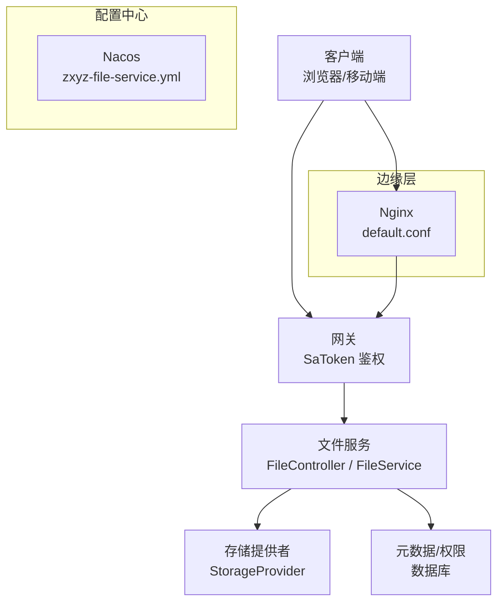
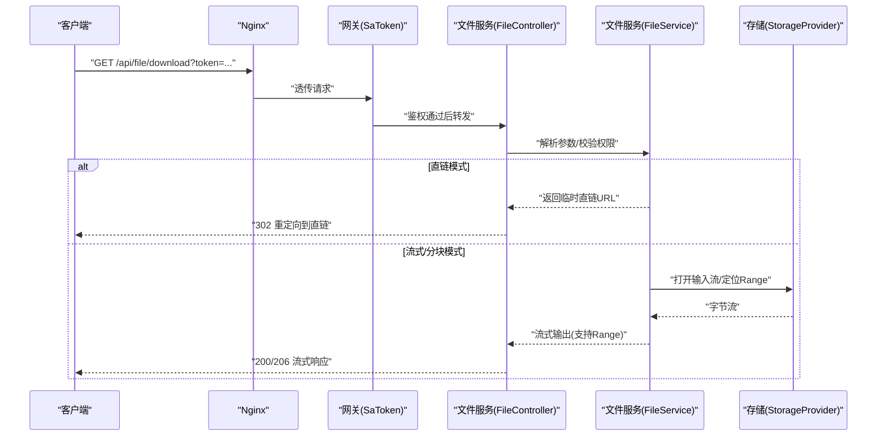
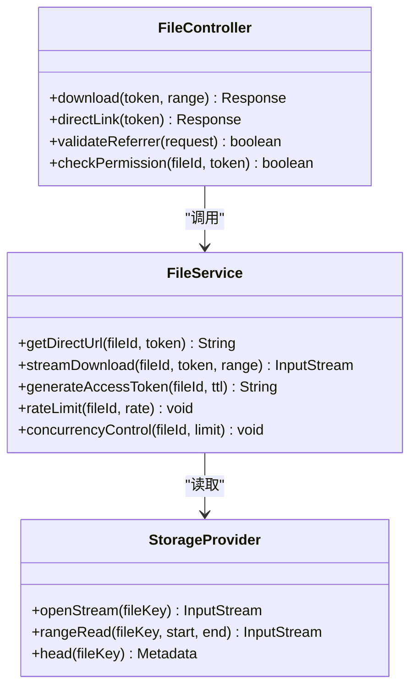
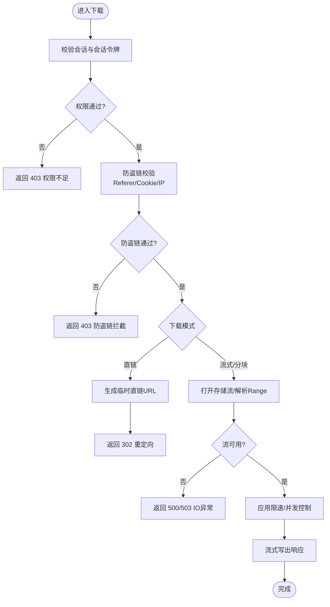
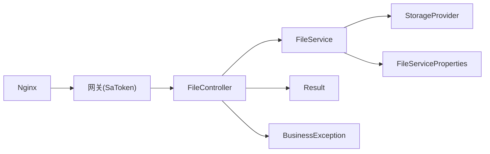

# 文件下载接口

<cite>
**本文引用的文件**   
- [zxyz-file-service/src/main/java/uno/acloud/file/controller/FileController.java](file://ZXYZdatabaseBack/zxyz-file-service/src/main/java/uno/acloud/file/controller/FileController.java)
- [zxyz-file-service/src/main/java/uno/acloud/file/service/FileService.java](file://ZXYZdatabaseBack/zxyz-file-service/src/main/java/uno/acloud/file/service/FileService.java)
- [zxyz-file-service/src/main/java/uno/acloud/file/storage/StorageProvider.java](file://ZXYZdatabaseBack/zxyz-file-service/src/main/java/uno/acloud/file/storage/StorageProvider.java)
- [zxyz-file-service/src/main/java/uno/acloud/file/config/FileServiceProperties.java](file://ZXYZdatabaseBack/zxyz-file-service/src/main/java/uno/acloud/file/config/FileServiceProperties.java)
- [zxyz-common/src/main/java/uno/acloud/common/web/Result.java](file://ZXYZdatabaseBack/zxyz-common/src/main/java/uno/acloud/common/web/Result.java)
- [zxyz-common/src/main/java/uno/acloud/common/exception/BusinessException.java](file://ZXYZdatabaseBack/zxyz-common/src/main/java/uno/acloud/common/exception/BusinessException.java)
- [nacos-config/zxyz-file-service.yml](file://nacos-config/zxyz-file-service.yml)
- [deploy/nginx/default.conf](file://deploy/nginx/default.conf)
- [ZXYZdatabaseFront/src/api/files.js](file://ZXYZdatabaseFront/src/api/files.js)
- [ZXYZdatabaseFront/src/utils/download.js](file://ZXYZdatabaseFront/src/utils/download.js)
- [ZXYZdatabaseFront/src/composables/useFileDownload.js](file://ZXYZdatabaseFront/src/composables/useFileDownload.js)
</cite>

## 目录
1. [简介](#简介)
2. [项目结构](#项目结构)
3. [核心组件](#核心组件)
4. [架构总览](#架构总览)
5. [详细组件分析](#详细组件分析)
6. [依赖关系分析](#依赖关系分析)
7. [性能与优化](#性能与优化)
8. [故障排查指南](#故障排查指南)
9. [结论](#结论)
10. [附录：API 规范与示例](#附录api-规范与示例)

## 简介
本文件为 ZXYZ 项目的“文件下载 RESTful API”文档，覆盖直链下载、流式下载、分块下载（Range）与断点续传。文档同时说明下载权限验证流程、访问令牌生成机制、防盗链保护策略，以及下载速度限制、并发控制、缓存策略等性能优化选项。并提供完整的请求/响应示例与错误处理说明，包括权限不足、文件不存在、网络超时等异常场景。

## 项目结构
围绕文件下载能力，后端以 zxyz-file-service 为核心，配合网关鉴权、Nginx 反向代理与前端调用封装；配置由 Nacos 集中管理。

**图表来源** 
- [zxyz-file-service/src/main/java/uno/acloud/file/controller/FileController.java](file://ZXYZdatabaseBack/zxyz-file-service/src/main/java/uno/acloud/file/controller/FileController.java)
- [zxyz-file-service/src/main/java/uno/acloud/file/service/FileService.java](file://ZXYZdatabaseBack/zxyz-file-service/src/main/java/uno/acloud/file/service/FileService.java)
- [zxyz-file-service/src/main/java/uno/acloud/file/storage/StorageProvider.java](file://ZXYZdatabaseBack/zxyz-file-service/src/main/java/uno/acloud/file/storage/StorageProvider.java)
- [nacos-config/zxyz-file-service.yml](file://nacos-config/zxyz-file-service.yml)
- [deploy/nginx/default.conf](file://deploy/nginx/default.conf)

**章节来源**
- [zxyz-file-service/src/main/java/uno/acloud/file/controller/FileController.java](file://ZXYZdatabaseBack/zxyz-file-service/src/main/java/uno/acloud/file/controller/FileController.java)
- [zxyz-file-service/src/main/java/uno/acloud/file/service/FileService.java](file://ZXYZdatabaseBack/zxyz-file-service/src/main/java/uno/acloud/file/service/FileService.java)
- [zxyz-file-service/src/main/java/uno/acloud/file/storage/StorageProvider.java](file://ZXYZdatabaseBack/zxyz-file-service/src/main/java/uno/acloud/file/storage/StorageProvider.java)
- [nacos-config/zxyz-file-service.yml](file://nacos-config/zxyz-file-service.yml)
- [deploy/nginx/default.conf](file://deploy/nginx/default.conf)

## 核心组件
- 控制器层：提供下载相关 HTTP 端点，统一入参校验、权限检查、响应封装。
- 服务层：实现下载业务逻辑，包括权限校验、令牌签发、流式读取、分块支持、限速与并发控制。
- 存储抽象：对接对象存储或本地存储，屏蔽底层差异。
- 配置项：通过 Nacos 动态下发下载开关、限速阈值、缓存策略、防盗链参数等。
- 网关与 Nginx：统一鉴权、限流、跨域、Referer/Cookie 校验、静态资源加速。

**章节来源**
- [zxyz-file-service/src/main/java/uno/acloud/file/controller/FileController.java](file://ZXYZdatabaseBack/zxyz-file-service/src/main/java/uno/acloud/file/controller/FileController.java)
- [zxyz-file-service/src/main/java/uno/acloud/file/service/FileService.java](file://ZXYZdatabaseBack/zxyz-file-service/src/main/java/uno/acloud/file/service/FileService.java)
- [zxyz-file-service/src/main/java/uno/acloud/file/storage/StorageProvider.java](file://ZXYZdatabaseBack/zxyz-file-service/src/main/java/uno/acloud/file/storage/StorageProvider.java)
- [zxyz-file-service/src/main/java/uno/acloud/file/config/FileServiceProperties.java](file://ZXYZdatabaseBack/zxyz-file-service/src/main/java/uno/acloud/file/config/FileServiceProperties.java)

## 架构总览
下载请求从客户端发起，经 Nginx 转发至网关进行 SaToken 鉴权，随后路由到文件服务。文件服务根据请求类型选择直链或流式下载，必要时签发访问令牌并启用防盗链校验。存储层按需提供字节流，服务层负责分块、限速、并发控制与缓存命中。

**图表来源** 
- [zxyz-file-service/src/main/java/uno/acloud/file/controller/FileController.java](file://ZXYZdatabaseBack/zxyz-file-service/src/main/java/uno/acloud/file/controller/FileController.java)
- [zxyz-file-service/src/main/java/uno/acloud/file/service/FileService.java](file://ZXYZdatabaseBack/zxyz-file-service/src/main/java/uno/acloud/file/service/FileService.java)
- [zxyz-file-service/src/main/java/uno/acloud/file/storage/StorageProvider.java](file://ZXYZdatabaseBack/zxyz-file-service/src/main/java/uno/acloud/file/storage/StorageProvider.java)

## 详细组件分析

### 控制器层：下载入口与协议适配
- 端点设计
  - 直链下载：返回临时可下载的 URL，适合大文件与外部系统直接拉取。
  - 流式下载：服务端边读边写，适合小中文件与需要服务端控制的场景。
  - 分块下载：支持 Range 头，便于断点续传与进度恢复。
- 权限与防盗链
  - 基于 SaToken 的会话校验与内部服务 Token 校验。
  - Referer 白名单、Cookie 签名校验、IP 白名单等防盗链策略。
- 响应封装
  - 统一 Result<T> 包装成功与错误信息。

**图表来源** 
- [zxyz-file-service/src/main/java/uno/acloud/file/controller/FileController.java](file://ZXYZdatabaseBack/zxyz-file-service/src/main/java/uno/acloud/file/controller/FileController.java)
- [zxyz-file-service/src/main/java/uno/acloud/file/service/FileService.java](file://ZXYZdatabaseBack/zxyz-file-service/src/main/java/uno/acloud/file/service/FileService.java)
- [zxyz-file-service/src/main/java/uno/acloud/file/storage/StorageProvider.java](file://ZXYZdatabaseBack/zxyz-file-service/src/main/java/uno/acloud/file/storage/StorageProvider.java)

**章节来源**
- [zxyz-file-service/src/main/java/uno/acloud/file/controller/FileController.java](file://ZXYZdatabaseBack/zxyz-file-service/src/main/java/uno/acloud/file/controller/FileController.java)
- [zxyz-file-service/src/main/java/uno/acloud/file/service/FileService.java](file://ZXYZdatabaseBack/zxyz-file-service/src/main/java/uno/acloud/file/service/FileService.java)

### 服务层：权限、令牌、流式与分块
- 权限验证流程
  - 校验用户会话有效性（SaToken）。
  - 校验文件访问权限（团队/项目/分享链接维度）。
  - 校验防盗链（Referer、Cookie、IP 白名单）。
- 访问令牌生成机制
  - 基于 fileId + 时间戳 + 随机盐生成短期有效令牌。
  - 令牌可绑定 IP、Referer、过期时间、最大下载次数。
- 流式下载与分块
  - 使用 InputStream 边读边写，避免全量加载内存。
  - 解析 Range 头，定位起始偏移与长度，返回 206 Partial Content。
- 限速与并发控制
  - 令牌级速率限制（QPS/带宽）。
  - 单文件并发连接数上限，防止热点文件打爆存储。

**图表来源** 
- [zxyz-file-service/src/main/java/uno/acloud/file/service/FileService.java](file://ZXYZdatabaseBack/zxyz-file-service/src/main/java/uno/acloud/file/service/FileService.java)
- [zxyz-file-service/src/main/java/uno/acloud/file/storage/StorageProvider.java](file://ZXYZdatabaseBack/zxyz-file-service/src/main/java/uno/acloud/file/storage/StorageProvider.java)

**章节来源**
- [zxyz-file-service/src/main/java/uno/acloud/file/service/FileService.java](file://ZXYZdatabaseBack/zxyz-file-service/src/main/java/uno/acloud/file/service/FileService.java)

### 存储抽象：统一读取与 Range 支持
- 统一 openStream 接口，屏蔽不同存储实现差异。
- rangeRead 支持指定字节范围，提升断点续传效率。
- head 获取元数据（大小、MIME、ETag），用于缓存与条件请求。

**章节来源**
- [zxyz-file-service/src/main/java/uno/acloud/file/storage/StorageProvider.java](file://ZXYZdatabaseBack/zxyz-file-service/src/main/java/uno/acloud/file/storage/StorageProvider.java)

### 配置项：Nacos 下发的下载策略
- 下载开关与默认模式（直链/流式）。
- 限速阈值（QPS、带宽）、并发连接上限。
- 防盗链策略（Referer 白名单、Cookie 签名密钥）。
- 缓存策略（ETag、Cache-Control、CDN 回源规则）。

**章节来源**
- [nacos-config/zxyz-file-service.yml](file://nacos-config/zxyz-file-service.yml)
- [zxyz-file-service/src/main/java/uno/acloud/file/config/FileServiceProperties.java](file://ZXYZdatabaseBack/zxyz-file-service/src/main/java/uno/acloud/file/config/FileServiceProperties.java)

### 网关与 Nginx：鉴权与边缘防护
- 网关：SaToken 过滤器拒绝公网访问内部端点，校验 Token 与签名。
- Nginx：配置 Referer 校验、限速、缓存头、Gzip、静态资源加速。

**章节来源**
- [deploy/nginx/default.conf](file://deploy/nginx/default.conf)

### 前端调用：直链与流式下载封装
- files.js：封装下载 API 调用，统一错误处理与重试。
- download.js：通用下载工具，支持 Blob/ArrayBuffer 与分片下载。
- useFileDownload.js：组合式函数，封装下载状态、进度、取消与错误提示。

**章节来源**
- [ZXYZdatabaseFront/src/api/files.js](file://ZXYZdatabaseFront/src/api/files.js)
- [ZXYZdatabaseFront/src/utils/download.js](file://ZXYZdatabaseFront/src/utils/download.js)
- [ZXYZdatabaseFront/src/composables/useFileDownload.js](file://ZXYZdatabaseFront/src/composables/useFileDownload.js)

## 依赖关系分析
- 控制器依赖服务层完成权限校验、令牌签发与流式读取。
- 服务层依赖存储抽象进行 I/O 操作，并通过配置类读取运行时策略。
- 网关与 Nginx 作为前置过滤层，承担鉴权、防盗链与性能优化职责。
- 前端通过 API 模块与下载工具库协同，保证用户体验与稳定性。

**图表来源** 
- [zxyz-file-service/src/main/java/uno/acloud/file/controller/FileController.java](file://ZXYZdatabaseBack/zxyz-file-service/src/main/java/uno/acloud/file/controller/FileController.java)
- [zxyz-file-service/src/main/java/uno/acloud/file/service/FileService.java](file://ZXYZdatabaseBack/zxyz-file-service/src/main/java/uno/acloud/file/service/FileService.java)
- [zxyz-file-service/src/main/java/uno/acloud/file/storage/StorageProvider.java](file://ZXYZdatabaseBack/zxyz-file-service/src/main/java/uno/acloud/file/storage/StorageProvider.java)
- [zxyz-file-service/src/main/java/uno/acloud/file/config/FileServiceProperties.java](file://ZXYZdatabaseBack/zxyz-file-service/src/main/java/uno/acloud/file/config/FileServiceProperties.java)
- [zxyz-common/src/main/java/uno/acloud/common/web/Result.java](file://ZXYZdatabaseBack/zxyz-common/src/main/java/uno/acloud/common/web/Result.java)
- [zxyz-common/src/main/java/uno/acloud/common/exception/BusinessException.java](file://ZXYZdatabaseBack/zxyz-common/src/main/java/uno/acloud/common/exception/BusinessException.java)
- [deploy/nginx/default.conf](file://deploy/nginx/default.conf)

**章节来源**
- [zxyz-file-service/src/main/java/uno/acloud/file/controller/FileController.java](file://ZXYZdatabaseBack/zxyz-file-service/src/main/java/uno/acloud/file/controller/FileController.java)
- [zxyz-file-service/src/main/java/uno/acloud/file/service/FileService.java](file://ZXYZdatabaseBack/zxyz-file-service/src/main/java/uno/acloud/file/service/FileService.java)
- [zxyz-file-service/src/main/java/uno/acloud/file/storage/StorageProvider.java](file://ZXYZdatabaseBack/zxyz-file-service/src/main/java/uno/acloud/file/storage/StorageProvider.java)
- [zxyz-file-service/src/main/java/uno/acloud/file/config/FileServiceProperties.java](file://ZXYZdatabaseBack/zxyz-file-service/src/main/java/uno/acloud/file/config/FileServiceProperties.java)
- [zxyz-common/src/main/java/uno/acloud/common/web/Result.java](file://ZXYZdatabaseBack/zxyz-common/src/main/java/uno/acloud/common/web/Result.java)
- [zxyz-common/src/main/java/uno/acloud/common/exception/BusinessException.java](file://ZXYZdatabaseBack/zxyz-common/src/main/java/uno/acloud/common/exception/BusinessException.java)
- [deploy/nginx/default.conf](file://deploy/nginx/default.conf)

## 性能与优化
- 直链下载优先：对大文件优先返回临时直链，减少后端负载与内存占用。
- 流式输出：避免全量加载，降低峰值内存；合理设置缓冲大小。
- 分块与断点续传：支持 Range，提高网络不稳定环境下的成功率。
- 限速与并发：令牌级 QPS/带宽限制，单文件并发连接上限，保护存储与后端。
- 缓存策略：ETag/Last-Modified 与 Cache-Control，结合 CDN 缓存命中。
- 网关/Nginx 优化：开启 Gzip、HTTP/2、Keep-Alive，静态资源就近分发。

[本节为通用指导，不直接分析具体文件]

## 故障排查指南
- 权限不足（403）
  - 检查 SaToken 会话是否有效、访问令牌是否过期或被撤销。
  - 核对团队/项目/分享权限配置。
- 防盗链拦截（403）
  - 校验 Referer 白名单、Cookie 签名、IP 白名单。
- 文件不存在（404）
  - 确认 fileId 正确、文件未被删除或移动到回收站。
- 网络超时（504/503）
  - 检查存储可用性、网络延迟、上游服务健康状态。
- 分块失败（416）
  - 校验 Range 头范围是否合法，服务端 ETag/大小是否一致。

**章节来源**
- [zxyz-common/src/main/java/uno/acloud/common/exception/BusinessException.java](file://ZXYZdatabaseBack/zxyz-common/src/main/java/uno/acloud/common/exception/BusinessException.java)
- [zxyz-common/src/main/java/uno/acloud/common/web/Result.java](file://ZXYZdatabaseBack/zxyz-common/src/main/java/uno/acloud/common/web/Result.java)

## 结论
ZXYZ 的文件下载能力以“控制器-服务-存储”分层为核心，结合网关与 Nginx 的前置鉴权与边缘优化，实现了安全、高效、可扩展的下载体验。通过直链优先、流式输出、分块与断点续传、限速与并发控制、缓存策略等手段，兼顾了性能与稳定性。建议在生产环境充分压测并监控关键指标（QPS、延迟、错误率、带宽利用率）。

[本节为总结性内容，不直接分析具体文件]

## 附录：API 规范与示例

### 通用约定
- 认证方式：SaToken Cookie + 可选访问令牌（token）。
- 统一响应体：Result<T>，code=1 表示成功。
- 错误码：403 权限不足/防盗链拦截，404 文件不存在，416 范围无效，500/503 服务端错误。

**章节来源**
- [zxyz-common/src/main/java/uno/acloud/common/web/Result.java](file://ZXYZdatabaseBack/zxyz-common/src/main/java/uno/acloud/common/web/Result.java)

### 直链下载
- 方法：GET
- 路径：/api/file/direct-link
- 查询参数：
  - token：访问令牌（必填）
- 响应：
  - 成功：302 重定向到临时直链 URL
  - 失败：Result 错误信息（权限不足、令牌过期等）

请求示例
- GET /api/file/direct-link?token=eyJhbGciOiJIUzI1NiJ9...

响应示例
- 302 Location: https://cdn.example.com/files/abc123.zip?expires=...&sign=...

**章节来源**
- [zxyz-file-service/src/main/java/uno/acloud/file/controller/FileController.java](file://ZXYZdatabaseBack/zxyz-file-service/src/main/java/uno/acloud/file/controller/FileController.java)
- [zxyz-file-service/src/main/java/uno/acloud/file/service/FileService.java](file://ZXYZdatabaseBack/zxyz-file-service/src/main/java/uno/acloud/file/service/FileService.java)

### 流式下载
- 方法：GET
- 路径：/api/file/stream
- 查询参数：
  - token：访问令牌（必填）
- 响应：
  - 成功：200 二进制流
  - 失败：Result 错误信息

请求示例
- GET /api/file/stream?token=eyJhbGciOiJIUzI1NiJ9...

响应示例
- 200 OK
- Content-Type: application/octet-stream
- Content-Disposition: attachment; filename="report.pdf"

**章节来源**
- [zxyz-file-service/src/main/java/uno/acloud/file/controller/FileController.java](file://ZXYZdatabaseBack/zxyz-file-service/src/main/java/uno/acloud/file/controller/FileController.java)
- [zxyz-file-service/src/main/java/uno/acloud/file/service/FileService.java](file://ZXYZdatabaseBack/zxyz-file-service/src/main/java/uno/acloud/file/service/FileService.java)

### 分块下载与断点续传
- 方法：GET
- 路径：/api/file/range
- 查询参数：
  - token：访问令牌（必填）
- 请求头：
  - Range: bytes=start-end
- 响应：
  - 首次：200 完整流
  - 续传：206 Partial Content，Content-Range: bytes start-end/total

请求示例
- GET /api/file/range?token=eyJhbGciOiJIUzI1NiJ9...
- Range: bytes=0-1048575

响应示例
- 206 Partial Content
- Content-Range: bytes 0-1048575/10485760
- Content-Type: application/octet-stream

**章节来源**
- [zxyz-file-service/src/main/java/uno/acloud/file/controller/FileController.java](file://ZXYZdatabaseBack/zxyz-file-service/src/main/java/uno/acloud/file/controller/FileController.java)
- [zxyz-file-service/src/main/java/uno/acloud/file/service/FileService.java](file://ZXYZdatabaseBack/zxyz-file-service/src/main/java/uno/acloud/file/service/FileService.java)
- [zxyz-file-service/src/main/java/uno/acloud/file/storage/StorageProvider.java](file://ZXYZdatabaseBack/zxyz-file-service/src/main/java/uno/acloud/file/storage/StorageProvider.java)

### 访问令牌生成
- 方法：POST
- 路径：/api/file/token
- 请求体：
  - fileId：文件标识（必填）
  - ttl：有效期（秒，可选）
  - ip：绑定 IP（可选）
  - referer：绑定 Referer（可选）
  - maxUses：最大使用次数（可选）
- 响应：
  - 成功：返回 token 字符串
  - 失败：Result 错误信息

请求示例
- POST /api/file/token
- Body: {"fileId":"f_123","ttl":3600,"ip":"192.168.1.1","referer":"https://app.example.com"}

响应示例
- {
  "code": 1,
  "data": "eyJhbGciOiJIUzI1NiJ9...",
  "msg": "success"
}

**章节来源**
- [zxyz-file-service/src/main/java/uno/acloud/file/service/FileService.java](file://ZXYZdatabaseBack/zxyz-file-service/src/main/java/uno/acloud/file/service/FileService.java)

### 错误处理说明
- 权限不足（403）
  - 原因：会话失效、令牌非法、无访问权限。
  - 处理：刷新会话或重新申请令牌。
- 防盗链拦截（403）
  - 原因：Referer 不在白名单、Cookie 签名不匹配、IP 被限制。
  - 处理：修正 Referer、更新签名、加入白名单。
- 文件不存在（404）
  - 原因：fileId 错误或文件已删除。
  - 处理：校验 fileId、检查文件状态。
- 网络超时（504/503）
  - 原因：存储不可用、上游服务异常。
  - 处理：重试或降级到直链模式。
- 范围无效（416）
  - 原因：Range 超出文件大小。
  - 处理：重新计算 Range，校验 ETag。

**章节来源**
- [zxyz-common/src/main/java/uno/acloud/common/exception/BusinessException.java](file://ZXYZdatabaseBack/zxyz-common/src/main/java/uno/acloud/common/exception/BusinessException.java)
- [zxyz-common/src/main/java/uno/acloud/common/web/Result.java](file://ZXYZdatabaseBack/zxyz-common/src/main/java/uno/acloud/common/web/Result.java)

### 前端调用示例
- 直链下载：files.js 封装 direct-link 调用，成功后 window.open 打开直链。
- 流式下载：download.js 将二进制流写入 Blob，触发浏览器下载。
- 分块下载：useFileDownload.js 维护 Range、进度、取消与重试。

**章节来源**
- [ZXYZdatabaseFront/src/api/files.js](file://ZXYZdatabaseFront/src/api/files.js)
- [ZXYZdatabaseFront/src/utils/download.js](file://ZXYZdatabaseFront/src/utils/download.js)
- [ZXYZdatabaseFront/src/composables/useFileDownload.js](file://ZXYZdatabaseFront/src/composables/useFileDownload.js)