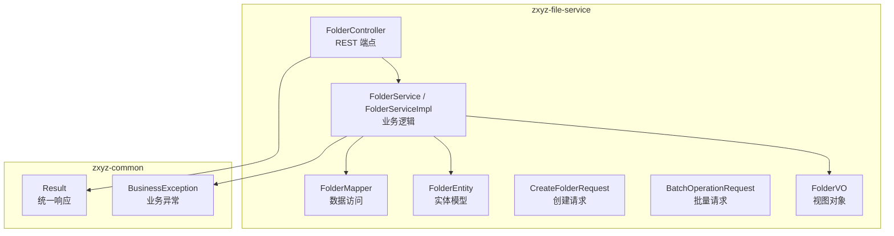
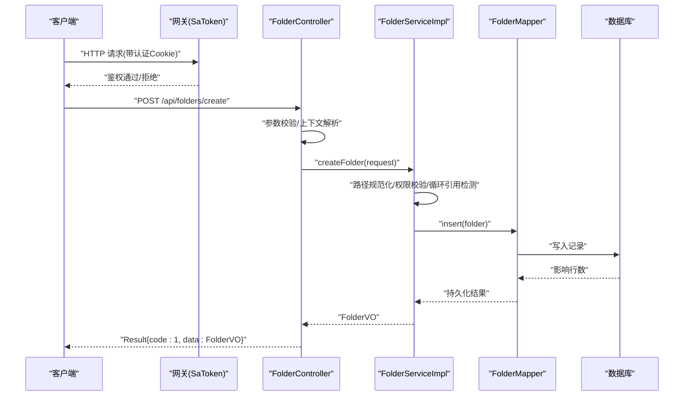
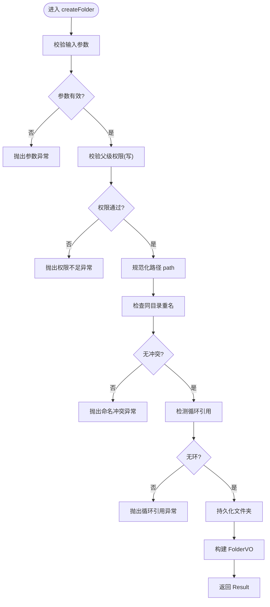
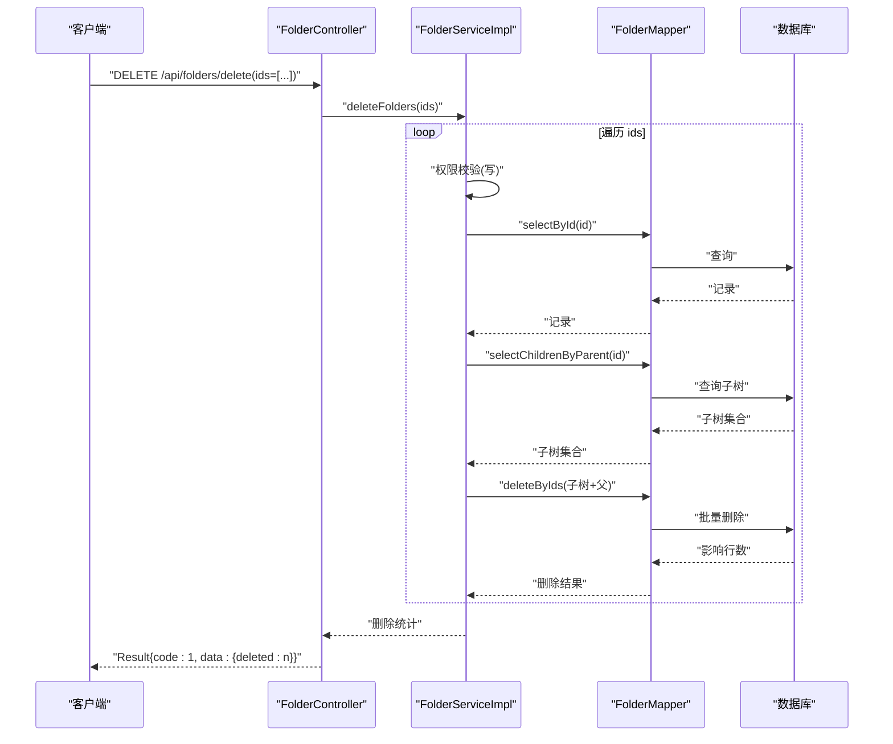
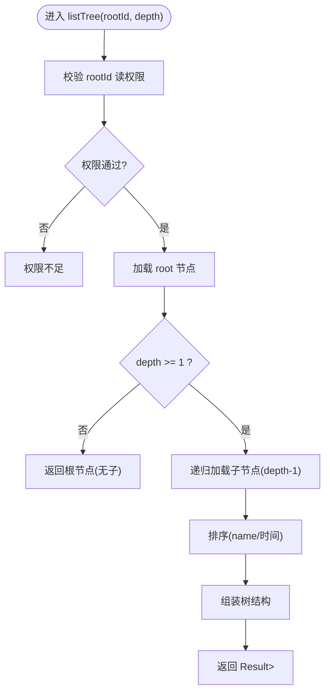
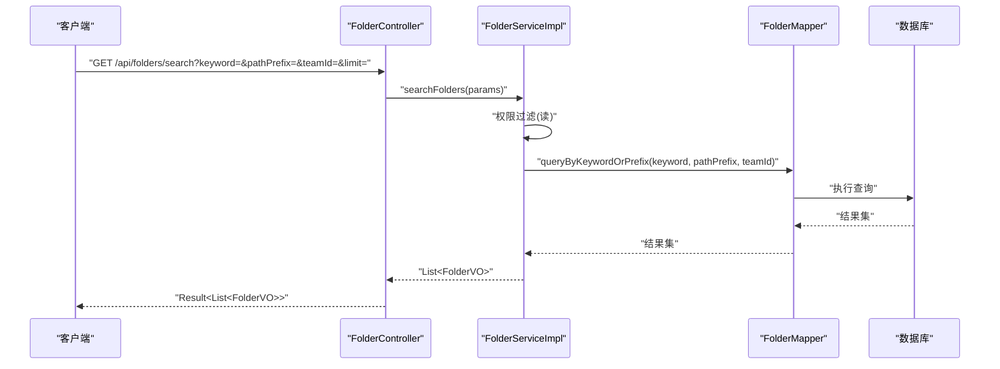
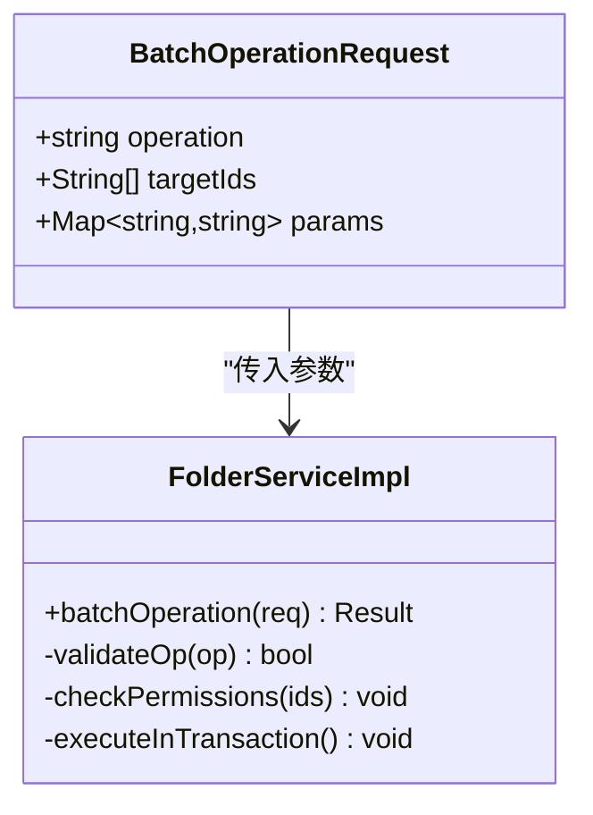
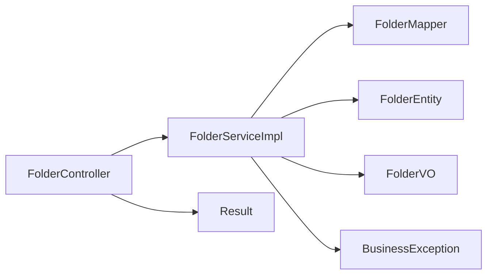

# 文件夹管理接口

<cite>
**本文引用的文件**   
- [zxyz-file-service/src/main/java/uno/acloud/file/controller/FolderController.java](file://ZXYZdatabaseBack/zxyz-file-service/src/main/java/uno/acloud/file/controller/FolderController.java)
- [zxyz-file-service/src/main/java/uno/acloud/file/service/FolderService.java](file://ZXYZdatabaseBack/zxyz-file-service/src/main/java/uno/acloud/file/service/FolderService.java)
- [zxyz-file-service/src/main/java/uno/acloud/file/service/impl/FolderServiceImpl.java](file://ZXYZdatabaseBack/zxyz-file-service/src/main/java/uno/acloud/file/service/impl/FolderServiceImpl.java)
- [zxyz-file-service/src/main/java/uno/acloud/file/dto/CreateFolderRequest.java](file://ZXYZdatabaseBack/zxyz-file-service/src/main/java/uno/acloud/file/dto/CreateFolderRequest.java)
- [zxyz-file-service/src/main/java/uno/acloud/file/dto/BatchOperationRequest.java](file://ZXYZdatabaseBack/zxyz-file-service/src/main/java/uno/acloud/file/dto/BatchOperationRequest.java)
- [zxyz-file-service/src/main/java/uno/acloud/file/vo/FolderVO.java](file://ZXYZdatabaseBack/zxyz-file-service/src/main/java/uno/acloud/file/vo/FolderVO.java)
- [zxyz-file-service/src/main/java/uno/acloud/file/entity/FolderEntity.java](file://ZXYZdatabaseBack/zxyz-file-service/src/main/java/uno/acloud/file/entity/FolderEntity.java)
- [zxyz-file-service/src/main/java/uno/acloud/file/mapper/FolderMapper.java](file://ZXYZdatabaseBack/zxyz-file-service/src/main/java/uno/acloud/file/mapper/FolderMapper.java)
- [zxyz-common/src/main/java/uno/acloud/common/web/Result.java](file://ZXYZdatabaseBack/zxyz-common/src/main/java/uno/acloud/common/web/Result.java)
- [zxyz-common/src/main/java/uno/acloud/common/exception/BusinessException.java](file://ZXYZdatabaseBack/zxyz-common/src/main/java/uno/acloud/common/exception/BusinessException.java)
- [nacos-config/zxyz-file-service.yml](file://nacos-config/zxyz-file-service.yml)
</cite>

## 目录
1. [简介](#简介)
2. [项目结构](#项目结构)
3. [核心组件](#核心组件)
4. [架构总览](#架构总览)
5. [详细组件分析](#详细组件分析)
6. [依赖关系分析](#依赖关系分析)
7. [性能考虑](#性能考虑)
8. [故障排查指南](#故障排查指南)
9. [结论](#结论)
10. [附录](#附录)

## 简介
本文件为 ZXYZ 项目的“文件夹管理”RESTful API 文档，覆盖以下能力：
- 创建文件夹
- 删除文件夹（支持批量）
- 遍历文件夹树（支持递归与深度限制）
- 搜索文件夹（按名称、路径前缀等）

同时说明：
- 文件夹层级结构与路径规范
- 权限继承机制
- 批量操作与递归遍历的实现要点
- 完整的请求/响应示例与错误处理（路径非法、权限不足、循环引用等）

## 项目结构
文件夹管理相关代码位于 zxyz-file-service 模块，采用传统分层（controller → service → mapper → entity），并配合 zxyz-common 中的统一返回体与异常类型。

图表来源
- [zxyz-file-service/src/main/java/uno/acloud/file/controller/FolderController.java](file://ZXYZdatabaseBack/zxyz-file-service/src/main/java/uno/acloud/file/controller/FolderController.java)
- [zxyz-file-service/src/main/java/uno/acloud/file/service/FolderService.java](file://ZXYZdatabaseBack/zxyz-file-service/src/main/java/uno/acloud/file/service/FolderService.java)
- [zxyz-file-service/src/main/java/uno/acloud/file/service/impl/FolderServiceImpl.java](file://ZXYZdatabaseBack/zxyz-fileservice/src/main/java/uno/acloud/file/service/impl/FolderServiceImpl.java)
- [zxyz-file-service/src/main/java/uno/acloud/file/mapper/FolderMapper.java](file://ZXYZdatabaseBack/zxyz-file-service/src/main/java/uno/acloud/file/mapper/FolderMapper.java)
- [zxyz-file-service/src/main/java/uno/acloud/file/entity/FolderEntity.java](file://ZXYZdatabaseBack/zxyz-file-service/src/main/java/uno/acloud/file/entity/FolderEntity.java)
- [zxyz-file-service/src/main/java/uno/acloud/file/dto/CreateFolderRequest.java](file://ZXYZdatabaseBack/zxyz-file-service/src/main/java/uno/acloud/file/dto/CreateFolderRequest.java)
- [zxyz-file-service/src/main/java/uno/acloud/file/dto/BatchOperationRequest.java](file://ZXYZdatabaseBack/zxyz-file-service/src/main/java/uno/acloud/file/dto/BatchOperationRequest.java)
- [zxyz-file-service/src/main/java/uno/acloud/file/vo/FolderVO.java](file://ZXYZdatabaseBack/zxyz-file-service/src/main/java/uno/acloud/file/vo/FolderVO.java)
- [zxyz-common/src/main/java/uno/acloud/common/web/Result.java](file://ZXYZdatabaseBack/zxyz-common/src/main/java/uno/acloud/common/web/Result.java)
- [zxyz-common/src/main/java/uno/acloud/common/exception/BusinessException.java](file://ZXYZdatabaseBack/zxyz-common/src/main/java/uno/acloud/common/exception/BusinessException.java)

章节来源
- [zxyz-file-service/src/main/java/uno/acloud/file/controller/FolderController.java](file://ZXYZdatabaseBack/zxyz-file-service/src/main/java/uno/acloud/file/controller/FolderController.java)
- [zxyz-file-service/src/main/java/uno/acloud/file/service/FolderService.java](file://ZXYZdatabaseBack/zxyz-file-service/src/main/java/uno/acloud/file/service/FolderService.java)
- [zxyz-file-service/src/main/java/uno/acloud/file/service/impl/FolderServiceImpl.java](file://ZXYZdatabaseBack/zxyz-file-service/src/main/java/uno/acloud/file/service/impl/FolderServiceImpl.java)
- [zxyz-common/src/main/java/uno/acloud/common/web/Result.java](file://ZXYZdatabaseBack/zxyz-common/src/main/java/uno/acloud/common/web/Result.java)

## 核心组件
- FolderController：暴露 REST 端点，负责参数校验、鉴权上下文注入、调用服务层并封装 Result 响应。
- FolderService / FolderServiceImpl：实现文件夹的创建、删除、遍历、搜索等业务逻辑；处理权限校验、路径规范化、循环引用检测、递归深度限制等。
- FolderMapper：对文件夹表进行 CRUD 与查询（含按父级、名称、路径前缀等条件）。
- FolderEntity：数据库映射实体，包含 id、parent_id、name、path、owner_id、team_id、permission_scope 等字段。
- CreateFolderRequest / BatchOperationRequest：请求 DTO，用于创建与批量操作的入参。
- FolderVO：面向前端的视图对象，包含展示所需字段（如 id、name、parentId、path、childrenCount 等）。
- Result<T>：统一响应包装，code=1 表示成功。
- BusinessException：业务异常，用于抛出路径非法、权限不足、循环引用等错误。

章节来源
- [zxyz-file-service/src/main/java/uno/acloud/file/controller/FolderController.java](file://ZXYZdatabaseBack/zxyz-file-service/src/main/java/uno/acloud/file/controller/FolderController.java)
- [zxyz-file-service/src/main/java/uno/acloud/file/service/FolderService.java](file://ZXYZdatabaseBack/zxyz-file-service/src/main/java/uno/acloud/file/service/FolderService.java)
- [zxyz-file-service/src/main/java/uno/acloud/file/service/impl/FolderServiceImpl.java](file://ZXYZdatabaseBack/zxyz-file-service/src/main/java/uno/acloud/file/service/impl/FolderServiceImpl.java)
- [zxyz-file-service/src/main/java/uno/acloud/file/dto/CreateFolderRequest.java](file://ZXYZdatabaseBack/zxyz-file-service/src/main/java/uno/acloud/file/dto/CreateFolderRequest.java)
- [zxyz-file-service/src/main/java/uno/acloud/file/dto/BatchOperationRequest.java](file://ZXYZdatabaseBack/zxyz-file-service/src/main/java/uno/acloud/file/dto/BatchOperationRequest.java)
- [zxyz-file-service/src/main/java/uno/acloud/file/vo/FolderVO.java](file://ZXYZdatabaseBack/zxyz-file-service/src/main/java/uno/acloud/file/vo/FolderVO.java)
- [zxyz-file-service/src/main/java/uno/acloud/file/entity/FolderEntity.java](file://ZXYZdatabaseBack/zxyz-file-service/src/main/java/uno/acloud/file/entity/FolderEntity.java)
- [zxyz-common/src/main/java/uno/acloud/common/web/Result.java](file://ZXYZdatabaseBack/zxyz-common/src/main/java/uno/acloud/common/web/Result.java)
- [zxyz-common/src/main/java/uno/acloud/common/exception/BusinessException.java](file://ZXYZdatabaseBack/zxyz-common/src/main/java/uno/acloud/common/exception/BusinessException.java)

## 架构总览
下图展示了从客户端到数据库的完整调用链，以及权限与路径校验的关键节点。

图表来源
- [zxyz-file-service/src/main/java/uno/acloud/file/controller/FolderController.java](file://ZXYZdatabaseBack/zxyz-file-service/src/main/java/uno/acloud/file/controller/FolderController.java)
- [zxyz-file-service/src/main/java/uno/acloud/file/service/impl/FolderServiceImpl.java](file://ZXYZdatabaseBack/zxyz-file-service/src/main/java/uno/acloud/file/service/impl/FolderServiceImpl.java)
- [zxyz-file-service/src/main/java/uno/acloud/file/mapper/FolderMapper.java](file://ZXYZdatabaseBack/zxyz-file-service/src/main/java/uno/acloud/file/mapper/FolderMapper.java)

## 详细组件分析

### 创建文件夹接口
- 方法：POST /api/folders/create
- 功能：在当前父文件夹下创建一个新文件夹，自动计算并写入 path 字段，校验权限与命名冲突。
- 请求体：CreateFolderRequest
  - teamId：团队标识
  - parentId：父文件夹ID（根为 null 或特定根ID）
  - name：文件夹名称（需符合命名规范）
  - permissionScope：权限范围（可选，默认继承父级）
- 响应体：Result<FolderVO>
- 关键规则：
  - 路径规范：path = parent.path + "/" + name，根路径为空字符串或固定前缀
  - 权限继承：若未显式指定 permissionScope，则继承父级权限
  - 命名冲突：同目录下同名文件夹不允许重复创建
  - 循环引用：禁止将某文件夹设为其子树的祖先
- 错误场景：
  - 路径非法：name 包含非法字符或过长
  - 权限不足：当前用户对目标父文件夹无“写”权限
  - 循环引用：设置 parentId 导致环状依赖
  - 命名冲突：同目录下已存在同名文件夹

图表来源
- [zxyz-file-service/src/main/java/uno/acloud/file/service/impl/FolderServiceImpl.java](file://ZXYZdatabaseBack/zxyz-file-service/src/main/java/uno/acloud/file/service/impl/FolderServiceImpl.java)
- [zxyz-file-service/src/main/java/uno/acloud/file/dto/CreateFolderRequest.java](file://ZXYZdatabaseBack/zxyz-file-service/src/main/java/uno/acloud/file/dto/CreateFolderRequest.java)
- [zxyz-file-service/src/main/java/uno/acloud/file/vo/FolderVO.java](file://ZXYZdatabaseBack/zxyz-file-service/src/main/java/uno/acloud/file/vo/FolderVO.java)

章节来源
- [zxyz-file-service/src/main/java/uno/acloud/file/controller/FolderController.java](file://ZXYZdatabaseBack/zxyz-file-service/src/main/java/uno/acloud/file/controller/FolderController.java)
- [zxyz-file-service/src/main/java/uno/acloud/file/service/impl/FolderServiceImpl.java](file://ZXYZdatabaseBack/zxyz-file-service/src/main/java/uno/acloud/file/service/impl/FolderServiceImpl.java)
- [zxyz-file-service/src/main/java/uno/acloud/file/dto/CreateFolderRequest.java](file://ZXYZdatabaseBack/zxyz-file-service/src/main/java/uno/acloud/file/dto/CreateFolderRequest.java)
- [zxyz-file-service/src/main/java/uno/acloud/file/vo/FolderVO.java](file://ZXYZdatabaseBack/zxyz-file-service/src/main/java/uno/acloud/file/vo/FolderVO.java)

### 删除文件夹接口
- 方法：DELETE /api/folders/delete
- 功能：删除指定文件夹及其所有子文件夹（递归删除），支持批量删除。
- 请求体：
  - 单个删除：id 列表仅一个元素
  - 批量删除：id 列表多个元素（建议上限控制）
- 关键规则：
  - 权限要求：对每个待删文件夹具备“写”权限
  - 级联删除：删除父文件夹时，递归删除全部子节点
  - 软删除：根据实现策略，可能标记为已删除而非物理删除
- 错误场景：
  - 权限不足：任一目标文件夹无写权限
  - 不存在：指定 ID 对应的文件夹不存在
  - 并发冲突：删除过程中被其他事务修改

图表来源
- [zxyz-file-service/src/main/java/uno/acloud/file/controller/FolderController.java](file://ZXYZdatabaseBack/zxyz-file-service/src/main/java/uno/acloud/file/controller/FolderController.java)
- [zxyz-file-service/src/main/java/uno/acloud/file/service/impl/FolderServiceImpl.java](file://ZXYZdatabaseBack/zxyz-file-service/src/main/java/uno/acloud/file/service/impl/FolderServiceImpl.java)
- [zxyz-file-service/src/main/java/uno/acloud/file/mapper/FolderMapper.java](file://ZXYZdatabaseBack/zxyz-file-service/src/main/java/uno/acloud/file/mapper/FolderMapper.java)

章节来源
- [zxyz-file-service/src/main/java/uno/acloud/file/controller/FolderController.java](file://ZXYZdatabaseBack/zxyz-file-service/src/main/java/uno/acloud/file/controller/FolderController.java)
- [zxyz-file-service/src/main/java/uno/acloud/file/service/impl/FolderServiceImpl.java](file://ZXYZdatabaseBack/zxyz-file-service/src/main/java/uno/acloud/file/service/impl/FolderServiceImpl.java)
- [zxyz-file-service/src/main/java/uno/acloud/file/dto/BatchOperationRequest.java](file://ZXYZdatabaseBack/zxyz-file-service/src/main/java/uno/acloud/file/dto/BatchOperationRequest.java)

### 遍历文件夹接口
- 方法：GET /api/folders/tree
- 功能：以树形结构返回指定根下的文件夹层级，支持递归与深度限制。
- 查询参数：
  - rootId：根文件夹ID（可为空，表示团队根）
  - depth：最大递归深度（默认不限制，建议配置上限）
  - includeFiles：是否包含文件（通常 false）
- 关键规则：
  - 权限：对 rootId 具备“读”权限即可列出子树
  - 深度限制：depth 超过阈值时截断返回，避免大数遍历
  - 排序：按 name 或创建时间排序（可配置）
- 错误场景：
  - 权限不足：对 rootId 无读权限
  - 参数非法：depth < 0 或过大

图表来源
- [zxyz-file-service/src/main/java/uno/acloud/file/service/impl/FolderServiceImpl.java](file://ZXYZdatabaseBack/zxyz-file-service/src/main/java/uno/acloud/file/service/impl/FolderServiceImpl.java)
- [zxyz-file-service/src/main/java/uno/acloud/file/mapper/FolderMapper.java](file://ZXYZdatabaseBack/zxyz-file-service/src/main/java/uno/acloud/file/mapper/FolderMapper.java)

章节来源
- [zxyz-file-service/src/main/java/uno/acloud/file/controller/FolderController.java](file://ZXYZdatabaseBack/zxyz-file-service/src/main/java/uno/acloud/file/controller/FolderController.java)
- [zxyz-file-service/src/main/java/uno/acloud/file/service/impl/FolderServiceImpl.java](file://ZXYZdatabaseBack/zxyz-file-service/src/main/java/uno/acloud/file/service/impl/FolderServiceImpl.java)

### 搜索文件夹接口
- 方法：GET /api/folders/search
- 功能：根据名称模糊匹配、路径前缀、团队范围等条件搜索文件夹。
- 查询参数：
  - keyword：关键词（名称模糊匹配）
  - pathPrefix：路径前缀（精确前缀匹配）
  - teamId：限定团队范围
  - limit：返回数量上限（默认 50，最大 200）
- 关键规则：
  - 权限：仅返回当前用户有“读”权限的文件夹
  - 索引优化：建议使用名称与路径前缀的索引提升查询性能
  - 去重：同一文件夹多次命中时去重
- 错误场景：
  - 参数非法：keyword 为空且 pathPrefix 为空
  - 权限不足：结果集过滤后为空

图表来源
- [zxyz-file-service/src/main/java/uno/acloud/file/controller/FolderController.java](file://ZXYZdatabaseBack/zxyz-file-service/src/main/java/uno/acloud/file/controller/FolderController.java)
- [zxyz-file-service/src/main/java/uno/acloud/file/service/impl/FolderServiceImpl.java](file://ZXYZdatabaseBack/zxyz-file-service/src/main/java/uno/acloud/file/service/impl/FolderServiceImpl.java)
- [zxyz-file-service/src/main/java/uno/acloud/file/mapper/FolderMapper.java](file://ZXYZdatabaseBack/zxyz-file-service/src/main/java/uno/acloud/file/mapper/FolderMapper.java)

章节来源
- [zxyz-file-service/src/main/java/uno/acloud/file/controller/FolderController.java](file://ZXYZdatabaseBack/zxyz-file-service/src/main/java/uno/acloud/file/controller/FolderController.java)
- [zxyz-file-service/src/main/java/uno/acloud/file/service/impl/FolderServiceImpl.java](file://ZXYZdatabaseBack/zxyz-file-service/src/main/java/uno/acloud/file/service/impl/FolderServiceImpl.java)

### 批量操作接口
- 方法：POST /api/folders/batch
- 功能：对多个文件夹执行统一操作（如批量删除、批量移动等）。
- 请求体：BatchOperationRequest
  - operation：操作类型（delete/move/copy）
  - targetIds：目标文件夹ID列表
  - params：操作参数（如 move 时的 newParentId）
- 关键规则：
  - 幂等性：相同请求重复提交应得到一致结果
  - 原子性：建议在同一事务中执行，失败回滚
  - 限流：服务端对批量操作做速率限制
- 错误场景：
  - 权限不足：任一目标无相应权限
  - 参数非法：operation 不支持或参数缺失
  - 部分失败：至少一个失败时整体回滚或返回明细

图表来源
- [zxyz-file-service/src/main/java/uno/acloud/file/dto/BatchOperationRequest.java](file://ZXYZdatabaseBack/zxyz-file-service/src/main/java/uno/acloud/file/dto/BatchOperationRequest.java)
- [zxyz-file-service/src/main/java/uno/acloud/file/service/impl/FolderServiceImpl.java](file://ZXYZdatabaseBack/zxyz-file-service/src/main/java/uno/acloud/file/service/impl/FolderServiceImpl.java)

章节来源
- [zxyz-file-service/src/main/java/uno/acloud/file/dto/BatchOperationRequest.java](file://ZXYZdatabaseBack/zxyz-file-service/src/main/java/uno/acloud/file/dto/BatchOperationRequest.java)
- [zxyz-file-service/src/main/java/uno/acloud/file/service/impl/FolderServiceImpl.java](file://ZXYZdatabaseBack/zxyz-file-service/src/main/java/uno/acloud/file/service/impl/FolderServiceImpl.java)

## 依赖关系分析
- FolderController 依赖 FolderService，使用 Result 统一响应。
- FolderServiceImpl 依赖 FolderMapper 与 FolderEntity，内部进行权限校验、路径规范化、循环引用检测、递归深度限制。
- FolderMapper 依赖数据库，提供按父级、名称、路径前缀等条件的查询。
- 统一异常 BusinessException 贯穿各层，便于前端统一处理错误码。

图表来源
- [zxyz-file-service/src/main/java/uno/acloud/file/controller/FolderController.java](file://ZXYZdatabaseBack/zxyz-file-service/src/main/java/uno/acloud/file/controller/FolderController.java)
- [zxyz-file-service/src/main/java/uno/acloud/file/service/impl/FolderServiceImpl.java](file://ZXYZdatabaseBack/zxyz-file-service/src/main/java/uno/acloud/file/service/impl/FolderServiceImpl.java)
- [zxyz-file-service/src/main/java/uno/acloud/file/mapper/FolderMapper.java](file://ZXYZdatabaseBack/zxyz-file-service/src/main/java/uno/acloud/file/mapper/FolderMapper.java)
- [zxyz-file-service/src/main/java/uno/acloud/file/entity/FolderEntity.java](file://ZXYZdatabaseBack/zxyz-file-service/src/main/java/uno/acloud/file/entity/FolderEntity.java)
- [zxyz-file-service/src/main/java/uno/acloud/file/vo/FolderVO.java](file://ZXYZdatabaseBack/zxyz-file-service/src/main/java/uno/acloud/file/vo/FolderVO.java)
- [zxyz-common/src/main/java/uno/acloud/common/web/Result.java](file://ZXYZdatabaseBack/zxyz-common/src/main/java/uno/acloud/common/web/Result.java)
- [zxyz-common/src/main/java/uno/acloud/common/exception/BusinessException.java](file://ZXYZdatabaseBack/zxyz-common/src/main/java/uno/acloud/common/exception/BusinessException.java)

章节来源
- [zxyz-file-service/src/main/java/uno/acloud/file/controller/FolderController.java](file://ZXYZdatabaseBack/zxyz-file-service/src/main/java/uno/acloud/file/controller/FolderController.java)
- [zxyz-file-service/src/main/java/uno/acloud/file/service/impl/FolderServiceImpl.java](file://ZXYZdatabaseBack/zxyz-file-service/src/main/java/uno/acloud/file/service/impl/FolderServiceImpl.java)
- [zxyz-common/src/main/java/uno/acloud/common/web/Result.java](file://ZXYZdatabaseBack/zxyz-common/src/main/java/uno/acloud/common/web/Result.java)
- [zxyz-common/src/main/java/uno/acloud/common/exception/BusinessException.java](file://ZXYZdatabaseBack/zxyz-common/src/main/java/uno/acloud/common/exception/BusinessException.java)

## 性能考虑
- 递归遍历：
  - 使用 depth 限制避免全量展开，默认建议不超过 5 层。
  - 分页：当子节点过多时，建议分页返回。
- 搜索：
  - 对 name 与 path 建立索引，提高模糊与前缀匹配效率。
  - 限制 limit 上限，避免大数据量返回。
- 批量操作：
  - 使用事务保证一致性，失败回滚。
  - 分批处理，避免单次事务过大。
- 缓存：
  - 对热点树结构可短期缓存（注意失效策略）。

[本节为通用指导，不直接分析具体文件]

## 故障排查指南
- 常见错误码与含义：
  - code != 1：请求失败，查看 message 获取详情。
  - 路径非法：检查 name 是否符合命名规范（长度、字符限制）。
  - 权限不足：确认当前用户对目标文件夹的权限角色（读/写/管理）。
  - 循环引用：检查 parentId 是否为其祖先节点。
  - 命名冲突：同目录下是否存在同名文件夹。
- 排查步骤：
  - 检查请求参数与路径格式。
  - 查看日志中的 BusinessException 堆栈定位问题。
  - 核对数据库记录与权限配置。
  - 对于批量操作，检查事务日志与锁竞争情况。

章节来源
- [zxyz-common/src/main/java/uno/acloud/common/exception/BusinessException.java](file://ZXYZdatabaseBack/zxyz-common/src/main/java/uno/acloud/common/exception/BusinessException.java)
- [zxyz-file-service/src/main/java/uno/acloud/file/service/impl/FolderServiceImpl.java](file://ZXYZdatabaseBack/zxyz-file-service/src/main/java/uno/acloud/file/service/impl/FolderServiceImpl.java)

## 结论
本接口文档围绕文件夹管理的核心能力（创建、删除、遍历、搜索）提供了清晰的 API 定义、权限与路径规范、批量与递归特性说明，以及错误处理与性能优化建议。通过统一的 Result 与 BusinessException，前后端协作更高效稳定。

[本节为总结，不直接分析具体文件]

## 附录

### 路径规范
- 根路径：空字符串或固定前缀（如 “/”）
- 子路径：parent.path + "/" + name
- 命名规范：
  - 长度限制：例如 1–255 字符
  - 字符限制：不允许系统保留字符（如 \ / : * ? " < > |）
  - 大小写敏感：视平台配置而定

### 权限继承机制
- 默认继承：新建文件夹未指定 permissionScope 时，继承父级权限
- 显式覆盖：创建时可指定更严格的权限范围
- 读取权限：对父级具备读权限即可浏览子树
- 写入权限：对父级具备写权限方可创建/删除/移动子节点

### 请求与响应示例
- 创建文件夹
  - 请求：POST /api/folders/create
    - 请求体：{ teamId, parentId, name, permissionScope }
  - 响应：Result<FolderVO>
    - 成功：code=1, data={ id, name, parentId, path, ... }
    - 失败：code!=1, message=错误描述
- 删除文件夹
  - 请求：DELETE /api/folders/delete
    - 请求体：{ ids: [id1, id2, ...] }
  - 响应：Result<{ deleted: number }>
- 遍历文件夹
  - 请求：GET /api/folders/tree?rootId=&depth=&includeFiles=false
  - 响应：Result<List<FolderVO>>
- 搜索文件夹
  - 请求：GET /api/folders/search?keyword=&pathPrefix=&teamId=&limit=50
  - 响应：Result<List<FolderVO>>

### 错误处理说明
- 路径非法：返回 code!=1，message 提示非法字符或长度超限
- 权限不足：返回 code!=1，message 提示无读/写权限
- 循环引用：返回 code!=1，message 提示禁止将祖先设为子节点
- 命名冲突：返回 code!=1，message 提示同目录已存在同名文件夹

章节来源
- [zxyz-file-service/src/main/java/uno/acloud/file/dto/CreateFolderRequest.java](file://ZXYZdatabaseBack/zxyz-file-service/src/main/java/uno/acloud/file/dto/CreateFolderRequest.java)
- [zxyz-file-service/src/main/java/uno/acloud/file/dto/BatchOperationRequest.java](file://ZXYZdatabaseBack/zxyz-file-service/src/main/java/uno/acloud/file/dto/BatchOperationRequest.java)
- [zxyz-file-service/src/main/java/uno/acloud/file/vo/FolderVO.java](file://ZXYZdatabaseBack/zxyz-file-service/src/main/java/uno/acloud/file/vo/FolderVO.java)
- [zxyz-common/src/main/java/uno/acloud/common/web/Result.java](file://ZXYZdatabaseBack/zxyz-common/src/main/java/uno/acloud/common/web/Result.java)
- [zxyz-common/src/main/java/uno/acloud/common/exception/BusinessException.java](file://ZXYZdatabaseBack/zxyz-common/src/main/java/uno/acloud/common/exception/BusinessException.java)