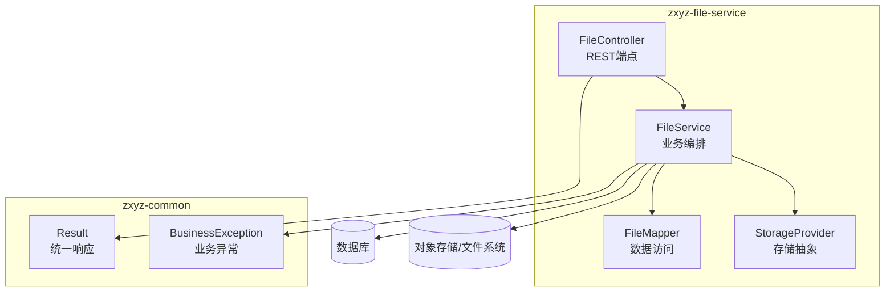
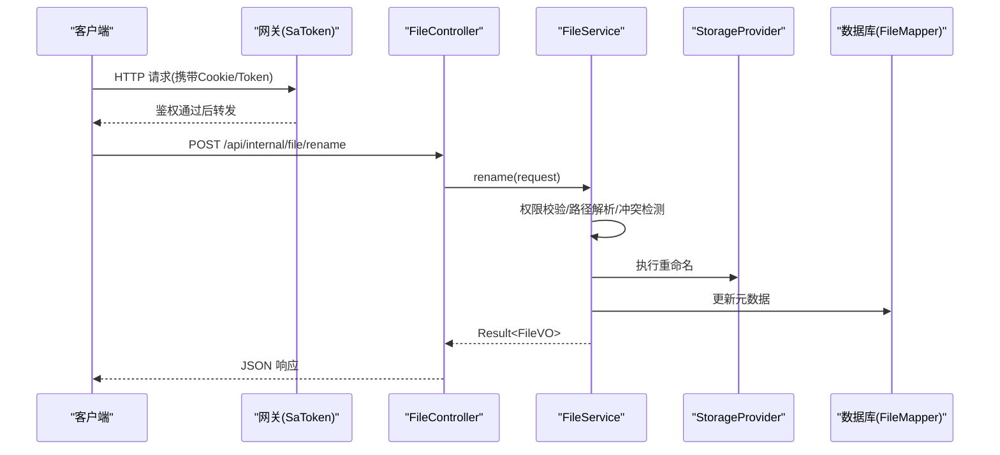
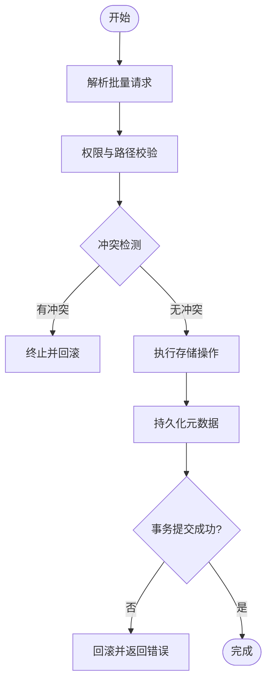
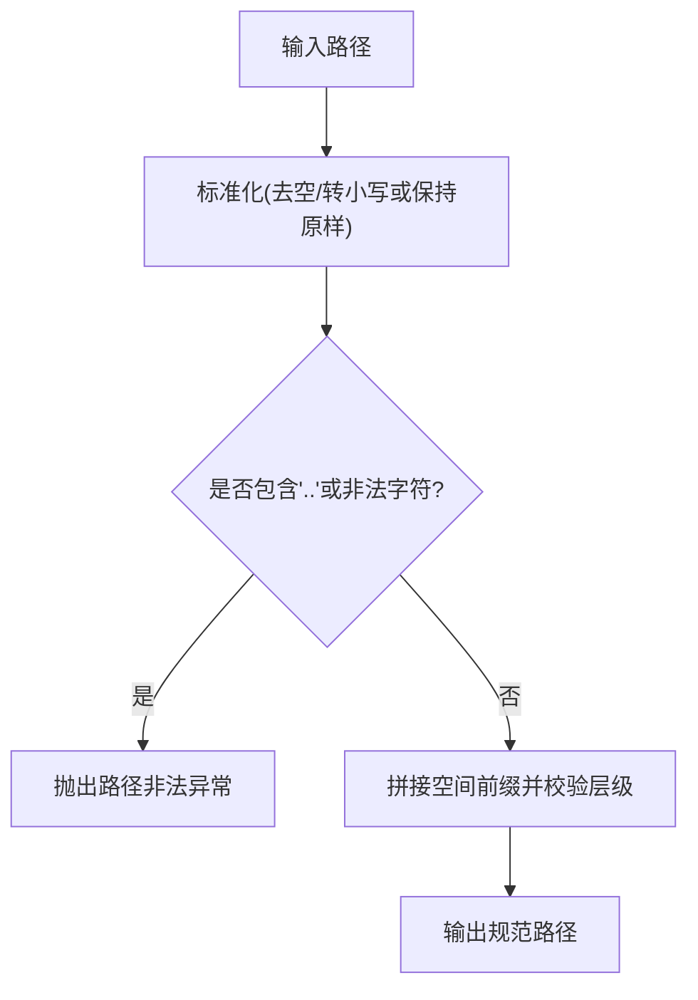
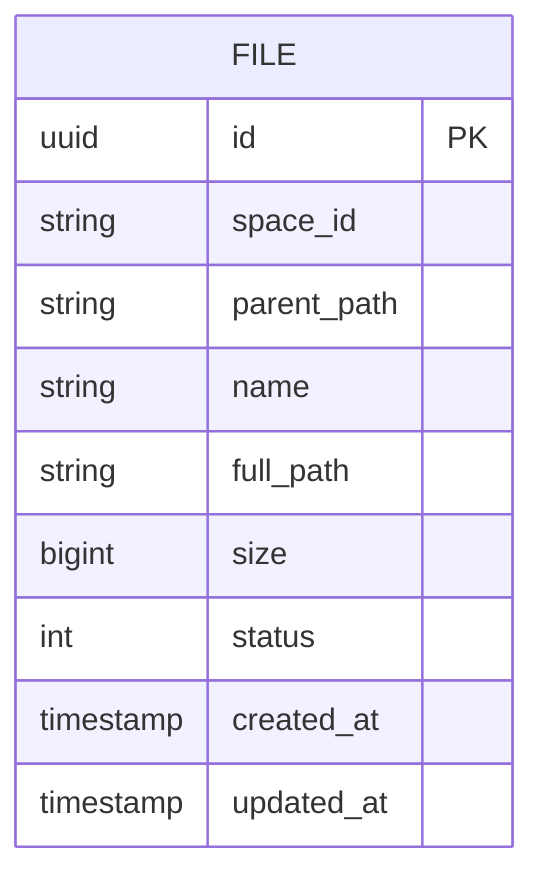
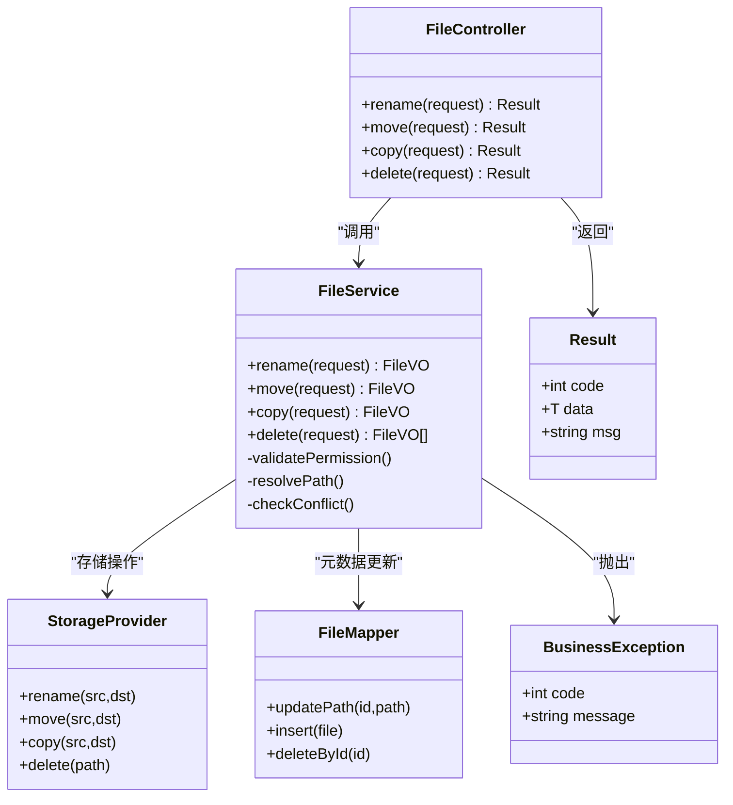

# 文件操作接口

<cite>
**本文档引用的文件**   
- [zxyz-file-service/src/main/java/uno/acloud/file/controller/FileController.java](file://ZXYZdatabaseBack/zxyz-file-service/src/main/java/uno/acloud/file/controller/FileController.java)
- [zxyz-file-service/src/main/java/uno/acloud/file/service/FileService.java](file://ZXYZdatabaseBack/zxyz-file-service/src/main/java/uno/acloud/file/service/FileService.java)
- [zxyz-file-service/src/main/java/uno/acloud/file/dto/RenameFileRequest.java](file://ZXYZdatabaseBack/zxyz-file-service/src/main/java/uno/acloud/file/dto/RenameFileRequest.java)
- [zxyz-file-service/src/main/java/uno/acloud/file/dto/MoveFileRequest.java](file://ZXYZdatabaseBack/zxyz-file-service/src/main/java/uno/acloud/file/dto/MoveFileRequest.java)
- [zxyz-file-service/src/main/java/uno/acloud/file/dto/CopyFileRequest.java](file://ZXYZdatabaseBack/zxyz-file-service/src/main/java/uno/acloud/file/dto/CopyFileRequest.java)
- [zXYZdatabaseBack/zxyz-file-service/src/main/java/uno/acloud/file/dto/DeleteFileRequest.java](file://ZXYZdatabaseBack/zxyz-file-service/src/main/java/uno/acloud/file/dto/DeleteFileRequest.java)
- [zxyz-file-service/src/main/java/uno/acloud/file/vo/FileVO.java](file://ZXYZdatabaseBack/zxyz-file-service/src/main/java/uno/acloud/file/vo/FileVO.java)
- [zxyz-common/src/main/java/uno/acloud/common/web/Result.java](file://ZXYZdatabaseBack/zxyz-common/src/main/java/uno/acloud/common/web/Result.java)
- [zxyz-common/src/main/java/uno/acloud/common/exception/BusinessException.java](file://ZXYZdatabaseBack/zxyz-common/src/main/java/uno/acloud/common/exception/BusinessException.java)
- [zxyz-file-service/src/main/java/uno/acloud/file/storage/StorageProvider.java](file://ZXYZdatabaseBack/zxyz-file-service/src/main/java/uno/acloud/file/storage/StorageProvider.java)
- [zxyz-file-service/src/main/java/uno/acloud/file/mapper/FileMapper.java](file://ZXYZdatabaseBack/zxyz-file-service/src/main/java/uno/acloud/file/mapper/FileMapper.java)
- [zxyz-file-service/src/main/resources/db/migration/V1__init_file_schema.sql](file://ZXYZdatabaseBack/zxyz-file-service/src/main/resources/db/migration/V1__init_file_schema.sql)
</cite>

## 目录
1. [简介](#简介)
2. [项目结构](#项目结构)
3. [核心组件](#核心组件)
4. [架构总览](#架构总览)
5. [详细组件分析](#详细组件分析)
6. [依赖分析](#依赖分析)
7. [性能考虑](#性能考虑)
8. [故障排查指南](#故障排查指南)
9. [结论](#结论)
10. [附录](#附录)

## 简介
本文件为 ZXYZ 项目的“文件操作 RESTful API”接口文档，覆盖以下能力：
- 文件重命名、移动、复制、删除
- 批量操作与事务处理、回滚机制
- 路径解析规则、权限验证机制、冲突检测逻辑
- 完整请求/响应示例与错误处理说明（路径冲突、权限不足、文件被占用等）

该文档面向后端开发者、前端集成方与运维人员，既提供高层架构概览，也给出代码级实现要点与调用时序。

## 项目结构
文件操作相关能力集中在 zxyz-file-service 模块中，采用传统分层（controller → service → mapper → entity），并通过 StorageProvider 抽象对接底层存储；通用返回体与异常类型位于 zxyz-common。

图表来源
- [zxyz-file-service/src/main/java/uno/acloud/file/controller/FileController.java](file://ZXYZdatabaseBack/zxyz-file-service/src/main/java/uno/acloud/file/controller/FileController.java)
- [zxyz-file-service/src/main/java/uno/acloud/file/service/FileService.java](file://ZXYZdatabaseBack/zxyz-file-service/src/main/java/uno/acloud/file/service/FileService.java)
- [zxyz-file-service/src/main/java/uno/acloud/file/mapper/FileMapper.java](file://ZXYZdatabaseBack/zxyz-file-service/src/main/java/uno/acloud/file/mapper/FileMapper.java)
- [zxyz-file-service/src/main/java/uno/acloud/file/storage/StorageProvider.java](file://ZXYZdatabaseBack/zxyz-file-service/src/main/java/uno/acloud/file/storage/StorageProvider.java)
- [zxyz-common/src/main/java/uno/acloud/common/web/Result.java](file://ZXYZdatabaseBack/zxyz-common/src/main/java/uno/acloud/common/web/Result.java)
- [zxyz-common/src/main/java/uno/acloud/common/exception/BusinessException.java](file://ZXYZdatabaseBack/zxyz-common/src/main/java/uno/acloud/common/exception/BusinessException.java)

章节来源
- [zxyz-file-service/src/main/java/uno/acloud/file/controller/FileController.java](file://ZXYZdatabaseBack/zxyz-file-service/src/main/java/uno/acloud/file/controller/FileController.java)
- [zxyz-file-service/src/main/java/uno/acloud/file/service/FileService.java](file://ZXYZdatabaseBack/zxyz-file-service/src/main/java/uno/acloud/file/service/FileService.java)
- [zxyz-common/src/main/java/uno/acloud/common/web/Result.java](file://ZXYZdatabaseBack/zxyz-common/src/main/java/uno/acloud/common/web/Result.java)

## 核心组件
- FileController：暴露 REST 端点，负责参数校验、鉴权上下文注入、统一响应封装。
- FileService：编排文件重命名、移动、复制、删除及批量操作；协调元数据更新与存储层操作；实现冲突检测与事务边界。
- StorageProvider：存储抽象接口，屏蔽不同后端（本地磁盘、对象存储等）差异。
- FileMapper：文件元数据持久化访问。
- Result<T>：统一响应包装，code=1 表示成功。
- BusinessException：业务异常基类，用于权限不足、路径冲突、文件被占用等场景。

章节来源
- [zxyz-file-service/src/main/java/uno/acloud/file/controller/FileController.java](file://ZXYZdatabaseBack/zxyz-file-service/src/main/java/uno/acloud/file/controller/FileController.java)
- [zxyz-file-service/src/main/java/uno/acloud/file/service/FileService.java](file://ZXYZdatabaseBack/zxyz-file-service/src/main/java/uno/acloud/file/service/FileService.java)
- [zxyz-file-service/src/main/java/uno/acloud/file/storage/StorageProvider.java](file://ZXYZdatabaseBack/zxyz-file-service/src/main/java/uno/acloud/file/storage/StorageProvider.java)
- [zxyz-file-service/src/main/java/uno/acloud/file/mapper/FileMapper.java](file://ZXYZdatabaseBack/zxyz-file-service/src/main/java/uno/acloud/file/mapper/FileMapper.java)
- [zxyz-common/src/main/java/uno/acloud/common/web/Result.java](file://ZXYZdatabaseBack/zxyz-common/src/main/java/uno/acloud/common/web/Result.java)
- [zxyz-common/src/main/java/uno/acloud/common/exception/BusinessException.java](file://ZXYZdatabaseBack/zxyz-common/src/main/java/uno/acloud/common/exception/BusinessException.java)

## 架构总览
文件操作的典型调用链：客户端通过网关进入 FileController，控制器将请求委托给 FileService；服务层进行权限校验、路径解析、冲突检测，再调用 StorageProvider 执行实际存储操作，并同步更新元数据（FileMapper）。所有对外响应统一使用 Result 包装。

图表来源
- [zxyz-file-service/src/main/java/uno/acloud/file/controller/FileController.java](file://ZXYZdatabaseBack/zxyz-file-service/src/main/java/uno/acloud/file/controller/FileController.java)
- [zxyz-file-service/src/main/java/uno/acloud/file/service/FileService.java](file://ZXYZdatabaseBack/zxyz-file-service/src/main/java/uno/acloud/file/service/FileService.java)
- [zxyz-file-service/src/main/java/uno/acloud/file/storage/StorageProvider.java](file://ZXYZdatabaseBack/zxyz-file-service/src/main/java/uno/acloud/file/storage/StorageProvider.java)
- [zxyz-file-service/src/main/java/uno/acloud/file/mapper/FileMapper.java](file://ZXYZdatabaseBack/zxyz-file-service/src/main/java/uno/acloud/file/mapper/FileMapper.java)

## 详细组件分析

### 文件重命名接口
- 端点：POST /api/internal/file/rename
- 入参：RenameFileRequest（包含原路径、新名称或新路径、目标空间/团队标识等）
- 行为：
  - 权限校验：当前用户对源文件具备写权限
  - 路径解析：规范化路径、校验层级合法性、避免穿越根目录
  - 冲突检测：目标路径是否已存在同名文件或目录
  - 存储操作：调用 StorageProvider.rename
  - 元数据更新：更新文件名/路径字段
  - 事务：在单条记录更新范围内保证一致性
- 返回：Result<FileVO>

请求示例
- 请求体：{ "sourcePath": "/teamA/projectX/doc.txt", "newName": "doc_v2.txt", "spaceId": "s123" }
- 成功响应：{ "code": 1, "data": { "id": "f1", "path": "/teamA/projectX/doc_v2.txt", ... }, "msg": "success" }
- 失败响应：{ "code": 403, "msg": "权限不足" } 或 { "code": 409, "msg": "目标路径已存在" }

章节来源
- [zxyz-file-service/src/main/java/uno/acloud/file/controller/FileController.java](file://ZXYZdatabaseBack/zxyz-file-service/src/main/java/uno/acloud/file/controller/FileController.java)
- [zxyz-file-service/src/main/java/uno/acloud/file/dto/RenameFileRequest.java](file://ZXYZdatabaseBack/zxyz-file-service/src/main/java/uno/acloud/file/dto/RenameFileRequest.java)
- [zxyz-file-service/src/main/java/uno/acloud/file/service/FileService.java](file://ZXYZdatabaseBack/zxyz-file-service/src/main/java/uno/acloud/file/service/FileService.java)
- [zxyz-file-service/src/main/java/uno/acloud/file/storage/StorageProvider.java](file://ZXYZdatabaseBack/zxyz-file-service/src/main/java/uno/acloud/file/storage/StorageProvider.java)
- [zxyz-common/src/main/java/uno/acloud/common/web/Result.java](file://ZXYZdatabaseBack/zxyz-common/src/main/java/uno/acloud/common/web/Result.java)

### 文件移动接口
- 端点：POST /api/internal/file/move
- 入参：MoveFileRequest（源路径、目标目录、是否允许覆盖等）
- 行为：
  - 权限校验：源文件写权限 + 目标目录写权限
  - 路径解析：目标目录必须有效且可写
  - 冲突检测：目标目录下是否存在同名文件（根据策略决定覆盖或拒绝）
  - 存储操作：StorageProvider.move
  - 元数据更新：更新 path 字段
  - 事务：原子性保证（移动+元数据更新在同一事务）
- 返回：Result<FileVO>

请求示例
- 请求体：{ "sourcePath": "/teamA/projectX/doc.txt", "targetDir": "/teamA/projectY/", "allowOverwrite": false }
- 成功响应：{ "code": 1, "data": { "id": "f1", "path": "/teamA/projectY/doc.txt", ... }, "msg": "success" }
- 失败响应：{ "code": 409, "msg": "目标路径已存在" }

章节来源
- [zxyz-file-service/src/main/java/uno/acloud/file/controller/FileController.java](file://ZXYZdatabaseBack/zxyz-file-service/src/main/java/uno/acloud/file/controller/FileController.java)
- [zxyz-file-service/src/main/java/uno/acloud/file/dto/MoveFileRequest.java](file://ZXYZdatabaseBack/zxyz-file-service/src/main/java/uno/acloud/file/dto/MoveFileRequest.java)
- [zxyz-file-service/src/main/java/uno/acloud/file/service/FileService.java](file://ZXYZdatabaseBack/zxyz-file-service/src/main/java/uno/acloud/file/service/FileService.java)
- [zxyz-file-service/src/main/java/uno/acloud/file/storage/StorageProvider.java](file://ZXYZdatabaseBack/zxyz-file-service/src/main/java/uno/acloud/file/storage/StorageProvider.java)
- [zxyz-common/src/main/java/uno/acloud/common/web/Result.java](file://ZXYZdatabaseBack/zxyz-common/src/main/java/uno/acloud/common/web/Result.java)

### 文件复制接口
- 端点：POST /api/internal/file/copy
- 入参：CopyFileRequest（源路径、目标目录、副本名称策略等）
- 行为：
  - 权限校验：源文件读权限 + 目标目录写权限
  - 路径解析：目标目录有效性检查
  - 冲突检测：若目标存在同名文件，按策略生成唯一名或拒绝
  - 存储操作：StorageProvider.copy
  - 元数据更新：新增一条文件记录
  - 事务：复制成功后写入元数据，失败回滚
- 返回：Result<FileVO>

请求示例
- 请求体：{ "sourcePath": "/teamA/projectX/doc.txt", "targetDir": "/teamA/projectY/", "copyStrategy": "append_index" }
- 成功响应：{ "code": 1, "data": { "id": "f2", "path": "/teamA/projectY/doc_1.txt", ... }, "msg": "success" }
- 失败响应：{ "code": 403, "msg": "权限不足" }

章节来源
- [zxyz-file-service/src/main/java/uno/acloud/file/controller/FileController.java](file://ZXYZdatabaseBack/zxyz-file-service/src/main/java/uno/acloud/file/controller/FileController.java)
- [zxyz-file-service/src/main/java/uno/acloud/file/dto/CopyFileRequest.java](file://ZXYZdatabaseBack/zxyz-file-service/src/main/java/uno/acloud/file/dto/CopyFileRequest.java)
- [zxyz-file-service/src/main/java/uno/acloud/file/service/FileService.java](file://ZXYZdatabaseBack/zxyz-file-service/src/main/java/uno/acloud/file/service/FileService.java)
- [zxyz-file-service/src/main/java/uno/acloud/file/storage/StorageProvider.java](file://ZXYZdatabaseBack/zxyz-file-service/src/main/java/uno/acloud/file/storage/StorageProvider.java)
- [zxyz-common/src/main/java/uno/acloud/common/web/Result.java](file://ZXYZdatabaseBack/zxyz-common/src/main/java/uno/acloud/common/web/Result.java)

### 文件删除接口
- 端点：POST /api/internal/file/delete
- 入参：DeleteFileRequest（路径列表、是否软删除到回收站等）
- 行为：
  - 权限校验：对每个文件具备写权限
  - 冲突检测：无（删除前需确保文件未被占用）
  - 存储操作：StorageProvider.delete（或标记软删除）
  - 元数据更新：删除或软删除记录
  - 事务：批量删除时保证全部成功或全部回滚
- 返回：Result<List<FileVO>> 或 Result<Boolean>

请求示例
- 请求体：{ "paths": ["/teamA/projectX/doc.txt", "/teamA/projectX/img.png"], "softDelete": true }
- 成功响应：{ "code": 1, "data": [ {...}, {...} ], "msg": "success" }
- 失败响应：{ "code": 403, "msg": "权限不足" } 或 { "code": 412, "msg": "文件被占用" }

章节来源
- [zxyz-file-service/src/main/java/uno/acloud/file/controller/FileController.java](file://ZXYZdatabaseBack/zxyz-file-service/src/main/java/uno/acloud/file/controller/FileController.java)
- [zxyz-file-service/src/main/java/uno/acloud/file/dto/DeleteFileRequest.java](file://ZXYZdatabaseBack/zxyz-file-service/src/main/java/uno/acloud/file/dto/DeleteFileRequest.java)
- [zxyz-file-service/src/main/java/uno/acloud/file/service/FileService.java](file://ZXYZdatabaseBack/zxyz-file-service/src/main/java/uno/acloud/file/service/FileService.java)
- [zxyz-file-service/src/main/java/uno/acloud/file/storage/StorageProvider.java](file://ZXYZdatabaseBack/zxyz-file-service/src/main/java/uno/acloud/file/storage/StorageProvider.java)
- [zxyz-common/src/main/java/uno/acloud/common/web/Result.java](file://ZXYZdatabaseBack/zxyz-common/src/main/java/uno/acloud/common/web/Result.java)

### 批量操作与事务处理
- 批量接口：支持一次性提交多个重命名/移动/复制/删除任务
- 事务边界：以批次为单位开启事务，任一失败则整体回滚
- 幂等性：建议客户端提供 idempotencyKey，服务端基于键去重
- 进度反馈：长耗时操作可通过异步任务ID轮询状态

图表来源
- [zxyz-file-service/src/main/java/uno/acloud/file/service/FileService.java](file://ZXYZdatabaseBack/zxyz-file-service/src/main/java/uno/acloud/file/service/FileService.java)
- [zxyz-file-service/src/main/java/uno/acloud/file/storage/StorageProvider.java](file://ZXYZdatabaseBack/zxyz-file-service/src/main/java/uno/acloud/file/storage/StorageProvider.java)
- [zxyz-file-service/src/main/java/uno/acloud/file/mapper/FileMapper.java](file://ZXYZdatabaseBack/zxyz-file-service/src/main/java/uno/acloud/file/mapper/FileMapper.java)

### 路径解析规则
- 规范化：去除多余分隔符、解析相对路径、禁止“..”穿越根目录
- 层级限制：最大深度、非法字符过滤
- 空间隔离：团队/项目空间前缀校验，防止越权访问其他空间
- 大小写敏感：遵循存储后端约定（通常区分大小写）

图表来源
- [zxyz-file-service/src/main/java/uno/acloud/file/service/FileService.java](file://ZXYZdatabaseBack/zxyz-file-service/src/main/java/uno/acloud/file/service/FileService.java)

### 权限验证机制
- 认证：网关层 SaToken 校验 Cookie/Token，注入用户上下文
- 授权：基于团队/项目维度的角色与资源权限模型（读/写/管理）
- 最小权限：仅授予必要权限，跨空间访问需额外校验

章节来源
- [zxyz-file-service/src/main/java/uno/acloud/file/controller/FileController.java](file://ZXYZdatabaseBack/zxyz-file-service/src/main/java/uno/acloud/file/controller/FileController.java)
- [zxyz-common/src/main/java/uno/acloud/common/exception/BusinessException.java](file://ZXYZdatabaseBack/zxyz-common/src/main/java/uno/acloud/common/exception/BusinessException.java)

### 冲突检测逻辑
- 目标存在性：检查目标路径是否已有文件或目录
- 命名策略：支持追加索引、时间戳后缀、强制覆盖等
- 并发控制：基于分布式锁或乐观锁避免竞态条件

章节来源
- [zxyz-file-service/src/main/java/uno/acloud/file/service/FileService.java](file://ZXYZdatabaseBack/zxyz-file-service/src/main/java/uno/acloud/file/service/FileService.java)

### 数据模型与关系

图表来源
- [zxyz-file-service/src/main/resources/db/migration/V1__init_file_schema.sql](file://ZXYZdatabaseBack/zxyz-file-service/src/main/resources/db/migration/V1__init_file_schema.sql)

## 依赖分析
- FileController 依赖 FileService 与 Result
- FileService 依赖 StorageProvider、FileMapper、权限校验工具
- StorageProvider 为外部存储抽象，具体实现可替换
- 统一异常 BusinessException 贯穿各层

图表来源
- [zxyz-file-service/src/main/java/uno/acloud/file/controller/FileController.java](file://ZXYZdatabaseBack/zxyz-file-service/src/main/java/uno/acloud/file/controller/FileController.java)
- [zxyz-file-service/src/main/java/uno/acloud/file/service/FileService.java](file://ZXYZdatabaseBack/zxyz-file-service/src/main/java/uno/acloud/file/service/FileService.java)
- [zxyz-file-service/src/main/java/uno/acloud/file/storage/StorageProvider.java](file://ZXYZdatabaseBack/zxyz-file-service/src/main/java/uno/acloud/file/storage/StorageProvider.java)
- [zxyz-file-service/src/main/java/uno/acloud/file/mapper/FileMapper.java](file://ZXYZdatabaseBack/zxyz-file-service/src/main/java/uno/acloud/file/mapper/FileMapper.java)
- [zxyz-common/src/main/java/uno/acloud/common/web/Result.java](file://ZXYZdatabaseBack/zxyz-common/src/main/java/uno/acloud/common/web/Result.java)
- [zxyz-common/src/main/java/uno/acloud/common/exception/BusinessException.java](file://ZXYZdatabaseBack/zxyz-common/src/main/java/uno/acloud/common/exception/BusinessException.java)

## 性能考虑
- 批量操作：合并多次 I/O，减少网络往返
- 事务粒度：尽量缩小事务范围，避免长事务阻塞
- 存储后端：优先使用分片/并行拷贝提升大文件复制速度
- 缓存策略：热点目录树可短期缓存，注意失效一致性
- 限流与降级：对高频操作设置速率限制，必要时降级为非实时任务

## 故障排查指南
- 权限不足（403）：检查用户角色与资源绑定、团队/项目空间归属
- 路径冲突（409）：确认目标命名策略与覆盖选项；查看是否存在同名文件
- 文件被占用（412）：检查是否有上传/下载/编辑中的会话未释放
- 事务回滚：查看日志中事务边界与异常堆栈，定位失败步骤
- 存储异常：检查 StorageProvider 实现与后端连通性

章节来源
- [zxyz-common/src/main/java/uno/acloud/common/exception/BusinessException.java](file://ZXYZdatabaseBack/zxyz-common/src/main/java/uno/acloud/common/exception/BusinessException.java)
- [zxyz-file-service/src/main/java/uno/acloud/file/service/FileService.java](file://ZXYZdatabaseBack/zxyz-file-service/src/main/java/uno/acloud/file/service/FileService.java)

## 结论
本文档系统化梳理了 ZXYZ 文件操作的 RESTful API，涵盖重命名、移动、复制、删除以及批量与事务能力，明确了路径解析、权限校验与冲突检测的关键规则。通过统一的 Result 响应与标准异常体系，便于前后端协作与问题定位。建议在集成时严格遵循权限与冲突策略，并结合批量与事务特性优化用户体验与系统稳定性。

## 附录
- 统一响应结构：Result<T>（code:1 成功，非1为错误码）
- 内部端点前缀：/api/internal/**（由网关拦截，禁止公网访问）
- 鉴权方式：Sa-Token（HttpOnly Cookie + Redis Session）