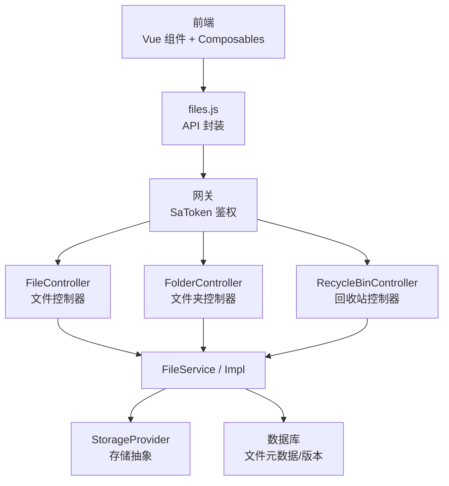
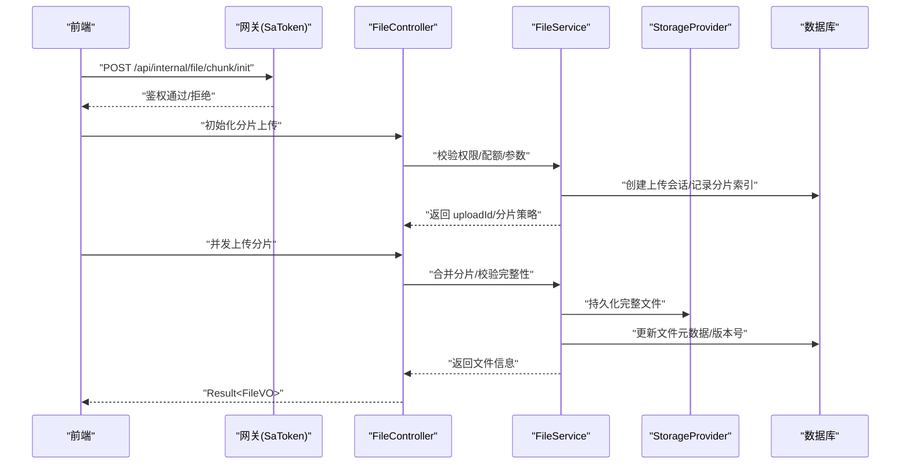
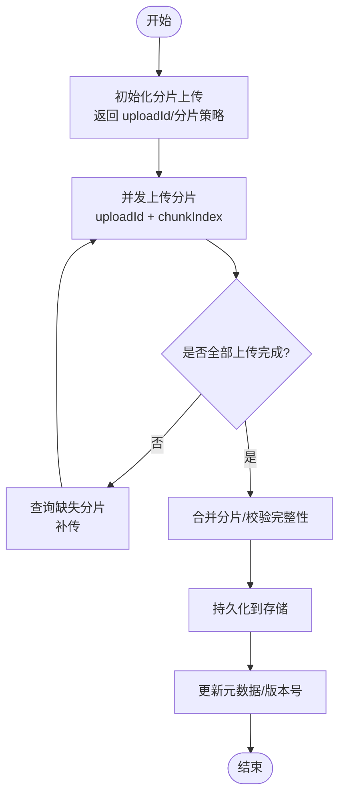
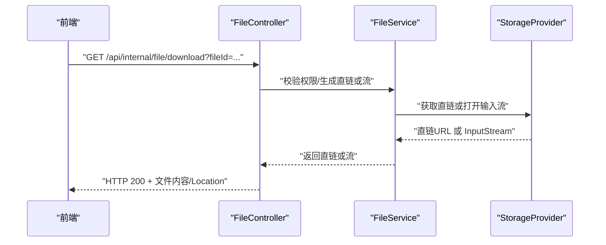
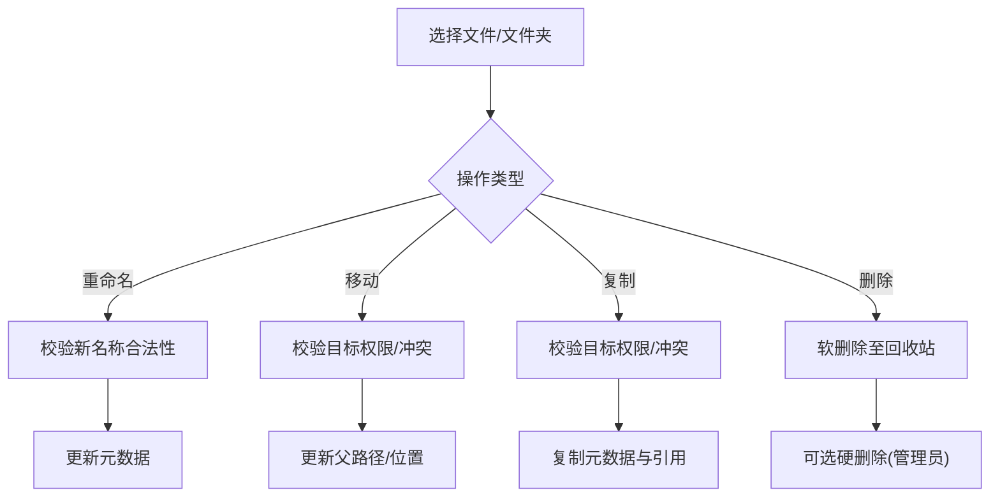
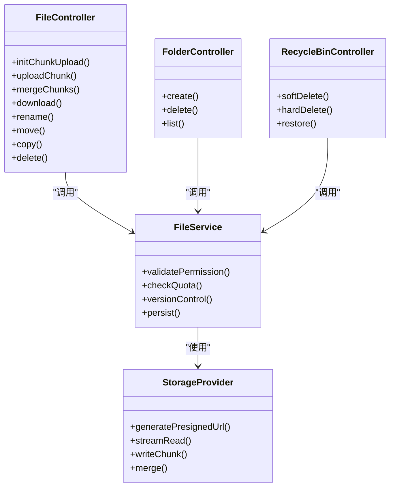

# 文件管理接口

<cite>
**本文引用的文件**
- [zxyz-file-service/src/main/java/uno/acloud/file/controller/FileController.java](file://ZXYZdatabaseBack/zxyz-file-service/src/main/java/uno/acloud/file/controller/FileController.java)
- [zxyz-file-service/src/main/java/uno/acloud/file/controller/FolderController.java](file://ZXYZdatabaseBack/zxyz-file-service/src/main/java/uno/acloud/file/controller/FolderController.java)
- [zxyz-file-service/src/main/java/uno/acloud/file/controller/RecycleBinController.java](file://ZXYZdatabaseBack/zxyz-file-service/src/main/java/uno/acloud/file/controller/RecycleBinController.java)
- [zxyz-file-service/src/main/java/uno/acloud/file/service/FileService.java](file://ZXYZdatabaseBack/zxyz-file-service/src/main/java/uno/acloud/file/service/FileService.java)
- [zxyz-file-service/src/main/java/uno/acloud/file/service/impl/FileServiceImpl.java](file://ZXYZdatabaseBack/zxyz-file-service/src/main/java/uno/acloud/file/service/impl/FileServiceImpl.java)
- [zxyz-file-service/src/main/java/uno/acloud/file/storage/StorageProvider.java](file://ZXYZdatabaseBack/zxyz-file-service/src/main/java/uno/acloud/file/storage/StorageProvider.java)
- [zxyz-file-service/src/main/java/uno/acloud/file/dto/ChunkUploadRequest.java](file://ZXYZdatabaseBack/zxyz-file-service/src/main/java/uno/acloud/file/dto/ChunkUploadRequest.java)
- [zxyz-file-service/src/main/java/uno/acloud/file/dto/ChunkUploadResponse.java](file://ZXYZdatabaseBack/zxyz-file-service/src/main/java/uno/acloud/file/dto/ChunkUploadResponse.java)
- [zxyz-file-service/src/main/java/uno/acloud/file/vo/FileVO.java](file://ZXYZdatabaseBack/zxyz-file-service/src/main/java/uno/acloud/file/vo/FileVO.java)
- [zxyz-file-service/src/main/java/uno/acloud/file/vo/FolderVO.java](file://ZXYZdatabaseBack/zxyz-file-service/src/main/java/uno/acloud/file/vo/FolderVO.java)
- [zxyz-common/src/main/java/uno/acloud/common/web/Result.java](file://ZXYZdatabaseBack/zxyz-common/src/main/java/uno/acloud/common/web/Result.java)
- [nacos-config/zxyz-file-service.yml](file://nacos-config/zxyz-file-service.yml)
- [ZXYZdatabaseFront/src/api/files.js](file://ZXYZdatabaseFront/src/api/files.js)
- [ZXYZdatabaseFront/src/composables/useFileUpload.js](file://ZXYZdatabaseFront/src/composables/useFileUpload.js)
- [ZXYZdatabaseFront/src/utils/uploadProgress.js](file://ZXYZdatabaseFront/src/utils/uploadProgress.js)
- [ZXYZdatabaseFront/src/components/FileUploader.vue](file://ZXYZdatabaseFront/src/components/FileUploader.vue)
- [ZXYZdatabaseFront/src/components/FolderUploader.vue](file://ZXYZdatabaseFront/src/components/FolderUploader.vue)
- [ZXYZdatabaseFront/src/components/MoveCopyDialog.vue](file://ZXYZdatabaseFront/src/components/MoveCopyDialog.vue)
- [ZXYZdatabaseFront/src/components/RenameFileDialog.vue](file://ZXYZdatabaseFront/src/components/RenameFileDialog.vue)
- [ZXYZdatabaseFront/src/components/RecycleBinExplorer.vue](file://ZXYZdatabaseFront/src/components/RecycleBinExplorer.vue)
- [ZXYZdatabaseFront/src/composables/useRecycleBinActions.js](file://ZXYZdatabaseFront/src/composables/useRecycleBinActions.js)
- [ZXYZdatabaseFront/src/composables/useMoveCopyAction.js](file://ZXYZdatabaseFront/src/composables/useMoveCopyAction.js)
- [ZXYZdatabaseFront/src/composables/useRenameAction.js](file://ZXYZdatabaseFront/src/composables/useRenameAction.js)
- [ZXYZdatabaseFront/src/utils/fileValidation.js](file://ZXYZdatabaseFront/src/utils/fileValidation.js)
- [ZXYZdatabaseFront/src/utils/download.js](file://ZXYZdatabaseFront/src/utils/download.js)
- [ZXYZdatabaseFront/src/composables/useFileDownload.js](file://ZXYZdatabaseFront/src/composables/useFileDownload.js)
</cite>

## 目录
1. [简介](#简介)
2. [项目结构](#项目结构)
3. [核心组件](#核心组件)
4. [架构总览](#架构总览)
5. [详细组件分析](#详细组件分析)
6. [依赖关系分析](#依赖关系分析)
7. [性能考虑](#性能考虑)
8. [故障排查指南](#故障排查指南)
9. [结论](#结论)
10. [附录](#附录)

## 简介
本文件为 ZXYZ 项目的“文件管理”RESTful API 文档，覆盖以下能力：
- 文件上传：分片上传、断点续传、并发上传
- 文件下载：直链下载、流式下载
- 文件操作：重命名、移动、复制、删除
- 文件夹管理：创建、删除、遍历
- 回收站管理：软删除、硬删除、恢复
- 业务校验：文件类型校验、大小限制、存储配额检查
- 权限验证流程与批量操作接口
- 版本控制机制说明（基于后端元数据）

该文档面向前后端开发者与集成方，提供完整的请求/响应示例、错误码说明与最佳实践。

## 项目结构
文件服务位于 zxyz-file-service 模块，采用传统分层（controller → service/impl → mapper → entity），并通过 StorageProvider 抽象对接不同存储后端。前端通过 files.js 调用后端接口，使用 FileUploader/FolderUploader 组件实现分片上传与进度展示，使用 MoveCopyDialog/RenameFileDialog/RecycleBinExplorer 等组件完成交互。

图表来源
- [zxyz-file-service/src/main/java/uno/acloud/file/controller/FileController.java](file://ZXYZdatabaseBack/zxyz-file-service/src/main/java/uno/acloud/file/controller/FileController.java)
- [zxyz-file-service/src/main/java/uno/acloud/file/controller/FolderController.java](file://ZXYZdatabaseBack/zxyz-file-service/src/main/java/uno/acloud/file/controller/FolderController.java)
- [zxyz-file-service/src/main/java/uno/acloud/file/controller/RecycleBinController.java](file://ZXYZdatabaseBack/zxyz-file-service/src/main/java/uno/acloud/file/controller/RecycleBinController.java)
- [zxyz-file-service/src/main/java/uno/acloud/file/service/FileService.java](file://ZXYZdatabaseBack/zxyz-file-service/src/main/java/uno/acloud/file/service/FileService.java)
- [zxyz-file-service/src/main/java/uno/acloud/file/storage/StorageProvider.java](file://ZXYZdatabaseBack/zxyz-file-service/src/main/java/uno/acloud/file/storage/StorageProvider.java)
- [ZXYZdatabaseFront/src/api/files.js](file://ZXYZdatabaseFront/src/api/files.js)

章节来源
- [zxyz-file-service/src/main/java/uno/acloud/file/controller/FileController.java](file://ZXYZdatabaseBack/zxyz-file-service/src/main/java/uno/acloud/file/controller/FileController.java)
- [zxyz-file-service/src/main/java/uno/acloud/file/controller/FolderController.java](file://ZXYZdatabaseBack/zxyz-file-service/src/main/java/uno/acloud/file/controller/FolderController.java)
- [zxyz-file-service/src/main/java/uno/acloud/file/controller/RecycleBinController.java](file://ZXYZdatabaseBack/zxyz-file-service/src/main/java/uno/acloud/file/controller/RecycleBinController.java)
- [zxyz-file-service/src/main/java/uno/acloud/file/service/FileService.java](file://ZXYZdatabaseBack/zxyz-file-service/src/main/java/uno/acloud/file/service/FileService.java)
- [zxyz-file-service/src/main/java/uno/acloud/file/storage/StorageProvider.java](file://ZXYZdatabaseBack/zxyz-file-service/src/main/java/uno/acloud/file/storage/StorageProvider.java)
- [ZXYZdatabaseFront/src/api/files.js](file://ZXYZdatabaseFront/src/api/files.js)

## 核心组件
- FileController：文件上传、下载、重命名、移动、复制、删除等入口
- FolderController：文件夹创建、删除、遍历列表
- RecycleBinController：回收站软删除、硬删除、恢复
- FileService/Impl：业务编排、权限校验、配额检查、版本控制、事务边界
- StorageProvider：统一存储抽象（直链生成、流式读取、分片写入）
- DTO/VO：ChunkUploadRequest/ChunkUploadResponse、FileVO、FolderVO
- Result<T>：统一响应体

章节来源
- [zxyz-file-service/src/main/java/uno/acloud/file/controller/FileController.java](file://ZXYZdatabaseBack/zxyz-file-service/src/main/java/uno/acloud/file/controller/FileController.java)
- [zxyz-file-service/src/main/java/uno/acloud/file/controller/FolderController.java](file://ZXYZdatabaseBack/zxyz-file-service/src/main/java/uno/acloud/file/controller/FolderController.java)
- [zxyz-file-service/src/main/java/uno/acloud/file/controller/RecycleBinController.java](file://ZXYZdatabaseBack/zxyz-file-service/src/main/java/uno/acloud/file/controller/RecycleBinController.java)
- [zxyz-file-service/src/main/java/uno/acloud/file/service/FileService.java](file://ZXYZdatabaseBack/zxyz-file-service/src/main/java/uno/acloud/file/service/FileService.java)
- [zxyz-file-service/src/main/java/uno/acloud/file/storage/StorageProvider.java](file://ZXYZdatabaseBack/zxyz-file-service/src/main/java/uno/acloud/file/storage/StorageProvider.java)
- [zxyz-file-service/src/main/java/uno/acloud/file/dto/ChunkUploadRequest.java](file://ZXYZdatabaseBack/zxyz-file-service/src/main/java/uno/acloud/file/dto/ChunkUploadRequest.java)
- [zxyz-file-service/src/main/java/uno/acloud/file/dto/ChunkUploadResponse.java](file://ZXYZdatabaseBack/zxyz-file-service/src/main/java/uno/acloud/file/dto/ChunkUploadResponse.java)
- [zxyz-file-service/src/main/java/uno/acloud/file/vo/FileVO.java](file://ZXYZdatabaseBack/zxyz-file-service/src/main/java/uno/acloud/file/vo/FileVO.java)
- [zxyz-file-service/src/main/java/uno/acloud/file/vo/FolderVO.java](file://ZXYZdatabaseBack/zxyz-file-service/src/main/java/uno/acloud/file/vo/FolderVO.java)
- [zxyz-common/src/main/java/uno/acloud/common/web/Result.java](file://ZXYZdatabaseBack/zxyz-common/src/main/java/uno/acloud/common/web/Result.java)

## 架构总览
整体调用链路：前端发起 HTTP 请求 → 网关 SaToken 鉴权 → 文件服务 Controller → Service 层进行权限/配额/版本控制 → StorageProvider 执行实际 IO → 返回统一 Result。

图表来源
- [zxyz-file-service/src/main/java/uno/acloud/file/controller/FileController.java](file://ZXYZdatabaseBack/zxyz-file-service/src/main/java/uno/acloud/file/controller/FileController.java)
- [zxyz-file-service/src/main/java/uno/acloud/file/service/FileService.java](file://ZXYZdatabaseBack/zxyz-file-service/src/main/java/uno/acloud/file/service/FileService.java)
- [zxyz-file-service/src/main/java/uno/acloud/file/storage/StorageProvider.java](file://ZXYZdatabaseBack/zxyz-file-service/src/main/java/uno/acloud/file/storage/StorageProvider.java)

## 详细组件分析

### 文件上传接口（分片上传、断点续传、并发上传）
- 初始化分片上传：返回 uploadId、分片大小、最大并发数、过期时间
- 上传分片：支持并发上传，服务端按 uploadId+chunkIndex 去重幂等
- 合并分片：校验所有分片完整性后合并，生成最终文件并落盘
- 断点续传：客户端可查询已上传分片集合，仅补传缺失分片

图表来源
- [zxyz-file-service/src/main/java/uno/acloud/file/controller/FileController.java](file://ZXYZdatabaseBack/zxyz-file-service/src/main/java/uno/acloud/file/controller/FileController.java)
- [zxyz-file-service/src/main/java/uno/acloud/file/service/FileService.java](file://ZXYZdatabaseBack/zxyz-file-service/src/main/java/uno/acloud/file/service/FileService.java)
- [zxyz-file-service/src/main/java/uno/acloud/file/dto/ChunkUploadRequest.java](file://ZXYZdatabaseBack/zxyz-file-service/src/main/java/uno/acloud/file/dto/ChunkUploadRequest.java)
- [zxyz-file-service/src/main/java/uno/acloud/file/dto/ChunkUploadResponse.java](file://ZXYZdatabaseBack/zxyz-file-service/src/main/java/uno/acloud/file/dto/ChunkUploadResponse.java)

章节来源
- [zxyz-file-service/src/main/java/uno/acloud/file/controller/FileController.java](file://ZXYZdatabaseBack/zxyz-file-service/src/main/java/uno/acloud/file/controller/FileController.java)
- [zxyz-file-service/src/main/java/uno/acloud/file/service/FileService.java](file://ZXYZdatabaseBack/zxyz-file-service/src/main/java/uno/acloud/file/service/FileService.java)
- [zxyz-file-service/src/main/java/uno/acloud/file/dto/ChunkUploadRequest.java](file://ZXYZdatabaseBack/zxyz-file-service/src/main/java/uno/acloud/file/dto/ChunkUploadRequest.java)
- [zxyz-file-service/src/main/java/uno/acloud/file/dto/ChunkUploadResponse.java](file://ZXYZdatabaseBack/zxyz-file-service/src/main/java/uno/acloud/file/dto/ChunkUploadResponse.java)
- [ZXYZdatabaseFront/src/components/FileUploader.vue](file://ZXYZdatabaseFront/src/components/FileUploader.vue)
- [ZXYZdatabaseFront/src/components/FolderUploader.vue](file://ZXYZdatabaseFront/src/components/FolderUploader.vue)
- [ZXYZdatabaseFront/src/composables/useFileUpload.js](file://ZXYZdatabaseFront/src/composables/useFileUpload.js)
- [ZXYZdatabaseFront/src/utils/uploadProgress.js](file://ZXYZdatabaseFront/src/utils/uploadProgress.js)

### 文件下载接口（直链下载、流式下载）
- 直链下载：服务端生成临时直链（带签名/过期），浏览器直接下载
- 流式下载：服务端以流式方式输出，适合大文件或需要鉴权的场景

图表来源
- [zxyz-file-service/src/main/java/uno/acloud/file/controller/FileController.java](file://ZXYZdatabaseBack/zxyz-file-service/src/main/java/uno/acloud/file/controller/FileController.java)
- [zxyz-file-service/src/main/java/uno/acloud/file/storage/StorageProvider.java](file://ZXYZdatabaseBack/zxyz-file-service/src/main/java/uno/acloud/file/storage/StorageProvider.java)

章节来源
- [zxyz-file-service/src/main/java/uno/acloud/file/controller/FileController.java](file://ZXYZdatabaseBack/zxyz-file-service/src/main/java/uno/acloud/file/controller/FileController.java)
- [ZXYZdatabaseFront/src/utils/download.js](file://ZXYZdatabaseFront/src/utils/download.js)
- [ZXYZdatabaseFront/src/composables/useFileDownload.js](file://ZXYZdatabaseFront/src/composables/useFileDownload.js)

### 文件操作接口（重命名、移动、复制、删除）
- 重命名：修改文件名，保留路径与版本历史
- 移动/复制：在同一空间内移动或复制到目标文件夹
- 删除：软删除进入回收站；硬删除彻底清除

图表来源
- [zxyz-file-service/src/main/java/uno/acloud/file/controller/FileController.java](file://ZXYZdatabaseBack/zxyz-file-service/src/main/java/uno/acloud/file/controller/FileController.java)
- [zxyz-file-service/src/main/java/uno/acloud/file/service/FileService.java](file://ZXYZdatabaseBack/zxyz-file-service/src/main/java/uno/acloud/file/service/FileService.java)

章节来源
- [zxyz-file-service/src/main/java/uno/acloud/file/controller/FileController.java](file://ZXYZdatabaseBack/zxyz-file-service/src/main/java/uno/acloud/file/controller/FileController.java)
- [ZXYZdatabaseFront/src/components/MoveCopyDialog.vue](file://ZXYZdatabaseFront/src/components/MoveCopyDialog.vue)
- [ZXYZdatabaseFront/src/components/RenameFileDialog.vue](file://ZXYZdatabaseFront/src/components/RenameFileDialog.vue)
- [ZXYZdatabaseFront/src/composables/useMoveCopyAction.js](file://ZXYZdatabaseFront/src/composables/useMoveCopyAction.js)
- [ZXYZdatabaseFront/src/composables/useRenameAction.js](file://ZXYZdatabaseFront/src/composables/useRenameAction.js)

### 文件夹管理接口（创建、删除、遍历）
- 创建：在指定父目录下新建文件夹
- 删除：删除空文件夹或级联删除（需权限）
- 遍历：分页列出子项（文件/文件夹），支持排序与过滤

章节来源
- [zxyz-file-service/src/main/java/uno/acloud/file/controller/FolderController.java](file://ZXYZdatabaseBack/zxyz-file-service/src/main/java/uno/acloud/file/controller/FolderController.java)

### 回收站管理接口（软删除、硬删除、恢复）
- 软删除：将文件/文件夹标记为删除状态，进入回收站
- 硬删除：从回收站永久删除，释放存储空间
- 恢复：从回收站恢复到原路径或指定路径

章节来源
- [zxyz-file-service/src/main/java/uno/acloud/file/controller/RecycleBinController.java](file://ZXYZdatabaseBack/zxyz-file-service/src/main/java/uno/acloud/file/controller/RecycleBinController.java)
- [ZXYZdatabaseFront/src/components/RecycleBinExplorer.vue](file://ZXYZdatabaseFront/src/components/RecycleBinExplorer.vue)
- [ZXYZdatabaseFront/src/composables/useRecycleBinActions.js](file://ZXYZdatabaseFront/src/composables/useRecycleBinActions.js)

### 分片上传协议与断点续传
- 协议要点：
  - 初始化阶段返回 uploadId、分片大小、最大并发、过期时间
  - 分片上传使用 uploadId + chunkIndex 作为唯一键，保证幂等
  - 合并阶段校验分片数量与哈希，失败回滚
- 断点续传：
  - 客户端保存 uploadId 与已上传分片集合
  - 服务端提供“查询已上传分片”接口，客户端据此补传

章节来源
- [zxyz-file-service/src/main/java/uno/acloud/file/controller/FileController.java](file://ZXYZdatabaseBack/zxyz-file-service/src/main/java/uno/acloud/file/controller/FileController.java)
- [zxyz-file-service/src/main/java/uno/acloud/file/service/FileService.java](file://ZXYZdatabaseBack/zxyz-file-service/src/main/java/uno/acloud/file/service/FileService.java)
- [zxyz-file-service/src/main/java/uno/acloud/file/dto/ChunkUploadRequest.java](file://ZXYZdatabaseBack/zxyz-file-service/src/main/java/uno/acloud/file/dto/ChunkUploadRequest.java)
- [zxyz-file-service/src/main/java/uno/acloud/file/dto/ChunkUploadResponse.java](file://ZXYZdatabaseBack/zxyz-file-service/src/main/java/uno/acloud/file/dto/ChunkUploadResponse.java)
- [ZXYZdatabaseFront/src/components/FileUploader.vue](file://ZXYZdatabaseFront/src/components/FileUploader.vue)
- [ZXYZdatabaseFront/src/composables/useFileUpload.js](file://ZXYZdatabaseFront/src/composables/useFileUpload.js)

### 文件版本控制机制
- 每次成功上传/覆盖会递增版本号，保留历史版本元数据
- 支持查看版本列表与切换当前版本（由业务层决定）
- 删除文件时可选择是否清理历史版本

章节来源
- [zxyz-file-service/src/main/java/uno/acloud/file/service/FileService.java](file://ZXYZdatabaseBack/zxyz-file-service/src/main/java/uno/acloud/file/service/FileService.java)
- [zxyz-file-service/src/main/java/uno/acloud/file/vo/FileVO.java](file://ZXYZdatabaseBack/zxyz-file-service/src/main/java/uno/acloud/file/vo/FileVO.java)

### 批量操作接口
- 批量重命名、批量移动/复制、批量删除
- 建议采用异步任务模式，返回任务ID，前端轮询任务状态

章节来源
- [zxyz-file-service/src/main/java/uno/acloud/file/controller/FileController.java](file://ZXYZdatabaseBack/zxyz-file-service/src/main/java/uno/acloud/file/controller/FileController.java)
- [zxyz-file-service/src/main/java/uno/acloud/file/controller/FolderController.java](file://ZXYZdatabaseBack/zxyz-file-service/src/main/java/uno/acloud/file/controller/FolderController.java)
- [zxyz-file-service/src/main/java/uno/acloud/file/controller/RecycleBinController.java](file://ZXYZdatabaseBack/zxyz-file-service/src/main/java/uno/acloud/file/controller/RecycleBinController.java)

### 权限验证流程
- 网关层 SaToken 校验登录态与令牌
- 服务层校验用户/团队对目标资源的读写权限
- 内部端点 /api/internal/** 禁止公网访问

章节来源
- [ZXYZdatabaseFront/src/api/files.js](file://ZXYZdatabaseFront/src/api/files.js)
- [zxyz-file-service/src/main/java/uno/acloud/file/controller/FileController.java](file://ZXYZdatabaseBack/zxyz-file-service/src/main/java/uno/acloud/file/controller/FileController.java)

### 文件类型校验、大小限制、存储配额检查
- 类型校验：白名单扩展名/MIME 类型校验
- 大小限制：单文件大小上限、分片大小配置
- 配额检查：团队/用户可用空间不足时拒绝操作

章节来源
- [zxyz-file-service/src/main/java/uno/acloud/file/service/FileService.java](file://ZXYZdatabaseBack/zxyz-file-service/src/main/java/uno/acloud/file/service/FileService.java)
- [ZXYZdatabaseFront/src/utils/fileValidation.js](file://ZXYZdatabaseFront/src/utils/fileValidation.js)
- [nacos-config/zxyz-file-service.yml](file://nacos-config/zxyz-file-service.yml)

## 依赖关系分析
- Controller 依赖 Service，Service 依赖 StorageProvider 与数据库
- 前端依赖 files.js 封装的 API，组件负责交互与状态管理

图表来源
- [zxyz-file-service/src/main/java/uno/acloud/file/controller/FileController.java](file://ZXYZdatabaseBack/zxyz-file-service/src/main/java/uno/acloud/file/controller/FileController.java)
- [zxyz-file-service/src/main/java/uno/acloud/file/controller/FolderController.java](file://ZXYZdatabaseBack/zxyz-file-service/src/main/java/uno/acloud/file/controller/FolderController.java)
- [zxyz-file-service/src/main/java/uno/acloud/file/controller/RecycleBinController.java](file://ZXYZdatabaseBack/zxyz-file-service/src/main/java/uno/acloud/file/controller/RecycleBinController.java)
- [zxyz-file-service/src/main/java/uno/acloud/file/service/FileService.java](file://ZXYZdatabaseBack/zxyz-file-service/src/main/java/uno/acloud/file/service/FileService.java)
- [zxyz-file-service/src/main/java/uno/acloud/file/storage/StorageProvider.java](file://ZXYZdatabaseBack/zxyz-file-service/src/main/java/uno/acloud/file/storage/StorageProvider.java)

章节来源
- [zxyz-file-service/src/main/java/uno/acloud/file/controller/FileController.java](file://ZXYZdatabaseBack/zxyz-file-service/src/main/java/uno/acloud/file/controller/FileController.java)
- [zxyz-file-service/src/main/java/uno/acloud/file/controller/FolderController.java](file://ZXYZdatabaseBack/zxyz-file-service/src/main/java/uno/acloud/file/controller/FolderController.java)
- [zxyz-file-service/src/main/java/uno/acloud/file/controller/RecycleBinController.java](file://ZXYZdatabaseBack/zxyz-file-service/src/main/java/uno/acloud/file/controller/RecycleBinController.java)
- [zxyz-file-service/src/main/java/uno/acloud/file/service/FileService.java](file://ZXYZdatabaseBack/zxyz-file-service/src/main/java/uno/acloud/file/service/FileService.java)
- [zxyz-file-service/src/main/java/uno/acloud/file/storage/StorageProvider.java](file://ZXYZdatabaseBack/zxyz-file-service/src/main/java/uno/acloud/file/storage/StorageProvider.java)

## 性能考虑
- 分片并发：合理设置分片大小与并发度，避免过多连接导致拥塞
- 流式下载：大文件优先使用流式下载，减少内存占用
- 缓存直链：短期复用预签名直链，降低重复计算开销
- 幂等上传：服务端按 uploadId+chunkIndex 去重，避免重复写入
- 配额检查前置：提前检查配额，失败快速返回，减少无效IO

[本节为通用指导，不直接分析具体文件]

## 故障排查指南
- 上传失败：
  - 检查 uploadId 是否有效、分片是否齐全、哈希校验是否通过
  - 查看分片上传日志与存储后端状态
- 权限不足：
  - 确认用户/团队角色与资源权限策略
  - 检查网关鉴权与内部端点访问控制
- 存储空间不足：
  - 检查团队/用户配额与剩余空间
  - 清理回收站或历史版本释放空间
- 下载异常：
  - 直链是否过期、网络是否可达
  - 流式下载是否被代理中断

章节来源
- [zxyz-file-service/src/main/java/uno/acloud/file/controller/FileController.java](file://ZXYZdatabaseBack/zxyz-file-service/src/main/java/uno/acloud/file/controller/FileController.java)
- [zxyz-file-service/src/main/java/uno/acloud/file/service/FileService.java](file://ZXYZdatabaseBack/zxyz-file-service/src/main/java/uno/acloud/file/service/FileService.java)
- [ZXYZdatabaseFront/src/utils/fileValidation.js](file://ZXYZdatabaseFront/src/utils/fileValidation.js)

## 结论
本接口文档覆盖了 ZXYZ 文件管理的核心能力与实现细节，包括分片上传、断点续传、直链/流式下载、文件与文件夹操作、回收站管理与权限/配额校验。建议在生产环境启用限流、监控与审计，确保稳定性与可观测性。

[本节为总结，不直接分析具体文件]

## 附录

### 请求与响应示例（摘要）
- 初始化分片上传
  - 请求：POST /api/internal/file/chunk/init
  - 响应：{ code: 1, data: { uploadId, chunkSize, maxConcurrency, expireAt } }
- 上传分片
  - 请求：POST /api/internal/file/chunk/upload (multipart/form-data: uploadId, chunkIndex, file)
  - 响应：{ code: 1, data: { uploaded: true } }
- 合并分片
  - 请求：POST /api/internal/file/chunk/merge (body: { uploadId, fileName, totalChunks })
  - 响应：{ code: 1, data: FileVO }
- 直链下载
  - 请求：GET /api/internal/file/download?fileId=...
  - 响应：HTTP 200 + 文件内容 或 Location 头（直链）
- 重命名
  - 请求：PUT /api/internal/file/rename (body: { fileId, newName })
  - 响应：{ code: 1, data: FileVO }
- 移动/复制
  - 请求：POST /api/internal/file/move | /api/internal/file/copy (body: { ids, targetFolderId })
  - 响应：{ code: 1, data: { successCount, failCount } }
- 删除（软删除）
  - 请求：DELETE /api/internal/file/delete (body: { ids })
  - 响应：{ code: 1, data: { successCount, failCount } }
- 回收站硬删除
  - 请求：DELETE /api/internal/recycle-bin/hard-delete (body: { ids })
  - 响应：{ code: 1, data: { successCount, failCount } }
- 回收站恢复
  - 请求：POST /api/internal/recycle-bin/restore (body: { ids, targetFolderId? })
  - 响应：{ code: 1, data: { successCount, failCount } }

章节来源
- [zxyz-file-service/src/main/java/uno/acloud/file/controller/FileController.java](file://ZXYZdatabaseBack/zxyz-file-service/src/main/java/uno/acloud/file/controller/FileController.java)
- [zxyz-file-service/src/main/java/uno/acloud/file/controller/RecycleBinController.java](file://ZXYZdatabaseBack/zxyz-file-service/src/main/java/uno/acloud/file/controller/RecycleBinController.java)
- [zxyz-common/src/main/java/uno/acloud/common/web/Result.java](file://ZXYZdatabaseBack/zxyz-common/src/main/java/uno/acloud/common/web/Result.java)

### 错误码与异常场景
- 401/403：未登录或权限不足
- 400：参数非法（如分片索引越界、文件名非法）
- 413：超过文件大小限制
- 429：上传频率限制
- 500：服务器内部错误（存储不可用、合并失败）
- 业务错误：存储空间不足、分片缺失、直链过期

章节来源
- [zxyz-file-service/src/main/java/uno/acloud/file/service/FileService.java](file://ZXYZdatabaseBack/zxyz-file-service/src/main/java/uno/acloud/file/service/FileService.java)
- [ZXYZdatabaseFront/src/utils/error.js](file://ZXYZdatabaseFront/src/utils/error.js)

### 前端交互参考
- 分片上传组件：FileUploader.vue、FolderUploader.vue
- 下载工具：download.js、useFileDownload.js
- 操作对话框：MoveCopyDialog.vue、RenameFileDialog.vue
- 回收站：RecycleBinExplorer.vue、useRecycleBinActions.js

章节来源
- [ZXYZdatabaseFront/src/components/FileUploader.vue](file://ZXYZdatabaseFront/src/components/FileUploader.vue)
- [ZXYZdatabaseFront/src/components/FolderUploader.vue](file://ZXYZdatabaseFront/src/components/FolderUploader.vue)
- [ZXYZdatabaseFront/src/utils/download.js](file://ZXYZdatabaseFront/src/utils/download.js)
- [ZXYZdatabaseFront/src/composables/useFileDownload.js](file://ZXYZdatabaseFront/src/composables/useFileDownload.js)
- [ZXYZdatabaseFront/src/components/MoveCopyDialog.vue](file://ZXYZdatabaseFront/src/components/MoveCopyDialog.vue)
- [ZXYZdatabaseFront/src/components/RenameFileDialog.vue](file://ZXYZdatabaseFront/src/components/RenameFileDialog.vue)
- [ZXYZdatabaseFront/src/components/RecycleBinExplorer.vue](file://ZXYZdatabaseFront/src/components/RecycleBinExplorer.vue)
- [ZXYZdatabaseFront/src/composables/useRecycleBinActions.js](file://ZXYZdatabaseFront/src/composables/useRecycleBinActions.js)