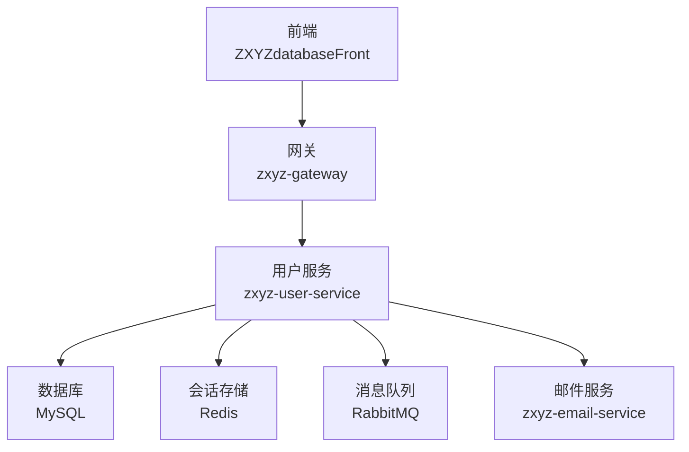
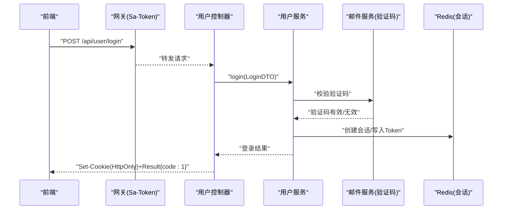
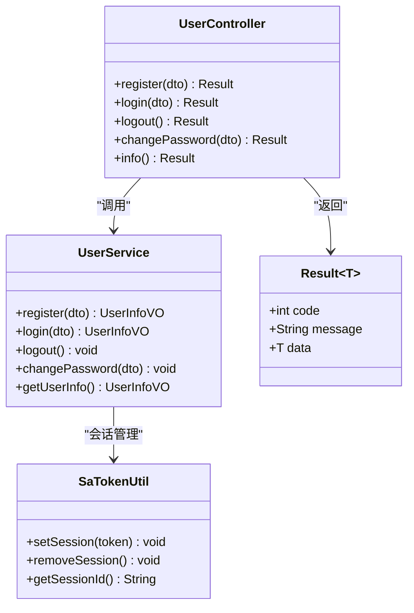
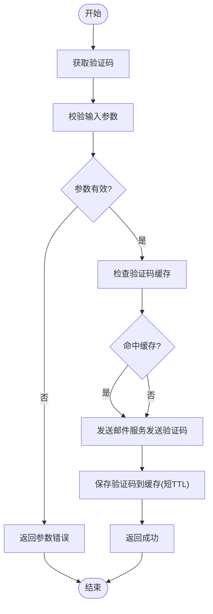

# 用户认证接口

<cite>
**本文引用的文件**   
- [zxyz-user-service/src/main/java/uno/acloud/user/controller/UserController.java](file://ZXYZdatabaseBack/zxyz-user-service/src/main/java/uno/acloud/user/controller/UserController.java)
- [zxyz-user-service/src/main/java/uno/acloud/user/service/UserService.java](file://ZXYZdatabaseBack/zxyz-user-service/src/main/java/uno/acloud/user/service/UserService.java)
- [zxyz-user-service/src/main/java/uno/acloud/user/dto/RegisterDTO.java](file://ZXYZdatabaseBack/zxyz-user-service/src/main/java/uno/acloud/user/dto/RegisterDTO.java)
- [zxyz-user-service/src/main/java/uno/acloud/user/dto/LoginDTO.java](file://ZXYZdatabaseBack/zxyz-user-service/src/main/java/uno/acloud/user/dto/LoginDTO.java)
- [zxyz-user-service/src/main/java/uno/acloud/user/dto/PasswordChangeDTO.java](file://ZXYZdatabaseBack/zxyz-user-service/src/main/java/uno/acloud/user/dto/PasswordChangeDTO.java)
- [zxyz-user-service/src/main/java/uno/acloud/user/vo/UserInfoVO.java](file://ZXYZdatabaseBack/zxyz-user-service/src/main/java/uno/acloud/user/vo/UserInfoVO.java)
- [zxyz-common/src/main/java/uno/acloud/common/web/Result.java](file://ZXYZdatabaseBack/zxyz-common/src/main/java/uno/acloud/common/web/Result.java)
- [zxyz-common/src/main/java/uno/acloud/satoken/SaTokenUtil.java](file://ZXYZdatabaseBack/zxyz-common/src/main/java/uno/acloud/satoken/SaTokenUtil.java)
- [zxyz-gateway/src/main/java/uno/acloud/gateway/filter/SaTokenFilterConfig.java](file://ZXYZdatabaseBack/zxyz-gateway/src/main/java/uno/acloud/gateway/filter/SaTokenFilterConfig.java)
- [nacos-config/zxyz-user-service.yml](file://nacos-config/zxyz-user-service.yml)
- [nacos-config/zxyz-static.yml](file://nacos-config/zxyz-static.yml)
- [ZXYZdatabaseFront/src/api/auth.js](file://ZXYZdatabaseFront/src/api/auth.js)
- [ZXYZdatabaseFront/src/utils/request.js](file://ZXYZdatabaseFront/src/utils/request.js)
- [ZXYZdatabaseFront/src/composables/useLoginForm.js](file://ZXYZdatabaseFront/src/composables/useLoginForm.js)
- [ZXYZdatabaseFront/src/composables/usePasswordChange.js](file://ZXYZdatabaseFront/src/composables/usePasswordChange.js)
</cite>

## 目录
1. [简介](#简介)
2. [项目结构](#项目结构)
3. [核心组件](#核心组件)
4. [架构总览](#架构总览)
5. [详细接口说明](#详细接口说明)
6. [依赖分析](#依赖分析)
7. [性能考虑](#性能考虑)
8. [故障排查指南](#故障排查指南)
9. [结论](#结论)
10. [附录](#附录)

## 简介
本文件为 ZXYZ 项目的“用户认证”RESTful API 文档，覆盖以下核心能力：
- 用户注册：POST /api/user/register
- 用户登录：POST /api/user/login
- 用户登出：POST /api/user/logout
- 密码修改：POST /api/user/password/change
- 获取用户信息：GET /api/user/info

认证机制采用 Sa-Token + Redis 会话管理，通过 HttpOnly Cookie 传递 Token；验证码校验由邮件服务提供。所有接口统一返回 Result<T> 结构，code=1 表示成功。

## 项目结构
与用户认证相关的后端实现位于 zxyz-user-service 模块，网关层使用 zxyz-gateway 进行 Sa-Token 过滤与鉴权，通用响应体与工具类位于 zxyz-common，前端调用封装在 ZXYZdatabaseFront 的 api 与 utils 中。

图表来源
- [SaTokenFilterConfig.java:1-200](file://ZXYZdatabaseBack/zxyz-gateway/src/main/java/uno/acloud/gateway/filter/SaTokenFilterConfig.java#L1-L200)
- [UserController.java:1-200](file://ZXYZdatabaseBack/zxyz-user-service/src/main/java/uno/acloud/user/controller/UserController.java#L1-L200)
- [UserService.java:1-200](file://ZXYZdatabaseBack/zxyz-user-service/src/main/java/uno/acloud/user/service/UserService.java#L1-L200)

章节来源
- [zxyz-user-service 模块结构](file://ZXYZdatabaseBack/zxyz-user-service/pom.xml)
- [zxyz-gateway 模块结构](file://ZXYZdatabaseBack/zxyz-gateway/pom.xml)
- [zxyz-common 模块结构](file://ZXYZdatabaseBack/zxyz-common/pom.xml)

## 核心组件
- UserController：对外暴露认证相关 REST 端点，接收请求、参数校验、调用 Service 并返回统一结果。
- UserService：认证业务编排（注册、登录、登出、改密、查询用户信息），与数据层、验证码服务交互。
- DTO/VO：RegisterDTO、LoginDTO、PasswordChangeDTO 用于入参；UserInfoVO 用于出参。
- Result<T>：统一响应包装，包含 code、message、data。
- SaTokenUtil：封装 Sa-Token 操作（登录态设置、注销、会话读取）。
- SaTokenFilterConfig：网关层 Sa-Token 过滤器配置，拦截 /api/** 路径，校验会话。

章节来源
- [UserController.java:1-200](file://ZXYZdatabaseBack/zxyz-user-service/src/main/java/uno/acloud/user/controller/UserController.java#L1-L200)
- [UserService.java:1-200](file://ZXYZdatabaseBack/zxyz-user-service/src/main/java/uno/acloud/user/service/UserService.java#L1-L200)
- [Result.java:1-120](file://ZXYZdatabaseBack/zxyz-common/src/main/java/uno/acloud/common/web/Result.java#L1-L120)
- [SaTokenUtil.java:1-120](file://ZXYZdatabaseBack/zxyz-common/src/main/java/uno/acloud/satoken/SaTokenUtil.java#L1-L120)
- [SaTokenFilterConfig.java:1-200](file://ZXYZdatabaseBack/zxyz-gateway/src/main/java/uno/acloud/gateway/filter/SaTokenFilterConfig.java#L1-L200)

## 架构总览
认证流程概览（以登录为例）：
- 前端发起 POST /api/user/login，携带用户名、密码、验证码等。
- 网关 Sa-Token 过滤器放行公共端点，转发至用户服务。
- 用户服务验证验证码（调用邮件服务）、校验账号状态、生成会话 Token，写入 Redis。
- 服务端通过 Set-Cookie 下发 HttpOnly Cookie（含 Sa-Token UUID）。
- 后续请求自动携带 Cookie，网关校验会话，控制器内可读取当前登录态。

图表来源
- [SaTokenFilterConfig.java:1-200](file://ZXYZdatabaseBack/zxyz-gateway/src/main/java/uno/acloud/gateway/filter/SaTokenFilterConfig.java#L1-L200)
- [UserController.java:1-200](file://ZXYZdatabaseBack/zxyz-user-service/src/main/java/uno/acloud/user/controller/UserController.java#L1-L200)
- [UserService.java:1-200](file://ZXYZdatabaseBack/zxyz-user-service/src/main/java/uno/acloud/user/service/UserService.java#L1-L200)

## 详细接口说明

### 通用约定
- 基础路径：/api/user
- 请求头：Content-Type: application/json（除特殊说明）
- 响应体：统一 Result<T>，code=1 表示成功，其他为错误码；message 描述错误原因；data 为业务数据或空对象。
- 会话：登录后服务端通过 Set-Cookie 下发 HttpOnly Cookie（Sa-Token UUID），浏览器自动携带，无需手动设置 Authorization。

章节来源
- [Result.java:1-120](file://ZXYZdatabaseBack/zxyz-common/src/main/java/uno/acloud/common/web/Result.java#L1-L120)
- [SaTokenFilterConfig.java:1-200](file://ZXYZdatabaseBack/zxyz-gateway/src/main/java/uno/acloud/gateway/filter/SaTokenFilterConfig.java#L1-L200)

### 用户注册
- HTTP 方法：POST
- URL：/api/user/register
- 请求体（RegisterDTO）：
  - username：字符串，必填，唯一
  - password：字符串，必填，建议最小长度与复杂度限制
  - email：字符串，必填，邮箱格式
  - verifyCode：字符串，必填，邮箱验证码
  - nickname：字符串，可选
- 响应体（Result<UserInfoVO>）：
  - data：注册成功后返回用户基本信息（不含敏感字段）
- 常见错误码与处理：
  - 验证码错误：返回对应错误码，提示重新获取验证码
  - 用户名已存在：返回冲突错误码
  - 邮箱格式错误：返回参数校验错误
  - 系统异常：返回通用错误码

章节来源
- [UserController.java:1-200](file://ZXYZdatabaseBack/zxyz-user-service/src/main/java/uno/acloud/user/controller/UserController.java#L1-L200)
- [RegisterDTO.java:1-120](file://ZXYZdatabaseBack/zxyz-user-service/src/main/java/uno/acloud/user/dto/RegisterDTO.java#L1-L120)
- [UserInfoVO.java:1-120](file://ZXYZdatabaseBack/zxyz-user-service/src/main/java/uno/acloud/user/vo/UserInfoVO.java#L1-L120)

### 用户登录
- HTTP 方法：POST
- URL：/api/user/login
- 请求体（LoginDTO）：
  - username：字符串，必填
  - password：字符串，必填
  - verifyCode：字符串，必填，验证码
- 响应体（Result<UserInfoVO>）：
  - data：登录成功后返回用户基本信息
  - 同时 Set-Cookie 下发 HttpOnly Cookie（Sa-Token UUID）
- 常见错误码与处理：
  - 验证码错误：提示重新获取验证码
  - 账号不存在或密码错误：返回认证失败错误码
  - 账号锁定：返回锁定错误码，提示联系管理员或等待解锁

章节来源
- [UserController.java:1-200](file://ZXYZdatabaseBack/zxyz-user-service/src/main/java/uno/acloud/user/controller/UserController.java#L1-L200)
- [LoginDTO.java:1-120](file://ZXYZdatabaseBack/zxyz-user-service/src/main/java/uno/acloud/user/dto/LoginDTO.java#L1-L120)
- [UserInfoVO.java:1-120](file://ZXYZdatabaseBack/zxyz-user-service/src/main/java/uno/acloud/user/vo/UserInfoVO.java#L1-L120)

### 用户登出
- HTTP 方法：POST
- URL：/api/user/logout
- 请求体：无
- 响应体（Result<Void>）：
  - 清除本地会话，删除 Redis 中的会话记录
- 常见错误码与处理：
  - 未登录：返回未认证错误码
  - 会话失效：返回会话过期错误码

章节来源
- [UserController.java:1-200](file://ZXYZdatabaseBack/zxyz-user-service/src/main/java/uno/acloud/user/controller/UserController.java#L1-L200)
- [SaTokenUtil.java:1-120](file://ZXYZdatabaseBack/zxyz-common/src/main/java/uno/acloud/satoken/SaTokenUtil.java#L1-L120)

### 密码修改
- HTTP 方法：POST
- URL：/api/user/password/change
- 请求体（PasswordChangeDTO）：
  - oldPassword：字符串，必填
  - newPassword：字符串，必填，满足复杂度要求
  - confirmPassword：字符串，必填，需与 newPassword 一致
- 响应体（Result<Void>）：
  - 修改成功后返回空数据
- 常见错误码与处理：
  - 旧密码错误：返回认证失败错误码
  - 新密码不符合规则：返回参数校验错误
  - 两次输入不一致：返回参数校验错误
  - 会话失效：返回未认证错误码

章节来源
- [UserController.java:1-200](file://ZXYZdatabaseBack/zxyz-user-service/src/main/java/uno/acloud/user/controller/UserController.java#L1-L200)
- [PasswordChangeDTO.java:1-120](file://ZXYZdatabaseBack/zxyz-user-service/src/main/java/uno/acloud/user/dto/PasswordChangeDTO.java#L1-L120)

### 获取用户信息
- HTTP 方法：GET
- URL：/api/user/info
- 请求头：自动携带 HttpOnly Cookie
- 响应体（Result<UserInfoVO>）：
  - data：当前登录用户的基本信息（不包含敏感字段）
- 常见错误码与处理：
  - 未登录：返回未认证错误码
  - 会话失效：返回会话过期错误码

章节来源
- [UserController.java:1-200](file://ZXYZdatabaseBack/zxyz-user-service/src/main/java/uno/acloud/user/controller/UserController.java#L1-L200)
- [UserInfoVO.java:1-120](file://ZXYZdatabaseBack/zxyz-user-service/src/main/java/uno/acloud/user/vo/UserInfoVO.java#L1-L120)

## 依赖分析
- 网关层：SaTokenFilterConfig 对 /api/** 进行统一鉴权，内部端点 /api/internal/** 被拒绝公网访问。
- 用户服务：UserController 依赖 UserService，后者再依赖数据层与验证码服务（邮件服务）。
- 会话存储：Sa-Token 将会话持久化到 Redis，Cookie 仅携带 UUID，安全性更高。
- 前端：auth.js 封装认证相关 API 调用；request.js 统一处理请求/响应拦截；useLoginForm.js 与 usePasswordChange.js 封装表单逻辑。

图表来源
- [UserController.java:1-200](file://ZXYZdatabaseBack/zxyz-user-service/src/main/java/uno/acloud/user/controller/UserController.java#L1-L200)
- [UserService.java:1-200](file://ZXYZdatabaseBack/zxyz-user-service/src/main/java/uno/acloud/user/service/UserService.java#L1-L200)
- [SaTokenUtil.java:1-120](file://ZXYZdatabaseBack/zxyz-common/src/main/java/uno/acloud/satoken/SaTokenUtil.java#L1-L120)
- [Result.java:1-120](file://ZXYZdatabaseBack/zxyz-common/src/main/java/uno/acloud/common/web/Result.java#L1-L120)

章节来源
- [SaTokenFilterConfig.java:1-200](file://ZXYZdatabaseBack/zxyz-gateway/src/main/java/uno/acloud/gateway/filter/SaTokenFilterConfig.java#L1-L200)
- [zxyz-user-service.yml](file://nacos-config/zxyz-user-service.yml)
- [zxyz-static.yml](file://nacos-config/zxyz-static.yml)

## 性能考虑
- 验证码校验：建议缓存验证码并设置短 TTL，避免重复发送与频繁邮件服务调用。
- 会话存储：Redis 高可用与分片策略影响登录并发与稳定性。
- 密码加密：使用强哈希算法（如 BCrypt）并合理调整轮次，平衡安全与性能。
- 限流与防刷：对注册、登录、验证码接口实施速率限制，防止暴力破解与资源滥用。
- 连接池：数据库与 Redis 连接池大小根据 QPS 调优，避免瓶颈。

[本节为通用指导，不直接分析具体文件]

## 故障排查指南
- 登录失败
  - 检查验证码是否过期或错误，确认邮件服务可用性。
  - 核对用户名与密码是否正确，查看账号是否被锁定。
- 验证码错误
  - 确认验证码有效期与次数限制，检查邮件发送通道。
- 账号锁定
  - 查看后台锁定策略与解锁流程，必要时联系管理员。
- 会话失效
  - 检查 Redis 会话是否存在，确认 Cookie 是否被浏览器清理。
- 网关拦截
  - 确认请求路径未被网关拦截，内部端点不可从公网访问。

章节来源
- [SaTokenFilterConfig.java:1-200](file://ZXYZdatabaseBack/zxyz-gateway/src/main/java/uno/acloud/gateway/filter/SaTokenFilterConfig.java#L1-L200)
- [UserService.java:1-200](file://ZXYZdatabaseBack/zxyz-user-service/src/main/java/uno/acloud/user/service/UserService.java#L1-L200)

## 结论
ZXYZ 的用户认证体系基于 Sa-Token + Redis 会话管理，结合 HttpOnly Cookie 保障安全性；统一 Result 响应体简化前后端协作；验证码由邮件服务提供，确保注册与登录流程的安全性与可靠性。建议在部署时关注限流、缓存与会话策略，以提升整体性能与用户体验。

[本节为总结性内容，不直接分析具体文件]

## 附录

### 请求与响应示例（文字描述）
- 用户注册
  - 请求：POST /api/user/register，Body 包含 username、password、email、verifyCode、nickname
  - 响应：Result<UserInfoVO>，code=1 表示成功，data 为用户基本信息
- 用户登录
  - 请求：POST /api/user/login，Body 包含 username、password、verifyCode
  - 响应：Result<UserInfoVO>，code=1 表示成功，同时 Set-Cookie 下发 HttpOnly Cookie
- 用户登出
  - 请求：POST /api/user/logout
  - 响应：Result<Void>，code=1 表示成功
- 密码修改
  - 请求：POST /api/user/password/change，Body 包含 oldPassword、newPassword、confirmPassword
  - 响应：Result<Void>，code=1 表示成功
- 获取用户信息
  - 请求：GET /api/user/info，自动携带 Cookie
  - 响应：Result<UserInfoVO>，code=1 表示成功，data 为用户基本信息

章节来源
- [auth.js:1-200](file://ZXYZdatabaseFront/src/api/auth.js#L1-L200)
- [request.js:1-200](file://ZXYZdatabaseFront/src/utils/request.js#L1-L200)
- [useLoginForm.js:1-200](file://ZXYZdatabaseFront/src/composables/useLoginForm.js#L1-L200)
- [usePasswordChange.js:1-200](file://ZXYZdatabaseFront/src/composables/usePasswordChange.js#L1-L200)

### 验证码验证流程（流程图）

图表来源
- [UserService.java:1-200](file://ZXYZdatabaseBack/zxyz-user-service/src/main/java/uno/acloud/user/service/UserService.java#L1-L200)