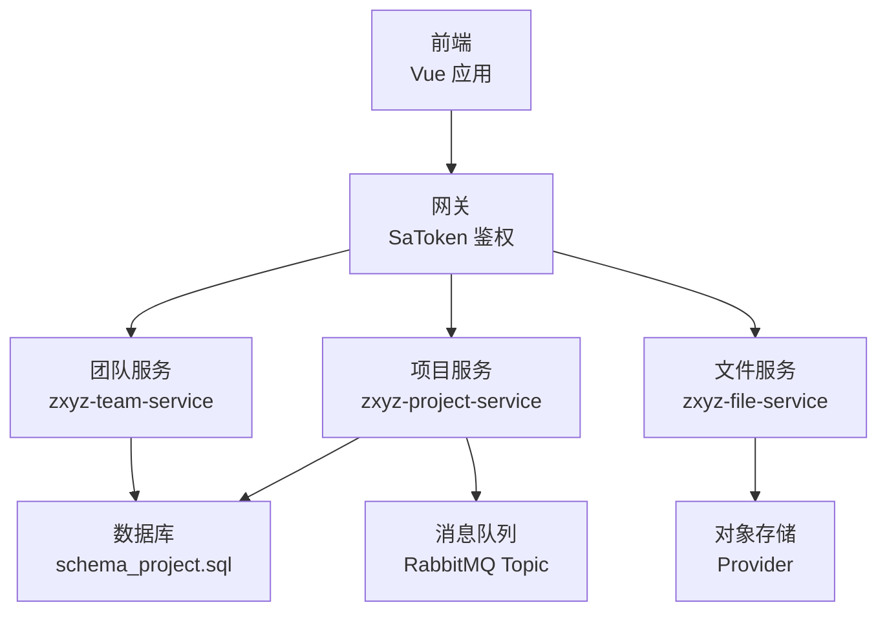
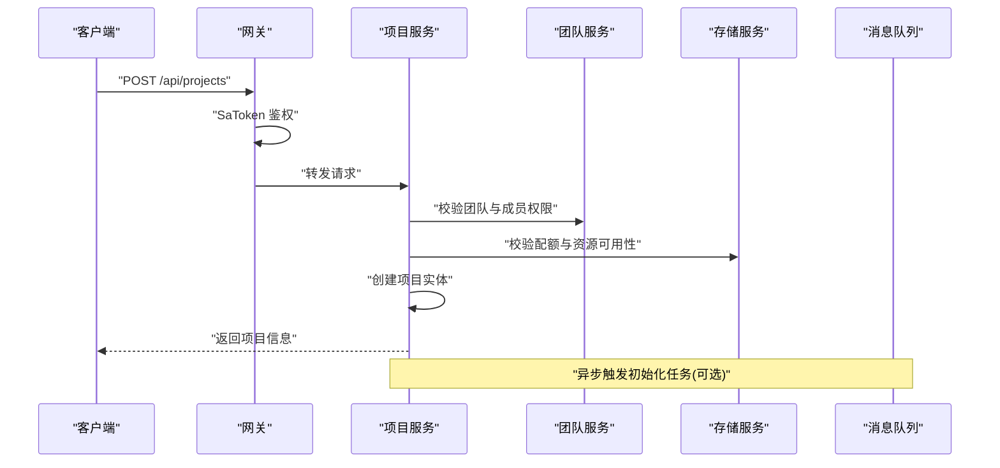
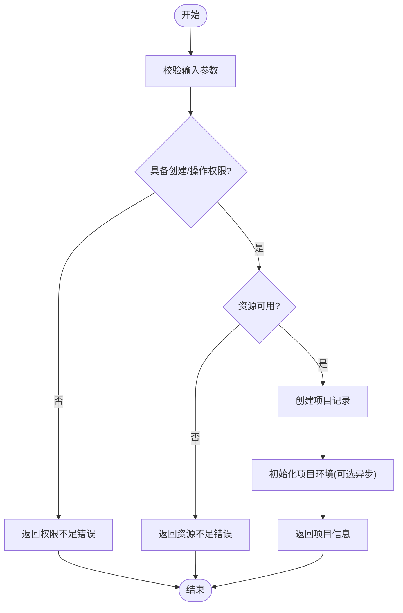
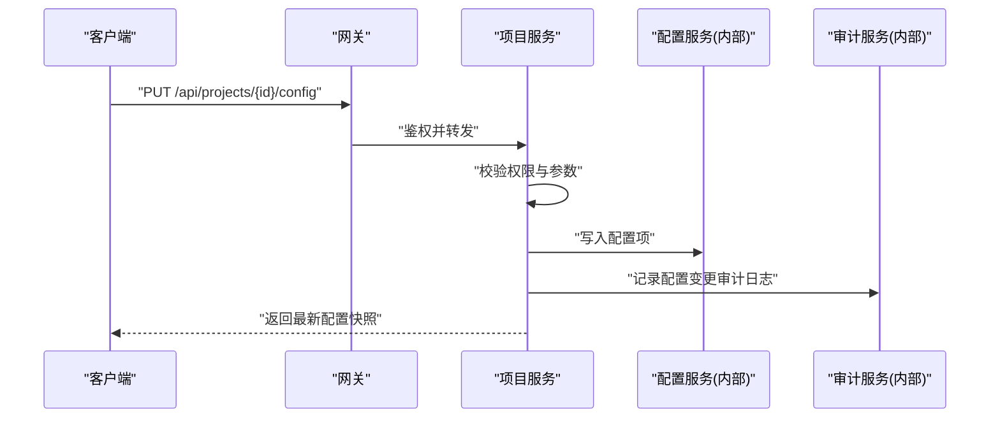
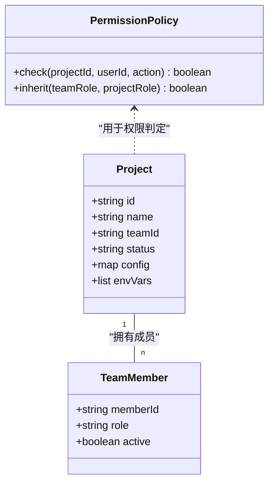
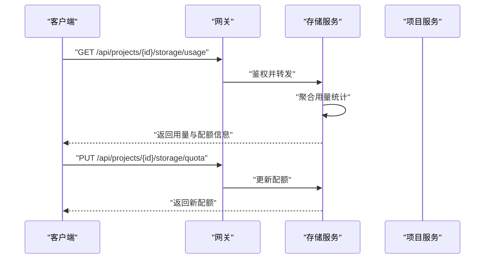
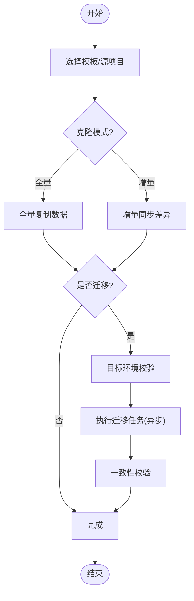
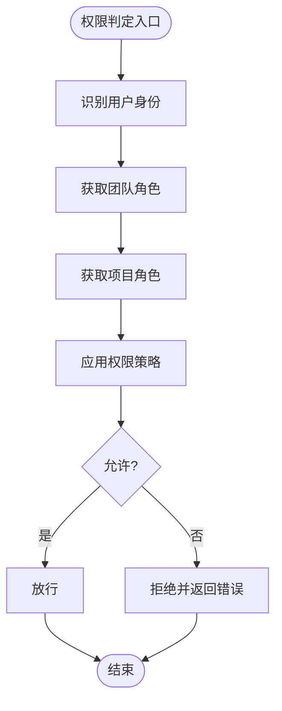
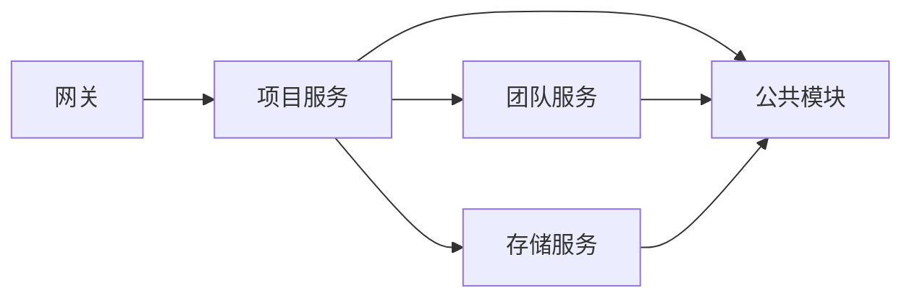

# 项目管理接口

<cite>
**本文引用的文件**
- [zxyz-project-service/src/main/java/uno/acloud/project/controller/ProjectController.java](file://ZXYZdatabaseBack/zxyz-project-service/src/main/java/uno/acloud/project/controller/ProjectController.java)
- [zxyz-project-service/src/main/java/uno/acloud/project/service/ProjectService.java](file://ZXYZdatabaseBack/zxyz-project-service/src/main/java/uno/acloud/project/service/ProjectService.java)
- [zxyz-project-service/src/main/java/uno/acloud/project/entity/ProjectEntity.java](file://ZXYZdatabaseBack/zxyz-project-service/src/main/java/uno/acloud/project/entity/ProjectEntity.java)
- [zxyz-project-service/src/main/java/uno/acloud/project/dto/request/CreateProjectRequest.java](file://ZXYZdatabaseBack/zxyz-project-service/src/main/java/uno/acloud/project/dto/request/CreateProjectRequest.java)
- [zxyz-project-service/src/main/java/uno/acloud/project/dto/response/ProjectVO.java](file://ZXYZdatabaseBack/zxyz-project-service/src/main/java/uno/acloud/project/vo/response/ProjectVO.java)
- [zxyz-team-service/src/main/java/uno/acloud/team/controller/TeamMemberController.java](file://ZXYZdatabaseBack/zxyz-team-service/src/main/java/uno/acloud/team/controller/TeamMemberController.java)
- [zxyz-team-service/src/main/java/uno/acloud/team/service/TeamMemberService.java](file://ZXYZdatabaseBack/zxyz-team-service/src/main/java/uno/acloud/team/service/TeamMemberService.java)
- [zxyz-file-service/src/main/java/uno/acloud/file/controller/StorageController.java](file://ZXYZdatabaseBack/zxyz-file-service/src/main/java/uno/acloud/file/controller/StorageController.java)
- [zxyz-file-service/src/main/java/uno/acloud/file/service/StorageQuotaService.java](file://ZXYZdatabaseBack/zxyz-file-service/src/main/java/uno/acloud/file/service/StorageQuotaService.java)
- [zxyz-common/src/main/java/uno/acloud/common/permission/PermissionPolicy.java](file://ZXYZdatabaseBack/zxyz-common/src/main/java/uno/acloud/common/permission/PermissionPolicy.java)
- [zxyz-common/src/main/java/uno/acloud/common/web/Result.java](file://ZXYZdatabaseBack/zxyz-common/src/main/java/uno/acloud/common/web/Result.java)
- [zxyz-gateway/src/main/java/uno/acloud/gateway/filter/SaTokenFilter.java](file://ZXYZdatabaseBack/zxyz-gateway/src/main/java/uno/acloud/gateway/filter/SaTokenFilter.java)
- [nacos-config/zxyz-project-service.yml](file://nacos-config/zxyz-project-service.yml)
- [sql/schema_project.sql](file://ZXYZdatabaseBack/sql/schema_project.sql)
- [ZXYZdatabaseFront/src/api/project.js](file://ZXYZdatabaseFront/src/api/project.js)
- [ZXYZdatabaseFront/src/composables/project/useProjectManagement.js](file://ZXYZdatabaseFront/src/composables/project/useProjectManagement.js)
</cite>

## 目录
1. [简介](#简介)
2. [项目结构](#项目结构)
3. [核心组件](#核心组件)
4. [架构总览](#架构总览)
5. [详细组件分析](#详细组件分析)
6. [依赖关系分析](#依赖关系分析)
7. [性能考虑](#性能考虑)
8. [故障排查指南](#故障排查指南)
9. [结论](#结论)
10. [附录：API 参考与示例](#附录api-参考与示例)

## 简介
本文件为 ZXYZ 项目的“项目管理”RESTful API 文档，覆盖以下能力：
- 项目生命周期管理：创建、启动、暂停、销毁
- 项目配置管理：设置更新、环境变量管理
- 项目成员管理：成员添加、角色分配、权限控制（项目级）
- 项目存储管理：配额设置、使用统计、清理策略
- 企业级特性：项目模板、项目克隆、项目迁移
- 概念说明：项目虚拟空间、项目与团队的关系、项目级权限模型

该文档面向后端开发者、前端集成方与运维人员，提供端到端接口规范、调用流程、错误码与最佳实践。

## 项目结构
ZXYZ 采用微服务架构，项目管理由 zxyz-project-service 提供服务，并通过网关统一鉴权；团队成员与权限由 zxyz-team-service 提供；文件与存储配额由 zxyz-file-service 提供；公共能力（结果封装、权限策略等）在 zxyz-common 中定义。前端通过 Vue 3 + Element Plus 调用后端 REST 接口。

**图表来源**
- [zxyz-gateway/src/main/java/uno/acloud/gateway/filter/SaTokenFilter.java](file://ZXYZdatabaseBack/zxyz-gateway/src/main/java/uno/acloud/gateway/filter/SaTokenFilter.java)
- [zxyz-project-service/src/main/java/uno/acloud/project/controller/ProjectController.java](file://ZXYZdatabaseBack/zxyz-project-service/src/main/java/uno/acloud/project/controller/ProjectController.java)
- [zxyz-team-service/src/main/java/uno/acloud/team/controller/TeamMemberController.java](file://ZXYZdatabaseBack/zxyz-team-service/src/main/java/uno/acloud/team/controller/TeamMemberController.java)
- [zxyz-file-service/src/main/java/uno/acloud/file/controller/StorageController.java](file://ZXYZdatabaseBack/zxyz-file-service/src/main/java/uno/acloud/file/controller/StorageController.java)
- [sql/schema_project.sql](file://ZXYZdatabaseBack/sql/schema_project.sql)

**章节来源**
- [nacos-config/zxyz-project-service.yml](file://nacos-config/zxyz-project-service.yml)
- [ZXYZdatabaseFront/src/api/project.js](file://ZXYZdatabaseFront/src/api/project.js)

## 核心组件
- 项目控制器：暴露项目生命周期与配置的 REST 端点
- 项目服务：编排项目创建、状态变更、配置与环境变量、模板与克隆、迁移等业务流程
- 项目实体与 VO：领域模型与对外投影
- 团队服务：成员管理与角色权限
- 存储服务：配额、用量统计与清理策略
- 权限策略：项目级权限判定与继承规则
- 网关鉴权：统一认证与内部服务访问控制

**章节来源**
- [zxyz-project-service/src/main/java/uno/acloud/project/controller/ProjectController.java](file://ZXYZdatabaseBack/zxyz-project-service/src/main/java/uno/acloud/project/controller/ProjectController.java)
- [zxyz-project-service/src/main/java/uno/acloud/project/service/ProjectService.java](file://ZXYZdatabaseBack/zxyz-project-service/src/main/java/uno/acloud/project/service/ProjectService.java)
- [zxyz-project-service/src/main/java/uno/acloud/project/entity/ProjectEntity.java](file://ZXYZdatabaseBack/zxyz-project-service/src/main/java/uno/acloud/project/entity/ProjectEntity.java)
- [zxyz-project-service/src/main/java/uno/acloud/project/vo/response/ProjectVO.java](file://ZXYZdatabaseBack/zxyz-project-service/src/main/java/uno/acloud/project/vo/response/ProjectVO.java)
- [zxyz-team-service/src/main/java/uno/acloud/team/controller/TeamMemberController.java](file://ZXYZdatabaseBack/zxyz-team-service/src/main/java/uno/acloud/team/controller/TeamMemberController.java)
- [zxyz-file-service/src/main/java/uno/acloud/file/controller/StorageController.java](file://ZXYZdatabaseBack/zxyz-file-service/src/main/java/uno/acloud/file/controller/StorageController.java)
- [zxyz-common/src/main/java/uno/acloud/common/permission/PermissionPolicy.java](file://ZXYZdatabaseBack/zxyz-common/src/main/java/uno/acloud/common/permission/PermissionPolicy.java)

## 架构总览
项目相关请求经网关统一鉴权后路由至对应服务。项目服务负责业务编排，必要时调用团队服务校验成员与权限，调用存储服务进行配额与用量检查，并通过消息队列异步处理耗时任务（如克隆、迁移）。

**图表来源**
- [zxyz-gateway/src/main/java/uno/acloud/gateway/filter/SaTokenFilter.java](file://ZXYZdatabaseBack/zxyz-gateway/src/main/java/uno/acloud/gateway/filter/SaTokenFilter.java)
- [zxyz-project-service/src/main/java/uno/acloud/project/controller/ProjectController.java](file://ZXYZdatabaseBack/zxyz-project-service/src/main/java/uno/acloud/project/controller/ProjectController.java)
- [zxyz-team-service/src/main/java/uno/acloud/team/controller/TeamMemberController.java](file://ZXYZdatabaseBack/zxyz-team-service/src/main/java/uno/acloud/team/controller/TeamMemberController.java)
- [zxyz-file-service/src/main/java/uno/acloud/file/controller/StorageController.java](file://ZXYZdatabaseBack/zxyz-file-service/src/main/java/uno/acloud/file/controller/StorageController.java)

## 详细组件分析

### 项目生命周期管理
- 创建项目：支持指定团队、名称、描述、初始模板、配额等
- 启动项目：将项目从待启动或已停止状态切换为运行中
- 暂停项目：将运行中的项目切换为暂停状态（保留数据）
- 销毁项目：删除项目及其关联资源（需管理员或项目所有者权限）

**图表来源**
- [zxyz-project-service/src/main/java/uno/acloud/project/controller/ProjectController.java](file://ZXYZdatabaseBack/zxyz-project-service/src/main/java/uno/acloud/project/controller/ProjectController.java)
- [zxyz-project-service/src/main/java/uno/acloud/project/service/ProjectService.java](file://ZXYZdatabaseBack/zxyz-project-service/src/main/java/uno/acloud/project/service/ProjectService.java)
- [zxyz-common/src/main/java/uno/acloud/common/web/Result.java](file://ZXYZdatabaseBack/zxyz-common/src/main/java/uno/acloud/common/web/Result.java)

**章节来源**
- [zxyz-project-service/src/main/java/uno/acloud/project/controller/ProjectController.java](file://ZXYZdatabaseBack/zxyz-project-service/src/main/java/uno/acloud/project/controller/ProjectController.java)
- [zxyz-project-service/src/main/java/uno/acloud/project/service/ProjectService.java](file://ZXYZdatabaseBack/zxyz-project-service/src/main/java/uno/acloud/project/service/ProjectService.java)
- [zxyz-common/src/main/java/uno/acloud/common/web/Result.java](file://ZXYZdatabaseBack/zxyz-common/src/main/java/uno/acloud/common/web/Result.java)

### 项目配置管理
- 设置更新：按 key-value 形式更新项目配置项，支持热更新与审计
- 环境变量管理：为项目注入运行时环境变量，支持敏感值加密存储
- 配置版本与回滚：记录配置变更历史，支持快速回滚

**图表来源**
- [zxyz-project-service/src/main/java/uno/acloud/project/controller/ProjectController.java](file://ZXYZdatabaseBack/zxyz-project-service/src/main/java/uno/acloud/project/controller/ProjectController.java)
- [zxyz-project-service/src/main/java/uno/acloud/project/service/ProjectService.java](file://ZXYZdatabaseBack/zxyz-project-service/src/main/java/uno/acloud/project/service/ProjectService.java)

**章节来源**
- [zxyz-project-service/src/main/java/uno/acloud/project/controller/ProjectController.java](file://ZXYZdatabaseBack/zxyz-project-service/src/main/java/uno/acloud/project/controller/ProjectController.java)
- [zxyz-project-service/src/main/java/uno/acloud/project/service/ProjectService.java](file://ZXYZdatabaseBack/zxyz-project-service/src/main/java/uno/acloud/project/service/ProjectService.java)

### 项目成员管理
- 成员添加：向项目添加团队成员，支持批量添加
- 角色分配：在项目维度分配角色（如查看者、编辑者、管理员）
- 权限控制：基于项目级权限模型与团队角色组合决定操作权限

**图表来源**
- [zxyz-project-service/src/main/java/uno/acloud/project/entity/ProjectEntity.java](file://ZXYZdatabaseBack/zxyz-project-service/src/main/java/uno/acloud/project/entity/ProjectEntity.java)
- [zxyz-team-service/src/main/java/uno/acloud/team/controller/TeamMemberController.java](file://ZXYZdatabaseBack/zxyz-team-service/src/main/java/uno/acloud/team/controller/TeamMemberController.java)
- [zxyz-common/src/main/java/uno/acloud/common/permission/PermissionPolicy.java](file://ZXYZdatabaseBack/zxyz-common/src/main/java/uno/acloud/common/permission/PermissionPolicy.java)

**章节来源**
- [zxyz-team-service/src/main/java/uno/acloud/team/controller/TeamMemberController.java](file://ZXYZdatabaseBack/zxyz-team-service/src/main/java/uno/acloud/team/controller/TeamMemberController.java)
- [zxyz-team-service/src/main/java/uno/acloud/team/service/TeamMemberService.java](file://ZXYZdatabaseBack/zxyz-team-service/src/main/java/uno/acloud/team/service/TeamMemberService.java)
- [zxyz-common/src/main/java/uno/acloud/common/permission/PermissionPolicy.java](file://ZXYZdatabaseBack/zxyz-common/src/main/java/uno/acloud/common/permission/PermissionPolicy.java)

### 项目存储管理
- 配额设置：为项目设置存储空间上限与阈值告警
- 使用统计：查询项目当前用量、增长趋势与热点文件
- 清理策略：配置自动清理规则（过期文件、临时文件、回收站）

**图表来源**
- [zxyz-file-service/src/main/java/uno/acloud/file/controller/StorageController.java](file://ZXYZdatabaseBack/zxyz-file-service/src/main/java/uno/acloud/file/controller/StorageController.java)
- [zxyz-file-service/src/main/java/uno/acloud/file/service/StorageQuotaService.java](file://ZXYZdatabaseBack/zxyz-file-service/src/main/java/uno/acloud/file/service/StorageQuotaService.java)

**章节来源**
- [zxyz-file-service/src/main/java/uno/acloud/file/controller/StorageController.java](file://ZXYZdatabaseBack/zxyz-file-service/src/main/java/uno/acloud/file/controller/StorageController.java)
- [zxyz-file-service/src/main/java/uno/acloud/file/service/StorageQuotaService.java](file://ZXYZdatabaseBack/zxyz-file-service/src/main/java/uno/acloud/file/service/StorageQuotaService.java)

### 企业级特性：模板、克隆与迁移
- 项目模板：预置项目结构与默认配置，加速项目初始化
- 项目克隆：复制现有项目（含配置、成员、存储快照），支持增量克隆
- 项目迁移：跨环境或跨租户迁移项目数据，保证一致性与可回滚

**图表来源**
- [zxyz-project-service/src/main/java/uno/acloud/project/service/ProjectService.java](file://ZXYZdatabaseBack/zxyz-project-service/src/main/java/uno/acloud/project/service/ProjectService.java)

**章节来源**
- [zxyz-project-service/src/main/java/uno/acloud/project/service/ProjectService.java](file://ZXYZdatabaseBack/zxyz-project-service/src/main/java/uno/acloud/project/service/ProjectService.java)

### 项目虚拟空间概念
- 虚拟空间：每个项目拥有独立的逻辑空间，隔离文件、配置、成员与权限
- 命名空间：路径与资源 ID 以项目为前缀，避免冲突
- 共享边界：跨项目共享需显式授权，默认不可见

**章节来源**
- [ZXYZdatabaseFront/src/utils/projectVirtualFolder.js](file://ZXYZdatabaseFront/src/utils/projectVirtualFolder.js)
- [sql/schema_project.sql](file://ZXYZdatabaseBack/sql/schema_project.sql)

### 项目与团队的关系
- 项目属于团队：项目创建时必须绑定团队 ID
- 成员继承：团队成员在项目内可继承团队角色，也可被项目级角色覆盖
- 权限叠加：项目级权限优先于团队级权限

**章节来源**
- [zxyz-team-service/src/main/java/uno/acloud/team/controller/TeamMemberController.java](file://ZXYZdatabaseBack/zxyz-team-service/src/main/java/uno/acloud/team/controller/TeamMemberController.java)
- [zxyz-common/src/main/java/uno/acloud/common/permission/PermissionPolicy.java](file://ZXYZdatabaseBack/zxyz-common/src/main/java/uno/acloud/common/permission/PermissionPolicy.java)

### 项目级权限模型
- 角色体系：查看者、编辑者、管理员、所有者
- 动作粒度：读、写、删除、配置、成员管理、存储管理
- 决策流程：用户身份 → 团队角色 → 项目角色 → 权限策略

**图表来源**
- [zxyz-common/src/main/java/uno/acloud/common/permission/PermissionPolicy.java](file://ZXYZdatabaseBack/zxyz-common/src/main/java/uno/acloud/common/permission/PermissionPolicy.java)

**章节来源**
- [zxyz-common/src/main/java/uno/acloud/common/permission/PermissionPolicy.java](file://ZXYZdatabaseBack/zxyz-common/src/main/java/uno/acloud/common/permission/PermissionPolicy.java)

## 依赖关系分析
- 网关层：统一鉴权与内部端点拦截
- 项目服务：核心业务编排，依赖团队服务与存储服务
- 团队服务：成员与角色管理
- 存储服务：配额与用量统计
- 公共模块：结果封装、权限策略、工具类

**图表来源**
- [zxyz-gateway/src/main/java/uno/acloud/gateway/filter/SaTokenFilter.java](file://ZXYZdatabaseBack/zxyz-gateway/src/main/java/uno/acloud/gateway/filter/SaTokenFilter.java)
- [zxyz-project-service/src/main/java/uno/acloud/project/controller/ProjectController.java](file://ZXYZdatabaseBack/zxyz-project-service/src/main/java/uno/acloud/project/controller/ProjectController.java)
- [zxyz-team-service/src/main/java/uno/acloud/team/controller/TeamMemberController.java](file://ZXYZdatabaseBack/zxyz-team-service/src/main/java/uno/acloud/team/controller/TeamMemberController.java)
- [zxyz-file-service/src/main/java/uno/acloud/file/controller/StorageController.java](file://ZXYZdatabaseBack/zxyz-file-service/src/main/java/uno/acloud/file/controller/StorageController.java)
- [zxyz-common/src/main/java/uno/acloud/common/web/Result.java](file://ZXYZdatabaseBack/zxyz-common/src/main/java/uno/acloud/common/web/Result.java)

**章节来源**
- [zxyz-common/src/main/java/uno/acloud/common/web/Result.java](file://ZXYZdatabaseBack/zxyz-common/src/main/java/uno/acloud/common/web/Result.java)
- [nacos-config/zxyz-project-service.yml](file://nacos-config/zxyz-project-service.yml)

## 性能考虑
- 异步化：克隆、迁移、初始化等耗时操作通过消息队列异步执行，提升响应速度
- 缓存：项目配置与权限结果短期缓存，降低重复计算
- 分页与投影：列表接口采用分页与窄投影，减少数据传输
- 限流：对高频接口（如用量查询）实施限流保护
- 连接池：数据库与外部存储连接池优化，避免资源耗尽

[本节为通用指导，不直接分析具体文件]

## 故障排查指南
- 鉴权失败：检查网关 SaToken 过滤器与 Cookie/Session 有效性
- 权限不足：确认用户在团队与项目中的角色，核对权限策略
- 资源不足：检查项目配额与剩余容量，调整配额或清理无用文件
- 冲突处理：项目名冲突时返回冲突错误，建议前端提示重命名
- 超时与重试：对长耗时任务启用幂等与重试机制，避免重复创建

**章节来源**
- [zxyz-gateway/src/main/java/uno/acloud/gateway/filter/SaTokenFilter.java](file://ZXYZdatabaseBack/zxyz-gateway/src/main/java/uno/acloud/gateway/filter/SaTokenFilter.java)
- [zxyz-common/src/main/java/uno/acloud/common/web/Result.java](file://ZXYZdatabaseBack/zxyz-common/src/main/java/uno/acloud/common/web/Result.java)

## 结论
本文档系统梳理了 ZXYZ 项目管理相关的 RESTful API，涵盖生命周期、配置、成员、存储与企业级特性，并结合架构图与流程图帮助读者理解数据流与控制流。建议在集成过程中严格遵循权限模型与错误处理规范，确保系统稳定与安全。

[本节为总结性内容，不直接分析具体文件]

## 附录：API 参考与示例

### 通用约定
- 统一响应体：Result<T>，code=1 表示成功
- 鉴权：HTTP 请求携带 Sa-Token Cookie，内部端点 /api/internal/** 仅服务间调用
- 错误码：业务错误码在 Result 中返回，常见包括权限不足、资源不足、冲突等

**章节来源**
- [zxyz-common/src/main/java/uno/acloud/common/web/Result.java](file://ZXYZdatabaseBack/zxyz-common/src/main/java/uno/acloud/common/web/Result.java)
- [ZXYZdatabaseFront/src/api/project.js](file://ZXYZdatabaseFront/src/api/project.js)

### 项目生命周期接口
- 创建项目
  - 方法：POST
  - 路径：/api/projects
  - 请求体：包含团队 ID、项目名称、描述、初始模板、配额等
  - 响应：返回项目基本信息与状态
  - 错误：权限不足、资源不足、名称冲突
- 启动项目
  - 方法：POST
  - 路径：/api/projects/{id}/start
  - 响应：返回项目新状态
  - 错误：权限不足、项目不存在
- 暂停项目
  - 方法：POST
  - 路径：/api/projects/{id}/pause
  - 响应：返回项目新状态
  - 错误：权限不足、项目不存在
- 销毁项目
  - 方法：DELETE
  - 路径：/api/projects/{id}
  - 响应：返回销毁结果
  - 错误：权限不足、项目不存在、引用未释放

**章节来源**
- [zxyz-project-service/src/main/java/uno/acloud/project/controller/ProjectController.java](file://ZXYZdatabaseBack/zxyz-project-service/src/main/java/uno/acloud/project/controller/ProjectController.java)
- [zxyz-project-service/src/main/java/uno/acloud/project/service/ProjectService.java](file://ZXYZdatabaseBack/zxyz-project-service/src/main/java/uno/acloud/project/service/ProjectService.java)
- [zxyz-common/src/main/java/uno/acloud/common/web/Result.java](file://ZXYZdatabaseBack/zxyz-common/src/main/java/uno/acloud/common/web/Result.java)

### 项目配置接口
- 更新配置
  - 方法：PUT
  - 路径：/api/projects/{id}/config
  - 请求体：key-value 配置项
  - 响应：返回最新配置快照
  - 错误：权限不足、参数非法
- 环境变量管理
  - 方法：POST/PUT/DELETE
  - 路径：/api/projects/{id}/env
  - 请求体：环境变量键值对
  - 响应：返回环境变量列表
  - 错误：权限不足、敏感值格式错误

**章节来源**
- [zxyz-project-service/src/main/java/uno/acloud/project/controller/ProjectController.java](file://ZXYZdatabaseBack/zxyz-project-service/src/main/java/uno/acloud/project/controller/ProjectController.java)
- [zxyz-project-service/src/main/java/uno/acloud/project/service/ProjectService.java](file://ZXYZdatabaseBack/zxyz-project-service/src/main/java/uno/acloud/project/service/ProjectService.java)

### 项目成员接口
- 添加成员
  - 方法：POST
  - 路径：/api/projects/{id}/members
  - 请求体：成员 ID 列表与角色映射
  - 响应：返回成员加入结果
  - 错误：权限不足、成员不存在
- 角色分配
  - 方法：PUT
  - 路径：/api/projects/{id}/members/{memberId}/role
  - 请求体：新角色
  - 响应：返回更新后的角色
  - 错误：权限不足、角色非法
- 权限控制
  - 方法：GET
  - 路径：/api/projects/{id}/permissions
  - 响应：返回权限矩阵（用户-动作-是否允许）
  - 错误：权限不足

**章节来源**
- [zxyz-team-service/src/main/java/uno/acloud/team/controller/TeamMemberController.java](file://ZXYZdatabaseBack/zxyz-team-service/src/main/java/uno/acloud/team/controller/TeamMemberController.java)
- [zxyz-team-service/src/main/java/uno/acloud/team/service/TeamMemberService.java](file://ZXYZdatabaseBack/zxyz-team-service/src/main/java/uno/acloud/team/service/TeamMemberService.java)
- [zxyz-common/src/main/java/uno/acloud/common/permission/PermissionPolicy.java](file://ZXYZdatabaseBack/zxyz-common/src/main/java/uno/acloud/common/permission/PermissionPolicy.java)

### 项目存储接口
- 使用统计
  - 方法：GET
  - 路径：/api/projects/{id}/storage/usage
  - 响应：返回用量、配额、趋势
  - 错误：权限不足
- 配额设置
  - 方法：PUT
  - 路径：/api/projects/{id}/storage/quota
  - 请求体：新配额值
  - 响应：返回新配额
  - 错误：权限不足、配额非法
- 清理策略
  - 方法：PUT
  - 路径：/api/projects/{id}/storage/cleanup
  - 请求体：清理规则（过期时间、类型、阈值）
  - 响应：返回策略生效结果
  - 错误：权限不足、规则非法

**章节来源**
- [zxyz-file-service/src/main/java/uno/acloud/file/controller/StorageController.java](file://ZXYZdatabaseBack/zxyz-file-service/src/main/java/uno/acloud/file/controller/StorageController.java)
- [zxyz-file-service/src/main/java/uno/acloud/file/service/StorageQuotaService.java](file://ZXYZdatabaseBack/zxyz-file-service/src/main/java/uno/acloud/file/service/StorageQuotaService.java)

### 企业级特性接口
- 模板列表
  - 方法：GET
  - 路径：/api/templates
  - 响应：返回可用模板清单
  - 错误：无
- 项目克隆
  - 方法：POST
  - 路径：/api/projects/{id}/clone
  - 请求体：目标名称、克隆模式（全量/增量）、目标团队
  - 响应：返回克隆任务 ID 与进度
  - 错误：权限不足、源项目不存在
- 项目迁移
  - 方法：POST
  - 路径：/api/projects/{id}/migrate
  - 请求体：目标环境、迁移策略、校验开关
  - 响应：返回迁移任务 ID 与阶段
  - 错误：权限不足、目标环境不可达

**章节来源**
- [zxyz-project-service/src/main/java/uno/acloud/project/service/ProjectService.java](file://ZXYZdatabaseBack/zxyz-project-service/src/main/java/uno/acloud/project/service/ProjectService.java)

### 前端集成要点
- 使用统一的 API 封装模块发起请求，处理 Result 响应结构
- 项目虚拟空间路径解析与展示由前端工具函数处理
- 项目管理的交互逻辑封装在 composables 中，便于复用与维护

**章节来源**
- [ZXYZdatabaseFront/src/api/project.js](file://ZXYZdatabaseFront/src/api/project.js)
- [ZXYZdatabaseFront/src/composables/project/useProjectManagement.js](file://ZXYZdatabaseFront/src/composables/project/useProjectManagement.js)
- [ZXYZdatabaseFront/src/utils/projectVirtualFolder.js](file://ZXYZdatabaseFront/src/utils/projectVirtualFolder.js)