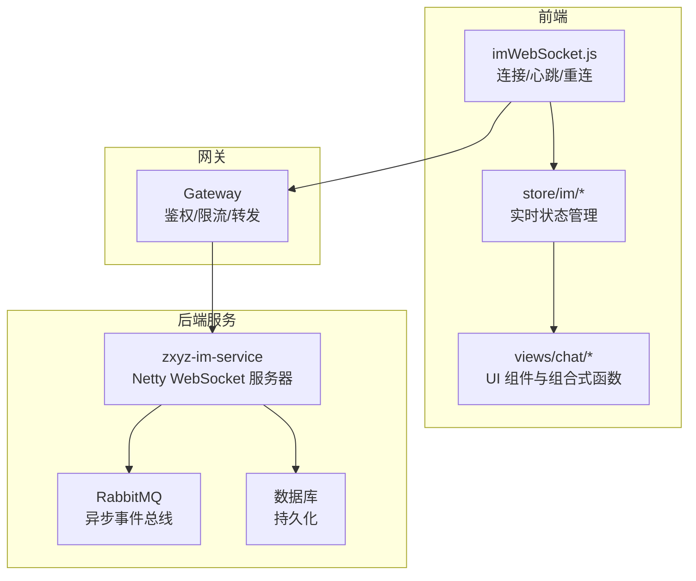
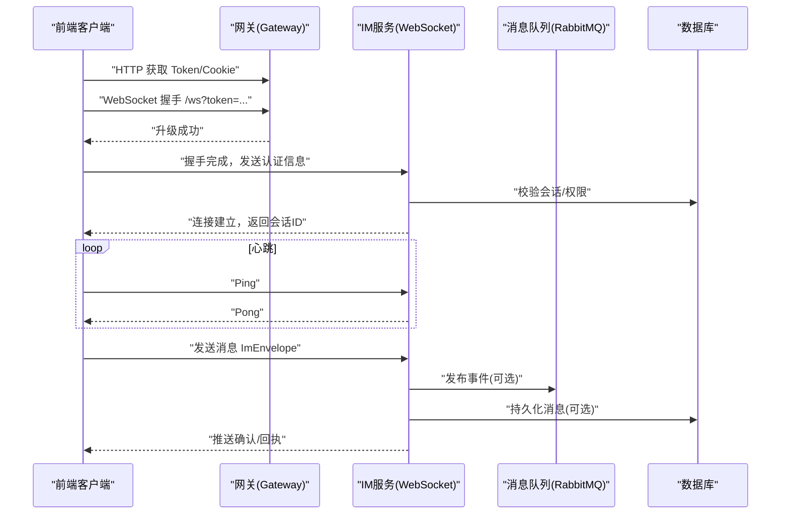
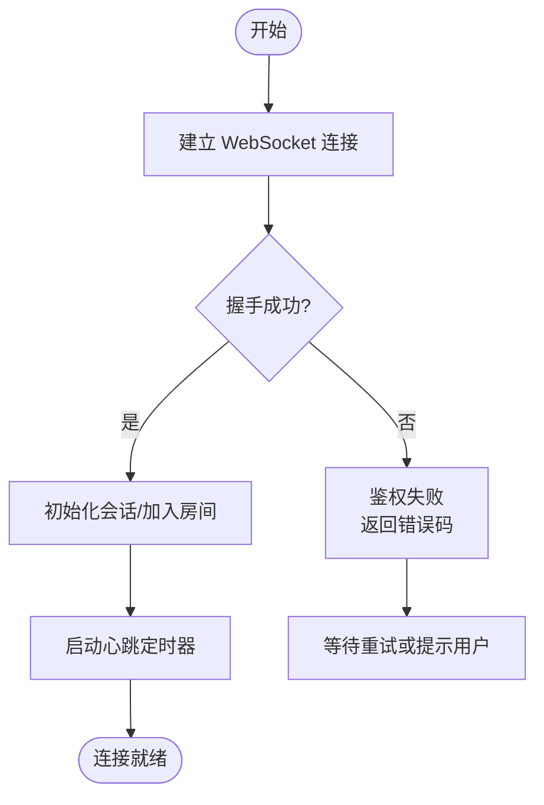
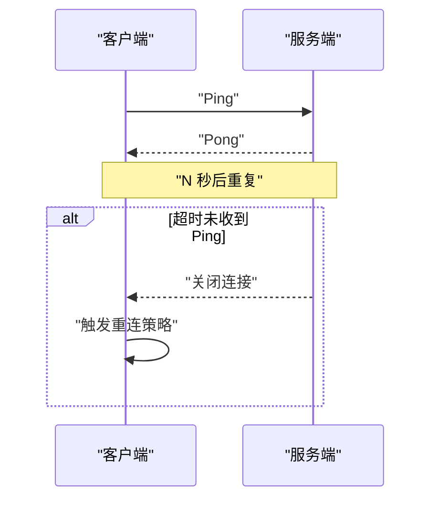
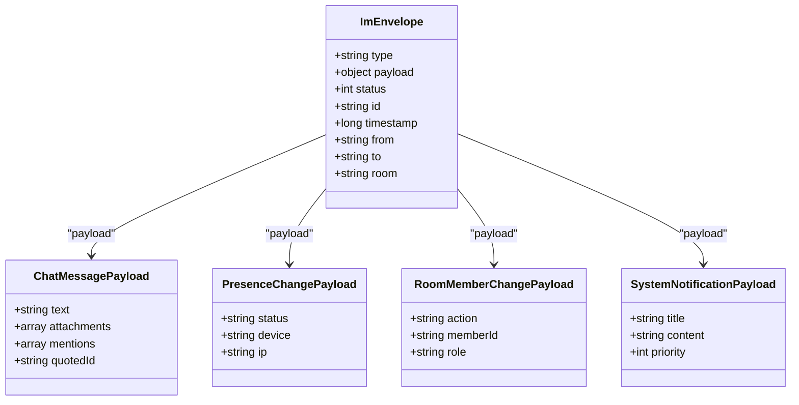
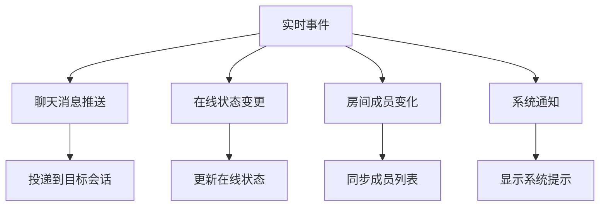
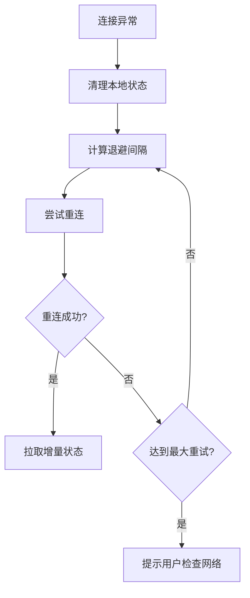
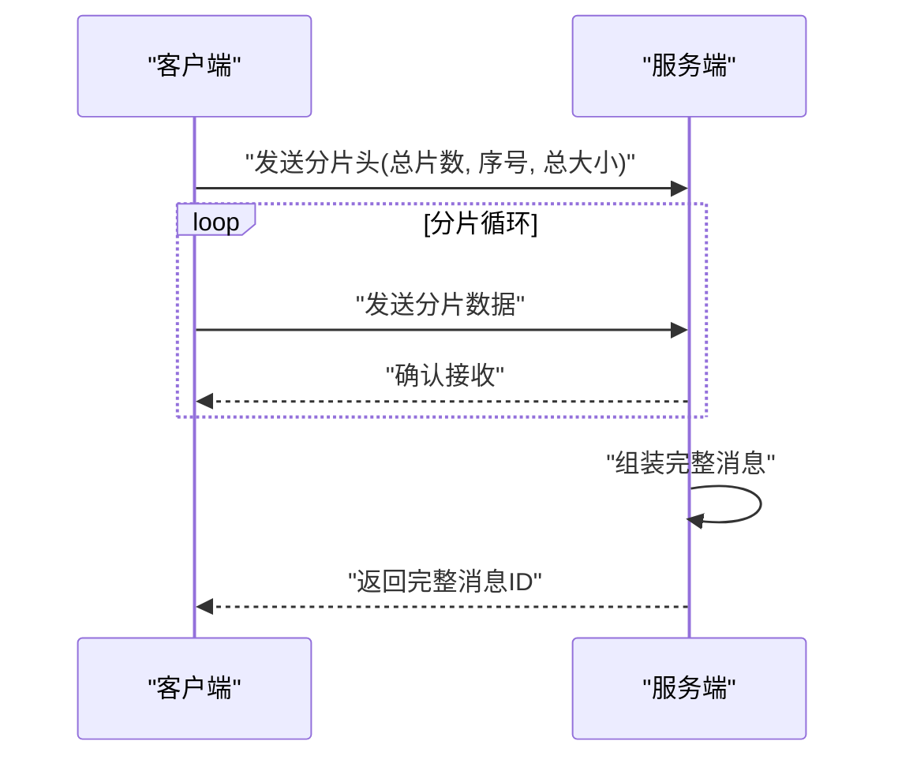
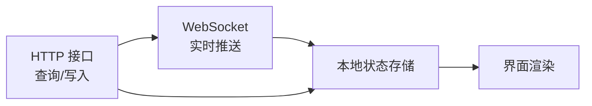
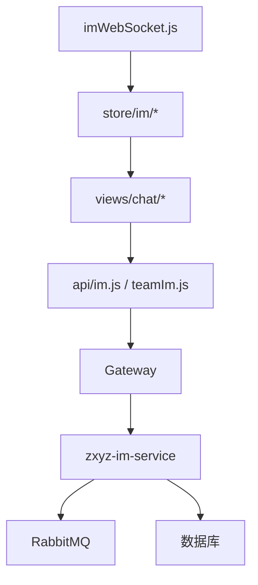

# WebSocket实时通信接口

<cite>
**本文引用的文件**   
- [zxyz-im-service 应用入口](file://ZXYZdatabaseBack/zxyz-im-service/src/main/java/uno/acloud/im/ZxyzImApplication.java)
- [IM服务配置（application.yml）](file://ZXYZdatabaseBack/zxyz-im-service/src/main/resources/application.yml)
- [前端 IM WebSocket 工具](file://ZXYZdatabaseFront/src/utils/imWebSocket.js)
- [前端 IM 请求封装](file://ZXYZdatabaseFront/src/utils/imRequest.js)
- [前端聊天状态管理（chat.js）](file://ZXYZdatabaseFront/src/store/chat.js)
- [前端 IM 领域模型（realtimeDomain.js）](file://ZXYZdatabaseFront/src/store/im/realtimeDomain.js)
- [前端消息领域模型（messageDomain.js）](file://ZXYZdatabaseFront/src/store/im/messageDomain.js)
- [前端会话领域模型（conversationDomain.js）](file://ZXYZdatabaseFront/src/store/im/conversationDomain.js)
- [前端通知领域模型（notificationDomain.js）](file://ZXYZdatabaseFront/src/store/im/notificationDomain.js)
- [前端权限领域模型（permissionDomain.js）](file://ZXYZdatabaseFront/src/store/im/permissionDomain.js)
- [前端团队领域模型（teamDomain.js）](file://ZXYZdatabaseFront/src/store/im/teamDomain.js)
- [前端聊天页面组件（index.vue）](file://ZXYZdatabaseFront/src/views/chat/index.vue)
- [前端消息气泡组件（MessageBubble.vue）](file://ZXYZdatabaseFront/src/views/chat/components/MessageBubble.vue)
- [前端消息编辑器组件（MessageEditor.vue）](file://ZXYZdatabaseFront/src/views/chat/components/MessageEditor.vue)
- [前端会话列表组件（ConversationList.vue）](file://ZXYZdatabaseFront/src/views/chat/components/ConversationList.vue)
- [前端虚拟滚动消息列表（VirtualMessageList.vue）](file://ZXYZdatabaseFront/src/views/chat/components/VirtualMessageList.vue)
- [前端聊天上下文组合式函数（useChatPageActions.js）](file://ZXYZdatabaseFront/src/views/chat/composables/useChatPageActions.js)
- [前端聊天消息模型组合式函数（useChatMessageModel.js）](file://ZXYZdatabaseFront/src/views/chat/composables/useChatMessageModel.js)
- [前端聊天成员组合式函数（useChatMembers.js）](file://ZXYZdatabaseFront/src/views/chat/composables/useChatMembers.js)
- [前端聊天可见性同步组合式函数（useChatVisibilitySync.js）](file://ZXYZdatabaseFront/src/views/chat/composables/useChatVisibilitySync.js)
- [前端聊天项目创建请求组合式函数（useChatProjectCreateRequests.js）](file://ZXYZdatabaseFront/src/views/chat/composables/useChatProjectCreateRequests.js)
- [前端聊天更多抽屉组件（ChatMoreDrawer.vue）](file://ZXYZdatabaseFront/src/views/chat/components/ChatMoreDrawer.vue)
- [前端聊天对话选择器对话框（ConversationPickerDialog.vue）](file://ZXYZdatabaseFront/src/views/chat/components/ConversationPickerDialog.vue)
- [前端聊天发送消息组合式函数（useSendToConversation.js）](file://ZXYZdatabaseFront/src/composables/useSendToConversation.js)
- [前端 IM 展示模型（imPresentation.js）](file://ZXYZdatabaseFront/src/models/imPresentation.js)
- [前端错误处理工具（error.js）](file://ZXYZdatabaseFront/src/utils/error.js)
- [前端日志工具（logger.js）](file://ZXYZdatabaseFront/src/utils/logger.js)
- [前端事件发射器（eventEmitter.js）](file://ZXYZdatabaseFront/src/utils/eventEmitter.js)
- [前端认证工具（auth.js）](file://ZXYZdatabaseFront/src/utils/auth.js)
- [前端环境变量（env.js）](file://ZXYZdatabaseFront/src/utils/env.js)
- [前端 API 客户端工厂（createApiClient.js）](file://ZXYZdatabaseFront/src/utils/createApiClient.js)
- [前端公共请求封装（publicRequest.js）](file://ZXYZdatabaseFront/src/utils/publicRequest.js)
- [前端请求封装（request.js）](file://ZXYZdatabaseFront/src/utils/request.js)
- [前端会话存储（session.js）](file://ZXYZdatabaseFront/src/store/session.js)
- [前端当前用户存储（currentUser.js）](file://ZXYZdatabaseFront/src/store/currentUser.js)
- [前端团队存储（team.js）](file://ZXYZdatabaseFront/src/store/team.js)
- [前端 IM API 定义（im.js）](file://ZXYZdatabaseFront/src/api/im.js)
- [前端团队 IM API 定义（teamIm.js）](file://ZXYZdatabaseFront/src/api/teamIm.js)
- [前端聊天桥接插件（chatBridge.js）](file://ZXYZdatabaseFront/src/store/plugins/chatBridge.js)
- [前端聊天正常化器（normalizers.js）](file://ZXYZdatabaseFront/src/store/im/normalizers.js)
- [前端聊天消息状态常量（messageStatus.js）](file://ZXYZdatabaseFront/src/constants/messageStatus.js)
- [前端聊天会话类型常量（conversationTypes.js）](file://ZXYZdatabaseFront/src/constants/conversationTypes.js)
- [前端聊天权限常量（teamPermissions.js）](file://ZXYZdatabaseFront/src/constants/teamPermissions.js)
</cite>

## 目录
1. [简介](#简介)
2. [项目结构](#项目结构)
3. [核心组件](#核心组件)
4. [架构总览](#架构总览)
5. [详细组件分析](#详细组件分析)
6. [依赖关系分析](#依赖关系分析)
7. [性能考虑](#性能考虑)
8. [故障排查指南](#故障排查指南)
9. [结论](#结论)
10. [附录](#附录)

## 简介
本文件为 ZXYZ 项目的 WebSocket 实时通信接口文档，聚焦于基于 Netty 的 WebSocket 服务器实现与前端集成。内容涵盖：
- 连接建立流程、握手协议、心跳机制
- 消息信封格式 ImEnvelope（消息类型、载荷结构、状态码）
- 实时事件类型：聊天消息推送、在线状态变更、房间成员变化、系统通知等
- 客户端连接管理、重连策略、断线处理
- 消息序列化格式、二进制数据传输、大消息分片处理
- WebSocket 连接示例、消息收发示例、错误处理模式
- 与 HTTP 接口的协作关系和数据同步机制

## 项目结构
后端采用微服务架构，IM 实时通信由 zxyz-im-service 提供；前端通过 Vue 3 + Pinia 管理状态，使用原生 WebSocket 或封装工具进行实时通信。关键路径如下：
- 后端：zxyz-im-service 模块负责 WebSocket 接入、消息路由、会话与房间管理、事件分发
- 前端：utils/imWebSocket.js 封装连接、心跳、重连；store/im/* 管理实时数据；views/chat 下组件消费实时事件

**图示来源** 
- [zxyz-im-service 应用入口](file://ZXYZdatabaseBack/zxyz-im-service/src/main/java/uno/acloud/im/ZxyzImApplication.java)
- [IM服务配置（application.yml）](file://ZXYZdatabaseBack/zxyz-im-service/src/main/resources/application.yml)
- [前端 IM WebSocket 工具](file://ZXYZdatabaseFront/src/utils/imWebSocket.js)
- [前端 IM 领域模型（realtimeDomain.js）](file://ZXYZdatabaseFront/src/store/im/realtimeDomain.js)

**章节来源**
- [zxyz-im-service 应用入口](file://ZXYZdatabaseBack/zxyz-im-service/src/main/java/uno/acloud/im/ZxyzImApplication.java)
- [IM服务配置（application.yml）](file://ZXYZdatabaseBack/zxyz-im-service/src/main/resources/application.yml)
- [前端 IM WebSocket 工具](file://ZXYZdatabaseFront/src/utils/imWebSocket.js)

## 核心组件
- 连接与会话管理：维护 WebSocket 通道、用户会话、房间成员映射
- 消息路由与分发：按目标（个人/房间/系统）投递消息，支持广播与点对点
- 心跳与保活：定时 Ping/Pong 检测，超时断开并触发重连
- 事件总线：内部通过 RabbitMQ Topic Exchange 发布订阅，跨服务同步状态
- 序列化与编解码：统一 JSON 信封 ImEnvelope，支持二进制分片传输

**章节来源**
- [前端 IM WebSocket 工具](file://ZXYZdatabaseFront/src/utils/imWebSocket.js)
- [前端 IM 领域模型（realtimeDomain.js）](file://ZXYZdatabaseFront/src/store/im/realtimeDomain.js)
- [前端消息领域模型（messageDomain.js）](file://ZXYZdatabaseFront/src/store/im/messageDomain.js)

## 架构总览
整体交互流程：
- 前端通过 Gateway 鉴权后建立 WebSocket 连接
- 服务端完成握手，分配会话 ID，加入默认房间
- 客户端周期性发送心跳，服务端维持活跃状态
- 消息以 ImEnvelope 信封承载，服务端根据类型路由到对应处理器
- 实时事件通过 RabbitMQ 在微服务间传播，保证最终一致性

**图示来源** 
- [IM服务配置（application.yml）](file://ZXYZdatabaseBack/zxyz-im-service/src/main/resources/application.yml)
- [前端 IM WebSocket 工具](file://ZXYZdatabaseFront/src/utils/imWebSocket.js)

## 详细组件分析

### 连接建立与握手协议
- 连接地址：通过环境变量或配置确定 ws://host/ws
- 握手参数：携带 token 或 session 标识，用于鉴权与会话绑定
- 握手响应：包含会话 ID、初始房间列表、能力协商结果
- 失败处理：鉴权失败返回错误码，客户端记录并提示重试

**图示来源** 
- [前端 IM WebSocket 工具](file://ZXYZdatabaseFront/src/utils/imWebSocket.js)

**章节来源**
- [前端 IM WebSocket 工具](file://ZXYZdatabaseFront/src/utils/imWebSocket.js)
- [IM服务配置（application.yml）](file://ZXYZdatabaseBack/zxyz-im-service/src/main/resources/application.yml)

### 心跳机制
- 客户端每 N 秒发送 Ping 帧
- 服务端收到 Ping 回复 Pong，并更新最后活跃时间
- 若超时未收到 Ping，服务端主动关闭连接并清理资源
- 客户端检测到断线后执行指数退避重连

**图示来源** 
- [前端 IM WebSocket 工具](file://ZXYZdatabaseFront/src/utils/imWebSocket.js)

**章节来源**
- [前端 IM WebSocket 工具](file://ZXYZdatabaseFront/src/utils/imWebSocket.js)

### 消息信封格式 ImEnvelope
- 字段说明：
  - type：消息类型（如 chat_message、presence_change、room_member_change、system_notification）
  - payload：载荷对象，随类型不同而结构不同
  - status：状态码（0=成功，非0=错误码）
  - id：消息唯一标识（客户端生成，服务端回显）
  - timestamp：时间戳（毫秒）
  - from/to：发送者与接收者标识
  - room：房间标识（群聊/频道）
- 载荷结构示例（不展示具体代码，仅描述）：
  - chat_message：包含文本、附件、@提及、引用等
  - presence_change：包含在线/离线状态、设备信息
  - room_member_change：包含成员加入/离开、角色变更
  - system_notification：包含通知标题、内容、优先级

**图示来源** 
- [前端消息领域模型（messageDomain.js）](file://ZXYZdatabaseFront/src/store/im/messageDomain.js)
- [前端 IM 领域模型（realtimeDomain.js）](file://ZXYZdatabaseFront/src/store/im/realtimeDomain.js)

**章节来源**
- [前端消息领域模型（messageDomain.js）](file://ZXYZdatabaseFront/src/store/im/messageDomain.js)
- [前端 IM 领域模型（realtimeDomain.js）](file://ZXYZdatabaseFront/src/store/im/realtimeDomain.js)

### 实时事件类型
- 聊天消息推送：新消息到达、已读回执、撤回通知
- 在线状态变更：用户上线/下线、设备切换
- 房间成员变化：加入/离开、角色变更、禁言/解禁
- 系统通知：公告、维护通知、权限变更提醒

**图示来源** 
- [前端通知领域模型（notificationDomain.js）](file://ZXYZdatabaseFront/src/store/im/notificationDomain.js)
- [前端团队领域模型（teamDomain.js）](file://ZXYZdatabaseFront/src/store/im/teamDomain.js)

**章节来源**
- [前端通知领域模型（notificationDomain.js）](file://ZXYZdatabaseFront/src/store/im/notificationDomain.js)
- [前端团队领域模型（teamDomain.js）](file://ZXYZdatabaseFront/src/store/im/teamDomain.js)

### 客户端连接管理、重连策略、断线处理
- 连接管理：单例连接池，按用户/房间维度复用连接
- 重连策略：指数退避（初始间隔 1s，最大 30s），抖动避免雪崩
- 断线处理：捕获异常，清理本地状态，触发 UI 提示
- 状态同步：重连后拉取增量状态，确保一致性

**图示来源** 
- [前端 IM WebSocket 工具](file://ZXYZdatabaseFront/src/utils/imWebSocket.js)
- [前端错误处理工具（error.js）](file://ZXYZdatabaseFront/src/utils/error.js)

**章节来源**
- [前端 IM WebSocket 工具](file://ZXYZdatabaseFront/src/utils/imWebSocket.js)
- [前端错误处理工具（error.js）](file://ZXYZdatabaseFront/src/utils/error.js)

### 消息序列化、二进制传输、大消息分片
- 序列化：JSON 编码 ImEnvelope，字段顺序固定，便于解析
- 二进制传输：附件/文件通过二进制帧传输，附带元数据（文件名、大小、哈希）
- 大消息分片：超过阈值的消息拆分为多个片段，客户端重组后提交

**图示来源** 
- [前端 IM WebSocket 工具](file://ZXYZdatabaseFront/src/utils/imWebSocket.js)

**章节来源**
- [前端 IM WebSocket 工具](file://ZXYZdatabaseFront/src/utils/imWebSocket.js)

### 与 HTTP 接口的协作关系和数据同步机制
- 认证：通过 HTTP 接口获取 Cookie/Token，WebSocket 握手时复用
- 数据同步：WebSocket 推送实时变更，HTTP 接口用于批量查询与历史回溯
- 幂等性：消息 ID 去重，避免重复处理
- 一致性：最终一致，允许短暂延迟

**图示来源** 
- [前端 IM API 定义（im.js）](file://ZXYZdatabaseFront/src/api/im.js)
- [前端团队 IM API 定义（teamIm.js）](file://ZXYZdatabaseFront/src/api/teamIm.js)

**章节来源**
- [前端 IM API 定义（im.js）](file://ZXYZdatabaseFront/src/api/im.js)
- [前端团队 IM API 定义（teamIm.js）](file://ZXYZdatabaseFront/src/api/teamIm.js)

## 依赖关系分析
- 前端依赖：
  - imWebSocket.js：连接、心跳、重连
  - store/im/*：状态管理、事件处理
  - views/chat/*：UI 组件与业务逻辑
- 后端依赖：
  - zxyz-im-service：WebSocket 服务器、消息路由
  - RabbitMQ：异步事件总线
  - 数据库：持久化消息与会话

**图示来源** 
- [前端 IM WebSocket 工具](file://ZXYZdatabaseFront/src/utils/imWebSocket.js)
- [前端 IM API 定义（im.js）](file://ZXYZdatabaseFront/src/api/im.js)
- [前端团队 IM API 定义（teamIm.js）](file://ZXYZdatabaseFront/src/api/teamIm.js)
- [zxyz-im-service 应用入口](file://ZXYZdatabaseBack/zxyz-im-service/src/main/java/uno/acloud/im/ZxyzImApplication.java)

**章节来源**
- [前端 IM WebSocket 工具](file://ZXYZdatabaseFront/src/utils/imWebSocket.js)
- [前端 IM API 定义（im.js）](file://ZXYZdatabaseFront/src/api/im.js)
- [前端团队 IM API 定义（teamIm.js）](file://ZXYZdatabaseFront/src/api/teamIm.js)
- [zxyz-im-service 应用入口](file://ZXYZdatabaseBack/zxyz-im-service/src/main/java/uno/acloud/im/ZxyzImApplication.java)

## 性能考虑
- 连接复用：减少握手开销，提升吞吐
- 心跳优化：合理设置间隔，避免频繁 IO
- 消息压缩：对文本消息启用 gzip 压缩
- 分片传输：避免单帧过大导致阻塞
- 背压控制：客户端限制发送速率，防止拥塞

[本节为通用指导，无需特定文件引用]

## 故障排查指南
- 连接失败：检查网络、防火墙、证书、Token 有效性
- 心跳超时：调整间隔，检查服务端负载
- 消息丢失：核对消息 ID 去重，检查队列积压
- 状态不一致：触发全量同步，比对差异

**章节来源**
- [前端错误处理工具（error.js）](file://ZXYZdatabaseFront/src/utils/error.js)
- [前端日志工具（logger.js）](file://ZXYZdatabaseFront/src/utils/logger.js)

## 结论
本文件系统化梳理了 ZXYZ 项目的 WebSocket 实时通信实现，涵盖连接、消息、事件、序列化、重连、性能与故障排查等方面。建议在实际开发中严格遵循信封格式与事件规范，确保前后端一致性与可维护性。

[本节为总结，无需特定文件引用]

## 附录
- WebSocket 连接示例：参考 [前端 IM WebSocket 工具](file://ZXYZdatabaseFront/src/utils/imWebSocket.js)
- 消息发送接收示例：参考 [前端聊天页面组件（index.vue）](file://ZXYZdatabaseFront/src/views/chat/index.vue)
- 错误处理模式：参考 [前端错误处理工具（error.js）](file://ZXYZdatabaseFront/src/utils/error.js)

[本节为补充说明，无需特定文件引用]