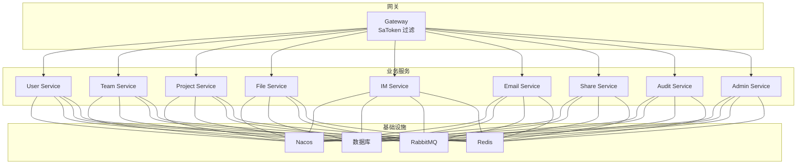
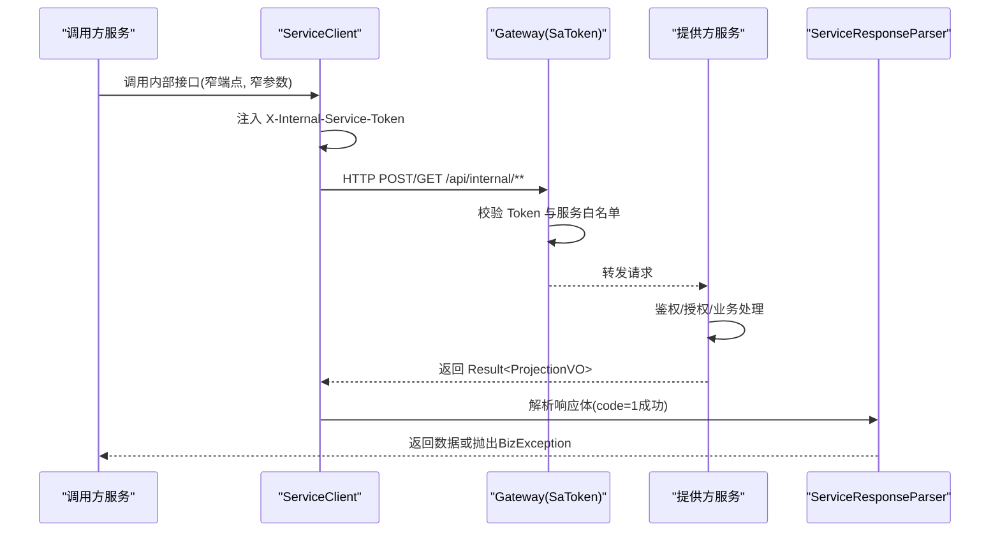
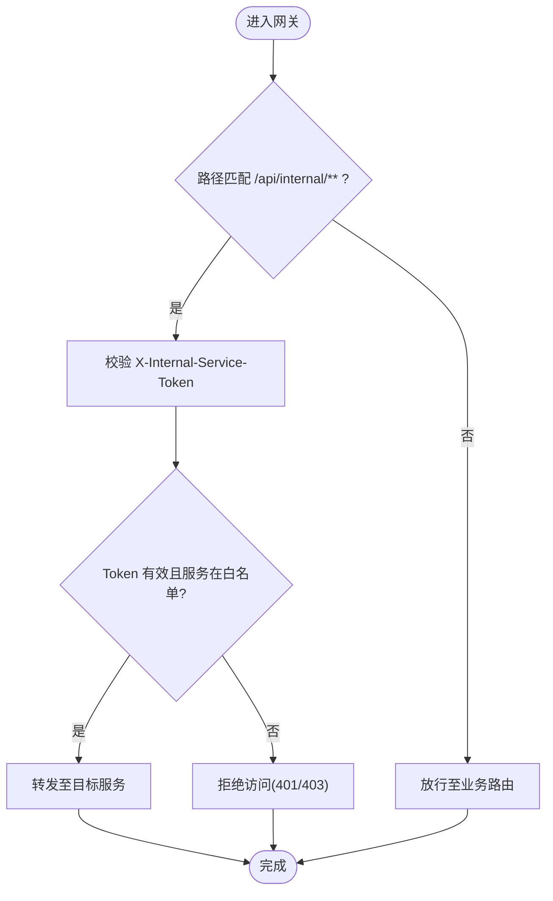
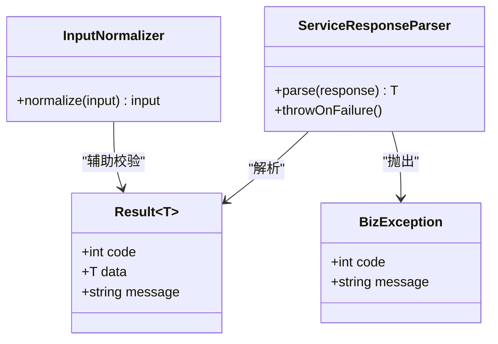
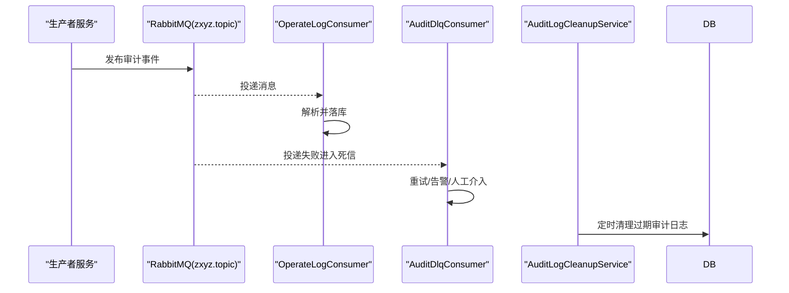
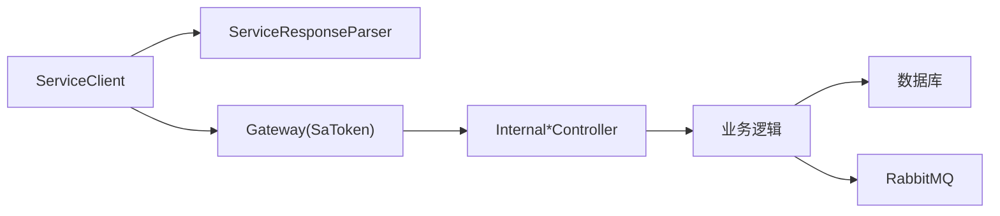

# 内部服务调用接口

<cite>
**本文引用的文件**   
- [zxyz-common/src/main/java/uno/acloud/client/AbstractServiceClient.java](file://ZXYZdatabaseBack/zxyz-common/src/main/java/uno/acloud/client/AbstractServiceClient.java)
- [zxyz-common/src/main/java/uno/acloud/client/ConfigServiceClient.java](file://ZXYZdatabaseBack/zxyz-common/src/main/java/uno/acloud/client/ConfigServiceClient.java)
- [zxyz-common/src/main/java/uno/acloud/client/TeamServiceClient.java](file://ZXYZdatabaseBack/zxyz-common/src/main/java/uno/acloud/client/TeamServiceClient.java)
- [zxyz-common/src/main/java/uno/acloud/client/UserQueryClient.java](file://ZXYZdatabaseBack/zxyz-common/src/main/java/uno/acloud/client/UserQueryClient.java)
- [zxyz-common/src/main/java/uno/acloud/client/FileStorageClient.java](file://ZXYZdatabaseBack/zxyz-common/src/main/java/uno/acloud/client/FileStorageClient.java)
- [zxyz-common/src/main/java/uno/acloud/client/ServiceResponseParser.java](file://ZXYZdatabaseBack/zxyz-common/src/main/java/uno/acloud/client/ServiceResponseParser.java)
- [zxyz-admin-service/src/main/java/uno/acloud/admin/config/SaTokenConfigure.java](file://ZXYZdatabaseBack/zxyz-admin-service/src/main/java/uno/acloud/admin/config/SaTokenConfigure.java)
- [zxyz-gateway/src/main/java/uno/acloud/gateway/filter/SaTokenFilterConfig.java](file://ZXYZdatabaseBack/zxyz-gateway/src/main/java/uno/acloud/gateway/filter/SaTokenFilterConfig.java)
- [nacos-config/zxyz-static.yml](file://nacos-config/zxyz-static.yml)
- [nacos-config/zxyz-dynamic.yml](file://nacos-config/zxyz-dynamic.yml)
- [nacos-config/zxyz-gateway.yml](file://nacos-config/zxyz-gateway.yml)
- [nacos-config/zxyz-email-service.yml](file://nacos-config/zxyz-email-service.yml)
- [nacos-config/zxyz-file-service.yml](file://nacos-config/zxyz-file-service.yml)
- [nacos-config/zxyz-im-service.yml](file://nacos-config/zxyz-im-service.yml)
- [nacos-config/zxyz-team-service.yml](file://nacos-config/zxyz-team-service.yml)
- [nacos-config/zxyz-user-service.yml](file://nacos-config/zxyz-user-service.yml)
- [nacos-config/zxyz-project-service.yml](file://nacos-config/zxyz-project-service.yml)
- [nacos-config/zxyz-share-service.yml](file://nacos-config/zxyz-share-service.yml)
- [nacos-config/zxyz-audit-service.yml](file://nacos-config/zxyz-audit-service.yml)
- [nacos-config/zxyz-admin-service.yml](file://nacos-config/zxyz-admin-service.yml)
- [ZXYZdatabaseBack/zxyz-common/src/main/resources/application-common.yml](file://ZXYZdatabaseBack/zxyz-common/src/main/resources/application-common.yml)
- [ZXYZdatabaseBack/zxyz-email-service/src/main/java/uno/acloud/email/controller/InternalEmailController.java](file://ZXYZdatabaseBack/zxyz-email-service/src/main/java/uno/acloud/email/controller/InternalEmailController.java)
- [ZXYZdatabaseBack/zxyz-file-service/src/main/java/uno/acloud/file/controller/InternalFileController.java](file://ZXYZdatabaseBack/zxyz-file-service/src/main/java/uno/acloud/file/controller/InternalFileController.java)
- [ZXYZdatabaseBack/zxyz-im-service/src/main/java/uno/acloud/im/controller/InternalImController.java](file://ZXYZdatabaseBack/zxyz-im-service/src/main/java/uno/acloud/im/controller/InternalImController.java)
- [ZXYZdatabaseBack/zxyz-team-service/src/main/java/uno/acloud/team/controller/InternalTeamController.java](file://ZXYZdatabaseBack/zxyz-team-service/src/main/java/uno/acloud/team/controller/InternalTeamController.java)
- [ZXYZdatabaseBack/zxyz-user-service/src/main/java/uno/acloud/user/controller/InternalUserController.java](file://ZXYZdatabaseBack/zxyz-user-service/src/main/java/uno/acloud/user/controller/InternalUserController.java)
- [ZXYZdatabaseBack/zxyz-project-service/src/main/java/uno/acloud/project/controller/InternalProjectController.java](file://ZXYZdatabaseBack/zxyz-project-service/src/main/java/uno/acloud/project/controller/InternalProjectController.java)
- [ZXYZdatabaseBack/zxyz-share-service/src/main/java/uno/acloud/share/controller/InternalShareController.java](file://ZXYZdatabaseBack/zxyz-share-service/src/main/java/uno/acloud/share/controller/InternalShareController.java)
- [ZXYZdatabaseBack/zxyz-audit-service/src/main/java/uno/acloud/audit/mq/OperateLogConsumer.java](file://ZXYZdatabaseBack/zxyz-audit-service/src/main/java/uno/acloud/audit/mq/OperateLogConsumer.java)
- [ZXYZdatabaseBack/zxyz-audit-service/src/main/java/uno/acloud/audit/mq/AuditDlqConsumer.java](file://ZXYZdatabaseBack/zxyz-audit-service/src/main/java/uno/acloud/audit/mq/AuditDlqConsumer.java)
- [ZXYZdatabaseBack/zxyz-audit-service/src/main/java/uno/acloud/audit/service/AuditLogCleanupService.java](file://ZXYZdatabaseBack/zxyz-audit-service/src/main/java/uno/acloud/audit/service/AuditLogCleanupService.java)
- [ZXYZdatabaseBack/zxyz-common/src/main/java/uno/acloud/common/web/Result.java](file://ZXYZdatabaseBack/zxyz-common/src/main/java/uno/acloud/common/web/Result.java)
- [ZXYZdatabaseBack/zxyz-common/src/main/java/uno/acloud/exception/BizException.java](file://ZXYZdatabaseBack/zxyz-common/src/main/java/uno/acloud/exception/BizException.java)
- [ZXYZdatabaseBack/zxyz-common/src/main/java/uno/acloud/common/util/InputNormalizer.java](file://ZXYZdatabaseBack/zxyz-common/src/main/java/uno/acloud/common/util/InputNormalizer.java)
- [ZXYZdatabaseBack/zxyz-common/src/main/java/uno/acloud/satoken/SaTokenUtil.java](file://ZXYZdatabaseBack/zxyz-common/src/main/java/uno/acloud/satoken/SaTokenUtil.java)
- [ZXYZdatabaseBack/zxyz-common/src/main/java/uno/acloud/common/permission/TeamPermissionPolicy.java](file://ZXYZdatabaseBack/zxyz-common/src/main/java/uno/acloud/common/permission/TeamPermissionPolicy.java)
</cite>

## 目录
1. [简介](#简介)
2. [项目结构](#项目结构)
3. [核心组件](#核心组件)
4. [架构总览](#架构总览)
5. [详细组件分析](#详细组件分析)
6. [依赖关系分析](#依赖关系分析)
7. [性能考虑](#性能考虑)
8. [故障排查指南](#故障排查指南)
9. [结论](#结论)
10. [附录](#附录)

## 简介
本文件面向 ZXYZ 微服务团队，统一规范与说明“内部服务调用接口”的设计与实践。内容覆盖：
- 微服务间通信架构（同步 REST + 异步 MQ）
- 窄端点设计原则与投影模式应用
- 内部鉴权机制（X-Internal-Service-Token、SaToken 过滤器、服务白名单）
- 服务发现、负载均衡、熔断降级配置
- 内部接口设计规范（禁止公网访问、专用 Projection VO、手动字段映射避免 treeToValue）
- 错误处理、超时配置、重试机制
- 客户端使用示例、最佳实践与性能优化建议

## 项目结构
ZXYZ 采用多模块 Maven 工程，后端包含多个独立服务与公共库 zxyz-common；前端为 Vue 3 SPA。内部服务间通过 zxyz-common 中的 ServiceClient 进行同步调用，并通过 RabbitMQ Topic Exchange 进行异步事件通信。

图表来源
- [nacos-config/zxyz-gateway.yml](file://nacos-config/zxyz-gateway.yml)
- [nacos-config/zxyz-email-service.yml](file://nacos-config/zxyz-email-service.yml)
- [nacos-config/zxyz-file-service.yml](file://nacos-config/zxyz-file-service.yml)
- [nacos-config/zxyz-im-service.yml](file://nacos-config/zxyz-im-service.yml)
- [nacos-config/zxyz-team-service.yml](file://nacos-config/zxyz-team-service.yml)
- [nacos-config/zxyz-user-service.yml](file://nacos-config/zxyz-user-service.yml)
- [nacos-config/zxyz-project-service.yml](file://nacos-config/zxyz-project-service.yml)
- [nacos-config/zxyz-share-service.yml](file://nacos-config/zxyz-share-service.yml)
- [nacos-config/zxyz-audit-service.yml](file://nacos-config/zxyz-audit-service.yml)
- [nacos-config/zxyz-admin-service.yml](file://nacos-config/zxyz-admin-service.yml)

章节来源
- [ZXYZdatabaseBack/zxyz-common/src/main/resources/application-common.yml](file://ZXYZdatabaseBack/zxyz-common/src/main/resources/application-common.yml)
- [nacos-config/zxyz-static.yml](file://nacos-config/zxyz-static.yml)
- [nacos-config/zxyz-dynamic.yml](file://nacos-config/zxyz-dynamic.yml)

## 核心组件
- 抽象客户端与响应解析器
  - AbstractServiceClient：封装 HTTP 客户端、请求头注入（X-Internal-Service-Token）、基础重试与超时策略。
  - ServiceResponseParser：统一解析 Result<T> 响应体，提取 code/data/message，并抛出 BizException。
- 具体 ServiceClient
  - ConfigServiceClient、TeamServiceClient、UserQueryClient、FileStorageClient：按服务域暴露窄端点调用方法，返回专用 Projection VO。
- 安全与鉴权
  - SaTokenConfigure：各服务内 SaToken 配置，用于会话校验与权限控制。
  - SaTokenFilterConfig：网关层拦截 /api/internal/** 路径，拒绝无 Token 或非法 Token 的公网访问。
- 内部控制器（提供方）
  - Internal*Controller：每个服务提供 /api/internal/** 下的最小化接口，仅接受内部调用，返回 Projection VO。
- 异步审计与消息
  - OperateLogConsumer、AuditDlqConsumer、AuditLogCleanupService：基于 RabbitMQ 的审计日志消费、死信处理与清理。

章节来源
- [zxyz-common/src/main/java/uno/acloud/client/AbstractServiceClient.java](file://ZXYZdatabaseBack/zxyz-common/src/main/java/uno/acloud/client/AbstractServiceClient.java)
- [zxyz-common/src/main/java/uno/acloud/client/ServiceResponseParser.java](file://ZXYZdatabaseBack/zxyz-common/src/main/java/uno/acloud/client/ServiceResponseParser.java)
- [zxyz-common/src/main/java/uno/acloud/client/ConfigServiceClient.java](file://ZXYZdatabaseBack/zxyz-common/src/main/java/uno/acloud/client/ConfigServiceClient.java)
- [zxyz-common/src/main/java/uno/acloud/client/TeamServiceClient.java](file://ZXYZdatabaseBack/zxyz-common/src/main/java/uno/acloud/client/TeamServiceClient.java)
- [zxyz-common/src/main/java/uno/acloud/client/UserQueryClient.java](file://ZXYZdatabaseBack/zxyz-common/src/main/java/uno/acloud/client/UserQueryClient.java)
- [zxyz-common/src/main/java/uno/acloud/client/FileStorageClient.java](file://ZXYZdatabaseBack/zxyz-common/src/main/java/uno/acloud/client/FileStorageClient.java)
- [zxyz-admin-service/src/main/java/uno/acloud/admin/config/SaTokenConfigure.java](file://ZXYZdatabaseBack/zxyz-admin-service/src/main/java/uno/acloud/admin/config/SaTokenConfigure.java)
- [zxyz-gateway/src/main/java/uno/acloud/gateway/filter/SaTokenFilterConfig.java](file://ZXYZdatabaseBack/zxyz-gateway/src/main/java/uno/acloud/gateway/filter/SaTokenFilterConfig.java)
- [ZXYZdatabaseBack/zxyz-email-service/src/main/java/uno/acloud/email/controller/InternalEmailController.java](file://ZXYZdatabaseBack/zxyz-email-service/src/main/java/uno/acloud/email/controller/InternalEmailController.java)
- [ZXYZdatabaseBack/zxyz-file-service/src/main/java/uno/acloud/file/controller/InternalFileController.java](file://ZXYZdatabaseBack/zxyz-file-service/src/main/java/uno/acloud/file/controller/InternalFileController.java)
- [ZXYZdatabaseBack/zxyz-im-service/src/main/java/uno/acloud/im/controller/InternalImController.java](file://ZXYZdatabaseBack/zxyz-im-service/src/main/java/uno/acloud/im/controller/InternalImController.java)
- [ZXYZdatabaseBack/zxyz-team-service/src/main/java/uno/acloud/team/controller/InternalTeamController.java](file://ZXYZdatabaseBack/zxyz-team-service/src/main/java/uno/acloud/team/controller/InternalTeamController.java)
- [ZXYZdatabaseBack/zxyz-user-service/src/main/java/uno/acloud/user/controller/InternalUserController.java](file://ZXYZdatabaseBack/zxyz-user-service/src/main/java/uno/acloud/user/controller/InternalUserController.java)
- [ZXYZdatabaseBack/zxyz-project-service/src/main/java/uno/acloud/project/controller/InternalProjectController.java](file://ZXYZdatabaseBack/zxyz-project-service/src/main/java/uno/acloud/project/controller/InternalProjectController.java)
- [ZXYZdatabaseBack/zxyz-share-service/src/main/java/uno/acloud/share/controller/InternalShareController.java](file://ZXYZdatabaseBack/zxyz-share-service/src/main/java/uno/acloud/share/controller/InternalShareController.java)
- [ZXYZdatabaseBack/zxyz-audit-service/src/main/java/uno/acloud/audit/mq/OperateLogConsumer.java](file://ZXYZdatabaseBack/zxyz-audit-service/src/main/java/uno/acloud/audit/mq/OperateLogConsumer.java)
- [ZXYZdatabaseBack/zxyz-audit-service/src/main/java/uno/acloud/audit/mq/AuditDlqConsumer.java](file://ZXYZdatabaseBack/zxyz-audit-service/src/main/java/uno/acloud/audit/mq/AuditDlqConsumer.java)
- [ZXYZdatabaseBack/zxyz-audit-service/src/main/java/uno/acloud/audit/service/AuditLogCleanupService.java](file://ZXYZdatabaseBack/zxyz-audit-service/src/main/java/uno/acloud/audit/service/AuditLogCleanupService.java)

## 架构总览
内部服务调用遵循“窄端点 + 投影模式 + 内部鉴权”的原则，所有内部接口统一以 /api/internal/** 前缀暴露，并由 Gateway 的 SaToken 过滤器强制校验 X-Internal-Service-Token。

图表来源
- [zxyz-common/src/main/java/uno/acloud/client/AbstractServiceClient.java](file://ZXYZdatabaseBack/zxyz-common/src/main/java/uno/acloud/client/AbstractServiceClient.java)
- [zxyz-common/src/main/java/uno/acloud/client/ServiceResponseParser.java](file://ZXYZdatabaseBack/zxyz-common/src/main/java/uno/acloud/client/ServiceResponseParser.java)
- [zxyz-gateway/src/main/java/uno/acloud/gateway/filter/SaTokenFilterConfig.java](file://ZXYZdatabaseBack/zxyz-gateway/src/main/java/uno/acloud/gateway/filter/SaTokenFilterConfig.java)
- [nacos-config/zxyz-static.yml](file://nacos-config/zxyz-static.yml)

章节来源
- [nacos-config/zxyz-gateway.yml](file://nacos-config/zxyz-gateway.yml)
- [nacos-config/zxyz-static.yml](file://nacos-config/zxyz-static.yml)

## 详细组件分析

### 内部鉴权与安全机制
- 头部验证
  - 所有内部调用必须在请求头携带 X-Internal-Service-Token。
  - AbstractServiceClient 负责在每次出站请求时注入该头部。
- 网关过滤
  - SaTokenFilterConfig 对 /api/internal/** 路径进行拦截，未携带或非法 Token 的请求将被拒绝。
- 服务白名单
  - 通过 nacos 配置维护允许调用的服务列表，防止任意服务滥用内部接口。
- 会话与权限
  - 各服务内 SaTokenConfigure 管理会话与权限策略，确保内部调用具备必要上下文。

图表来源
- [zxyz-gateway/src/main/java/uno/acloud/gateway/filter/SaTokenFilterConfig.java](file://ZXYZdatabaseBack/zxyz-gateway/src/main/java/uno/acloud/gateway/filter/SaTokenFilterConfig.java)
- [nacos-config/zxyz-static.yml](file://nacos-config/zxyz-static.yml)

章节来源
- [zxyz-admin-service/src/main/java/uno/acloud/admin/config/SaTokenConfigure.java](file://ZXYZdatabaseBack/zxyz-admin-service/src/main/java/uno/acloud/admin/config/SaTokenConfigure.java)
- [zxyz-gateway/src/main/java/uno/acloud/gateway/filter/SaTokenFilterConfig.java](file://ZXYZdatabaseBack/zxyz-gateway/src/main/java/uno/acloud/gateway/filter/SaTokenFilterConfig.java)
- [nacos-config/zxyz-static.yml](file://nacos-config/zxyz-static.yml)

### 服务发现与负载均衡
- 服务注册与发现
  - 各服务通过 Nacos 注册自身实例，调用方通过服务名解析到可用实例。
- 负载均衡策略
  - 默认轮询或根据 Nacos 权重分配；可在动态配置中调整。
- 健康检查
  - 结合 Nacos 健康检查与网关健康探针，剔除不健康实例。

章节来源
- [nacos-config/zxyz-dynamic.yml](file://nacos-config/zxyz-dynamic.yml)
- [nacos-config/zxyz-gateway.yml](file://nacos-config/zxyz-gateway.yml)

### 熔断与降级
- 熔断策略
  - 针对关键内部接口启用熔断，失败率或慢调用阈值触发熔断，快速失败避免雪崩。
- 降级策略
  - 熔断后返回缓存或默认值，保证主流程可用性。
- 重试机制
  - 对幂等 GET 请求可配置有限次重试；POST 等非幂等请求谨慎重试。

章节来源
- [nacos-config/zxyz-dynamic.yml](file://nacos-config/zxyz-dynamic.yml)
- [ZXYZdatabaseBack/zxyz-common/src/main/resources/application-common.yml](file://ZXYZdatabaseBack/zxyz-common/src/main/resources/application-common.yml)

### 内部接口设计规范
- 窄端点设计
  - 每个内部接口只暴露调用方所需的最小字段与操作，减少耦合与泄露风险。
- 投影模式
  - 提供方返回专用 Projection VO，禁止返回胖 DTO；调用方与提供方各自维护投影类，不放入 zxyz-common。
- 手动字段映射
  - 使用 JsonNode 手动映射字段，避免 treeToValue 带来的强耦合与版本兼容问题。
- 禁止公网访问
  - 所有内部接口必须位于 /api/internal/**，由网关强制拦截。

章节来源
- [ZXYZdatabaseBack/zxyz-email-service/src/main/java/uno/acloud/email/controller/InternalEmailController.java](file://ZXYZdatabaseBack/zxyz-email-service/src/main/java/uno/acloud/email/controller/InternalEmailController.java)
- [ZXYZdatabaseBack/zxyz-file-service/src/main/java/uno/acloud/file/controller/InternalFileController.java](file://ZXYZdatabaseBack/zxyz-file-service/src/main/java/uno/acloud/file/controller/InternalFileController.java)
- [ZXYZdatabaseBack/zxyz-im-service/src/main/java/uno/acloud/im/controller/InternalImController.java](file://ZXYZdatabaseBack/zxyz-im-service/src/main/java/uno/acloud/im/controller/InternalImController.java)
- [ZXYZdatabaseBack/zxyz-team-service/src/main/java/uno/acloud/team/controller/InternalTeamController.java](file://ZXYZdatabaseBack/zxyz-team-service/src/main/java/uno/acloud/team/controller/InternalTeamController.java)
- [ZXYZdatabaseBack/zxyz-user-service/src/main/java/uno/acloud/user/controller/InternalUserController.java](file://ZXYZdatabaseBack/zxyz-user-service/src/main/java/uno/acloud/user/controller/InternalUserController.java)
- [ZXYZdatabaseBack/zxyz-project-service/src/main/java/uno/acloud/project/controller/InternalProjectController.java](file://ZXYZdatabaseBack/zxyz-project-service/src/main/java/uno/acloud/project/controller/InternalProjectController.java)
- [ZXYZdatabaseBack/zxyz-share-service/src/main/java/uno/acloud/share/controller/InternalShareController.java](file://ZXYZdatabaseBack/zxyz-share-service/src/main/java/uno/acloud/share/controller/InternalShareController.java)

### 客户端使用示例与最佳实践
- 客户端封装
  - 使用 AbstractServiceClient 作为基类，注入 X-Internal-Service-Token 与统一超时/重试策略。
  - 各 ServiceClient 暴露窄端点方法，返回专用 Projection VO。
- 调用步骤
  - 构造请求参数（窄参数），设置必要上下文（如 teamId、userId）。
  - 调用 ServiceClient 方法，解析 Result<T> 响应。
  - 捕获 BizException 并进行业务处理。
- 最佳实践
  - 严格使用窄端点与窄参数，避免传递冗余数据。
  - 手动字段映射，保持投影类独立演进。
  - 合理设置超时与重试，避免级联失败。
  - 记录关键链路追踪信息，便于问题定位。

章节来源
- [zxyz-common/src/main/java/uno/acloud/client/AbstractServiceClient.java](file://ZXYZdatabaseBack/zxyz-common/src/main/java/uno/acloud/client/AbstractServiceClient.java)
- [zxyz-common/src/main/java/uno/acloud/client/ConfigServiceClient.java](file://ZXYZdatabaseBack/zxyz-common/src/main/java/uno/acloud/client/ConfigServiceClient.java)
- [zxyz-common/src/main/java/uno/acloud/client/TeamServiceClient.java](file://ZXYZdatabaseBack/zxyz-common/src/main/java/uno/acloud/client/TeamServiceClient.java)
- [zxyz-common/src/main/java/uno/acloud/client/UserQueryClient.java](file://ZXYZdatabaseBack/zxyz-common/src/main/java/uno/acloud/client/UserQueryClient.java)
- [zxyz-common/src/main/java/uno/acloud/client/FileStorageClient.java](file://ZXYZdatabaseBack/zxyz-common/src/main/java/uno/acloud/client/FileStorageClient.java)
- [zxyz-common/src/main/java/uno/acloud/client/ServiceResponseParser.java](file://ZXYZdatabaseBack/zxyz-common/src/main/java/uno/acloud/client/ServiceResponseParser.java)

### 错误处理与异常模型
- 统一响应结构
  - Result<T> 的 code=1 表示成功，其他码表示失败；message 描述错误原因。
- 异常类型
  - BizException 用于业务异常，ServiceResponseParser 将非成功响应转换为 BizException。
- 输入规范化
  - InputNormalizer 对输入进行清洗与标准化，减少无效请求。

图表来源
- [ZXYZdatabaseBack/zxyz-common/src/main/java/uno/acloud/common/web/Result.java](file://ZXYZdatabaseBack/zxyz-common/src/main/java/uno/acloud/common/web/Result.java)
- [ZXYZdatabaseBack/zxyz-common/src/main/java/uno/acloud/exception/BizException.java](file://ZXYZdatabaseBack/zxyz-common/src/main/java/uno/acloud/exception/BizException.java)
- [zxyz-common/src/main/java/uno/acloud/client/ServiceResponseParser.java](file://ZXYZdatabaseBack/zxyz-common/src/main/java/uno/acloud/client/ServiceResponseParser.java)
- [ZXYZdatabaseBack/zxyz-common/src/main/java/uno/acloud/common/util/InputNormalizer.java](file://ZXYZdatabaseBack/zxyz-common/src/main/java/uno/acloud/common/util/InputNormalizer.java)

章节来源
- [ZXYZdatabaseBack/zxyz-common/src/main/java/uno/acloud/common/web/Result.java](file://ZXYZdatabaseBack/zxyz-common/src/main/java/uno/acloud/common/web/Result.java)
- [ZXYZdatabaseBack/zxyz-common/src/main/java/uno/acloud/exception/BizException.java](file://ZXYZdatabaseBack/zxyz-common/src/main/java/uno/acloud/exception/BizException.java)
- [ZXYZdatabaseBack/zxyz-common/src/main/java/uno/acloud/common/util/InputNormalizer.java](file://ZXYZdatabaseBack/zxyz-common/src/main/java/uno/acloud/common/util/InputNormalizer.java)

### 异步审计与消息处理
- 消息模型
  - 基于 RabbitMQ Topic Exchange zxyz.topic，发布操作审计事件。
- 消费者
  - OperateLogConsumer 消费审计日志，持久化到数据库。
  - AuditDlqConsumer 处理死信队列，保障可靠性。
- 清理服务
  - AuditLogCleanupService 定期清理过期审计日志，控制存储增长。

图表来源
- [ZXYZdatabaseBack/zxyz-audit-service/src/main/java/uno/acloud/audit/mq/OperateLogConsumer.java](file://ZXYZdatabaseBack/zxyz-audit-service/src/main/java/uno/acloud/audit/mq/OperateLogConsumer.java)
- [ZXYZdatabaseBack/zxyz-audit-service/src/main/java/uno/acloud/audit/mq/AuditDlqConsumer.java](file://ZXYZdatabaseBack/zxyz-audit-service/src/main/java/uno/acloud/audit/mq/AuditDlqConsumer.java)
- [ZXYZdatabaseBack/zxyz-audit-service/src/main/java/uno/acloud/audit/service/AuditLogCleanupService.java](file://ZXYZdatabaseBack/zxyz-audit-service/src/main/java/uno/acloud/audit/service/AuditLogCleanupService.java)

章节来源
- [ZXYZdatabaseBack/zxyz-audit-service/src/main/java/uno/acloud/audit/mq/OperateLogConsumer.java](file://ZXYZdatabaseBack/zxyz-audit-service/src/main/java/uno/acloud/audit/mq/OperateLogConsumer.java)
- [ZXYZdatabaseBack/zxyz-audit-service/src/main/java/uno/acloud/audit/mq/AuditDlqConsumer.java](file://ZXYZdatabaseBack/zxyz-audit-service/src/main/java/uno/acloud/audit/mq/AuditDlqConsumer.java)
- [ZXYZdatabaseBack/zxyz-audit-service/src/main/java/uno/acloud/audit/service/AuditLogCleanupService.java](file://ZXYZdatabaseBack/zxyz-audit-service/src/main/java/uno/acloud/audit/service/AuditLogCleanupService.java)

## 依赖关系分析
- 客户端与服务提供方解耦
  - 通过窄端点与投影模式，降低双方耦合度，支持独立演进。
- 网关与服务的鉴权边界清晰
  - 网关负责入口鉴权，服务内部负责细粒度权限控制。
- 配置集中管理
  - Nacos 统一管理静态与动态配置，便于灰度与热更新。

图表来源
- [zxyz-common/src/main/java/uno/acloud/client/AbstractServiceClient.java](file://ZXYZdatabaseBack/zxyz-common/src/main/java/uno/acloud/client/AbstractServiceClient.java)
- [zxyz-common/src/main/java/uno/acloud/client/ServiceResponseParser.java](file://ZXYZdatabaseBack/zxyz-common/src/main/java/uno/acloud/client/ServiceResponseParser.java)
- [zxyz-gateway/src/main/java/uno/acloud/gateway/filter/SaTokenFilterConfig.java](file://ZXYZdatabaseBack/zxyz-gateway/src/main/java/uno/acloud/gateway/filter/SaTokenFilterConfig.java)

章节来源
- [nacos-config/zxyz-static.yml](file://nacos-config/zxyz-static.yml)
- [nacos-config/zxyz-dynamic.yml](file://nacos-config/zxyz-dynamic.yml)

## 性能考虑
- 连接池与超时
  - 合理配置 HTTP 连接池大小、连接超时与读取超时，避免资源耗尽。
- 缓存策略
  - 对热点配置与查询结果使用 Redis 缓存，降低数据库压力。
- 批量与分页
  - 内部接口尽量支持批量操作与分页查询，减少往返次数。
- 监控与告警
  - 接入链路追踪与指标采集，及时发现问题并告警。

[本节为通用指导，无需特定文件引用]

## 故障排查指南
- 常见问题
  - Token 缺失或非法：检查 X-Internal-Service-Token 是否注入，确认服务在白名单。
  - 超时或连接失败：检查网络连通性、连接池配置与下游服务健康状态。
  - 响应解析失败：确认 Result.code 是否为 1，检查字段映射是否正确。
- 诊断步骤
  - 查看网关日志与 SaToken 过滤器日志。
  - 检查 Nacos 配置与服务注册状态。
  - 查看下游服务日志与数据库/MQ 状态。
- 恢复措施
  - 修正 Token 配置或服务白名单。
  - 调整超时与重试策略。
  - 清理死信队列与过期审计日志。

章节来源
- [zxyz-gateway/src/main/java/uno/acloud/gateway/filter/SaTokenFilterConfig.java](file://ZXYZdatabaseBack/zxyz-gateway/src/main/java/uno/acloud/gateway/filter/SaTokenFilterConfig.java)
- [nacos-config/zxyz-static.yml](file://nacos-config/zxyz-static.yml)
- [ZXYZdatabaseBack/zxyz-audit-service/src/main/java/uno/acloud/audit/mq/AuditDlqConsumer.java](file://ZXYZdatabaseBack/zxyz-audit-service/src/main/java/uno/acloud/audit/mq/AuditDlqConsumer.java)
- [ZXYZdatabaseBack/zxyz-audit-service/src/main/java/uno/acloud/audit/service/AuditLogCleanupService.java](file://ZXYZdatabaseBack/zxyz-audit-service/src/main/java/uno/acloud/audit/service/AuditLogCleanupService.java)

## 结论
ZXYZ 的内部服务调用体系以“窄端点 + 投影模式 + 内部鉴权”为核心，结合 Nacos 服务发现与 RabbitMQ 异步通信，构建了高内聚、低耦合、可扩展的微服务协作框架。通过统一的客户端封装、严格的鉴权策略与完善的错误处理机制，保障了系统稳定性与安全性。建议团队在新增内部接口时严格遵循本文规范，持续优化性能与可观测性。

[本节为总结性内容，无需特定文件引用]

## 附录
- 术语表
  - 窄端点：仅暴露调用方所需的最小接口与字段。
  - 投影模式：提供方返回专用 VO，避免直接暴露领域模型。
  - 内部鉴权：通过 Token 与白名单限制内部接口访问。
- 参考配置
  - Nacos 静态与动态配置：zxyz-static.yml、zxyz-dynamic.yml
  - 网关配置：zxyz-gateway.yml
  - 各服务配置：对应 service 的 yml 文件

[本节为补充信息，无需特定文件引用]