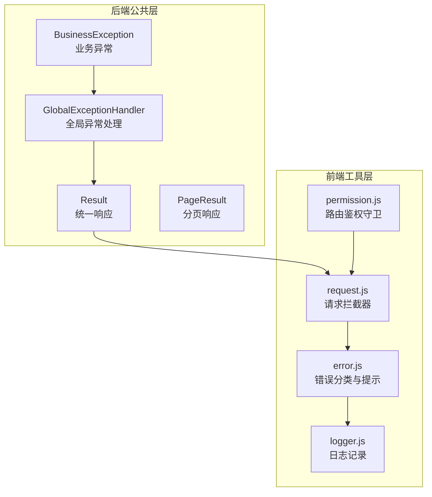
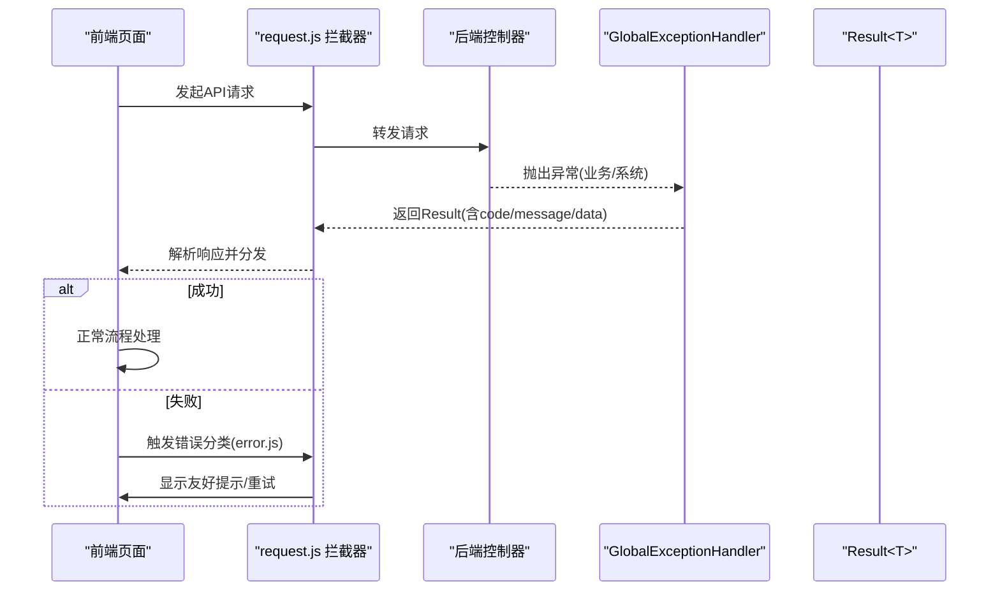
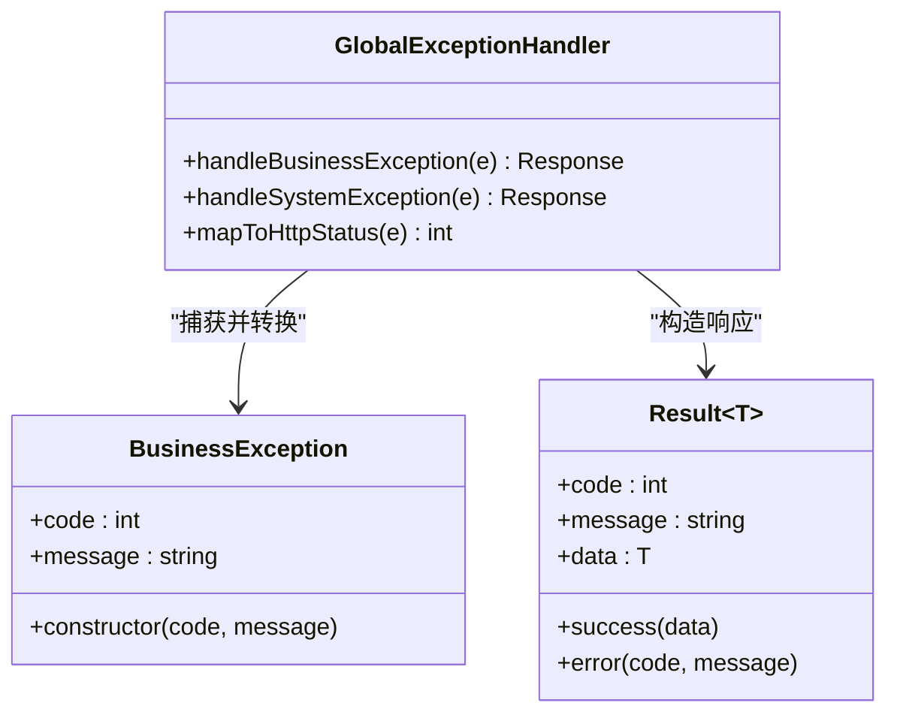
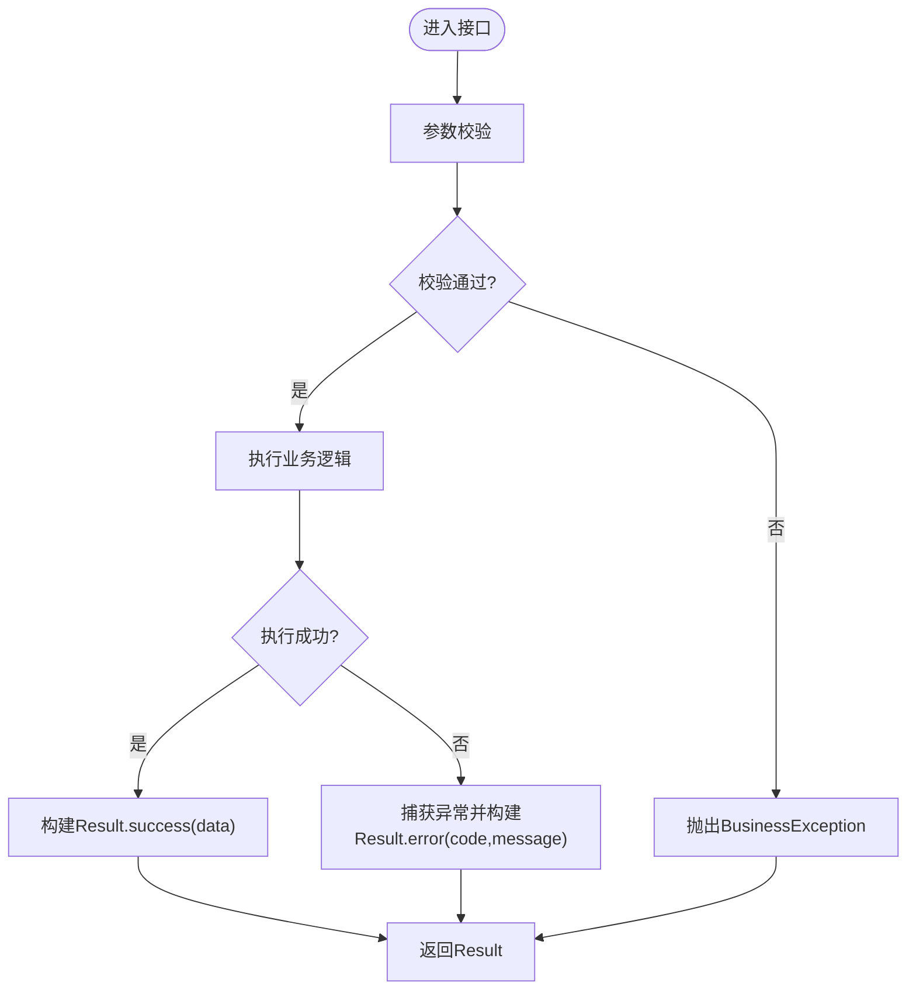
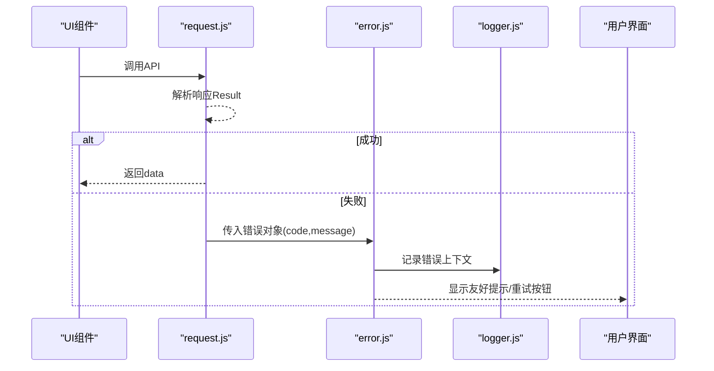
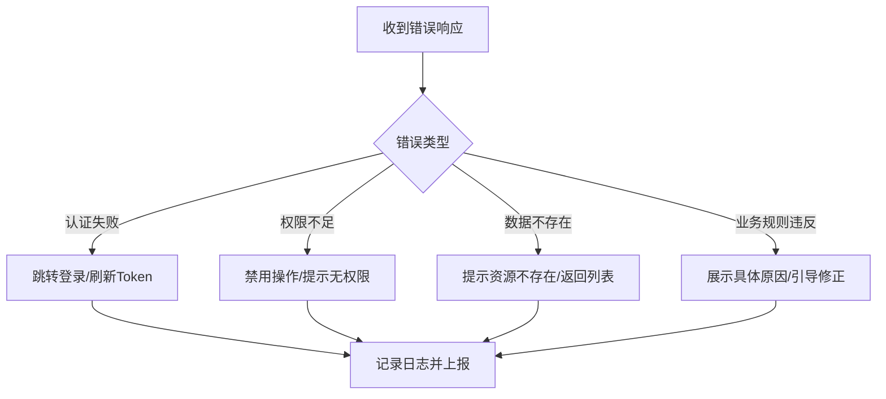
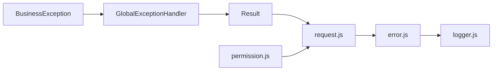

# 错误处理与状态码

<cite>
**本文引用的文件**   
- [ZXYZdatabaseBack/zxyz-common/src/main/java/uno/acloud/exception/BusinessException.java](file://ZXYZdatabaseBack/zxyz-common/src/main/java/uno/acloud/exception/BusinessException.java)
- [ZXYZdatabaseBack/zxyz-common/src/main/java/uno/acloud/common/web/GlobalExceptionHandler.java](file://ZXYZdatabaseBack/zxyz-common/src/main/java/uno/acloud/common/web/GlobalExceptionHandler.java)
- [ZXYZdatabaseBack/zxyz-common/src/main/java/uno/acloud/common/web/Result.java](file://ZXYZdatabaseBack/zxyz-common/src/main/java/uno/acloud/common/web/Result.java)
- [ZXYZdatabaseBack/zxyz-common/src/main/java/uno/acloud/common/web/PageResult.java](file://ZXYZdatabaseBack/zxyz-common/src/main/java/uno/acloud/common/web/PageResult.java)
- [ZXYZdatabaseFront/src/utils/error.js](file://ZXYZdatabaseFront/src/utils/error.js)
- [ZXYZdatabaseFront/src/utils/request.js](file://ZXYZdatabaseFront/src/utils/request.js)
- [ZXYZdatabaseFront/src/utils/logger.js](file://ZXYZdatabaseFront/src/utils/logger.js)
- [ZXYZdatabaseFront/src/router/guards/permission.js](file://ZXYZdatabaseFront/src/router/guards/permission.js)
</cite>

## 目录
1. [简介](#简介)
2. [项目结构](#项目结构)
3. [核心组件](#核心组件)
4. [架构总览](#架构总览)
5. [详细组件分析](#详细组件分析)
6. [依赖关系分析](#依赖关系分析)
7. [性能考虑](#性能考虑)
8. [故障排查指南](#故障排查指南)
9. [结论](#结论)
10. [附录](#附录)

## 简介
本文件面向 ZXYZ 项目的后端与前端，系统化说明统一异常处理机制、错误码规范、HTTP 状态码映射、国际化策略，以及统一的响应格式 Result<T> 与分页响应 PageResult。同时覆盖前端错误展示、网络重试、用户友好提示，并给出认证失败、权限不足、数据不存在、业务规则违反等典型场景的处理方案与最佳实践。

## 项目结构
- 后端采用微服务架构，公共能力集中在 zxyz-common 模块，包括统一异常类、全局异常处理器、统一响应体与分页封装。
- 前端基于 Vue 3 + Element Plus，使用 request 工具拦截器统一处理网络错误，error.js 提供错误分类与提示，logger.js 记录调试信息，路由守卫对鉴权相关错误进行集中处理。

**图表来源** 
- [ZXYZdatabaseBack/zxyz-common/src/main/java/uno/acloud/exception/BusinessException.java](file://ZXYZdatabaseBack/zxyz-common/src/main/java/uno/acloud/exception/BusinessException.java)
- [ZXYZdatabaseBack/zxyz-common/src/main/java/uno/acloud/common/web/GlobalExceptionHandler.java](file://ZXYZdatabaseBack/zxyz-common/src/main/java/uno/acloud/common/web/GlobalExceptionHandler.java)
- [ZXYZdatabaseBack/zxyz-common/src/main/java/uno/acloud/common/web/Result.java](file://ZXYZdatabaseBack/zxyz-common/src/main/java/uno/acloud/common/web/Result.java)
- [ZXYZdatabaseBack/zxyz-common/src/main/java/uno/acloud/common/web/PageResult.java](file://ZXYZdatabaseBack/zxyz-common/src/main/java/uno/acloud/common/web/PageResult.java)
- [ZXYZdatabaseFront/src/utils/request.js](file://ZXYZdatabaseFront/src/utils/request.js)
- [ZXYZdatabaseFront/src/utils/error.js](file://ZXYZdatabaseFront/src/utils/error.js)
- [ZXYZdatabaseFront/src/utils/logger.js](file://ZXYZdatabaseFront/src/utils/logger.js)
- [ZXYZdatabaseFront/src/router/guards/permission.js](file://ZXYZdatabaseFront/src/router/guards/permission.js)

**章节来源**
- [ZXYZdatabaseBack/zxyz-common/src/main/java/uno/acloud/exception/BusinessException.java](file://ZXYZdatabaseBack/zxyz-common/src/main/java/uno/acloud/exception/BusinessException.java)
- [ZXYZdatabaseBack/zxyz-common/src/main/java/uno/acloud/common/web/GlobalExceptionHandler.java](file://ZXYZdatabaseBack/zxyz-common/src/main/java/uno/acloud/common/web/GlobalExceptionHandler.java)
- [ZXYZdatabaseBack/zxyz-common/src/main/java/uno/acloud/common/web/Result.java](file://ZXYZdatabaseBack/zxyz-common/src/main/java/uno/acloud/common/web/Result.java)
- [ZXYZdatabaseBack/zxyz-common/src/main/java/uno/acloud/common/web/PageResult.java](file://ZXYZdatabaseBack/zxyz-common/src/main/java/uno/acloud/common/web/PageResult.java)
- [ZXYZdatabaseFront/src/utils/request.js](file://ZXYZdatabaseFront/src/utils/request.js)
- [ZXYZdatabaseFront/src/utils/error.js](file://ZXYZdatabaseFront/src/utils/error.js)
- [ZXYZdatabaseFront/src/utils/logger.js](file://ZXYZdatabaseFront/src/utils/logger.js)
- [ZXYZdatabaseFront/src/router/guards/permission.js](file://ZXYZdatabaseFront/src/router/guards/permission.js)

## 核心组件
- 统一异常：BusinessException 用于表达业务侧可预期的错误，携带错误码与消息，便于全局处理器转换为标准响应。
- 全局异常处理：GlobalExceptionHandler 捕获系统级与业务级异常，统一映射为 HTTP 状态码与 Result 结构。
- 统一响应：Result<T> 作为所有 API 的响应载体，包含 code、message、data 等字段；成功时 code=1（或约定值），错误时返回具体业务码。
- 分页响应：PageResult<T> 封装分页数据，包含当前页、每页大小、总数、数据列表等。

**章节来源**
- [ZXYZdatabaseBack/zxyz-common/src/main/java/uno/acloud/exception/BusinessException.java](file://ZXYZdatabaseBack/zxyz-common/src/main/java/uno/acloud/exception/BusinessException.java)
- [ZXYZdatabaseBack/zxyz-common/src/main/java/uno/acloud/common/web/GlobalExceptionHandler.java](file://ZXYZdatabaseBack/zxyz-common/src/main/java/uno/acloud/common/web/GlobalExceptionHandler.java)
- [ZXYZdatabaseBack/zxyz-common/src/main/java/uno/acloud/common/web/Result.java](file://ZXYZdatabaseBack/zxyz-common/src/main/java/uno/acloud/common/web/Result.java)
- [ZXYZdatabaseBack/zxyz-common/src/main/java/uno/acloud/common/web/PageResult.java](file://ZXYZdatabaseBack/zxyz-common/src/main/java/uno/acloud/common/web/PageResult.java)

## 架构总览
后端通过 GlobalExceptionHandler 将各类异常收敛为一致的 Result 结构，前端通过 request.js 拦截器统一解析响应，error.js 负责错误分类与提示，logger.js 输出调试日志，permission.js 在路由层面处理鉴权错误。

**图表来源** 
- [ZXYZdatabaseBack/zxyz-common/src/main/java/uno/acloud/common/web/GlobalExceptionHandler.java](file://ZXYZdatabaseBack/zxyz-common/src/main/java/uno/acloud/common/web/GlobalExceptionHandler.java)
- [ZXYZdatabaseBack/zxyz-common/src/main/java/uno/acloud/common/web/Result.java](file://ZXYZdatabaseBack/zxyz-common/src/main/java/uno/acloud/common/web/Result.java)
- [ZXYZdatabaseFront/src/utils/request.js](file://ZXYZdatabaseFront/src/utils/request.js)
- [ZXYZdatabaseFront/src/utils/error.js](file://ZXYZdatabaseFront/src/utils/error.js)

## 详细组件分析

### 统一异常与全局异常处理
- BusinessException：定义业务异常基类，支持错误码与消息传递，便于上层服务抛出自定义错误。
- GlobalExceptionHandler：集中捕获未处理异常，按异常类型映射到合适的 HTTP 状态码，并将错误信息包装为 Result。
- 建议：所有业务校验失败应抛出 BusinessException，避免直接返回错误字符串；系统异常由全局处理器兜底。

**图表来源** 
- [ZXYZdatabaseBack/zxyz-common/src/main/java/uno/acloud/exception/BusinessException.java](file://ZXYZdatabaseBack/zxyz-common/src/main/java/uno/acloud/exception/BusinessException.java)
- [ZXYZdatabaseBack/zxyz-common/src/main/java/uno/acloud/common/web/GlobalExceptionHandler.java](file://ZXYZdatabaseBack/zxyz-common/src/main/java/uno/acloud/common/web/GlobalExceptionHandler.java)
- [ZXYZdatabaseBack/zxyz-common/src/main/java/uno/acloud/common/web/Result.java](file://ZXYZdatabaseBack/zxyz-common/src/main/java/uno/acloud/common/web/Result.java)

**章节来源**
- [ZXYZdatabaseBack/zxyz-common/src/main/java/uno/acloud/exception/BusinessException.java](file://ZXYZdatabaseBack/zxyz-common/src/main/java/uno/acloud/exception/BusinessException.java)
- [ZXYZdatabaseBack/zxyz-common/src/main/java/uno/acloud/common/web/GlobalExceptionHandler.java](file://ZXYZdatabaseBack/zxyz-common/src/main/java/uno/acloud/common/web/GlobalExceptionHandler.java)

### 统一响应格式 Result<T> 与分页响应 PageResult
- Result<T>：包含 code、message、data 三个核心字段。成功时 code 为约定值（如 1），data 承载业务数据；失败时 code 为业务错误码，message 为用户可读描述。
- PageResult<T>：封装分页结果，包含当前页、每页大小、总数、数据列表等，便于前端分页组件直接使用。

**图表来源** 
- [ZXYZdatabaseBack/zxyz-common/src/main/java/uno/acloud/common/web/Result.java](file://ZXYZdatabaseBack/zxyz-common/src/main/java/uno/acloud/common/web/Result.java)
- [ZXYZdatabaseBack/zxyz-common/src/main/java/uno/acloud/common/web/PageResult.java](file://ZXYZdatabaseBack/zxyz-common/src/main/java/uno/acloud/common/web/PageResult.java)
- [ZXYZdatabaseBack/zxyz-common/src/main/java/uno/acloud/exception/BusinessException.java](file://ZXYZdatabaseBack/zxyz-common/src/main/java/uno/acloud/exception/BusinessException.java)

**章节来源**
- [ZXYZdatabaseBack/zxyz-common/src/main/java/uno/acloud/common/web/Result.java](file://ZXYZdatabaseBack/zxyz-common/src/main/java/uno/acloud/common/web/Result.java)
- [ZXYZdatabaseBack/zxyz-common/src/main/java/uno/acloud/common/web/PageResult.java](file://ZXYZdatabaseBack/zxyz-common/src/main/java/uno/acloud/common/web/PageResult.java)

### 前端错误处理：拦截器、分类与提示
- request.js：统一拦截请求与响应，根据后端返回的 code 判断成功/失败，失败时调用 error.js 进行分类与提示，必要时触发重试。
- error.js：定义错误分类（网络错误、认证失败、权限不足、数据不存在、业务规则违反等），并提供用户友好的提示文案与操作建议。
- logger.js：记录关键错误上下文（请求路径、参数、错误码、堆栈摘要），便于定位问题。
- permission.js：在路由守卫中处理鉴权相关错误（如未登录、Token 过期），引导用户重新登录或刷新权限。

**图表来源** 
- [ZXYZdatabaseFront/src/utils/request.js](file://ZXYZdatabaseFront/src/utils/request.js)
- [ZXYZdatabaseFront/src/utils/error.js](file://ZXYZdatabaseFront/src/utils/error.js)
- [ZXYZdatabaseFront/src/utils/logger.js](file://ZXYZdatabaseFront/src/utils/logger.js)

**章节来源**
- [ZXYZdatabaseFront/src/utils/request.js](file://ZXYZdatabaseFront/src/utils/request.js)
- [ZXYZdatabaseFront/src/utils/error.js](file://ZXYZdatabaseFront/src/utils/error.js)
- [ZXYZdatabaseFront/src/utils/logger.js](file://ZXYZdatabaseFront/src/utils/logger.js)
- [ZXYZdatabaseFront/src/router/guards/permission.js](file://ZXYZdatabaseFront/src/router/guards/permission.js)

### 典型错误场景处理
- 认证失败：后端返回特定业务码，前端识别后引导重新登录或刷新 Token。
- 权限不足：后端返回权限相关错误码，前端提示无权限并限制操作入口。
- 数据不存在：后端抛出数据缺失异常，前端提示资源不存在并提供回退路径。
- 业务规则违反：后端校验失败抛出 BusinessException，前端展示具体原因与修正建议。

**图表来源** 
- [ZXYZdatabaseFront/src/utils/error.js](file://ZXYZdatabaseFront/src/utils/error.js)
- [ZXYZdatabaseFront/src/router/guards/permission.js](file://ZXYZdatabaseFront/src/router/guards/permission.js)

**章节来源**
- [ZXYZdatabaseFront/src/utils/error.js](file://ZXYZdatabaseFront/src/utils/error.js)
- [ZXYZdatabaseFront/src/router/guards/permission.js](file://ZXYZdatabaseFront/src/router/guards/permission.js)

## 依赖关系分析
- 后端依赖：BusinessException 被 GlobalExceptionHandler 捕获并转换为 Result；Result 和 PageResult 作为统一响应结构被各服务复用。
- 前端依赖：request.js 依赖 error.js 进行分类与提示，logger.js 记录上下文；permission.js 与 request.js 协作处理鉴权错误。

**图表来源** 
- [ZXYZdatabaseBack/zxyz-common/src/main/java/uno/acloud/exception/BusinessException.java](file://ZXYZdatabaseBack/zxyz-common/src/main/java/uno/acloud/exception/BusinessException.java)
- [ZXYZdatabaseBack/zxyz-common/src/main/java/uno/acloud/common/web/GlobalExceptionHandler.java](file://ZXYZdatabaseBack/zxyz-common/src/main/java/uno/acloud/common/web/GlobalExceptionHandler.java)
- [ZXYZdatabaseBack/zxyz-common/src/main/java/uno/acloud/common/web/Result.java](file://ZXYZdatabaseBack/zxyz-common/src/main/java/uno/acloud/common/web/Result.java)
- [ZXYZdatabaseFront/src/utils/request.js](file://ZXYZdatabaseFront/src/utils/request.js)
- [ZXYZdatabaseFront/src/utils/error.js](file://ZXYZdatabaseFront/src/utils/error.js)
- [ZXYZdatabaseFront/src/utils/logger.js](file://ZXYZdatabaseFront/src/utils/logger.js)
- [ZXYZdatabaseFront/src/router/guards/permission.js](file://ZXYZdatabaseFront/src/router/guards/permission.js)

**章节来源**
- [ZXYZdatabaseBack/zxyz-common/src/main/java/uno/acloud/exception/BusinessException.java](file://ZXYZdatabaseBack/zxyz-common/src/main/java/uno/acloud/exception/BusinessException.java)
- [ZXYZdatabaseBack/zxyz-common/src/main/java/uno/acloud/common/web/GlobalExceptionHandler.java](file://ZXYZdatabaseBack/zxyz-common/src/main/java/uno/acloud/common/web/GlobalExceptionHandler.java)
- [ZXYZdatabaseBack/zxyz-common/src/main/java/uno/acloud/common/web/Result.java](file://ZXYZdatabaseBack/zxyz-common/src/main/java/uno/acloud/common/web/Result.java)
- [ZXYZdatabaseFront/src/utils/request.js](file://ZXYZdatabaseFront/src/utils/request.js)
- [ZXYZdatabaseFront/src/utils/error.js](file://ZXYZdatabaseFront/src/utils/error.js)
- [ZXYZdatabaseFront/src/utils/logger.js](file://ZXYZdatabaseFront/src/utils/logger.js)
- [ZXYZdatabaseFront/src/router/guards/permission.js](file://ZXYZdatabaseFront/src/router/guards/permission.js)

## 性能考虑
- 避免在异常路径中进行重型计算或额外 I/O，确保错误响应快速返回。
- 前端重试策略应设置最大次数与退避间隔，防止雪崩效应。
- 日志记录需控制级别与采样率，生产环境仅记录必要上下文，避免磁盘压力。

[本节为通用指导，不直接分析具体文件]

## 故障排查指南
- 后端定位：查看 GlobalExceptionHandler 的异常映射逻辑，确认错误码与 HTTP 状态码是否正确；检查 BusinessException 的消息是否足够明确。
- 前端定位：通过 logger.js 输出的错误上下文（请求路径、参数、错误码）快速定位问题；检查 error.js 的分类逻辑是否覆盖新错误类型。
- 常见问题：
  - 认证失败但未跳转登录：检查 permission.js 的路由守卫逻辑与 request.js 的重试策略。
  - 错误提示不友好：优化 error.js 的文案与操作建议，结合业务上下文提供更明确的指引。
  - 日志过多或过少：调整 logger.js 的级别与采样策略，确保关键错误可追踪。

**章节来源**
- [ZXYZdatabaseBack/zxyz-common/src/main/java/uno/acloud/common/web/GlobalExceptionHandler.java](file://ZXYZdatabaseBack/zxyz-common/src/main/java/uno/acloud/common/web/GlobalExceptionHandler.java)
- [ZXYZdatabaseBack/zxyz-common/src/main/java/uno/acloud/exception/BusinessException.java](file://ZXYZdatabaseBack/zxyz-common/src/main/java/uno/acloud/exception/BusinessException.java)
- [ZXYZdatabaseFront/src/utils/logger.js](file://ZXYZdatabaseFront/src/utils/logger.js)
- [ZXYZdatabaseFront/src/utils/error.js](file://ZXYZdatabaseFront/src/utils/error.js)
- [ZXYZdatabaseFront/src/router/guards/permission.js](file://ZXYZdatabaseFront/src/router/guards/permission.js)

## 结论
通过统一的异常处理机制与响应格式，ZXYZ 项目在前后端实现了稳定、一致的错误处理能力。BusinessException 与 GlobalExceptionHandler 确保后端错误可预期且易于处理；Result<T> 与 PageResult 简化了数据交互；前端的 request.js、error.js、logger.js 与 permission.js 协同提供了良好的用户体验与可观测性。遵循本文档的规范与实践，可有效提升系统的健壮性与可维护性。

[本节为总结性内容，不直接分析具体文件]

## 附录
- 错误码规范建议：
  - 业务错误码：按模块划分，如 1xxxx 表示通用错误，2xxxx 表示用户相关，3xxxx 表示团队相关等。
  - HTTP 状态码映射：401 对应认证失败，403 对应权限不足，404 对应数据不存在，500 对应系统异常。
  - 国际化：错误消息建议使用 i18n 键值，前端根据语言环境动态渲染。
- 最佳实践：
  - 业务校验失败优先抛出 BusinessException，避免隐式错误传播。
  - 前端错误提示应简洁明了，提供可操作的下一步建议。
  - 日志记录应包含必要上下文，避免敏感信息泄露。

[本节为补充性内容，不直接分析具体文件]