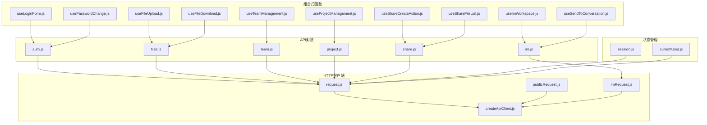
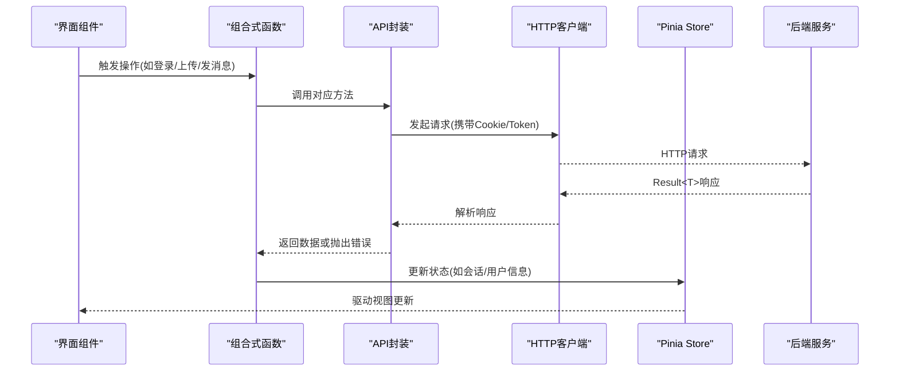
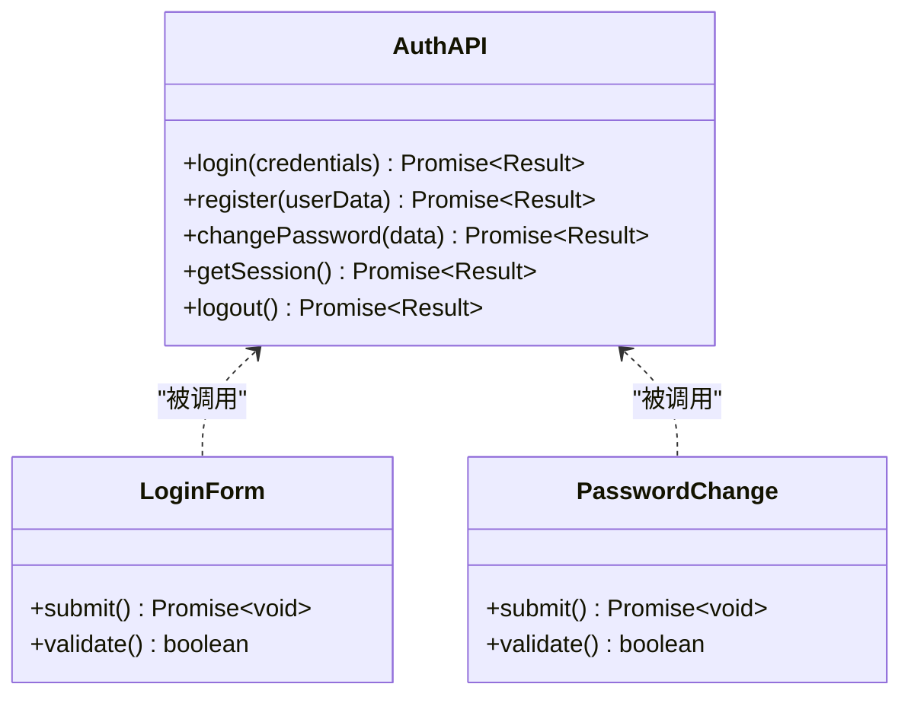
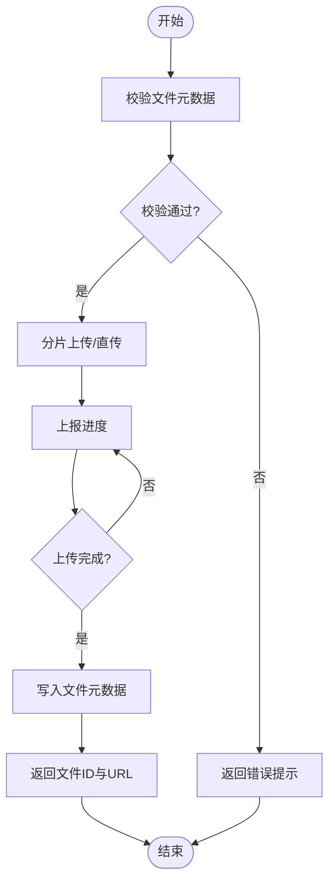
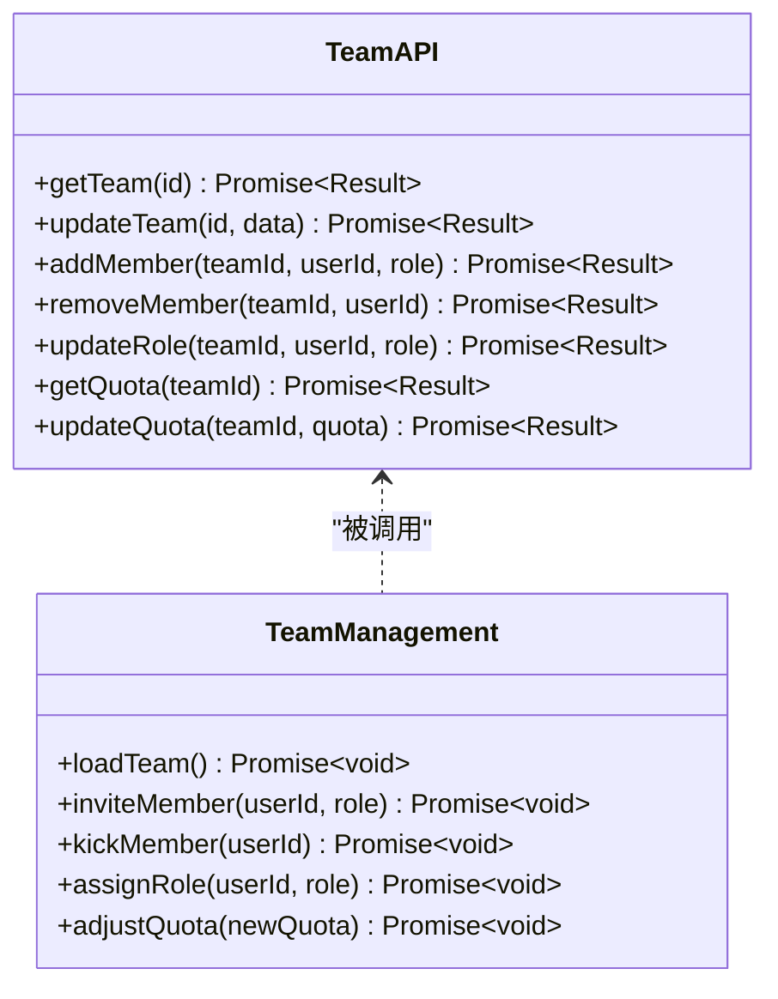
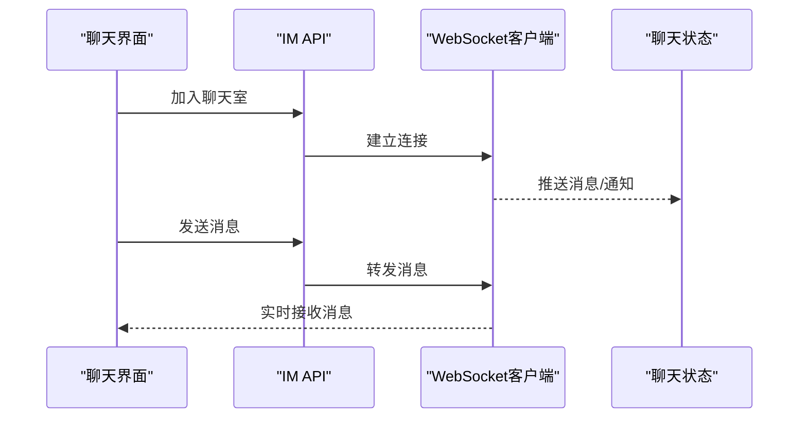
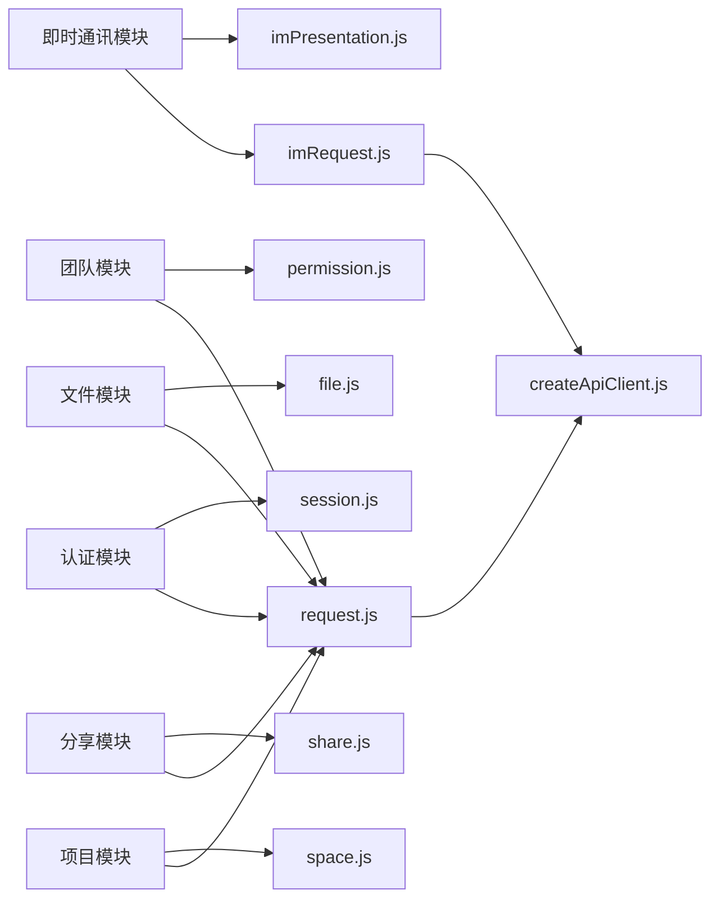

# API模块封装

<cite>
**本文引用的文件**   
- [ZXYZdatabaseFront/src/api/auth.js](file://ZXYZdatabaseFront/src/api/auth.js)
- [ZXYZdatabaseFront/src/api/files.js](file://ZXYZdatabaseFront/src/api/files.js)
- [ZXYZdatabaseFront/src/api/team.js](file://ZXYZdatabaseFront/src/api/team.js)
- [ZXYZdatabaseFront/src/api/im.js](file://ZXYZdatabaseFront/src/api/im.js)
- [ZXYZdatabaseFront/src/api/project.js](file://ZXYZdatabaseFront/src/api/project.js)
- [ZXYZdatabaseFront/src/api/share.js](file://ZXYZdatabaseFront/src/api/share.js)
- [ZXYZdatabaseFront/src/utils/request.js](file://ZXYZdatabaseFront/src/utils/request.js)
- [ZXYZdatabaseFront/src/utils/createApiClient.js](file://ZXYZdatabaseFront/src/utils/createApiClient.js)
- [ZXYZdatabaseFront/src/utils/publicRequest.js](file://ZXYZdatabaseFront/src/utils/publicRequest.js)
- [ZXYZdatabaseFront/src/utils/imRequest.js](file://ZXYZdatabaseFront/src/utils/imRequest.js)
- [ZXYZdatabaseFront/src/store/session.js](file://ZXYZdatabaseFront/src/store/session.js)
- [ZXYZdatabaseFront/src/store/currentUser.js](file://ZXYZdatabaseFront/src/store/currentUser.js)
- [ZXYZdatabaseFront/src/composables/useLoginForm.js](file://ZXYZdatabaseFront/src/composables/useLoginForm.js)
- [ZXYZdatabaseFront/src/composables/usePasswordChange.js](file://ZXYZdatabaseFront/src/composables/usePasswordChange.js)
- [ZXYZdatabaseFront/src/composables/useFileUpload.js](file://ZXYZdatabaseFront/src/composables/useFileUpload.js)
- [ZXYZdatabaseFront/src/composables/useFileDownload.js](file://ZXYZdatabaseFront/src/composables/useFileDownload.js)
- [ZXYZdatabaseFront/src/composables/useTeamManagement.js](file://ZXYZdatabaseFront/src/composables/useTeamManagement.js)
- [ZXYZdatabaseFront/src/composables/useImWorkspace.js](file://ZXYZdatabaseFront/src/composables/useImWorkspace.js)
- [ZXYZdatabaseFront/src/composables/useSendToConversation.js](file://ZXYZdatabaseFront/src/composables/useSendToConversation.js)
- [ZXYZdatabaseFront/src/composables/useShareCreateAction.js](file://ZXYZdatabaseFront/src/composables/useShareCreateAction.js)
- [ZXYZdatabaseFront/src/composables/useShareFileList.js](file://ZXYZdatabaseFront/src/composables/useShareFileList.js)
- [ZXYZdatabaseFront/src/composables/useProjectManagement.js](file://ZXYZdatabaseFront/src/composables/project/useProjectManagement.js)
- [ZXYZdatabaseFront/src/models/file.js](file://ZXYZdatabaseFront/src/models/file.js)
- [ZXYZdatabaseFront/src/models/space.js](file://ZXYZdatabaseFront/src/models/space.js)
- [ZXYZdatabaseFront/src/models/permission.js](file://ZXYZdatabaseFront/src/models/permission.js)
- [ZXYZdatabaseFront/src/models/imPresentation.js](file://ZXYZdatabaseFront/src/models/imPresentation.js)
- [ZXYZdatabaseFront/src/constants/conversationTypes.js](file://ZXYZdatabaseFront/src/constants/conversationTypes.js)
- [ZXYZdatabaseFront/src/constants/messageStatus.js](file://ZXYZdatabaseFront/src/constants/messageStatus.js)
- [ZXYZdatabaseFront/src/constants/teamPermissions.js](file://ZXYZdatabaseFront/src/constants/teamPermissions.js)
</cite>

## 目录
1. [简介](#简介)
2. [项目结构](#项目结构)
3. [核心组件](#核心组件)
4. [架构总览](#架构总览)
5. [详细组件分析](#详细组件分析)
6. [依赖分析](#依赖分析)
7. [性能考虑](#性能考虑)
8. [故障排查指南](#故障排查指南)
9. [结论](#结论)
10. [附录：接口清单与示例](#附录接口清单与示例)

## 简介
本技术文档聚焦于 ZXYZ 前端各业务模块的 API 封装，覆盖认证、文件、团队、即时通讯（IM）、项目、分享等模块。文档从整体架构出发，逐层解析请求封装、状态管理、组合式函数（composables）与模型映射，提供每个模块的完整接口列表、参数说明与使用示例，帮助前后端开发者快速理解并正确使用各模块 API。

## 项目结构
前端采用 Vue 3 Composition API + Element Plus + Pinia 的组合模式，API 封装集中在 src/api 目录下，统一通过 HTTP 客户端工具进行请求处理，状态管理由 Pinia store 负责，业务逻辑通过 composables 组织。

**图表来源** 
- [ZXYZdatabaseFront/src/api/auth.js](file://ZXYZdatabaseFront/src/api/auth.js)
- [ZXYZdatabaseFront/src/api/files.js](file://ZXYZdatabaseFront/src/api/files.js)
- [ZXYZdatabaseFront/src/api/team.js](file://ZXYZdatabaseFront/src/api/team.js)
- [ZXYZdatabaseFront/src/api/im.js](file://ZXYZdatabaseFront/src/api/im.js)
- [ZXYZdatabaseFront/src/api/project.js](file://ZXYZdatabaseFront/src/api/project.js)
- [ZXYZdatabaseFront/src/api/share.js](file://ZXYZdatabaseFront/src/api/share.js)
- [ZXYZdatabaseFront/src/utils/request.js](file://ZXYZdatabaseFront/src/utils/request.js)
- [ZXYZdatabaseFront/src/utils/publicRequest.js](file://ZXYZdatabaseFront/src/utils/publicRequest.js)
- [ZXYZdatabaseFront/src/utils/imRequest.js](file://ZXYZdatabaseFront/src/utils/imRequest.js)
- [ZXYZdatabaseFront/src/utils/createApiClient.js](file://ZXYZdatabaseFront/src/utils/createApiClient.js)
- [ZXYZdatabaseFront/src/store/session.js](file://ZXYZdatabaseFront/src/store/session.js)
- [ZXYZdatabaseFront/src/store/currentUser.js](file://ZXYZdatabaseFront/src/store/currentUser.js)
- [ZXYZdatabaseFront/src/composables/useLoginForm.js](file://ZXYZdatabaseFront/src/composables/useLoginForm.js)
- [ZXYZdatabaseFront/src/composables/usePasswordChange.js](file://ZXYZdatabaseFront/src/composables/usePasswordChange.js)
- [ZXYZdatabaseFront/src/composables/useFileUpload.js](file://ZXYZdatabaseFront/src/composables/useFileUpload.js)
- [ZXYZdatabaseFront/src/composables/useFileDownload.js](file://ZXYZdatabaseFront/src/composables/useFileDownload.js)
- [ZXYZdatabaseFront/src/composables/useTeamManagement.js](file://ZXYZdatabaseFront/src/composables/useTeamManagement.js)
- [ZXYZdatabaseFront/src/composables/useImWorkspace.js](file://ZXYZdatabaseFront/src/composables/useImWorkspace.js)
- [ZXYZdatabaseFront/src/composables/useSendToConversation.js](file://ZXYZdatabaseFront/src/composables/useSendToConversation.js)
- [ZXYZdatabaseFront/src/composables/useShareCreateAction.js](file://ZXYZdatabaseFront/src/composables/useShareCreateAction.js)
- [ZXYZdatabaseFront/src/composables/useShareFileList.js](file://ZXYZdatabaseFront/src/composables/useShareFileList.js)
- [ZXYZdatabaseFront/src/composables/project/useProjectManagement.js](file://ZXYZdatabaseFront/src/composables/project/useProjectManagement.js)

**章节来源**
- [ZXYZdatabaseFront/src/api/auth.js](file://ZXYZdatabaseFront/src/api/auth.js)
- [ZXYZdatabaseFront/src/api/files.js](file://ZXYZdatabaseFront/src/api/files.js)
- [ZXYZdatabaseFront/src/api/team.js](file://ZXYZdatabaseFront/src/api/team.js)
- [ZXYZdatabaseFront/src/api/im.js](file://ZXYZdatabaseFront/src/api/im.js)
- [ZXYZdatabaseFront/src/api/project.js](file://ZXYZdatabaseFront/src/api/project.js)
- [ZXYZdatabaseFront/src/api/share.js](file://ZXYZdatabaseFront/src/api/share.js)
- [ZXYZdatabaseFront/src/utils/request.js](file://ZXYZdatabaseFront/src/utils/request.js)
- [ZXYZdatabaseFront/src/utils/publicRequest.js](file://ZXYZdatabaseFront/src/utils/publicRequest.js)
- [ZXYZdatabaseFront/src/utils/imRequest.js](file://ZXYZdatabaseFront/src/utils/imRequest.js)
- [ZXYZdatabaseFront/src/utils/createApiClient.js](file://ZXYZdatabaseFront/src/utils/createApiClient.js)
- [ZXYZdatabaseFront/src/store/session.js](file://ZXYZdatabaseFront/src/store/session.js)
- [ZXYZdatabaseFront/src/store/currentUser.js](file://ZXYZdatabaseFront/src/store/currentUser.js)

## 核心组件
- 认证模块：封装用户登录、注册、密码修改、会话管理等接口，配合 HttpOnly Cookie 与 Redis Session 完成鉴权。
- 文件模块：封装文件上传下载、文件夹操作、版本管理与批量操作，支持进度回调与错误重试。
- 团队模块：封装团队管理、成员操作、权限控制与配额管理，结合常量定义权限语义。
- 即时通讯模块：封装聊天室管理、消息发送、文件卡片与系统通知，基于 WebSocket 实时通信。
- 项目模块：封装项目创建、配置、成员与任务相关接口。
- 分享模块：封装分享链接生成、访问控制、内容获取与下载。

**章节来源**
- [ZXYZdatabaseFront/src/api/auth.js](file://ZXYZdatabaseFront/src/api/auth.js)
- [ZXYZdatabaseFront/src/api/files.js](file://ZXYZdatabaseFront/src/api/files.js)
- [ZXYZdatabaseFront/src/api/team.js](file://ZXYZdatabaseFront/src/api/team.js)
- [ZXYZdatabaseFront/src/api/im.js](file://ZXYZdatabaseFront/src/api/im.js)
- [ZXYZdatabaseFront/src/api/project.js](file://ZXYZdatabaseFront/src/api/project.js)
- [ZXYZdatabaseFront/src/api/share.js](file://ZXYZdatabaseFront/src/api/share.js)

## 架构总览
前端 API 封装遵循“窄端点 + 投影”的模式，所有请求通过统一的 HTTP 客户端发起，响应体为 Result<T> 结构（code:1 表示成功）。认证依赖 Sa-Token 的 HttpOnly Cookie，会话存储在 Redis；IM 模块使用专用 WebSocket 客户端进行实时通信。

**图表来源** 
- [ZXYZdatabaseFront/src/utils/request.js](file://ZXYZdatabaseFront/src/utils/request.js)
- [ZXYZdatabaseFront/src/utils/createApiClient.js](file://ZXYZdatabaseFront/src/utils/createApiClient.js)
- [ZXYZdatabaseFront/src/store/session.js](file://ZXYZdatabaseFront/src/store/session.js)
- [ZXYZdatabaseFront/src/store/currentUser.js](file://ZXYZdatabaseFront/src/store/currentUser.js)

## 详细组件分析

### 认证模块
认证模块提供用户登录、注册、密码修改与会话管理接口，结合 HttpOnly Cookie 与 Redis Session 实现安全鉴权。

**图表来源** 
- [ZXYZdatabaseFront/src/api/auth.js](file://ZXYZdatabaseFront/src/api/auth.js)
- [ZXYZdatabaseFront/src/composables/useLoginForm.js](file://ZXYZdatabaseFront/src/composables/useLoginForm.js)
- [ZXYZdatabaseFront/src/composables/usePasswordChange.js](file://ZXYZdatabaseFront/src/composables/usePasswordChange.js)

- 接口清单
  - 登录：POST /api/auth/login，参数包括用户名、密码、验证码（可选），返回会话标识与用户基本信息。
  - 注册：POST /api/auth/register，参数包括用户名、邮箱、密码、邀请码（可选），返回注册结果。
  - 修改密码：PUT /api/auth/password，参数包括旧密码、新密码，返回修改结果。
  - 获取会话：GET /api/auth/session，返回当前会话状态与用户信息。
  - 登出：POST /api/auth/logout，清除本地会话与服务器端会话。

- 使用示例
  - 登录流程：在表单提交时调用登录接口，成功后更新 session 与 currentUser 状态，并重定向至首页。
  - 密码修改：校验新旧密码格式后调用修改接口，成功后提示用户重新登录。

**章节来源**
- [ZXYZdatabaseFront/src/api/auth.js](file://ZXYZdatabaseFront/src/api/auth.js)
- [ZXYZdatabaseFront/src/composables/useLoginForm.js](file://ZXYZdatabaseFront/src/composables/useLoginForm.js)
- [ZXYZdatabaseFront/src/composables/usePasswordChange.js](file://ZXYZdatabaseFront/src/composables/usePasswordChange.js)
- [ZXYZdatabaseFront/src/store/session.js](file://ZXYZdatabaseFront/src/store/session.js)
- [ZXYZdatabaseFront/src/store/currentUser.js](file://ZXYZdatabaseFront/src/store/currentUser.js)

### 文件模块
文件模块提供文件上传下载、文件夹操作、版本管理与批量操作的完整能力，支持进度回调与错误重试。

**图表来源** 
- [ZXYZdatabaseFront/src/api/files.js](file://ZXYZdatabaseFront/src/api/files.js)
- [ZXYZdatabaseFront/src/composables/useFileUpload.js](file://ZXYZdatabaseFront/src/composables/useFileUpload.js)

- 接口清单
  - 文件上传：POST /api/files/upload，支持分片上传与断点续传，参数包括文件流、分片索引、总大小、MD5 等。
  - 文件下载：GET /api/files/download/{id}，返回文件流或预签名 URL。
  - 文件夹操作：POST /api/files/folder，支持创建、重命名、删除、移动。
  - 版本管理：GET /api/files/{id}/versions，POST /api/files/{id}/versions，支持查看与恢复历史版本。
  - 批量操作：POST /api/files/batch，支持批量删除、移动、复制等操作。

- 使用示例
  - 上传文件：选择文件后调用上传接口，监听进度事件，完成后更新文件列表。
  - 下载文件：点击下载按钮，根据文件类型决定直接下载或预览。

**章节来源**
- [ZXYZdatabaseFront/src/api/files.js](file://ZXYZdatabaseFront/src/api/files.js)
- [ZXYZdatabaseFront/src/composables/useFileUpload.js](file://ZXYZdatabaseFront/src/composables/useFileUpload.js)
- [ZXYZdatabaseFront/src/composables/useFileDownload.js](file://ZXYZdatabaseFront/src/composables/useFileDownload.js)
- [ZXYZdatabaseFront/src/models/file.js](file://ZXYZdatabaseFront/src/models/file.js)

### 团队模块
团队模块提供团队管理、成员操作、权限控制与配额管理能力，结合常量定义权限语义。

**图表来源** 
- [ZXYZdatabaseFront/src/api/team.js](file://ZXYZdatabaseFront/src/api/team.js)
- [ZXYZdatabaseFront/src/composables/useTeamManagement.js](file://ZXYZdatabaseFront/src/composables/useTeamManagement.js)
- [ZXYZdatabaseFront/src/constants/teamPermissions.js](file://ZXYZdatabaseFront/src/constants/teamPermissions.js)

- 接口清单
  - 获取团队：GET /api/team/{id}，返回团队基本信息与成员列表。
  - 更新团队：PUT /api/team/{id}，支持修改名称、描述、头像等。
  - 添加成员：POST /api/team/{id}/members，参数包括用户 ID 与角色。
  - 移除成员：DELETE /api/team/{id}/members/{userId}。
  - 更新角色：PUT /api/team/{id}/members/{userId}/role，参数为新角色。
  - 获取配额：GET /api/team/{id}/quota，返回存储空间使用情况。
  - 更新配额：PUT /api/team/{id}/quota，调整存储上限。

- 使用示例
  - 邀请成员：输入用户 ID 与角色后调用添加接口，成功后刷新成员列表。
  - 调整配额：输入新的存储配额后调用更新接口，成功后显示新配额。

**章节来源**
- [ZXYZdatabaseFront/src/api/team.js](file://ZXYZdatabaseFront/src/api/team.js)
- [ZXYZdatabaseFront/src/composables/useTeamManagement.js](file://ZXYZdatabaseFront/src/composables/useTeamManagement.js)
- [ZXYZdatabaseFront/src/constants/teamPermissions.js](file://ZXYZdatabaseFront/src/constants/teamPermissions.js)
- [ZXYZdatabaseFront/src/models/permission.js](file://ZXYZdatabaseFront/src/models/permission.js)

### 即时通讯模块
即时通讯模块提供聊天室管理、消息发送、文件卡片与系统通知能力，基于 WebSocket 实现实时通信。

**图表来源** 
- [ZXYZdatabaseFront/src/api/im.js](file://ZXYZdatabaseFront/src/api/im.js)
- [ZXYZdatabaseFront/src/utils/imRequest.js](file://ZXYZdatabaseFront/src/utils/imRequest.js)
- [ZXYZdatabaseFront/src/composables/useImWorkspace.js](file://ZXYZdatabaseFront/src/composables/useImWorkspace.js)
- [ZXYZdatabaseFront/src/composables/useSendToConversation.js](file://ZXYZdatabaseFront/src/composables/useSendToConversation.js)

- 接口清单
  - 聊天室管理：GET/POST /api/im/rooms，支持查询与创建聊天室。
  - 消息发送：POST /api/im/messages，支持文本、文件卡片、系统通知等类型。
  - 文件卡片：POST /api/im/file-cards，关联文件 ID 与预览信息。
  - 系统通知：POST /api/im/notifications，用于广播系统级消息。
  - 历史消息：GET /api/im/messages?roomId=&page=，分页加载历史记录。

- 使用示例
  - 加入聊天室：调用加入接口后建立 WebSocket 连接，实时接收消息。
  - 发送消息：输入内容后调用发送接口，同时通过 WebSocket 推送给其他成员。

**章节来源**
- [ZXYZdatabaseFront/src/api/im.js](file://ZXYZdatabaseFront/src/api/im.js)
- [ZXYZdatabaseFront/src/utils/imRequest.js](file://ZXYZdatabaseFront/src/utils/imRequest.js)
- [ZXYZdatabaseFront/src/composables/useImWorkspace.js](file://ZXYZdatabaseFront/src/composables/useImWorkspace.js)
- [ZXYZdatabaseFront/src/composables/useSendToConversation.js](file://ZXYZdatabaseFront/src/composables/useSendToConversation.js)
- [ZXYZdatabaseFront/src/models/imPresentation.js](file://ZXYZdatabaseFront/src/models/imPresentation.js)
- [ZXYZdatabaseFront/src/constants/conversationTypes.js](file://ZXYZdatabaseFront/src/constants/conversationTypes.js)
- [ZXYZdatabaseFront/src/constants/messageStatus.js](file://ZXYZdatabaseFront/src/constants/messageStatus.js)

### 项目模块
项目模块提供项目创建、配置、成员与任务相关接口，支持团队协作开发。

- 接口清单
  - 创建项目：POST /api/projects，参数包括项目名称、描述、初始成员。
  - 获取项目：GET /api/projects/{id}，返回项目详情与成员列表。
  - 更新项目：PUT /api/projects/{id}，支持修改名称、描述、可见性等。
  - 成员管理：POST/DELETE /api/projects/{id}/members，添加或移除成员。
  - 任务管理：GET/POST /api/projects/{id}/tasks，查询与创建任务。

- 使用示例
  - 创建项目：填写项目信息后调用创建接口，成功后跳转至项目主页。
  - 添加成员：输入用户 ID 与角色后调用添加接口，成功后刷新成员列表。

**章节来源**
- [ZXYZdatabaseFront/src/api/project.js](file://ZXYZdatabaseFront/src/api/project.js)
- [ZXYZdatabaseFront/src/composables/project/useProjectManagement.js](file://ZXYZdatabaseFront/src/composables/project/useProjectManagement.js)

### 分享模块
分享模块提供分享链接生成、访问控制、内容获取与下载能力，支持密码保护与有效期设置。

- 接口清单
  - 创建分享：POST /api/shares，参数包括资源 ID、类型、密码、有效期。
  - 获取分享：GET /api/shares/{token}，返回分享信息与访问权限。
  - 访问资源：GET /api/shares/{token}/content，根据权限返回内容或下载链接。
  - 删除分享：DELETE /api/shares/{token}，撤销分享链接。

- 使用示例
  - 创建分享：选择资源后调用创建接口，生成分享链接并复制到剪贴板。
  - 访问分享：打开分享链接后根据权限展示内容或提示输入密码。

**章节来源**
- [ZXYZdatabaseFront/src/api/share.js](file://ZXYZdatabaseFront/src/api/share.js)
- [ZXYZdatabaseFront/src/composables/useShareCreateAction.js](file://ZXYZdatabaseFront/src/composables/useShareCreateAction.js)
- [ZXYZdatabaseFront/src/composables/useShareFileList.js](file://ZXYZdatabaseFront/src/composables/useShareFileList.js)

## 依赖分析
前端 API 封装依赖于统一的 HTTP 客户端与状态管理，各模块之间通过 composables 解耦，避免直接耦合。

**图表来源** 
- [ZXYZdatabaseFront/src/utils/request.js](file://ZXYZdatabaseFront/src/utils/request.js)
- [ZXYZdatabaseFront/src/utils/createApiClient.js](file://ZXYZdatabaseFront/src/utils/createApiClient.js)
- [ZXYZdatabaseFront/src/utils/imRequest.js](file://ZXYZdatabaseFront/src/utils/imRequest.js)
- [ZXYZdatabaseFront/src/store/session.js](file://ZXYZdatabaseFront/src/store/session.js)
- [ZXYZdatabaseFront/src/models/file.js](file://ZXYZdatabaseFront/src/models/file.js)
- [ZXYZdatabaseFront/src/models/permission.js](file://ZXYZdatabaseFront/src/models/permission.js)
- [ZXYZdatabaseFront/src/models/imPresentation.js](file://ZXYZdatabaseFront/src/models/imPresentation.js)
- [ZXYZdatabaseFront/src/models/space.js](file://ZXYZdatabaseFront/src/models/space.js)

**章节来源**
- [ZXYZdatabaseFront/src/utils/request.js](file://ZXYZdatabaseFront/src/utils/request.js)
- [ZXYZdatabaseFront/src/utils/createApiClient.js](file://ZXYZdatabaseFront/src/utils/createApiClient.js)
- [ZXYZdatabaseFront/src/utils/imRequest.js](file://ZXYZdatabaseFront/src/utils/imRequest.js)
- [ZXYZdatabaseFront/src/store/session.js](file://ZXYZdatabaseFront/src/store/session.js)
- [ZXYZdatabaseFront/src/models/file.js](file://ZXYZdatabaseFront/src/models/file.js)
- [ZXYZdatabaseFront/src/models/permission.js](file://ZXYZdatabaseFront/src/models/permission.js)
- [ZXYZdatabaseFront/src/models/imPresentation.js](file://ZXYZdatabaseFront/src/models/imPresentation.js)
- [ZXYZdatabaseFront/src/models/space.js](file://ZXYZdatabaseFront/src/models/space.js)

## 性能考虑
- 文件上传：采用分片上传与断点续传，减少大文件传输失败的重试成本。
- 即时通讯：使用 WebSocket 长连接，避免频繁轮询，降低网络开销。
- 状态管理：通过 Pinia 集中管理状态，避免重复请求与数据不一致。
- 缓存策略：对静态资源与热点数据进行本地缓存，提升加载速度。

## 故障排查指南
- 认证失败：检查 HttpOnly Cookie 是否正确设置，确认 Redis Session 是否有效。
- 文件上传失败：验证分片 MD5 与总大小一致性，检查网络超时与重试机制。
- 即时通讯断开：监控 WebSocket 连接状态，实现自动重连与消息队列。
- 权限错误：确认用户角色与团队权限配置，检查接口访问控制逻辑。

## 结论
ZXYZ 前端 API 封装采用模块化设计，通过统一的 HTTP 客户端与状态管理，实现了认证、文件、团队、即时通讯、项目、分享等模块的高效协作。各模块接口清晰、职责明确，便于扩展与维护。建议后续持续优化错误处理与性能监控，提升用户体验。

## 附录：接口清单与示例
- 认证模块
  - 登录：POST /api/auth/login，参数：username, password, captcha（可选）
  - 注册：POST /api/auth/register，参数：username, email, password, inviteCode（可选）
  - 修改密码：PUT /api/auth/password，参数：oldPassword, newPassword
  - 获取会话：GET /api/auth/session
  - 登出：POST /api/auth/logout

- 文件模块
  - 上传：POST /api/files/upload，参数：file, chunkIndex, totalChunks, md5
  - 下载：GET /api/files/download/{id}
  - 文件夹：POST /api/files/folder，参数：name, parentId
  - 版本：GET/POST /api/files/{id}/versions
  - 批量：POST /api/files/batch，参数：actions[]

- 团队模块
  - 获取团队：GET /api/team/{id}
  - 更新团队：PUT /api/team/{id}
  - 添加成员：POST /api/team/{id}/members，参数：userId, role
  - 移除成员：DELETE /api/team/{id}/members/{userId}
  - 更新角色：PUT /api/team/{id}/members/{userId}/role
  - 配额：GET/PUT /api/team/{id}/quota

- 即时通讯模块
  - 聊天室：GET/POST /api/im/rooms
  - 消息：POST /api/im/messages，参数：type, content, roomId
  - 文件卡片：POST /api/im/file-cards，参数：fileId, previewUrl
  - 通知：POST /api/im/notifications，参数：title, message
  - 历史：GET /api/im/messages?roomId=&page=

- 项目模块
  - 创建：POST /api/projects，参数：name, description, members[]
  - 获取：GET /api/projects/{id}
  - 更新：PUT /api/projects/{id}
  - 成员：POST/DELETE /api/projects/{id}/members
  - 任务：GET/POST /api/projects/{id}/tasks

- 分享模块
  - 创建：POST /api/shares，参数：resourceId, type, password, expiresAt
  - 获取：GET /api/shares/{token}
  - 访问：GET /api/shares/{token}/content
  - 删除：DELETE /api/shares/{token}