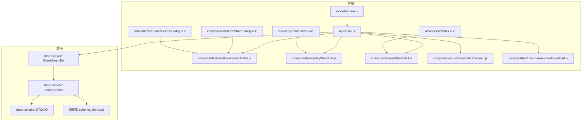
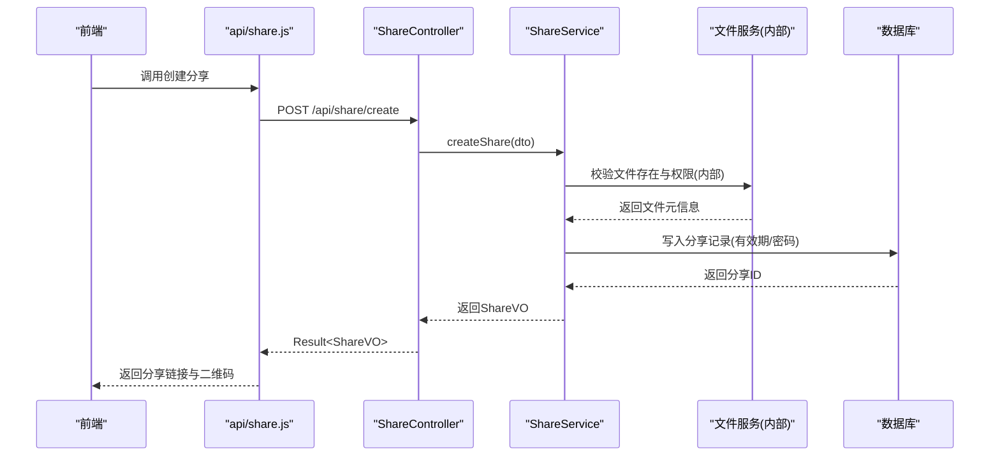
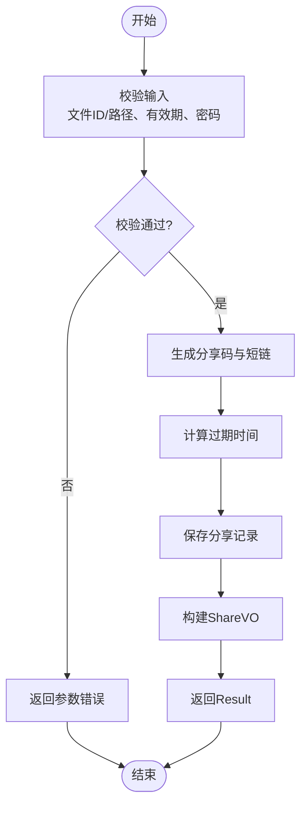
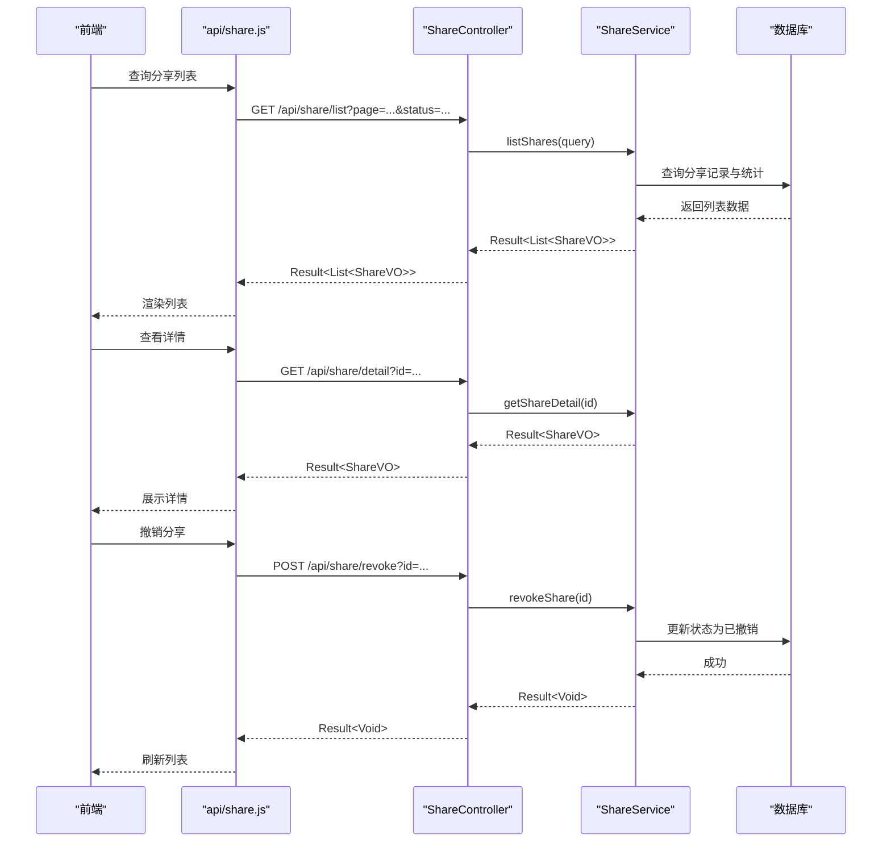
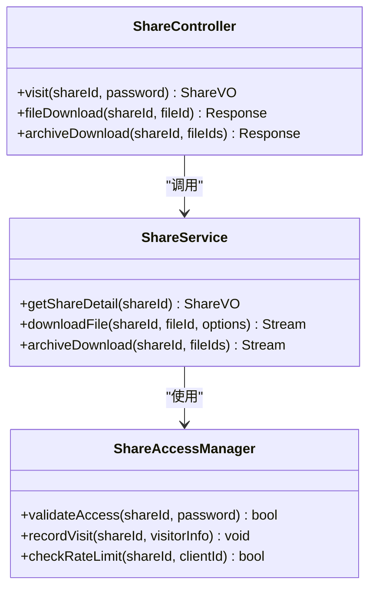
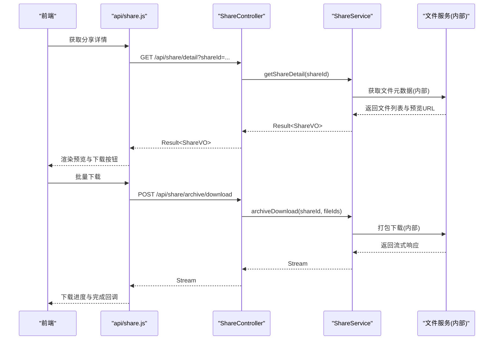
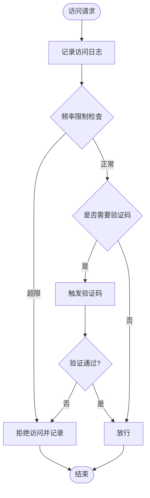
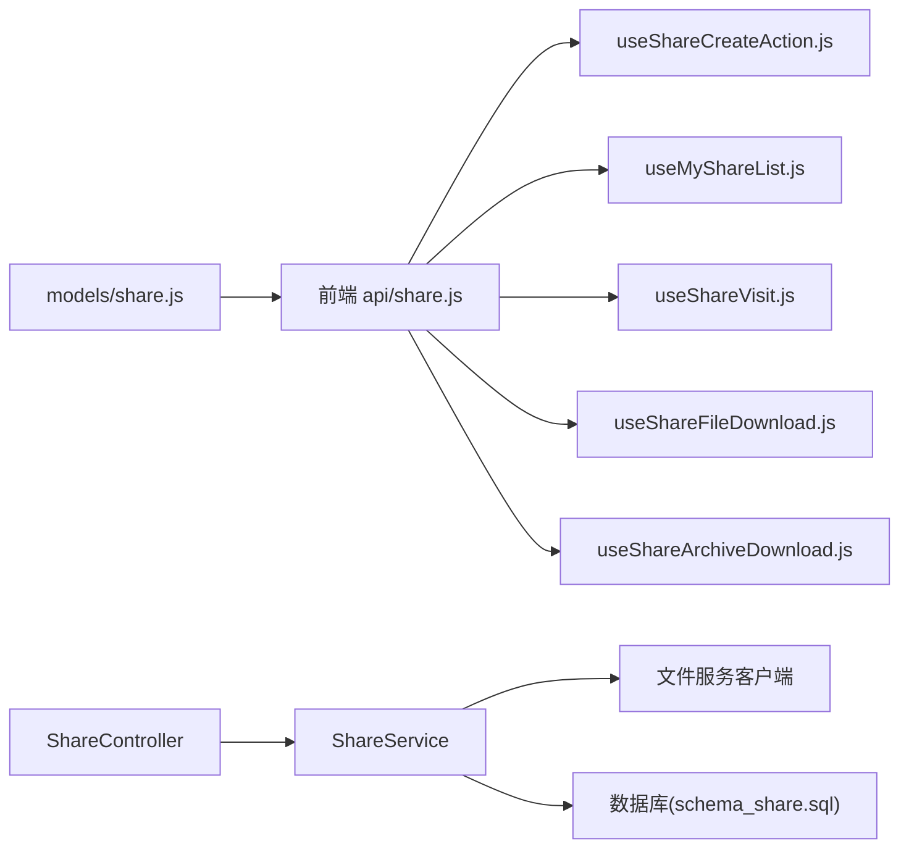

# 分享模块API

<cite>
**本文引用的文件**   
- [ZXYZdatabaseFront/src/api/share.js](file://ZXYZdatabaseFront/src/api/share.js)
- [ZXYZdatabaseFront/src/composables/useShareCreateAction.js](file://ZXYZdatabaseFront/src/composables/useShareCreateAction.js)
- [ZXYZdatabaseFront/src/composables/useMyShareList.js](file://ZXYZdatabaseFront/src/composables/useMyShareList.js)
- [ZXYZdatabaseFront/src/composables/useShareVisit.js](file://ZXYZdatabaseFront/src/composables/useShareVisit.js)
- [ZXYZdatabaseFront/src/composables/useShareFileDownload.js](file://ZXYZdatabaseFront/src/composables/useShareFileDownload.js)
- [ZXYZdatabaseFront/src/composables/useShareArchiveDownload.js](file://ZXYZdatabaseFront/src/composables/useShareArchiveDownload.js)
- [ZXYZdatabaseFront/src/components/CreateShareDialog.vue](file://ZXYZdatabaseFront/src/components/CreateShareDialog.vue)
- [ZXYZdatabaseFront/src/components/ShareSuccessDialog.vue](file://ZXYZdatabaseFront/src/components/ShareSuccessDialog.vue)
- [ZXYZdatabaseFront/src/views/my-share/index.vue](file://ZXYZdatabaseFront/src/views/my-share/index.vue)
- [ZXYZdatabaseFront/src/views/share/index.vue](file://ZXYZdatabaseFront/src/views/share/index.vue)
- [ZXYZdatabaseFront/src/models/share.js](file://ZXYZdatabaseFront/src/models/share.js)
- [ZXYZdatabaseBack/zxyz-share-service/src/main/java/uno/acloud/share/controller/ShareController.java](file://ZXYZdatabaseBack/zxyz-share-service/src/main/java/uno/acloud/share/controller/ShareController.java)
- [ZXYZdatabaseBack/zxyz-share-service/src/main/java/uno/acloud/share/service/ShareService.java](file://ZXYZdatabaseBack/zxyz-share-service/src/main/java/uno/acloud/share/service/ShareService.java)
- [ZXYZdatabaseBack/zxyz-share-service/src/main/java/uno/acloud/share/dto/ShareCreateDTO.java](file://ZXYZdatabaseBack/zxyz-share-service/src/main/java/uno/acloud/share/dto/ShareCreateDTO.java)
- [ZXYZdatabaseBack/zxyz-share-service/src/main/java/uno/acloud/share/vo/ShareVO.java](file://ZXYZdatabaseBack/zxyz-share-service/src/main/java/uno/acloud/share/vo/ShareVO.java)
- [ZXYZdatabaseBack/sql/schema_share.sql](file://ZXYZdatabaseBack/sql/schema_share.sql)
</cite>

## 目录
1. [简介](#简介)
2. [项目结构](#项目结构)
3. [核心组件](#核心组件)
4. [架构总览](#架构总览)
5. [详细组件分析](#详细组件分析)
6. [依赖关系分析](#依赖关系分析)
7. [性能考虑](#性能考虑)
8. [故障排查指南](#故障排查指南)
9. [结论](#结论)
10. [附录：接口清单与示例](#附录接口清单与示例)

## 简介
本技术文档聚焦于 ZXYZ 前端分享模块的 API 封装，围绕“文件分享”的全链路能力进行系统化说明。内容涵盖：
- 分享链接生成、有效期设置与访问密码配置
- 分享管理：列表查询、详情查看、撤销操作
- 分享访问控制：权限验证、访问统计、下载限制
- 分享文件：预览、在线查看、批量下载
- 安全相关：访问日志、防刷保护、恶意检测
- 完整接口清单、参数格式、响应结构与使用示例

该文档既适合前端开发者快速对接，也便于后端与测试人员理解前后端交互契约。

## 项目结构
分享模块在前端以“API 层 + Composables + 视图/组件 + 数据模型”组织；后端以 share-service 提供 REST 接口，并通过内部服务客户端与文件服务、用户服务等协作。

图表来源
- [ZXYZdatabaseFront/src/api/share.js](file://ZXYZdatabaseFront/src/api/share.js)
- [ZXYZdatabaseFront/src/composables/useShareCreateAction.js](file://ZXYZdatabaseFront/src/composables/useShareCreateAction.js)
- [ZXYZdatabaseFront/src/composables/useMyShareList.js](file://ZXYZdatabaseFront/src/composables/useMyShareList.js)
- [ZXYZdatabaseFront/src/composables/useShareVisit.js](file://ZXYZdatabaseFront/src/composables/useShareVisit.js)
- [ZXYZdatabaseFront/src/composables/useShareFileDownload.js](file://ZXYZdatabaseFront/src/composables/useShareFileDownload.js)
- [ZXYZdatabaseFront/src/composables/useShareArchiveDownload.js](file://ZXYZdatabaseFront/src/composables/useShareArchiveDownload.js)
- [ZXYZdatabaseFront/src/components/CreateShareDialog.vue](file://ZXYZdatabaseFront/src/components/CreateShareDialog.vue)
- [ZXYZdatabaseFront/src/components/ShareSuccessDialog.vue](file://ZXYZdatabaseFront/src/components/ShareSuccessDialog.vue)
- [ZXYZdatabaseFront/src/views/my-share/index.vue](file://ZXYZdatabaseFront/src/views/my-share/index.vue)
- [ZXYZdatabaseFront/src/views/share/index.vue](file://ZXYZdatabaseFront/src/views/share/index.vue)
- [ZXYZdatabaseFront/src/models/share.js](file://ZXYZdatabaseFront/src/models/share.js)
- [ZXYZdatabaseBack/zxyz-share-service/src/main/java/uno/acloud/share/controller/ShareController.java](file://ZXYZdatabaseBack/zxyz-share-service/src/main/java/uno/acloud/share/controller/ShareController.java)
- [ZXYZdatabaseBack/zxyz-share-service/src/main/java/uno/acloud/share/service/ShareService.java](file://ZXYZdatabaseBack/zxyz-share-service/src/main/java/uno/acloud/share/service/ShareService.java)
- [ZXYZdatabaseBack/zxyz-share-service/src/main/java/uno/acloud/share/dto/ShareCreateDTO.java](file://ZXYZdatabaseBack/zxyz-share-service/src/main/java/uno/acloud/share/dto/ShareCreateDTO.java)
- [ZXYZdatabaseBack/zxyz-share-service/src/main/java/uno/acloud/share/vo/ShareVO.java](file://ZXYZdatabaseBack/zxyz-share-service/src/main/java/uno/acloud/share/vo/ShareVO.java)
- [ZXYZdatabaseBack/sql/schema_share.sql](file://ZXYZdatabaseBack/sql/schema_share.sql)

章节来源
- [ZXYZdatabaseFront/src/api/share.js](file://ZXYZdatabaseFront/src/api/share.js)
- [ZXYZdatabaseBack/zxyz-share-service/src/main/java/uno/acloud/share/controller/ShareController.java](file://ZXYZdatabaseBack/zxyz-share-service/src/main/java/uno/acloud/share/controller/ShareController.java)

## 核心组件
- 前端 API 封装（share.js）：统一请求封装、错误处理、分页与参数规范化，暴露创建分享、查询分享、获取分享详情、撤销分享等函数。
- 创建分享流程（useShareCreateAction.js）：组合表单校验、调用 API、展示成功弹窗并复制分享链接。
- 我的分享列表（useMyShareList.js）：分页查询、状态筛选、搜索、刷新与删除（撤销）。
- 分享访问（useShareVisit.js）：解析分享链接、校验密码、加载元信息与文件列表、记录访问统计。
- 分享文件下载（useShareFileDownload.js）：按权限触发下载、处理限速与失败重试。
- 分享归档下载（useShareArchiveDownload.js）：打包多文件为压缩包下载，支持进度与断点续传。
- 视图与组件：my-share 页面用于管理个人分享；share 页面用于公开访问；CreateShareDialog 与 ShareSuccessDialog 负责交互。
- 数据模型（models/share.js）：定义分享实体字段、枚举与转换逻辑。

章节来源
- [ZXYZdatabaseFront/src/api/share.js](file://ZXYZdatabaseFront/src/api/share.js)
- [ZXYZdatabaseFront/src/composables/useShareCreateAction.js](file://ZXYZdatabaseFront/src/composables/useShareCreateAction.js)
- [ZXYZdatabaseFront/src/composables/useMyShareList.js](file://ZXYZdatabaseFront/src/composables/useMyShareList.js)
- [ZXYZdatabaseFront/src/composables/useShareVisit.js](file://ZXYZdatabaseFront/src/composables/useShareVisit.js)
- [ZXYZdatabaseFront/src/composables/useShareFileDownload.js](file://ZXYZdatabaseFront/src/composables/useShareFileDownload.js)
- [ZXYZdatabaseFront/src/composables/useShareArchiveDownload.js](file://ZXYZdatabaseFront/src/composables/useShareArchiveDownload.js)
- [ZXYZdatabaseFront/src/components/CreateShareDialog.vue](file://ZXYZdatabaseFront/src/components/CreateShareDialog.vue)
- [ZXYZdatabaseFront/src/components/ShareSuccessDialog.vue](file://ZXYZdatabaseFront/src/components/ShareSuccessDialog.vue)
- [ZXYZdatabaseFront/src/views/my-share/index.vue](file://ZXYZdatabaseFront/src/views/my-share/index.vue)
- [ZXYZdatabaseFront/src/views/share/index.vue](file://ZXYZdatabaseFront/src/views/share/index.vue)
- [ZXYZdatabaseFront/src/models/share.js](file://ZXYZdatabaseFront/src/models/share.js)

## 架构总览
分享模块采用前后端分离的微服务架构。前端通过统一的 API 封装调用 share-service 的 REST 接口；share-service 在需要时调用文件服务、用户服务等内部服务，所有内部调用均通过 ServiceClient 与 X-Internal-Service-Token 鉴权。

图表来源
- [ZXYZdatabaseFront/src/api/share.js](file://ZXYZdatabaseFront/src/api/share.js)
- [ZXYZdatabaseBack/zxyz-share-service/src/main/java/uno/acloud/share/controller/ShareController.java](file://ZXYZdatabaseBack/zxyz-share-service/src/main/java/uno/acloud/share/controller/ShareController.java)
- [ZXYZdatabaseBack/zxyz-share-service/src/main/java/uno/acloud/share/service/ShareService.java](file://ZXYZdatabaseBack/zxyz-share-service/src/main/java/uno/acloud/share/service/ShareService.java)

## 详细组件分析

### 分享创建与链接生成
- 功能要点
  - 支持单文件或文件夹分享
  - 可选设置有效期（天/小时/分钟）与访问密码
  - 生成唯一分享码与短链
  - 成功后返回分享详情（含链接、二维码、过期时间）
- 前端实现
  - useShareCreateAction.js 负责表单校验、调用 API、展示成功弹窗
  - CreateShareDialog.vue 收集用户输入（有效期、密码、是否允许下载）
  - ShareSuccessDialog.vue 展示分享结果并提供复制链接
- 后端实现
  - ShareController.createShare 接收 ShareCreateDTO，校验参数
  - ShareService 生成分享码、计算过期时间、持久化记录
  - 返回 ShareVO（包含链接、二维码、过期时间、权限标识）

图表来源
- [ZXYZdatabaseFront/src/composables/useShareCreateAction.js](file://ZXYZdatabaseFront/src/composables/useShareCreateAction.js)
- [ZXYZdatabaseFront/src/components/CreateShareDialog.vue](file://ZXYZdatabaseFront/src/components/CreateShareDialog.vue)
- [ZXYZdatabaseFront/src/components/ShareSuccessDialog.vue](file://ZXYZdatabaseFront/src/components/ShareSuccessDialog.vue)
- [ZXYZdatabaseBack/zxyz-share-service/src/main/java/uno/acloud/share/controller/ShareController.java](file://ZXYZdatabaseBack/zxyz-share-service/src/main/java/uno/acloud/share/controller/ShareController.java)
- [ZXYZdatabaseBack/zxyz-share-service/src/main/java/uno/acloud/share/service/ShareService.java](file://ZXYZdatabaseBack/zxyz-share-service/src/main/java/uno/acloud/share/service/ShareService.java)
- [ZXYZdatabaseBack/zxyz-share-service/src/main/java/uno/acloud/share/dto/ShareCreateDTO.java](file://ZXYZdatabaseBack/zxyz-share-service/src/main/java/uno/acloud/share/dto/ShareCreateDTO.java)
- [ZXYZdatabaseBack/zxyz-share-service/src/main/java/uno/acloud/share/vo/ShareVO.java](file://ZXYZdatabaseBack/zxyz-share-service/src/main/java/uno/acloud/share/vo/ShareVO.java)

章节来源
- [ZXYZdatabaseFront/src/composables/useShareCreateAction.js](file://ZXYZdatabaseFront/src/composables/useShareCreateAction.js)
- [ZXYZdatabaseFront/src/components/CreateShareDialog.vue](file://ZXYZdatabaseFront/src/components/CreateShareDialog.vue)
- [ZXYZdatabaseFront/src/components/ShareSuccessDialog.vue](file://ZXYZdatabaseFront/src/components/ShareSuccessDialog.vue)
- [ZXYZdatabaseBack/zxyz-share-service/src/main/java/uno/acloud/share/controller/ShareController.java](file://ZXYZdatabaseBack/zxyz-share-service/src/main/java/uno/acloud/share/controller/ShareController.java)
- [ZXYZdatabaseBack/zxyz-share-service/src/main/java/uno/acloud/share/service/ShareService.java](file://ZXYZdatabaseBack/zxyz-share-service/src/main/java/uno/acloud/share/service/ShareService.java)
- [ZXYZdatabaseBack/zxyz-share-service/src/main/java/uno/acloud/share/dto/ShareCreateDTO.java](file://ZXYZdatabaseBack/zxyz-share-service/src/main/java/uno/acloud/share/dto/ShareCreateDTO.java)
- [ZXYZdatabaseBack/zxyz-share-service/src/main/java/uno/acloud/share/vo/ShareVO.java](file://ZXYZdatabaseBack/zxyz-share-service/src/main/java/uno/acloud/share/vo/ShareVO.java)

### 分享管理：列表、详情与撤销
- 列表查询
  - 支持分页、状态筛选（有效/已过期/已撤销）、关键词搜索
  - 返回分享基础信息与统计（访问次数、下载次数）
- 详情查看
  - 返回分享完整元数据（有效期、密码、权限、文件集合）
- 撤销操作
  - 立即失效分享链接，更新状态为已撤销
- 前端实现
  - useMyShareList.js 封装分页查询、刷新、删除（撤销）
  - my-share/index.vue 渲染列表与操作按钮
- 后端实现
  - ShareController.list/detail/revoke 对应接口
  - ShareService 实现业务逻辑与权限校验

图表来源
- [ZXYZdatabaseFront/src/composables/useMyShareList.js](file://ZXYZdatabaseFront/src/composables/useMyShareList.js)
- [ZXYZdatabaseFront/src/views/my-share/index.vue](file://ZXYZdatabaseFront/src/views/my-share/index.vue)
- [ZXYZdatabaseBack/zxyz-share-service/src/main/java/uno/acloud/share/controller/ShareController.java](file://ZXYZdatabaseBack/zxyz-share-service/src/main/java/uno/acloud/share/controller/ShareController.java)
- [ZXYZdatabaseBack/zxyz-share-service/src/main/java/uno/acloud/share/service/ShareService.java](file://ZXYZdatabaseBack/zxyz-share-service/src/main/java/uno/acloud/share/service/ShareService.java)

章节来源
- [ZXYZdatabaseFront/src/composables/useMyShareList.js](file://ZXYZdatabaseFront/src/composables/useMyShareList.js)
- [ZXYZdatabaseFront/src/views/my-share/index.vue](file://ZXYZdatabaseFront/src/views/my-share/index.vue)
- [ZXYZdatabaseBack/zxyz-share-service/src/main/java/uno/acloud/share/controller/ShareController.java](file://ZXYZdatabaseBack/zxyz-share-service/src/main/java/uno/acloud/share/controller/ShareController.java)
- [ZXYZdatabaseBack/zxyz-share-service/src/main/java/uno/acloud/share/service/ShareService.java](file://ZXYZdatabaseBack/zxyz-share-service/src/main/java/uno/acloud/share/service/ShareService.java)

### 分享访问控制：权限验证、访问统计与下载限制
- 权限验证
  - 公开分享：无需登录，但需校验有效期与密码（如配置）
  - 团队内分享：结合用户身份与团队权限策略
- 访问统计
  - 每次访问记录 IP、UA、时间戳、访问类型（预览/下载）
  - 支持按分享 ID 聚合统计
- 下载限制
  - 可配置最大并发下载数、频率限制（防刷）
  - 对超大文件启用分片下载与限速
- 前端实现
  - useShareVisit.js 负责解析分享码、密码校验、加载元数据与文件列表
  - useShareFileDownload.js 与 useShareArchiveDownload.js 处理下载流程与限制提示
- 后端实现
  - ShareController.visit/detail/file-download 等接口
  - ShareService 集成访问审计、限流与权限策略

图表来源
- [ZXYZdatabaseFront/src/composables/useShareVisit.js](file://ZXYZdatabaseFront/src/composables/useShareVisit.js)
- [ZXYZdatabaseFront/src/composables/useShareFileDownload.js](file://ZXYZdatabaseFront/src/composables/useShareFileDownload.js)
- [ZXYZdatabaseFront/src/composables/useShareArchiveDownload.js](file://ZXYZdatabaseFront/src/composables/useShareArchiveDownload.js)
- [ZXYZdatabaseBack/zxyz-share-service/src/main/java/uno/acloud/share/controller/ShareController.java](file://ZXYZdatabaseBack/zxyz-share-service/src/main/java/uno/acloud/share/controller/ShareController.java)
- [ZXYZdatabaseBack/zxyz-share-service/src/main/java/uno/acloud/share/service/ShareService.java](file://ZXYZdatabaseBack/zxyz-share-service/src/main/java/uno/acloud/share/service/ShareService.java)

章节来源
- [ZXYZdatabaseFront/src/composables/useShareVisit.js](file://ZXYZdatabaseFront/src/composables/useShareVisit.js)
- [ZXYZdatabaseFront/src/composables/useShareFileDownload.js](file://ZXYZdatabaseFront/src/composables/useShareFileDownload.js)
- [ZXYZdatabaseFront/src/composables/useShareArchiveDownload.js](file://ZXYZdatabaseFront/src/composables/useShareArchiveDownload.js)
- [ZXYZdatabaseBack/zxyz-share-service/src/main/java/uno/acloud/share/controller/ShareController.java](file://ZXYZdatabaseBack/zxyz-share-service/src/main/java/uno/acloud/share/controller/ShareController.java)
- [ZXYZdatabaseBack/zxyz-share-service/src/main/java/uno/acloud/share/service/ShareService.java](file://ZXYZdatabaseBack/zxyz-share-service/src/main/java/uno/acloud/share/service/ShareService.java)

### 分享文件：预览、在线查看与批量下载
- 文件预览
  - 支持图片、PDF、文本等在线预览
  - 根据文件类型选择不同预览器
- 在线查看
  - 富文本与代码高亮预览
  - 大文件懒加载与分页加载
- 批量下载
  - 支持多选文件打包下载
  - 显示下载进度与失败重试
- 前端实现
  - useShareVisit.js 加载文件元数据与预览 URL
  - useShareFileDownload.js 与 useShareArchiveDownload.js 处理下载与进度
- 后端实现
  - 文件服务提供预览与下载接口
  - share-service 组装元数据与权限校验

图表来源
- [ZXYZdatabaseFront/src/composables/useShareVisit.js](file://ZXYZdatabaseFront/src/composables/useShareVisit.js)
- [ZXYZdatabaseFront/src/composables/useShareFileDownload.js](file://ZXYZdatabaseFront/src/composables/useShareFileDownload.js)
- [ZXYZdatabaseFront/src/composables/useShareArchiveDownload.js](file://ZXYZdatabaseFront/src/composables/useShareArchiveDownload.js)
- [ZXYZdatabaseBack/zxyz-share-service/src/main/java/uno/acloud/share/controller/ShareController.java](file://ZXYZdatabaseBack/zxyz-share-service/src/main/java/uno/acloud/share/controller/ShareController.java)
- [ZXYZdatabaseBack/zxyz-share-service/src/main/java/uno/acloud/share/service/ShareService.java](file://ZXYZdatabaseBack/zxyz-share-service/src/main/java/uno/acloud/share/service/ShareService.java)

章节来源
- [ZXYZdatabaseFront/src/composables/useShareVisit.js](file://ZXYZdatabaseFront/src/composables/useShareVisit.js)
- [ZXYZdatabaseFront/src/composables/useShareFileDownload.js](file://ZXYZdatabaseFront/src/composables/useShareFileDownload.js)
- [ZXYZdatabaseFront/src/composables/useShareArchiveDownload.js](file://ZXYZdatabaseFront/src/composables/useShareArchiveDownload.js)
- [ZXYZdatabaseBack/zxyz-share-service/src/main/java/uno/acloud/share/controller/ShareController.java](file://ZXYZdatabaseBack/zxyz-share-service/src/main/java/uno/acloud/share/controller/ShareController.java)
- [ZXYZdatabaseBack/zxyz-share-service/src/main/java/uno/acloud/share/service/ShareService.java](file://ZXYZdatabaseBack/zxyz-share-service/src/main/java/uno/acloud/share/service/ShareService.java)

### 安全相关：访问日志、防刷保护与恶意检测
- 访问日志
  - 记录每次访问的 IP、UA、时间、操作类型
  - 支持按分享 ID 与时间范围导出
- 防刷保护
  - 基于 IP 与分享 ID 的频率限制
  - 验证码或滑动验证触发条件
- 恶意检测
  - 异常行为识别（高频访问、异常 UA、代理池）
  - 自动封禁与告警
- 前端实现
  - 错误提示与重试机制
  - 验证码与二次确认
- 后端实现
  - 访问审计与限流策略
  - 风控规则与黑名单管理

图表来源
- [ZXYZdatabaseBack/zxyz-share-service/src/main/java/uno/acloud/share/controller/ShareController.java](file://ZXYZdatabaseBack/zxyz-share-service/src/main/java/uno/acloud/share/controller/ShareController.java)
- [ZXYZdatabaseBack/zxyz-share-service/src/main/java/uno/acloud/share/service/ShareService.java](file://ZXYZdatabaseBack/zxyz-share-service/src/main/java/uno/acloud/share/service/ShareService.java)

章节来源
- [ZXYZdatabaseBack/zxyz-share-service/src/main/java/uno/acloud/share/controller/ShareController.java](file://ZXYZdatabaseBack/zxyz-share-service/src/main/java/uno/acloud/share/controller/ShareController.java)
- [ZXYZdatabaseBack/zxyz-share-service/src/main/java/uno/acloud/share/service/ShareService.java](file://ZXYZdatabaseBack/zxyz-share-service/src/main/java/uno/acloud/share/service/ShareService.java)

## 依赖关系分析
- 前端依赖
  - api/share.js 被各 composables 与视图引用
  - models/share.js 提供数据模型与转换
- 后端依赖
  - ShareController 依赖 ShareService
  - ShareService 依赖文件服务与用户服务的内部客户端
  - 数据库表由 schema_share.sql 定义

图表来源
- [ZXYZdatabaseFront/src/api/share.js](file://ZXYZdatabaseFront/src/api/share.js)
- [ZXYZdatabaseFront/src/composables/useShareCreateAction.js](file://ZXYZdatabaseFront/src/composables/useShareCreateAction.js)
- [ZXYZdatabaseFront/src/composables/useMyShareList.js](file://ZXYZdatabaseFront/src/composables/useMyShareList.js)
- [ZXYZdatabaseFront/src/composables/useShareVisit.js](file://ZXYZdatabaseFront/src/composables/useShareVisit.js)
- [ZXYZdatabaseFront/src/composables/useShareFileDownload.js](file://ZXYZdatabaseFront/src/composables/useShareFileDownload.js)
- [ZXYZdatabaseFront/src/composables/useShareArchiveDownload.js](file://ZXYZdatabaseFront/src/composables/useShareArchiveDownload.js)
- [ZXYZdatabaseFront/src/models/share.js](file://ZXYZdatabaseFront/src/models/share.js)
- [ZXYZdatabaseBack/zxyz-share-service/src/main/java/uno/acloud/share/controller/ShareController.java](file://ZXYZdatabaseBack/zxyz-share-service/src/main/java/uno/acloud/share/controller/ShareController.java)
- [ZXYZdatabaseBack/zxyz-share-service/src/main/java/uno/acloud/share/service/ShareService.java](file://ZXYZdatabaseBack/zxyz-share-service/src/main/java/uno/acloud/share/service/ShareService.java)
- [ZXYZdatabaseBack/sql/schema_share.sql](file://ZXYZdatabaseBack/sql/schema_share.sql)

章节来源
- [ZXYZdatabaseFront/src/api/share.js](file://ZXYZdatabaseFront/src/api/share.js)
- [ZXYZdatabaseBack/zxyz-share-service/src/main/java/uno/acloud/share/controller/ShareController.java](file://ZXYZdatabaseBack/zxyz-share-service/src/main/java/uno/acloud/share/controller/ShareController.java)
- [ZXYZdatabaseBack/zxyz-share-service/src/main/java/uno/acloud/share/service/ShareService.java](file://ZXYZdatabaseBack/zxyz-share-service/src/main/java/uno/acloud/share/service/ShareService.java)
- [ZXYZdatabaseBack/sql/schema_share.sql](file://ZXYZdatabaseBack/sql/schema_share.sql)

## 性能考虑
- 前端优化
  - 列表分页与虚拟滚动减少 DOM 压力
  - 下载任务队列与并发控制避免阻塞 UI
- 后端优化
  - 流式响应处理大文件下载
  - 缓存热点分享元数据（Redis）
  - 异步记录访问日志（消息队列）
- 网络优化
  - CDN 加速静态资源与预览图
  - 压缩传输与 HTTP/2 多路复用

[本节为通用指导，不直接分析具体文件]

## 故障排查指南
- 常见问题
  - 分享链接无效：检查有效期、密码、分享状态
  - 下载失败：检查网络、权限、文件大小限制
  - 访问受限：检查频率限制、IP 黑名单
- 调试建议
  - 前端：打开控制台查看请求与响应
  - 后端：查看访问日志与错误堆栈
  - 数据库：检查分享记录与访问日志表

章节来源
- [ZXYZdatabaseFront/src/api/share.js](file://ZXYZdatabaseFront/src/api/share.js)
- [ZXYZdatabaseBack/zxyz-share-service/src/main/java/uno/acloud/share/controller/ShareController.java](file://ZXYZdatabaseBack/zxyz-share-service/src/main/java/uno/acloud/share/controller/ShareController.java)

## 结论
分享模块通过清晰的前后端分层与微服务架构，实现了完整的文件分享能力。从创建、管理到访问控制与安全防护，各环节职责明确、扩展性强。建议在生产环境中加强监控与审计，持续优化性能与用户体验。

[本节为总结性内容，不直接分析具体文件]

## 附录：接口清单与示例
- 分享创建
  - 方法：POST
  - 路径：/api/share/create
  - 请求体：ShareCreateDTO（文件ID/路径、有效期、密码、权限）
  - 响应：Result<ShareVO>（分享链接、二维码、过期时间）
  - 示例：见 useShareCreateAction.js 调用处
- 分享列表
  - 方法：GET
  - 路径：/api/share/list
  - 查询参数：page、size、status、keyword
  - 响应：Result<List<ShareVO>>
  - 示例：见 useMyShareList.js 调用处
- 分享详情
  - 方法：GET
  - 路径：/api/share/detail
  - 查询参数：id
  - 响应：Result<ShareVO>
  - 示例：见 useShareVisit.js 调用处
- 分享撤销
  - 方法：POST
  - 路径：/api/share/revoke
  - 查询参数：id
  - 响应：Result<Void>
  - 示例：见 useMyShareList.js 调用处
- 分享访问
  - 方法：GET
  - 路径：/api/share/visit
  - 查询参数：shareId、password（可选）
  - 响应：Result<ShareVO>
  - 示例：见 useShareVisit.js 调用处
- 文件下载
  - 方法：GET
  - 路径：/api/share/file/download
  - 查询参数：shareId、fileId
  - 响应：文件流
  - 示例：见 useShareFileDownload.js 调用处
- 批量下载
  - 方法：POST
  - 路径：/api/share/archive/download
  - 请求体：{shareId, fileIds[]}
  - 响应：压缩包流
  - 示例：见 useShareArchiveDownload.js 调用处

章节来源
- [ZXYZdatabaseFront/src/api/share.js](file://ZXYZdatabaseFront/src/api/share.js)
- [ZXYZdatabaseFront/src/composables/useShareCreateAction.js](file://ZXYZdatabaseFront/src/composables/useShareCreateAction.js)
- [ZXYZdatabaseFront/src/composables/useMyShareList.js](file://ZXYZdatabaseFront/src/composables/useMyShareList.js)
- [ZXYZdatabaseFront/src/composables/useShareVisit.js](file://ZXYZdatabaseFront/src/composables/useShareVisit.js)
- [ZXYZdatabaseFront/src/composables/useShareFileDownload.js](file://ZXYZdatabaseFront/src/composables/useShareFileDownload.js)
- [ZXYZdatabaseFront/src/composables/useShareArchiveDownload.js](file://ZXYZdatabaseFront/src/composables/useShareArchiveDownload.js)
- [ZXYZdatabaseBack/zxyz-share-service/src/main/java/uno/acloud/share/controller/ShareController.java](file://ZXYZdatabaseBack/zxyz-share-service/src/main/java/uno/acloud/share/controller/ShareController.java)
- [ZXYZdatabaseBack/zxyz-share-service/src/main/java/uno/acloud/share/service/ShareService.java](file://ZXYZdatabaseBack/zxyz-share-service/src/main/java/uno/acloud/share/service/ShareService.java)
- [ZXYZdatabaseBack/zxyz-share-service/src/main/java/uno/acloud/share/dto/ShareCreateDTO.java](file://ZXYZdatabaseBack/zxyz-share-service/src/main/java/uno/acloud/share/dto/ShareCreateDTO.java)
- [ZXYZdatabaseBack/zxyz-share-service/src/main/java/uno/acloud/share/vo/ShareVO.java](file://ZXYZdatabaseBack/zxyz-share-service/src/main/java/uno/acloud/share/vo/ShareVO.java)