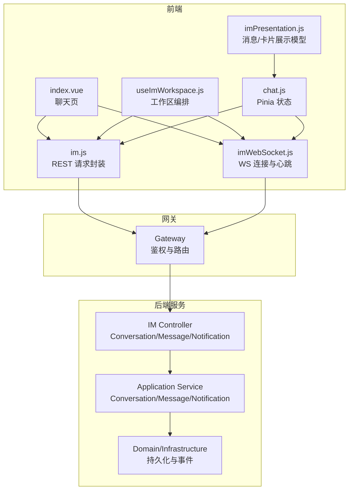
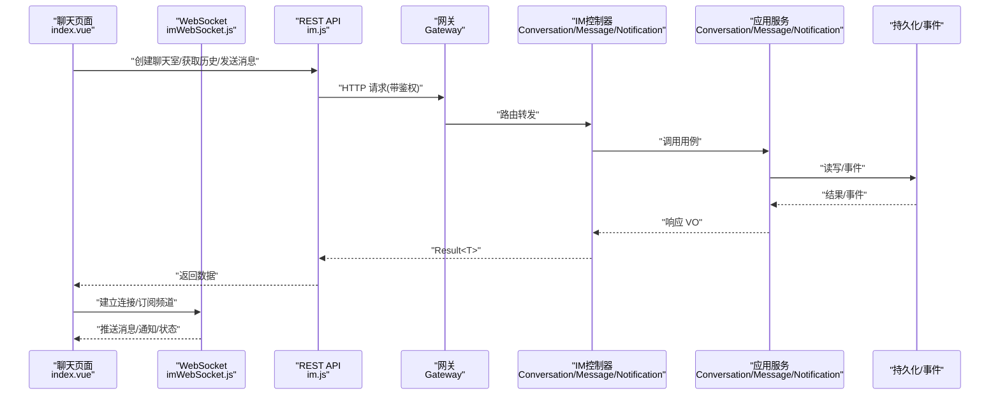
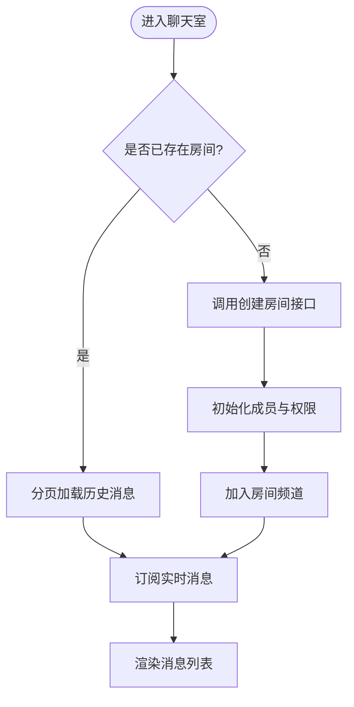
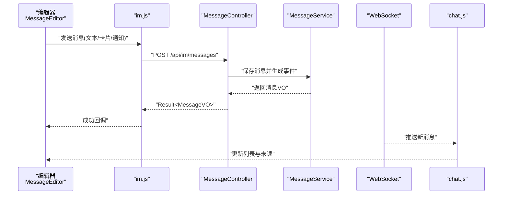
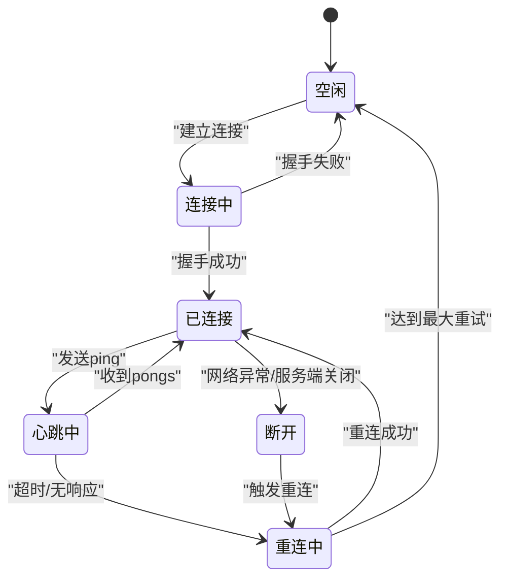
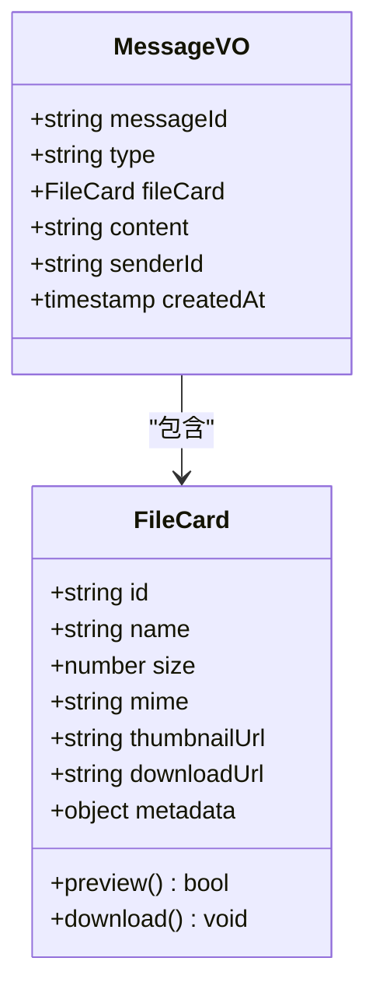
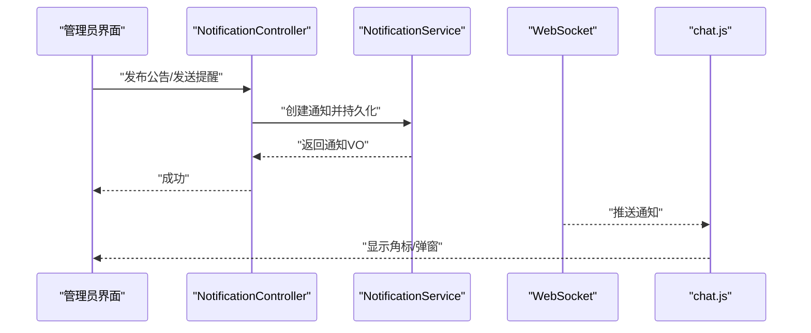
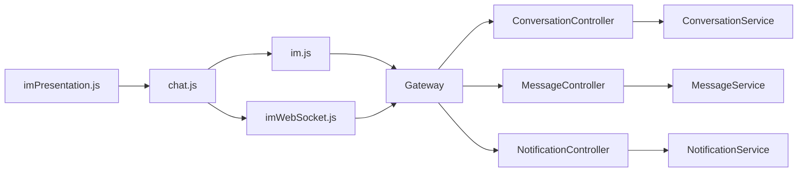

# 即时通讯API

<cite>
**本文引用的文件**   
- [ZXYZdatabaseFront/src/api/im.js](file://ZXYZdatabaseFront/src/api/im.js)
- [ZXYZdatabaseFront/src/utils/imWebSocket.js](file://ZXYZdatabaseFront/src/utils/imWebSocket.js)
- [ZXYZdatabaseFront/src/store/chat.js](file://ZXYZdatabaseFront/src/store/chat.js)
- [ZXYZdatabaseFront/src/models/imPresentation.js](file://ZXYZdatabaseFront/src/models/imPresentation.js)
- [ZXYZdatabaseFront/src/views/chat/index.vue](file://ZXYZdatabaseFront/src/views/chat/index.vue)
- [ZXYZdatabaseFront/src/composables/useImWorkspace.js](file://ZXYZdatabaseFront/src/composables/useImWorkspace.js)
- [ZXYZdatabaseBack/zxyz-im-service/src/main/java/uno/acloud/im/controller/ConversationController.java](file://ZXYZdatabaseBack/zxyz-im-service/src/main/java/uno/acloud/im/controller/ConversationController.java)
- [ZXYZdatabaseBack/zxyz-im-service/src/main/java/uno/acloud/im/controller/MessageController.java](file://ZXYZdatabaseBack/zxyz-im-service/src/main/java/uno/acloud/im/controller/MessageController.java)
- [ZXYZdatabaseBack/zxyz-im-service/src/main/java/uno/acloud/im/controller/NotificationController.java](file://ZXYZdatabaseBack/zxyz-im-service/src/main/java/uno/acloud/im/controller/NotificationController.java)
- [ZXYZdatabaseBack/zxyz-im-service/src/main/java/uno/acloud/im/application/ConversationService.java](file://ZXYZdatabaseBack/zxyz-im-service/src/main/java/uno/acloud/im/application/ConversationService.java)
- [ZXYZdatabaseBack/zxyz-im-service/src/main/java/uno/acloud/im/application/MessageService.java](file://ZXYZdatabaseBack/zxyz-im-service/src/main/java/uno/acloud/im/application/MessageService.java)
- [ZXYZdatabaseBack/zxyz-im-service/src/main/java/uno/acloud/im/application/NotificationService.java](file://ZXYZdatabaseBack/zxyz-im-service/src/main/java/uno/acloud/im/application/NotificationService.java)
- [ZXYZdatabaseBack/zxyz-im-service/src/main/java/uno/acloud/im/dto/CreateConversationRequest.java](file://ZXYZdatabaseBack/zxyz-im-service/src/main/java/uno/acloud/im/dto/CreateConversationRequest.java)
- [ZXYZdatabaseBack/zxyz-im-service/src/main/java/uno/acloud/im/dto/SendMessageRequest.java](file://ZXYZdatabaseBack/zxyz-im-service/src/main/java/uno/acloud/im/dto/SendMessageRequest.java)
- [ZXYZdatabaseBack/zxyz-im-service/src/main/java/uno/acloud/im/vo/ConversationVO.java](file://ZXYZdatabaseBack/zxyz-im-service/src/main/java/uno/acloud/im/vo/ConversationVO.java)
- [ZXYZdatabaseBack/zxyz-im-service/src/main/java/uno/acloud/im/vo/MessageVO.java](file://ZXYZdatabaseBack/zxyz-im-service/src/main/java/uno/acloud/im/vo/MessageVO.java)
- [ZXYZdatabaseBack/zxyz-im-service/src/main/java/uno/acloud/im/vo/NotificationVO.java](file://ZXYZdatabaseBack/zxyz-im-service/src/main/java/uno/acloud/im/vo/NotificationVO.java)
</cite>

## 目录
1. [简介](#简介)
2. [项目结构](#项目结构)
3. [核心组件](#核心组件)
4. [架构总览](#架构总览)
5. [详细组件分析](#详细组件分析)
6. [依赖关系分析](#依赖关系分析)
7. [性能考量](#性能考量)
8. [故障排查指南](#故障排查指南)
9. [结论](#结论)
10. [附录](#附录)

## 简介
本技术文档面向 ZXYZ 前端即时通讯模块的 API 封装，聚焦聊天室管理、消息收发、WebSocket 实时通信与系统通知等能力。文档从前端封装层到后端服务接口进行端到端说明，涵盖房间创建、成员管理、历史消息查询、文本消息与文件卡片发送、系统通知推送、WebSocket 连接维护（心跳与重连）以及完整接口清单与协议说明，帮助开发者快速集成与排障。

## 项目结构
前端即时通讯相关代码主要分布在以下位置：
- API 封装：src/api/im.js
- WebSocket 工具：src/utils/imWebSocket.js
- 状态管理：src/store/chat.js
- 数据模型与展示：src/models/imPresentation.js
- 页面入口与交互：src/views/chat/index.vue
- 工作区编排：src/composables/useImWorkspace.js

后端即时通讯服务位于 zxyz-im-service，采用 DDD 分层（interfaces → application → domain → infrastructure），对外暴露 REST 控制器与内部 DTO/VO。

**图表来源**
- [ZXYZdatabaseFront/src/api/im.js](file://ZXYZdatabaseFront/src/api/im.js)
- [ZXYZdatabaseFront/src/utils/imWebSocket.js](file://ZXYZdatabaseFront/src/utils/imWebSocket.js)
- [ZXYZdatabaseFront/src/store/chat.js](file://ZXYZdatabaseFront/src/store/chat.js)
- [ZXYZdatabaseFront/src/models/imPresentation.js](file://ZXYZdatabaseFront/src/models/imPresentation.js)
- [ZXYZdatabaseFront/src/views/chat/index.vue](file://ZXYZdatabaseFront/src/views/chat/index.vue)
- [ZXYZdatabaseFront/src/composables/useImWorkspace.js](file://ZXYZdatabaseFront/src/composables/useImWorkspace.js)
- [ZXYZdatabaseBack/zxyz-im-service/src/main/java/uno/acloud/im/controller/ConversationController.java](file://ZXYZdatabaseBack/zxyz-im-service/src/main/java/uno/acloud/im/controller/ConversationController.java)
- [ZXYZdatabaseBack/zxyz-im-service/src/main/java/uno/acloud/im/controller/MessageController.java](file://ZXYZdatabaseBack/zxyz-im-service/src/main/java/uno/acloud/im/controller/MessageController.java)
- [ZXYZdatabaseBack/zxyz-im-service/src/main/java/uno/acloud/im/controller/NotificationController.java](file://ZXYZdatabaseBack/zxyz-im-service/src/main/java/uno/acloud/im/controller/NotificationController.java)

**章节来源**
- [ZXYZdatabaseFront/src/api/im.js](file://ZXYZdatabaseFront/src/api/im.js)
- [ZXYZdatabaseFront/src/utils/imWebSocket.js](file://ZXYZdatabaseFront/src/utils/imWebSocket.js)
- [ZXYZdatabaseFront/src/store/chat.js](file://ZXYZdatabaseFront/src/store/chat.js)
- [ZXYZdatabaseFront/src/models/imPresentation.js](file://ZXYZdatabaseFront/src/models/imPresentation.js)
- [ZXYZdatabaseFront/src/views/chat/index.vue](file://ZXYZdatabaseFront/src/views/chat/index.vue)
- [ZXYZdatabaseFront/src/composables/useImWorkspace.js](file://ZXYZdatabaseFront/src/composables/useImWorkspace.js)
- [ZXYZdatabaseBack/zxyz-im-service/src/main/java/uno/acloud/im/controller/ConversationController.java](file://ZXYZdatabaseBack/zxyz-im-service/src/main/java/uno/acloud/im/controller/ConversationController.java)
- [ZXYZdatabaseBack/zxyz-im-service/src/main/java/uno/acloud/im/controller/MessageController.java](file://ZXYZdatabaseBack/zxyz-im-service/src/main/java/uno/acloud/im/controller/MessageController.java)
- [ZXYZdatabaseBack/zxyz-im-service/src/main/java/uno/acloud/im/controller/NotificationController.java](file://ZXYZdatabaseBack/zxyz-im-service/src/main/java/uno/acloud/im/controller/NotificationController.java)

## 核心组件
- 聊天室管理 API：提供房间创建、成员增删、权限变更、历史分页等能力。
- 消息收发 API：支持文本、文件卡片、系统通知等多种消息类型；提供历史查询与已读回执。
- WebSocket 实时通道：用于消息推送、在线状态、系统通知等实时场景。
- 文件卡片：统一的卡片数据结构与解析展示逻辑，支持预览、下载与跳转。
- 系统通知：公告发布、提醒发送、通知管理与用户侧聚合展示。

**章节来源**
- [ZXYZdatabaseBack/zxyz-im-service/src/main/java/uno/acloud/im/controller/ConversationController.java](file://ZXYZdatabaseBack/zxyz-im-service/src/main/java/uno/acloud/im/controller/ConversationController.java)
- [ZXYZdatabaseBack/zxyz-im-service/src/main/java/uno/acloud/im/controller/MessageController.java](file://ZXYZdatabaseBack/zxyz-im-service/src/main/java/uno/acloud/im/controller/MessageController.java)
- [ZXYZdatabaseBack/zxyz-im-service/src/main/java/uno/acloud/im/controller/NotificationController.java](file://ZXYZdatabaseBack/zxyz-im-service/src/main/java/uno/acloud/im/controller/NotificationController.java)
- [ZXYZdatabaseFront/src/api/im.js](file://ZXYZdatabaseFront/src/api/im.js)
- [ZXYZdatabaseFront/src/utils/imWebSocket.js](file://ZXYZdatabaseFront/src/utils/imWebSocket.js)
- [ZXYZdatabaseFront/src/models/imPresentation.js](file://ZXYZdatabaseFront/src/models/imPresentation.js)

## 架构总览
前端通过 im.js 发起 REST 请求，使用 imWebSocket.js 建立并维护 WebSocket 连接；chat.js 作为 Pinia Store 集中管理会话、消息与通知状态；imPresentation.js 负责消息与卡片的统一展示模型；页面 index.vue 与 useImWorkspace.js 编排业务流。后端 IM 服务以 Controller 暴露 REST，Application Service 处理用例，Domain/Infrastructure 完成持久化与事件分发。

**图表来源**
- [ZXYZdatabaseFront/src/views/chat/index.vue](file://ZXYZdatabaseFront/src/views/chat/index.vue)
- [ZXYZdatabaseFront/src/api/im.js](file://ZXYZdatabaseFront/src/api/im.js)
- [ZXYZdatabaseFront/src/utils/imWebSocket.js](file://ZXYZdatabaseFront/src/utils/imWebSocket.js)
- [ZXYZdatabaseBack/zxyz-im-service/src/main/java/uno/acloud/im/controller/ConversationController.java](file://ZXYZdatabaseBack/zxyz-im-service/src/main/java/uno/acloud/im/controller/ConversationController.java)
- [ZXYZdatabaseBack/zxyz-im-service/src/main/java/uno/acloud/im/controller/MessageController.java](file://ZXYZdatabaseBack/zxyz-im-service/src/main/java/uno/acloud/im/controller/MessageController.java)
- [ZXYZdatabaseBack/zxyz-im-service/src/main/java/uno/acloud/im/controller/NotificationController.java](file://ZXYZdatabaseBack/zxyz-im-service/src/main/java/uno/acloud/im/controller/NotificationController.java)

## 详细组件分析

### 聊天室管理接口
- 功能范围
  - 创建聊天室：指定名称、类型、初始成员与可见性策略。
  - 成员管理：邀请、移除、角色调整、权限同步。
  - 历史查询：按时间分页拉取聊天记录，支持过滤类型与关键词。
- 关键流程
  - 创建房间：前端调用创建接口，后端校验权限与参数，写入房间元数据并初始化成员关系。
  - 成员变更：前端触发邀请/移除，后端更新成员表并广播成员列表变化至房间频道。
  - 历史拉取：前端分页请求，后端按时间倒序返回消息摘要与详情。

**图表来源**
- [ZXYZdatabaseBack/zxyz-im-service/src/main/java/uno/acloud/im/controller/ConversationController.java](file://ZXYZdatabaseBack/zxyz-im-service/src/main/java/uno/acloud/im/controller/ConversationController.java)
- [ZXYZdatabaseBack/zxyz-im-service/src/main/java/uno/acloud/im/application/ConversationService.java](file://ZXYZdatabaseBack/zxyz-im-service/src/main/java/uno/acloud/im/application/ConversationService.java)
- [ZXYZdatabaseFront/src/api/im.js](file://ZXYZdatabaseFront/src/api/im.js)
- [ZXYZdatabaseFront/src/views/chat/index.vue](file://ZXYZdatabaseFront/src/views/chat/index.vue)

**章节来源**
- [ZXYZdatabaseBack/zxyz-im-service/src/main/java/uno/acloud/im/controller/ConversationController.java](file://ZXYZdatabaseBack/zxyz-im-service/src/main/java/uno/acloud/im/controller/ConversationController.java)
- [ZXYZdatabaseBack/zxyz-im-service/src/main/java/uno/acloud/im/application/ConversationService.java](file://ZXYZdatabaseBack/zxyz-im-service/src/main/java/uno/acloud/im/application/ConversationService.java)
- [ZXYZdatabaseBack/zxyz-im-service/src/main/java/uno/acloud/im/dto/CreateConversationRequest.java](file://ZXYZdatabaseBack/zxyz-im-service/src/main/java/uno/acloud/im/dto/CreateConversationRequest.java)
- [ZXYZdatabaseBack/zxyz-im-service/src/main/java/uno/acloud/im/vo/ConversationVO.java](file://ZXYZdatabaseBack/zxyz-im-service/src/main/java/uno/acloud/im/vo/ConversationVO.java)
- [ZXYZdatabaseFront/src/api/im.js](file://ZXYZdatabaseFront/src/api/im.js)
- [ZXYZdatabaseFront/src/views/chat/index.vue](file://ZXYZdatabaseFront/src/views/chat/index.vue)

### 消息发送与接收
- 消息类型
  - 文本消息：纯文本内容，支持富文本标记。
  - 文件卡片：包含文件元数据、缩略图、下载链接与预览能力。
  - 系统通知：平台级或房间级通知，如公告、提醒。
- 发送流程
  - 前端构造消息体，调用发送接口；后端落库并广播至房间频道。
  - 客户端收到推送后插入消息列表，更新未读数与滚动定位。
- 历史查询
  - 支持按时间窗口、消息类型、发送人等条件分页查询。

**图表来源**
- [ZXYZdatabaseFront/src/views/chat/index.vue](file://ZXYZdatabaseFront/src/views/chat/index.vue)
- [ZXYZdatabaseFront/src/api/im.js](file://ZXYZdatabaseFront/src/api/im.js)
- [ZXYZdatabaseBack/zxyz-im-service/src/main/java/uno/acloud/im/controller/MessageController.java](file://ZXYZdatabaseBack/zxyz-im-service/src/main/java/uno/acloud/im/controller/MessageController.java)
- [ZXYZdatabaseBack/zxyz-im-service/src/main/java/uno/acloud/im/application/MessageService.java](file://ZXYZdatabaseBack/zxyz-im-service/src/main/java/uno/acloud/im/application/MessageService.java)
- [ZXYZdatabaseBack/zxyz-im-service/src/main/java/uno/acloud/im/dto/SendMessageRequest.java](file://ZXYZdatabaseBack/zxyz-im-service/src/main/java/uno/acloud/im/dto/SendMessageRequest.java)
- [ZXYZdatabaseBack/zxyz-im-service/src/main/java/uno/acloud/im/vo/MessageVO.java](file://ZXYZdatabaseBack/zxyz-im-service/src/main/java/uno/acloud/im/vo/MessageVO.java)
- [ZXYZdatabaseFront/src/store/chat.js](file://ZXYZdatabaseFront/src/store/chat.js)

**章节来源**
- [ZXYZdatabaseBack/zxyz-im-service/src/main/java/uno/acloud/im/controller/MessageController.java](file://ZXYZdatabaseBack/zxyz-im-service/src/main/java/uno/acloud/im/controller/MessageController.java)
- [ZXYZdatabaseBack/zxyz-im-service/src/main/java/uno/acloud/im/application/MessageService.java](file://ZXYZdatabaseBack/zxyz-im-service/src/main/java/uno/acloud/im/application/MessageService.java)
- [ZXYZdatabaseBack/zxyz-im-service/src/main/java/uno/acloud/im/dto/SendMessageRequest.java](file://ZXYZdatabaseBack/zxyz-im-service/src/main/java/uno/acloud/im/dto/SendMessageRequest.java)
- [ZXYZdatabaseBack/zxyz-im-service/src/main/java/uno/acloud/im/vo/MessageVO.java](file://ZXYZdatabaseBack/zxyz-im-service/src/main/java/uno/acloud/im/vo/MessageVO.java)
- [ZXYZdatabaseFront/src/api/im.js](file://ZXYZdatabaseFront/src/api/im.js)
- [ZXYZdatabaseFront/src/store/chat.js](file://ZXYZdatabaseFront/src/store/chat.js)

### WebSocket 连接与维护
- 连接建立
  - 前端在登录成功后建立 WS 连接，携带鉴权信息（如 Cookie/Token）。
  - 服务端校验身份后，将连接绑定到用户或房间频道。
- 心跳检测
  - 客户端定时发送 ping，服务端回 ppong；超时则判定断开。
- 重连机制
  - 指数退避重试，失败时提示用户并允许手动重连。
- 消息推送
  - 服务端通过 WS 推送新消息、系统通知与在线状态变化。

**图表来源**
- [ZXYZdatabaseFront/src/utils/imWebSocket.js](file://ZXYZdatabaseFront/src/utils/imWebSocket.js)
- [ZXYZdatabaseFront/src/store/chat.js](file://ZXYZdatabaseFront/src/store/chat.js)

**章节来源**
- [ZXYZdatabaseFront/src/utils/imWebSocket.js](file://ZXYZdatabaseFront/src/utils/imWebSocket.js)
- [ZXYZdatabaseFront/src/store/chat.js](file://ZXYZdatabaseFront/src/store/chat.js)

### 文件卡片 API
- 卡片结构
  - 包含文件名、大小、MIME、缩略图 URL、下载链接、预览能力与扩展字段。
- 创建与解析
  - 上传完成后生成卡片元数据，前端统一解析为展示模型。
- 展示与交互
  - 支持点击预览、下载、分享与上下文操作。

**图表来源**
- [ZXYZdatabaseBack/zxyz-im-service/src/main/java/uno/acloud/im/vo/MessageVO.java](file://ZXYZdatabaseBack/zxyz-im-service/src/main/java/uno/acloud/im/vo/MessageVO.java)
- [ZXYZdatabaseFront/src/models/imPresentation.js](file://ZXYZdatabaseFront/src/models/imPresentation.js)

**章节来源**
- [ZXYZdatabaseBack/zxyz-im-service/src/main/java/uno/acloud/im/vo/MessageVO.java](file://ZXYZdatabaseBack/zxyz-im-service/src/main/java/uno/acloud/im/vo/MessageVO.java)
- [ZXYZdatabaseFront/src/models/imPresentation.js](file://ZXYZdatabaseFront/src/models/imPresentation.js)

### 系统通知接口
- 能力范围
  - 公告发布：全局或房间级公告，支持置顶与过期策略。
  - 提醒发送：任务到期、审批提醒等。
  - 通知管理：已读/未读、去重与聚合展示。
- 推送方式
  - 通过 WebSocket 实时推送，同时落库供历史查询。

**图表来源**
- [ZXYZdatabaseBack/zxyz-im-service/src/main/java/uno/acloud/im/controller/NotificationController.java](file://ZXYZdatabaseBack/zxyz-im-service/src/main/java/uno/acloud/im/controller/NotificationController.java)
- [ZXYZdatabaseBack/zxyz-im-service/src/main/java/uno/acloud/im/application/NotificationService.java](file://ZXYZdatabaseBack/zxyz-im-service/src/main/java/uno/acloud/im/application/NotificationService.java)
- [ZXYZdatabaseBack/zxyz-im-service/src/main/java/uno/acloud/im/vo/NotificationVO.java](file://ZXYZdatabaseBack/zxyz-im-service/src/main/java/uno/acloud/im/vo/NotificationVO.java)
- [ZXYZdatabaseFront/src/store/chat.js](file://ZXYZdatabaseFront/src/store/chat.js)

**章节来源**
- [ZXYZdatabaseBack/zxyz-im-service/src/main/java/uno/acloud/im/controller/NotificationController.java](file://ZXYZdatabaseBack/zxyz-im-service/src/main/java/uno/acloud/im/controller/NotificationController.java)
- [ZXYZdatabaseBack/zxyz-im-service/src/main/java/uno/acloud/im/application/NotificationService.java](file://ZXYZdatabaseBack/zxyz-im-service/src/main/java/uno/acloud/im/application/NotificationService.java)
- [ZXYZdatabaseBack/zxyz-im-service/src/main/java/uno/acloud/im/vo/NotificationVO.java](file://ZXYZdatabaseBack/zxyz-im-service/src/main/java/uno/acloud/im/vo/NotificationVO.java)
- [ZXYZdatabaseFront/src/store/chat.js](file://ZXYZdatabaseFront/src/store/chat.js)

## 依赖关系分析
- 前端依赖
  - im.js 依赖 HTTP 客户端与鉴权中间件。
  - imWebSocket.js 依赖浏览器 WebSocket API 与错误处理工具。
  - chat.js 依赖 Pinia 与事件总线，协调消息与通知状态。
  - imPresentation.js 定义消息与卡片的展示契约。
- 后端依赖
  - Controller 依赖 Application Service 实现用例。
  - Application Service 依赖 Domain/Infrastructure 完成持久化与事件。
  - 内部服务间调用遵循窄端点与投影模式，避免胖 DTO。

**图表来源**
- [ZXYZdatabaseFront/src/api/im.js](file://ZXYZdatabaseFront/src/api/im.js)
- [ZXYZdatabaseFront/src/utils/imWebSocket.js](file://ZXYZdatabaseFront/src/utils/imWebSocket.js)
- [ZXYZdatabaseFront/src/store/chat.js](file://ZXYZdatabaseFront/src/store/chat.js)
- [ZXYZdatabaseFront/src/models/imPresentation.js](file://ZXYZdatabaseFront/src/models/imPresentation.js)
- [ZXYZdatabaseBack/zxyz-im-service/src/main/java/uno/acloud/im/controller/ConversationController.java](file://ZXYZdatabaseBack/zxyz-im-service/src/main/java/uno/acloud/im/controller/ConversationController.java)
- [ZXYZdatabaseBack/zxyz-im-service/src/main/java/uno/acloud/im/controller/MessageController.java](file://ZXYZdatabaseBack/zxyz-im-service/src/main/java/uno/acloud/im/controller/MessageController.java)
- [ZXYZdatabaseBack/zxyz-im-service/src/main/java/uno/acloud/im/controller/NotificationController.java](file://ZXYZdatabaseBack/zxyz-im-service/src/main/java/uno/acloud/im/controller/NotificationController.java)
- [ZXYZdatabaseBack/zxyz-im-service/src/main/java/uno/acloud/im/application/ConversationService.java](file://ZXYZdatabaseBack/zxyz-im-service/src/main/java/uno/acloud/im/application/ConversationService.java)
- [ZXYZdatabaseBack/zxyz-im-service/src/main/java/uno/acloud/im/application/MessageService.java](file://ZXYZdatabaseBack/zxyz-im-service/src/main/java/uno/acloud/im/application/MessageService.java)
- [ZXYZdatabaseBack/zxyz-im-service/src/main/java/uno/acloud/im/application/NotificationService.java](file://ZXYZdatabaseBack/zxyz-im-service/src/main/java/uno/acloud/im/application/NotificationService.java)

**章节来源**
- [ZXYZdatabaseFront/src/api/im.js](file://ZXYZdatabaseFront/src/api/im.js)
- [ZXYZdatabaseFront/src/utils/imWebSocket.js](file://ZXYZdatabaseFront/src/utils/imWebSocket.js)
- [ZXYZdatabaseFront/src/store/chat.js](file://ZXYZdatabaseFront/src/store/chat.js)
- [ZXYZdatabaseFront/src/models/imPresentation.js](file://ZXYZdatabaseFront/src/models/imPresentation.js)
- [ZXYZdatabaseBack/zxyz-im-service/src/main/java/uno/acloud/im/controller/ConversationController.java](file://ZXYZdatabaseBack/zxyz-im-service/src/main/java/uno/acloud/im/controller/ConversationController.java)
- [ZXYZdatabaseBack/zxyz-im-service/src/main/java/uno/acloud/im/controller/MessageController.java](file://ZXYZdatabaseBack/zxyz-im-service/src/main/java/uno/acloud/im/controller/MessageController.java)
- [ZXYZdatabaseBack/zxyz-im-service/src/main/java/uno/acloud/im/controller/NotificationController.java](file://ZXYZdatabaseBack/zxyz-im-service/src/main/java/uno/acloud/im/controller/NotificationController.java)
- [ZXYZdatabaseBack/zxyz-im-service/src/main/java/uno/acloud/im/application/ConversationService.java](file://ZXYZdatabaseBack/zxyz-im-service/src/main/java/uno/acloud/im/application/ConversationService.java)
- [ZXYZdatabaseBack/zxyz-im-service/src/main/java/uno/acloud/im/application/MessageService.java](file://ZXYZdatabaseBack/zxyz-im-service/src/main/java/uno/acloud/im/application/MessageService.java)
- [ZXYZdatabaseBack/zxyz-im-service/src/main/java/uno/acloud/im/application/NotificationService.java](file://ZXYZdatabaseBack/zxyz-im-service/src/main/java/uno/acloud/im/application/NotificationService.java)

## 性能考量
- 分页与虚拟滚动：历史消息采用分页加载，配合虚拟滚动减少 DOM 压力。
- 批量操作：成员变更与消息批量发送应合并请求，降低网络开销。
- 缓存策略：房间元数据与最近消息可短期缓存，提升首屏速度。
- 心跳与重连：合理设置心跳间隔与退避策略，避免频繁重连造成抖动。
- 后端优化：消息落库与事件解耦，异步广播提高吞吐。

[本节为通用指导，不直接分析具体文件]

## 故障排查指南
- 连接问题
  - 检查鉴权 Cookie/Token 是否正确传递。
  - 查看 WebSocket 握手状态码与错误日志。
- 消息丢失
  - 确认消息落库成功与事件是否广播。
  - 核对客户端订阅频道与房间 ID。
- 卡片展示异常
  - 校验卡片元数据完整性（URL、MIME、大小）。
  - 检查前端解析逻辑与资源访问权限。
- 通知未达
  - 验证通知服务是否持久化与推送成功。
  - 检查用户订阅与未读计数更新。

**章节来源**
- [ZXYZdatabaseFront/src/utils/imWebSocket.js](file://ZXYZdatabaseFront/src/utils/imWebSocket.js)
- [ZXYZdatabaseFront/src/store/chat.js](file://ZXYZdatabaseFront/src/store/chat.js)
- [ZXYZdatabaseBack/zxyz-im-service/src/main/java/uno/acloud/im/controller/MessageController.java](file://ZXYZdatabaseBack/zxyz-im-service/src/main/java/uno/acloud/im/controller/MessageController.java)
- [ZXYZdatabaseBack/zxyz-im-service/src/main/java/uno/acloud/im/controller/NotificationController.java](file://ZXYZdatabaseBack/zxyz-im-service/src/main/java/uno/acloud/im/controller/NotificationController.java)

## 结论
本模块通过清晰的前端封装与后端 DDD 分层，实现了稳定的聊天室管理、消息收发、WebSocket 实时推送与系统通知能力。结合合理的分页、缓存与心跳重连策略，可在高并发场景下保持良好体验。建议持续完善错误监控与性能观测，确保稳定性与可维护性。

[本节为总结，不直接分析具体文件]

## 附录

### 接口清单（REST）
- 聊天室管理
  - 创建房间：POST /api/im/conversations
  - 获取房间详情：GET /api/im/conversations/{id}
  - 成员管理：POST /api/im/conversations/{id}/members
  - 历史消息：GET /api/im/conversations/{id}/messages
- 消息收发
  - 发送消息：POST /api/im/messages
  - 查询历史：GET /api/im/messages?conversationId=&type=&since=
  - 已读回执：PUT /api/im/messages/read
- 系统通知
  - 发布公告：POST /api/im/notifications
  - 发送提醒：POST /api/im/notifications/remind
  - 通知管理：GET/PUT /api/im/notifications/{id}

**章节来源**
- [ZXYZdatabaseBack/zxyz-im-service/src/main/java/uno/acloud/im/controller/ConversationController.java](file://ZXYZdatabaseBack/zxyz-im-service/src/main/java/uno/acloud/im/controller/ConversationController.java)
- [ZXYZdatabaseBack/zxyz-im-service/src/main/java/uno/acloud/im/controller/MessageController.java](file://ZXYZdatabaseBack/zxyz-im-service/src/main/java/uno/acloud/im/controller/MessageController.java)
- [ZXYZdatabaseBack/zxyz-im-service/src/main/java/uno/acloud/im/controller/NotificationController.java](file://ZXYZdatabaseBack/zxyz-im-service/src/main/java/uno/acloud/im/controller/NotificationController.java)

### WebSocket 协议说明
- 连接建立
  - 地址：ws(s)://{host}/ws/im?token={鉴权}
  - 握手：服务端校验身份，返回连接成功帧。
- 频道订阅
  - 订阅房间：{action:"subscribe", room:"{roomId}"}
  - 取消订阅：{action:"unsubscribe", room:"{roomId}"}
- 心跳
  - 客户端定时发送：{action:"ping"}
  - 服务端回复：{action:"pong"}
- 消息推送
  - 新消息：{type:"message", data:{...}}
  - 系统通知：{type:"notification", data:{...}}
  - 在线状态：{type:"presence", data:{...}}

**章节来源**
- [ZXYZdatabaseFront/src/utils/imWebSocket.js](file://ZXYZdatabaseFront/src/utils/imWebSocket.js)
- [ZXYZdatabaseBack/zxyz-im-service/src/main/java/uno/acloud/im/controller/MessageController.java](file://ZXYZdatabaseBack/zxyz-im-service/src/main/java/uno/acloud/im/controller/MessageController.java)
- [ZXYZdatabaseBack/zxyz-im-service/src/main/java/uno/acloud/im/controller/NotificationController.java](file://ZXYZdatabaseBack/zxyz-im-service/src/main/java/uno/acloud/im/controller/NotificationController.java)

### 消息格式与示例
- 文本消息
  - 字段：content、senderId、createdAt、conversationId
- 文件卡片
  - 字段：fileCard.name、size、mime、thumbnailUrl、downloadUrl、metadata
- 系统通知
  - 字段：title、body、scope、expireAt、priority

**章节来源**
- [ZXYZdatabaseBack/zxyz-im-service/src/main/java/uno/acloud/im/vo/MessageVO.java](file://ZXYZdatabaseBack/zxyz-im-service/src/main/java/uno/acloud/im/vo/MessageVO.java)
- [ZXYZdatabaseBack/zxyz-im-service/src/main/java/uno/acloud/im/vo/NotificationVO.java](file://ZXYZdatabaseBack/zxyz-im-service/src/main/java/uno/acloud/im/vo/NotificationVO.java)
- [ZXYZdatabaseFront/src/models/imPresentation.js](file://ZXYZdatabaseFront/src/models/imPresentation.js)

### 实际使用示例（步骤）
- 创建聊天室
  - 调用创建接口，传入名称与初始成员；成功后加入房间频道。
- 发送消息
  - 构造消息体，调用发送接口；收到推送后插入列表并滚动到底部。
- 订阅通知
  - 登录后建立 WS 连接并订阅用户频道；收到通知后更新角标与弹窗。

**章节来源**
- [ZXYZdatabaseFront/src/views/chat/index.vue](file://ZXYZdatabaseFront/src/views/chat/index.vue)
- [ZXYZdatabaseFront/src/composables/useImWorkspace.js](file://ZXYZdatabaseFront/src/composables/useImWorkspace.js)
- [ZXYZdatabaseFront/src/api/im.js](file://ZXYZdatabaseFront/src/api/im.js)
- [ZXYZdatabaseFront/src/utils/imWebSocket.js](file://ZXYZdatabaseFront/src/utils/imWebSocket.js)