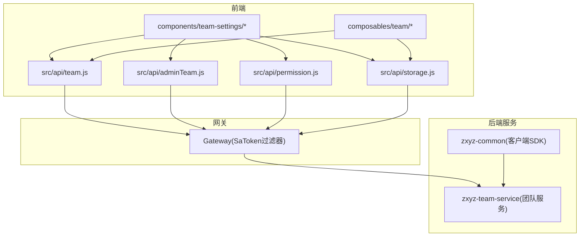
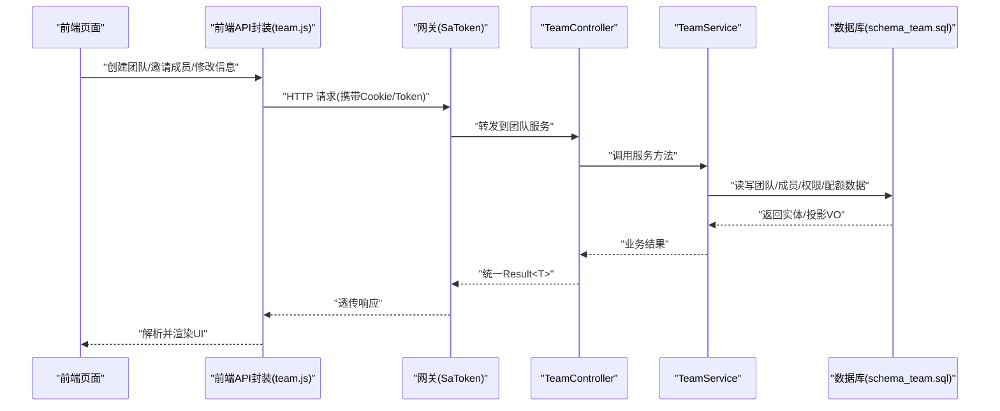
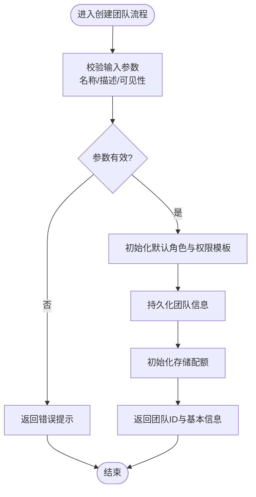
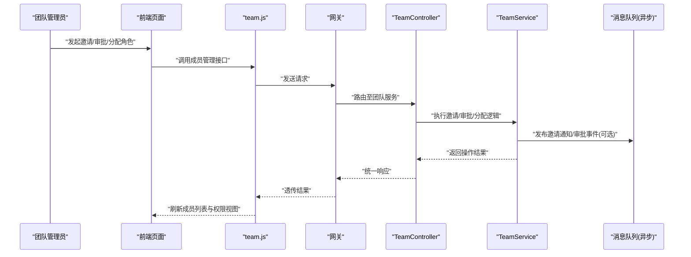
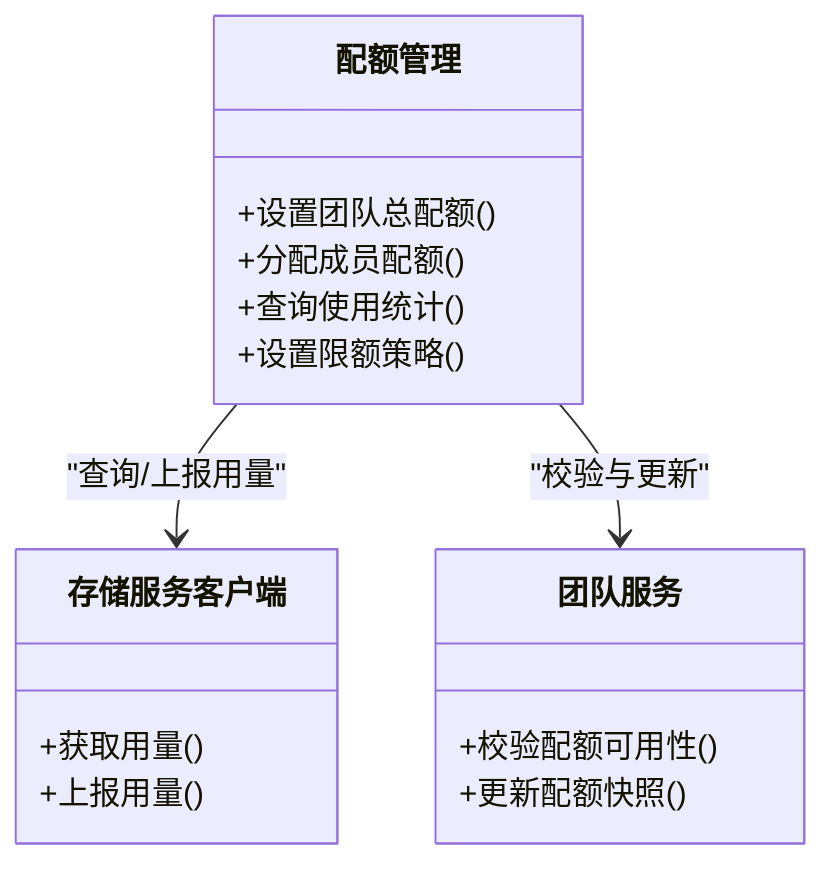
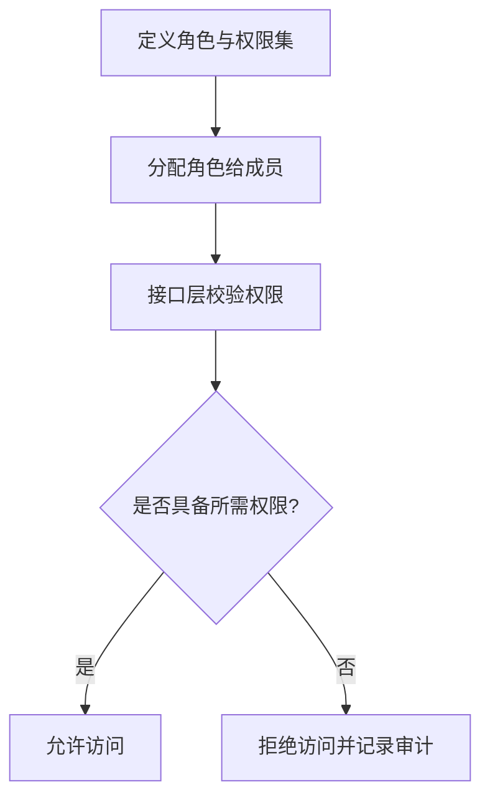
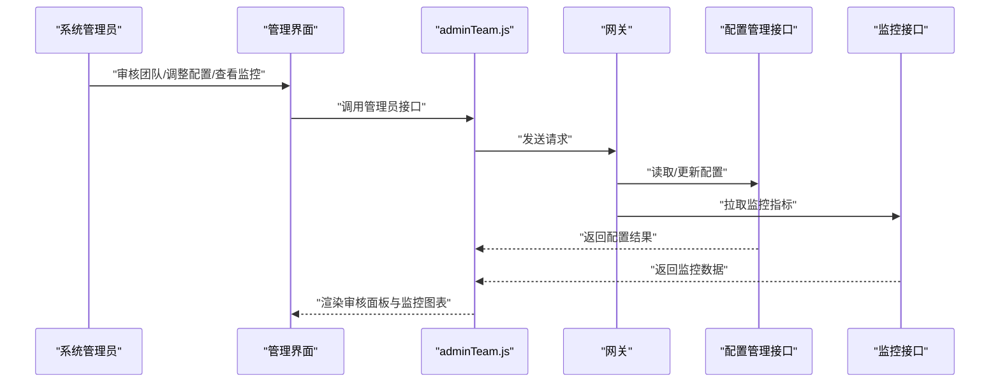
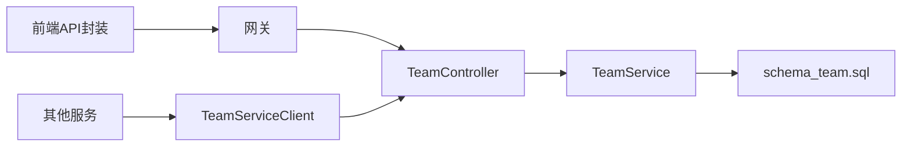

# 团队模块API

<cite>
**本文引用的文件**   
- [ZXYZdatabaseFront/src/api/team.js](file://ZXYZdatabaseFront/src/api/team.js)
- [ZXYZdatabaseFront/src/api/adminTeam.js](file://ZXYZdatabaseFront/src/api/adminTeam.js)
- [ZXYZdatabaseFront/src/api/permission.js](file://ZXYZdatabaseFront/src/api/permission.js)
- [ZXYZdatabaseFront/src/api/storage.js](file://ZXYZdatabaseFront/src/api/storage.js)
- [ZXYZdatabaseFront/src/components/team-settings/TeamManagementPanel.vue](file://ZXYZdatabaseFront/src/components/team-settings/TeamManagementPanel.vue)
- [ZXYZdatabaseFront/src/components/team-settings/TeamMemberPanel.vue](file://ZXYZdatabaseFront/src/components/team-settings/TeamMemberPanel.vue)
- [ZXYZdatabaseFront/src/components/team-settings/TeamRequestsPanel.vue](file://ZXYZdatabaseFront/src/components/team-settings/TeamRequestsPanel.vue)
- [ZXYZdatabaseFront/src/components/team-settings/TeamStoragePanel.vue](file://ZXYZdatabaseFront/src/components/team-settings/TeamStoragePanel.vue)
- [ZXYZdatabaseFront/src/composables/team/useTeamManagement.js](file://ZXYZdatabaseFront/src/composables/team/useTeamManagement.js)
- [ZXYZdatabaseFront/src/composables/team/useTeamStorageAllocation.js](file://ZXYZdatabaseFront/src/composables/team/useTeamStorageAllocation.js)
- [ZXYZdatabaseBack/zxyz-team-service/src/main/java/uno/acloud/team/controller/TeamController.java](file://ZXYZdatabaseBack/zxyz-team-service/src/main/java/uno/acloud/team/controller/TeamController.java)
- [ZXYZdatabaseBack/zxyz-team-service/src/main/java/uno/acloud/team/service/TeamService.java](file://ZXYZdatabaseBack/zxyz-team-service/src/main/java/uno/acloud/team/service/TeamService.java)
- [ZXYZdatabaseBack/zxyz-common/src/main/java/uno/acloud/client/TeamServiceClient.java](file://ZXYZdatabaseBack/zxyz-common/src/main/java/uno/acloud/client/TeamServiceClient.java)
- [ZXYZdatabaseBack/sql/schema_team.sql](file://ZXYZdatabaseBack/sql/schema_team.sql)
</cite>

## 目录
1. [简介](#简介)
2. [项目结构](#项目结构)
3. [核心组件](#核心组件)
4. [架构总览](#架构总览)
5. [详细组件分析](#详细组件分析)
6. [依赖关系分析](#依赖关系分析)
7. [性能考量](#性能考量)
8. [故障排查指南](#故障排查指南)
9. [结论](#结论)
10. [附录：接口清单与示例](#附录接口清单与示例)

## 简介
本技术文档面向 ZXYZ 前端团队的“团队模块”API 封装，覆盖以下能力：
- 团队管理：创建团队、修改基本信息、状态管理（启用/禁用等）
- 成员管理：邀请成员、加入审批、角色分配与权限控制
- 配额管理：存储空间分配、使用统计、限额设置
- 权限系统：角色定义、权限分配、访问控制
- 系统管理员：团队审核、配置管理与监控功能

文档以“渐进式复杂度”组织内容，既提供高层架构图与数据流说明，也给出关键接口的参数格式、响应结构与调用示例路径，帮助前后端开发者快速对接与排障。

## 项目结构
前端团队模块的 API 封装主要位于 src/api 目录，按业务域拆分：
- team.js：团队与成员相关接口封装
- adminTeam.js：系统管理员对团队的审核与管理接口
- permission.js：权限与角色相关接口
- storage.js：存储配额与用量统计接口

对应的 UI 面板集中在 components/team-settings 下，组合 useTeamManagement.js 与 useTeamStorageAllocation.js 等 composables 完成交互逻辑。后端由 zxyz-team-service 暴露 REST 接口，并通过 zxyz-common 中的 TeamServiceClient 被其他服务调用。

图表来源
- [ZXYZdatabaseFront/src/api/team.js](file://ZXYZdatabaseFront/src/api/team.js)
- [ZXYZdatabaseFront/src/api/adminTeam.js](file://ZXYZdatabaseFront/src/api/adminTeam.js)
- [ZXYZdatabaseFront/src/api/permission.js](file://ZXYZdatabaseFront/src/api/permission.js)
- [ZXYZdatabaseFront/src/api/storage.js](file://ZXYZdatabaseFront/src/api/storage.js)
- [ZXYZdatabaseBack/zxyz-team-service/src/main/java/uno/acloud/team/controller/TeamController.java](file://ZXYZdatabaseBack/zxyz-team-service/src/main/java/uno/acloud/team/controller/TeamController.java)
- [ZXYZdatabaseBack/zxyz-common/src/main/java/uno/acloud/client/TeamServiceClient.java](file://ZXYZdatabaseBack/zxyz-common/src/main/java/uno/acloud/client/TeamServiceClient.java)

章节来源
- [ZXYZdatabaseFront/src/api/team.js](file://ZXYZdatabaseFront/src/api/team.js)
- [ZXYZdatabaseFront/src/api/adminTeam.js](file://ZXYZdatabaseFront/src/api/adminTeam.js)
- [ZXYZdatabaseFront/src/api/permission.js](file://ZXYZdatabaseFront/src/api/permission.js)
- [ZXYZdatabaseFront/src/api/storage.js](file://ZXYZdatabaseFront/src/api/storage.js)
- [ZXYZdatabaseBack/zxyz-team-service/src/main/java/uno/acloud/team/controller/TeamController.java](file://ZXYZdatabaseBack/zxyz-team-service/src/main/java/uno/acloud/team/controller/TeamController.java)
- [ZXYZdatabaseBack/zxyz-common/src/main/java/uno/acloud/client/TeamServiceClient.java](file://ZXYZdatabaseBack/zxyz-common/src/main/java/uno/acloud/client/TeamServiceClient.java)

## 核心组件
- 团队控制器（TeamController）：对外暴露团队 CRUD、成员管理、状态管理等 REST 端点
- 团队服务（TeamService）：实现团队领域逻辑，协调成员、权限、配额等子域
- 前端 API 封装（team.js、adminTeam.js、permission.js、storage.js）：统一请求封装、错误处理与结果映射
- 前端 Composables（useTeamManagement.js、useTeamStorageAllocation.js）：封装团队与存储配额的常用操作
- 前端面板（TeamManagementPanel、TeamMemberPanel、TeamRequestsPanel、TeamStoragePanel）：承载用户交互与数据展示

章节来源
- [ZXYZdatabaseBack/zxyz-team-service/src/main/java/uno/acloud/team/controller/TeamController.java](file://ZXYZdatabaseBack/zxyz-team-service/src/main/java/uno/acloud/team/controller/TeamController.java)
- [ZXYZdatabaseBack/zxyz-team-service/src/main/java/uno/acloud/team/service/TeamService.java](file://ZXYZdatabaseBack/zxyz-team-service/src/main/java/uno/acloud/team/service/TeamService.java)
- [ZXYZdatabaseFront/src/api/team.js](file://ZXYZdatabaseFront/src/api/team.js)
- [ZXYZdatabaseFront/src/api/adminTeam.js](file://ZXYZdatabaseFront/src/api/adminTeam.js)
- [ZXYZdatabaseFront/src/api/permission.js](file://ZXYZdatabaseFront/src/api/permission.js)
- [ZXYZdatabaseFront/src/api/storage.js](file://ZXYZdatabaseFront/src/api/storage.js)
- [ZXYZdatabaseFront/src/composables/team/useTeamManagement.js](file://ZXYZdatabaseFront/src/composables/team/useTeamManagement.js)
- [ZXYZdatabaseFront/src/composables/team/useTeamStorageAllocation.js](file://ZXYZdatabaseFront/src/composables/team/useTeamStorageAllocation.js)

## 架构总览
整体采用微服务架构，前端通过 Gateway（SaToken 鉴权）访问后端服务。团队模块涉及团队服务、权限子系统、存储配额子系统以及审计与消息队列（异步流程）。内部服务间调用通过 TeamServiceClient + X-Internal-Service-Token 鉴权，避免公网暴露。

图表来源
- [ZXYZdatabaseFront/src/api/team.js](file://ZXYZdatabaseFront/src/api/team.js)
- [ZXYZdatabaseBack/zxyz-team-service/src/main/java/uno/acloud/team/controller/TeamController.java](file://ZXYZdatabaseBack/zxyz-team-service/src/main/java/uno/acloud/team/controller/TeamController.java)
- [ZXYZdatabaseBack/zxyz-team-service/src/main/java/uno/acloud/team/service/TeamService.java](file://ZXYZdatabaseBack/zxyz-team-service/src/main/java/uno/acloud/team/service/TeamService.java)
- [ZXYZdatabaseBack/sql/schema_team.sql](file://ZXYZdatabaseBack/sql/schema_team.sql)

## 详细组件分析

### 团队管理接口（创建、基本信息修改、状态管理）
- 创建团队：校验名称唯一性、初始化默认角色与权限模板、写入团队基础信息与配额初始值
- 基本信息修改：更新团队名称、描述、Logo、可见性等元数据
- 状态管理：启用/禁用团队，影响成员登录与资源访问

图表来源
- [ZXYZdatabaseBack/zxyz-team-service/src/main/java/uno/acloud/team/controller/TeamController.java](file://ZXYZdatabaseBack/zxyz-team-service/src/main/java/uno/acloud/team/controller/TeamController.java)
- [ZXYZdatabaseBack/zxyz-team-service/src/main/java/uno/acloud/team/service/TeamService.java](file://ZXYZdatabaseBack/zxyz-team-service/src/main/java/uno/acloud/team/service/TeamService.java)
- [ZXYZdatabaseBack/sql/schema_team.sql](file://ZXYZdatabaseBack/sql/schema_team.sql)

章节来源
- [ZXYZdatabaseBack/zxyz-team-service/src/main/java/uno/acloud/team/controller/TeamController.java](file://ZXYZdatabaseBack/zxyz-team-service/src/main/java/uno/acloud/team/controller/TeamController.java)
- [ZXYZdatabaseBack/zxyz-team-service/src/main/java/uno/acloud/team/service/TeamService.java](file://ZXYZdatabaseBack/zxyz-team-service/src/main/java/uno/acloud/team/service/TeamService.java)
- [ZXYZdatabaseBack/sql/schema_team.sql](file://ZXYZdatabaseBack/sql/schema_team.sql)

### 成员管理接口（邀请、加入审批、角色分配、权限控制）
- 邀请成员：支持邮箱/用户名邀请，生成邀请码或链接，记录邀请状态
- 加入审批：根据团队策略（开放/审批制）自动或通过管理员审批
- 角色分配：为成员分配团队内角色（如成员、管理员），继承对应权限集
- 权限控制：基于角色的访问控制（RBAC），结合团队级与项目级权限

图表来源
- [ZXYZdatabaseFront/src/api/team.js](file://ZXYZdatabaseFront/src/api/team.js)
- [ZXYZdatabaseBack/zxyz-team-service/src/main/java/uno/acloud/team/controller/TeamController.java](file://ZXYZdatabaseBack/zxyz-team-service/src/main/java/uno/acloud/team/controller/TeamController.java)
- [ZXYZdatabaseBack/zxyz-team-service/src/main/java/uno/acloud/team/service/TeamService.java](file://ZXYZdatabaseBack/zxyz-team-service/src/main/java/uno/acloud/team/service/TeamService.java)

章节来源
- [ZXYZdatabaseFront/src/components/team-settings/TeamMemberPanel.vue](file://ZXYZdatabaseFront/src/components/team-settings/TeamMemberPanel.vue)
- [ZXYZdatabaseFront/src/components/team-settings/TeamRequestsPanel.vue](file://ZXYZdatabaseFront/src/components/team-settings/TeamRequestsPanel.vue)
- [ZXYZdatabaseFront/src/api/team.js](file://ZXYZdatabaseFront/src/api/team.js)

### 配额管理接口（存储空间分配、使用统计、限额设置）
- 存储空间分配：为团队设定总配额，支持按成员或项目细分
- 使用统计：聚合文件服务用量，计算已用空间与剩余配额
- 限额设置：限制单文件大小、上传频率、并发数等

图表来源
- [ZXYZdatabaseFront/src/api/storage.js](file://ZXYZdatabaseFront/src/api/storage.js)
- [ZXYZdatabaseBack/zxyz-common/src/main/java/uno/acloud/client/TeamServiceClient.java](file://ZXYZdatabaseBack/zxyz-common/src/main/java/uno/acloud/client/TeamServiceClient.java)

章节来源
- [ZXYZdatabaseFront/src/components/team-settings/TeamStoragePanel.vue](file://ZXYZdatabaseFront/src/components/team-settings/TeamStoragePanel.vue)
- [ZXYZdatabaseFront/src/composables/team/useTeamStorageAllocation.js](file://ZXYZdatabaseFront/src/composables/team/useTeamStorageAllocation.js)
- [ZXYZdatabaseFront/src/api/storage.js](file://ZXYZdatabaseFront/src/api/storage.js)

### 权限系统接口（角色定义、权限分配、访问控制）
- 角色定义：预置团队角色（成员、管理员等），支持自定义扩展
- 权限分配：将权限集合绑定到角色，支持团队级与项目级权限
- 访问控制：在接口层进行 RBAC 校验，结合 SaToken 鉴权

图表来源
- [ZXYZdatabaseFront/src/api/permission.js](file://ZXYZdatabaseFront/src/api/permission.js)
- [ZXYZdatabaseBack/zxyz-team-service/src/main/java/uno/acloud/team/service/TeamService.java](file://ZXYZdatabaseBack/zxyz-team-service/src/main/java/uno/acloud/team/service/TeamService.java)

章节来源
- [ZXYZdatabaseFront/src/api/permission.js](file://ZXYZdatabaseFront/src/api/permission.js)
- [ZXYZdatabaseBack/zxyz-team-service/src/main/java/uno/acloud/team/service/TeamService.java](file://ZXYZdatabaseBack/zxyz-team-service/src/main/java/uno/acloud/team/service/TeamService.java)

### 系统管理员接口（团队审核、配置管理、监控）
- 团队审核：对新注册或受限团队进行人工审核，通过后启用
- 配置管理：通过配置中心调整团队策略（如邀请策略、配额上限）
- 监控：查看团队活跃度、成员变更、配额使用趋势

图表来源
- [ZXYZdatabaseFront/src/api/adminTeam.js](file://ZXYZdatabaseFront/src/api/adminTeam.js)
- [ZXYZdatabaseBack/zxyz-admin-service/src/main/java/uno/acloud/admin/controller/ConfigAdminController.java](file://ZXYZdatabaseBack/zxyz-admin-service/src/main/java/uno/acloud/admin/controller/ConfigAdminController.java)

章节来源
- [ZXYZdatabaseFront/src/api/adminTeam.js](file://ZXYZdatabaseFront/src/api/adminTeam.js)
- [ZXYZdatabaseBack/zxyz-admin-service/src/main/java/uno/acloud/admin/controller/ConfigAdminController.java](file://ZXYZdatabaseBack/zxyz-admin-service/src/main/java/uno/acloud/admin/controller/ConfigAdminController.java)

## 依赖关系分析
- 前端依赖：
  - team.js、adminTeam.js、permission.js、storage.js 分别封装团队、管理员、权限、存储相关接口
  - TeamManagementPanel、TeamMemberPanel、TeamRequestsPanel、TeamStoragePanel 消费上述 API
  - useTeamManagement.js、useTeamStorageAllocation.js 封装常用操作与状态管理
- 后端依赖：
  - TeamController 暴露 REST 端点，TeamService 实现业务逻辑
  - TeamServiceClient 供其他服务调用团队服务（窄端点+投影 VO）
  - schema_team.sql 定义团队、成员、角色、权限、配额等表结构

图表来源
- [ZXYZdatabaseFront/src/api/team.js](file://ZXYZdatabaseFront/src/api/team.js)
- [ZXYZdatabaseFront/src/api/adminTeam.js](file://ZXYZdatabaseFront/src/api/adminTeam.js)
- [ZXYZdatabaseFront/src/api/permission.js](file://ZXYZdatabaseFront/src/api/permission.js)
- [ZXYZdatabaseFront/src/api/storage.js](file://ZXYZdatabaseFront/src/api/storage.js)
- [ZXYZdatabaseBack/zxyz-team-service/src/main/java/uno/acloud/team/controller/TeamController.java](file://ZXYZdatabaseBack/zxyz-team-service/src/main/java/uno/acloud/team/controller/TeamController.java)
- [ZXYZdatabaseBack/zxyz-team-service/src/main/java/uno/acloud/team/service/TeamService.java](file://ZXYZdatabaseBack/zxyz-team-service/src/main/java/uno/acloud/team/service/TeamService.java)
- [ZXYZdatabaseBack/zxyz-common/src/main/java/uno/acloud/client/TeamServiceClient.java](file://ZXYZdatabaseBack/zxyz-common/src/main/java/uno/acloud/client/TeamServiceClient.java)
- [ZXYZdatabaseBack/sql/schema_team.sql](file://ZXYZdatabaseBack/sql/schema_team.sql)

章节来源
- [ZXYZdatabaseFront/src/components/team-settings/TeamManagementPanel.vue](file://ZXYZdatabaseFront/src/components/team-settings/TeamManagementPanel.vue)
- [ZXYZdatabaseFront/src/components/team-settings/TeamMemberPanel.vue](file://ZXYZdatabaseFront/src/components/team-settings/TeamMemberPanel.vue)
- [ZXYZdatabaseFront/src/components/team-settings/TeamRequestsPanel.vue](file://ZXYZdatabaseFront/src/components/team-settings/TeamRequestsPanel.vue)
- [ZXYZdatabaseFront/src/components/team-settings/TeamStoragePanel.vue](file://ZXYZdatabaseFront/src/components/team-settings/TeamStoragePanel.vue)
- [ZXYZdatabaseFront/src/composables/team/useTeamManagement.js](file://ZXYZdatabaseFront/src/composables/team/useTeamManagement.js)
- [ZXYZdatabaseFront/src/composables/team/useTeamStorageAllocation.js](file://ZXYZdatabaseFront/src/composables/team/useTeamStorageAllocation.js)

## 性能考量
- 接口设计遵循窄端点与投影模式，减少不必要字段传输，提升网络效率
- 使用分页与懒加载优化成员列表与配额统计展示
- 异步流程（邀请通知、审批事件）通过消息队列解耦，降低主链路延迟
- 缓存热点数据（如角色与权限集）以减少重复查询

[本节为通用指导，不直接分析具体文件]

## 故障排查指南
- 认证失败：检查 SaToken Cookie 与 Redis Session；确认 Gateway 过滤器放行
- 权限不足：核对成员角色与权限集绑定；检查接口层 RBAC 校验
- 配额超限：确认团队总配额与成员配额分配；查看文件服务用量上报
- 邀请未生效：检查消息队列消费者与重试机制；查看审计日志

章节来源
- [ZXYZdatabaseFront/src/utils/request.js](file://ZXYZdatabaseFront/src/utils/request.js)
- [ZXYZdatabaseBack/zxyz-team-service/src/main/java/uno/acloud/team/service/TeamService.java](file://ZXYZdatabaseBack/zxyz-team-service/src/main/java/uno/acloud/team/service/TeamService.java)

## 结论
团队模块 API 围绕“团队—成员—权限—配额”四大核心能力构建，前端通过清晰的 API 封装与可复用的 composables 实现高效开发，后端以微服务分层与窄端点设计保障可扩展性与安全性。建议在实际对接中严格遵循投影 VO 规范与统一 Result<T> 响应结构，确保跨服务一致性与可维护性。

[本节为总结性内容，不直接分析具体文件]

## 附录：接口清单与示例
以下为团队模块常用接口概览（仅列出端点与用途，具体参数与响应结构请参考各 API 文件）：
- 团队管理
  - POST /api/team/create：创建团队
  - PUT /api/team/update：修改团队基本信息
  - PATCH /api/team/status：启用/禁用团队
- 成员管理
  - POST /api/team/member/invite：邀请成员
  - POST /api/team/member/approve：审批加入申请
  - PUT /api/team/member/role：分配角色
- 配额管理
  - GET /api/team/storage/quota：查询配额与用量
  - PUT /api/team/storage/limit：设置限额
- 权限系统
  - GET /api/team/roles：获取角色列表
  - PUT /api/team/permissions：分配权限
- 系统管理员
  - POST /api/admin/team/review：团队审核
  - GET /api/admin/config：读取配置
  - GET /api/admin/monitor：监控指标

调用示例路径（不含代码内容）：
- 前端调用示例参考：
  - [ZXYZdatabaseFront/src/api/team.js](file://ZXYZdatabaseFront/src/api/team.js)
  - [ZXYZdatabaseFront/src/api/adminTeam.js](file://ZXYZdatabaseFront/src/api/adminTeam.js)
  - [ZXYZdatabaseFront/src/api/permission.js](file://ZXYZdatabaseFront/src/api/permission.js)
  - [ZXYZdatabaseFront/src/api/storage.js](file://ZXYZdatabaseFront/src/api/storage.js)
- 后端控制器与服务参考：
  - [ZXYZdatabaseBack/zxyz-team-service/src/main/java/uno/acloud/team/controller/TeamController.java](file://ZXYZdatabaseBack/zxyz-team-service/src/main/java/uno/acloud/team/controller/TeamController.java)
  - [ZXYZdatabaseBack/zxyz-team-service/src/main/java/uno/acloud/team/service/TeamService.java](file://ZXYZdatabaseBack/zxyz-team-service/src/main/java/uno/acloud/team/service/TeamService.java)

章节来源
- [ZXYZdatabaseFront/src/api/team.js](file://ZXYZdatabaseFront/src/api/team.js)
- [ZXYZdatabaseFront/src/api/adminTeam.js](file://ZXYZdatabaseFront/src/api/adminTeam.js)
- [ZXYZdatabaseFront/src/api/permission.js](file://ZXYZdatabaseFront/src/api/permission.js)
- [ZXYZdatabaseFront/src/api/storage.js](file://ZXYZdatabaseFront/src/api/storage.js)
- [ZXYZdatabaseBack/zxyz-team-service/src/main/java/uno/acloud/team/controller/TeamController.java](file://ZXYZdatabaseBack/zxyz-team-service/src/main/java/uno/acloud/team/controller/TeamController.java)
- [ZXYZdatabaseBack/zxyz-team-service/src/main/java/uno/acloud/team/service/TeamService.java](file://ZXYZdatabaseBack/zxyz-team-service/src/main/java/uno/acloud/team/service/TeamService.java)