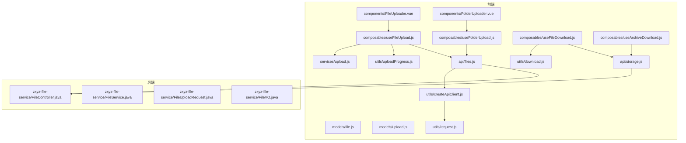
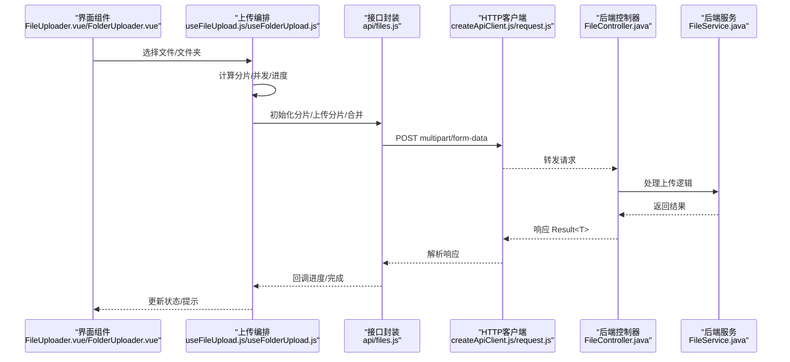
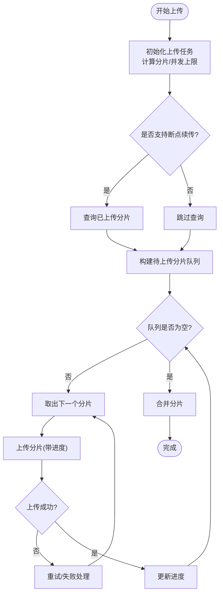
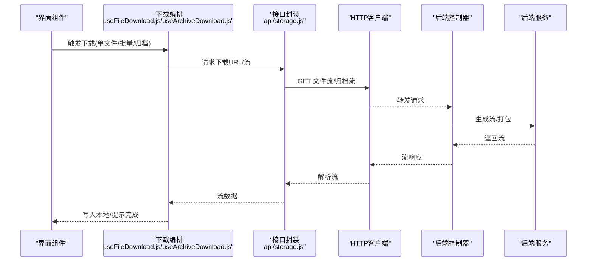
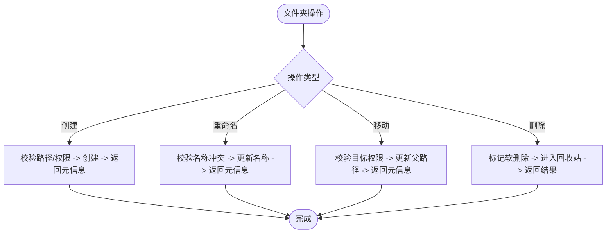
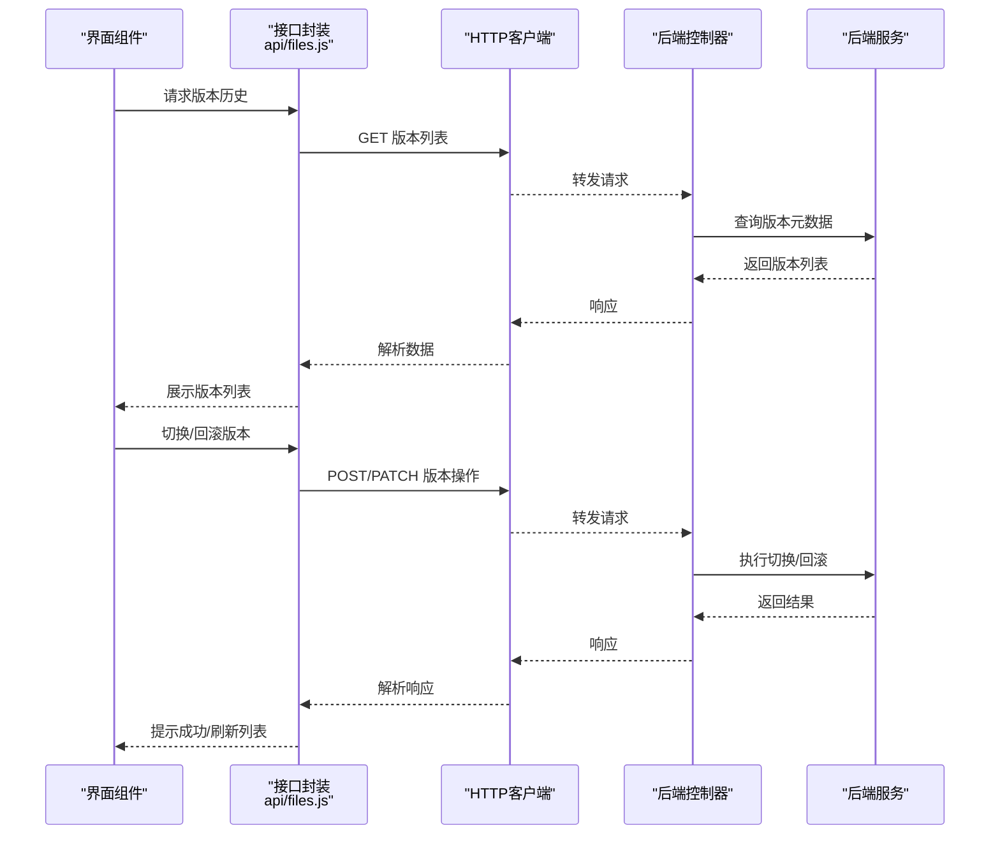
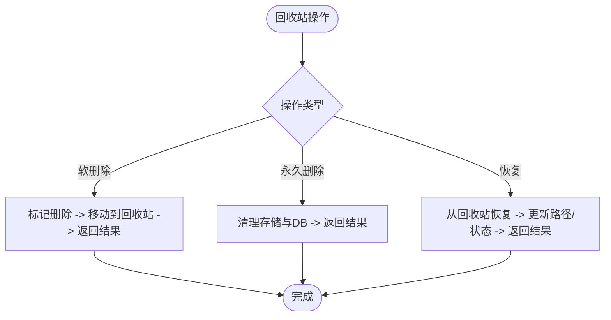
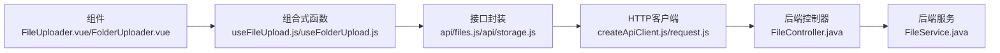

# 文件模块API

<cite>
**本文引用的文件**   
- [ZXYZdatabaseFront/src/api/files.js](file://ZXYZdatabaseFront/src/api/files.js)
- [ZXYZdatabaseFront/src/api/storage.js](file://ZXYZdatabaseFront/src/api/storage.js)
- [ZXYZdatabaseFront/src/components/FileUploader.vue](file://ZXYZdatabaseFront/src/components/FileUploader.vue)
- [ZXYZdatabaseFront/src/components/FolderUploader.vue](file://ZXYZdatabaseFront/src/components/FolderUploader.vue)
- [ZXYZdatabaseFront/src/composables/useFileUpload.js](file://ZXYZdatabaseFront/src/composables/useFileUpload.js)
- [ZXYZdatabaseFront/src/composables/useFolderUpload.js](file://ZXYZdatabaseFront/src/composables/useFolderUpload.js)
- [ZXYZdatabaseFront/src/composables/useFileDownload.js](file://ZXYZdatabaseFront/src/composables/useFileDownload.js)
- [ZXYZdatabaseFront/src/composables/useArchiveDownload.js](file://ZXYZdatabaseFront/src/composables/useArchiveDownload.js)
- [ZXYZdatabaseFront/src/utils/uploadProgress.js](file://ZXYZdatabaseFront/src/utils/uploadProgress.js)
- [ZXYZdatabaseFront/src/utils/download.js](file://ZXYZdatabaseFront/src/utils/download.js)
- [ZXYZdatabaseFront/src/models/file.js](file://ZXYZdatabaseFront/src/models/file.js)
- [ZXYZdatabaseFront/src/models/upload.js](file://ZXYZdatabaseFront/src/models/upload.js)
- [ZXYZdatabaseFront/src/services/upload.js](file://ZXYZdatabaseFront/src/services/upload.js)
- [ZXYZdatabaseFront/src/utils/createApiClient.js](file://ZXYZdatabaseFront/src/utils/createApiClient.js)
- [ZXYZdatabaseFront/src/utils/request.js](file://ZXYZdatabaseFront/src/utils/request.js)
- [ZXYZdatabaseBack/zxyz-file-service/src/main/java/uno/acloud/file/controller/FileController.java](file://ZXYZdatabaseBack/zxyz-file-service/src/main/java/uno/acloud/file/controller/FileController.java)
- [ZXYZdatabaseBack/zxyz-file-service/src/main/java/uno/acloud/file/service/FileService.java](file://ZXYZdatabaseBack/zxyz-file-service/src/main/java/uno/acloud/file/service/FileService.java)
- [ZXYZdatabaseBack/zxyz-file-service/src/main/java/uno/acloud/file/dto/FileUploadRequest.java](file://ZXYZdatabaseBack/zxyz-file-service/src/main/java/uno/acloud/file/dto/FileUploadRequest.java)
- [ZXYZdatabaseBack/zxyz-file-service/src/main/java/uno/acloud/file/vo/FileVO.java](file://ZXYZdatabaseBack/zxyz-file-service/src/main/java/uno/acloud/file/vo/FileVO.java)
</cite>

## 目录
1. [简介](#简介)
2. [项目结构](#项目结构)
3. [核心组件](#核心组件)
4. [架构总览](#架构总览)
5. [详细组件分析](#详细组件分析)
6. [依赖关系分析](#依赖关系分析)
7. [性能考虑](#性能考虑)
8. [故障排查指南](#故障排查指南)
9. [结论](#结论)
10. [附录：接口清单与示例](#附录接口清单与示例)

## 简介
本技术文档聚焦于 ZXYZ 前端文件模块的 API 封装，围绕以下能力进行系统化说明：
- 文件上传：分片上传、断点续传、进度监控、并发控制
- 文件下载：单文件下载、批量下载、归档下载（ZIP）
- 文件夹操作：创建、重命名、移动、删除
- 版本管理：版本切换、历史查看、回滚
- 回收站：软删除、永久删除、恢复

文档同时给出完整的接口列表、参数说明、响应格式约定以及使用示例，帮助前后端开发者快速集成与排障。

## 项目结构
前端文件模块相关代码主要分布在以下目录：
- api：HTTP 接口封装（files.js、storage.js）
- components：上传组件（FileUploader.vue、FolderUploader.vue）
- composables：业务逻辑组合式函数（useFileUpload.js、useFolderUpload.js、useFileDownload.js、useArchiveDownload.js）
- utils：通用工具（uploadProgress.js、download.js、createApiClient.js、request.js）
- models：数据模型（file.js、upload.js）
- services：上传服务（upload.js）

后端文件服务位于 zxyz-file-service，提供控制器、服务层、DTO/VO 等。

图表来源 
- [ZXYZdatabaseFront/src/api/files.js](file://ZXYZdatabaseFront/src/api/files.js)
- [ZXYZdatabaseFront/src/api/storage.js](file://ZXYZdatabaseFront/src/api/storage.js)
- [ZXYZdatabaseFront/src/components/FileUploader.vue](file://ZXYZdatabaseFront/src/components/FileUploader.vue)
- [ZXYZdatabaseFront/src/components/FolderUploader.vue](file://ZXYZdatabaseFront/src/components/FolderUploader.vue)
- [ZXYZdatabaseFront/src/composables/useFileUpload.js](file://ZXYZdatabaseFront/src/composables/useFileUpload.js)
- [ZXYZdatabaseFront/src/composables/useFolderUpload.js](file://ZXYZdatabaseFront/src/composables/useFolderUpload.js)
- [ZXYZdatabaseFront/src/composables/useFileDownload.js](file://ZXYZdatabaseFront/src/composables/useFileDownload.js)
- [ZXYZdatabaseFront/src/composables/useArchiveDownload.js](file://ZXYZdatabaseFront/src/composables/useArchiveDownload.js)
- [ZXYZdatabaseFront/src/utils/uploadProgress.js](file://ZXYZdatabaseFront/src/utils/uploadProgress.js)
- [ZXYZdatabaseFront/src/utils/download.js](file://ZXYZdatabaseFront/src/utils/download.js)
- [ZXYZdatabaseFront/src/models/file.js](file://ZXYZdatabaseFront/src/models/file.js)
- [ZXYZdatabaseFront/src/models/upload.js](file://ZXYZdatabaseFront/src/models/upload.js)
- [ZXYZdatabaseFront/src/services/upload.js](file://ZXYZdatabaseFront/src/services/upload.js)
- [ZXYZdatabaseFront/src/utils/createApiClient.js](file://ZXYZdatabaseFront/src/utils/createApiClient.js)
- [ZXYZdatabaseFront/src/utils/request.js](file://ZXYZdatabaseFront/src/utils/request.js)
- [ZXYZdatabaseBack/zxyz-file-service/src/main/java/uno/acloud/file/controller/FileController.java](file://ZXYZdatabaseBack/zxyz-file-service/src/main/java/uno/acloud/file/controller/FileController.java)
- [ZXYZdatabaseBack/zxyz-file-service/src/main/java/uno/acloud/file/service/FileService.java](file://ZXYZdatabaseBack/zxyz-file-service/src/main/java/uno/acloud/file/service/FileService.java)
- [ZXYZdatabaseBack/zxyz-file-service/src/main/java/uno/acloud/file/dto/FileUploadRequest.java](file://ZXYZdatabaseBack/zxyz-file-service/src/main/java/uno/acloud/file/dto/FileUploadRequest.java)
- [ZXYZdatabaseBack/zxyz-file-service/src/main/java/uno/acloud/file/vo/FileVO.java](file://ZXYZdatabaseBack/zxyz-file-service/src/main/java/uno/acloud/file/vo/FileVO.java)

章节来源
- [ZXYZdatabaseFront/src/api/files.js](file://ZXYZdatabaseFront/src/api/files.js)
- [ZXYZdatabaseFront/src/api/storage.js](file://ZXYZdatabaseFront/src/api/storage.js)
- [ZXYZdatabaseFront/src/components/FileUploader.vue](file://ZXYZdatabaseFront/src/components/FileUploader.vue)
- [ZXYZdatabaseFront/src/components/FolderUploader.vue](file://ZXYZdatabaseFront/src/components/FolderUploader.vue)
- [ZXYZdatabaseFront/src/composables/useFileUpload.js](file://ZXYZdatabaseFront/src/composables/useFileUpload.js)
- [ZXYZdatabaseFront/src/composables/useFolderUpload.js](file://ZXYZdatabaseFront/src/composables/useFolderUpload.js)
- [ZXYZdatabaseFront/src/composables/useFileDownload.js](file://ZXYZdatabaseFront/src/composables/useFileDownload.js)
- [ZXYZdatabaseFront/src/composables/useArchiveDownload.js](file://ZXYZdatabaseFront/src/composables/useArchiveDownload.js)
- [ZXYZdatabaseFront/src/utils/uploadProgress.js](file://ZXYZdatabaseFront/src/utils/uploadProgress.js)
- [ZXYZdatabaseFront/src/utils/download.js](file://ZXYZdatabaseFront/src/utils/download.js)
- [ZXYZdatabaseFront/src/models/file.js](file://ZXYZdatabaseFront/src/models/file.js)
- [ZXYZdatabaseFront/src/models/upload.js](file://ZXYZdatabaseFront/src/models/upload.js)
- [ZXYZdatabaseFront/src/services/upload.js](file://ZXYZdatabaseFront/src/services/upload.js)
- [ZXYZdatabaseFront/src/utils/createApiClient.js](file://ZXYZdatabaseFront/src/utils/createApiClient.js)
- [ZXYZdatabaseFront/src/utils/request.js](file://ZXYZdatabaseFront/src/utils/request.js)
- [ZXYZdatabaseBack/zxyz-file-service/src/main/java/uno/acloud/file/controller/FileController.java](file://ZXYZdatabaseBack/zxyz-file-service/src/main/java/uno/acloud/file/controller/FileController.java)
- [ZXYZdatabaseBack/zxyz-file-service/src/main/java/uno/acloud/file/service/FileService.java](file://ZXYZdatabaseBack/zxyz-file-service/src/main/java/uno/acloud/file/service/FileService.java)
- [ZXYZdatabaseBack/zxyz-file-service/src/main/java/uno/acloud/file/dto/FileUploadRequest.java](file://ZXYZdatabaseBack/zxyz-file-service/src/main/java/uno/acloud/file/dto/FileUploadRequest.java)
- [ZXYZdatabaseBack/zxyz-file-service/src/main/java/uno/acloud/file/vo/FileVO.java](file://ZXYZdatabaseBack/zxyz-file-service/src/main/java/uno/acloud/file/vo/FileVO.java)

## 核心组件
- 接口封装层
  - files.js：文件上传、下载、文件夹操作、版本管理、回收站等 REST 接口封装
  - storage.js：存储相关辅助接口（如预签名、直传配置等）
- 上传组件与组合式函数
  - FileUploader.vue / FolderUploader.vue：用户交互入口，触发上传流程
  - useFileUpload.js / useFolderUpload.js：分片、并发、断点续传、进度上报、错误重试等编排
- 下载组合式函数
  - useFileDownload.js：单文件下载
  - useArchiveDownload.js：批量/归档下载
- 工具与模型
  - uploadProgress.js：上传进度计算与事件派发
  - download.js：浏览器下载实现
  - file.js / upload.js：数据结构定义与转换
  - createApiClient.js / request.js：统一请求客户端与拦截器
  - services/upload.js：上传服务（可能包含直传或分片策略）

章节来源
- [ZXYZdatabaseFront/src/api/files.js](file://ZXYZdatabaseFront/src/api/files.js)
- [ZXYZdatabaseFront/src/api/storage.js](file://ZXYZdatabaseFront/src/api/storage.js)
- [ZXYZdatabaseFront/src/components/FileUploader.vue](file://ZXYZdatabaseFront/src/components/FileUploader.vue)
- [ZXYZdatabaseFront/src/components/FolderUploader.vue](file://ZXYZdatabaseFront/src/components/FolderUploader.vue)
- [ZXYZdatabaseFront/src/composables/useFileUpload.js](file://ZXYZdatabaseFront/src/composables/useFileUpload.js)
- [ZXYZdatabaseFront/src/composables/useFolderUpload.js](file://ZXYZdatabaseFront/src/composables/useFolderUpload.js)
- [ZXYZdatabaseFront/src/composables/useFileDownload.js](file://ZXYZdatabaseFront/src/composables/useFileDownload.js)
- [ZXYZdatabaseFront/src/composables/useArchiveDownload.js](file://ZXYZdatabaseFront/src/composables/useArchiveDownload.js)
- [ZXYZdatabaseFront/src/utils/uploadProgress.js](file://ZXYZdatabaseFront/src/utils/uploadProgress.js)
- [ZXYZdatabaseFront/src/utils/download.js](file://ZXYZdatabaseFront/src/utils/download.js)
- [ZXYZdatabaseFront/src/models/file.js](file://ZXYZdatabaseFront/src/models/file.js)
- [ZXYZdatabaseFront/src/models/upload.js](file://ZXYZdatabaseFront/src/models/upload.js)
- [ZXYZdatabaseFront/src/services/upload.js](file://ZXYZdatabaseFront/src/services/upload.js)
- [ZXYZdatabaseFront/src/utils/createApiClient.js](file://ZXYZdatabaseFront/src/utils/createApiClient.js)
- [ZXYZdatabaseFront/src/utils/request.js](file://ZXYZdatabaseFront/src/utils/request.js)

## 架构总览
前端通过统一的 HTTP 客户端发起请求，调用后端文件服务的控制器，再由服务层协调存储与数据库。上传流程支持分片与断点续传，下载流程支持流式与归档打包。

图表来源 
- [ZXYZdatabaseFront/src/components/FileUploader.vue](file://ZXYZdatabaseFront/src/components/FileUploader.vue)
- [ZXYZdatabaseFront/src/components/FolderUploader.vue](file://ZXYZdatabaseFront/src/components/FolderUploader.vue)
- [ZXYZdatabaseFront/src/composables/useFileUpload.js](file://ZXYZdatabaseFront/src/composables/useFileUpload.js)
- [ZXYZdatabaseFront/src/composables/useFolderUpload.js](file://ZXYZdatabaseFront/src/composables/useFolderUpload.js)
- [ZXYZdatabaseFront/src/api/files.js](file://ZXYZdatabaseFront/src/api/files.js)
- [ZXYZdatabaseFront/src/utils/createApiClient.js](file://ZXYZdatabaseFront/src/utils/createApiClient.js)
- [ZXYZdatabaseFront/src/utils/request.js](file://ZXYZdatabaseFront/src/utils/request.js)
- [ZXYZdatabaseBack/zxyz-file-service/src/main/java/uno/acloud/file/controller/FileController.java](file://ZXYZdatabaseBack/zxyz-file-service/src/main/java/uno/acloud/file/controller/FileController.java)
- [ZXYZdatabaseBack/zxyz-file-service/src/main/java/uno/acloud/file/service/FileService.java](file://ZXYZdatabaseBack/zxyz-file-service/src/main/java/uno/acloud/file/service/FileService.java)

## 详细组件分析

### 文件上传（分片、断点续传、进度、并发）
- 分片策略
  - 按固定大小切分，生成唯一分片标识（如文件哈希+分片序号），避免重复上传
  - 支持并发上传，限制最大并发数，失败自动重试
- 断点续传
  - 先查询已存在分片，跳过已完成分片；服务端记录分片状态，支持跨会话续传
- 进度监控
  - 基于上传字节数与总大小计算百分比，实时派发事件供 UI 渲染
- 并发控制
  - 使用任务队列与信号量控制并发，保证稳定吞吐且不阻塞主线程

图表来源 
- [ZXYZdatabaseFront/src/composables/useFileUpload.js](file://ZXYZdatabaseFront/src/composables/useFileUpload.js)
- [ZXYZdatabaseFront/src/composables/useFolderUpload.js](file://ZXYZdatabaseFront/src/composables/useFolderUpload.js)
- [ZXYZdatabaseFront/src/utils/uploadProgress.js](file://ZXYZdatabaseFront/src/utils/uploadProgress.js)
- [ZXYZdatabaseFront/src/services/upload.js](file://ZXYZdatabaseFront/src/services/upload.js)
- [ZXYZdatabaseBack/zxyz-file-service/src/main/java/uno/acloud/file/dto/FileUploadRequest.java](file://ZXYZdatabaseBack/zxyz-file-service/src/main/java/uno/acloud/file/dto/FileUploadRequest.java)

章节来源
- [ZXYZdatabaseFront/src/composables/useFileUpload.js](file://ZXYZdatabaseFront/src/composables/useFileUpload.js)
- [ZXYZdatabaseFront/src/composables/useFolderUpload.js](file://ZXYZdatabaseFront/src/composables/useFolderUpload.js)
- [ZXYZdatabaseFront/src/utils/uploadProgress.js](file://ZXYZdatabaseFront/src/utils/uploadProgress.js)
- [ZXYZdatabaseFront/src/services/upload.js](file://ZXYZdatabaseFront/src/services/upload.js)
- [ZXYZdatabaseBack/zxyz-file-service/src/main/java/uno/acloud/file/dto/FileUploadRequest.java](file://ZXYZdatabaseBack/zxyz-file-service/src/main/java/uno/acloud/file/dto/FileUploadRequest.java)

### 文件下载（单文件、批量、归档）
- 单文件下载
  - 直接获取文件流并触发浏览器下载，支持大文件分块读取
- 批量下载
  - 将多个文件打包为 ZIP 后返回流，前端接收流写入本地文件
- 归档下载
  - 支持按目录或分享链接生成归档，异步任务完成后通知前端拉取

图表来源 
- [ZXYZdatabaseFront/src/composables/useFileDownload.js](file://ZXYZdatabaseFront/src/composables/useFileDownload.js)
- [ZXYZdatabaseFront/src/composables/useArchiveDownload.js](file://ZXYZdatabaseFront/src/composables/useArchiveDownload.js)
- [ZXYZdatabaseFront/src/api/storage.js](file://ZXYZdatabaseFront/src/api/storage.js)
- [ZXYZdatabaseFront/src/utils/download.js](file://ZXYZdatabaseFront/src/utils/download.js)
- [ZXYZdatabaseBack/zxyz-file-service/src/main/java/uno/acloud/file/controller/FileController.java](file://ZXYZdatabaseBack/zxyz-file-service/src/main/java/uno/acloud/file/controller/FileController.java)
- [ZXYZdatabaseBack/zxyz-file-service/src/main/java/uno/acloud/file/service/FileService.java](file://ZXYZdatabaseBack/zxyz-file-service/src/main/java/uno/acloud/file/service/FileService.java)

章节来源
- [ZXYZdatabaseFront/src/composables/useFileDownload.js](file://ZXYZdatabaseFront/src/composables/useFileDownload.js)
- [ZXYZdatabaseFront/src/composables/useArchiveDownload.js](file://ZXYZdatabaseFront/src/composables/useArchiveDownload.js)
- [ZXYZdatabaseFront/src/api/storage.js](file://ZXYZdatabaseFront/src/api/storage.js)
- [ZXYZdatabaseFront/src/utils/download.js](file://ZXYZdatabaseFront/src/utils/download.js)
- [ZXYZdatabaseBack/zxyz-file-service/src/main/java/uno/acloud/file/controller/FileController.java](file://ZXYZdatabaseBack/zxyz-file-service/src/main/java/uno/acloud/file/controller/FileController.java)
- [ZXYZdatabaseBack/zxyz-file-service/src/main/java/uno/acloud/file/service/FileService.java](file://ZXYZdatabaseBack/zxyz-file-service/src/main/java/uno/acloud/file/service/FileService.java)

### 文件夹操作（创建、重命名、移动、删除）
- 创建文件夹：校验路径合法性与权限，返回新文件夹元信息
- 重命名：校验名称冲突与长度限制，更新元数据
- 移动：支持同空间内移动与跨空间移动（需权限），更新父级路径
- 删除：软删除至回收站，支持批量删除

图表来源 
- [ZXYZdatabaseFront/src/api/files.js](file://ZXYZdatabaseFront/src/api/files.js)
- [ZXYZdatabaseBack/zxyz-file-service/src/main/java/uno/acloud/file/controller/FileController.java](file://ZXYZdatabaseBack/zxyz-file-service/src/main/java/uno/acloud/file/controller/FileController.java)
- [ZXYZdatabaseBack/zxyz-file-service/src/main/java/uno/acloud/file/service/FileService.java](file://ZXYZdatabaseBack/zxyz-file-service/src/main/java/uno/acloud/file/service/FileService.java)

章节来源
- [ZXYZdatabaseFront/src/api/files.js](file://ZXYZdatabaseFront/src/api/files.js)
- [ZXYZdatabaseBack/zxyz-file-service/src/main/java/uno/acloud/file/controller/FileController.java](file://ZXYZdatabaseBack/zxyz-file-service/src/main/java/uno/acloud/file/controller/FileController.java)
- [ZXYZdatabaseBack/zxyz-file-service/src/main/java/uno/acloud/file/service/FileService.java](file://ZXYZdatabaseBack/zxyz-file-service/src/main/java/uno/acloud/file/service/FileService.java)

### 版本管理（切换、历史、回滚）
- 版本切换：指定版本号作为当前活跃版本，更新元数据
- 历史查看：列出文件的历史版本及差异摘要
- 回滚：将指定版本复制为新版本并设为活跃，保留历史

图表来源 
- [ZXYZdatabaseFront/src/api/files.js](file://ZXYZdatabaseFront/src/api/files.js)
- [ZXYZdatabaseBack/zxyz-file-service/src/main/java/uno/acloud/file/controller/FileController.java](file://ZXYZdatabaseBack/zxyz-file-service/src/main/java/uno/acloud/file/controller/FileController.java)
- [ZXYZdatabaseBack/zxyz-file-service/src/main/java/uno/acloud/file/service/FileService.java](file://ZXYZdatabaseBack/zxyz-file-service/src/main/java/uno/acloud/file/service/FileService.java)

章节来源
- [ZXYZdatabaseFront/src/api/files.js](file://ZXYZdatabaseFront/src/api/files.js)
- [ZXYZdatabaseBack/zxyz-file-service/src/main/java/uno/acloud/file/controller/FileController.java](file://ZXYZdatabaseBack/zxyz-file-service/src/main/java/uno/acloud/file/controller/FileController.java)
- [ZXYZdatabaseBack/zxyz-file-service/src/main/java/uno/acloud/file/service/FileService.java](file://ZXYZdatabaseBack/zxyz-file-service/src/main/java/uno/acloud/file/service/FileService.java)

### 回收站（软删除、永久删除、恢复）
- 软删除：将文件标记为已删除并移入回收站，保留元数据
- 永久删除：从存储与数据库中彻底移除
- 恢复：从回收站恢复到原路径或指定路径

图表来源 
- [ZXYZdatabaseFront/src/api/files.js](file://ZXYZdatabaseFront/src/api/files.js)
- [ZXYZdatabaseBack/zxyz-file-service/src/main/java/uno/acloud/file/controller/FileController.java](file://ZXYZdatabaseBack/zxyz-file-service/src/main/java/uno/acloud/file/controller/FileController.java)
- [ZXYZdatabaseBack/zxyz-file-service/src/main/java/uno/acloud/file/service/FileService.java](file://ZXYZdatabaseBack/zxyz-file-service/src/main/java/uno/acloud/file/service/FileService.java)

章节来源
- [ZXYZdatabaseFront/src/api/files.js](file://ZXYZdatabaseFront/src/api/files.js)
- [ZXYZdatabaseBack/zxyz-file-service/src/main/java/uno/acloud/file/controller/FileController.java](file://ZXYZdatabaseBack/zxyz-file-service/src/main/java/uno/acloud/file/controller/FileController.java)
- [ZXYZdatabaseBack/zxyz-file-service/src/main/java/uno/acloud/file/service/FileService.java](file://ZXYZdatabaseBack/zxyz-file-service/src/main/java/uno/acloud/file/service/FileService.java)

## 依赖关系分析
- 前端内部依赖
  - components 依赖 composables 编排上传/下载逻辑
  - composables 依赖 api 封装与 utils 工具（请求、进度、下载）
  - models 提供统一的数据结构
- 前后端依赖
  - 前端通过 files.js 与 storage.js 调用后端 FileController
  - 后端 FileService 负责业务编排与存储交互

图表来源 
- [ZXYZdatabaseFront/src/components/FileUploader.vue](file://ZXYZdatabaseFront/src/components/FileUploader.vue)
- [ZXYZdatabaseFront/src/components/FolderUploader.vue](file://ZXYZdatabaseFront/src/components/FolderUploader.vue)
- [ZXYZdatabaseFront/src/composables/useFileUpload.js](file://ZXYZdatabaseFront/src/composables/useFileUpload.js)
- [ZXYZdatabaseFront/src/composables/useFolderUpload.js](file://ZXYZdatabaseFront/src/composables/useFolderUpload.js)
- [ZXYZdatabaseFront/src/api/files.js](file://ZXYZdatabaseFront/src/api/files.js)
- [ZXYZdatabaseFront/src/api/storage.js](file://ZXYZdatabaseFront/src/api/storage.js)
- [ZXYZdatabaseFront/src/utils/createApiClient.js](file://ZXYZdatabaseFront/src/utils/createApiClient.js)
- [ZXYZdatabaseFront/src/utils/request.js](file://ZXYZdatabaseFront/src/utils/request.js)
- [ZXYZdatabaseBack/zxyz-file-service/src/main/java/uno/acloud/file/controller/FileController.java](file://ZXYZdatabaseBack/zxyz-file-service/src/main/java/uno/acloud/file/controller/FileController.java)
- [ZXYZdatabaseBack/zxyz-file-service/src/main/java/uno/acloud/file/service/FileService.java](file://ZXYZdatabaseBack/zxyz-file-service/src/main/java/uno/acloud/file/service/FileService.java)

章节来源
- [ZXYZdatabaseFront/src/components/FileUploader.vue](file://ZXYZdatabaseFront/src/components/FileUploader.vue)
- [ZXYZdatabaseFront/src/components/FolderUploader.vue](file://ZXYZdatabaseFront/src/components/FolderUploader.vue)
- [ZXYZdatabaseFront/src/composables/useFileUpload.js](file://ZXYZdatabaseFront/src/composables/useFileUpload.js)
- [ZXYZdatabaseFront/src/composables/useFolderUpload.js](file://ZXYZdatabaseFront/src/composables/useFolderUpload.js)
- [ZXYZdatabaseFront/src/api/files.js](file://ZXYZdatabaseFront/src/api/files.js)
- [ZXYZdatabaseFront/src/api/storage.js](file://ZXYZdatabaseFront/src/api/storage.js)
- [ZXYZdatabaseFront/src/utils/createApiClient.js](file://ZXYZdatabaseFront/src/utils/createApiClient.js)
- [ZXYZdatabaseFront/src/utils/request.js](file://ZXYZdatabaseFront/src/utils/request.js)
- [ZXYZdatabaseBack/zxyz-file-service/src/main/java/uno/acloud/file/controller/FileController.java](file://ZXYZdatabaseBack/zxyz-file-service/src/main/java/uno/acloud/file/controller/FileController.java)
- [ZXYZdatabaseBack/zxyz-file-service/src/main/java/uno/acloud/file/service/FileService.java](file://ZXYZdatabaseBack/zxyz-file-service/src/main/java/uno/acloud/file/service/FileService.java)

## 性能考虑
- 上传
  - 合理设置分片大小与并发度，平衡网络利用率与内存占用
  - 启用断点续传减少重复传输，提升弱网稳定性
  - 进度事件节流更新，避免频繁重绘
- 下载
  - 使用流式下载降低内存峰值
  - 归档下载采用服务端打包，减轻前端压力
- 并发与限流
  - 前端对并发进行限制，避免阻塞 UI
  - 后端可结合网关与服务端限流保护资源

[本节为通用指导，不直接分析具体文件]

## 故障排查指南
- 常见问题
  - 上传中断：检查网络与分片续传逻辑，确认服务端分片状态
  - 进度不更新：检查进度事件派发与节流策略
  - 下载失败：确认流响应头与浏览器兼容性
  - 权限错误：检查团队/空间权限与令牌有效性
- 调试建议
  - 打开浏览器开发者工具，观察请求/响应与网络耗时
  - 在 composables 中增加日志输出，定位问题阶段
  - 后端查看服务日志与存储访问记录

章节来源
- [ZXYZdatabaseFront/src/utils/uploadProgress.js](file://ZXYZdatabaseFront/src/utils/uploadProgress.js)
- [ZXYZdatabaseFront/src/utils/download.js](file://ZXYZdatabaseFront/src/utils/download.js)
- [ZXYZdatabaseFront/src/utils/createApiClient.js](file://ZXYZdatabaseFront/src/utils/createApiClient.js)
- [ZXYZdatabaseFront/src/utils/request.js](file://ZXYZdatabaseFront/src/utils/request.js)

## 结论
本文系统梳理了 ZXYZ 前端文件模块的 API 封装与实现要点，覆盖上传、下载、文件夹操作、版本管理与回收站等核心能力。通过分片、断点续传、进度监控与并发控制，提升了用户体验与系统稳定性。建议在实际集成时严格遵循接口契约与错误处理规范，并结合性能优化与故障排查指南保障服务质量。

[本节为总结性内容，不直接分析具体文件]

## 附录：接口清单与示例
以下为文件模块常用接口的概览（以实际实现为准）：
- 文件上传
  - 初始化分片：POST /api/files/upload/init
    - 参数：文件名、大小、分片大小、MD5/哈希、空间ID
    - 响应：分片总数、已存在分片列表、上传会话ID
  - 上传分片：POST /api/files/upload/chunk
    - 参数：会话ID、分片序号、分片数据
    - 响应：分片上传结果
  - 合并分片：POST /api/files/upload/merge
    - 参数：会话ID、分片列表、原始文件名
    - 响应：文件元信息（ID、路径、大小、版本等）
- 文件下载
  - 单文件下载：GET /api/files/download/{fileId}
    - 响应：文件流
  - 批量下载：POST /api/files/download/batch
    - 参数：文件ID列表
    - 响应：ZIP 流
  - 归档下载：POST /api/files/archive
    - 参数：目录ID或分享链接
    - 响应：ZIP 流
- 文件夹操作
  - 创建：POST /api/folders
    - 参数：父路径、名称
    - 响应：文件夹元信息
  - 重命名：PATCH /api/folders/{id}/rename
    - 参数：新名称
    - 响应：更新后的元信息
  - 移动：PATCH /api/folders/{id}/move
    - 参数：目标父路径
    - 响应：更新后的元信息
  - 删除：DELETE /api/folders/{id}
    - 响应：软删除结果
- 版本管理
  - 历史查看：GET /api/files/{id}/versions
    - 响应：版本列表（版本ID、时间、大小、备注）
  - 切换版本：PATCH /api/files/{id}/version/current
    - 参数：目标版本ID
    - 响应：当前版本元信息
  - 回滚：POST /api/files/{id}/rollback
    - 参数：目标版本ID
    - 响应：新版本元信息
- 回收站
  - 软删除：POST /api/files/{id}/trash
    - 响应：软删除结果
  - 永久删除：DELETE /api/files/{id}/permanent
    - 响应：永久删除结果
  - 恢复：POST /api/files/{id}/restore
    - 参数：目标路径（可选）
    - 响应：恢复结果

注意：
- 所有接口统一返回 Result<T> 结构（code:1 表示成功）
- 认证依赖 HttpOnly Cookie（Sa-Token UUID token + Redis session）
- 内部端点前缀 /api/internal/** 仅服务间调用，被 Gateway SaToken filter 拒绝公网访问

章节来源
- [ZXYZdatabaseFront/src/api/files.js](file://ZXYZdatabaseFront/src/api/files.js)
- [ZXYZdatabaseFront/src/api/storage.js](file://ZXYZdatabaseFront/src/api/storage.js)
- [ZXYZdatabaseBack/zxyz-file-service/src/main/java/uno/acloud/file/controller/FileController.java](file://ZXYZdatabaseBack/zxyz-file-service/src/main/java/uno/acloud/file/controller/FileController.java)
- [ZXYZdatabaseBack/zxyz-file-service/src/main/java/uno/acloud/file/service/FileService.java](file://ZXYZdatabaseBack/zxyz-file-service/src/main/java/uno/acloud/file/service/FileService.java)
- [ZXYZdatabaseBack/zxyz-file-service/src/main/java/uno/acloud/file/dto/FileUploadRequest.java](file://ZXYZdatabaseBack/zxyz-file-service/src/main/java/uno/acloud/file/dto/FileUploadRequest.java)
- [ZXYZdatabaseBack/zxyz-file-service/src/main/java/uno/acloud/file/vo/FileVO.java](file://ZXYZdatabaseBack/zxyz-file-service/src/main/java/uno/acloud/file/vo/FileVO.java)