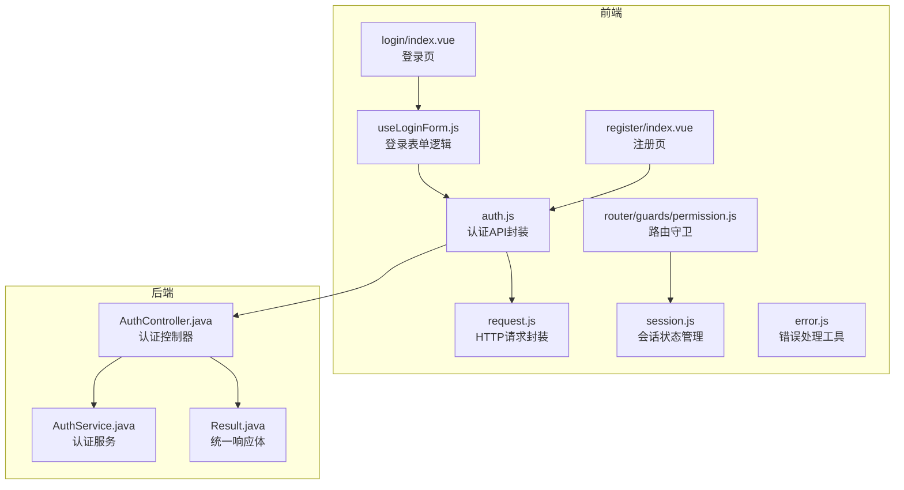
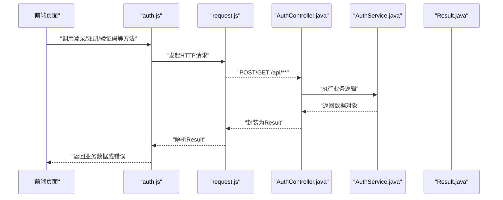
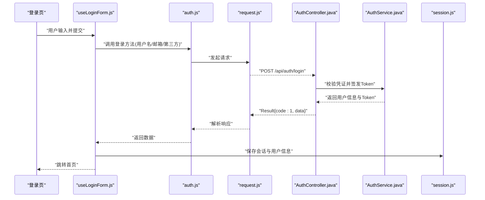
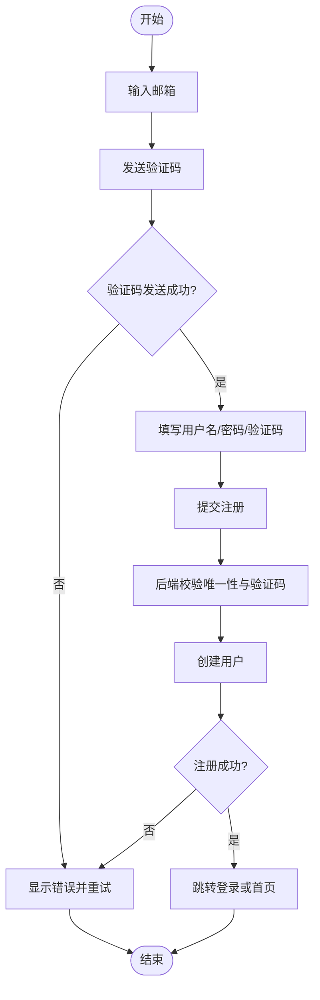
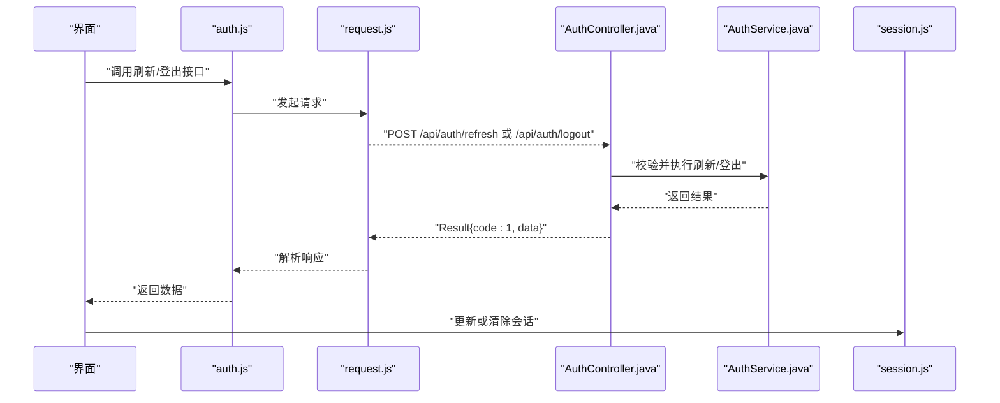
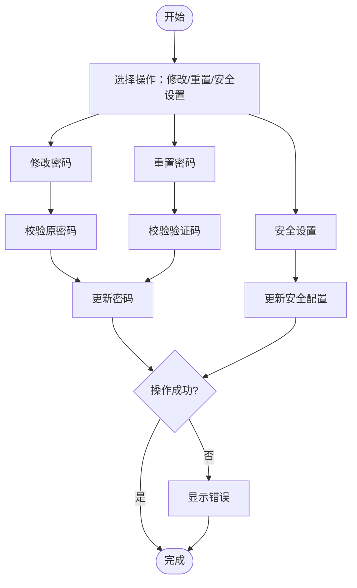
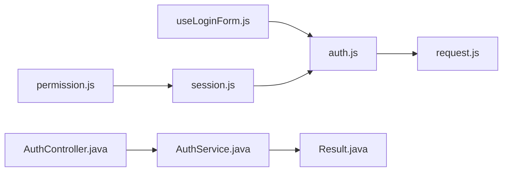

# 认证模块API

<cite>
**本文引用的文件**   
- [ZXYZdatabaseFront/src/api/auth.js](file://ZXYZdatabaseFront/src/api/auth.js)
- [ZXYZdatabaseFront/src/utils/request.js](file://ZXYZdatabaseFront/src/utils/request.js)
- [ZXYZdatabaseFront/src/store/session.js](file://ZXYZdatabaseFront/src/store/session.js)
- [ZXYZdatabaseFront/src/composables/useLoginForm.js](file://ZXYZdatabaseFront/src/composables/useLoginForm.js)
- [ZXYZdatabaseFront/src/views/login/index.vue](file://ZXYZdatabaseFront/src/views/login/index.vue)
- [ZXYZdatabaseFront/src/views/register/index.vue](file://ZXYZdatabaseFront/src/views/register/index.vue)
- [ZXYZdatabaseFront/src/utils/error.js](file://ZXYZdatabaseFront/src/utils/error.js)
- [ZXYZdatabaseFront/src/router/guards/permission.js](file://ZXYZdatabaseFront/src/router/guards/permission.js)
- [ZXYZdatabaseBack/zxyz-user-service/src/main/java/uno/acloud/user/controller/AuthController.java](file://ZXYZdatabaseBack/zxyz-user-service/src/main/java/uno/acloud/user/controller/AuthController.java)
- [ZXYZdatabaseBack/zxyz-user-service/src/main/java/uno/acloud/user/service/AuthService.java](file://ZXYZdatabaseBack/zxyz-user-service/src/main/java/uno/acloud/user/service/AuthService.java)
- [ZXYZdatabaseBack/zxyz-common/src/main/java/uno/acloud/common/web/Result.java](file://ZXYZdatabaseBack/zxyz-common/src/main/java/uno/acloud/common/web/Result.java)
</cite>

## 目录
1. [简介](#简介)
2. [项目结构](#项目结构)
3. [核心组件](#核心组件)
4. [架构总览](#架构总览)
5. [详细组件分析](#详细组件分析)
6. [依赖分析](#依赖分析)
7. [性能考虑](#性能考虑)
8. [故障排查指南](#故障排查指南)
9. [结论](#结论)
10. [附录：接口清单与示例](#附录接口清单与示例)

## 简介
本技术文档聚焦于 ZXYZ 前端认证模块的 API 封装，覆盖用户登录（用户名密码、邮箱验证码、第三方账号绑定）、注册流程（邮箱验证、验证码发送、用户信息提交）、会话管理（Token 获取、刷新、登出）以及密码管理（修改、重置、安全设置）。文档从前端到后端服务进行端到端说明，包含请求参数格式、响应数据结构、调用时序图与错误处理方案，帮助开发者快速集成与排障。

## 项目结构
认证相关的前端代码主要位于 ZXYZdatabaseFront 中，包括 API 封装、请求拦截器、状态管理与页面视图；后端认证能力由 zxyz-user-service 提供，并通过统一 Result<T> 返回结构。

**图表来源** 
- [ZXYZdatabaseFront/src/api/auth.js](file://ZXYZdatabaseFront/src/api/auth.js)
- [ZXYZdatabaseFront/src/utils/request.js](file://ZXYZdatabaseFront/src/utils/request.js)
- [ZXYZdatabaseFront/src/store/session.js](file://ZXYZdatabaseFront/src/store/session.js)
- [ZXYZdatabaseFront/src/composables/useLoginForm.js](file://ZXYZdatabaseFront/src/composables/useLoginForm.js)
- [ZXYZdatabaseFront/src/views/login/index.vue](file://ZXYZdatabaseFront/src/views/login/index.vue)
- [ZXYZdatabaseFront/src/views/register/index.vue](file://ZXYZdatabaseFront/src/views/register/index.vue)
- [ZXYZdatabaseFront/src/utils/error.js](file://ZXYZdatabaseFront/src/utils/error.js)
- [ZXYZdatabaseFront/src/router/guards/permission.js](file://ZXYZdatabaseFront/src/router/guards/permission.js)
- [ZXYZdatabaseBack/zxyz-user-service/src/main/java/uno/acloud/user/controller/AuthController.java](file://ZXYZdatabaseBack/zxyz-user-service/src/main/java/uno/acloud/user/controller/AuthController.java)
- [ZXYZdatabaseBack/zxyz-user-service/src/main/java/uno/acloud/user/service/AuthService.java](file://ZXYZdatabaseBack/zxyz-user-service/src/main/java/uno/acloud/user/service/AuthService.java)
- [ZXYZdatabaseBack/zxyz-common/src/main/java/uno/acloud/common/web/Result.java](file://ZXYZdatabaseBack/zxyz-common/src/main/java/uno/acloud/common/web/Result.java)

**章节来源**
- [ZXYZdatabaseFront/src/api/auth.js](file://ZXYZdatabaseFront/src/api/auth.js)
- [ZXYZdatabaseFront/src/utils/request.js](file://ZXYZdatabaseFront/src/utils/request.js)
- [ZXYZdatabaseFront/src/store/session.js](file://ZXYZdatabaseFront/src/store/session.js)
- [ZXYZdatabaseFront/src/composables/useLoginForm.js](file://ZXYZdatabaseFront/src/composables/useLoginForm.js)
- [ZXYZdatabaseFront/src/views/login/index.vue](file://ZXYZdatabaseFront/src/views/login/index.vue)
- [ZXYZdatabaseFront/src/views/register/index.vue](file://ZXYZdatabaseFront/src/views/register/index.vue)
- [ZXYZdatabaseFront/src/utils/error.js](file://ZXYZdatabaseFront/src/utils/error.js)
- [ZXYZdatabaseFront/src/router/guards/permission.js](file://ZXYZdatabaseFront/src/router/guards/permission.js)
- [ZXYZdatabaseBack/zxyz-user-service/src/main/java/uno/acloud/user/controller/AuthController.java](file://ZXYZdatabaseBack/zxyz-user-service/src/main/java/uno/acloud/user/controller/AuthController.java)
- [ZXYZdatabaseBack/zxyz-user-service/src/main/java/uno/acloud/user/service/AuthService.java](file://ZXYZdatabaseBack/zxyz-user-service/src/main/java/uno/acloud/user/service/AuthService.java)
- [ZXYZdatabaseBack/zxyz-common/src/main/java/uno/acloud/common/web/Result.java](file://ZXYZdatabaseBack/zxyz-common/src/main/java/uno/acloud/common/web/Result.java)

## 核心组件
- 认证API封装（auth.js）：集中暴露登录、注册、验证码、第三方绑定、Token刷新、登出等接口方法，统一封装请求参数与响应解析。
- HTTP请求封装（request.js）：负责基础URL、超时、重试、鉴权头注入、错误拦截与统一错误转换。
- 会话状态管理（session.js）：维护登录态、Token、用户信息，提供持久化与同步更新。
- 登录表单逻辑（useLoginForm.js）：封装登录表单校验、异步提交、错误提示与跳转。
- 认证控制器与服务（AuthController.java / AuthService.java）：实现用户名密码登录、邮箱验证码登录、第三方账号绑定、注册、密码管理等业务。
- 统一响应体（Result.java）：标准code/message/data结构，前端以code=1判定成功。

**章节来源**
- [ZXYZdatabaseFront/src/api/auth.js](file://ZXYZdatabaseFront/src/api/auth.js)
- [ZXYZdatabaseFront/src/utils/request.js](file://ZXYZdatabaseFront/src/utils/request.js)
- [ZXYZdatabaseFront/src/store/session.js](file://ZXYZdatabaseFront/src/store/session.js)
- [ZXYZdatabaseFront/src/composables/useLoginForm.js](file://ZXYZdatabaseFront/src/composables/useLoginForm.js)
- [ZXYZdatabaseBack/zxyz-user-service/src/main/java/uno/acloud/user/controller/AuthController.java](file://ZXYZdatabaseBack/zxyz-user-service/src/main/java/uno/acloud/user/controller/AuthController.java)
- [ZXYZdatabaseBack/zxyz-user-service/src/main/java/uno/acloud/user/service/AuthService.java](file://ZXYZdatabaseBack/zxyz-user-service/src/main/java/uno/acloud/user/service/AuthService.java)
- [ZXYZdatabaseBack/zxyz-common/src/main/java/uno/acloud/common/web/Result.java](file://ZXYZdatabaseBack/zxyz-common/src/main/java/uno/acloud/common/web/Result.java)

## 架构总览
前端通过 auth.js 调用后端认证接口，请求经 request.js 统一处理并携带鉴权信息；成功后 session.js 更新本地会话；路由守卫根据会话状态控制访问权限。后端 AuthController 接收请求，委托 AuthService 执行业务逻辑，返回统一 Result。

**图表来源** 
- [ZXYZdatabaseFront/src/api/auth.js](file://ZXYZdatabaseFront/src/api/auth.js)
- [ZXYZdatabaseFront/src/utils/request.js](file://ZXYZdatabaseFront/src/utils/request.js)
- [ZXYZdatabaseBack/zxyz-user-service/src/main/java/uno/acloud/user/controller/AuthController.java](file://ZXYZdatabaseBack/zxyz-user-service/src/main/java/uno/acloud/user/controller/AuthController.java)
- [ZXYZdatabaseBack/zxyz-user-service/src/main/java/uno/acloud/user/service/AuthService.java](file://ZXYZdatabaseBack/zxyz-user-service/src/main/java/uno/acloud/user/service/AuthService.java)
- [ZXYZdatabaseBack/zxyz-common/src/main/java/uno/acloud/common/web/Result.java](file://ZXYZdatabaseBack/zxyz-common/src/main/java/uno/acloud/common/web/Result.java)

## 详细组件分析

### 用户登录接口
- 用户名密码登录
  - 触发入口：登录页表单提交，调用 useLoginForm.js 中的登录方法。
  - API调用：auth.js 暴露的登录方法，内部通过 request.js 发起请求。
  - 后端处理：AuthController 接收用户名与密码，AuthService 校验并生成会话Token。
  - 响应结构：Result.code=1时视为成功，data中包含Token与用户基本信息。
  - 前端处理：session.js 保存Token与用户信息，路由跳转至首页或目标页。

- 邮箱验证码登录
  - 触发入口：登录页切换“邮箱验证码”模式，先调用验证码发送接口。
  - API调用：auth.js 暴露的验证码发送与登录方法。
  - 后端处理：AuthService 校验邮箱与验证码，通过后签发Token。
  - 响应结构：同用户名密码登录。

- 第三方账号绑定
  - 触发入口：登录页选择第三方登录，回调后进入绑定流程。
  - API调用：auth.js 暴露的第三方授权与绑定接口。
  - 后端处理：AuthService 校验第三方凭证，完成绑定或创建用户。
  - 响应结构：返回Token与用户信息。

**图表来源** 
- [ZXYZdatabaseFront/src/views/login/index.vue](file://ZXYZdatabaseFront/src/views/login/index.vue)
- [ZXYZdatabaseFront/src/composables/useLoginForm.js](file://ZXYZdatabaseFront/src/composables/useLoginForm.js)
- [ZXYZdatabaseFront/src/api/auth.js](file://ZXYZdatabaseFront/src/api/auth.js)
- [ZXYZdatabaseFront/src/utils/request.js](file://ZXYZdatabaseFront/src/utils/request.js)
- [ZXYZdatabaseBack/zxyz-user-service/src/main/java/uno/acloud/user/controller/AuthController.java](file://ZXYZdatabaseBack/zxyz-user-service/src/main/java/uno/acloud/user/controller/AuthController.java)
- [ZXYZdatabaseBack/zxyz-user-service/src/main/java/uno/acloud/user/service/AuthService.java](file://ZXYZdatabaseBack/zxyz-user-service/src/main/java/uno/acloud/user/service/AuthService.java)
- [ZXYZdatabaseFront/src/store/session.js](file://ZXYZdatabaseFront/src/store/session.js)

**章节来源**
- [ZXYZdatabaseFront/src/views/login/index.vue](file://ZXYZdatabaseFront/src/views/login/index.vue)
- [ZXYZdatabaseFront/src/composables/useLoginForm.js](file://ZXYZdatabaseFront/src/composables/useLoginForm.js)
- [ZXYZdatabaseFront/src/api/auth.js](file://ZXYZdatabaseFront/src/api/auth.js)
- [ZXYZdatabaseFront/src/utils/request.js](file://ZXYZdatabaseFront/src/utils/request.js)
- [ZXYZdatabaseBack/zxyz-user-service/src/main/java/uno/acloud/user/controller/AuthController.java](file://ZXYZdatabaseBack/zxyz-user-service/src/main/java/uno/acloud/user/controller/AuthController.java)
- [ZXYZdatabaseBack/zxyz-user-service/src/main/java/uno/acloud/user/service/AuthService.java](file://ZXYZdatabaseBack/zxyz-user-service/src/main/java/uno/acloud/user/service/AuthService.java)
- [ZXYZdatabaseFront/src/store/session.js](file://ZXYZdatabaseFront/src/store/session.js)

### 用户注册流程
- 邮箱验证
  - 触发入口：注册页输入邮箱，点击“发送验证码”。
  - API调用：auth.js 暴露的验证码发送接口。
  - 后端处理：AuthService 生成验证码并发送至邮箱服务。
  - 响应结构：Result.code=1表示发送成功。

- 验证码发送
  - 触发入口：注册页或登录页切换验证码模式。
  - API调用：auth.js 暴露的验证码发送接口。
  - 后端处理：生成验证码并存储（Redis或DB），限流防刷。
  - 响应结构：Result.code=1表示发送成功。

- 用户信息提交
  - 触发入口：注册页填写用户名、邮箱、验证码、密码等。
  - API调用：auth.js 暴露的用户注册接口。
  - 后端处理：AuthService 校验唯一性、验证码有效性，创建用户。
  - 响应结构：Result.code=1表示注册成功，data包含用户基本信息。

**图表来源** 
- [ZXYZdatabaseFront/src/views/register/index.vue](file://ZXYZdatabaseFront/src/views/register/index.vue)
- [ZXYZdatabaseFront/src/api/auth.js](file://ZXYZdatabaseFront/src/api/auth.js)
- [ZXYZdatabaseBack/zxyz-user-service/src/main/java/uno/acloud/user/service/AuthService.java](file://ZXYZdatabaseBack/zxyz-user-service/src/main/java/uno/acloud/user/service/AuthService.java)

**章节来源**
- [ZXYZdatabaseFront/src/views/register/index.vue](file://ZXYZdatabaseFront/src/views/register/index.vue)
- [ZXYZdatabaseFront/src/api/auth.js](file://ZXYZdatabaseFront/src/api/auth.js)
- [ZXYZdatabaseBack/zxyz-user-service/src/main/java/uno/acloud/user/service/AuthService.java](file://ZXYZdatabaseBack/zxyz-user-service/src/main/java/uno/acloud/user/service/AuthService.java)

### 会话管理接口
- Token获取
  - 触发入口：登录成功后。
  - API调用：auth.js 暴露的登录接口。
  - 后端处理：AuthService 签发Token并返回。
  - 前端处理：session.js 持久化Token与用户信息。

- Token刷新
  - 触发入口：Token即将过期或刷新接口被调用。
  - API调用：auth.js 暴露的刷新接口。
  - 后端处理：AuthService 校验旧Token并签发新Token。
  - 前端处理：更新session.js中的Token。

- 登出处理
  - 触发入口：用户主动登出或会话失效。
  - API调用：auth.js 暴露的登出接口。
  - 后端处理：AuthService 销毁会话与Token。
  - 前端处理：清除session.js，跳转登录页。

**图表来源** 
- [ZXYZdatabaseFront/src/api/auth.js](file://ZXYZdatabaseFront/src/api/auth.js)
- [ZXYZdatabaseFront/src/utils/request.js](file://ZXYZdatabaseFront/src/utils/request.js)
- [ZXYZdatabaseBack/zxyz-user-service/src/main/java/uno/acloud/user/controller/AuthController.java](file://ZXYZdatabaseBack/zxyz-user-service/src/main/java/uno/acloud/user/controller/AuthController.java)
- [ZXYZdatabaseBack/zxyz-user-service/src/main/java/uno/acloud/user/service/AuthService.java](file://ZXYZdatabaseBack/zxyz-user-service/src/main/java/uno/acloud/user/service/AuthService.java)
- [ZXYZdatabaseFront/src/store/session.js](file://ZXYZdatabaseFront/src/store/session.js)

**章节来源**
- [ZXYZdatabaseFront/src/api/auth.js](file://ZXYZdatabaseFront/src/api/auth.js)
- [ZXYZdatabaseFront/src/utils/request.js](file://ZXYZdatabaseFront/src/utils/request.js)
- [ZXYZdatabaseBack/zxyz-user-service/src/main/java/uno/acloud/user/controller/AuthController.java](file://ZXYZdatabaseBack/zxyz-user-service/src/main/java/uno/acloud/user/controller/AuthController.java)
- [ZXYZdatabaseBack/zxyz-user-service/src/main/java/uno/acloud/user/service/AuthService.java](file://ZXYZdatabaseBack/zxyz-user-service/src/main/java/uno/acloud/user/service/AuthService.java)
- [ZXYZdatabaseFront/src/store/session.js](file://ZXYZdatabaseFront/src/store/session.js)

### 密码管理功能
- 密码修改
  - 触发入口：设置页或用户中心。
  - API调用：auth.js 暴露的修改密码接口。
  - 后端处理：AuthService 校验原密码与新密码规则，更新密码。
  - 响应结构：Result.code=1表示修改成功。

- 密码重置
  - 触发入口：忘记密码流程。
  - API调用：auth.js 暴露的重置密码接口（需验证码）。
  - 后端处理：AuthService 校验验证码并更新密码。
  - 响应结构：Result.code=1表示重置成功。

- 安全设置
  - 触发入口：安全设置页面。
  - API调用：auth.js 暴露的安全设置接口（如绑定邮箱、开启二次验证等）。
  - 后端处理：AuthService 更新用户安全配置。
  - 响应结构：Result.code=1表示设置成功。

**图表来源** 
- [ZXYZdatabaseFront/src/api/auth.js](file://ZXYZdatabaseFront/src/api/auth.js)
- [ZXYZdatabaseBack/zxyz-user-service/src/main/java/uno/acloud/user/service/AuthService.java](file://ZXYZdatabaseBack/zxyz-user-service/src/main/java/uno/acloud/user/service/AuthService.java)

**章节来源**
- [ZXYZdatabaseFront/src/api/auth.js](file://ZXYZdatabaseFront/src/api/auth.js)
- [ZXYZdatabaseBack/zxyz-user-service/src/main/java/uno/acloud/user/service/AuthService.java](file://ZXYZdatabaseBack/zxyz-user-service/src/main/java/uno/acloud/user/service/AuthService.java)

## 依赖分析
- 前端依赖关系：auth.js 依赖 request.js 进行HTTP通信；useLoginForm.js 依赖 auth.js；session.js 独立管理状态；路由守卫依赖 session.js。
- 后端依赖关系：AuthController 依赖 AuthService；两者均依赖统一响应体 Result。
- 外部依赖：邮箱服务（验证码发送）、Redis（会话与验证码存储）、数据库（用户信息）。

**图表来源** 
- [ZXYZdatabaseFront/src/api/auth.js](file://ZXYZdatabaseFront/src/api/auth.js)
- [ZXYZdatabaseFront/src/utils/request.js](file://ZXYZdatabaseFront/src/utils/request.js)
- [ZXYZdatabaseFront/src/composables/useLoginForm.js](file://ZXYZdatabaseFront/src/composables/useLoginForm.js)
- [ZXYZdatabaseFront/src/store/session.js](file://ZXYZdatabaseFront/src/store/session.js)
- [ZXYZdatabaseFront/src/router/guards/permission.js](file://ZXYZdatabaseFront/src/router/guards/permission.js)
- [ZXYZdatabaseBack/zxyz-user-service/src/main/java/uno/acloud/user/controller/AuthController.java](file://ZXYZdatabaseBack/zxyz-user-service/src/main/java/uno/acloud/user/controller/AuthController.java)
- [ZXYZdatabaseBack/zxyz-user-service/src/main/java/uno/acloud/user/service/AuthService.java](file://ZXYZdatabaseBack/zxyz-user-service/src/main/java/uno/acloud/user/service/AuthService.java)
- [ZXYZdatabaseBack/zxyz-common/src/main/java/uno/acloud/common/web/Result.java](file://ZXYZdatabaseBack/zxyz-common/src/main/java/uno/acloud/common/web/Result.java)

**章节来源**
- [ZXYZdatabaseFront/src/api/auth.js](file://ZXYZdatabaseFront/src/api/auth.js)
- [ZXYZdatabaseFront/src/utils/request.js](file://ZXYZdatabaseFront/src/utils/request.js)
- [ZXYZdatabaseFront/src/composables/useLoginForm.js](file://ZXYZdatabaseFront/src/composables/useLoginForm.js)
- [ZXYZdatabaseFront/src/store/session.js](file://ZXYZdatabaseFront/src/store/session.js)
- [ZXYZdatabaseFront/src/router/guards/permission.js](file://ZXYZdatabaseFront/src/router/guards/permission.js)
- [ZXYZdatabaseBack/zxyz-user-service/src/main/java/uno/acloud/user/controller/AuthController.java](file://ZXYZdatabaseBack/zxyz-user-service/src/main/java/uno/acloud/user/controller/AuthController.java)
- [ZXYZdatabaseBack/zxyz-user-service/src/main/java/uno/acloud/user/service/AuthService.java](file://ZXYZdatabaseBack/zxyz-user-service/src/main/java/uno/acloud/user/service/AuthService.java)
- [ZXYZdatabaseBack/zxyz-common/src/main/java/uno/acloud/common/web/Result.java](file://ZXYZdatabaseBack/zxyz-common/src/main/java/uno/acloud/common/web/Result.java)

## 性能考虑
- 前端请求优化：使用 request.js 的统一超时与重试机制，避免重复请求；对验证码发送进行防抖与节流。
- 后端缓存策略：验证码与Token使用Redis缓存，减少数据库压力；合理设置过期时间。
- 限流与防刷：对验证码发送与登录接口进行限流，防止恶意攻击。
- 响应体精简：后端仅返回必要字段，减少网络传输开销。

[本节为通用指导，不直接分析具体文件]

## 故障排查指南
- 常见错误码：Result.code≠1表示失败，message字段描述错误原因。
- 网络问题：检查request.js的错误拦截与重试逻辑。
- 会话失效：检查session.js的Token存储与刷新逻辑。
- 验证码问题：检查邮箱服务与Redis缓存状态。
- 路由守卫：确认permission.js是否正确判断登录态。

**章节来源**
- [ZXYZdatabaseFront/src/utils/error.js](file://ZXYZdatabaseFront/src/utils/error.js)
- [ZXYZdatabaseFront/src/utils/request.js](file://ZXYZdatabaseFront/src/utils/request.js)
- [ZXYZdatabaseFront/src/store/session.js](file://ZXYZdatabaseFront/src/store/session.js)
- [ZXYZdatabaseFront/src/router/guards/permission.js](file://ZXYZdatabaseFront/src/router/guards/permission.js)

## 结论
本认证模块通过前后端分离架构，实现了完整的用户认证与会话管理功能。前端API封装清晰，后端服务职责明确，统一响应体便于错误处理。建议在生产环境中加强限流、监控与日志记录，以提升系统稳定性与可观测性。

[本节为总结，不直接分析具体文件]

## 附录：接口清单与示例
- 登录接口
  - 路径：/api/auth/login
  - 方法：POST
  - 请求参数：用户名/邮箱、密码/验证码、第三方凭证（可选）
  - 响应结构：Result{code:1, message:"成功", data:{token, userInfo}}
  - 示例：见 [ZXYZdatabaseFront/src/api/auth.js](file://ZXYZdatabaseFront/src/api/auth.js)

- 验证码发送接口
  - 路径：/api/auth/send-code
  - 方法：POST
  - 请求参数：邮箱或手机号
  - 响应结构：Result{code:1, message:"发送成功"}
  - 示例：见 [ZXYZdatabaseFront/src/api/auth.js](file://ZXYZdatabaseFront/src/api/auth.js)

- 用户注册接口
  - 路径：/api/auth/register
  - 方法：POST
  - 请求参数：用户名、邮箱、验证码、密码
  - 响应结构：Result{code:1, message:"注册成功", data:{userInfo}}
  - 示例：见 [ZXYZdatabaseFront/src/api/auth.js](file://ZXYZdatabaseFront/src/api/auth.js)

- Token刷新接口
  - 路径：/api/auth/refresh
  - 方法：POST
  - 请求参数：旧Token
  - 响应结构：Result{code:1, message:"刷新成功", data:{token}}
  - 示例：见 [ZXYZdatabaseFront/src/api/auth.js](file://ZXYZdatabaseFront/src/api/auth.js)

- 登出接口
  - 路径：/api/auth/logout
  - 方法：POST
  - 请求参数：无
  - 响应结构：Result{code:1, message:"登出成功"}
  - 示例：见 [ZXYZdatabaseFront/src/api/auth.js](file://ZXYZdatabaseFront/src/api/auth.js)

- 密码修改接口
  - 路径：/api/auth/change-password
  - 方法：POST
  - 请求参数：原密码、新密码
  - 响应结构：Result{code:1, message:"修改成功"}
  - 示例：见 [ZXYZdatabaseFront/src/api/auth.js](file://ZXYZdatabaseFront/src/api/auth.js)

- 密码重置接口
  - 路径：/api/auth/reset-password
  - 方法：POST
  - 请求参数：邮箱、验证码、新密码
  - 响应结构：Result{code:1, message:"重置成功"}
  - 示例：见 [ZXYZdatabaseFront/src/api/auth.js](file://ZXYZdatabaseFront/src/api/auth.js)

- 第三方账号绑定接口
  - 路径：/api/auth/bind-third-party
  - 方法：POST
  - 请求参数：第三方平台ID、凭证
  - 响应结构：Result{code:1, message:"绑定成功", data:{userInfo}}
  - 示例：见 [ZXYZdatabaseFront/src/api/auth.js](file://ZXYZdatabaseFront/src/api/auth.js)

**章节来源**
- [ZXYZdatabaseFront/src/api/auth.js](file://ZXYZdatabaseFront/src/api/auth.js)
- [ZXYZdatabaseBack/zxyz-user-service/src/main/java/uno/acloud/user/controller/AuthController.java](file://ZXYZdatabaseBack/zxyz-user-service/src/main/java/uno/acloud/user/controller/AuthController.java)
- [ZXYZdatabaseBack/zxyz-common/src/main/java/uno/acloud/common/web/Result.java](file://ZXYZdatabaseBack/zxyz-common/src/main/java/uno/acloud/common/web/Result.java)