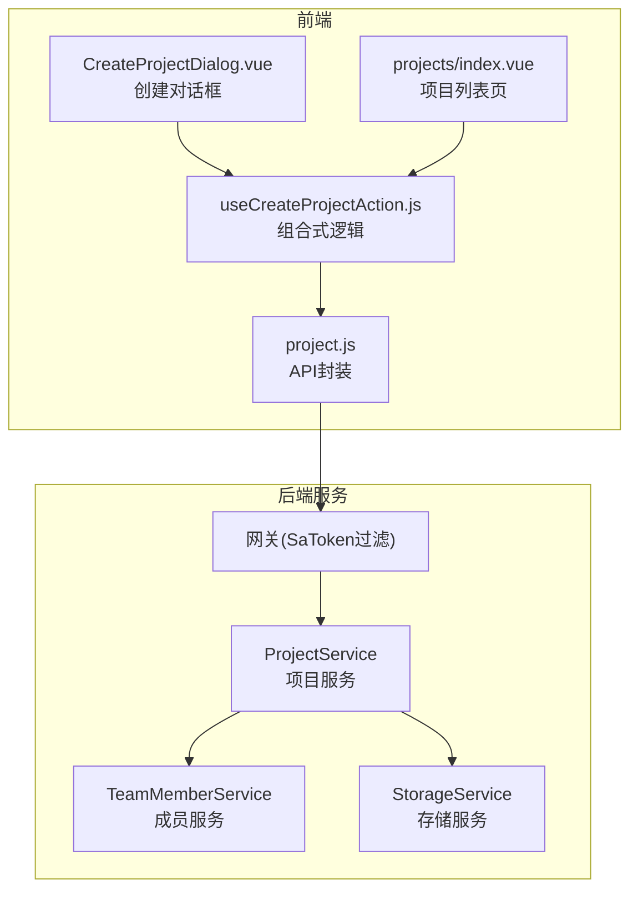
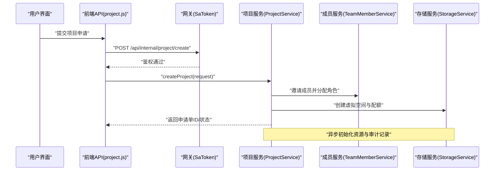
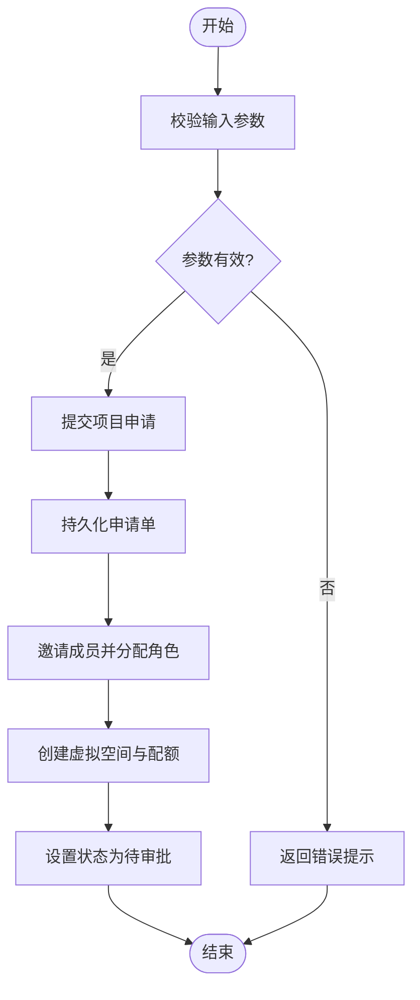
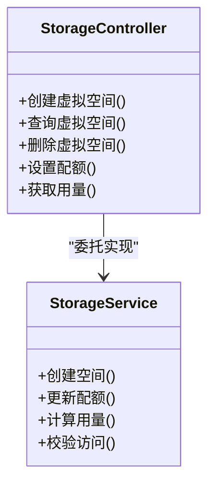
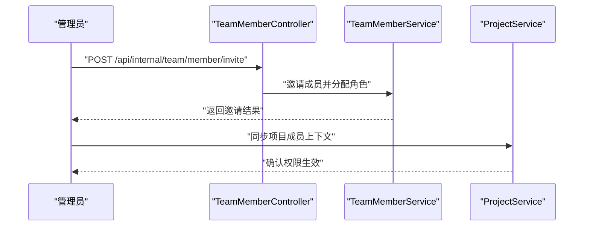
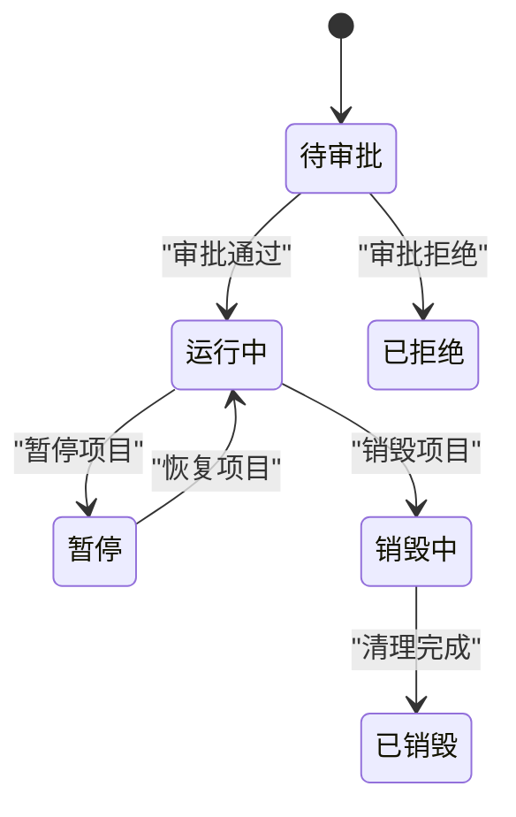
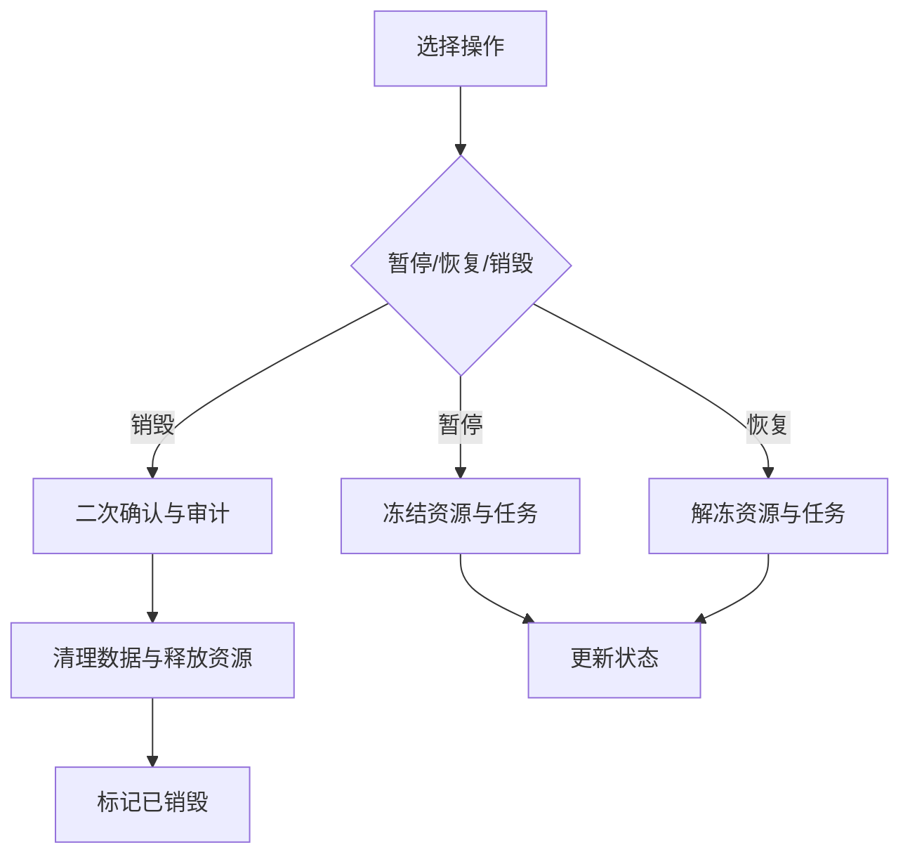
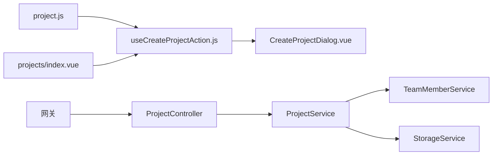

# 项目管理API

<cite>
**本文引用的文件**   
- [ZXYZdatabaseFront/src/api/project.js](file://ZXYZdatabaseFront/src/api/project.js)
- [ZXYZdatabaseFront/src/components/CreateProjectDialog.vue](file://ZXYZdatabaseFront/src/components/CreateProjectDialog.vue)
- [ZXYZdatabaseFront/src/composables/useCreateProjectAction.js](file://ZXYZdatabaseFront/src/composables/useCreateProjectAction.js)
- [ZXYZdatabaseFront/src/views/projects/index.vue](file://ZXYZdatabaseFront/src/views/projects/index.vue)
- [ZXYZdatabaseBack/zxyz-project-service/src/main/java/uno/acloud/project/controller/ProjectController.java](file://ZXYZdatabaseBack/zxyz-project-service/src/main/java/uno/acloud/project/controller/ProjectController.java)
- [ZXYZdatabaseBack/zxyz-project-service/src/main/java/uno/acloud/project/service/ProjectService.java](file://ZXYZdatabaseBack/zxyz-project-service/src/main/java/uno/acloud/project/service/ProjectService.java)
- [ZXYZdatabaseBack/zxyz-project-service/src/main/java/uno/acloud/project/entity/ProjectEntity.java](file://ZXYZdatabaseBack/zxyz-project-service/src/main/java/uno/acloud/project/entity/ProjectEntity.java)
- [ZXYZdatabaseBack/zxyz-project-service/src/main/java/uno/acloud/project/dto/request/CreateProjectRequest.java](file://ZXYZdatabaseBack/zxyz-project-service/src/main/java/uno/acloud/project/dto/request/CreateProjectRequest.java)
- [ZXYZdatabaseBack/zxyz-project-service/src/main/java/uno/acloud/project/dto/response/ProjectVO.java](file://ZXYZdatabaseBack/zxyz-project-service/src/main/java/uno/acloud/project/dto/response/ProjectVO.java)
- [ZXYZdatabaseBack/zxyz-team-service/src/main/java/uno/acloud/team/controller/TeamMemberController.java](file://ZXYZdatabaseBack/zxyz-team-service/src/main/java/uno/acloud/team/controller/TeamMemberController.java)
- [ZXYZdatabaseBack/zxyz-team-service/src/main/java/uno/acloud/team/service/TeamMemberService.java](file://ZXYZdatabaseBack/zxyz-team-service/src/main/java/uno/acloud/team/service/TeamMemberService.java)
- [ZXYZdatabaseBack/zxyz-file-service/src/main/java/uno/acloud/file/controller/StorageController.java](file://ZXYZdatabaseBack/zxyz-file-service/src/main/java/uno/acloud/file/controller/StorageController.java)
- [ZXYZdatabaseBack/zxyz-file-service/src/main/java/uno/acloud/file/service/StorageService.java](file://ZXYZdatabaseBack/zxyz-file-service/src/main/java/uno/acloud/file/service/StorageService.java)
- [ZXYZdatabaseBack/sql/schema_project.sql](file://ZXYZdatabaseBack/sql/schema_project.sql)
- [ZXYZdatabaseBack/nacos-config/zxyz-project-service.yml](file://ZXYZdatabaseBack/nacos-config/zxyz-project-service.yml)
</cite>

## 目录
1. [简介](#简介)
2. [项目结构](#项目结构)
3. [核心组件](#核心组件)
4. [架构总览](#架构总览)
5. [详细组件分析](#详细组件分析)
6. [依赖关系分析](#依赖关系分析)
7. [性能考虑](#性能考虑)
8. [故障排查指南](#故障排查指南)
9. [结论](#结论)
10. [附录：接口清单与调用示例](#附录接口清单与调用示例)

## 简介
本技术文档聚焦于 ZXYZ 前端项目管理模块的 API 封装，围绕“项目创建（申请、审批与初始化）”“项目配置（虚拟空间、存储配额与访问控制）”“项目成员（邀请、角色与权限）”“项目设置（基础信息、高级配置与状态管理）”“项目生命周期（暂停、恢复、销毁）”等关键能力进行系统化说明。文档同时提供完整的接口清单、参数说明、响应格式以及实际调用示例，帮助前后端开发者快速集成与排障。

## 项目结构
前端采用 Vue 3 + Composition API，项目相关 API 集中在 src/api/project.js；业务交互通过 composables 与组件协同完成，如 useCreateProjectAction.js 与 CreateProjectDialog.vue；页面入口在 views/projects/index.vue。后端由 zxyz-project-service 提供项目域能力，zxyz-team-service 负责团队与成员，zxyz-file-service 负责存储与虚拟空间，统一通过网关鉴权与内部服务令牌访问。

图表来源
- [ZXYZdatabaseFront/src/api/project.js](file://ZXYZdatabaseFront/src/api/project.js)
- [ZXYZdatabaseFront/src/composables/useCreateProjectAction.js](file://ZXYZdatabaseFront/src/composables/useCreateProjectAction.js)
- [ZXYZdatabaseFront/src/components/CreateProjectDialog.vue](file://ZXYZdatabaseFront/src/components/CreateProjectDialog.vue)
- [ZXYZdatabaseFront/src/views/projects/index.vue](file://ZXYZdatabaseFront/src/views/projects/index.vue)
- [ZXYZdatabaseBack/zxyz-project-service/src/main/java/uno/acloud/project/controller/ProjectController.java](file://ZXYZdatabaseBack/zxyz-project-service/src/main/java/uno/acloud/project/controller/ProjectController.java)
- [ZXYZdatabaseBack/zxyz-project-service/src/main/java/uno/acloud/project/service/ProjectService.java](file://ZXYZdatabaseBack/zxyz-project-service/src/main/java/uno/acloud/project/service/ProjectService.java)
- [ZXYZdatabaseBack/zxyz-team-service/src/main/java/uno/acloud/team/service/TeamMemberService.java](file://ZXYZdatabaseBack/zxyz-team-service/src/main/java/uno/acloud/team/service/TeamMemberService.java)
- [ZXYZdatabaseBack/zxyz-file-service/src/main/java/uno/acloud/file/service/StorageService.java](file://ZXYZdatabaseBack/zxyz-file-service/src/main/java/uno/acloud/file/service/StorageService.java)

章节来源
- [ZXYZdatabaseFront/src/api/project.js](file://ZXYZdatabaseFront/src/api/project.js)
- [ZXYZdatabaseFront/src/composables/useCreateProjectAction.js](file://ZXYZdatabaseFront/src/composables/useCreateProjectAction.js)
- [ZXYZdatabaseFront/src/components/CreateProjectDialog.vue](file://ZXYZdatabaseFront/src/components/CreateProjectDialog.vue)
- [ZXYZdatabaseFront/src/views/projects/index.vue](file://ZXYZdatabaseFront/src/views/projects/index.vue)
- [ZXYZdatabaseBack/zxyz-project-service/src/main/java/uno/acloud/project/controller/ProjectController.java](file://ZXYZdatabaseBack/zxyz-project-service/src/main/java/uno/acloud/project/controller/ProjectController.java)
- [ZXYZdatabaseBack/zxyz-project-service/src/main/java/uno/acloud/project/service/ProjectService.java](file://ZXYZdatabaseBack/zxyz-project-service/src/main/java/uno/acloud/project/service/ProjectService.java)

## 核心组件
- 前端 API 封装层：集中定义项目相关的 HTTP 请求方法，统一错误处理与结果解析。
- 组合式逻辑：封装创建项目的业务流程（校验、提交、等待审批、初始化资源）。
- 项目控制器与服务：提供项目申请、审批、配置、成员、设置与生命周期管理的 REST 接口。
- 成员与存储子服务：分别负责团队成员邀请与角色分配、虚拟空间与存储配额管理。

章节来源
- [ZXYZdatabaseFront/src/api/project.js](file://ZXYZdatabaseFront/src/api/project.js)
- [ZXYZdatabaseFront/src/composables/useCreateProjectAction.js](file://ZXYZdatabaseFront/src/composables/useCreateProjectAction.js)
- [ZXYZdatabaseBack/zxyz-project-service/src/main/java/uno/acloud/project/controller/ProjectController.java](file://ZXYZdatabaseBack/zxyz-project-service/src/main/java/uno/acloud/project/controller/ProjectController.java)
- [ZXYZdatabaseBack/zxyz-project-service/src/main/java/uno/acloud/project/service/ProjectService.java](file://ZXYZdatabaseBack/zxyz-project-service/src/main/java/uno/acloud/project/service/ProjectService.java)
- [ZXYZdatabaseBack/zxyz-team-service/src/main/java/uno/acloud/team/controller/TeamMemberController.java](file://ZXYZdatabaseBack/zxyz-team-service/src/main/java/uno/acloud/team/controller/TeamMemberController.java)
- [ZXYZdatabaseBack/zxyz-file-service/src/main/java/uno/acloud/file/controller/StorageController.java](file://ZXYZdatabaseBack/zxyz-file-service/src/main/java/uno/acloud/file/controller/StorageController.java)

## 架构总览
前端通过统一的 API 封装发起请求，经网关鉴权后路由至项目服务。项目服务协调成员服务与存储服务完成资源初始化与权限绑定。异步流程（如审批、资源准备）通过消息队列驱动，保证最终一致性。

图表来源
- [ZXYZdatabaseFront/src/api/project.js](file://ZXYZdatabaseFront/src/api/project.js)
- [ZXYZdatabaseBack/zxyz-project-service/src/main/java/uno/acloud/project/controller/ProjectController.java](file://ZXYZdatabaseBack/zxyz-project-service/src/main/java/uno/acloud/project/controller/ProjectController.java)
- [ZXYZdatabaseBack/zxyz-project-service/src/main/java/uno/acloud/project/service/ProjectService.java](file://ZXYZdatabaseBack/zxyz-project-service/src/main/java/uno/acloud/project/service/ProjectService.java)
- [ZXYZdatabaseBack/zxyz-team-service/src/main/java/uno/acloud/team/service/TeamMemberService.java](file://ZXYZdatabaseBack/zxyz-team-service/src/main/java/uno/acloud/team/service/TeamMemberService.java)
- [ZXYZdatabaseBack/zxyz-file-service/src/main/java/uno/acloud/file/service/StorageService.java](file://ZXYZdatabaseBack/zxyz-file-service/src/main/java/uno/acloud/file/service/StorageService.java)

## 详细组件分析

### 项目创建（申请、审批与初始化）
- 前端交互：用户在 CreateProjectDialog 中填写项目名称、描述、初始成员与配额等，调用 useCreateProjectAction 触发提交；成功后进入“待审批”状态，前端轮询或监听事件更新状态。
- 后端流程：ProjectController 接收申请，ProjectService 校验并持久化申请单，随后调用成员服务与存储服务完成资源初始化；审批通过后转为“运行中”，否则根据策略拒绝或归档。

图表来源
- [ZXYZdatabaseFront/src/components/CreateProjectDialog.vue](file://ZXYZdatabaseFront/src/components/CreateProjectDialog.vue)
- [ZXYZdatabaseFront/src/composables/useCreateProjectAction.js](file://ZXYZdatabaseFront/src/composables/useCreateProjectAction.js)
- [ZXYZdatabaseBack/zxyz-project-service/src/main/java/uno/acloud/project/controller/ProjectController.java](file://ZXYZdatabaseBack/zxyz-project-service/src/main/java/uno/acloud/project/controller/ProjectController.java)
- [ZXYZdatabaseBack/zxyz-project-service/src/main/java/uno/acloud/project/service/ProjectService.java](file://ZXYZdatabaseBack/zxyz-project-service/src/main/java/uno/acloud/project/service/ProjectService.java)

章节来源
- [ZXYZdatabaseFront/src/components/CreateProjectDialog.vue](file://ZXYZdatabaseFront/src/components/CreateProjectDialog.vue)
- [ZXYZdatabaseFront/src/composables/useCreateProjectAction.js](file://ZXYZdatabaseFront/src/composables/useCreateProjectAction.js)
- [ZXYZdatabaseBack/zxyz-project-service/src/main/java/uno/acloud/project/controller/ProjectController.java](file://ZXYZdatabaseBack/zxyz-project-service/src/main/java/uno/acloud/project/controller/ProjectController.java)
- [ZXYZdatabaseBack/zxyz-project-service/src/main/java/uno/acloud/project/service/ProjectService.java](file://ZXYZdatabaseBack/zxyz-project-service/src/main/java/uno/acloud/project/service/ProjectService.java)

### 项目配置（虚拟空间、存储配额与访问控制）
- 虚拟空间管理：通过 StorageController 暴露创建、查询、删除虚拟空间的接口，支持按项目隔离命名空间。
- 存储配额：StorageService 提供配额设置与使用量统计，支持软限制告警与硬限制拦截。
- 访问控制：结合 Sa-Token 与内部服务令牌，限制非授权访问；项目级访问策略可配置白名单与域名/IP 限制。

图表来源
- [ZXYZdatabaseBack/zxyz-file-service/src/main/java/uno/acloud/file/controller/StorageController.java](file://ZXYZdatabaseBack/zxyz-file-service/src/main/java/uno/acloud/file/controller/StorageController.java)
- [ZXYZdatabaseBack/zxyz-file-service/src/main/java/uno/acloud/file/service/StorageService.java](file://ZXYZdatabaseBack/zxyz-file-service/src/main/java/uno/acloud/file/service/StorageService.java)

章节来源
- [ZXYZdatabaseBack/zxyz-file-service/src/main/java/uno/acloud/file/controller/StorageController.java](file://ZXYZdatabaseBack/zxyz-file-service/src/main/java/uno/acloud/file/controller/StorageController.java)
- [ZXYZdatabaseBack/zxyz-file-service/src/main/java/uno/acloud/file/service/StorageService.java](file://ZXYZdatabaseBack/zxyz-file-service/src/main/java/uno/acloud/file/service/StorageService.java)

### 项目成员（邀请、角色与权限）
- 成员邀请：TeamMemberController 提供邀请接口，支持邮箱/用户名邀请，生成邀请链接或站内通知。
- 角色分配：基于角色的访问控制（RBAC），支持管理员、编辑者、观察者等角色，角色与权限映射在服务内维护。
- 权限管理：项目级权限继承团队策略，支持细粒度操作授权与审计记录。

图表来源
- [ZXYZdatabaseBack/zxyz-team-service/src/main/java/uno/acloud/team/controller/TeamMemberController.java](file://ZXYZdatabaseBack/zxyz-team-service/src/main/java/uno/acloud/team/controller/TeamMemberController.java)
- [ZXYZdatabaseBack/zxyz-team-service/src/main/java/uno/acloud/team/service/TeamMemberService.java](file://ZXYZdatabaseBack/zxyz-team-service/src/main/java/uno/acloud/team/service/TeamMemberService.java)
- [ZXYZdatabaseBack/zxyz-project-service/src/main/java/uno/acloud/project/service/ProjectService.java](file://ZXYZdatabaseBack/zxyz-project-service/src/main/java/uno/acloud/project/service/ProjectService.java)

章节来源
- [ZXYZdatabaseBack/zxyz-team-service/src/main/java/uno/acloud/team/controller/TeamMemberController.java](file://ZXYZdatabaseBack/zxyz-team-service/src/main/java/uno/acloud/team/controller/TeamMemberController.java)
- [ZXYZdatabaseBack/zxyz-team-service/src/main/java/uno/acloud/team/service/TeamMemberService.java](file://ZXYZdatabaseBack/zxyz-team-service/src/main/java/uno/acloud/team/service/TeamMemberService.java)

### 项目设置（基础信息、高级配置与状态管理）
- 基础信息：名称、描述、标签、可见性等元数据修改。
- 高级配置：存储策略、备份策略、审计开关、网络访问控制等。
- 状态管理：运行中、暂停、销毁中、已销毁等状态机流转，受权限与审计约束。

图表来源
- [ZXYZdatabaseBack/zxyz-project-service/src/main/java/uno/acloud/project/entity/ProjectEntity.java](file://ZXYZdatabaseBack/zxyz-project-service/src/main/java/uno/acloud/project/entity/ProjectEntity.java)
- [ZXYZdatabaseBack/zxyz-project-service/src/main/java/uno/acloud/project/service/ProjectService.java](file://ZXYZdatabaseBack/zxyz-project-service/src/main/java/uno/acloud/project/service/ProjectService.java)

章节来源
- [ZXYZdatabaseBack/zxyz-project-service/src/main/java/uno/acloud/project/entity/ProjectEntity.java](file://ZXYZdatabaseBack/zxyz-project-service/src/main/java/uno/acloud/project/entity/ProjectEntity.java)
- [ZXYZdatabaseBack/zxyz-project-service/src/main/java/uno/acloud/project/service/ProjectService.java](file://ZXYZdatabaseBack/zxyz-project-service/src/main/java/uno/acloud/project/service/ProjectService.java)

### 项目生命周期（暂停、恢复、销毁）
- 暂停：冻结读写与任务执行，保留数据与配置，便于后续恢复。
- 恢复：解冻资源，恢复任务调度与访问权限。
- 销毁：触发数据清理与资源释放，进入不可逆状态前需二次确认与审计记录。

图表来源
- [ZXYZdatabaseBack/zxyz-project-service/src/main/java/uno/acloud/project/service/ProjectService.java](file://ZXYZdatabaseBack/zxyz-project-service/src/main/java/uno/acloud/project/service/ProjectService.java)

章节来源
- [ZXYZdatabaseBack/zxyz-project-service/src/main/java/uno/acloud/project/service/ProjectService.java](file://ZXYZdatabaseBack/zxyz-project-service/src/main/java/uno/acloud/project/service/ProjectService.java)

## 依赖关系分析
- 前端依赖：project.js 作为统一入口，被 composables 与组件引用；页面组件通过组合式函数组织业务流。
- 后端依赖：ProjectController 依赖 ProjectService；ProjectService 依赖 TeamMemberService 与 StorageService；所有内部端点通过网关鉴权与内部令牌保护。
- 数据库依赖：schema_project.sql 定义项目实体与状态字段；Nacos 配置项控制行为与阈值。

图表来源
- [ZXYZdatabaseFront/src/api/project.js](file://ZXYZdatabaseFront/src/api/project.js)
- [ZXYZdatabaseFront/src/composables/useCreateProjectAction.js](file://ZXYZdatabaseFront/src/composables/useCreateProjectAction.js)
- [ZXYZdatabaseFront/src/components/CreateProjectDialog.vue](file://ZXYZdatabaseFront/src/components/CreateProjectDialog.vue)
- [ZXYZdatabaseFront/src/views/projects/index.vue](file://ZXYZdatabaseFront/src/views/projects/index.vue)
- [ZXYZdatabaseBack/zxyz-project-service/src/main/java/uno/acloud/project/controller/ProjectController.java](file://ZXYZdatabaseBack/zxyz-project-service/src/main/java/uno/acloud/project/controller/ProjectController.java)
- [ZXYZdatabaseBack/zxyz-project-service/src/main/java/uno/acloud/project/service/ProjectService.java](file://ZXYZdatabaseBack/zxyz-project-service/src/main/java/uno/acloud/project/service/ProjectService.java)
- [ZXYZdatabaseBack/zxyz-team-service/src/main/java/uno/acloud/team/service/TeamMemberService.java](file://ZXYZdatabaseBack/zxyz-team-service/src/main/java/uno/acloud/team/service/TeamMemberService.java)
- [ZXYZdatabaseBack/zxyz-file-service/src/main/java/uno/acloud/file/service/StorageService.java](file://ZXYZdatabaseBack/zxyz-file-service/src/main/java/uno/acloud/file/service/StorageService.java)

章节来源
- [ZXYZdatabaseBack/sql/schema_project.sql](file://ZXYZdatabaseBack/sql/schema_project.sql)
- [ZXYZdatabaseBack/nacos-config/zxyz-project-service.yml](file://ZXYZdatabaseBack/nacos-config/zxyz-project-service.yml)

## 性能考虑
- 批量操作：成员邀请与资源初始化建议分批处理，避免长事务阻塞。
- 缓存策略：项目元数据与配额用量可短期缓存，减少重复查询。
- 异步化：审批与资源准备走消息队列，提升吞吐与可用性。
- 限流与熔断：对高频接口（如用量查询）实施限流，异常时降级返回默认值。

[本节为通用指导，不直接分析具体文件]

## 故障排查指南
- 鉴权失败：检查网关 SaToken 过滤器与内部服务令牌是否正确传递。
- 审批卡住：查看消息队列消费日志与重试策略，确认消费者健康。
- 配额超限：核对 StorageService 的配额策略与阈值配置，必要时扩容。
- 状态不一致：审计日志与数据库快照对比，定位状态机跳转异常。

章节来源
- [ZXYZdatabaseBack/zxyz-project-service/src/main/java/uno/acloud/project/service/ProjectService.java](file://ZXYZdatabaseBack/zxyz-project-service/src/main/java/uno/acloud/project/service/ProjectService.java)
- [ZXYZdatabaseBack/zxyz-file-service/src/main/java/uno/acloud/file/service/StorageService.java](file://ZXYZdatabaseBack/zxyz-file-service/src/main/java/uno/acloud/file/service/StorageService.java)

## 结论
本项目的前端项目管理 API 封装清晰分层，前后端职责明确，配合网关鉴权与内部服务令牌保障安全。项目创建、配置、成员、设置与生命周期管理形成闭环，借助异步机制与审计记录确保一致性与可追溯性。建议在生产环境完善监控告警与容量规划，持续优化性能与稳定性。

[本节为总结性内容，不直接分析具体文件]

## 附录：接口清单与调用示例
以下为项目管理相关接口的概览与调用示例（以路径与方法为主，具体字段以各服务 DTO/VO 为准）：

- 项目创建
  - 方法：POST
  - 路径：/api/internal/project/create
  - 请求体：项目名称、描述、初始成员列表、配额策略
  - 响应：申请单ID、状态（待审批）、下一步操作指引
  - 示例：前端调用 project.js 的 createProject 方法，传入表单数据

- 项目查询
  - 方法：GET
  - 路径：/api/internal/project/{projectId}
  - 响应：项目基本信息、状态、成员列表、配额使用情况

- 项目更新
  - 方法：PUT
  - 路径：/api/internal/project/{projectId}
  - 请求体：名称、描述、标签、可见性、高级配置
  - 响应：更新后的项目信息

- 项目暂停
  - 方法：POST
  - 路径：/api/internal/project/{projectId}/pause
  - 响应：状态变更为“暂停”

- 项目恢复
  - 方法：POST
  - 路径：/api/internal/project/{projectId}/resume
  - 响应：状态变更为“运行中”

- 项目销毁
  - 方法：DELETE
  - 路径：/api/internal/project/{projectId}
  - 响应：状态变更为“销毁中”，异步清理完成后标记“已销毁”

- 成员邀请
  - 方法：POST
  - 路径：/api/internal/team/member/invite
  - 请求体：成员标识（邮箱/用户名）、角色、项目上下文
  - 响应：邀请结果与权限生效状态

- 虚拟空间管理
  - 方法：POST/GET/DELETE
  - 路径：/api/internal/storage/spaces
  - 请求体：空间名称、配额、访问策略
  - 响应：空间信息与配额状态

- 存储配额与用量
  - 方法：GET/PUT
  - 路径：/api/internal/storage/quota
  - 请求体：配额上限、告警阈值
  - 响应：当前用量、剩余配额、阈值配置

调用示例（概念性）
- 前端创建项目：在 CreateProjectDialog 中提交表单，useCreateProjectAction 调用 project.js 的 createProject，成功后显示“待审批”状态，并在审批通过后自动刷新项目列表。
- 后端创建项目：ProjectController 接收请求，ProjectService 校验并持久化，调用 TeamMemberService 与 StorageService 完成初始化，返回申请单信息。

章节来源
- [ZXYZdatabaseFront/src/api/project.js](file://ZXYZdatabaseFront/src/api/project.js)
- [ZXYZdatabaseFront/src/composables/useCreateProjectAction.js](file://ZXYZdatabaseFront/src/composables/useCreateProjectAction.js)
- [ZXYZdatabaseFront/src/components/CreateProjectDialog.vue](file://ZXYZdatabaseFront/src/components/CreateProjectDialog.vue)
- [ZXYZdatabaseBack/zxyz-project-service/src/main/java/uno/acloud/project/controller/ProjectController.java](file://ZXYZdatabaseBack/zxyz-project-service/src/main/java/uno/acloud/project/controller/ProjectController.java)
- [ZXYZdatabaseBack/zxyz-project-service/src/main/java/uno/acloud/project/service/ProjectService.java](file://ZXYZdatabaseBack/zxyz-project-service/src/main/java/uno/acloud/project/service/ProjectService.java)
- [ZXYZdatabaseBack/zxyz-project-service/src/main/java/uno/acloud/project/dto/request/CreateProjectRequest.java](file://ZXYZdatabaseBack/zxyz-project-service/src/main/java/uno/acloud/project/dto/request/CreateProjectRequest.java)
- [ZXYZdatabaseBack/zxyz-project-service/src/main/java/uno/acloud/project/dto/response/ProjectVO.java](file://ZXYZdatabaseBack/zxyz-project-service/src/main/java/uno/acloud/project/dto/response/ProjectVO.java)
- [ZXYZdatabaseBack/zxyz-team-service/src/main/java/uno/acloud/team/controller/TeamMemberController.java](file://ZXYZdatabaseBack/zxyz-team-service/src/main/java/uno/acloud/team/controller/TeamMemberController.java)
- [ZXYZdatabaseBack/zxyz-file-service/src/main/java/uno/acloud/file/controller/StorageController.java](file://ZXYZdatabaseBack/zxyz-file-service/src/main/java/uno/acloud/file/controller/StorageController.java)