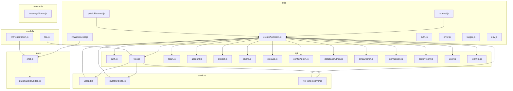
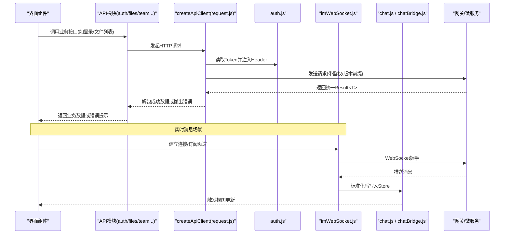
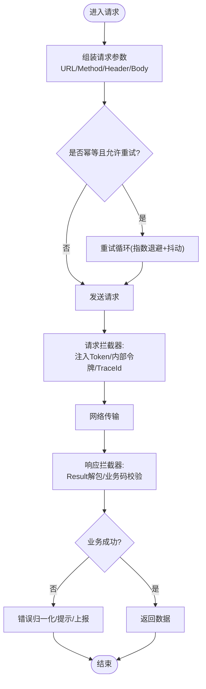
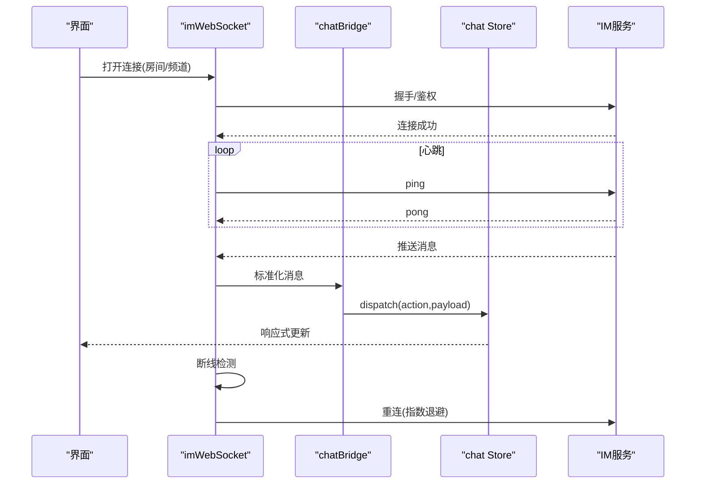
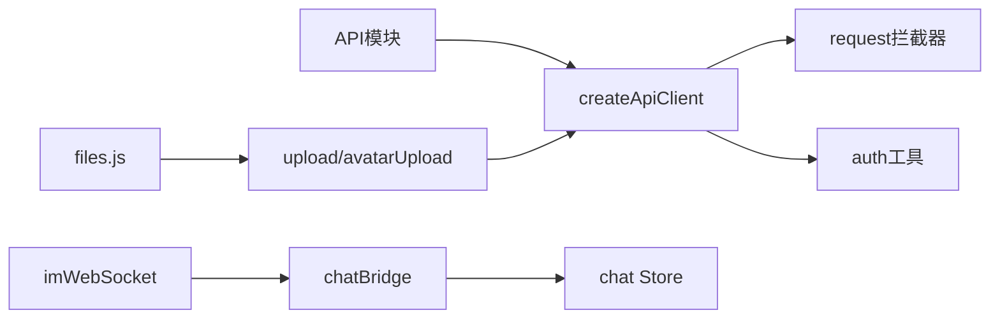

# API集成

<cite>
**本文引用的文件**   
- [ZXYZdatabaseFront/src/utils/request.js](file://ZXYZdatabaseFront/src/utils/request.js)
- [ZXYZdatabaseFront/src/utils/createApiClient.js](file://ZXYZdatabaseFront/src/utils/createApiClient.js)
- [ZXYZdatabaseFront/src/utils/publicRequest.js](file://ZXYZdatabaseFront/src/utils/publicRequest.js)
- [ZXYZdatabaseFront/src/utils/imWebSocket.js](file://ZXYZdatabaseFront/src/utils/imWebSocket.js)
- [ZXYZdatabaseFront/src/utils/auth.js](file://ZXYZdatabaseFront/src/utils/auth.js)
- [ZXYZdatabaseFront/src/api/auth.js](file://ZXYZdatabaseFront/src/api/auth.js)
- [ZXYZdatabaseFront/src/api/files.js](file://ZXYZdatabaseFront/src/api/files.js)
- [ZXYZdatabaseFront/src/api/team.js](file://ZXYZdatabaseFront/src/api/team.js)
- [ZXYZdatabaseFront/src/api/account.js](file://ZXYZdatabaseFront/src/api/account.js)
- [ZXYZdatabaseFront/src/api/project.js](file://ZXYZdatabaseFront/src/api/project.js)
- [ZXYZdatabaseFront/src/api/share.js](file://ZXYZdatabaseFront/src/api/share.js)
- [ZXYZdatabaseFront/src/api/storage.js](file://ZXYZdatabaseFront/src/api/storage.js)
- [ZXYZdatabaseFront/src/api/configAdmin.js](file://ZXYZdatabaseFront/src/api/configAdmin.js)
- [ZXYZdatabaseFront/src/api/databaseAdmin.js](file://ZXYZdatabaseFront/src/api/databaseAdmin.js)
- [ZXYZdatabaseFront/src/api/emailAdmin.js](file://ZXYZdatabaseFront/src/api/emailAdmin.js)
- [ZXYZdatabaseFront/src/api/permission.js](file://ZXYZdatabaseFront/src/api/permission.js)
- [ZXYZdatabaseFront/src/api/adminTeam.js](file://ZXYZdatabaseFront/src/api/adminTeam.js)
- [ZXYZdatabaseFront/src/api/user.js](file://ZXYZdatabaseFront/src/api/user.js)
- [ZXYZdatabaseFront/src/api/teamIm.js](file://ZXYZdatabaseFront/src/api/teamIm.js)
- [ZXYZdatabaseFront/src/store/chat.js](file://ZXYZdatabaseFront/src/store/chat.js)
- [ZXYZdatabaseFront/src/store/plugins/chatBridge.js](file://ZXYZdatabaseFront/src/store/plugins/chatBridge.js)
- [ZXYZdatabaseFront/src/services/upload.js](file://ZXYZdatabaseFront/src/services/upload.js)
- [ZXYZdatabaseFront/src/services/avatarUpload.js](file://ZXYZdatabaseFront/src/services/avatarUpload.js)
- [ZXYZdatabaseFront/src/services/filePathResolver.js](file://ZXYZdatabaseFront/src/services/filePathResolver.js)
- [ZXYZdatabaseFront/src/models/file.js](file://ZXYZdatabaseFront/src/models/file.js)
- [ZXYZdatabaseFront/src/models/imPresentation.js](file://ZXYZdatabaseFront/src/models/imPresentation.js)
- [ZXYZdatabaseFront/src/constants/messageStatus.js](file://ZXYZdatabaseFront/src/constants/messageStatus.js)
- [ZXYZdatabaseFront/src/utils/error.js](file://ZXYZdatabaseFront/src/utils/error.js)
- [ZXYZdatabaseFront/src/utils/errorModel.js](file://ZXYZdatabaseFront/src/utils/errorModel.js)
- [ZXYZdatabaseFront/src/utils/logger.js](file://ZXYZdatabaseFront/src/utils/logger.js)
- [ZXYZdatabaseFront/src/utils/env.js](file://ZXYZdatabaseFront/src/utils/env.js)
</cite>

## 目录
1. [简介](#简介)
2. [项目结构](#项目结构)
3. [核心组件](#核心组件)
4. [架构总览](#架构总览)
5. [详细组件分析](#详细组件分析)
6. [依赖关系分析](#依赖关系分析)
7. [性能考虑](#性能考虑)
8. [故障排查指南](#故障排查指南)
9. [结论](#结论)
10. [附录：API调用示例与最佳实践](#附录api调用示例与最佳实践)

## 简介
本文件面向ZXYZ前端API集成层，系统化说明统一的HTTP客户端封装、请求拦截器、响应处理器与错误统一处理；覆盖RESTful API调用模式（认证、文件、团队等）、WebSocket实时通信（连接管理、消息格式、重连机制）以及内部服务调用的特殊处理（X-Internal-Service-Token鉴权、投影VO映射）。同时给出API版本管理、请求重试策略与性能优化建议，并提供完整调用示例与故障排查指南。

## 项目结构
前端采用模块化组织：
- utils：通用能力（HTTP客户端、WebSocket、错误模型、日志、环境配置）
- api：按业务域划分的接口定义（auth、files、team、project、share、storage、admin等）
- services：上传、路径解析等跨领域服务
- store：状态管理与插件（含聊天桥接）
- models：数据模型与展示对象映射
- constants：常量（如消息状态）

图表来源
- [ZXYZdatabaseFront/src/utils/request.js](file://ZXYZdatabaseFront/src/utils/request.js)
- [ZXYZdatabaseFront/src/utils/createApiClient.js](file://ZXYZdatabaseFront/src/utils/createApiClient.js)
- [ZXYZdatabaseFront/src/utils/publicRequest.js](file://ZXYZdatabaseFront/src/utils/publicRequest.js)
- [ZXYZdatabaseFront/src/utils/imWebSocket.js](file://ZXYZdatabaseFront/src/utils/imWebSocket.js)
- [ZXYZdatabaseFront/src/utils/auth.js](file://ZXYZdatabaseFront/src/utils/auth.js)
- [ZXYZdatabaseFront/src/utils/error.js](file://ZXYZdatabaseFront/src/utils/error.js)
- [ZXYZdatabaseFront/src/utils/logger.js](file://ZXYZdatabaseFront/src/utils/logger.js)
- [ZXYZdatabaseFront/src/utils/env.js](file://ZXYZdatabaseFront/src/utils/env.js)
- [ZXYZdatabaseFront/src/api/*.js](file://ZXYZdatabaseFront/src/api/auth.js)
- [ZXYZdatabaseFront/src/services/*.js](file://ZXYZdatabaseFront/src/services/upload.js)
- [ZXYZdatabaseFront/src/store/chat.js](file://ZXYZdatabaseFront/src/store/chat.js)
- [ZXYZdatabaseFront/src/store/plugins/chatBridge.js](file://ZXYZdatabaseFront/src/store/plugins/chatBridge.js)
- [ZXYZdatabaseFront/src/models/file.js](file://ZXYZdatabaseFront/src/models/file.js)
- [ZXYZdatabaseFront/src/models/imPresentation.js](file://ZXYZdatabaseFront/src/models/imPresentation.js)
- [ZXYZdatabaseFront/src/constants/messageStatus.js](file://ZXYZdatabaseFront/src/constants/messageStatus.js)

章节来源
- [ZXYZdatabaseFront/src/utils/request.js](file://ZXYZdatabaseFront/src/utils/request.js)
- [ZXYZdatabaseFront/src/utils/createApiClient.js](file://ZXYZdatabaseFront/src/utils/createApiClient.js)
- [ZXYZdatabaseFront/src/utils/publicRequest.js](file://ZXYZdatabaseFront/src/utils/publicRequest.js)
- [ZXYZdatabaseFront/src/utils/imWebSocket.js](file://ZXYZdatabaseFront/src/utils/imWebSocket.js)
- [ZXYZdatabaseFront/src/utils/auth.js](file://ZXYZdatabaseFront/src/utils/auth.js)
- [ZXYZdatabaseFront/src/utils/error.js](file://ZXYZdatabaseFront/src/utils/error.js)
- [ZXYZdatabaseFront/src/utils/logger.js](file://ZXYZdatabaseFront/src/utils/logger.js)
- [ZXYZdatabaseFront/src/utils/env.js](file://ZXYZdatabaseFront/src/utils/env.js)
- [ZXYZdatabaseFront/src/api/auth.js](file://ZXYZdatabaseFront/src/api/auth.js)
- [ZXYZdatabaseFront/src/api/files.js](file://ZXYZdatabaseFront/src/api/files.js)
- [ZXYZdatabaseFront/src/api/team.js](file://ZXYZdatabaseFront/src/api/team.js)
- [ZXYZdatabaseFront/src/services/upload.js](file://ZXYZdatabaseFront/src/services/upload.js)
- [ZXYZdatabaseFront/src/services/avatarUpload.js](file://ZXYZdatabaseFront/src/services/avatarUpload.js)
- [ZXYZdatabaseFront/src/services/filePathResolver.js](file://ZXYZdatabaseFront/src/services/filePathResolver.js)
- [ZXYZdatabaseFront/src/store/chat.js](file://ZXYZdatabaseFront/src/store/chat.js)
- [ZXYZdatabaseFront/src/store/plugins/chatBridge.js](file://ZXYZdatabaseFront/src/store/plugins/chatBridge.js)
- [ZXYZdatabaseFront/src/models/file.js](file://ZXYZdatabaseFront/src/models/file.js)
- [ZXYZdatabaseFront/src/models/imPresentation.js](file://ZXYZdatabaseFront/src/models/imPresentation.js)
- [ZXYZdatabaseFront/src/constants/messageStatus.js](file://ZXYZdatabaseFront/src/constants/messageStatus.js)

## 核心组件
- 统一HTTP客户端封装
  - createApiClient：工厂方法创建具备基础URL、超时、拦截器的客户端实例
  - request：Axios实例与全局拦截器（请求头注入、Token透传、响应统一Result<T>解包、错误归一化）
  - publicRequest：无需鉴权的公共请求封装（用于验证码、公开资源等）
- 认证与鉴权
  - auth：Cookie/Session获取与刷新、登录态判断、鉴权守卫
- 错误与日志
  - error：错误分类、提示文案生成、用户可见错误处理
  - errorModel：错误数据结构与转换
  - logger：结构化日志输出
  - env：环境变量与后端地址解析
- WebSocket实时通信
  - imWebSocket：连接生命周期管理、心跳保活、断线重连、消息编解码
- 文件与上传
  - upload/avatarUpload：分片上传、进度回调、并发控制、失败重试
  - filePathResolver：文件路径与访问链接解析
- Store与桥接
  - chat：IM相关状态与操作
  - chatBridge：将WS事件桥接到Store，驱动UI更新

章节来源
- [ZXYZdatabaseFront/src/utils/createApiClient.js](file://ZXYZdatabaseFront/src/utils/createApiClient.js)
- [ZXYZdatabaseFront/src/utils/request.js](file://ZXYZdatabaseFront/src/utils/request.js)
- [ZXYZdatabaseFront/src/utils/publicRequest.js](file://ZXYZdatabaseFront/src/utils/publicRequest.js)
- [ZXYZdatabaseFront/src/utils/auth.js](file://ZXYZdatabaseFront/src/utils/auth.js)
- [ZXYZdatabaseFront/src/utils/error.js](file://ZXYZdatabaseFront/src/utils/error.js)
- [ZXYZdatabaseFront/src/utils/errorModel.js](file://ZXYZdatabaseFront/src/utils/errorModel.js)
- [ZXYZdatabaseFront/src/utils/logger.js](file://ZXYZdatabaseFront/src/utils/logger.js)
- [ZXYZdatabaseFront/src/utils/env.js](file://ZXYZdatabaseFront/src/utils/env.js)
- [ZXYZdatabaseFront/src/utils/imWebSocket.js](file://ZXYZdatabaseFront/src/utils/imWebSocket.js)
- [ZXYZdatabaseFront/src/services/upload.js](file://ZXYZdatabaseFront/src/services/upload.js)
- [ZXYZdatabaseFront/src/services/avatarUpload.js](file://ZXYZdatabaseFront/src/services/avatarUpload.js)
- [ZXYZdatabaseFront/src/services/filePathResolver.js](file://ZXYZdatabaseFront/src/services/filePathResolver.js)
- [ZXYZdatabaseFront/src/store/chat.js](file://ZXYZdatabaseFront/src/store/chat.js)
- [ZXYZdatabaseFront/src/store/plugins/chatBridge.js](file://ZXYZdatabaseFront/src/store/plugins/chatBridge.js)

## 架构总览
前端通过统一的HTTP客户端与WebSocket模块对接网关与微服务，API层按业务域划分，Store负责状态与事件桥接，Models提供数据到视图的映射。

图表来源
- [ZXYZdatabaseFront/src/utils/createApiClient.js](file://ZXYZdatabaseFront/src/utils/createApiClient.js)
- [ZXYZdatabaseFront/src/utils/request.js](file://ZXYZdatabaseFront/src/utils/request.js)
- [ZXYZdatabaseFront/src/utils/auth.js](file://ZXYZdatabaseFront/src/utils/auth.js)
- [ZXYZdatabaseFront/src/utils/imWebSocket.js](file://ZXYZdatabaseFront/src/utils/imWebSocket.js)
- [ZXYZdatabaseFront/src/store/chat.js](file://ZXYZdatabaseFront/src/store/chat.js)
- [ZXYZdatabaseFront/src/store/plugins/chatBridge.js](file://ZXYZdatabaseFront/src/store/plugins/chatBridge.js)
- [ZXYZdatabaseFront/src/api/auth.js](file://ZXYZdatabaseFront/src/api/auth.js)
- [ZXYZdatabaseFront/src/api/files.js](file://ZXYZdatabaseFront/src/api/files.js)
- [ZXYZdatabaseFront/src/api/team.js](file://ZXYZdatabaseFront/src/api/team.js)

## 详细组件分析

### HTTP客户端与拦截器
- 设计要点
  - 基础URL与版本前缀集中管理，支持多环境
  - 请求拦截器：自动附加鉴权信息（Cookie/Token）、内部服务调用时注入X-Internal-Service-Token、设置Content-Type、请求ID追踪
  - 响应拦截器：统一Result<T>解包、业务码校验、错误转译为标准错误模型、网络异常捕获
  - 重试策略：对幂等GET请求进行有限次重试，指数退避+抖动
  - 取消与超时：可配置超时时间，支持AbortController取消重复请求
- 关键流程
  - 构建客户端 -> 注册拦截器 -> 暴露get/post/put/delete等方法 -> API模块按需调用

图表来源
- [ZXYZdatabaseFront/src/utils/request.js](file://ZXYZdatabaseFront/src/utils/request.js)
- [ZXYZdatabaseFront/src/utils/createApiClient.js](file://ZXYZdatabaseFront/src/utils/createApiClient.js)
- [ZXYZdatabaseFront/src/utils/auth.js](file://ZXYZdatabaseFront/src/utils/auth.js)
- [ZXYZdatabaseFront/src/utils/error.js](file://ZXYZdatabaseFront/src/utils/error.js)
- [ZXYZdatabaseFront/src/utils/errorModel.js](file://ZXYZdatabaseFront/src/utils/errorModel.js)

章节来源
- [ZXYZdatabaseFront/src/utils/request.js](file://ZXYZdatabaseFront/src/utils/request.js)
- [ZXYZdatabaseFront/src/utils/createApiClient.js](file://ZXYZdatabaseFront/src/utils/createApiClient.js)
- [ZXYZdatabaseFront/src/utils/publicRequest.js](file://ZXYZdatabaseFront/src/utils/publicRequest.js)
- [ZXYZdatabaseFront/src/utils/auth.js](file://ZXYZdatabaseFront/src/utils/auth.js)
- [ZXYZdatabaseFront/src/utils/error.js](file://ZXYZdatabaseFront/src/utils/error.js)
- [ZXYZdatabaseFront/src/utils/errorModel.js](file://ZXYZdatabaseFront/src/utils/errorModel.js)

### RESTful API调用模式
- 认证接口
  - 登录/登出、刷新会话、权限校验
  - 使用Cookie/Session鉴权，Token由服务端下发并由客户端自动维护
- 文件接口
  - 上传（分片、并发、进度）、下载、预览、删除、移动/复制
  - 结合filePathResolver生成访问链接，支持签名与过期
- 团队接口
  - 团队信息、成员管理、角色权限、存储配额
- 其他业务接口
  - 项目、分享、存储、邮件、数据库、配置管理等
- 调用约定
  - 统一Result<T>结构，code=1表示成功
  - 分页、排序、过滤参数规范化
  - 内部服务调用需携带X-Internal-Service-Token（前端侧通常由网关/代理处理，此处为规范说明）

章节来源
- [ZXYZdatabaseFront/src/api/auth.js](file://ZXYZdatabaseFront/src/api/auth.js)
- [ZXYZdatabaseFront/src/api/files.js](file://ZXYZdatabaseFront/src/api/files.js)
- [ZXYZdatabaseFront/src/api/team.js](file://ZXYZdatabaseFront/src/api/team.js)
- [ZXYZdatabaseFront/src/api/account.js](file://ZXYZdatabaseFront/src/api/account.js)
- [ZXYZdatabaseFront/src/api/project.js](file://ZXYZdatabaseFront/src/api/project.js)
- [ZXYZdatabaseFront/src/api/share.js](file://ZXYZdatabaseFront/src/api/share.js)
- [ZXYZdatabaseFront/src/api/storage.js](file://ZXYZdatabaseFront/src/api/storage.js)
- [ZXYZdatabaseFront/src/api/configAdmin.js](file://ZXYZdatabaseFront/src/api/configAdmin.js)
- [ZXYZdatabaseFront/src/api/databaseAdmin.js](file://ZXYZdatabaseFront/src/api/databaseAdmin.js)
- [ZXYZdatabaseFront/src/api/emailAdmin.js](file://ZXYZdatabaseFront/src/api/emailAdmin.js)
- [ZXYZdatabaseFront/src/api/permission.js](file://ZXYZdatabaseFront/src/api/permission.js)
- [ZXYZdatabaseFront/src/api/adminTeam.js](file://ZXYZdatabaseFront/src/api/adminTeam.js)
- [ZXYZdatabaseFront/src/api/user.js](file://ZXYZdatabaseFront/src/api/user.js)
- [ZXYZdatabaseFront/src/api/teamIm.js](file://ZXYZdatabaseFront/src/api/teamIm.js)

### WebSocket实时通信
- 连接管理
  - 单例连接池，按频道/房间复用连接
  - 心跳保活、断线检测、自动重连（指数退避+上限）
- 消息格式
  - 统一协议：type/payload/timestamp/id等字段
  - 标准化后写入Store，避免UI直接耦合协议细节
- 重连机制
  - 网络恢复后重建连接，必要时拉取离线增量
- 与Store集成
  - chatBridge将WS事件转换为Store动作，驱动消息、通知、在线状态更新

图表来源
- [ZXYZdatabaseFront/src/utils/imWebSocket.js](file://ZXYZdatabaseFront/src/utils/imWebSocket.js)
- [ZXYZdatabaseFront/src/store/plugins/chatBridge.js](file://ZXYZdatabaseFront/src/store/plugins/chatBridge.js)
- [ZXYZdatabaseFront/src/store/chat.js](file://ZXYZdatabaseFront/src/store/chat.js)
- [ZXYZdatabaseFront/src/models/imPresentation.js](file://ZXYZdatabaseFront/src/models/imPresentation.js)
- [ZXYZdatabaseFront/src/constants/messageStatus.js](file://ZXYZdatabaseFront/src/constants/messageStatus.js)

章节来源
- [ZXYZdatabaseFront/src/utils/imWebSocket.js](file://ZXYZdatabaseFront/src/utils/imWebSocket.js)
- [ZXYZdatabaseFront/src/store/chat.js](file://ZXYZdatabaseFront/src/store/chat.js)
- [ZXYZdatabaseFront/src/store/plugins/chatBridge.js](file://ZXYZdatabaseFront/src/store/plugins/chatBridge.js)
- [ZXYZdatabaseFront/src/models/imPresentation.js](file://ZXYZdatabaseFront/src/models/imPresentation.js)
- [ZXYZdatabaseFront/src/constants/messageStatus.js](file://ZXYZdatabaseFront/src/constants/messageStatus.js)

### 内部服务调用与投影VO映射
- 内部服务调用
  - 网关层拒绝公网访问/internal/**，服务间通过X-Internal-Service-Token鉴权
  - 前端侧一般不直接调用内部端点，但API文档需明确该约束
- 投影VO映射
  - 提供方返回调用方专用Projection VO，禁止返回胖DTO
  - 前端按VO字段进行最小化映射，避免冗余数据与强耦合

章节来源
- [ZXYZdatabaseFront/src/api/files.js](file://ZXYZdatabaseFront/src/api/files.js)
- [ZXYZdatabaseFront/src/api/team.js](file://ZXYZdatabaseFront/src/api/team.js)
- [ZXYZdatabaseFront/src/models/file.js](file://ZXYZdatabaseFront/src/models/file.js)
- [ZXYZdatabaseFront/src/models/imPresentation.js](file://ZXYZdatabaseFront/src/models/imPresentation.js)

### 文件上传与下载
- 上传
  - 分片上传、并发控制、进度回调、失败重试、断点续传
  - 头像上传独立封装，限制大小与类型
- 下载
  - 大文件流式下载、进度跟踪、错误重试
- 路径解析
  - 根据环境与权限生成安全访问链接

章节来源
- [ZXYZdatabaseFront/src/services/upload.js](file://ZXYZdatabaseFront/src/services/upload.js)
- [ZXYZdatabaseFront/src/services/avatarUpload.js](file://ZXYZdatabaseFront/src/services/avatarUpload.js)
- [ZXYZdatabaseFront/src/services/filePathResolver.js](file://ZXYZdatabaseFront/src/services/filePathResolver.js)
- [ZXYZdatabaseFront/src/api/files.js](file://ZXYZdatabaseFront/src/api/files.js)

## 依赖关系分析
- 低耦合高内聚
  - API模块仅依赖createApiClient与auth工具，不直接操作底层网络
  - Store与WS解耦，通过bridge统一事件分发
- 外部依赖
  - Axios（HTTP）、WebSocket原生API、Pinia（状态管理）
- 潜在循环依赖
  - 确保API模块不反向依赖Store，Store不依赖具体API实现

图表来源
- [ZXYZdatabaseFront/src/utils/createApiClient.js](file://ZXYZdatabaseFront/src/utils/createApiClient.js)
- [ZXYZdatabaseFront/src/utils/request.js](file://ZXYZdatabaseFront/src/utils/request.js)
- [ZXYZdatabaseFront/src/utils/auth.js](file://ZXYZdatabaseFront/src/utils/auth.js)
- [ZXYZdatabaseFront/src/utils/imWebSocket.js](file://ZXYZdatabaseFront/src/utils/imWebSocket.js)
- [ZXYZdatabaseFront/src/store/plugins/chatBridge.js](file://ZXYZdatabaseFront/src/store/plugins/chatBridge.js)
- [ZXYZdatabaseFront/src/store/chat.js](file://ZXYZdatabaseFront/src/store/chat.js)
- [ZXYZdatabaseFront/src/services/upload.js](file://ZXYZdatabaseFront/src/services/upload.js)
- [ZXYZdatabaseFront/src/api/files.js](file://ZXYZdatabaseFront/src/api/files.js)

章节来源
- [ZXYZdatabaseFront/src/utils/createApiClient.js](file://ZXYZdatabaseFront/src/utils/createApiClient.js)
- [ZXYZdatabaseFront/src/utils/request.js](file://ZXYZdatabaseFront/src/utils/request.js)
- [ZXYZdatabaseFront/src/utils/auth.js](file://ZXYZdatabaseFront/src/utils/auth.js)
- [ZXYZdatabaseFront/src/utils/imWebSocket.js](file://ZXYZdatabaseFront/src/utils/imWebSocket.js)
- [ZXYZdatabaseFront/src/store/plugins/chatBridge.js](file://ZXYZdatabaseFront/src/store/plugins/chatBridge.js)
- [ZXYZdatabaseFront/src/store/chat.js](file://ZXYZdatabaseFront/src/store/chat.js)
- [ZXYZdatabaseFront/src/services/upload.js](file://ZXYZdatabaseFront/src/services/upload.js)
- [ZXYZdatabaseFront/src/api/files.js](file://ZXYZdatabaseFront/src/api/files.js)

## 性能考虑
- 请求层面
  - 合理超时与重试，避免雪崩
  - 合并重复请求（相同URL/参数去抖）
  - 分页与懒加载，减少首屏数据量
- 上传层面
  - 分片大小与并发数调优，适配网络状况
  - 失败重试与断点续传提升成功率
- 实时通信
  - 心跳间隔与重连退避策略平衡延迟与带宽
  - 批量消息合并，降低渲染压力
- 缓存与本地存储
  - 静态资源与热点数据缓存，减少重复请求
  - 敏感数据谨慎落盘

[本节为通用指导，不直接分析具体文件]

## 故障排查指南
- 常见问题
  - 401未授权：检查Cookie/Session是否有效，登录态是否过期
  - 403权限不足：确认当前用户角色与资源权限
  - 5xx服务端错误：查看后端日志，关注限流与熔断
  - 上传失败：检查文件大小、类型、网络稳定性与分片策略
  - WS断线：观察心跳与重连日志，检查防火墙与代理配置
- 定位步骤
  - 启用详细日志（logger），记录请求ID与响应码
  - 使用浏览器Network面板核对请求头与响应体
  - 检查Store中状态变化与事件流转
- 错误模型
  - 统一错误结构，便于前端提示与埋点上报

章节来源
- [ZXYZdatabaseFront/src/utils/error.js](file://ZXYZdatabaseFront/src/utils/error.js)
- [ZXYZdatabaseFront/src/utils/errorModel.js](file://ZXYZdatabaseFront/src/utils/errorModel.js)
- [ZXYZdatabaseFront/src/utils/logger.js](file://ZXYZdatabaseFront/src/utils/logger.js)

## 结论
本集成层以统一的HTTP客户端与WebSocket为核心，结合清晰的API分层、错误与日志体系、上传与路径解析服务，以及Store与桥接机制，构建了稳定、可扩展的前端API接入方案。遵循内部服务鉴权与投影VO映射规范，配合合理的重试与性能优化策略，可有效支撑复杂业务场景与高可用要求。

[本节为总结性内容，不直接分析具体文件]

## 附录：API调用示例与最佳实践
- 认证
  - 登录：提交账号密码，成功后保存会话
  - 登出：清除本地状态与服务端会话
- 文件
  - 上传：选择文件，分片上传并监听进度
  - 下载：点击文件，流式下载并显示进度
- 团队
  - 查询团队信息、成员列表、角色权限
- 最佳实践
  - 统一错误处理与用户提示
  - 合理使用缓存与分页
  - 对幂等请求启用重试
  - 严格遵循内部端点与鉴权规范

章节来源
- [ZXYZdatabaseFront/src/api/auth.js](file://ZXYZdatabaseFront/src/api/auth.js)
- [ZXYZdatabaseFront/src/api/files.js](file://ZXYZdatabaseFront/src/api/files.js)
- [ZXYZdatabaseFront/src/api/team.js](file://ZXYZdatabaseFront/src/api/team.js)
- [ZXYZdatabaseFront/src/utils/error.js](file://ZXYZdatabaseFront/src/utils/error.js)
- [ZXYZdatabaseFront/src/utils/logger.js](file://ZXYZdatabaseFront/src/utils/logger.js)