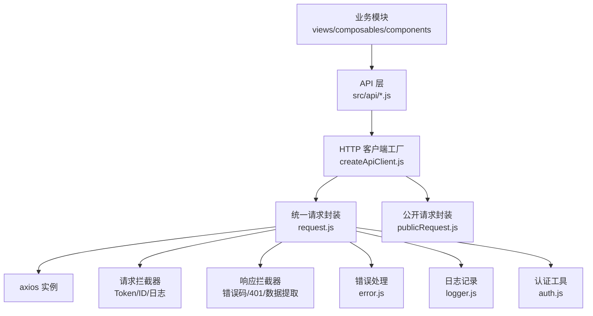
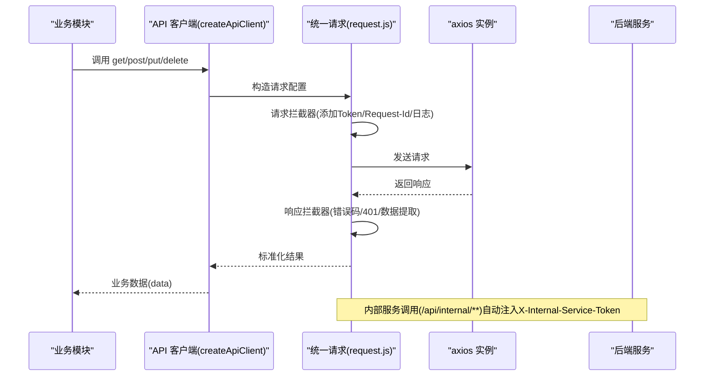
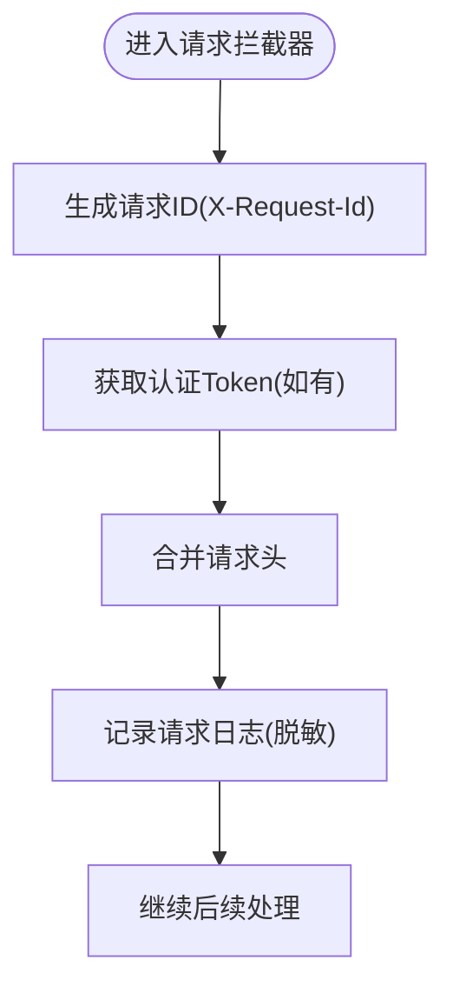
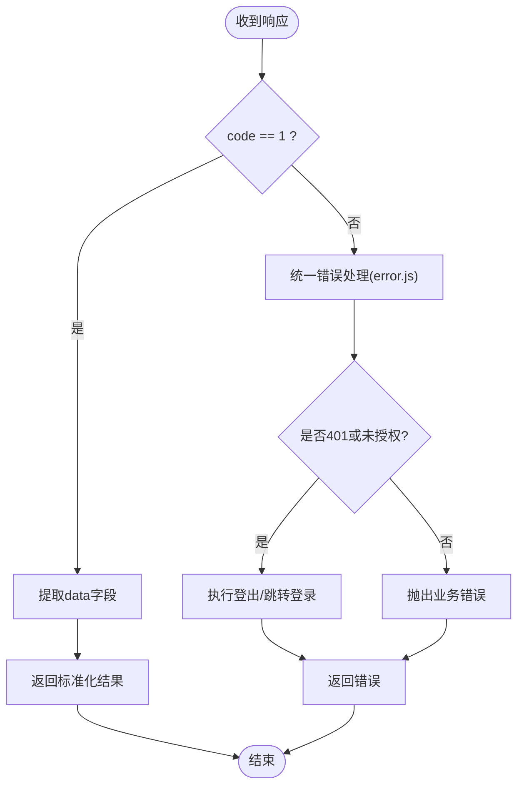
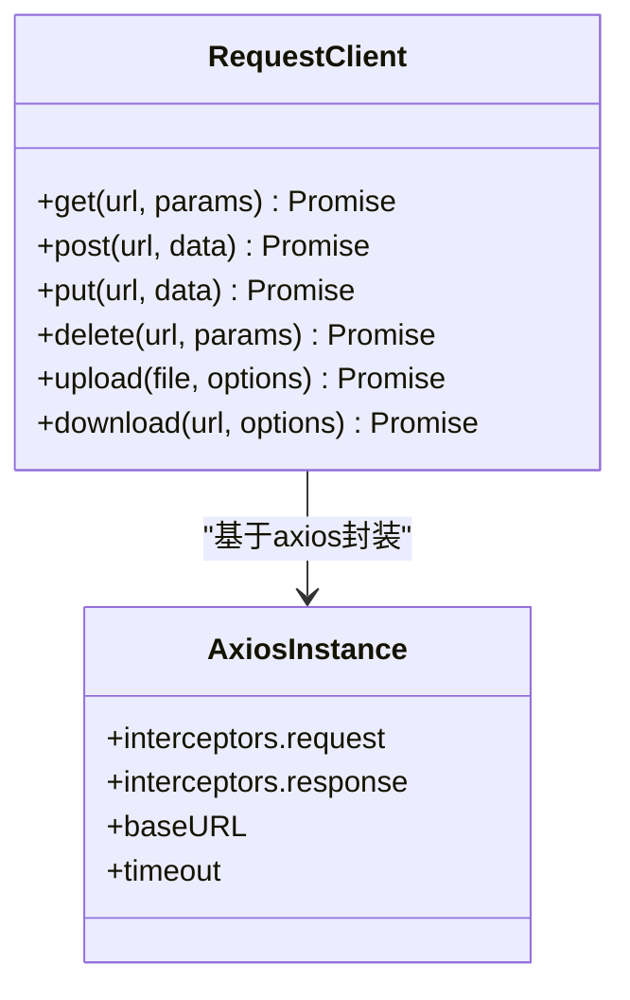
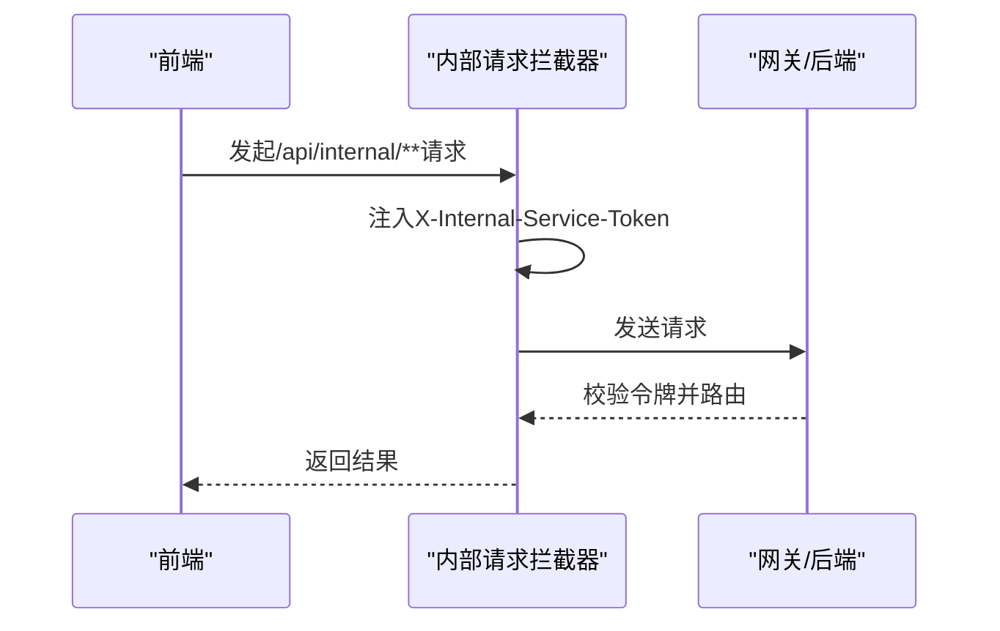
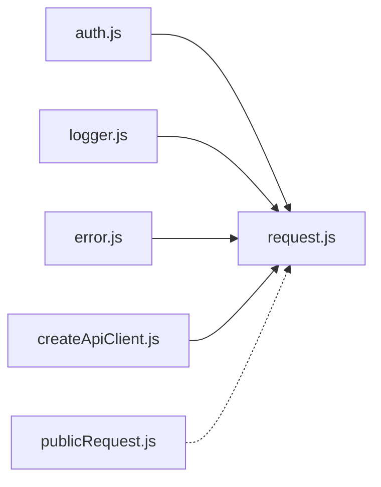

# HTTP客户端封装

<cite>
**本文引用的文件**   
- [ZXYZdatabaseFront/src/utils/request.js](file://ZXYZdatabaseFront/src/utils/request.js)
- [ZXYZdatabaseFront/src/utils/publicRequest.js](file://ZXYZdatabaseFront/src/utils/publicRequest.js)
- [ZXYZdatabaseFront/src/utils/createApiClient.js](file://ZXYZdatabaseFront/src/utils/createApiClient.js)
- [ZXYZdatabaseFront/src/utils/error.js](file://ZXYZdatabaseFront/src/utils/error.js)
- [ZXYZdatabaseFront/src/utils/logger.js](file://ZXYZdatabaseFront/src/utils/logger.js)
- [ZXYZdatabaseFront/src/utils/auth.js](file://ZXYZdatabaseFront/src/utils/auth.js)
- [ZXYZdatabaseFront/src/api/README.md](file://ZXYZdatabaseFront/src/api/README.md)
</cite>

## 目录
1. [简介](#简介)
2. [项目结构](#项目结构)
3. [核心组件](#核心组件)
4. [架构总览](#架构总览)
5. [详细组件分析](#详细组件分析)
6. [依赖关系分析](#依赖关系分析)
7. [性能考虑](#性能考虑)
8. [故障排查指南](#故障排查指南)
9. [结论](#结论)
10. [附录：配置与扩展示例](#附录配置与扩展示例)

## 简介
本技术文档面向 ZXYZ 前端（Vue 3）的 HTTP 客户端封装，聚焦统一的 axios 实例配置、请求/响应拦截器机制、公共方法封装、内部服务调用特殊处理以及错误与日志策略。目标是帮助开发者快速理解并安全扩展该封装，确保前后端交互的一致性、可观测性与可维护性。

## 项目结构
前端 HTTP 相关能力集中在 utils 与 api 两个目录：
- utils/request.js：统一 axios 实例创建、基础配置、请求/响应拦截器、公共方法封装
- utils/publicRequest.js：公开接口专用实例（无需鉴权）
- utils/createApiClient.js：按模块生成 API 客户端工厂
- utils/error.js：错误模型与统一错误处理
- utils/logger.js：结构化日志输出
- utils/auth.js：认证信息获取（如 Token）
- api/README.md：API 使用约定与规范

**图示来源** 
- [ZXYZdatabaseFront/src/utils/request.js](file://ZXYZdatabaseFront/src/utils/request.js)
- [ZXYZdatabaseFront/src/utils/publicRequest.js](file://ZXYZdatabaseFront/src/utils/publicRequest.js)
- [ZXYZdatabaseFront/src/utils/createApiClient.js](file://ZXYZdatabaseFront/src/utils/createApiClient.js)
- [ZXYZdatabaseFront/src/utils/error.js](file://ZXYZdatabaseFront/src/utils/error.js)
- [ZXYZdatabaseFront/src/utils/logger.js](file://ZXYZdatabaseFront/src/utils/logger.js)
- [ZXYZdatabaseFront/src/utils/auth.js](file://ZXYZdatabaseFront/src/utils/auth.js)

**章节来源**
- [ZXYZdatabaseFront/src/utils/request.js](file://ZXYZdatabaseFront/src/utils/request.js)
- [ZXYZdatabaseFront/src/utils/publicRequest.js](file://ZXYZdatabaseFront/src/utils/publicRequest.js)
- [ZXYZdatabaseFront/src/utils/createApiClient.js](file://ZXYZdatabaseFront/src/utils/createApiClient.js)
- [ZXYZdatabaseFront/src/utils/error.js](file://ZXYZdatabaseFront/src/utils/error.js)
- [ZXYZdatabaseFront/src/utils/logger.js](file://ZXYZdatabaseFront/src/utils/logger.js)
- [ZXYZdatabaseFront/src/utils/auth.js](file://ZXYZdatabaseFront/src/utils/auth.js)
- [ZXYZdatabaseFront/src/api/README.md](file://ZXYZdatabaseFront/src/api/README.md)

## 核心组件
- 统一 axios 实例
  - 基础 URL：通过环境变量或配置文件注入，避免硬编码
  - 超时：为不同场景设置合理的超时阈值
  - 请求头：Content-Type、Accept、X-Request-Id 等
- 请求拦截器
  - 自动附加认证 Token（HttpOnly Cookie 场景下由后端会话维持，必要时在请求头携带必要标识）
  - 请求 ID 追踪：为每个请求生成唯一 ID，便于链路追踪
  - 调试日志：记录请求方法、URL、参数摘要、耗时等
- 响应拦截器
  - 统一错误码处理：根据后端 Result<T> 的 code 字段判断成功/失败
  - 401 未授权：触发登出流程或跳转登录页
  - 成功数据提取：返回 data 字段，屏蔽外层包装
- 公共方法封装
  - get/post/put/delete 等方法统一参数处理与返回值标准化
- 内部服务调用
  - 针对 /api/internal/** 路径自动注入 X-Internal-Service-Token（由网关或后端校验）

**章节来源**
- [ZXYZdatabaseFront/src/utils/request.js](file://ZXYZdatabaseFront/src/utils/request.js)
- [ZXYZdatabaseFront/src/utils/publicRequest.js](file://ZXYZdatabaseFront/src/utils/publicRequest.js)
- [ZXYZdatabaseFront/src/utils/createApiClient.js](file://ZXYZdatabaseFront/src/utils/createApiClient.js)
- [ZXYZdatabaseFront/src/utils/error.js](file://ZXYZdatabaseFront/src/utils/error.js)
- [ZXYZdatabaseFront/src/utils/logger.js](file://ZXYZdatabaseFront/src/utils/logger.js)
- [ZXYZdatabaseFront/src/utils/auth.js](file://ZXYZdatabaseFront/src/utils/auth.js)

## 架构总览
下图展示了从业务模块到后端的完整调用链，包括拦截器、错误处理与日志记录的介入点。

**图示来源** 
- [ZXYZdatabaseFront/src/utils/createApiClient.js](file://ZXYZdatabaseFront/src/utils/createApiClient.js)
- [ZXYZdatabaseFront/src/utils/request.js](file://ZXYZdatabaseFront/src/utils/request.js)
- [ZXYZdatabaseFront/src/utils/publicRequest.js](file://ZXYZdatabaseFront/src/utils/publicRequest.js)
- [ZXYZdatabaseFront/src/utils/error.js](file://ZXYZdatabaseFront/src/utils/error.js)
- [ZXYZdatabaseFront/src/utils/logger.js](file://ZXYZdatabaseFront/src/utils/logger.js)
- [ZXYZdatabaseFront/src/utils/auth.js](file://ZXYZdatabaseFront/src/utils/auth.js)

## 详细组件分析

### 统一 axios 实例与基础配置
- 基础 URL：集中管理，支持多环境切换
- 超时：区分普通请求与长耗时操作
- 请求头：默认 Content-Type、Accept；动态追加 X-Request-Id
- 跨域与证书：按需配置 withCredentials、baseURL 等

**章节来源**
- [ZXYZdatabaseFront/src/utils/request.js](file://ZXYZdatabaseFront/src/utils/request.js)

### 请求拦截器实现机制
- 认证 Token：优先从会话/Cookie 中读取，必要时在请求头附加必要标识
- 请求 ID 追踪：生成 UUID 并写入 X-Request-Id，便于全链路追踪
- 调试日志：记录请求方法、URL、参数摘要、时间戳，控制敏感信息脱敏

**图示来源** 
- [ZXYZdatabaseFront/src/utils/request.js](file://ZXYZdatabaseFront/src/utils/request.js)
- [ZXYZdatabaseFront/src/utils/logger.js](file://ZXYZdatabaseFront/src/utils/logger.js)
- [ZXYZdatabaseFront/src/utils/auth.js](file://ZXYZdatabaseFront/src/utils/auth.js)

**章节来源**
- [ZXYZdatabaseFront/src/utils/request.js](file://ZXYZdatabaseFront/src/utils/request.js)
- [ZXYZdatabaseFront/src/utils/logger.js](file://ZXYZdatabaseFront/src/utils/logger.js)
- [ZXYZdatabaseFront/src/utils/auth.js](file://ZXYZdatabaseFront/src/utils/auth.js)

### 响应拦截器处理逻辑
- 统一错误码：解析后端 Result<T> 的 code 字段，code=1 视为成功
- 401 未授权：触发登出或跳转登录，清理本地状态
- 成功数据提取：返回 data 字段，屏蔽外层包装，简化上层调用

**图示来源** 
- [ZXYZdatabaseFront/src/utils/request.js](file://ZXYZdatabaseFront/src/utils/request.js)
- [ZXYZdatabaseFront/src/utils/error.js](file://ZXYZdatabaseFront/src/utils/error.js)

**章节来源**
- [ZXYZdatabaseFront/src/utils/request.js](file://ZXYZdatabaseFront/src/utils/request.js)
- [ZXYZdatabaseFront/src/utils/error.js](file://ZXYZdatabaseFront/src/utils/error.js)

### 公共请求方法封装
- get/post/put/delete：统一参数处理（params/data）、返回值标准化（data/message/code）
- 上传下载：支持进度回调、分片、取消等高级特性（如需）
- 重试与退避：对网络抖动进行有限重试（可选）

**图示来源** 
- [ZXYZdatabaseFront/src/utils/request.js](file://ZXYZdatabaseFront/src/utils/request.js)
- [ZXYZdatabaseFront/src/utils/createApiClient.js](file://ZXYZdatabaseFront/src/utils/createApiClient.js)

**章节来源**
- [ZXYZdatabaseFront/src/utils/request.js](file://ZXYZdatabaseFront/src/utils/request.js)
- [ZXYZdatabaseFront/src/utils/createApiClient.js](file://ZXYZdatabaseFront/src/utils/createApiClient.js)

### 内部服务调用的特殊处理
- 目标路径：/api/internal/**
- 自动注入：X-Internal-Service-Token（由网关或后端校验，禁止公网访问）
- 适用场景：前端直连内部微服务（通常由网关转发），需保证令牌安全传递

**图示来源** 
- [ZXYZdatabaseFront/src/utils/request.js](file://ZXYZdatabaseFront/src/utils/request.js)

**章节来源**
- [ZXYZdatabaseFront/src/utils/request.js](file://ZXYZdatabaseFront/src/utils/request.js)

### 公开请求封装（无需鉴权）
- 用途：登录、注册、验证码、静态资源等公开接口
- 特点：不附加认证 Token，独立 baseURL（可选）

**章节来源**
- [ZXYZdatabaseFront/src/utils/publicRequest.js](file://ZXYZdatabaseFront/src/utils/publicRequest.js)

### API 客户端工厂
- 作用：按模块生成一致的 API 客户端，减少重复代码
- 能力：批量绑定 get/post/put/delete，统一错误与日志

**章节来源**
- [ZXYZdatabaseFront/src/utils/createApiClient.js](file://ZXYZdatabaseFront/src/utils/createApiClient.js)

## 依赖关系分析
- request.js 依赖 auth.js（获取 Token）、logger.js（日志）、error.js（错误处理）
- createApiClient.js 依赖 request.js（统一请求）
- publicRequest.js 独立于 request.js，用于无鉴权场景

**图示来源** 
- [ZXYZdatabaseFront/src/utils/request.js](file://ZXYZdatabaseFront/src/utils/request.js)
- [ZXYZdatabaseFront/src/utils/createApiClient.js](file://ZXYZdatabaseFront/src/utils/createApiClient.js)
- [ZXYZdatabaseFront/src/utils/publicRequest.js](file://ZXYZdatabaseFront/src/utils/publicRequest.js)
- [ZXYZdatabaseFront/src/utils/error.js](file://ZXYZdatabaseFront/src/utils/error.js)
- [ZXYZdatabaseFront/src/utils/logger.js](file://ZXYZdatabaseFront/src/utils/logger.js)
- [ZXYZdatabaseFront/src/utils/auth.js](file://ZXYZdatabaseFront/src/utils/auth.js)

**章节来源**
- [ZXYZdatabaseFront/src/utils/request.js](file://ZXYZdatabaseFront/src/utils/request.js)
- [ZXYZdatabaseFront/src/utils/createApiClient.js](file://ZXYZdatabaseFront/src/utils/createApiClient.js)
- [ZXYZdatabaseFront/src/utils/publicRequest.js](file://ZXYZdatabaseFront/src/utils/publicRequest.js)
- [ZXYZdatabaseFront/src/utils/error.js](file://ZXYZdatabaseFront/src/utils/error.js)
- [ZXYZdatabaseFront/src/utils/logger.js](file://ZXYZdatabaseFront/src/utils/logger.js)
- [ZXYZdatabaseFront/src/utils/auth.js](file://ZXYZdatabaseFront/src/utils/auth.js)

## 性能考虑
- 合理设置超时与重试，避免雪崩
- 请求去重：相同请求短时间内只发一次
- 缓存策略：对热点数据做短期缓存（配合浏览器缓存）
- 大文件上传：分片、断点续传、并发控制
- 日志级别：生产环境降低日志量，仅保留关键信息

[本节为通用指导，不直接分析具体文件]

## 故障排查指南
- 常见问题
  - 401 未授权：检查 Token 是否存在、是否过期、是否被网关拒绝
  - 跨域问题：确认 CORS 配置与 withCredentials
  - 内部接口不可用：检查 X-Internal-Service-Token 是否正确注入
- 定位手段
  - 查看请求/响应日志（logger.js）
  - 检查错误模型与 message（error.js）
  - 使用 X-Request-Id 追踪链路

**章节来源**
- [ZXYZdatabaseFront/src/utils/error.js](file://ZXYZdatabaseFront/src/utils/error.js)
- [ZXYZdatabaseFront/src/utils/logger.js](file://ZXYZdatabaseFront/src/utils/logger.js)
- [ZXYZdatabaseFront/src/utils/request.js](file://ZXYZdatabaseFront/src/utils/request.js)

## 结论
通过统一的 axios 实例、完善的拦截器与错误处理机制，ZXYZ 前端的 HTTP 客户端实现了高内聚、低耦合、易扩展的设计。开发者只需关注业务逻辑，即可享受一致的鉴权、追踪、日志与错误处理能力。

[本节为总结，不直接分析具体文件]

## 附录：配置与扩展示例
- 基础配置
  - 设置 baseURL、超时、请求头
  - 启用/禁用调试日志
- 自定义扩展
  - 新增请求拦截器：如埋点、A/B 测试标记
  - 新增响应拦截器：如国际化错误提示、统计上报
  - 扩展公共方法：如 patch、head、streaming 下载
- 使用示例
  - 登录/注册：使用 publicRequest.js
  - 业务接口：使用 createApiClient.js 生成的客户端
  - 内部服务：调用 /api/internal/** 自动注入令牌

**章节来源**
- [ZXYZdatabaseFront/src/utils/request.js](file://ZXYZdatabaseFront/src/utils/request.js)
- [ZXYZdatabaseFront/src/utils/publicRequest.js](file://ZXYZdatabaseFront/src/utils/publicRequest.js)
- [ZXYZdatabaseFront/src/utils/createApiClient.js](file://ZXYZdatabaseFront/src/utils/createApiClient.js)
- [ZXYZdatabaseFront/src/api/README.md](file://ZXYZdatabaseFront/src/api/README.md)