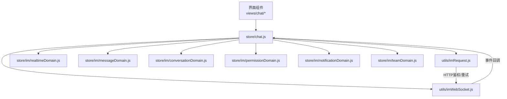
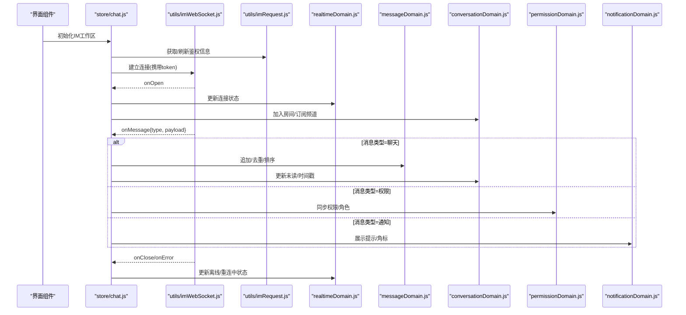
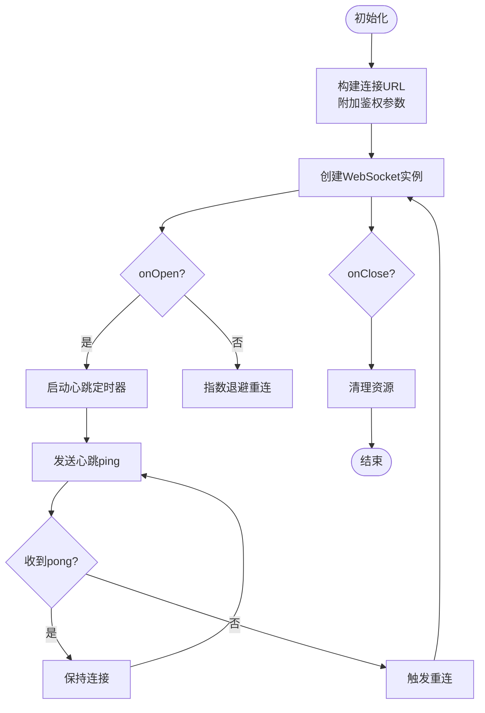
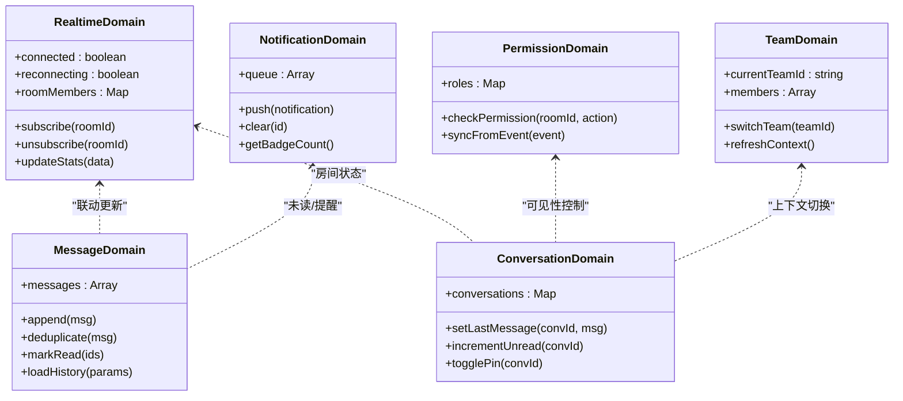
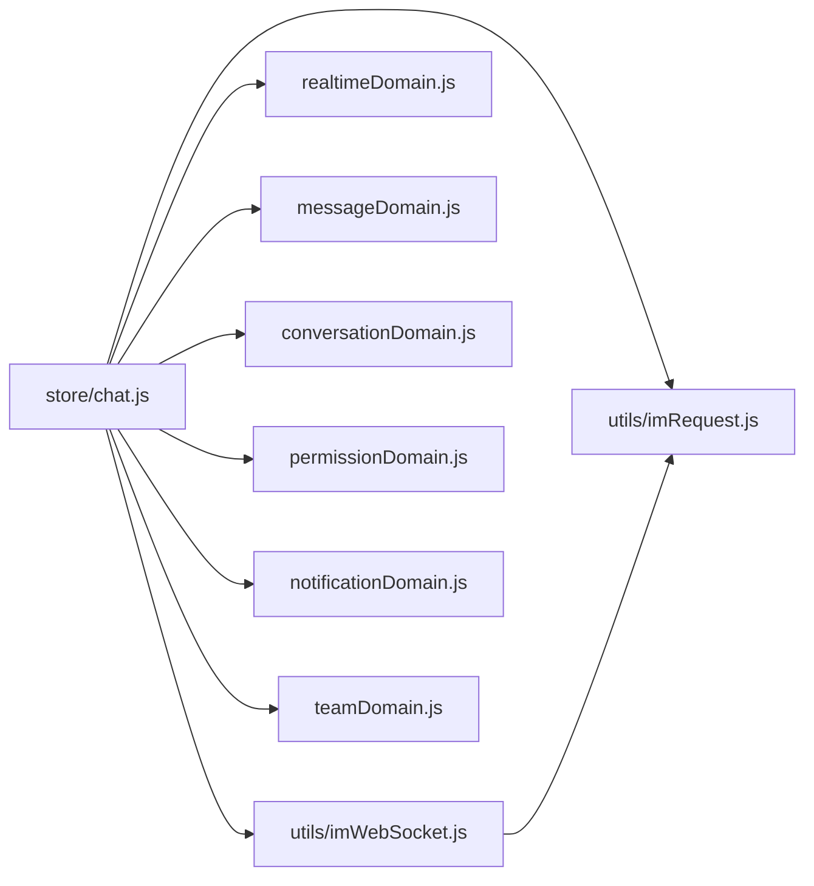

# WebSocket实时通信

<cite>
**本文引用的文件**   
- [imWebSocket.js](file://ZXYZdatabaseFront/src/utils/imWebSocket.js)
- [imRequest.js](file://ZXYZdatabaseFront/src/utils/imRequest.js)
- [chat.js](file://ZXYZdatabaseFront/src/store/chat.js)
- [realtimeDomain.js](file://ZXYZdatabaseFront/src/store/im/realtimeDomain.js)
- [messageDomain.js](file://ZXYZdatabaseFront/src/store/im/messageDomain.js)
- [conversationDomain.js](file://ZXYZdatabaseFront/src/store/im/conversationDomain.js)
- [permissionDomain.js](file://ZXYZdatabaseFront/src/store/im/permissionDomain.js)
- [notificationDomain.js](file://ZXYZdatabaseFront/src/store/im/notificationDomain.js)
- [teamDomain.js](file://ZXYZdatabaseFront/src/store/im/teamDomain.js)
- [useImWorkspace.js](file://ZXYZdatabaseFront/src/composables/useImWorkspace.js)
- [im.spec.js](file://ZXYZdatabaseFront/src/api/__tests__/im.spec.js)
- [api-contract.md](file://docs/api-contract.md)
</cite>

## 目录
1. [简介](#简介)
2. [项目结构](#项目结构)
3. [核心组件](#核心组件)
4. [架构总览](#架构总览)
5. [详细组件分析](#详细组件分析)
6. [依赖关系分析](#依赖关系分析)
7. [性能考量](#性能考量)
8. [故障排查指南](#故障排查指南)
9. [结论](#结论)
10. [附录](#附录)

## 简介
本技术文档面向ZXYZ前端WebSocket实时通信集成，聚焦以下目标：
- 连接生命周期管理：连接建立、心跳检测、断线重连、优雅关闭
- 消息协议与序列化：消息类型、载荷结构、编码方式
- 消息路由机制：按业务类型分发处理（聊天、通知、权限等）
- 连接状态管理：连接池、多房间支持、权限校验
- 错误处理策略：网络异常恢复、消息确认、性能监控
- 使用示例与调试：完整收发流程、调试工具与排障建议

## 项目结构
前端WebSocket相关代码主要位于：
- utils/imWebSocket.js：WebSocket连接封装（连接、心跳、重连、关闭、事件总线）
- utils/imRequest.js：IM请求封装（鉴权、重试、超时、错误映射）
- store/chat.js：全局聊天状态与UI交互桥接
- store/im/*：领域域模型（消息、会话、权限、通知、团队、实时数据）
- composables/useImWorkspace.js：工作区级IM能力组合式API
- api/__tests__/im.spec.js：IM接口测试用例（含WebSocket场景）
- docs/api-contract.md：前后端接口契约（含IM部分）

**图表来源** 
- [imWebSocket.js](file://ZXYZdatabaseFront/src/utils/imWebSocket.js)
- [imRequest.js](file://ZXYZdatabaseFront/src/utils/imRequest.js)
- [chat.js](file://ZXYZdatabaseFront/src/store/chat.js)
- [realtimeDomain.js](file://ZXYZdatabaseFront/src/store/im/realtimeDomain.js)
- [messageDomain.js](file://ZXYZdatabaseFront/src/store/im/messageDomain.js)
- [conversationDomain.js](file://ZXYZdatabaseFront/src/store/im/conversationDomain.js)
- [permissionDomain.js](file://ZXYZdatabaseFront/src/store/im/permissionDomain.js)
- [notificationDomain.js](file://ZXYZdatabaseFront/src/store/im/notificationDomain.js)
- [teamDomain.js](file://ZXYZdatabaseFront/src/store/im/teamDomain.js)

**章节来源**
- [imWebSocket.js](file://ZXYZdatabaseFront/src/utils/imWebSocket.js)
- [imRequest.js](file://ZXYZdatabaseFront/src/utils/imRequest.js)
- [chat.js](file://ZXYZdatabaseFront/src/store/chat.js)

## 核心组件
- WebSocket连接管理器（imWebSocket.js）
  - 职责：建立连接、心跳保活、断线指数退避重连、优雅关闭、事件派发、基础日志
  - 关键行为：
    - 连接建立：携带鉴权信息（如token），初始化房间订阅
    - 心跳：周期性ping/pong，失败触发重连
    - 重连：指数退避+抖动，上限控制，避免雪崩
    - 关闭：发送关闭帧并清理定时器与监听器
    - 事件：onOpen/onClose/onError/onMessage，供上层订阅
- IM请求封装（imRequest.js）
  - 职责：统一HTTP调用、鉴权头注入、重试与超时、错误码映射
  - 与WS协作：用于获取初始token、刷新会话、拉取历史消息等
- 领域域模型（store/im/*）
  - realtimeDomain.js：连接状态、在线人数、房间成员、实时指标
  - messageDomain.js：消息列表、去重、排序、已读回执
  - conversationDomain.js：会话元数据、未读数、置顶、可见性
  - permissionDomain.js：房间权限、角色、操作授权
  - notificationDomain.js：系统通知、提示音、角标
  - teamDomain.js：团队维度上下文、切换、缓存
- 工作区组合式API（useImWorkspace.js）
  - 职责：暴露joinRoom/leaveRoom/sendMessage/listenMessage等方法，屏蔽底层细节
- 聊天状态桥接（store/chat.js）
  - 职责：将WS事件转换为UI可消费的状态变更，协调各domain更新

**章节来源**
- [imWebSocket.js](file://ZXYZdatabaseFront/src/utils/imWebSocket.js)
- [imRequest.js](file://ZXYZdatabaseFront/src/utils/imRequest.js)
- [realtimeDomain.js](file://ZXYZdatabaseFront/src/store/im/realtimeDomain.js)
- [messageDomain.js](file://ZXYZdatabaseFront/src/store/im/messageDomain.js)
- [conversationDomain.js](file://ZXYZdatabaseFront/src/store/im/conversationDomain.js)
- [permissionDomain.js](file://ZXYZdatabaseFront/src/store/im/permissionDomain.js)
- [notificationDomain.js](file://ZXYZdatabaseFront/src/store/im/notificationDomain.js)
- [teamDomain.js](file://ZXYZdatabaseFront/src/store/im/teamDomain.js)
- [useImWorkspace.js](file://ZXYZdatabaseFront/src/composables/useImWorkspace.js)
- [chat.js](file://ZXYZdatabaseFront/src/store/chat.js)

## 架构总览
前端通过imWebSocket建立长连接，使用imRequest完成鉴权与辅助请求。WS事件驱动store中的各domain更新，UI层通过Pinia响应式数据渲染。

**图表来源** 
- [chat.js](file://ZXYZdatabaseFront/src/store/chat.js)
- [imWebSocket.js](file://ZXYZdatabaseFront/src/utils/imWebSocket.js)
- [imRequest.js](file://ZXYZdatabaseFront/src/utils/imRequest.js)
- [realtimeDomain.js](file://ZXYZdatabaseFront/src/store/im/realtimeDomain.js)
- [messageDomain.js](file://ZXYZdatabaseFront/src/store/im/messageDomain.js)
- [conversationDomain.js](file://ZXYZdatabaseFront/src/store/im/conversationDomain.js)
- [permissionDomain.js](file://ZXYZdatabaseFront/src/store/im/permissionDomain.js)
- [notificationDomain.js](file://ZXYZdatabaseFront/src/store/im/notificationDomain.js)

## 详细组件分析

### WebSocket连接管理器（imWebSocket.js）
- 连接生命周期
  - 建立：构造URL（ws/wss）、附加鉴权参数或头部、设置onopen回调
  - 心跳：定时发送ping，若指定时间内未收到pong则标记断开并触发重连
  - 重连：指数退避（baseDelay*2^attempt + jitter），最大重试次数限制；成功重置计数
  - 关闭：主动发送close帧，清理定时器与事件监听，触发onClose
- 事件总线
  - onOpen/onClose/onError/onMessage：统一派发，便于store订阅
- 可靠性
  - 断网检测：navigator.onLine结合socket状态
  - 幂等处理：重复消息去重（基于id或hash）
- 扩展点
  - 自定义编码器/解码器（JSON/二进制）
  - 拦截器（入站/出站）用于审计、压缩、加密

**图表来源** 
- [imWebSocket.js](file://ZXYZdatabaseFront/src/utils/imWebSocket.js)

**章节来源**
- [imWebSocket.js](file://ZXYZdatabaseFront/src/utils/imWebSocket.js)

### IM请求封装（imRequest.js）
- 功能要点
  - 统一请求入口，自动注入鉴权头（HttpOnly Cookie对应的token）
  - 重试策略：对特定错误码（如401/5xx）进行有限次重试
  - 超时控制：请求超时与取消（AbortController）
  - 错误映射：将后端Result<T>结构映射为前端友好错误对象
- 与WS协作
  - 在WS建立前获取有效token
  - 在WS断开时尝试刷新会话并重连

**章节来源**
- [imRequest.js](file://ZXYZdatabaseFront/src/utils/imRequest.js)

### 领域域模型（store/im/*）
- realtimeDomain.js
  - 维护连接状态（connected/reconnecting/disconnected）、在线统计、房间成员列表
  - 提供订阅/退订方法，支持批量更新
- messageDomain.js
  - 消息集合管理：追加、去重、分页加载、已读回执
  - 排序规则：时间戳优先，同时间按序列号
- conversationDomain.js
  - 会话元数据：名称、头像、最后消息、未读数、置顶、可见性
  - 与消息域联动更新未读与最后时间
- permissionDomain.js
  - 房间权限模型：角色、操作权限、动态授权
  - 与权限事件同步，控制UI显示与操作可用性
- notificationDomain.js
  - 通知队列、提示音开关、角标计数
  - 与消息域联动，区分业务通知与系统通知
- teamDomain.js
  - 团队上下文：当前团队ID、成员列表、配额信息
  - 切换团队时清理旧房间订阅，重新加入新房间

**图表来源** 
- [realtimeDomain.js](file://ZXYZdatabaseFront/src/store/im/realtimeDomain.js)
- [messageDomain.js](file://ZXYZdatabaseFront/src/store/im/messageDomain.js)
- [conversationDomain.js](file://ZXYZdatabaseFront/src/store/im/conversationDomain.js)
- [permissionDomain.js](file://ZXYZdatabaseFront/src/store/im/permissionDomain.js)
- [notificationDomain.js](file://ZXYZdatabaseFront/src/store/im/notificationDomain.js)
- [teamDomain.js](file://ZXYZdatabaseFront/src/store/im/teamDomain.js)

**章节来源**
- [realtimeDomain.js](file://ZXYZdatabaseFront/src/store/im/realtimeDomain.js)
- [messageDomain.js](file://ZXYZdatabaseFront/src/store/im/messageDomain.js)
- [conversationDomain.js](file://ZXYZdatabaseFront/src/store/im/conversationDomain.js)
- [permissionDomain.js](file://ZXYZdatabaseFront/src/store/im/permissionDomain.js)
- [notificationDomain.js](file://ZXYZdatabaseFront/src/store/im/notificationDomain.js)
- [teamDomain.js](file://ZXYZdatabaseFront/src/store/im/teamDomain.js)

### 工作区组合式API（useImWorkspace.js）
- 暴露方法
  - joinRoom(roomId): 加入房间并订阅
  - leaveRoom(roomId): 离开房间并取消订阅
  - sendMessage(type, payload): 发送消息（带ack/timeout）
  - listenMessage(callback): 订阅消息事件
  - getOnlineUsers(): 获取在线用户列表
  - setPresence(status): 设置在线状态
- 内部实现
  - 封装WS发送与事件监听
  - 与store各domain协作，保证状态一致性
  - 错误处理：网络异常、权限不足、消息格式错误

**章节来源**
- [useImWorkspace.js](file://ZXYZdatabaseFront/src/composables/useImWorkspace.js)

### 聊天状态桥接（store/chat.js）
- 职责
  - 将WS事件映射为UI状态变更
  - 协调各domain的更新顺序（先权限后消息，先消息后会话）
  - 提供统一的订阅接口给组件使用
- 关键流程
  - onMessage路由：根据type分派到对应domain处理器
  - 错误上报：记录错误上下文，触发用户提示
  - 性能优化：批量更新、防抖合并

**章节来源**
- [chat.js](file://ZXYZdatabaseFront/src/store/chat.js)

## 依赖关系分析
- 模块耦合
  - imWebSocket.js被chat.js与useImWorkspace.js共同依赖
  - imRequest.js为imWebSocket.js提供鉴权与辅助请求
  - store/im/*之间通过chat.js协调，避免循环依赖
- 外部依赖
  - Pinia：状态管理与响应式更新
  - navigator.onLine：网络状态检测
  - AbortController：请求取消与超时
- 潜在风险
  - 事件风暴：大量onMessage同时触发需做批处理
  - 内存泄漏：未正确移除监听器导致内存增长

**图表来源** 
- [chat.js](file://ZXYZdatabaseFront/src/store/chat.js)
- [imWebSocket.js](file://ZXYZdatabaseFront/src/utils/imWebSocket.js)
- [imRequest.js](file://ZXYZdatabaseFront/src/utils/imRequest.js)
- [realtimeDomain.js](file://ZXYZdatabaseFront/src/store/im/realtimeDomain.js)
- [messageDomain.js](file://ZXYZdatabaseFront/src/store/im/messageDomain.js)
- [conversationDomain.js](file://ZXYZdatabaseFront/src/store/im/conversationDomain.js)
- [permissionDomain.js](file://ZXYZdatabaseFront/src/store/im/permissionDomain.js)
- [notificationDomain.js](file://ZXYZdatabaseFront/src/store/im/notificationDomain.js)
- [teamDomain.js](file://ZXYZdatabaseFront/src/store/im/teamDomain.js)

**章节来源**
- [chat.js](file://ZXYZdatabaseFront/src/store/chat.js)
- [imWebSocket.js](file://ZXYZdatabaseFront/src/utils/imWebSocket.js)
- [imRequest.js](file://ZXYZdatabaseFront/src/utils/imRequest.js)

## 性能考量
- 连接层面
  - 心跳间隔可调（默认30s），根据网络质量动态调整
  - 重连退避策略避免并发重连风暴
  - 连接池：多房间复用同一连接，减少握手开销
- 消息层面
  - 批量发送：合并短时间内的多条消息
  - 去重机制：基于消息ID或哈希避免重复渲染
  - 分页加载：历史消息按需加载，避免一次性加载过大
- 状态更新
  - 批量更新：合并多次state变更，减少渲染次数
  - 虚拟滚动：长列表使用虚拟滚动提升性能
- 监控埋点
  - 连接成功率、平均延迟、丢包率
  - 重连次数、失败原因分布
  - 消息吞吐、峰值QPS

[本节为通用指导，不直接分析具体文件]

## 故障排查指南
- 常见问题
  - 连接失败：检查token有效性、防火墙策略、WSS证书
  - 频繁重连：检查心跳配置、网络稳定性、服务端负载
  - 消息丢失：检查去重逻辑、ACK机制、存储持久化
  - 权限错误：检查房间权限、角色分配、动态授权
- 调试工具
  - 浏览器开发者工具：Network/WebSocket面板查看帧内容
  - 前端日志：开启imWebSocket.js的debug模式输出详细日志
  - 单元测试：参考im.spec.js编写覆盖用例
- 定位步骤
  - 确认连接状态：connected/reconnecting/disconnected
  - 检查心跳：ping/pong是否成对出现
  - 验证消息路由：type是否正确分发到对应domain
  - 审查错误码：后端Result<T>的code与message字段

**章节来源**
- [imWebSocket.js](file://ZXYZdatabaseFront/src/utils/imWebSocket.js)
- [im.spec.js](file://ZXYZdatabaseFront/src/api/__tests__/im.spec.js)

## 结论
ZXYZ前端WebSocket实时通信集成通过模块化设计实现了高内聚、低耦合的架构。连接管理、消息路由、状态更新各司其职，配合完善的错误处理与性能优化策略，确保了实时通信的稳定性与可扩展性。建议在生产环境启用监控埋点，持续优化心跳与重连策略，保障用户体验。

[本节为总结性内容，不直接分析具体文件]

## 附录
- 消息协议定义
  - 消息类型：chat、permission、notification、system等
  - 载荷结构：包含业务数据、时间戳、发送者ID、房间ID
  - 序列化方式：JSON字符串，可选压缩（gzip）
- 完整示例
  - 连接建立：调用useImWorkspace().joinRoom(roomId)
  - 发送消息：sendMessage('chat', {content, roomId})
  - 接收消息：listenMessage((event) => {...})
- 调试技巧
  - 使用浏览器控制台打印WS事件
  - 模拟断网/弱网场景测试重连
  - 使用Mock服务验证消息路由

**章节来源**
- [api-contract.md](file://docs/api-contract.md)
- [useImWorkspace.js](file://ZXYZdatabaseFront/src/composables/useImWorkspace.js)
- [imWebSocket.js](file://ZXYZdatabaseFront/src/utils/imWebSocket.js)