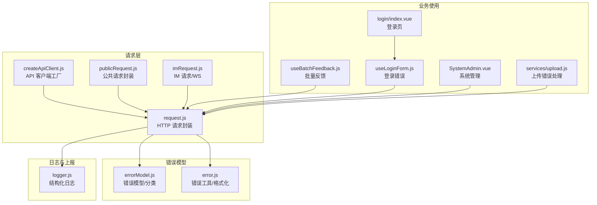
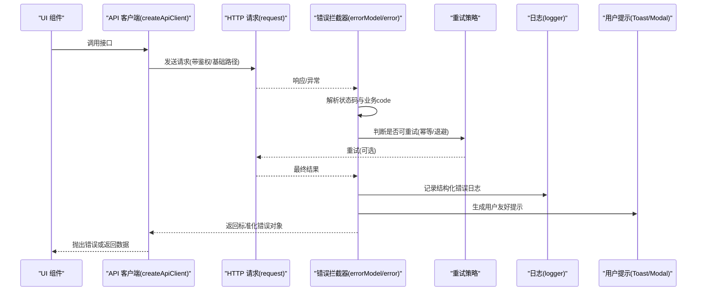
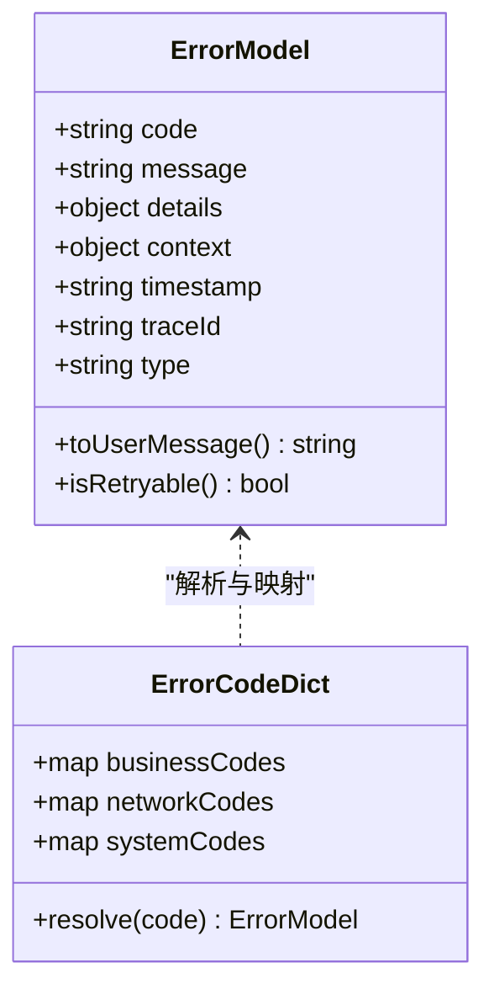
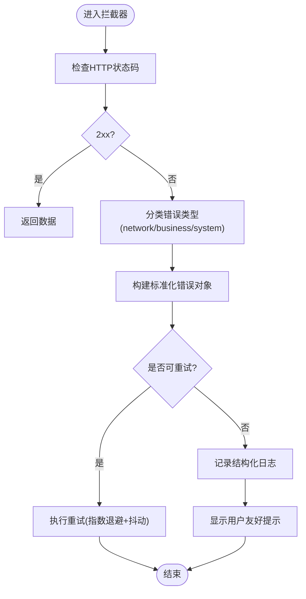
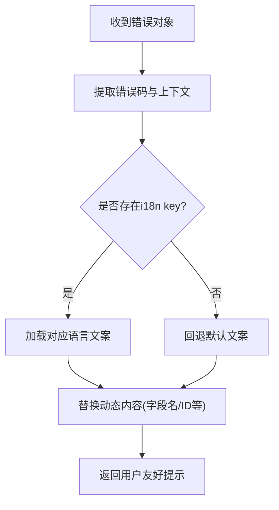
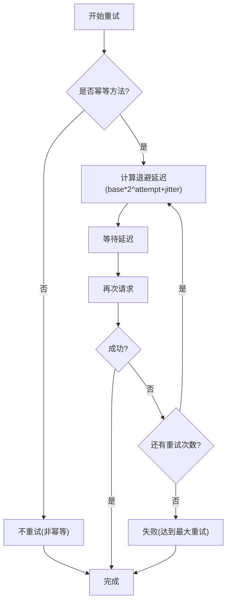
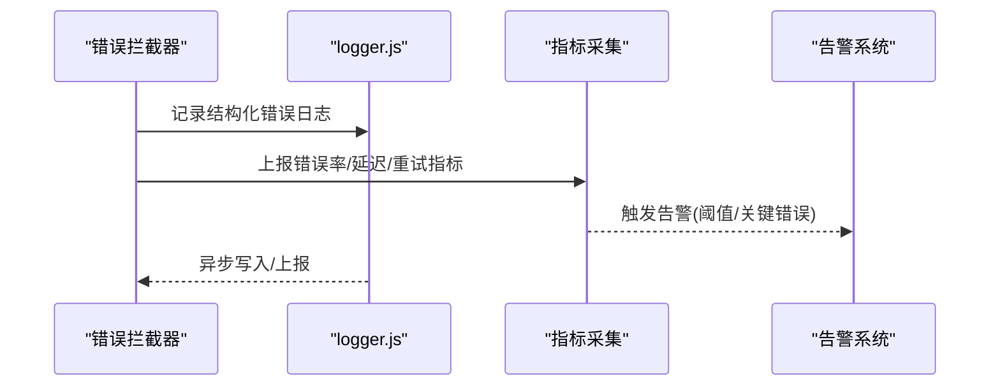
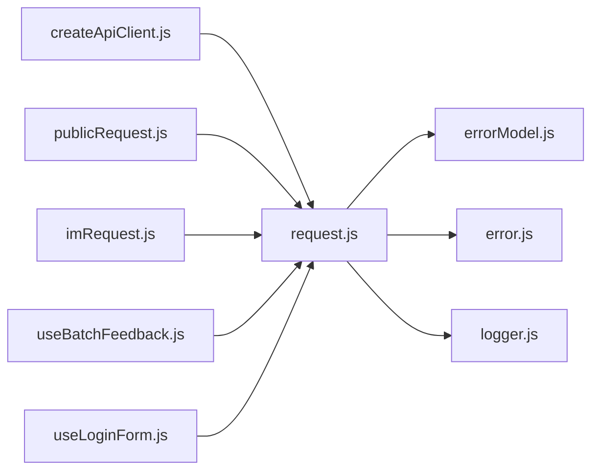

# 错误处理机制

<cite>
**本文引用的文件**   
- [error.js](file://ZXYZdatabaseFront/src/utils/error.js)
- [errorModel.js](file://ZXYZdatabaseFront/src/utils/errorModel.js)
- [request.js](file://ZXYZdatabaseFront/src/utils/request.js)
- [createApiClient.js](file://ZXYZdatabaseFront/src/utils/createApiClient.js)
- [publicRequest.js](file://ZXYZdatabaseFront/src/utils/publicRequest.js)
- [imRequest.js](file://ZXYZdatabaseFront/src/utils/imRequest.js)
- [logger.js](file://ZXYZdatabaseFront/src/utils/logger.js)
- [auth.js](file://ZXYZdatabaseFront/src/utils/auth.js)
- [upload.js](file://ZXYZdatabaseFront/src/services/upload.js)
- [useBatchFeedback.js](file://ZXYZdatabaseFront/src/composables/useBatchFeedback.js)
- [useLoginForm.js](file://ZXYZdatabaseFront/src/composables/useLoginForm.js)
- [index.vue](file://ZXYZdatabaseFront/src/views/login/index.vue)
- [index.vue](file://ZXYZdatabaseFront/src/views/setting/SystemAdmin.vue)
</cite>

## 目录
1. [简介](#简介)
2. [项目结构](#项目结构)
3. [核心组件](#核心组件)
4. [架构总览](#架构总览)
5. [详细组件分析](#详细组件分析)
6. [依赖关系分析](#依赖关系分析)
7. [性能考量](#性能考量)
8. [故障排查指南](#故障排查指南)
9. [结论](#结论)
10. [附录](#附录)

## 简介
本文件面向 ZXYZ 前端（Vue 3 + Element Plus）的错误处理机制，系统化阐述统一错误码体系、错误拦截器、本地化支持、重试与幂等策略、错误上报与监控集成，以及常见错误的处理模式与最佳实践。文档以代码级实现为依据，结合流程图与时序图帮助读者快速理解并落地。

## 项目结构
前端错误处理相关能力集中在 utils 与 composables 层：
- utils/request.js：HTTP 请求封装，统一错误拦截、状态码映射、业务异常捕获与用户提示
- utils/createApiClient.js：按模块创建 API 客户端，注入认证头、基础路径与错误处理策略
- utils/publicRequest.js：公共接口请求封装（无需鉴权），复用统一错误处理
- utils/imRequest.js：IM WebSocket 连接与消息通道，包含重连与断线恢复
- utils/error.js / errorModel.js：错误模型定义、错误分类与格式化
- utils/logger.js：结构化日志输出，用于错误上报与可观测性
- services/upload.js：大文件上传流程中的错误处理与重试
- composables/useBatchFeedback.js：批量操作的反馈与错误聚合
- composables/useLoginForm.js：登录表单校验与错误提示
- views/login/index.vue、views/setting/SystemAdmin.vue：页面级错误展示与操作入口

**图表来源** 
- [request.js](file://ZXYZdatabaseFront/src/utils/request.js)
- [createApiClient.js](file://ZXYZdatabaseFront/src/utils/createApiClient.js)
- [publicRequest.js](file://ZXYZdatabaseFront/src/utils/publicRequest.js)
- [imRequest.js](file://ZXYZdatabaseFront/src/utils/imRequest.js)
- [errorModel.js](file://ZXYZdatabaseFront/src/utils/errorModel.js)
- [error.js](file://ZXYZdatabaseFront/src/utils/error.js)
- [logger.js](file://ZXYZdatabaseFront/src/utils/logger.js)
- [useBatchFeedback.js](file://ZXYZdatabaseFront/src/composables/useBatchFeedback.js)
- [useLoginForm.js](file://ZXYZdatabaseFront/src/composables/useLoginForm.js)
- [index.vue](file://ZXYZdatabaseFront/src/views/login/index.vue)
- [index.vue](file://ZXYZdatabaseFront/src/views/setting/SystemAdmin.vue)
- [upload.js](file://ZXYZdatabaseFront/src/services/upload.js)

**章节来源**
- [request.js](file://ZXYZdatabaseFront/src/utils/request.js)
- [createApiClient.js](file://ZXYZdatabaseFront/src/utils/createApiClient.js)
- [publicRequest.js](file://ZXYZdatabaseFront/src/utils/publicRequest.js)
- [imRequest.js](file://ZXYZdatabaseFront/src/utils/imRequest.js)
- [errorModel.js](file://ZXYZdatabaseFront/src/utils/errorModel.js)
- [error.js](file://ZXYZdatabaseFront/src/utils/error.js)
- [logger.js](file://ZXYZdatabaseFront/src/utils/logger.js)
- [useBatchFeedback.js](file://ZXYZdatabaseFront/src/composables/useBatchFeedback.js)
- [useLoginForm.js](file://ZXYZdatabaseFront/src/composables/useLoginForm.js)
- [index.vue](file://ZXYZdatabaseFront/src/views/login/index.vue)
- [index.vue](file://ZXYZdatabaseFront/src/views/setting/SystemAdmin.vue)
- [upload.js](file://ZXYZdatabaseFront/src/services/upload.js)

## 核心组件
- 统一错误码体系
  - 业务错误码：由后端 Result<T>.code 返回，前端按 code 分类（如参数校验失败、权限不足、资源不存在等）
  - 网络错误码：HTTP 状态码（4xx/5xx）、超时、跨域、CORS、WebSocket 断开等
  - 系统错误码：前端运行时异常（序列化失败、路由守卫异常、插件初始化失败等）
- 错误拦截器
  - HTTP 响应拦截：根据状态码与业务 code 进行分支处理，构造标准化错误对象
  - 业务异常捕获：对 Promise reject 与 try/catch 捕获的异常进行归一化
  - 用户友好提示：将错误信息转换为可读文案，必要时提供操作建议
- 本地化支持
  - 多语言错误消息：通过 key 映射到 i18n 文案，支持动态内容插值
  - 动态错误内容：从错误对象中提取上下文（如字段名、资源 ID）拼接提示
- 重试机制
  - 网络重试：针对瞬时错误（5xx、超时、网络抖动）配置指数退避与最大重试次数
  - 幂等性保证：GET/HEAD/PUT/DELETE 等幂等方法自动重试；POST 需显式声明 idempotency-key
  - 退避策略：指数退避 + 抖动，避免雪崩
- 错误上报与监控
  - 结构化日志：记录请求 URL、方法、状态码、耗时、错误堆栈、用户上下文
  - 指标统计：错误率、P95/P99 延迟、重试成功率
  - 告警触发：错误率阈值或关键错误类型触发告警

**章节来源**
- [errorModel.js](file://ZXYZdatabaseFront/src/utils/errorModel.js)
- [error.js](file://ZXYZdatabaseFront/src/utils/error.js)
- [request.js](file://ZXYZdatabaseFront/src/utils/request.js)
- [logger.js](file://ZXYZdatabaseFront/src/utils/logger.js)

## 架构总览
下图展示了前端请求生命周期中的错误处理链路，包括请求发起、拦截、错误分类、重试、上报与用户提示。

**图表来源** 
- [createApiClient.js](file://ZXYZdatabaseFront/src/utils/createApiClient.js)
- [request.js](file://ZXYZdatabaseFront/src/utils/request.js)
- [errorModel.js](file://ZXYZdatabaseFront/src/utils/errorModel.js)
- [error.js](file://ZXYZdatabaseFront/src/utils/error.js)
- [logger.js](file://ZXYZdatabaseFront/src/utils/logger.js)

## 详细组件分析

### 统一错误码体系设计
- 分类与范围
  - 业务错误码：来源于后端 Result<T>.code，覆盖参数校验、权限、业务规则等
  - 网络错误码：HTTP 状态码（401/403/404/5xx）、超时、DNS/CORS、WebSocket 错误
  - 系统错误码：前端内部异常（JSON 解析失败、路由守卫失败、插件初始化失败）
- 错误对象模型
  - 标准字段：code、message、details、context、timestamp、traceId
  - 分类标签：type=network|business|system，便于统计与告警
- 映射与扩展
  - 错误码字典集中维护，支持多语言 key 映射
  - 新增错误码需同步更新字典与 i18n 文案

**图表来源** 
- [errorModel.js](file://ZXYZdatabaseFront/src/utils/errorModel.js)
- [error.js](file://ZXYZdatabaseFront/src/utils/error.js)

**章节来源**
- [errorModel.js](file://ZXYZdatabaseFront/src/utils/errorModel.js)
- [error.js](file://ZXYZdatabaseFront/src/utils/error.js)

### 错误拦截器实现逻辑
- HTTP 状态码处理
  - 2xx：正常返回数据
  - 4xx：区分 401（未认证/会话过期）、403（权限不足）、404（资源不存在）
  - 5xx：服务端错误，触发重试与上报
- 业务异常捕获
  - 对 Promise reject 与 try/catch 捕获的异常进行归一化
  - 提取后端返回的业务 code 与 message，构造 ErrorModel
- 用户友好提示
  - 将错误信息转换为可读文案，必要时提供操作建议（如“请重新登录”、“检查网络连接”）
  - 对于批量操作，聚合错误并给出汇总提示

**图表来源** 
- [request.js](file://ZXYZdatabaseFront/src/utils/request.js)
- [errorModel.js](file://ZXYZdatabaseFront/src/utils/errorModel.js)
- [error.js](file://ZXYZdatabaseFront/src/utils/error.js)

**章节来源**
- [request.js](file://ZXYZdatabaseFront/src/utils/request.js)
- [errorModel.js](file://ZXYZdatabaseFront/src/utils/errorModel.js)
- [error.js](file://ZXYZdatabaseFront/src/utils/error.js)

### 错误信息的本地化支持
- 多语言错误消息
  - 通过错误码 key 映射到 i18n 文案，支持中文、英文等多语言
  - 动态内容插值：如字段名、资源 ID、时间戳等
- 动态错误内容
  - 从错误对象的 details/context 中提取上下文信息，拼接为可读提示
  - 支持富文本与链接（如跳转到设置页修复配置）

**图表来源** 
- [error.js](file://ZXYZdatabaseFront/src/utils/error.js)
- [errorModel.js](file://ZXYZdatabaseFront/src/utils/errorModel.js)

**章节来源**
- [error.js](file://ZXYZdatabaseFront/src/utils/error.js)
- [errorModel.js](file://ZXYZdatabaseFront/src/utils/errorModel.js)

### 重试机制的实现
- 网络重试
  - 针对 5xx、超时、网络抖动等瞬时错误，启用指数退避与最大重试次数
  - 支持抖动（jitter）避免并发重试导致的雪崩
- 幂等性保证
  - GET/HEAD/PUT/DELETE 等幂等方法自动重试
  - POST 等非幂等方法需显式声明 idempotency-key，确保重复提交安全
- 退避策略
  - 指数退避公式：delay = baseDelay * (2^attempt) + jitter
  - 最大重试次数与超时时间可配置

**图表来源** 
- [request.js](file://ZXYZdatabaseFront/src/utils/request.js)
- [createApiClient.js](file://ZXYZdatabaseFront/src/utils/createApiClient.js)

**章节来源**
- [request.js](file://ZXYZdatabaseFront/src/utils/request.js)
- [createApiClient.js](file://ZXYZdatabaseFront/src/utils/createApiClient.js)

### 错误上报和监控集成
- 错误日志收集
  - 结构化日志：记录请求 URL、方法、状态码、耗时、错误堆栈、用户上下文
  - 采样策略：高错误率时降低采样率，避免日志风暴
- 性能指标统计
  - 错误率、P95/P99 延迟、重试成功率、WebSocket 断线率
  - 按模块/接口维度统计，便于定位热点错误
- 告警触发
  - 错误率阈值（如 >5% 持续 5 分钟）触发告警
  - 关键错误类型（如 5xx、认证失败）立即告警

**图表来源** 
- [request.js](file://ZXYZdatabaseFront/src/utils/request.js)
- [logger.js](file://ZXYZdatabaseFront/src/utils/logger.js)

**章节来源**
- [request.js](file://ZXYZdatabaseFront/src/utils/request.js)
- [logger.js](file://ZXYZdatabaseFront/src/utils/logger.js)

### 常见错误的处理模式和最佳实践
- 认证与授权错误
  - 401：清除本地会话，跳转登录页，保留原始路由
  - 403：提示无权限，引导申请权限或联系管理员
- 网络与超时错误
  - 超时：提示检查网络，提供重试按钮
  - CORS/跨域：提示检查代理配置或域名白名单
- 业务规则错误
  - 参数校验失败：高亮错误字段，提示修正
  - 资源不存在：提示刷新或检查链接
- 批量操作错误
  - 聚合错误信息，提供部分成功提示与失败项详情
- 最佳实践
  - 统一错误模型，避免分散处理
  - 用户友好提示，避免技术术语
  - 合理重试与幂等，避免雪崩
  - 结构化日志与指标，便于排障

**章节来源**
- [useBatchFeedback.js](file://ZXYZdatabaseFront/src/composables/useBatchFeedback.js)
- [useLoginForm.js](file://ZXYZdatabaseFront/src/composables/useLoginForm.js)
- [index.vue](file://ZXYZdatabaseFront/src/views/login/index.vue)
- [index.vue](file://ZXYZdatabaseFront/src/views/setting/SystemAdmin.vue)

## 依赖关系分析
- 组件耦合度
  - request.js 为核心，被 createApiClient.js、publicRequest.js、imRequest.js 依赖
  - errorModel.js 与 error.js 为错误处理核心，被所有请求层依赖
  - logger.js 为通用日志，被请求层与业务层使用
- 外部依赖
  - Axios/Fetch：HTTP 请求库
  - i18n：多语言支持
  - WebSocket：IM 实时通信
- 潜在循环依赖
  - 请求层不应依赖业务组件，避免循环引用

**图表来源** 
- [request.js](file://ZXYZdatabaseFront/src/utils/request.js)
- [createApiClient.js](file://ZXYZdatabaseFront/src/utils/createApiClient.js)
- [publicRequest.js](file://ZXYZdatabaseFront/src/utils/publicRequest.js)
- [imRequest.js](file://ZXYZdatabaseFront/src/utils/imRequest.js)
- [errorModel.js](file://ZXYZdatabaseFront/src/utils/errorModel.js)
- [error.js](file://ZXYZdatabaseFront/src/utils/error.js)
- [logger.js](file://ZXYZdatabaseFront/src/utils/logger.js)
- [useBatchFeedback.js](file://ZXYZdatabaseFront/src/composables/useBatchFeedback.js)
- [useLoginForm.js](file://ZXYZdatabaseFront/src/composables/useLoginForm.js)

**章节来源**
- [request.js](file://ZXYZdatabaseFront/src/utils/request.js)
- [createApiClient.js](file://ZXYZdatabaseFront/src/utils/createApiClient.js)
- [publicRequest.js](file://ZXYZdatabaseFront/src/utils/publicRequest.js)
- [imRequest.js](file://ZXYZdatabaseFront/src/utils/imRequest.js)
- [errorModel.js](file://ZXYZdatabaseFront/src/utils/errorModel.js)
- [error.js](file://ZXYZdatabaseFront/src/utils/error.js)
- [logger.js](file://ZXYZdatabaseFront/src/utils/logger.js)
- [useBatchFeedback.js](file://ZXYZdatabaseFront/src/composables/useBatchFeedback.js)
- [useLoginForm.js](file://ZXYZdatabaseFront/src/composables/useLoginForm.js)

## 性能考量
- 重试策略优化
  - 指数退避 + 抖动，避免并发重试导致的服务端压力
  - 限制最大重试次数，防止无限重试
- 日志采样
  - 高错误率时降低采样率，避免日志风暴影响性能
- 内存管理
  - 及时清理 WebSocket 连接与定时器，避免内存泄漏
- 用户体验
  - 错误提示去抖与合并，避免频繁弹窗干扰

[本节为通用指导，不涉及具体文件分析]

## 故障排查指南
- 常见问题定位
  - 检查请求 URL、方法与参数是否正确
  - 查看浏览器控制台与 Network 面板，确认状态码与响应体
  - 检查 logger.js 输出的结构化日志，定位错误堆栈
- 调试技巧
  - 启用详细日志模式，记录完整请求/响应
  - 模拟错误场景（如 5xx、超时、CORS）验证处理逻辑
- 恢复措施
  - 网络问题：检查代理、防火墙、域名解析
  - 认证问题：检查 Cookie/Session 是否有效
  - 业务问题：核对后端接口契约与错误码定义

**章节来源**
- [logger.js](file://ZXYZdatabaseFront/src/utils/logger.js)
- [request.js](file://ZXYZdatabaseFront/src/utils/request.js)

## 结论
ZXYZ 前端的错误处理机制通过统一错误码体系、拦截器、本地化、重试与上报，构建了健壮且友好的错误处理能力。遵循本文档的设计与实践，可有效提升系统的稳定性与用户体验。

[本节为总结，不涉及具体文件分析]

## 附录
- 错误码字典维护规范
  - 新增错误码需同步更新字典与 i18n 文案
  - 定期审查错误码使用情况，清理废弃条目
- 监控与告警配置
  - 配置错误率阈值与关键错误告警规则
  - 定期回顾告警有效性，避免误报

[本节为补充说明，不涉及具体文件分析]