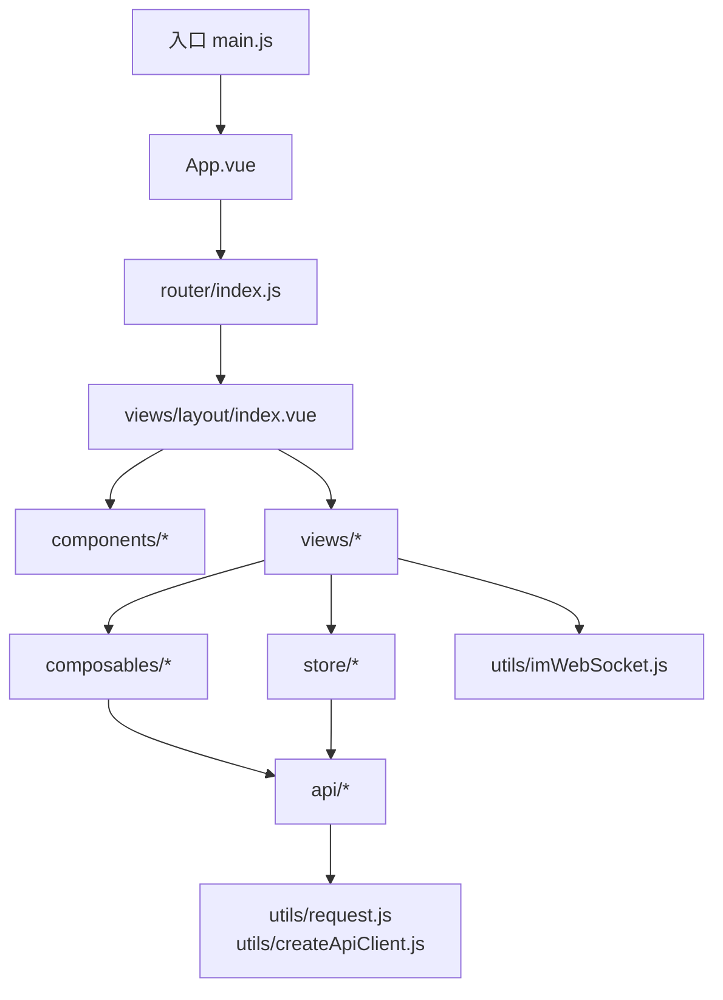
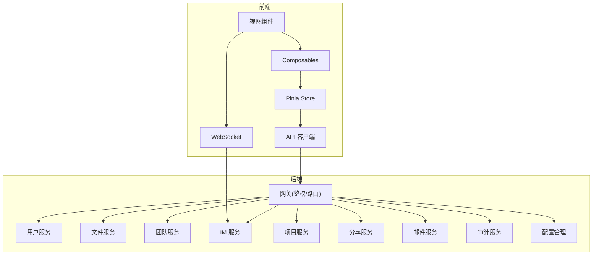
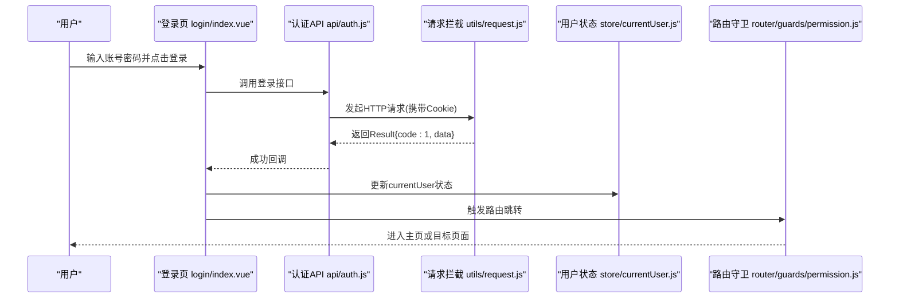
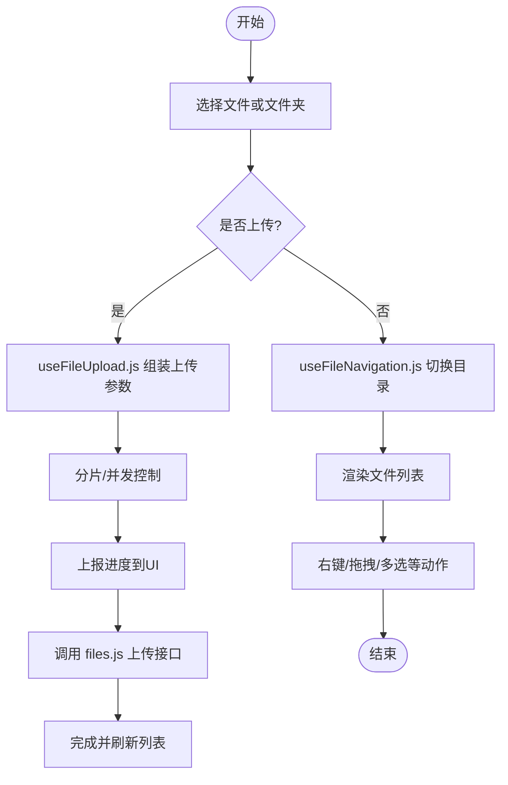
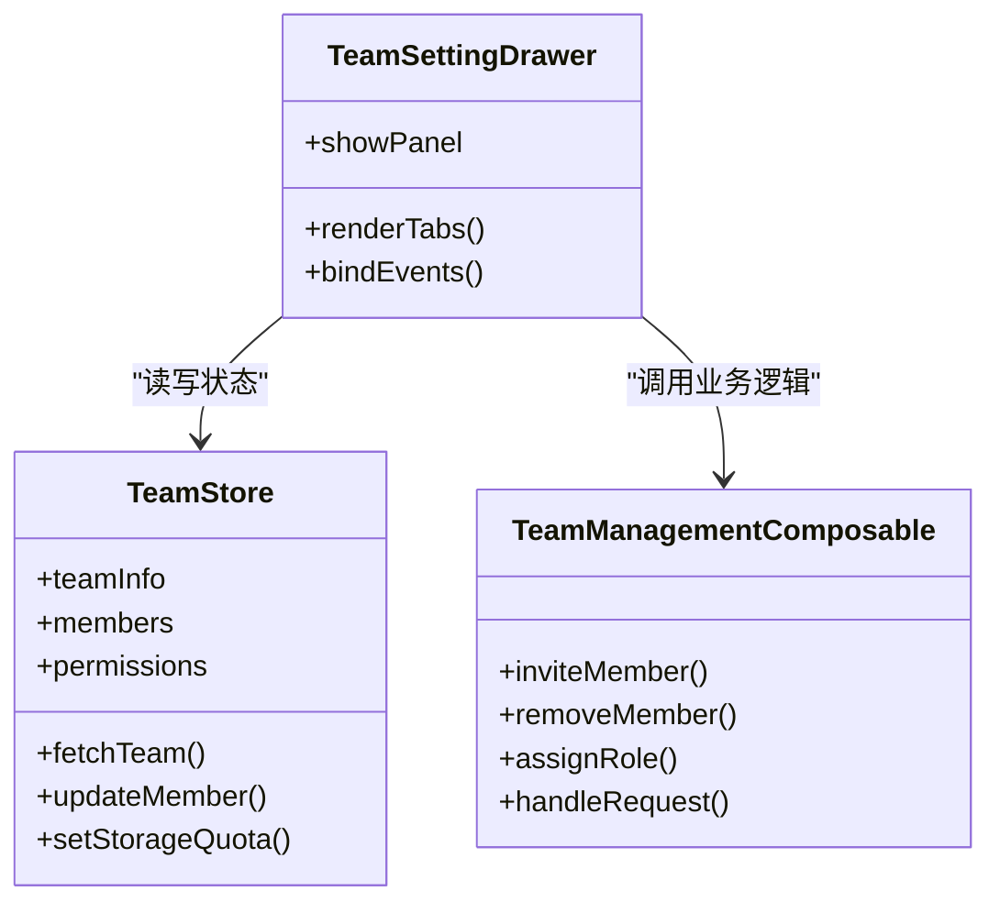
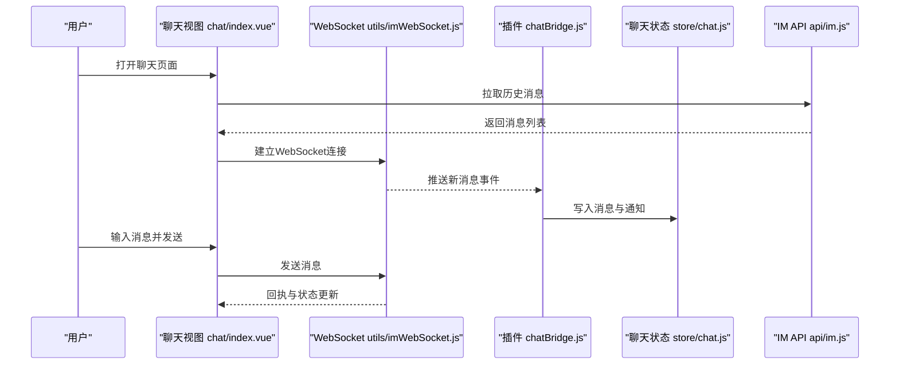
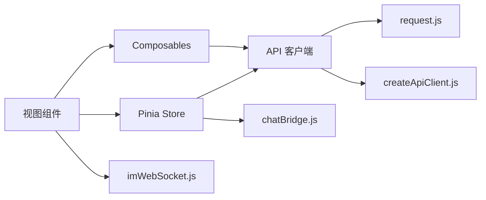

# 前端应用

<cite>
**本文引用的文件**   
- [ZXYZdatabaseFront/src/main.js](file://ZXYZdatabaseFront/src/main.js)
- [ZXYZdatabaseFront/src/App.vue](file://ZXYZdatabaseFront/src/App.vue)
- [ZXYZdatabaseFront/src/router/index.js](file://ZXYZdatabaseFront/src/router/index.js)
- [ZXYZdatabaseFront/src/router/guards/permission.js](file://ZXYZdatabaseFront/src/router/guards/permission.js)
- [ZXYZdatabaseFront/src/store/currentUser.js](file://ZXYZdatabaseFront/src/store/currentUser.js)
- [ZXYZdatabaseFront/src/store/team.js](file://ZXYZdatabaseFront/src/store/team.js)
- [ZXYZdatabaseFront/src/store/chat.js](file://ZXYZdatabaseFront/src/store/chat.js)
- [ZXYZdatabaseFront/src/store/plugins/chatBridge.js](file://ZXYZdatabaseFront/src/store/plugins/chatBridge.js)
- [ZXYZdatabaseFront/src/api/auth.js](file://ZXYZdatabaseFront/src/api/auth.js)
- [ZXYZdatabaseFront/src/api/files.js](file://ZXYZdatabaseFront/src/api/files.js)
- [ZXYZdatabaseFront/src/api/im.js](file://ZXYZdatabaseFront/src/api/im.js)
- [ZXYZdatabaseFront/src/api/team.js](file://ZXYZdatabaseFront/src/api/team.js)
- [ZXYZdatabaseFront/src/utils/request.js](file://ZXYZdatabaseFront/src/utils/request.js)
- [ZXYZdatabaseFront/src/utils/createApiClient.js](file://ZXYZdatabaseFront/src/utils/createApiClient.js)
- [ZXYZdatabaseFront/src/utils/error.js](file://ZXYZdatabaseFront/src/utils/error.js)
- [ZXYZdatabaseFront/src/utils/imWebSocket.js](file://ZXYZdatabaseFront/src/utils/imWebSocket.js)
- [ZXYZdatabaseFront/src/composables/useFileUpload.js](file://ZXYZdatabaseFront/src/composables/useFileUpload.js)
- [ZXYZdatabaseFront/src/composables/useTeamManagement.js](file://ZXYZdatabaseFront/src/composables/useTeamManagement.js)
- [ZXYZdatabaseFront/src/composables/useImWorkspace.js](file://ZXYZdatabaseFront/src/composables/useImWorkspace.js)
- [ZXYZdatabaseFront/src/views/layout/index.vue](file://ZXYZdatabaseFront/src/views/layout/index.vue)
- [ZXYZdatabaseFront/src/views/login/index.vue](file://ZXYZdatabaseFront/src/views/login/index.vue)
- [ZXYZdatabaseFront/src/views/chat/index.vue](file://ZXYZdatabaseFront/src/views/chat/index.vue)
- [ZXYZdatabaseFront/src/views/setting/index.vue](file://ZXYZdatabaseFront/src/views/setting/index.vue)
- [ZXYZdatabaseFront/src/components/FileExplorer.vue](file://ZXYZdatabaseFront/src/components/FileExplorer.vue)
- [ZXYZdatabaseFront/src/components/FileUploader.vue](file://ZXYZdatabaseFront/src/components/FileUploader.vue)
- [ZXYZdatabaseFront/src/components/TeamSettingDrawer.vue](file://ZXYZdatabaseFront/src/components/TeamSettingDrawer.vue)
- [ZXYZdatabaseFront/vite.config.js](file://ZXYZdatabaseFront/vite.config.js)
- [ZXYZdatabaseFront/package.json](file://ZXYZdatabaseFront/package.json)
</cite>

## 目录
1. [简介](#简介)
2. [项目结构](#项目结构)
3. [核心组件](#核心组件)
4. [架构总览](#架构总览)
5. [详细组件分析](#详细组件分析)
6. [依赖关系分析](#依赖关系分析)
7. [性能考量](#性能考量)
8. [故障排查指南](#故障排查指南)
9. [结论](#结论)
10. [附录](#附录)

## 简介
本文件为 ZXYZ Vue 3 前端应用的全面开发文档。该前端基于 Vue 3 Composition API + <script setup>，使用 Element Plus（auto-import）与 Pinia 进行状态管理，采用模块化 composables 封装可复用逻辑，并通过统一的 HTTP/WebSocket 客户端与后端微服务集成。核心功能模块包括用户认证、文件管理器、团队协作界面、即时通讯聊天以及系统设置面板。文档将系统性阐述组件体系、状态管理、路由设计、API 集成、错误处理与用户体验优化，并提供开发与部署指引。

## 项目结构
前端工程采用按“能力域”划分的目录组织方式：
- src/api：各业务域的 API 接口定义与调用封装
- src/components：基础与业务组件，如文件浏览、上传、团队设置抽屉等
- src/composables：可组合式函数，封装跨组件复用的业务逻辑（如文件上传、团队管理、IM 工作区）
- src/store：Pinia store，集中管理当前用户、团队上下文、聊天状态等
- src/views：页面级视图，如登录、聊天、设置、无团队引导等
- src/utils：通用工具库，包含请求封装、错误处理、WebSocket、路径解析等
- src/router：路由配置与权限守卫
- vite.config.js / package.json：构建与依赖配置

图表来源
- [ZXYZdatabaseFront/src/main.js](file://ZXYZdatabaseFront/src/main.js)
- [ZXYZdatabaseFront/src/App.vue](file://ZXYZdatabaseFront/src/App.vue)
- [ZXYZdatabaseFront/src/router/index.js](file://ZXYZdatabaseFront/src/router/index.js)
- [ZXYZdatabaseFront/src/views/layout/index.vue](file://ZXYZdatabaseFront/src/views/layout/index.vue)

章节来源
- [ZXYZdatabaseFront/src/main.js](file://ZXYZdatabaseFront/src/main.js)
- [ZXYZdatabaseFront/src/App.vue](file://ZXYZdatabaseFront/src/App.vue)
- [ZXYZdatabaseFront/src/router/index.js](file://ZXYZdatabaseFront/src/router/index.js)
- [ZXYZdatabaseFront/vite.config.js](file://ZXYZdatabaseFront/vite.config.js)
- [ZXYZdatabaseFront/package.json](file://ZXYZdatabaseFront/package.json)

## 核心组件
- 布局与导航：layout/index.vue 作为主布局容器，承载侧边栏、顶部导航与路由出口
- 文件管理器：FileExplorer.vue 展示文件树与列表，配合 FileUploader.vue 实现拖拽/批量上传
- 团队协作：TeamSettingDrawer.vue 提供团队信息、成员、权限、存储配额等设置面板
- 即时通讯：chat/index.vue 聚合会话列表、消息气泡、编辑器与虚拟滚动等子组件
- 系统设置：setting/index.vue 聚合账户、存储、邮件、数据库维护等管理员面板

这些组件通过 composables 与 store 协作，形成清晰的职责边界与数据流。

章节来源
- [ZXYZdatabaseFront/src/views/layout/index.vue](file://ZXYZdatabaseFront/src/views/layout/index.vue)
- [ZXYZdatabaseFront/src/components/FileExplorer.vue](file://ZXYZdatabaseFront/src/components/FileExplorer.vue)
- [ZXYZdatabaseFront/src/components/FileUploader.vue](file://ZXYZdatabaseFront/src/components/FileUploader.vue)
- [ZXYZdatabaseFront/src/components/TeamSettingDrawer.vue](file://ZXYZdatabaseFront/src/components/TeamSettingDrawer.vue)
- [ZXYZdatabaseFront/src/views/chat/index.vue](file://ZXYZdatabaseFront/src/views/chat/index.vue)
- [ZXYZdatabaseFront/src/views/setting/index.vue](file://ZXYZdatabaseFront/src/views/setting/index.vue)

## 架构总览
前端整体架构遵循“视图层 → 可组合式函数 → Store → API 客户端 → 后端服务”的分层模式：
- 视图层：Vue 组件负责 UI 渲染与交互
- 可组合式函数：封装领域逻辑（如文件上传、团队管理、IM 工作区），可在多组件复用
- Store：Pinia 管理全局状态（当前用户、团队上下文、聊天状态）
- API 客户端：统一封装 HTTP 请求与 WebSocket 连接，处理鉴权、重试与错误
- 后端服务：微服务网关与业务服务（用户、文件、团队、IM、项目、分享、邮件、审计、配置管理等）

图表来源
- [ZXYZdatabaseFront/src/utils/request.js](file://ZXYZdatabaseFront/src/utils/request.js)
- [ZXYZdatabaseFront/src/utils/createApiClient.js](file://ZXYZdatabaseFront/src/utils/createApiClient.js)
- [ZXYZdatabaseFront/src/utils/imWebSocket.js](file://ZXYZdatabaseFront/src/utils/imWebSocket.js)
- [ZXYZdatabaseFront/src/store/chat.js](file://ZXYZdatabaseFront/src/store/chat.js)
- [ZXYZdatabaseFront/src/store/currentUser.js](file://ZXYZdatabaseFront/src/store/currentUser.js)
- [ZXYZdatabaseFront/src/store/team.js](file://ZXYZdatabaseFront/src/store/team.js)

## 详细组件分析

### 用户认证模块
- 入口视图：login/index.vue 负责登录表单与跳转
- 状态管理：store/currentUser.js 维护登录态、用户信息与权限
- API 集成：api/auth.js 封装登录、登出、刷新等接口；utils/request.js 统一拦截器处理 HttpOnly Cookie 与响应体 Result<T>
- 路由守卫：router/guards/permission.js 校验登录态与角色权限

图表来源
- [ZXYZdatabaseFront/src/views/login/index.vue](file://ZXYZdatabaseFront/src/views/login/index.vue)
- [ZXYZdatabaseFront/src/api/auth.js](file://ZXYZdatabaseFront/src/api/auth.js)
- [ZXYZdatabaseFront/src/utils/request.js](file://ZXYZdatabaseFront/src/utils/request.js)
- [ZXYZdatabaseFront/src/store/currentUser.js](file://ZXYZdatabaseFront/src/store/currentUser.js)
- [ZXYZdatabaseFront/src/router/guards/permission.js](file://ZXYZdatabaseFront/src/router/guards/permission.js)

章节来源
- [ZXYZdatabaseFront/src/views/login/index.vue](file://ZXYZdatabaseFront/src/views/login/index.vue)
- [ZXYZdatabaseFront/src/api/auth.js](file://ZXYZdatabaseFront/src/api/auth.js)
- [ZXYZdatabaseFront/src/utils/request.js](file://ZXYZdatabaseFront/src/utils/request.js)
- [ZXYZdatabaseFront/src/store/currentUser.js](file://ZXYZdatabaseFront/src/store/currentUser.js)
- [ZXYZdatabaseFront/src/router/guards/permission.js](file://ZXYZdatabaseFront/src/router/guards/permission.js)

### 文件管理器
- 视图组件：FileExplorer.vue 负责文件列表/树展示、右键菜单、搜索与排序
- 上传能力：FileUploader.vue 结合 composables/useFileUpload.js 实现分片、断点续传、进度反馈
- 状态与动作：useFileSpaceActions.js、useFileNavigation.js、useSortState.js 等 composables 管理文件空间操作与导航
- API 集成：api/files.js 封装文件元数据、下载、移动复制、回收站等操作

图表来源
- [ZXYZdatabaseFront/src/components/FileExplorer.vue](file://ZXYZdatabaseFront/src/components/FileExplorer.vue)
- [ZXYZdatabaseFront/src/components/FileUploader.vue](file://ZXYZdatabaseFront/src/components/FileUploader.vue)
- [ZXYZdatabaseFront/src/composables/useFileUpload.js](file://ZXYZdatabaseFront/src/composables/useFileUpload.js)
- [ZXYZdatabaseFront/src/api/files.js](file://ZXYZdatabaseFront/src/api/files.js)

章节来源
- [ZXYZdatabaseFront/src/components/FileExplorer.vue](file://ZXYZdatabaseFront/src/components/FileExplorer.vue)
- [ZXYZdatabaseFront/src/components/FileUploader.vue](file://ZXYZdatabaseFront/src/components/FileUploader.vue)
- [ZXYZdatabaseFront/src/composables/useFileUpload.js](file://ZXYZdatabaseFront/src/composables/useFileUpload.js)
- [ZXYZdatabaseFront/src/api/files.js](file://ZXYZdatabaseFront/src/api/files.js)

### 团队协作界面
- 视图组件：TeamSettingDrawer.vue 提供团队基本信息、成员管理、权限分配、存储配额等面板
- 状态管理：store/team.js 维护团队上下文、成员列表与权限策略
- 可组合式：composables/useTeamManagement.js 封装邀请、移除、角色变更等流程
- API 集成：api/team.js 对接团队服务接口

图表来源
- [ZXYZdatabaseFront/src/store/team.js](file://ZXYZdatabaseFront/src/store/team.js)
- [ZXYZdatabaseFront/src/composables/useTeamManagement.js](file://ZXYZdatabaseFront/src/composables/useTeamManagement.js)
- [ZXYZdatabaseFront/src/components/TeamSettingDrawer.vue](file://ZXYZdatabaseFront/src/components/TeamSettingDrawer.vue)
- [ZXYZdatabaseFront/src/api/team.js](file://ZXYZdatabaseFront/src/api/team.js)

章节来源
- [ZXYZdatabaseFront/src/store/team.js](file://ZXYZdatabaseFront/src/store/team.js)
- [ZXYZdatabaseFront/src/composables/useTeamManagement.js](file://ZXYZdatabaseFront/src/composables/useTeamManagement.js)
- [ZXYZdatabaseFront/src/components/TeamSettingDrawer.vue](file://ZXYZdatabaseFront/src/components/TeamSettingDrawer.vue)
- [ZXYZdatabaseFront/src/api/team.js](file://ZXYZdatabaseFront/src/api/team.js)

### 即时通讯聊天
- 视图组件：chat/index.vue 聚合会话列表、消息气泡、编辑器与虚拟滚动
- 状态管理：store/chat.js 管理会话、消息、通知与权限；plugins/chatBridge.js 桥接 WebSocket 事件到 Store
- 实时通信：utils/imWebSocket.js 封装连接、心跳、重连与消息收发
- 可组合式：composables/useImWorkspace.js 封装聊天工作区逻辑（切换会话、发送消息、附件处理）
- API 集成：api/im.js 提供历史消息、会话信息等 REST 接口

图表来源
- [ZXYZdatabaseFront/src/views/chat/index.vue](file://ZXYZdatabaseFront/src/views/chat/index.vue)
- [ZXYZdatabaseFront/src/utils/imWebSocket.js](file://ZXYZdatabaseFront/src/utils/imWebSocket.js)
- [ZXYZdatabaseFront/src/store/plugins/chatBridge.js](file://ZXYZdatabaseFront/src/store/plugins/chatBridge.js)
- [ZXYZdatabaseFront/src/store/chat.js](file://ZXYZdatabaseFront/src/store/chat.js)
- [ZXYZdatabaseFront/src/api/im.js](file://ZXYZdatabaseFront/src/api/im.js)

章节来源
- [ZXYZdatabaseFront/src/views/chat/index.vue](file://ZXYZdatabaseFront/src/views/chat/index.vue)
- [ZXYZdatabaseFront/src/utils/imWebSocket.js](file://ZXYZdatabaseFront/src/utils/imWebSocket.js)
- [ZXYZdatabaseFront/src/store/plugins/chatBridge.js](file://ZXYZdatabaseFront/src/store/plugins/chatBridge.js)
- [ZXYZdatabaseFront/src/store/chat.js](file://ZXYZdatabaseFront/src/store/chat.js)
- [ZXYZdatabaseFront/src/api/im.js](file://ZXYZdatabaseFront/src/api/im.js)

### 系统设置面板
- 视图组件：setting/index.vue 聚合账户设置、存储管理、邮件服务器、数据库维护等子面板
- 状态与动作：各子面板通过对应 composables 与 store 管理配置项与操作结果
- API 集成：admin/config、storage、email 等接口在 api 目录下分别封装

章节来源
- [ZXYZdatabaseFront/src/views/setting/index.vue](file://ZXYZdatabaseFront/src/views/setting/index.vue)

## 依赖关系分析
- 组件依赖：视图组件依赖 composables 与 store，避免直接耦合 API
- Store 依赖：store 依赖 API 客户端与 WebSocket 插件，保持状态与网络解耦
- API 客户端：createApiClient.js 与 request.js 提供统一请求封装、鉴权、错误处理与重试
- 路由与守卫：router/index.js 与 guards/permission.js 确保访问安全与权限控制

图表来源
- [ZXYZdatabaseFront/src/utils/request.js](file://ZXYZdatabaseFront/src/utils/request.js)
- [ZXYZdatabaseFront/src/utils/createApiClient.js](file://ZXYZdatabaseFront/src/utils/createApiClient.js)
- [ZXYZdatabaseFront/src/utils/imWebSocket.js](file://ZXYZdatabaseFront/src/utils/imWebSocket.js)
- [ZXYZdatabaseFront/src/store/plugins/chatBridge.js](file://ZXYZdatabaseFront/src/store/plugins/chatBridge.js)

章节来源
- [ZXYZdatabaseFront/src/utils/request.js](file://ZXYZdatabaseFront/src/utils/request.js)
- [ZXYZdatabaseFront/src/utils/createApiClient.js](file://ZXYZdatabaseFront/src/utils/createApiClient.js)
- [ZXYZdatabaseFront/src/utils/imWebSocket.js](file://ZXYZdatabaseFront/src/utils/imWebSocket.js)
- [ZXYZdatabaseFront/src/store/plugins/chatBridge.js](file://ZXYZdatabaseFront/src/store/plugins/chatBridge.js)

## 性能考量
- 虚拟滚动与分页：聊天消息列表与文件列表采用虚拟滚动与分页加载，减少 DOM 压力
- 懒加载与代码分割：路由与组件按需加载，降低首屏体积
- 缓存策略：对静态资源与热点数据进行浏览器缓存与内存缓存
- 上传优化：分片上传、并发控制与断点续传提升大文件体验
- WebSocket 优化：心跳检测、自动重连与消息去重保障实时性

[本节为通用指导，不直接分析具体文件]

## 故障排查指南
- 认证失败：检查 HttpOnly Cookie 与跨域配置；确认登录接口返回的 Result 结构与 token 存储
- 权限拒绝：查看路由守卫与角色权限；确认 currentUser.store 中的权限字段是否正确初始化
- 上传失败：检查分片大小、并发数与后端限流；查看上传进度与错误码
- 聊天断开：检查 WebSocket 连接状态、心跳与重连策略；查看 chatBridge 日志与 store 状态
- 网络错误：统一错误处理在 utils/error.js 中，关注 code 映射与用户提示

章节来源
- [ZXYZdatabaseFront/src/utils/error.js](file://ZXYZdatabaseFront/src/utils/error.js)
- [ZXYZdatabaseFront/src/utils/request.js](file://ZXYZdatabaseFront/src/utils/request.js)
- [ZXYZdatabaseFront/src/store/currentUser.js](file://ZXYZdatabaseFront/src/store/currentUser.js)
- [ZXYZdatabaseFront/src/store/chat.js](file://ZXYZdatabaseFront/src/store/chat.js)
- [ZXYZdatabaseFront/src/utils/imWebSocket.js](file://ZXYZdatabaseFront/src/utils/imWebSocket.js)

## 结论
ZXYZ 前端以 Vue 3 Composition API + <script setup> 为核心，结合 Pinia 与 composables 构建了高内聚、低耦合的可扩展架构。通过统一的 API 客户端与 WebSocket 封装，实现了认证、文件管理、团队协作、即时通讯与系统设置的完整闭环。良好的错误处理与性能优化策略保障了用户体验与稳定性。建议在新功能开发中遵循现有分层与复用模式，持续完善 composables 与 store 的职责边界。

[本节为总结，不直接分析具体文件]

## 附录
- 开发环境配置：安装 Node 依赖后启动开发服务器，配置环境变量与代理指向网关
- 构建流程：使用 Vite 构建生产包，启用压缩与代码分割
- 部署指南：前端静态资源由 Nginx 托管，配合 CI/CD 自动化构建与发布

[本节为通用指导，不直接分析具体文件]