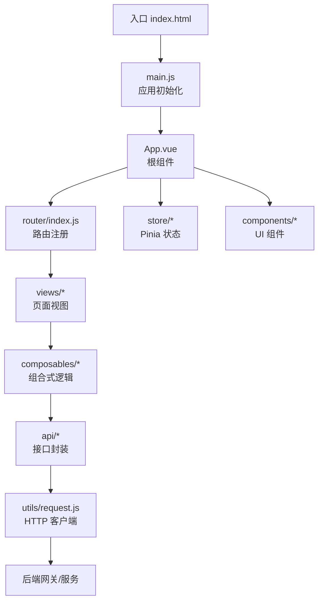
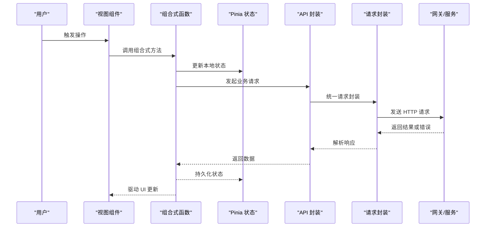
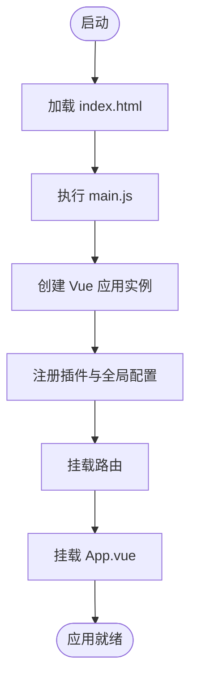
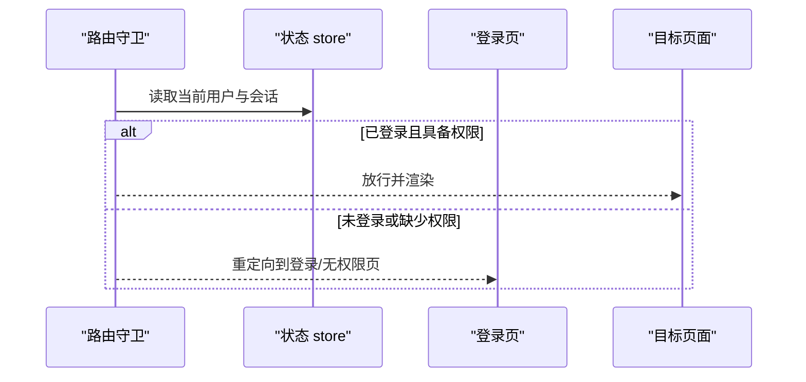
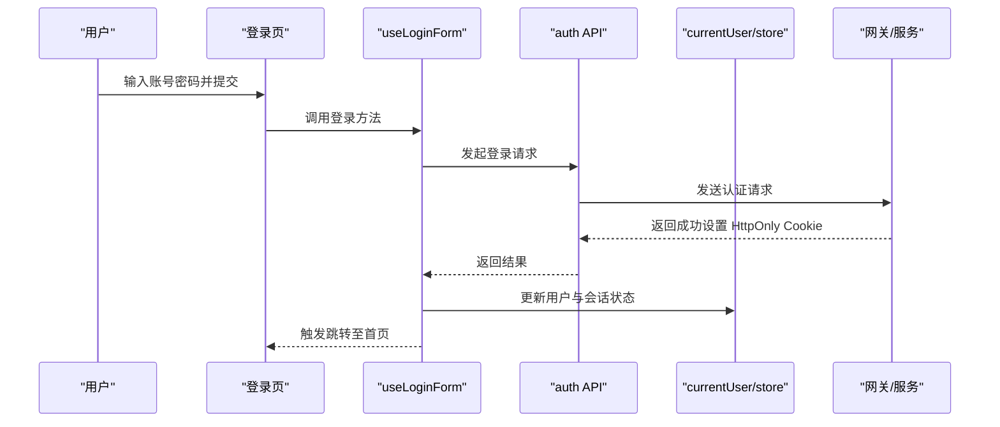
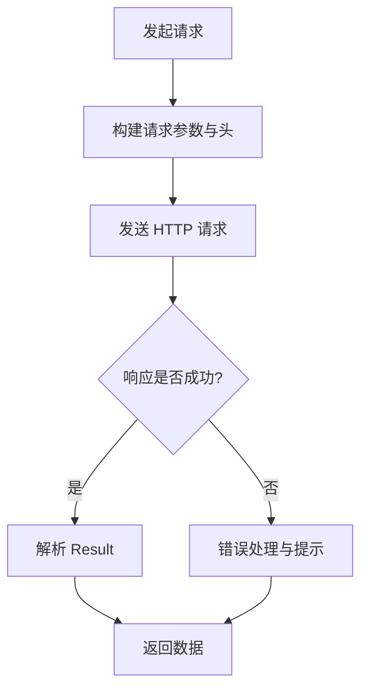
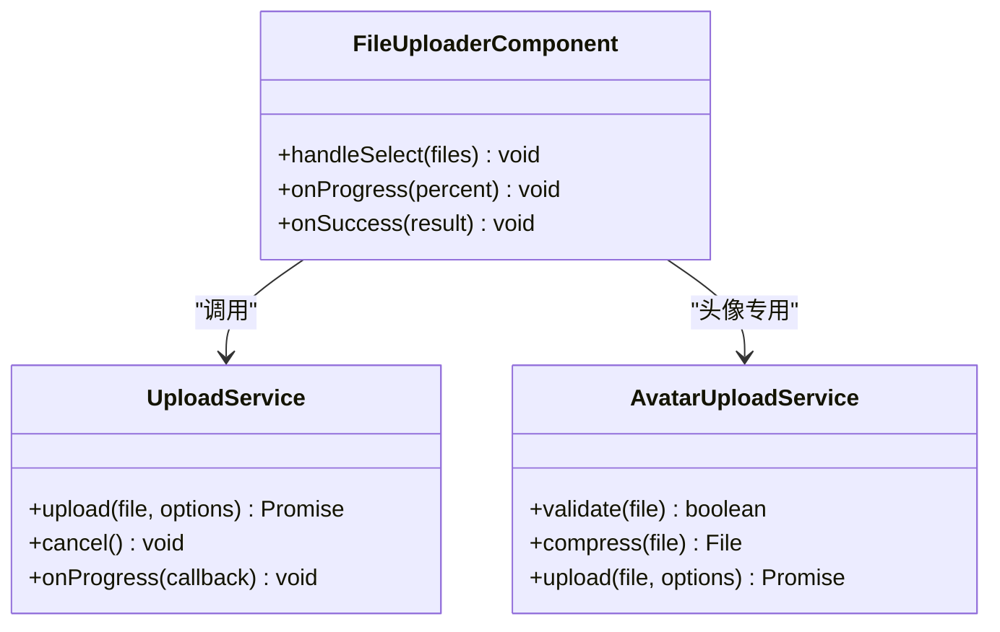
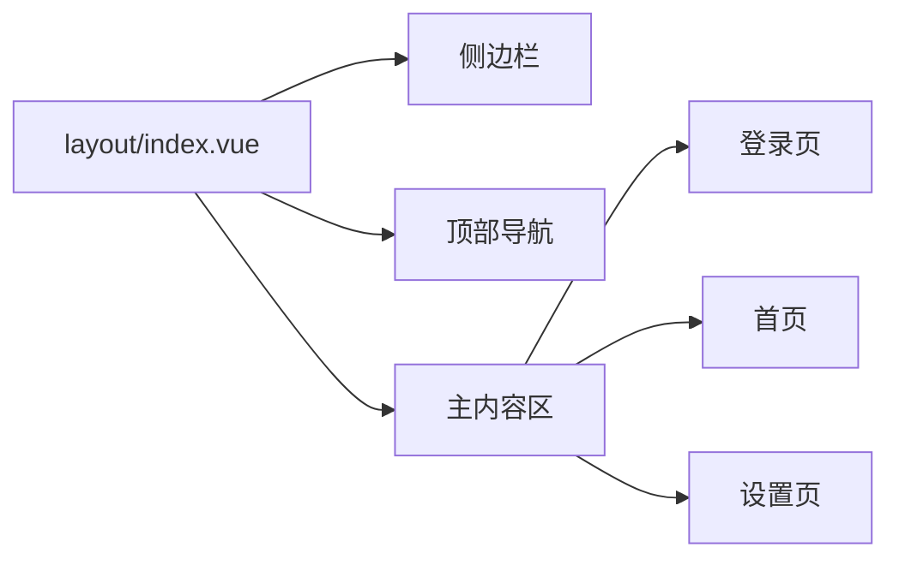
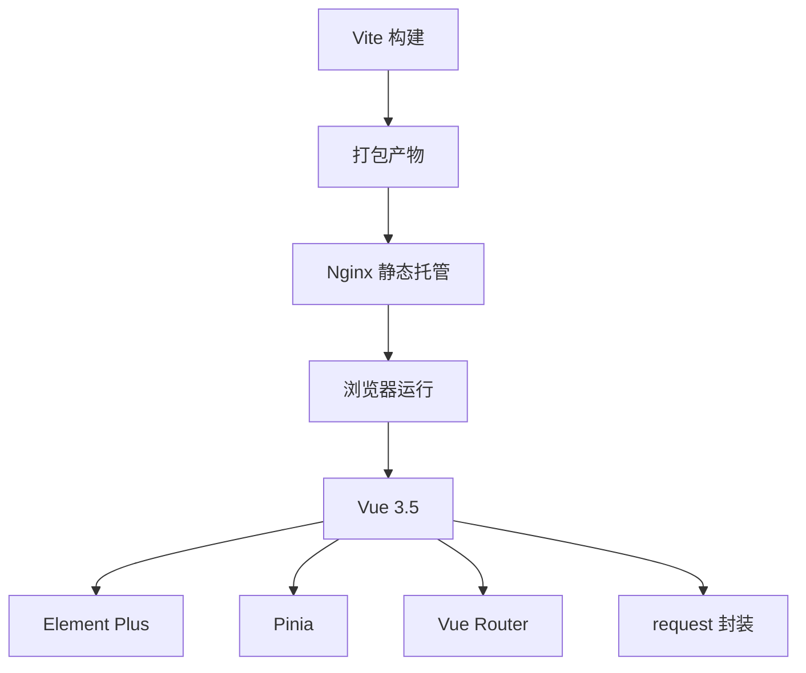

# 应用架构

<cite>
**本文引用的文件**
- [vite.config.js](file://ZXYZdatabaseFront/vite.config.js)
- [package.json](file://ZXYZdatabaseFront/package.json)
- [index.html](file://ZXYZdatabaseFront/index.html)
- [main.js](file://ZXYZdatabaseFront/src/main.js)
- [App.vue](file://ZXYZdatabaseFront/src/App.vue)
- [router/index.js](file://ZXYZdatabaseFront/src/router/index.js)
- [router/guards/permission.js](file://ZXYZdatabaseFront/src/router/guards/permission.js)
- [store/currentUser.js](file://ZXYZdatabaseFront/src/store/currentUser.js)
- [store/team.js](file://ZXYZdatabaseFront/src/store/team.js)
- [store/session.js](file://ZXYZdatabaseFront/src/store/session.js)
- [utils/request.js](file://ZXYZdatabaseFront/src/utils/request.js)
- [utils/createApiClient.js](file://ZXYZdatabaseFront/src/utils/createApiClient.js)
- [api/auth.js](file://ZXYZdatabaseFront/src/api/auth.js)
- [composables/useLoginForm.js](file://ZXYZdatabaseFront/src/composables/useLoginForm.js)
- [views/login/index.vue](file://ZXYZdatabaseFront/src/views/login/index.vue)
- [views/layout/index.vue](file://ZXYZdatabaseFront/src/views/layout/index.vue)
- [services/upload.js](file://ZXYZdatabaseFront/src/services/upload.js)
- [services/avatarUpload.js](file://ZXYZdatabaseFront/src/services/avatarUpload.js)
- [eslint.config.mjs](file://ZXYZdatabaseFront/eslint.config.mjs)
- [.prettierrc](file://ZXYZdatabaseFront/.prettierrc)
- [commitlint.config.js](file://ZXYZdatabaseFront/commitlint.config.js)
- [Dockerfile](file://ZXYZdatabaseFront/Dockerfile)
- [docker-compose.yml](file://docker-compose.yml)
- [nacos-config/zxyz-static.yml](file://nacos-config/zxyz-static.yml)
</cite>

## 目录
1. [简介](#简介)
2. [项目结构](#项目结构)
3. [核心组件](#核心组件)
4. [架构总览](#架构总览)
5. [详细组件分析](#详细组件分析)
6. [依赖分析](#依赖分析)
7. [性能考虑](#性能考虑)
8. [故障排查指南](#故障排查指南)
9. [结论](#结论)
10. [附录](#附录)

## 简介
本技术文档聚焦 ZXYZ 前端应用（Vue 3.5 + Composition API + <script setup>）的架构设计与工程化实践。内容涵盖：
- 项目结构与模块划分策略
- Vite 构建优化、Element Plus 自动导入与 TypeScript 集成思路
- 应用启动流程、全局配置管理与插件体系
- 微前端考量、代码分割与性能优化方案
- 开发环境搭建、热重载与调试技巧
- 配置文件示例与最佳实践

## 项目结构
前端采用按“能力域”划分的目录组织方式，结合 Vue 单文件组件与组合式函数（composables），将 UI、状态、API 与工具解耦。关键目录说明：
- src/api：按业务域拆分 HTTP 接口封装
- src/components：可复用 UI 组件
- src/composables：组合式逻辑封装，面向页面与组件复用
- src/store：Pinia 状态管理（用户、团队、会话等）
- src/router：路由与权限守卫
- src/views：页面级视图
- src/utils：通用工具（请求、鉴权、上传、错误处理等）
- src/services：领域服务（如上传、头像上传）
- public：静态资源（图标字体等）

图表来源
- [index.html:1-50](file://ZXYZdatabaseFront/index.html#L1-L50)
- [main.js:1-120](file://ZXYZdatabaseFront/src/main.js#L1-L120)
- [App.vue:1-120](file://ZXYZdatabaseFront/src/App.vue#L1-L120)
- [router/index.js:1-120](file://ZXYZdatabaseFront/src/router/index.js#L1-L120)

章节来源
- [index.html:1-50](file://ZXYZdatabaseFront/index.html#L1-L50)
- [main.js:1-120](file://ZXYZdatabaseFront/src/main.js#L1-L120)
- [App.vue:1-120](file://ZXYZdatabaseFront/src/App.vue#L1-L120)
- [router/index.js:1-120](file://ZXYZdatabaseFront/src/router/index.js#L1-L120)

## 核心组件
- 应用初始化与插件注册：在入口文件中完成 Vue 实例创建、插件安装（如 Element Plus）、全局样式与常量注入、路由与状态挂载。
- 路由与权限：集中式路由表配合导航守卫实现登录态校验与角色权限控制。
- 状态管理：基于 Pinia 的用户、团队、会话等状态模块，提供响应式数据与副作用方法。
- 网络层：统一请求封装，拦截器处理鉴权、错误码映射与重试策略。
- 上传服务：分片/进度/断点续传等能力通过 services 层抽象，供组件调用。

章节来源
- [main.js:1-120](file://ZXYZdatabaseFront/src/main.js#L1-L120)
- [router/index.js:1-120](file://ZXYZdatabaseFront/src/router/index.js#L1-L120)
- [store/currentUser.js:1-120](file://ZXYZdatabaseFront/src/store/currentUser.js#L1-L120)
- [store/team.js:1-120](file://ZXYZdatabaseFront/src/store/team.js#L1-L120)
- [utils/request.js:1-120](file://ZXYZdatabaseFront/src/utils/request.js#L1-L120)
- [services/upload.js:1-120](file://ZXYZdatabaseFront/src/services/upload.js#L1-L120)

## 架构总览
前端整体遵循“视图—组合式逻辑—状态—接口—网络层”的分层模式，并通过路由守卫与全局错误处理形成闭环。

图表来源
- [views/login/index.vue:1-120](file://ZXYZdatabaseFront/src/views/login/index.vue#L1-L120)
- [composables/useLoginForm.js:1-120](file://ZXYZdatabaseFront/src/composables/useLoginForm.js#L1-L120)
- [store/currentUser.js:1-120](file://ZXYZdatabaseFront/src/store/currentUser.js#L1-L120)
- [api/auth.js:1-120](file://ZXYZdatabaseFront/src/api/auth.js#L1-L120)
- [utils/request.js:1-120](file://ZXYZdatabaseFront/src/utils/request.js#L1-L120)

## 详细组件分析

### 应用启动流程
- 入口 HTML 加载 main.js
- main.js 创建 Vue 应用，注册插件（Element Plus、路由、状态等）
- 挂载路由与根组件 App.vue
- 应用初始化完成后渲染页面

图表来源
- [index.html:1-50](file://ZXYZdatabaseFront/index.html#L1-L50)
- [main.js:1-120](file://ZXYZdatabaseFront/src/main.js#L1-L120)
- [App.vue:1-120](file://ZXYZdatabaseFront/src/App.vue#L1-L120)

章节来源
- [index.html:1-50](file://ZXYZdatabaseFront/index.html#L1-L50)
- [main.js:1-120](file://ZXYZdatabaseFront/src/main.js#L1-L120)
- [App.vue:1-120](file://ZXYZdatabaseFront/src/App.vue#L1-L120)

### 路由与权限守卫
- 路由表集中定义，按需懒加载页面组件
- 导航守卫检查登录态与角色权限，未授权跳转登录或无权限页
- 支持动态路由扩展（如菜单项由后端下发）

图表来源
- [router/index.js:1-120](file://ZXYZdatabaseFront/src/router/index.js#L1-L120)
- [router/guards/permission.js:1-120](file://ZXYZdatabaseFront/src/router/guards/permission.js#L1-L120)
- [store/currentUser.js:1-120](file://ZXYZdatabaseFront/src/store/currentUser.js#L1-L120)

章节来源
- [router/index.js:1-120](file://ZXYZdatabaseFront/src/router/index.js#L1-L120)
- [router/guards/permission.js:1-120](file://ZXYZdatabaseFront/src/router/guards/permission.js#L1-L120)
- [store/currentUser.js:1-120](file://ZXYZdatabaseFront/src/store/currentUser.js#L1-L120)

### 认证与登录流程
- 登录表单使用组合式函数封装，提交后调用 auth API
- 成功后写入 currentUser 与 session 状态
- 路由守卫确保后续访问受保护资源时携带有效会话

图表来源
- [views/login/index.vue:1-120](file://ZXYZdatabaseFront/src/views/login/index.vue#L1-L120)
- [composables/useLoginForm.js:1-120](file://ZXYZdatabaseFront/src/composables/useLoginForm.js#L1-L120)
- [api/auth.js:1-120](file://ZXYZdatabaseFront/src/api/auth.js#L1-L120)
- [store/currentUser.js:1-120](file://ZXYZdatabaseFront/src/store/currentUser.js#L1-L120)

章节来源
- [views/login/index.vue:1-120](file://ZXYZdatabaseFront/src/views/login/index.vue#L1-L120)
- [composables/useLoginForm.js:1-120](file://ZXYZdatabaseFront/src/composables/useLoginForm.js#L1-L120)
- [api/auth.js:1-120](file://ZXYZdatabaseFront/src/api/auth.js#L1-L120)
- [store/currentUser.js:1-120](file://ZXYZdatabaseFront/src/store/currentUser.js#L1-L120)

### 网络层与错误处理
- 统一 request 封装，处理基础 URL、超时、重试、错误码映射
- 对后端统一 Result<T> 结构进行解析，code=1 表示成功
- 全局错误提示与日志记录，便于定位问题

图表来源
- [utils/request.js:1-120](file://ZXYZdatabaseFront/src/utils/request.js#L1-L120)
- [utils/createApiClient.js:1-120](file://ZXYZdatabaseFront/src/utils/createApiClient.js#L1-L120)

章节来源
- [utils/request.js:1-120](file://ZXYZdatabaseFront/src/utils/request.js#L1-L120)
- [utils/createApiClient.js:1-120](file://ZXYZdatabaseFront/src/utils/createApiClient.js#L1-L120)

### 上传与头像上传服务
- 上传服务封装分片、进度回调、失败重试与并发控制
- 头像上传针对图片类型、大小与压缩进行前置校验
- 组件层通过组合式函数调用上传服务，反馈进度与结果

图表来源
- [services/upload.js:1-120](file://ZXYZdatabaseFront/src/services/upload.js#L1-L120)
- [services/avatarUpload.js:1-120](file://ZXYZdatabaseFront/src/services/avatarUpload.js#L1-L120)

章节来源
- [services/upload.js:1-120](file://ZXYZdatabaseFront/src/services/upload.js#L1-L120)
- [services/avatarUpload.js:1-120](file://ZXYZdatabaseFront/src/services/avatarUpload.js#L1-L120)

### 布局与页面组织
- 布局组件负责侧边栏、顶部导航与主内容区
- 页面组件按功能域拆分，保持单一职责
- 组合式函数承载跨页面复用的交互逻辑

图表来源
- [views/layout/index.vue:1-120](file://ZXYZdatabaseFront/src/views/layout/index.vue#L1-L120)
- [views/login/index.vue:1-120](file://ZXYZdatabaseFront/src/views/login/index.vue#L1-L120)

章节来源
- [views/layout/index.vue:1-120](file://ZXYZdatabaseFront/src/views/layout/index.vue#L1-L120)
- [views/login/index.vue:1-120](file://ZXYZdatabaseFront/src/views/login/index.vue#L1-L120)

## 依赖分析
- 构建工具：Vite，提供快速冷启动与热重载
- UI 库：Element Plus，启用自动导入减少样板代码
- 状态管理：Pinia，轻量且与 Composition API 深度集成
- 网络层：自定义 request 封装，统一错误与鉴权
- 工程化：ESLint、Prettier、Commitlint 保障代码质量与一致性

图表来源
- [package.json:1-120](file://ZXYZdatabaseFront/package.json#L1-L120)
- [vite.config.js:1-120](file://ZXYZdatabaseFront/vite.config.js#L1-L120)
- [eslint.config.mjs:1-120](file://ZXYZdatabaseFront/eslint.config.mjs#L1-L120)
- [.prettierrc:1-120](file://ZXYZdatabaseFront/.prettierrc#L1-L120)
- [commitlint.config.js:1-120](file://ZXYZdatabaseFront/commitlint.config.js#L1-L120)

章节来源
- [package.json:1-120](file://ZXYZdatabaseFront/package.json#L1-L120)
- [vite.config.js:1-120](file://ZXYZdatabaseFront/vite.config.js#L1-L120)
- [eslint.config.mjs:1-120](file://ZXYZdatabaseFront/eslint.config.mjs#L1-L120)
- [.prettierrc:1-120](file://ZXYZdatabaseFront/.prettierrc#L1-L120)
- [commitlint.config.js:1-120](file://ZXYZdatabaseFront/commitlint.config.js#L1-L120)

## 性能考虑
- 代码分割：路由级懒加载，按需引入组件与第三方库
- 资源优化：静态资源缓存策略、图片压缩与 CDN 加速
- 构建优化：开启生产模式、Tree Shaking、分包策略
- 运行时优化：虚拟滚动长列表、防抖节流、Web Worker 大任务
- 监控与诊断：错误上报、性能埋点与日志采集

[本节为通用指导，不直接分析具体文件]

## 故障排查指南
- 网络请求失败：检查 request 拦截器错误码映射、网关鉴权与跨域配置
- 登录态异常：确认 HttpOnly Cookie 与 Session 同步、路由守卫逻辑
- 上传失败：查看分片策略、并发限制与重试次数；核对服务端上传端点
- 构建报错：检查 ESLint/Prettier 规则、依赖版本兼容性与环境变量
- 线上问题：结合 Nginx 访问日志、应用错误日志与链路追踪

章节来源
- [utils/request.js:1-120](file://ZXYZdatabaseFront/src/utils/request.js#L1-L120)
- [router/guards/permission.js:1-120](file://ZXYZdatabaseFront/src/router/guards/permission.js#L1-L120)
- [services/upload.js:1-120](file://ZXYZdatabaseFront/src/services/upload.js#L1-L120)
- [eslint.config.mjs:1-120](file://ZXYZdatabaseFront/eslint.config.mjs#L1-L120)

## 结论
ZXYZ 前端以 Vue 3.5 Composition API 为核心，结合 Vite、Element Plus、Pinia 与自研网络层，构建了高内聚、低耦合的前端架构。通过模块化目录组织、组合式逻辑复用与严格的工程化规范，实现了良好的可维护性与可扩展性。在生产环境中，借助容器化部署与 CI/CD 流水线，保障了交付质量与发布效率。

[本节为总结性内容，不直接分析具体文件]

## 附录

### 开发环境搭建
- 安装 Node 与包管理器，拉取依赖
- 配置本地环境变量（如 API 地址、调试开关）
- 启动开发服务器，启用热重载与调试工具

章节来源
- [package.json:1-120](file://ZXYZdatabaseFront/package.json#L1-L120)
- [vite.config.js:1-120](file://ZXYZdatabaseFront/vite.config.js#L1-L120)

### Vite 构建配置优化要点
- 启用生产模式与 Source Map（可选）
- 配置别名与外部依赖排除
- 分包策略与预加载优化
- 静态资源路径与代理配置

章节来源
- [vite.config.js:1-120](file://ZXYZdatabaseFront/vite.config.js#L1-L120)

### Element Plus 自动导入与 TypeScript 集成建议
- 使用 unplugin-vue-components 与 unplugin-auto-import 实现自动导入
- 配置 TS 类型声明与路径别名
- 按需引入避免体积膨胀

章节来源
- [package.json:1-120](file://ZXYZdatabaseFront/package.json#L1-L120)
- [vite.config.js:1-120](file://ZXYZdatabaseFront/vite.config.js#L1-L120)

### 全局配置管理与插件系统
- 通过环境变量与配置文件管理多环境差异
- 插件化注册（如日志、埋点、国际化）
- 运行时特性开关与灰度发布

章节来源
- [nacos-config/zxyz-static.yml:1-120](file://nacos-config/zxyz-static.yml#L1-L120)
- [main.js:1-120](file://ZXYZdatabaseFront/src/main.js#L1-L120)

### 微前端架构考虑
- 子应用独立构建与部署，通过路由与事件总线通信
- 共享依赖与样式隔离，避免冲突
- 沙箱机制与生命周期管理

[本节为概念性内容，不直接分析具体文件]

### 代码分割策略与性能优化
- 路由级与组件级懒加载
- 第三方库按需引入与 Tree Shaking
- 资源预加载与缓存策略

[本节为通用指导，不直接分析具体文件]

### 调试技巧
- 使用浏览器开发者工具与 Vue Devtools
- 打印关键状态与网络请求
- 模拟错误场景与边界条件测试

[本节为通用指导，不直接分析具体文件]

### 部署与容器化
- 使用 Docker 镜像构建与 Nginx 静态托管
- Compose 编排前后端与基础设施
- CI/CD 自动化构建与发布

章节来源
- [Dockerfile:1-120](file://ZXYZdatabaseFront/Dockerfile#L1-L120)
- [docker-compose.yml:1-120](file://docker-compose.yml#L1-L120)