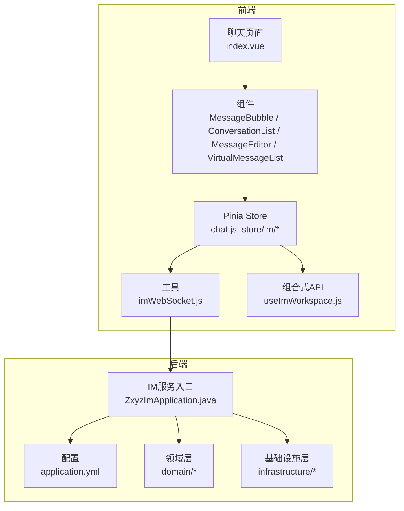
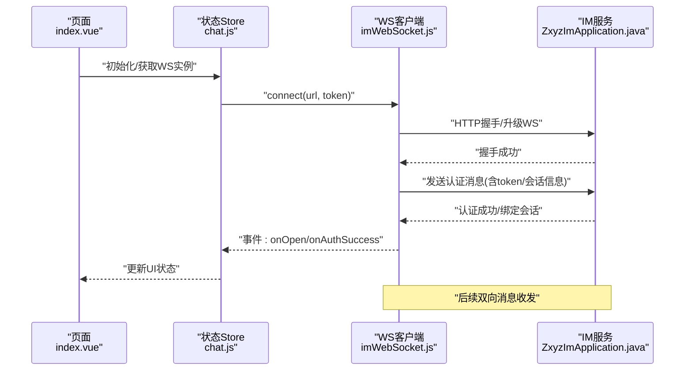
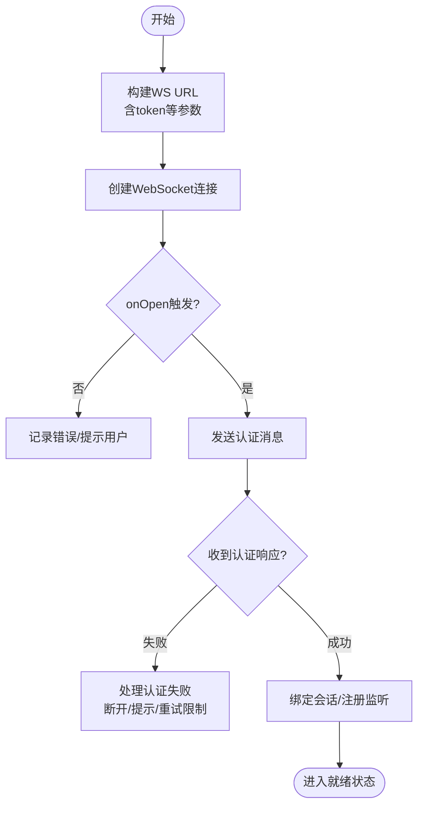
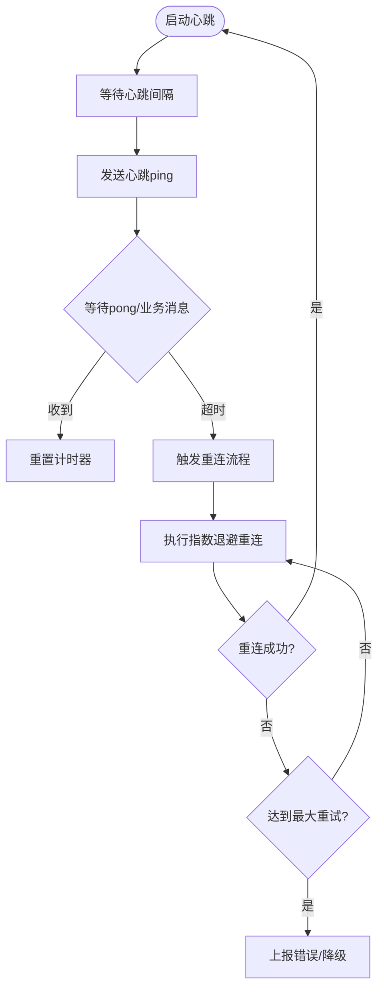
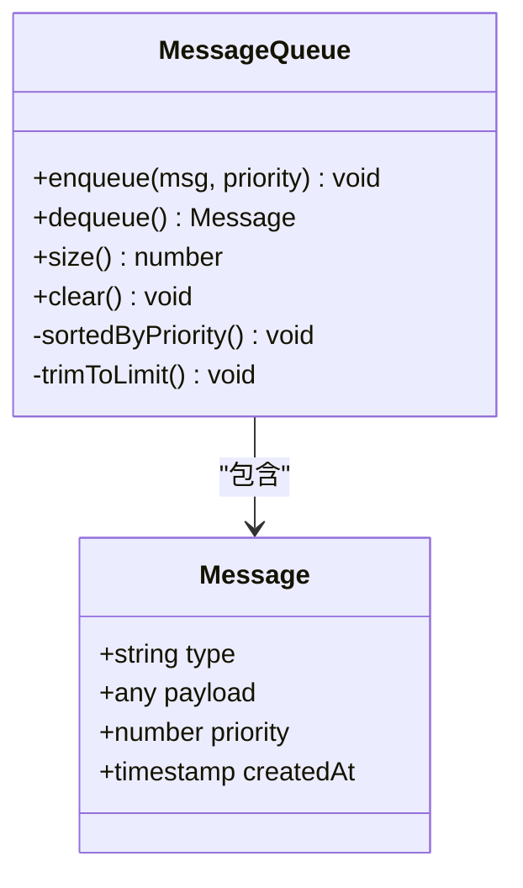
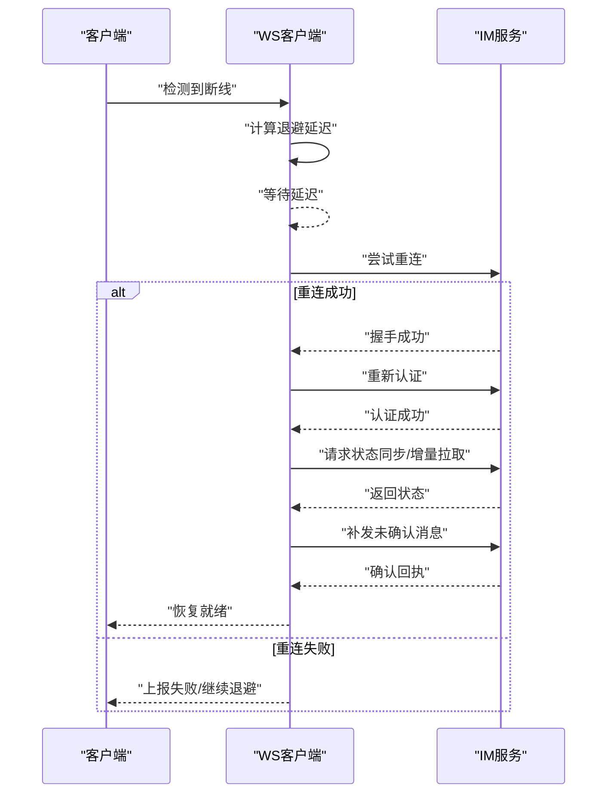
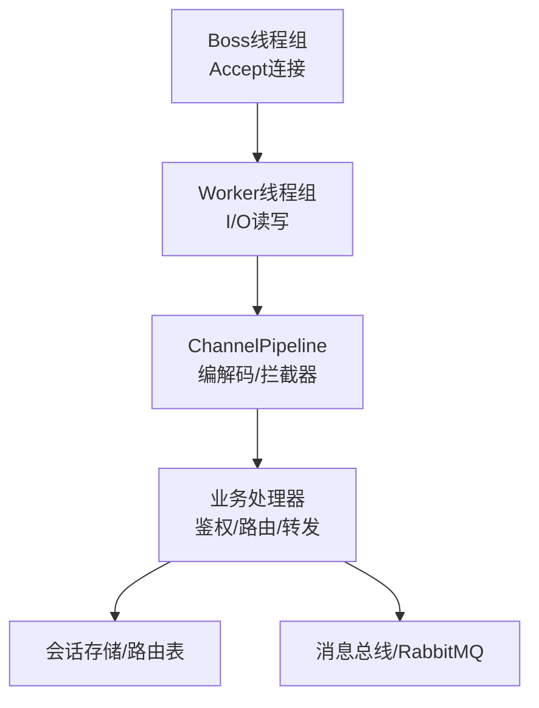
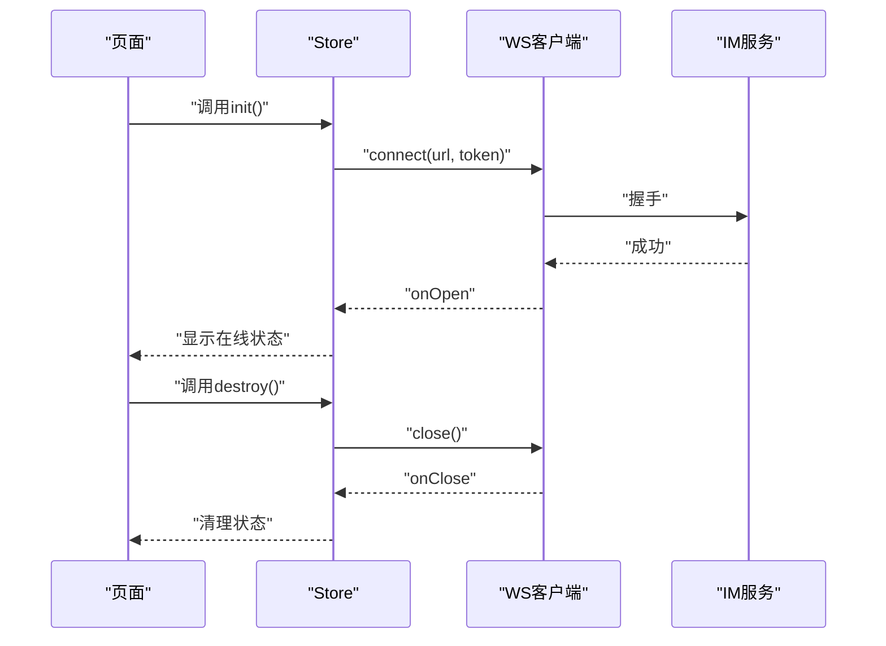
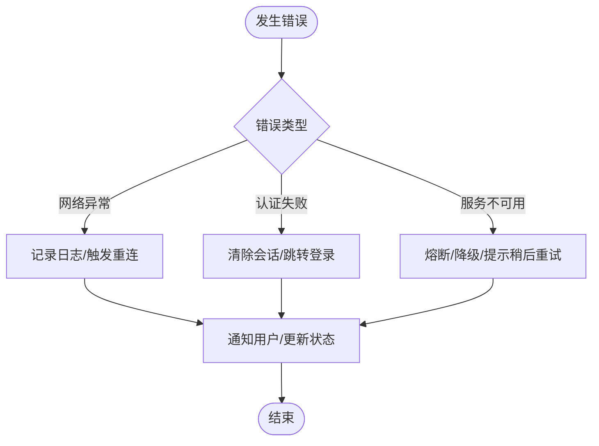
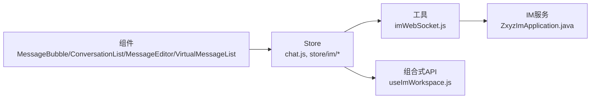

# WebSocket通信管理

<cite>
**本文引用的文件**   
- [ZxyzImApplication.java](file://ZXYZdatabaseBack/zxyz-im-service/src/main/java/uno/acloud/im/ZxyzImApplication.java)
- [application.yml](file://ZXYZdatabaseBack/zxyz-im-service/src/main/resources/application.yml)
- [imWebSocket.js](file://ZXYZdatabaseFront/src/utils/imWebSocket.js)
- [chat.js](file://ZXYZdatabaseFront/src/store/chat.js)
- [realtimeDomain.js](file://ZXYZdatabaseFront/src/store/im/realtimeDomain.js)
- [messageDomain.js](file://ZXYZdatabaseFront/src/store/im/messageDomain.js)
- [conversationDomain.js](file://ZXYZdatabaseFront/src/store/im/conversationDomain.js)
- [notificationDomain.js](file://ZXYZdatabaseFront/src/store/im/notificationDomain.js)
- [teamDomain.js](file://ZXYZdatabaseFront/src/store/im/teamDomain.js)
- [permissionDomain.js](file://ZXYZdatabaseFront/src/store/im/permissionDomain.js)
- [useImWorkspace.js](file://ZXYZdatabaseFront/src/composables/useImWorkspace.js)
- [MessageBubble.vue](file://ZXYZdatabaseFront/src/views/chat/components/MessageBubble.vue)
- [ConversationList.vue](file://ZXYZdatabaseFront/src/views/chat/components/ConversationList.vue)
- [MessageEditor.vue](file://ZXYZdatabaseFront/src/views/chat/components/MessageEditor.vue)
- [VirtualMessageList.vue](file://ZXYZdatabaseFront/src/views/chat/components/VirtualMessageList.vue)
- [index.vue](file://ZXYZdatabaseFront/src/views/chat/index.vue)
- [api-contract.md](file://docs/api-contract.md)
- [architecture.md](file://docs/architecture.md)
</cite>

## 目录
1. [简介](#简介)
2. [项目结构](#项目结构)
3. [核心组件](#核心组件)
4. [架构总览](#架构总览)
5. [详细组件分析](#详细组件分析)
6. [依赖分析](#依赖分析)
7. [性能考虑](#性能考虑)
8. [故障排查指南](#故障排查指南)
9. [结论](#结论)
10. [附录](#附录)

## 简介
本文件面向 ZXYZ 即时通讯模块的 WebSocket 通信管理，聚焦以下目标：
- 连接建立流程：连接初始化、认证验证与会话绑定
- 心跳检测机制：心跳间隔配置、超时处理与自动重连策略
- 消息队列管理：消息缓冲、优先级排序与内存控制
- 断线重连逻辑：指数退避算法、连接状态同步与消息补偿
- Netty 服务器实现：线程模型、缓冲区管理与性能调优（概念性说明）
- 完整连接管理示例：如何正确初始化、维护与销毁 WebSocket 连接
- 错误处理策略：网络异常、认证失败与服务不可用场景的处理方案

## 项目结构
IM 服务采用 DDD 分层风格（interfaces → application → domain → infrastructure），前端基于 Vue 3 + Pinia + Composables。WebSocket 相关能力主要分布在：
- 后端 IM 服务：应用入口、配置与领域/基础设施层（具体实现以模块内包组织）
- 前端工具与状态：imWebSocket.js 封装连接生命周期；store/im/* 管理实时数据；composables 暴露高层 API；视图组件消费状态

图表来源
- [ZxyzImApplication.java](file://ZXYZdatabaseBack/zxyz-im-service/src/main/java/uno/acloud/im/ZxyzImApplication.java)
- [application.yml](file://ZXYZdatabaseBack/zxyz-im-service/src/main/resources/application.yml)
- [imWebSocket.js](file://ZXYZdatabaseFront/src/utils/imWebSocket.js)
- [chat.js](file://ZXYZdatabaseFront/src/store/chat.js)
- [realtimeDomain.js](file://ZXYZdatabaseFront/src/store/im/realtimeDomain.js)
- [messageDomain.js](file://ZXYZdatabaseFront/src/store/im/messageDomain.js)
- [conversationDomain.js](file://ZXYZdatabaseFront/src/store/im/conversationDomain.js)
- [notificationDomain.js](file://ZXYZdatabaseFront/src/store/im/notificationDomain.js)
- [teamDomain.js](file://ZXYZdatabaseFront/src/store/im/teamDomain.js)
- [permissionDomain.js](file://ZXYZdatabaseFront/src/store/im/permissionDomain.js)
- [useImWorkspace.js](file://ZXYZdatabaseFront/src/composables/useImWorkspace.js)
- [MessageBubble.vue](file://ZXYZdatabaseFront/src/views/chat/components/MessageBubble.vue)
- [ConversationList.vue](file://ZXYZdatabaseFront/src/views/chat/components/ConversationList.vue)
- [MessageEditor.vue](file://ZXYZdatabaseFront/src/views/chat/components/MessageEditor.vue)
- [VirtualMessageList.vue](file://ZXYZdatabaseFront/src/views/chat/components/VirtualMessageList.vue)
- [index.vue](file://ZXYZdatabaseFront/src/views/chat/index.vue)

章节来源
- [ZxyzImApplication.java](file://ZXYZdatabaseBack/zxyz-im-service/src/main/java/uno/acloud/im/ZxyzImApplication.java)
- [application.yml](file://ZXYZdatabaseBack/zxyz-im-service/src/main/resources/application.yml)
- [imWebSocket.js](file://ZXYZdatabaseFront/src/utils/imWebSocket.js)
- [chat.js](file://ZXYZdatabaseFront/src/store/chat.js)

## 核心组件
- 前端 WebSocket 客户端封装：负责连接生命周期、心跳、重连、消息编解码与事件分发
- 前端状态域：集中管理会话、消息、通知、团队与权限等实时数据
- 前端组合式 API：为页面与组件提供统一的 WS 操作接口
- 后端 IM 服务：承载 WebSocket 接入、鉴权与会话路由（DDD 分层）

章节来源
- [imWebSocket.js](file://ZXYZdatabaseFront/src/utils/imWebSocket.js)
- [chat.js](file://ZXYZdatabaseFront/src/store/chat.js)
- [realtimeDomain.js](file://ZXYZdatabaseFront/src/store/im/realtimeDomain.js)
- [messageDomain.js](file://ZXYZdatabaseFront/src/store/im/messageDomain.js)
- [conversationDomain.js](file://ZXYZdatabaseFront/src/store/im/conversationDomain.js)
- [notificationDomain.js](file://ZXYZdatabaseFront/src/store/im/notificationDomain.js)
- [teamDomain.js](file://ZXYZdatabaseFront/src/store/im/teamDomain.js)
- [permissionDomain.js](file://ZXYZdatabaseFront/src/store/im/permissionDomain.js)
- [useImWorkspace.js](file://ZXYZdatabaseFront/src/composables/useImWorkspace.js)
- [ZxyzImApplication.java](file://ZXYZdatabaseBack/zxyz-im-service/src/main/java/uno/acloud/im/ZxyzImApplication.java)

## 架构总览
整体交互遵循“前端 WS 客户端 ↔ IM 服务”的双向通道，结合 Pinia 状态域进行数据驱动渲染。

图表来源
- [imWebSocket.js](file://ZXYZdatabaseFront/src/utils/imWebSocket.js)
- [chat.js](file://ZXYZdatabaseFront/src/store/chat.js)
- [ZxyzImApplication.java](file://ZXYZdatabaseBack/zxyz-im-service/src/main/java/uno/acloud/im/ZxyzImApplication.java)

## 详细组件分析

### 连接建立流程（初始化、认证、会话绑定）
- 初始化：从配置或环境变量构建 WS URL，携带必要查询参数（如 token）
- 握手与升级：浏览器原生 WebSocket 发起连接，服务端完成协议升级
- 认证：首次业务消息携带鉴权信息，服务端校验并返回结果
- 会话绑定：认证成功后，服务端将连接与用户/会话上下文绑定，开始路由消息

章节来源
- [imWebSocket.js](file://ZXYZdatabaseFront/src/utils/imWebSocket.js)
- [chat.js](file://ZXYZdatabaseFront/src/store/chat.js)
- [api-contract.md](file://docs/api-contract.md)

### 心跳检测机制（间隔、超时、自动重连）
- 心跳间隔：由配置项控制，避免频繁打点影响性能
- 超时处理：未收到对端心跳或无业务消息时判定超时
- 自动重连：触发重连前清理旧连接，重置状态机，必要时重新认证

章节来源
- [imWebSocket.js](file://ZXYZdatabaseFront/src/utils/imWebSocket.js)
- [application.yml](file://ZXYZdatabaseBack/zxyz-im-service/src/main/resources/application.yml)

### 消息队列管理（缓冲、优先级、内存控制）
- 缓冲策略：离线或拥塞时缓存待发消息，按类型/优先级排序
- 优先级：系统消息 > 重要指令 > 普通消息 > 低优先级扩展
- 内存控制：设置上限阈值，超限后丢弃低优先级或落盘（视实现）

图表来源
- [imWebSocket.js](file://ZXYZdatabaseFront/src/utils/imWebSocket.js)
- [messageDomain.js](file://ZXYZdatabaseFront/src/store/im/messageDomain.js)

章节来源
- [imWebSocket.js](file://ZXYZdatabaseFront/src/utils/imWebSocket.js)
- [messageDomain.js](file://ZXYZdatabaseFront/src/store/im/messageDomain.js)

### 断线重连逻辑（指数退避、状态同步、消息补偿）
- 指数退避：初始延迟 × 2^attempt，限制最大延迟与最大重试次数
- 状态同步：重连成功后拉取增量/全量状态，确保一致性
- 消息补偿：重连后补发未确认消息，去重保证幂等

图表来源
- [imWebSocket.js](file://ZXYZdatabaseFront/src/utils/imWebSocket.js)
- [chat.js](file://ZXYZdatabaseFront/src/store/chat.js)

章节来源
- [imWebSocket.js](file://ZXYZdatabaseFront/src/utils/imWebSocket.js)
- [chat.js](file://ZXYZdatabaseFront/src/store/chat.js)

### Netty 服务器实现（线程模型、缓冲区、性能调优）
- 线程模型：Boss 线程组处理接受连接，Worker 线程组处理 I/O 读写
- 缓冲区：合理设置堆外/堆内缓冲区大小，启用零拷贝减少 GC
- 性能调优：背压控制、批量写、Nagle 关闭、连接数与线程池上限

图表来源
- [ZxyzImApplication.java](file://ZXYZdatabaseBack/zxyz-im-service/src/main/java/uno/acloud/im/ZxyzImApplication.java)
- [architecture.md](file://docs/architecture.md)

章节来源
- [ZxyzImApplication.java](file://ZXYZdatabaseBack/zxyz-im-service/src/main/java/uno/acloud/im/ZxyzImApplication.java)
- [architecture.md](file://docs/architecture.md)

### 完整连接管理示例（初始化、维护、销毁）
- 初始化：在应用启动或用户登录后创建 WS 实例，传入 URL 与 token
- 维护：订阅事件（open/auth success/message/error），更新状态域
- 销毁：页面卸载或用户登出时主动关闭连接，清理定时器与监听器

图表来源
- [imWebSocket.js](file://ZXYZdatabaseFront/src/utils/imWebSocket.js)
- [chat.js](file://ZXYZdatabaseFront/src/store/chat.js)
- [useImWorkspace.js](file://ZXYZdatabaseFront/src/composables/useImWorkspace.js)

章节来源
- [imWebSocket.js](file://ZXYZdatabaseFront/src/utils/imWebSocket.js)
- [chat.js](file://ZXYZdatabaseFront/src/store/chat.js)
- [useImWorkspace.js](file://ZXYZdatabaseFront/src/composables/useImWorkspace.js)

### 错误处理策略（网络异常、认证失败、服务不可用）
- 网络异常：捕获连接失败/中断，触发重连与降级提示
- 认证失败：拒绝访问，提示重新登录，清空敏感状态
- 服务不可用：熔断/短路，返回友好错误码与重试建议

图表来源
- [imWebSocket.js](file://ZXYZdatabaseFront/src/utils/imWebSocket.js)
- [chat.js](file://ZXYZdatabaseFront/src/store/chat.js)

章节来源
- [imWebSocket.js](file://ZXYZdatabaseFront/src/utils/imWebSocket.js)
- [chat.js](file://ZXYZdatabaseFront/src/store/chat.js)

## 依赖分析
- 前端依赖：Vue 组件依赖 Store，Store 依赖 imWebSocket 工具；Composables 封装 WS 使用模式
- 后端依赖：IM 服务入口依赖配置与领域/基础设施层；通过内部服务客户端与 RabbitMQ 协作

图表来源
- [MessageBubble.vue](file://ZXYZdatabaseFront/src/views/chat/components/MessageBubble.vue)
- [ConversationList.vue](file://ZXYZdatabaseFront/src/views/chat/components/ConversationList.vue)
- [MessageEditor.vue](file://ZXYZdatabaseFront/src/views/chat/components/MessageEditor.vue)
- [VirtualMessageList.vue](file://ZXYZdatabaseFront/src/views/chat/components/VirtualMessageList.vue)
- [chat.js](file://ZXYZdatabaseFront/src/store/chat.js)
- [realtimeDomain.js](file://ZXYZdatabaseFront/src/store/im/realtimeDomain.js)
- [messageDomain.js](file://ZXYZdatabaseFront/src/store/im/messageDomain.js)
- [conversationDomain.js](file://ZXYZdatabaseFront/src/store/im/conversationDomain.js)
- [notificationDomain.js](file://ZXYZdatabaseFront/src/store/im/notificationDomain.js)
- [teamDomain.js](file://ZXYZdatabaseFront/src/store/im/teamDomain.js)
- [permissionDomain.js](file://ZXYZdatabaseFront/src/store/im/permissionDomain.js)
- [useImWorkspace.js](file://ZXYZdatabaseFront/src/composables/useImWorkspace.js)
- [imWebSocket.js](file://ZXYZdatabaseFront/src/utils/imWebSocket.js)
- [ZxyzImApplication.java](file://ZXYZdatabaseBack/zxyz-im-service/src/main/java/uno/acloud/im/ZxyzImApplication.java)

章节来源
- [chat.js](file://ZXYZdatabaseFront/src/store/chat.js)
- [imWebSocket.js](file://ZXYZdatabaseFront/src/utils/imWebSocket.js)
- [ZxyzImApplication.java](file://ZXYZdatabaseBack/zxyz-im-service/src/main/java/uno/acloud/im/ZxyzImApplication.java)

## 性能考虑
- 前端
  - 心跳间隔与超时需平衡实时性与资源消耗
  - 消息队列设置合理上限，避免内存暴涨
  - 虚拟滚动列表优化长消息列表渲染
- 后端
  - 合理配置 Netty 线程池与缓冲区
  - 使用批处理与零拷贝降低 GC 压力
  - 连接限流与背压保护，防止雪崩

[本节为通用指导，不直接分析具体文件]

## 故障排查指南
- 连接问题
  - 检查 WS URL 与 token 是否正确
  - 查看浏览器控制台与后端日志，定位握手失败原因
- 认证失败
  - 确认 token 有效期与刷新策略
  - 检查服务端鉴权中间件与会话绑定逻辑
- 心跳超时
  - 调整心跳间隔与超时阈值
  - 检查网络质量与代理/防火墙策略
- 消息丢失
  - 检查消息队列上限与丢弃策略
  - 核对重连后的消息补偿与去重逻辑

章节来源
- [imWebSocket.js](file://ZXYZdatabaseFront/src/utils/imWebSocket.js)
- [chat.js](file://ZXYZdatabaseFront/src/store/chat.js)
- [application.yml](file://ZXYZdatabaseBack/zxyz-im-service/src/main/resources/application.yml)

## 结论
通过对前端 WS 客户端、状态域与后端 IM 服务的系统性分析，明确了连接建立、心跳检测、消息队列、断线重连与错误处理的关键路径。建议在配置层面细化心跳与重连参数，在前端加强状态一致性与用户体验反馈，在后端完善连接治理与性能监控，以实现稳定高效的即时通讯体验。

[本节为总结性内容，不直接分析具体文件]

## 附录
- 相关文档
  - [API 契约](file://docs/api-contract.md)
  - [架构说明](file://docs/architecture.md)
- 关键文件索引
  - 前端工具与状态：imWebSocket.js、chat.js、store/im/*、useImWorkspace.js
  - 后端入口与配置：ZxyzImApplication.java、application.yml

[本节为索引性内容，不直接分析具体文件]