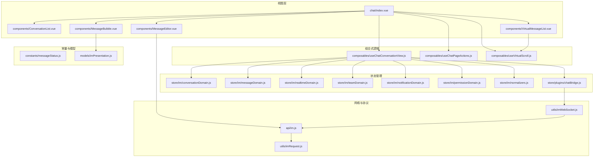
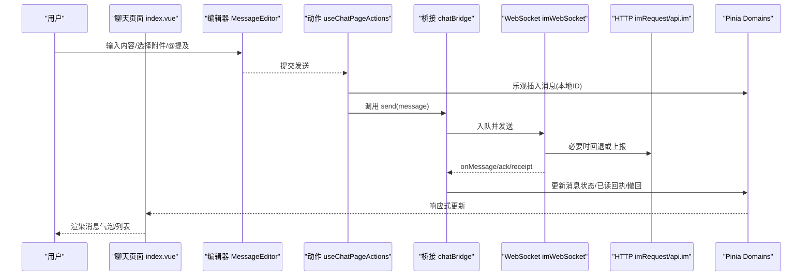
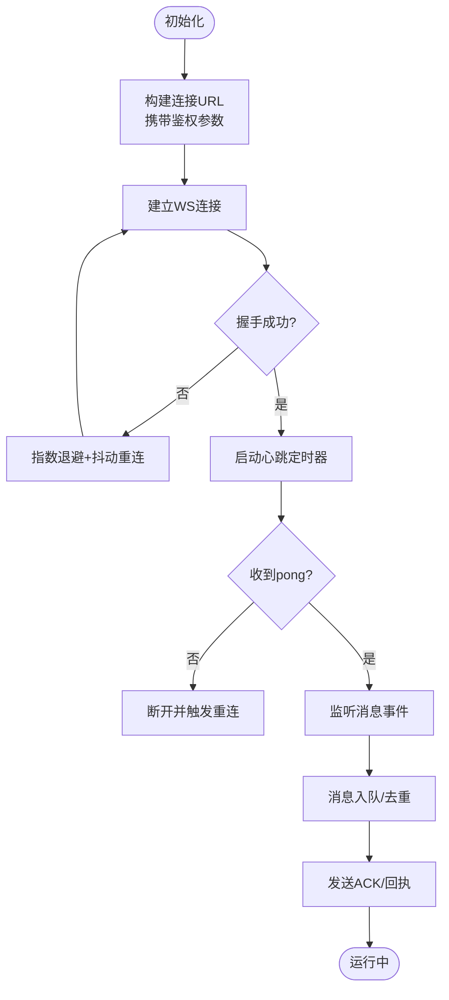
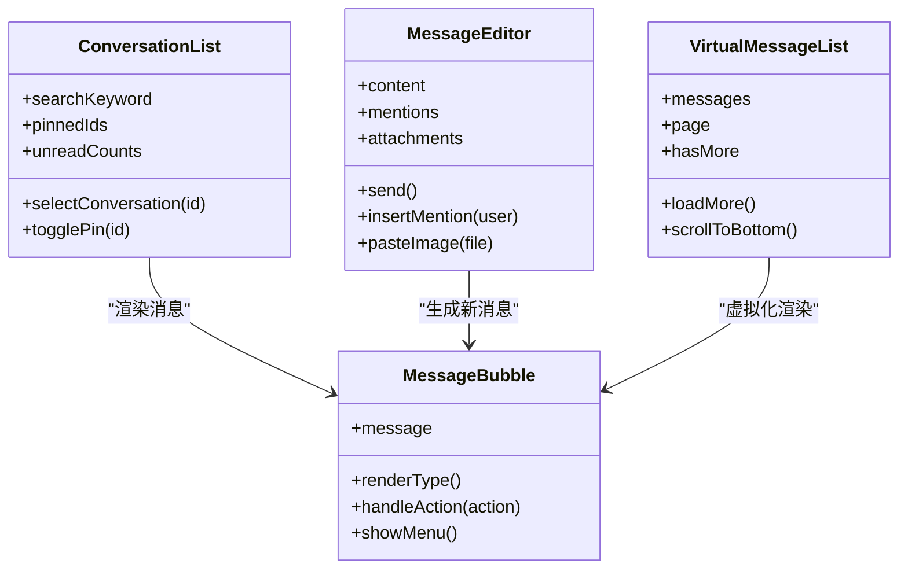
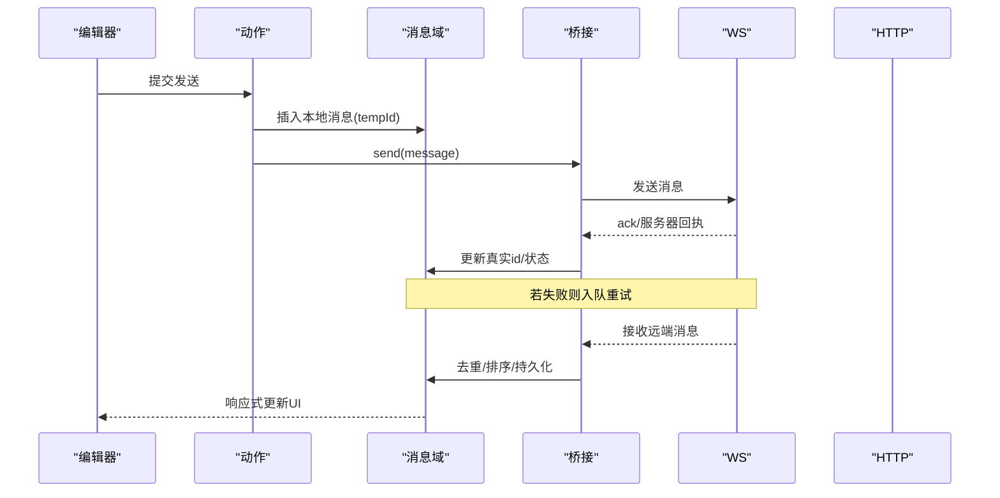
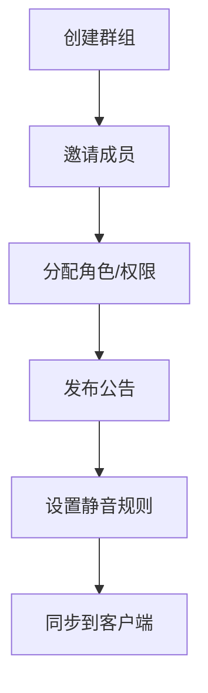
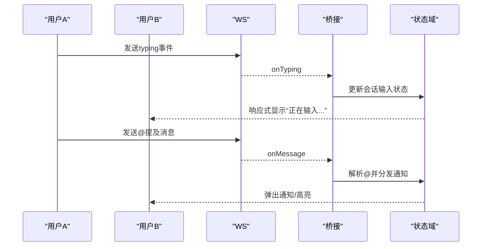
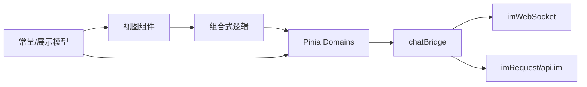

# 即时通讯模块

<cite>
**本文引用的文件**   
- [ZXYZdatabaseFront/src/views/chat/index.vue](file://ZXYZdatabaseFront/src/views/chat/index.vue)
- [ZXYZdatabaseFront/src/views/chat/components/ConversationList.vue](file://ZXYZdatabaseFront/src/views/chat/components/ConversationList.vue)
- [ZXYZdatabaseFront/src/views/chat/components/MessageBubble.vue](file://ZXYZdatabaseFront/src/views/chat/components/MessageBubble.vue)
- [ZXYZdatabaseFront/src/views/chat/components/MessageEditor.vue](file://ZXYZdatabaseFront/src/views/chat/components/MessageEditor.vue)
- [ZXYZdatabaseFront/src/views/chat/components/VirtualMessageList.vue](file://ZXYZdatabaseFront/src/views/chat/components/VirtualMessageList.vue)
- [ZXYZdatabaseFront/src/views/chat/composables/useChatConversationView.js](file://ZXYZdatabaseFront/src/views/chat/composables/useChatConversationView.js)
- [ZXYZdatabaseFront/src/views/chat/composables/useChatPageActions.js](file://ZXYZdatabaseFront/src/views/chat/composables/useChatPageActions.js)
- [ZXYZdatabaseFront/src/views/chat/composables/useVirtualScroll.js](file://ZXYZdatabaseFront/src/views/chat/composables/useVirtualScroll.js)
- [ZXYZdatabaseFront/src/store/im/conversationDomain.js](file://ZXYZdatabaseFront/src/store/im/conversationDomain.js)
- [ZXYZdatabaseFront/src/store/im/messageDomain.js](file://ZXYZdatabaseFront/src/store/im/messageDomain.js)
- [ZXYZdatabaseFront/src/store/im/realtimeDomain.js](file://ZXYZdatabaseFront/src/store/im/realtimeDomain.js)
- [ZXYZdatabaseFront/src/store/im/teamDomain.js](file://ZXYZdatabaseFront/src/store/im/teamDomain.js)
- [ZXYZdatabaseFront/src/store/im/notificationDomain.js](file://ZXYZdatabaseFront/src/store/im/notificationDomain.js)
- [ZXYZdatabaseFront/src/store/im/permissionDomain.js](file://ZXYZdatabaseFront/src/store/im/permissionDomain.js)
- [ZXYZdatabaseFront/src/store/im/normalizers.js](file://ZXYZdatabaseFront/src/store/im/normalizers.js)
- [ZXYZdatabaseFront/src/store/plugins/chatBridge.js](file://ZXYZdatabaseFront/src/store/plugins/chatBridge.js)
- [ZXYZdatabaseFront/src/utils/imWebSocket.js](file://ZXYZdatabaseFront/src/utils/imWebSocket.js)
- [ZXYZdatabaseFront/src/utils/imRequest.js](file://ZXYZdatabaseFront/src/utils/imRequest.js)
- [ZXYZdatabaseFront/src/api/im.js](file://ZXYZdatabaseFront/src/api/im.js)
- [ZXYZdatabaseFront/src/constants/messageStatus.js](file://ZXYZdatabaseFront/src/constants/messageStatus.js)
- [ZXYZdatabaseFront/src/models/imPresentation.js](file://ZXYZdatabaseFront/src/models/imPresentation.js)
</cite>

## 目录
1. [简介](#简介)
2. [项目结构](#项目结构)
3. [核心组件与能力](#核心组件与能力)
4. [架构总览](#架构总览)
5. [详细组件分析](#详细组件分析)
6. [依赖关系分析](#依赖关系分析)
7. [性能优化策略](#性能优化策略)
8. [错误处理与排障指南](#错误处理与排障指南)
9. [结论](#结论)
10. [附录：组件使用示例](#附录组件使用示例)

## 简介
本文件为 ZXYZ 前端即时通讯模块的开发文档，覆盖 WebSocket 连接管理、聊天界面实现、消息处理机制、房间管理、实时通信特性、组件使用示例与性能优化、错误处理等。目标是帮助开发者快速理解并高效扩展该模块。

## 项目结构
前端即时通讯相关代码主要位于以下路径：
- 视图层：views/chat（页面与子组件）
- 组合式逻辑：views/chat/composables（页面行为、滚动、上下文菜单等）
- 状态管理：store/im（会话、消息、实时、团队、通知、权限等领域域模型）
- 工具与协议：utils/imWebSocket.js、utils/imRequest.js、api/im.js
- 常量与展示模型：constants/messageStatus.js、models/imPresentation.js

图表来源
- [ZXYZdatabaseFront/src/views/chat/index.vue](file://ZXYZdatabaseFront/src/views/chat/index.vue)
- [ZXYZdatabaseFront/src/views/chat/components/ConversationList.vue](file://ZXYZdatabaseFront/src/views/chat/components/ConversationList.vue)
- [ZXYZdatabaseFront/src/views/chat/components/MessageBubble.vue](file://ZXYZdatabaseFront/src/views/chat/components/MessageBubble.vue)
- [ZXYZdatabaseFront/src/views/chat/components/MessageEditor.vue](file://ZXYZdatabaseFront/src/views/chat/components/MessageEditor.vue)
- [ZXYZdatabaseFront/src/views/chat/components/VirtualMessageList.vue](file://ZXYZdatabaseFront/src/views/chat/components/VirtualMessageList.vue)
- [ZXYZdatabaseFront/src/views/chat/composables/useChatConversationView.js](file://ZXYZdatabaseFront/src/views/chat/composables/useChatConversationView.js)
- [ZXYZdatabaseFront/src/views/chat/composables/useChatPageActions.js](file://ZXYZdatabaseFront/src/views/chat/composables/useChatPageActions.js)
- [ZXYZdatabaseFront/src/views/chat/composables/useVirtualScroll.js](file://ZXYZdatabaseFront/src/views/chat/composables/useVirtualScroll.js)
- [ZXYZdatabaseFront/src/store/im/conversationDomain.js](file://ZXYZdatabaseFront/src/store/im/conversationDomain.js)
- [ZXYZdatabaseFront/src/store/im/messageDomain.js](file://ZXYZdatabaseFront/src/store/im/messageDomain.js)
- [ZXYZdatabaseFront/src/store/im/realtimeDomain.js](file://ZXYZdatabaseFront/src/store/im/realtimeDomain.js)
- [ZXYZdatabaseFront/src/store/im/teamDomain.js](file://ZXYZdatabaseFront/src/store/im/teamDomain.js)
- [ZXYZdatabaseFront/src/store/im/notificationDomain.js](file://ZXYZdatabaseFront/src/store/im/notificationDomain.js)
- [ZXYZdatabaseFront/src/store/im/permissionDomain.js](file://ZXYZdatabaseFront/src/store/im/permissionDomain.js)
- [ZXYZdatabaseFront/src/store/im/normalizers.js](file://ZXYZdatabaseFront/src/store/im/normalizers.js)
- [ZXYZdatabaseFront/src/store/plugins/chatBridge.js](file://ZXYZdatabaseFront/src/store/plugins/chatBridge.js)
- [ZXYZdatabaseFront/src/utils/imWebSocket.js](file://ZXYZdatabaseFront/src/utils/imWebSocket.js)
- [ZXYZdatabaseFront/src/utils/imRequest.js](file://ZXYZdatabaseFront/src/utils/imRequest.js)
- [ZXYZdatabaseFront/src/api/im.js](file://ZXYZdatabaseFront/src/api/im.js)
- [ZXYZdatabaseFront/src/constants/messageStatus.js](file://ZXYZdatabaseFront/src/constants/messageStatus.js)
- [ZXYZdatabaseFront/src/models/imPresentation.js](file://ZXYZdatabaseFront/src/models/imPresentation.js)

章节来源
- [ZXYZdatabaseFront/src/views/chat/index.vue](file://ZXYZdatabaseFront/src/views/chat/index.vue)
- [ZXYZdatabaseFront/src/store/im/conversationDomain.js](file://ZXYZdatabaseFront/src/store/im/conversationDomain.js)
- [ZXYZdatabaseFront/src/store/im/messageDomain.js](file://ZXYZdatabaseFront/src/store/im/messageDomain.js)
- [ZXYZdatabaseFront/src/store/im/realtimeDomain.js](file://ZXYZdatabaseFront/src/store/im/realtimeDomain.js)
- [ZXYZdatabaseFront/src/utils/imWebSocket.js](file://ZXYZdatabaseFront/src/utils/imWebSocket.js)
- [ZXYZdatabaseFront/src/utils/imRequest.js](file://ZXYZdatabaseFront/src/utils/imRequest.js)
- [ZXYZdatabaseFront/src/api/im.js](file://ZXYZdatabaseFront/src/api/im.js)

## 核心组件与能力
- 对话列表 ConversationList：展示会话列表、搜索、置顶、未读计数、进入聊天页。
- 消息气泡 MessageBubble：渲染文本、富媒体、引用、@提及、撤回、已读回执、操作菜单。
- 编辑器 MessageEditor：输入框、富文本/Markdown、图片粘贴与上传、@提及补全、发送快捷键。
- 虚拟列表 VirtualMessageList：基于可视区域渲染消息，支持分页加载、滚动触底加载历史。
- 组合式 useChatConversationView：订阅会话、消息、实时状态，驱动 UI 更新。
- 组合式 useChatPageActions：发送消息、撤回、标记已读、成员管理、公告、静音等动作。
- 组合式 useVirtualScroll：封装滚动监听、分页加载、锚点定位。
- 状态域 conversationDomain/messageDomain/realtimeDomain/teamDomain/notificationDomain/permissionDomain：会话、消息、在线状态、团队信息、通知、权限的集中管理。
- 桥接 chatBridge：将 WebSocket 事件映射到 Pinia actions，解耦网络与状态。
- WebSocket imWebSocket：连接建立、心跳、断线重连、消息队列、去重、幂等。
- HTTP imRequest + API im.js：REST 接口封装，统一鉴权、重试、错误转换。

章节来源
- [ZXYZdatabaseFront/src/views/chat/components/ConversationList.vue](file://ZXYZdatabaseFront/src/views/chat/components/ConversationList.vue)
- [ZXYZdatabaseFront/src/views/chat/components/MessageBubble.vue](file://ZXYZdatabaseFront/src/views/chat/components/MessageBubble.vue)
- [ZXYZdatabaseFront/src/views/chat/components/MessageEditor.vue](file://ZXYZdatabaseFront/src/views/chat/components/MessageEditor.vue)
- [ZXYZdatabaseFront/src/views/chat/components/VirtualMessageList.vue](file://ZXYZdatabaseFront/src/views/chat/components/VirtualMessageList.vue)
- [ZXYZdatabaseFront/src/views/chat/composables/useChatConversationView.js](file://ZXYZdatabaseFront/src/views/chat/composables/useChatConversationView.js)
- [ZXYZdatabaseFront/src/views/chat/composables/useChatPageActions.js](file://ZXYZdatabaseFront/src/views/chat/composables/useChatPageActions.js)
- [ZXYZdatabaseFront/src/views/chat/composables/useVirtualScroll.js](file://ZXYZdatabaseFront/src/views/chat/composables/useVirtualScroll.js)
- [ZXYZdatabaseFront/src/store/im/conversationDomain.js](file://ZXYZdatabaseFront/src/store/im/conversationDomain.js)
- [ZXYZdatabaseFront/src/store/im/messageDomain.js](file://ZXYZdatabaseFront/src/store/im/messageDomain.js)
- [ZXYZdatabaseFront/src/store/im/realtimeDomain.js](file://ZXYZdatabaseFront/src/store/im/realtimeDomain.js)
- [ZXYZdatabaseFront/src/store/im/teamDomain.js](file://ZXYZdatabaseFront/src/store/im/teamDomain.js)
- [ZXYZdatabaseFront/src/store/im/notificationDomain.js](file://ZXYZdatabaseFront/src/store/im/notificationDomain.js)
- [ZXYZdatabaseFront/src/store/im/permissionDomain.js](file://ZXYZdatabaseFront/src/store/im/permissionDomain.js)
- [ZXYZdatabaseFront/src/store/plugins/chatBridge.js](file://ZXYZdatabaseFront/src/store/plugins/chatBridge.js)
- [ZXYZdatabaseFront/src/utils/imWebSocket.js](file://ZXYZdatabaseFront/src/utils/imWebSocket.js)
- [ZXYZdatabaseFront/src/utils/imRequest.js](file://ZXYZdatabaseFront/src/utils/imRequest.js)
- [ZXYZdatabaseFront/src/api/im.js](file://ZXYZdatabaseFront/src/api/im.js)

## 架构总览
前端即时通讯采用“视图层 + 组合式逻辑 + Pinia 状态域 + WebSocket/HTTP 网络层”的分层架构。WebSocket 负责实时通道，HTTP 负责元数据与持久化；Pinia 各 domain 按职责拆分，通过 chatBridge 将 WS 事件落库并触发 UI 更新。

图表来源
- [ZXYZdatabaseFront/src/views/chat/index.vue](file://ZXYZdatabaseFront/src/views/chat/index.vue)
- [ZXYZdatabaseFront/src/views/chat/components/MessageEditor.vue](file://ZXYZdatabaseFront/src/views/chat/components/MessageEditor.vue)
- [ZXYZdatabaseFront/src/views/chat/composables/useChatPageActions.js](file://ZXYZdatabaseFront/src/views/chat/composables/useChatPageActions.js)
- [ZXYZdatabaseFront/src/store/plugins/chatBridge.js](file://ZXYZdatabaseFront/src/store/plugins/chatBridge.js)
- [ZXYZdatabaseFront/src/utils/imWebSocket.js](file://ZXYZdatabaseFront/src/utils/imWebSocket.js)
- [ZXYZdatabaseFront/src/utils/imRequest.js](file://ZXYZdatabaseFront/src/utils/imRequest.js)
- [ZXYZdatabaseFront/src/api/im.js](file://ZXYZdatabaseFront/src/api/im.js)
- [ZXYZdatabaseFront/src/store/im/messageDomain.js](file://ZXYZdatabaseFront/src/store/im/messageDomain.js)

## 详细组件分析

### WebSocket 连接管理
- 连接建立：初始化时根据环境配置构建 URL，携带鉴权参数；连接成功后进行握手与频道订阅。
- 心跳检测：定时 ping/pong，超时自动断开并重连；可配置间隔与最大重试次数。
- 断线重连：指数退避 + 抖动，避免雪崩；在重连期间将待发消息入队，恢复后批量重发。
- 消息队列：内存队列保证顺序与幂等；对重复消息基于消息 ID 去重。
- 错误处理：网络异常、服务端关闭、鉴权失败等场景分类处理，并向上抛出事件供 UI 提示。

图表来源
- [ZXYZdatabaseFront/src/utils/imWebSocket.js](file://ZXYZdatabaseFront/src/utils/imWebSocket.js)
- [ZXYZdatabaseFront/src/store/plugins/chatBridge.js](file://ZXYZdatabaseFront/src/store/plugins/chatBridge.js)

章节来源
- [ZXYZdatabaseFront/src/utils/imWebSocket.js](file://ZXYZdatabaseFront/src/utils/imWebSocket.js)
- [ZXYZdatabaseFront/src/store/plugins/chatBridge.js](file://ZXYZdatabaseFront/src/store/plugins/chatBridge.js)

### 聊天界面实现
- 对话列表 ConversationList：支持搜索过滤、置顶、未读角标、切换会话。
- 消息气泡 MessageBubble：根据消息类型渲染文本、图片、文件、富媒体；支持引用、@提及高亮、撤回显示、已读回执。
- 编辑器 MessageEditor：支持多行输入、粘贴图片压缩上传、@提及自动补全、快捷键发送。
- 虚拟滚动 VirtualMessageList：仅渲染可视区消息项，支持分页加载历史、滚动锚点定位。

图表来源
- [ZXYZdatabaseFront/src/views/chat/components/ConversationList.vue](file://ZXYZdatabaseFront/src/views/chat/components/ConversationList.vue)
- [ZXYZdatabaseFront/src/views/chat/components/MessageBubble.vue](file://ZXYZdatabaseFront/src/views/chat/components/MessageBubble.vue)
- [ZXYZdatabaseFront/src/views/chat/components/MessageEditor.vue](file://ZXYZdatabaseFront/src/views/chat/components/MessageEditor.vue)
- [ZXYZdatabaseFront/src/views/chat/components/VirtualMessageList.vue](file://ZXYZdatabaseFront/src/views/chat/components/VirtualMessageList.vue)

章节来源
- [ZXYZdatabaseFront/src/views/chat/components/ConversationList.vue](file://ZXYZdatabaseFront/src/views/chat/components/ConversationList.vue)
- [ZXYZdatabaseFront/src/views/chat/components/MessageBubble.vue](file://ZXYZdatabaseFront/src/views/chat/components/MessageBubble.vue)
- [ZXYZdatabaseFront/src/views/chat/components/MessageEditor.vue](file://ZXYZdatabaseFront/src/views/chat/components/MessageEditor.vue)
- [ZXYZdatabaseFront/src/views/chat/components/VirtualMessageList.vue](file://ZXYZdatabaseFront/src/views/chat/components/VirtualMessageList.vue)

### 消息处理机制
- 发送流程：编辑器提交 → 组合式动作插入本地消息（带临时ID）→ WebSocket 发送 → 服务端确认 → 更新真实ID与状态。
- 接收流程：WS 推送 → 桥接去重与排序 → 写入 messageDomain → 触发 UI 更新。
- 已读回执：消息进入可视区域或用户点击 → 发送已读事件 → 服务端聚合 → 回推已读状态。
- 撤回功能：发送者发起撤回 → 服务端校验权限与时间窗口 → 广播撤回事件 → UI 替换为撤回提示。
- 富媒体支持：图片/文件先上传至存储服务，返回资源地址后嵌入消息体；编辑器内支持粘贴压缩与预览。

图表来源
- [ZXYZdatabaseFront/src/views/chat/components/MessageEditor.vue](file://ZXYZdatabaseFront/src/views/chat/components/MessageEditor.vue)
- [ZXYZdatabaseFront/src/views/chat/composables/useChatPageActions.js](file://ZXYZdatabaseFront/src/views/chat/composables/useChatPageActions.js)
- [ZXYZdatabaseFront/src/store/im/messageDomain.js](file://ZXYZdatabaseFront/src/store/im/messageDomain.js)
- [ZXYZdatabaseFront/src/store/plugins/chatBridge.js](file://ZXYZdatabaseFront/src/store/plugins/chatBridge.js)
- [ZXYZdatabaseFront/src/utils/imWebSocket.js](file://ZXYZdatabaseFront/src/utils/imWebSocket.js)
- [ZXYZdatabaseFront/src/utils/imRequest.js](file://ZXYZdatabaseFront/src/utils/imRequest.js)
- [ZXYZdatabaseFront/src/api/im.js](file://ZXYZdatabaseFront/src/api/im.js)

章节来源
- [ZXYZdatabaseFront/src/views/chat/composables/useChatPageActions.js](file://ZXYZdatabaseFront/src/views/chat/composables/useChatPageActions.js)
- [ZXYZdatabaseFront/src/store/im/messageDomain.js](file://ZXYZdatabaseFront/src/store/im/messageDomain.js)
- [ZXYZdatabaseFront/src/store/plugins/chatBridge.js](file://ZXYZdatabaseFront/src/store/plugins/chatBridge.js)
- [ZXYZdatabaseFront/src/utils/imWebSocket.js](file://ZXYZdatabaseFront/src/utils/imWebSocket.js)
- [ZXYZdatabaseFront/src/utils/imRequest.js](file://ZXYZdatabaseFront/src/utils/imRequest.js)
- [ZXYZdatabaseFront/src/api/im.js](file://ZXYZdatabaseFront/src/api/im.js)

### 房间管理功能
- 群组创建：通过 REST 接口创建群组，设置群名、头像、可见性、权限策略。
- 成员管理：邀请/移除成员、角色变更、权限继承与覆盖。
- 公告发布：管理员发布公告，全员可见，支持置顶与过期。
- 静音设置：全局静音、免打扰时段、@提醒开关。

图表来源
- [ZXYZdatabaseFront/src/store/im/teamDomain.js](file://ZXYZdatabaseFront/src/store/im/teamDomain.js)
- [ZXYZdatabaseFront/src/store/im/permissionDomain.js](file://ZXYZdatabaseFront/src/store/im/permissionDomain.js)
- [ZXYZdatabaseFront/src/store/im/notificationDomain.js](file://ZXYZdatabaseFront/src/store/im/notificationDomain.js)
- [ZXYZdatabaseFront/src/api/im.js](file://ZXYZdatabaseFront/src/api/im.js)

章节来源
- [ZXYZdatabaseFront/src/store/im/teamDomain.js](file://ZXYZdatabaseFront/src/store/im/teamDomain.js)
- [ZXYZdatabaseFront/src/store/im/permissionDomain.js](file://ZXYZdatabaseFront/src/store/im/permissionDomain.js)
- [ZXYZdatabaseFront/src/store/im/notificationDomain.js](file://ZXYZdatabaseFront/src/store/im/notificationDomain.js)
- [ZXYZdatabaseFront/src/api/im.js](file://ZXYZdatabaseFront/src/api/im.js)

### 实时通信特性
- 在线状态：用户上线/下线事件，会话头部显示在线人数与最近活跃时间。
- 输入指示器：用户在编辑时广播 typing 事件，对方实时显示“正在输入...”。
- 文件分享：拖拽/粘贴上传，进度条反馈，失败重试，下载直链。
- @提及：解析消息中的 @user，高亮并触发通知，支持自动补全与跳转。

图表来源
- [ZXYZdatabaseFront/src/store/im/realtimeDomain.js](file://ZXYZdatabaseFront/src/store/im/realtimeDomain.js)
- [ZXYZdatabaseFront/src/store/plugins/chatBridge.js](file://ZXYZdatabaseFront/src/store/plugins/chatBridge.js)
- [ZXYZdatabaseFront/src/utils/imWebSocket.js](file://ZXYZdatabaseFront/src/utils/imWebSocket.js)

章节来源
- [ZXYZdatabaseFront/src/store/im/realtimeDomain.js](file://ZXYZdatabaseFront/src/store/im/realtimeDomain.js)
- [ZXYZdatabaseFront/src/store/plugins/chatBridge.js](file://ZXYZdatabaseFront/src/store/plugins/chatBridge.js)
- [ZXYZdatabaseFront/src/utils/imWebSocket.js](file://ZXYZdatabaseFront/src/utils/imWebSocket.js)

## 依赖关系分析
- 视图层依赖组合式逻辑，组合式逻辑依赖 Pinia 各 domain，domain 通过桥接与 WebSocket/HTTP 交互。
- WebSocket 与 HTTP 解耦：WS 用于实时事件，HTTP 用于元数据与持久化；桥接层统一事件归一化。
- 常量与展示模型被多处复用，确保消息渲染一致性与状态码统一。

图表来源
- [ZXYZdatabaseFront/src/views/chat/index.vue](file://ZXYZdatabaseFront/src/views/chat/index.vue)
- [ZXYZdatabaseFront/src/views/chat/composables/useChatConversationView.js](file://ZXYZdatabaseFront/src/views/chat/composables/useChatConversationView.js)
- [ZXYZdatabaseFront/src/store/im/conversationDomain.js](file://ZXYZdatabaseFront/src/store/im/conversationDomain.js)
- [ZXYZdatabaseFront/src/store/im/messageDomain.js](file://ZXYZdatabaseFront/src/store/im/messageDomain.js)
- [ZXYZdatabaseFront/src/store/plugins/chatBridge.js](file://ZXYZdatabaseFront/src/store/plugins/chatBridge.js)
- [ZXYZdatabaseFront/src/utils/imWebSocket.js](file://ZXYZdatabaseFront/src/utils/imWebSocket.js)
- [ZXYZdatabaseFront/src/utils/imRequest.js](file://ZXYZdatabaseFront/src/utils/imRequest.js)
- [ZXYZdatabaseFront/src/api/im.js](file://ZXYZdatabaseFront/src/api/im.js)
- [ZXYZdatabaseFront/src/constants/messageStatus.js](file://ZXYZdatabaseFront/src/constants/messageStatus.js)
- [ZXYZdatabaseFront/src/models/imPresentation.js](file://ZXYZdatabaseFront/src/models/imPresentation.js)

章节来源
- [ZXYZdatabaseFront/src/views/chat/composables/useChatConversationView.js](file://ZXYZdatabaseFront/src/views/chat/composables/useChatConversationView.js)
- [ZXYZdatabaseFront/src/store/im/conversationDomain.js](file://ZXYZdatabaseFront/src/store/im/conversationDomain.js)
- [ZXYZdatabaseFront/src/store/im/messageDomain.js](file://ZXYZdatabaseFront/src/store/im/messageDomain.js)
- [ZXYZdatabaseFront/src/store/plugins/chatBridge.js](file://ZXYZdatabaseFront/src/store/plugins/chatBridge.js)
- [ZXYZdatabaseFront/src/utils/imWebSocket.js](file://ZXYZdatabaseFront/src/utils/imWebSocket.js)
- [ZXYZdatabaseFront/src/utils/imRequest.js](file://ZXYZdatabaseFront/src/utils/imRequest.js)
- [ZXYZdatabaseFront/src/api/im.js](file://ZXYZdatabaseFront/src/api/im.js)
- [ZXYZdatabaseFront/src/constants/messageStatus.js](file://ZXYZdatabaseFront/src/constants/messageStatus.js)
- [ZXYZdatabaseFront/src/models/imPresentation.js](file://ZXYZdatabaseFront/src/models/imPresentation.js)

## 性能优化策略
- 消息分页：首次加载最新 N 条，滚动触底加载更多；结合虚拟滚动减少 DOM 节点数量。
- 图片压缩：编辑器粘贴或选择图片时进行尺寸与质量压缩，降低带宽与内存占用。
- 内存管理：消息列表按需渲染，离屏消息对象释放引用；定期清理无用缓存。
- 去重与幂等：消息 ID 唯一，WS 与 HTTP 均做去重，避免重复渲染。
- 懒加载与预取：进入会话前预取必要元数据，减少首屏等待。

[本节为通用指导，不直接分析具体文件]

## 错误处理与排障指南
- 连接异常：捕获网络错误与超时，记录日志并触发重连；提供手动重连入口。
- 消息丢失：基于 ACK/回执与本地队列重试；必要时拉取增量补齐。
- 网络降级：弱网环境下降低刷新频率，优先文本消息，延迟富媒体加载。
- 权限错误：统一错误码映射，提示用户无权限操作并引导申请。
- 调试建议：开启 WS 日志、打印消息 ID 与状态变化，定位丢包与重复问题。

章节来源
- [ZXYZdatabaseFront/src/utils/imWebSocket.js](file://ZXYZdatabaseFront/src/utils/imWebSocket.js)
- [ZXYZdatabaseFront/src/utils/imRequest.js](file://ZXYZdatabaseFront/src/utils/imRequest.js)
- [ZXYZdatabaseFront/src/api/im.js](file://ZXYZdatabaseFront/src/api/im.js)
- [ZXYZdatabaseFront/src/store/plugins/chatBridge.js](file://ZXYZdatabaseFront/src/store/plugins/chatBridge.js)

## 结论
本模块以清晰的层次划分与职责分离，实现了稳定可靠的即时通讯体验。通过 WebSocket 与 HTTP 协同、Pinia 领域模型与桥接层解耦，以及完善的错误处理与性能优化策略，能够满足团队协作与实时沟通需求。建议在后续迭代中持续完善富媒体能力、消息检索与跨端同步。

[本节为总结，不直接分析具体文件]

## 附录：组件使用示例
- ConversationList
  - 配置：传入搜索关键词、置顶列表、未读数映射。
  - 事件：选择会话、切换置顶、清空未读。
  - 参考路径：[ConversationList.vue](file://ZXYZdatabaseFront/src/views/chat/components/ConversationList.vue)

- MessageBubble
  - 配置：消息对象、是否已读、是否可操作。
  - 事件：点击链接、复制文本、撤回、查看大图、打开文件。
  - 参考路径：[MessageBubble.vue](file://ZXYZdatabaseFront/src/views/chat/components/MessageBubble.vue)

- MessageEditor
  - 配置：占位符、是否启用@提及、附件限制。
  - 事件：发送、粘贴图片、插入@、撤销/重做。
  - 参考路径：[MessageEditor.vue](file://ZXYZdatabaseFront/src/views/chat/components/MessageEditor.vue)

- VirtualMessageList
  - 配置：消息数组、每页大小、是否允许上拉加载。
  - 事件：滚动到底部、锚点定位完成。
  - 参考路径：[VirtualMessageList.vue](file://ZXYZdatabaseFront/src/views/chat/components/VirtualMessageList.vue)

- 组合式 useChatConversationView
  - 用法：传入会话 ID，获取会话详情、消息列表、实时状态。
  - 参考路径：[useChatConversationView.js](file://ZXYZdatabaseFront/src/views/chat/composables/useChatConversationView.js)

- 组合式 useChatPageActions
  - 用法：调用发送、撤回、标记已读、成员管理、公告、静音等方法。
  - 参考路径：[useChatPageActions.js](file://ZXYZdatabaseFront/src/views/chat/composables/useChatPageActions.js)

- 组合式 useVirtualScroll
  - 用法：监听滚动、分页加载、定位锚点。
  - 参考路径：[useVirtualScroll.js](file://ZXYZdatabaseFront/src/views/chat/composables/useVirtualScroll.js)

- 状态域
  - conversationDomain：会话增删改查、置顶、未读计数。
  - messageDomain：消息插入、更新、撤回、已读回执。
  - realtimeDomain：在线状态、输入指示器、事件订阅。
  - teamDomain：群组信息、成员、公告、静音规则。
  - notificationDomain：通知聚合与展示。
  - permissionDomain：权限校验与策略应用。
  - normalizers：后端数据结构归一化。
  - 参考路径：
    - [conversationDomain.js](file://ZXYZdatabaseFront/src/store/im/conversationDomain.js)
    - [messageDomain.js](file://ZXYZdatabaseFront/src/store/im/messageDomain.js)
    - [realtimeDomain.js](file://ZXYZdatabaseFront/src/store/im/realtimeDomain.js)
    - [teamDomain.js](file://ZXYZdatabaseFront/src/store/im/teamDomain.js)
    - [notificationDomain.js](file://ZXYZdatabaseFront/src/store/im/notificationDomain.js)
    - [permissionDomain.js](file://ZXYZdatabaseFront/src/store/im/permissionDomain.js)
    - [normalizers.js](file://ZXYZdatabaseFront/src/store/im/normalizers.js)

- 网络与协议
  - imWebSocket：连接、心跳、重连、队列、去重。
  - imRequest：HTTP 封装、鉴权、重试、错误转换。
  - api/im.js：IM 相关 REST 接口定义。
  - 参考路径：
    - [imWebSocket.js](file://ZXYZdatabaseFront/src/utils/imWebSocket.js)
    - [imRequest.js](file://ZXYZdatabaseFront/src/utils/imRequest.js)
    - [im.js](file://ZXYZdatabaseFront/src/api/im.js)

- 常量与模型
  - messageStatus.js：消息状态枚举。
  - imPresentation.js：消息展示模型与格式化。
  - 参考路径：
    - [messageStatus.js](file://ZXYZdatabaseFront/src/constants/messageStatus.js)
    - [imPresentation.js](file://ZXYZdatabaseFront/src/models/imPresentation.js)

章节来源
- [ZXYZdatabaseFront/src/views/chat/components/ConversationList.vue](file://ZXYZdatabaseFront/src/views/chat/components/ConversationList.vue)
- [ZXYZdatabaseFront/src/views/chat/components/MessageBubble.vue](file://ZXYZdatabaseFront/src/views/chat/components/MessageBubble.vue)
- [ZXYZdatabaseFront/src/views/chat/components/MessageEditor.vue](file://ZXYZdatabaseFront/src/views/chat/components/MessageEditor.vue)
- [ZXYZdatabaseFront/src/views/chat/components/VirtualMessageList.vue](file://ZXYZdatabaseFront/src/views/chat/components/VirtualMessageList.vue)
- [ZXYZdatabaseFront/src/views/chat/composables/useChatConversationView.js](file://ZXYZdatabaseFront/src/views/chat/composables/useChatConversationView.js)
- [ZXYZdatabaseFront/src/views/chat/composables/useChatPageActions.js](file://ZXYZdatabaseFront/src/views/chat/composables/useChatPageActions.js)
- [ZXYZdatabaseFront/src/views/chat/composables/useVirtualScroll.js](file://ZXYZdatabaseFront/src/views/chat/composables/useVirtualScroll.js)
- [ZXYZdatabaseFront/src/store/im/conversationDomain.js](file://ZXYZdatabaseFront/src/store/im/conversationDomain.js)
- [ZXYZdatabaseFront/src/store/im/messageDomain.js](file://ZXYZdatabaseFront/src/store/im/messageDomain.js)
- [ZXYZdatabaseFront/src/store/im/realtimeDomain.js](file://ZXYZdatabaseFront/src/store/im/realtimeDomain.js)
- [ZXYZdatabaseFront/src/store/im/teamDomain.js](file://ZXYZdatabaseFront/src/store/im/teamDomain.js)
- [ZXYZdatabaseFront/src/store/im/notificationDomain.js](file://ZXYZdatabaseFront/src/store/im/notificationDomain.js)
- [ZXYZdatabaseFront/src/store/im/permissionDomain.js](file://ZXYZdatabaseFront/src/store/im/permissionDomain.js)
- [ZXYZdatabaseFront/src/store/im/normalizers.js](file://ZXYZdatabaseFront/src/store/im/normalizers.js)
- [ZXYZdatabaseFront/src/utils/imWebSocket.js](file://ZXYZdatabaseFront/src/utils/imWebSocket.js)
- [ZXYZdatabaseFront/src/utils/imRequest.js](file://ZXYZdatabaseFront/src/utils/imRequest.js)
- [ZXYZdatabaseFront/src/api/im.js](file://ZXYZdatabaseFront/src/api/im.js)
- [ZXYZdatabaseFront/src/constants/messageStatus.js](file://ZXYZdatabaseFront/src/constants/messageStatus.js)
- [ZXYZdatabaseFront/src/models/imPresentation.js](file://ZXYZdatabaseFront/src/models/imPresentation.js)