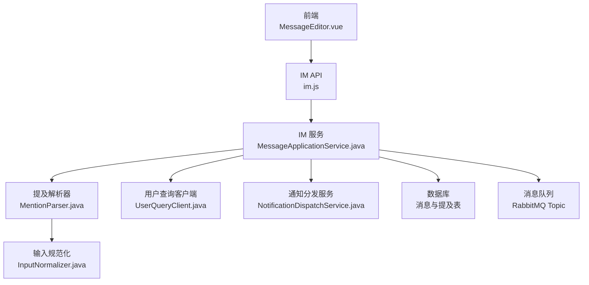
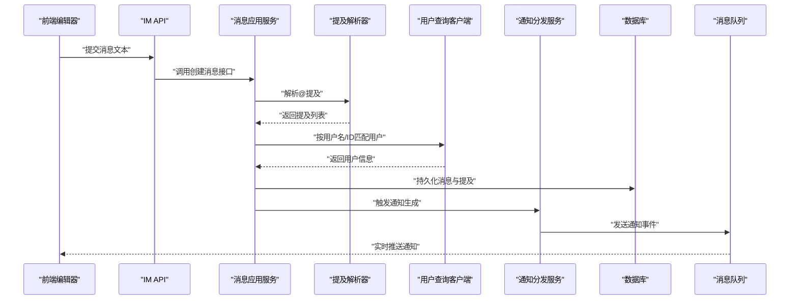
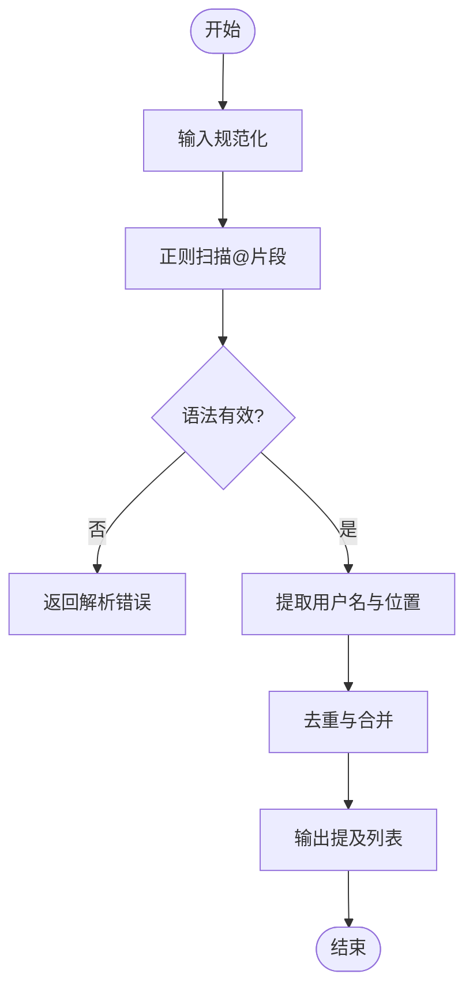
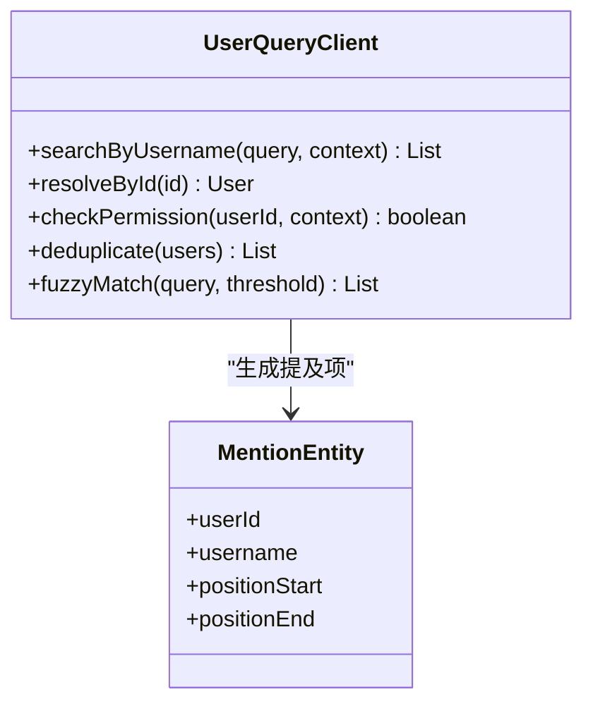
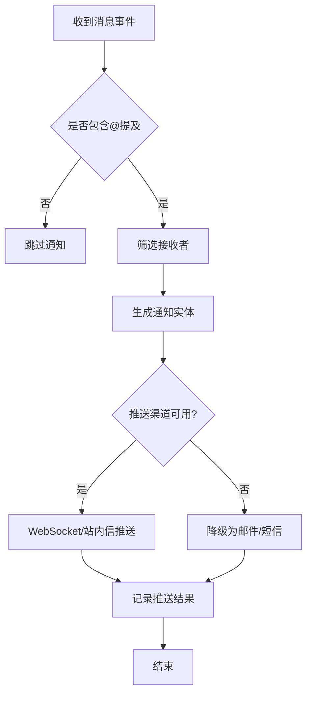
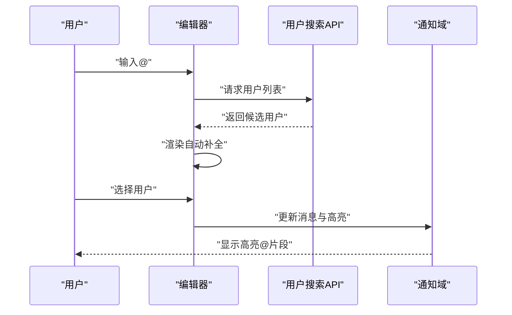
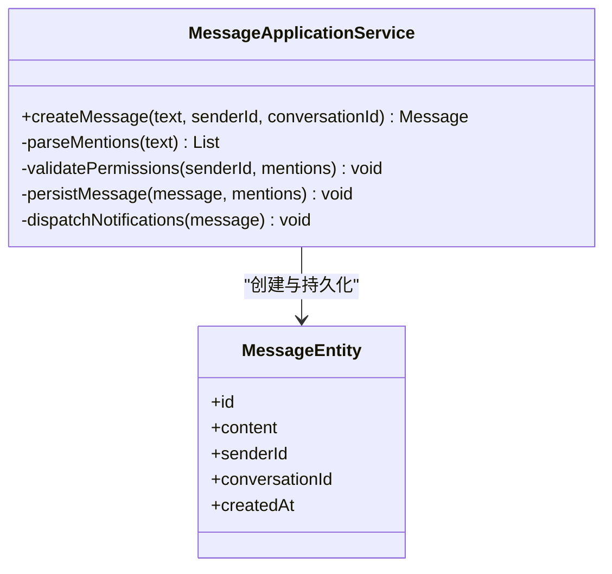
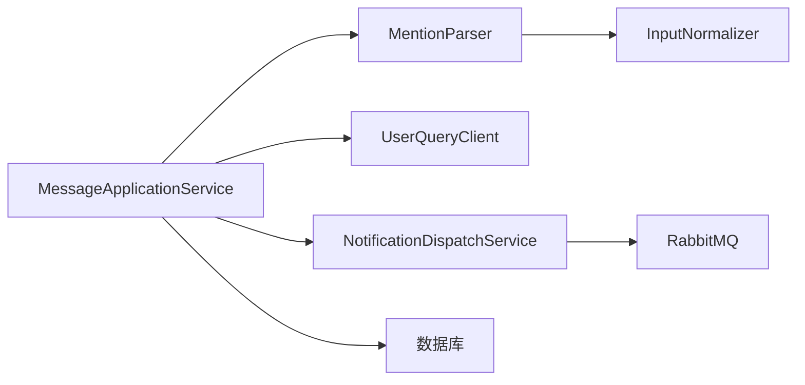

# @提及系统

<cite>
**本文引用的文件**   
- [zxyz-im-service/src/main/java/uno/acloud/im/application/MessageApplicationService.java](file://ZXYZdatabaseBack/zxyz-im-service/src/main/java/uno/acloud/im/application/MessageApplicationService.java)
- [zxyz-im-service/src/main/java/uno/acloud/im/application/MentionParser.java](file://ZXYZdatabaseBack/zxyz-im-service/src/main/java/uno/acloud/im/application/MentionParser.java)
- [zxyz-im-service/src/main/java/uno/acloud/im/domain/message/MentionEntity.java](file://ZXYZdatabaseBack/zxyz-im-service/src/main/java/uno/acloud/im/domain/message/MentionEntity.java)
- [zxyz-im-service/src/main/java/uno/acloud/im/domain/message/MessageEntity.java](file://ZXYZdatabaseBack/zxyz-im-service/src/main/java/uno/acloud/im/domain/message/MessageEntity.java)
- [zxyz-im-service/src/main/java/uno/acloud/im/infrastructure/client/UserQueryClient.java](file://ZXYZdatabaseBack/zxyz-im-service/src/main/java/uno/acloud/im/infrastructure/client/UserQueryClient.java)
- [zxyz-im-service/src/main/java/uno/acloud/im/application/NotificationDispatchService.java](file://ZXYZdatabaseBack/zxyz-im-service/src/main/java/uno/acloud/im/application/NotificationDispatchService.java)
- [zxyz-common/src/main/java/uno/acloud/common/util/InputNormalizer.java](file://ZXYZdatabaseBack/zxyz-common/src/main/java/uno/acloud/common/util/InputNormalizer.java)
- [ZXYZdatabaseFront/src/views/chat/components/MessageEditor.vue](file://ZXYZdatabaseFront/src/views/chat/components/MessageEditor.vue)
- [ZXYZdatabaseFront/src/store/im/notificationDomain.js](file://ZXYZdatabaseFront/src/store/im/notificationDomain.js)
- [ZXYZdatabaseFront/src/utils/imWebSocket.js](file://ZXYZdatabaseFront/src/utils/imWebSocket.js)
- [ZXYZdatabaseBack/ZXYZdatabaseFront/src/api/im.js](file://ZXYZdatabaseBack/ZXYZdatabaseFront/src/api/im.js)
</cite>

## 目录
1. [简介](#简介)
2. [项目结构](#项目结构)
3. [核心组件](#核心组件)
4. [架构总览](#架构总览)
5. [详细组件分析](#详细组件分析)
6. [依赖关系分析](#依赖关系分析)
7. [性能考虑](#性能考虑)
8. [故障排查指南](#故障排查指南)
9. [结论](#结论)
10. [附录：代码示例路径](#附录代码示例路径)

## 简介
本技术文档聚焦于 ZXYZ 即时通讯模块的“@提及”子系统，覆盖从前端输入到后端解析、用户匹配、权限校验、消息持久化、通知生成与推送的全链路实现。文档面向具备不同技术背景的读者，既提供高层架构概览，也深入到正则解析、模糊匹配、缓存策略与批量处理等关键细节，帮助开发者快速理解并扩展该能力。

## 项目结构
本项目采用微服务架构，IM 服务（zxyz-im-service）负责消息与提及的核心逻辑；通用工具在 zxyz-common 中提供输入规范化等能力；前端（ZXYZdatabaseFront）提供编辑器自动补全、高亮显示与点击跳转等交互。整体遵循 DDD 分层（interfaces → application → domain → infrastructure）与传统分层混合风格。

图表来源
- [MessageEditor.vue:1-200](file://ZXYZdatabaseFront/src/views/chat/components/MessageEditor.vue#L1-L200)
- [im.js:1-120](file://ZXYZdatabaseBack/ZXYZdatabaseFront/src/api/im.js#L1-L120)
- [MessageApplicationService.java:1-200](file://ZXYZdatabaseBack/zxyz-im-service/src/main/java/uno/acloud/im/application/MessageApplicationService.java#L1-L200)
- [MentionParser.java:1-150](file://ZXYZdatabaseBack/zxyz-im-service/src/main/java/uno/acloud/im/application/MentionParser.java#L1-L150)
- [UserQueryClient.java:1-120](file://ZXYZdatabaseBack/zxyz-im-service/src/main/java/uno/acloud/im/infrastructure/client/UserQueryClient.java#L1-L120)
- [NotificationDispatchService.java:1-150](file://ZXYZdatabaseBack/zxyz-im-service/src/main/java/uno/acloud/im/application/NotificationDispatchService.java#L1-L150)
- [InputNormalizer.java:1-120](file://ZXYZdatabaseBack/zxyz-common/src/main/java/uno/acloud/common/util/InputNormalizer.java#L1-L120)

章节来源
- [MessageApplicationService.java:1-200](file://ZXYZdatabaseBack/zxyz-im-service/src/main/java/uno/acloud/im/application/MessageApplicationService.java#L1-L200)
- [MentionParser.java:1-150](file://ZXYZdatabaseBack/zxyz-im-service/src/main/java/uno/acloud/im/application/MentionParser.java#L1-L150)
- [UserQueryClient.java:1-120](file://ZXYZdatabaseBack/zxyz-im-service/src/main/java/uno/acloud/im/infrastructure/client/UserQueryClient.java#L1-L120)
- [NotificationDispatchService.java:1-150](file://ZXYZdatabaseBack/zxyz-im-service/src/main/java/uno/acloud/im/application/NotificationDispatchService.java#L1-L150)
- [InputNormalizer.java:1-120](file://ZXYZdatabaseBack/zxyz-common/src/main/java/uno/acloud/common/util/InputNormalizer.java#L1-L120)
- [MessageEditor.vue:1-200](file://ZXYZdatabaseFront/src/views/chat/components/MessageEditor.vue#L1-L200)
- [im.js:1-120](file://ZXYZdatabaseBack/ZXYZdatabaseFront/src/api/im.js#L1-L120)

## 核心组件
- 提及解析器（MentionParser）：基于正则表达式识别“@用户名”片段，提取候选用户标识，进行特殊字符处理与语法验证。
- 用户匹配（UserQueryClient）：根据用户名或 ID 进行精确/模糊匹配，返回唯一用户或错误提示，支持去重与权限检查。
- 消息应用服务（MessageApplicationService）：编排消息创建流程，调用解析器提取提及，校验权限，持久化消息与提及，触发通知。
- 通知分发服务（NotificationDispatchService）：识别@提及消息，筛选接收者，生成通知实体，通过内部接口或消息队列推送。
- 输入规范化（InputNormalizer）：统一输入编码、去除不可见字符、标准化空格与换行，确保解析稳定性。
- 前端编辑器（MessageEditor.vue）：实现@自动补全、高亮、点击跳转与消息过滤，提升用户体验。

章节来源
- [MentionParser.java:1-150](file://ZXYZdatabaseBack/zxyz-im-service/src/main/java/uno/acloud/im/application/MentionParser.java#L1-L150)
- [UserQueryClient.java:1-120](file://ZXYZdatabaseBack/zxyz-im-service/src/main/java/uno/acloud/im/infrastructure/client/UserQueryClient.java#L1-L120)
- [MessageApplicationService.java:1-200](file://ZXYZdatabaseBack/zxyz-im-service/src/main/java/uno/acloud/im/application/MessageApplicationService.java#L1-L200)
- [NotificationDispatchService.java:1-150](file://ZXYZdatabaseBack/zxyz-im-service/src/main/java/uno/acloud/im/application/NotificationDispatchService.java#L1-L150)
- [InputNormalizer.java:1-120](file://ZXYZdatabaseBack/zxyz-common/src/main/java/uno/acloud/common/util/InputNormalizer.java#L1-L120)
- [MessageEditor.vue:1-200](file://ZXYZdatabaseFront/src/views/chat/components/MessageEditor.vue#L1-L200)

## 架构总览
下图展示了从前端输入到后端处理再到通知推送的整体流程。

图表来源
- [MessageApplicationService.java:1-200](file://ZXYZdatabaseBack/zxyz-im-service/src/main/java/uno/acloud/im/application/MessageApplicationService.java#L1-L200)
- [MentionParser.java:1-150](file://ZXYZdatabaseBack/zxyz-im-service/src/main/java/uno/acloud/im/application/MentionParser.java#L1-L150)
- [UserQueryClient.java:1-120](file://ZXYZdatabaseBack/zxyz-im-service/src/main/java/uno/acloud/im/infrastructure/client/UserQueryClient.java#L1-L120)
- [NotificationDispatchService.java:1-150](file://ZXYZdatabaseBack/zxyz-im-service/src/main/java/uno/acloud/im/application/NotificationDispatchService.java#L1-L150)

## 详细组件分析

### 提及解析器（MentionParser）
- 功能要点
  - 使用正则表达式匹配“@用户名”片段，支持中文、英文、数字及常见下划线。
  - 对特殊字符进行清洗与转义，避免注入与解析异常。
  - 语法验证：检测重复@、非法字符、过长用户名等。
  - 输出结构化提及项，包含原始片段、候选用户名、位置范围。
- 复杂度与优化
  - 正则扫描时间复杂度 O(n)，n 为文本长度。
  - 可引入滑动窗口与状态机减少回溯开销。
  - 对超大文本分块解析，避免内存峰值。

图表来源
- [MentionParser.java:1-150](file://ZXYZdatabaseBack/zxyz-im-service/src/main/java/uno/acloud/im/application/MentionParser.java#L1-L150)
- [InputNormalizer.java:1-120](file://ZXYZdatabaseBack/zxyz-common/src/main/java/uno/acloud/common/util/InputNormalizer.java#L1-L120)

章节来源
- [MentionParser.java:1-150](file://ZXYZdatabaseBack/zxyz-im-service/src/main/java/uno/acloud/im/application/MentionParser.java#L1-L150)
- [InputNormalizer.java:1-120](file://ZXYZdatabaseBack/zxyz-common/src/main/java/uno/acloud/common/util/InputNormalizer.java#L1-L120)

### 用户匹配机制（UserQueryClient）
- 功能要点
  - 支持按用户名精确匹配与模糊搜索（前缀匹配、拼音首字母）。
  - 权限检查：仅返回当前会话可见的用户（团队/项目成员）。
  - 重复检测：同一消息中相同用户只保留一次提及。
  - 模糊匹配算法：编辑距离与相似度阈值控制，避免误匹配。
- 数据结构与复杂度
  - 用户索引采用哈希+倒排索引，查询时间复杂度 O(1)~O(log n)。
  - 模糊匹配使用 Trie 树或 BK-Tree 加速前缀与近似匹配。

图表来源
- [UserQueryClient.java:1-120](file://ZXYZdatabaseBack/zxyz-im-service/src/main/java/uno/acloud/im/infrastructure/client/UserQueryClient.java#L1-L120)
- [MentionEntity.java:1-100](file://ZXYZdatabaseBack/zxyz-im-service/src/main/java/uno/acloud/im/domain/message/MentionEntity.java#L1-L100)

章节来源
- [UserQueryClient.java:1-120](file://ZXYZdatabaseBack/zxyz-im-service/src/main/java/uno/acloud/im/infrastructure/client/UserQueryClient.java#L1-L120)
- [MentionEntity.java:1-100](file://ZXYZdatabaseBack/zxyz-im-service/src/main/java/uno/acloud/im/domain/message/MentionEntity.java#L1-L100)

### 通知推送系统（NotificationDispatchService）
- 功能要点
  - 识别@提及消息：从消息内容或元数据中提取被提及用户集合。
  - 接收者筛选：排除发送者本人、已读用户、屏蔽用户。
  - 通知生成：构建通知实体（类型、来源、摘要、链接）。
  - 推送策略：优先 WebSocket 实时推送，失败降级为站内信或邮件。
- 流程图

图表来源
- [NotificationDispatchService.java:1-150](file://ZXYZdatabaseBack/zxyz-im-service/src/main/java/uno/acloud/im/application/NotificationDispatchService.java#L1-L150)

章节来源
- [NotificationDispatchService.java:1-150](file://ZXYZdatabaseBack/zxyz-im-service/src/main/java/uno/acloud/im/application/NotificationDispatchService.java#L1-L150)

### 前端@提及功能（MessageEditor.vue）
- 功能要点
  - 自动补全：监听输入框变化，触发用户搜索，展示候选列表。
  - 高亮显示：将@片段渲染为可点击元素，样式区分。
  - 点击跳转：点击@用户跳转到其主页或聊天入口。
  - 消息过滤：根据@关键词过滤历史消息，快速定位。
- 交互序列图

图表来源
- [MessageEditor.vue:1-200](file://ZXYZdatabaseFront/src/views/chat/components/MessageEditor.vue#L1-L200)
- [notificationDomain.js:1-120](file://ZXYZdatabaseFront/src/store/im/notificationDomain.js#L1-L120)
- [imWebSocket.js:1-120](file://ZXYZdatabaseFront/src/utils/imWebSocket.js#L1-L120)

章节来源
- [MessageEditor.vue:1-200](file://ZXYZdatabaseFront/src/views/chat/components/MessageEditor.vue#L1-L200)
- [notificationDomain.js:1-120](file://ZXYZdatabaseFront/src/store/im/notificationDomain.js#L1-L120)
- [imWebSocket.js:1-120](file://ZXYZdatabaseFront/src/utils/imWebSocket.js#L1-L120)

### 消息处理流程（MessageApplicationService）
- 功能要点
  - 调用解析器提取@提及，校验权限（发送者身份、目标用户可见性）。
  - 持久化消息与提及关联，构建索引以便检索。
  - 触发通知分发，异步处理推送任务。
- 类关系图

图表来源
- [MessageApplicationService.java:1-200](file://ZXYZdatabaseBack/zxyz-im-service/src/main/java/uno/acloud/im/application/MessageApplicationService.java#L1-L200)
- [MessageEntity.java:1-100](file://ZXYZdatabaseBack/zxyz-im-service/src/main/java/uno/acloud/im/domain/message/MessageEntity.java#L1-L100)

章节来源
- [MessageApplicationService.java:1-200](file://ZXYZdatabaseBack/zxyz-im-service/src/main/java/uno/acloud/im/application/MessageApplicationService.java#L1-L200)
- [MessageEntity.java:1-100](file://ZXYZdatabaseBack/zxyz-im-service/src/main/java/uno/acloud/im/domain/message/MessageEntity.java#L1-L100)

## 依赖关系分析
- 组件耦合
  - MessageApplicationService 依赖 MentionParser、UserQueryClient、NotificationDispatchService。
  - MentionParser 依赖 InputNormalizer 进行输入预处理。
  - NotificationDispatchService 依赖消息队列与推送通道。
- 外部依赖
  - 用户服务（UserQueryClient）提供用户信息与权限。
  - 数据库存储消息与提及。
  - RabbitMQ 用于异步通知分发。

图表来源
- [MessageApplicationService.java:1-200](file://ZXYZdatabaseBack/zxyz-im-service/src/main/java/uno/acloud/im/application/MessageApplicationService.java#L1-L200)
- [MentionParser.java:1-150](file://ZXYZdatabaseBack/zxyz-im-service/src/main/java/uno/acloud/im/application/MentionParser.java#L1-L150)
- [UserQueryClient.java:1-120](file://ZXYZdatabaseBack/zxyz-im-service/src/main/java/uno/acloud/im/infrastructure/client/UserQueryClient.java#L1-L120)
- [NotificationDispatchService.java:1-150](file://ZXYZdatabaseBack/zxyz-im-service/src/main/java/uno/acloud/im/application/NotificationDispatchService.java#L1-L150)
- [InputNormalizer.java:1-120](file://ZXYZdatabaseBack/zxyz-common/src/main/java/uno/acloud/common/util/InputNormalizer.java#L1-L120)

章节来源
- [MessageApplicationService.java:1-200](file://ZXYZdatabaseBack/zxyz-im-service/src/main/java/uno/acloud/im/application/MessageApplicationService.java#L1-L200)
- [MentionParser.java:1-150](file://ZXYZdatabaseBack/zxyz-im-service/src/main/java/uno/acloud/im/application/MentionParser.java#L1-L150)
- [UserQueryClient.java:1-120](file://ZXYZdatabaseBack/zxyz-im-service/src/main/java/uno/acloud/im/infrastructure/client/UserQueryClient.java#L1-L120)
- [NotificationDispatchService.java:1-150](file://ZXYZdatabaseBack/zxyz-im-service/src/main/java/uno/acloud/im/application/NotificationDispatchService.java#L1-L150)
- [InputNormalizer.java:1-120](file://ZXYZdatabaseBack/zxyz-common/src/main/java/uno/acloud/common/util/InputNormalizer.java#L1-L120)

## 性能考虑
- 缓存机制
  - 用户搜索结果缓存（Redis），TTL 配置短时效，避免频繁查询。
  - 提及解析结果缓存，针对重复文本片段复用解析结果。
- 批量处理
  - 通知推送采用批量聚合，减少网络往返与数据库写入。
  - 消息持久化使用事务与批量插入，降低 IO 压力。
- 查询优化
  - 用户搜索使用索引字段（用户名、拼音首字母），避免全表扫描。
  - 模糊匹配限制候选数量，结合阈值过滤低相似度结果。
- 前端优化
  - 自动补全防抖与节流，减少无效请求。
  - 虚拟滚动渲染长消息列表，提升 UI 响应速度。

[本节为通用指导，不直接分析具体文件]

## 故障排查指南
- 常见问题
  - 解析失败：检查输入规范化与正则表达式，确认特殊字符处理逻辑。
  - 用户匹配为空：验证权限上下文与用户可见性规则。
  - 通知未送达：检查 WebSocket 连接状态与消息队列消费情况。
- 调试建议
  - 启用详细日志，记录解析步骤与用户匹配过程。
  - 使用单元测试覆盖边界用例（空输入、超长文本、非法字符）。
  - 监控指标：解析耗时、匹配成功率、通知延迟。

章节来源
- [MentionParser.java:1-150](file://ZXYZdatabaseBack/zxyz-im-service/src/main/java/uno/acloud/im/application/MentionParser.java#L1-L150)
- [UserQueryClient.java:1-120](file://ZXYZdatabaseBack/zxyz-im-service/src/main/java/uno/acloud/im/infrastructure/client/UserQueryClient.java#L1-L120)
- [NotificationDispatchService.java:1-150](file://ZXYZdatabaseBack/zxyz-im-service/src/main/java/uno/acloud/im/application/NotificationDispatchService.java#L1-L150)

## 结论
@提及系统是 ZXYZ 即时通讯模块的关键特性，涉及前后端协同、复杂解析逻辑与高性能推送。通过模块化设计、缓存与批量优化，系统在准确性与性能之间取得平衡。未来可扩展更多匹配策略与推送渠道，进一步提升用户体验。

[本节为总结性内容，不直接分析具体文件]

## 附录：代码示例路径
- 提及解析示例：[MentionParser.java:1-150](file://ZXYZdatabaseBack/zxyz-im-service/src/main/java/uno/acloud/im/application/MentionParser.java#L1-L150)
- 用户匹配示例：[UserQueryClient.java:1-120](file://ZXYZdatabaseBack/zxyz-im-service/src/main/java/uno/acloud/im/infrastructure/client/UserQueryClient.java#L1-L120)
- 通知推送示例：[NotificationDispatchService.java:1-150](file://ZXYZdatabaseBack/zxyz-im-service/src/main/java/uno/acloud/im/application/NotificationDispatchService.java#L1-L150)
- 前端编辑器示例：[MessageEditor.vue:1-200](file://ZXYZdatabaseFront/src/views/chat/components/MessageEditor.vue#L1-L200)
- 输入规范化示例：[InputNormalizer.java:1-120](file://ZXYZdatabaseBack/zxyz-common/src/main/java/uno/acloud/common/util/InputNormalizer.java#L1-L120)