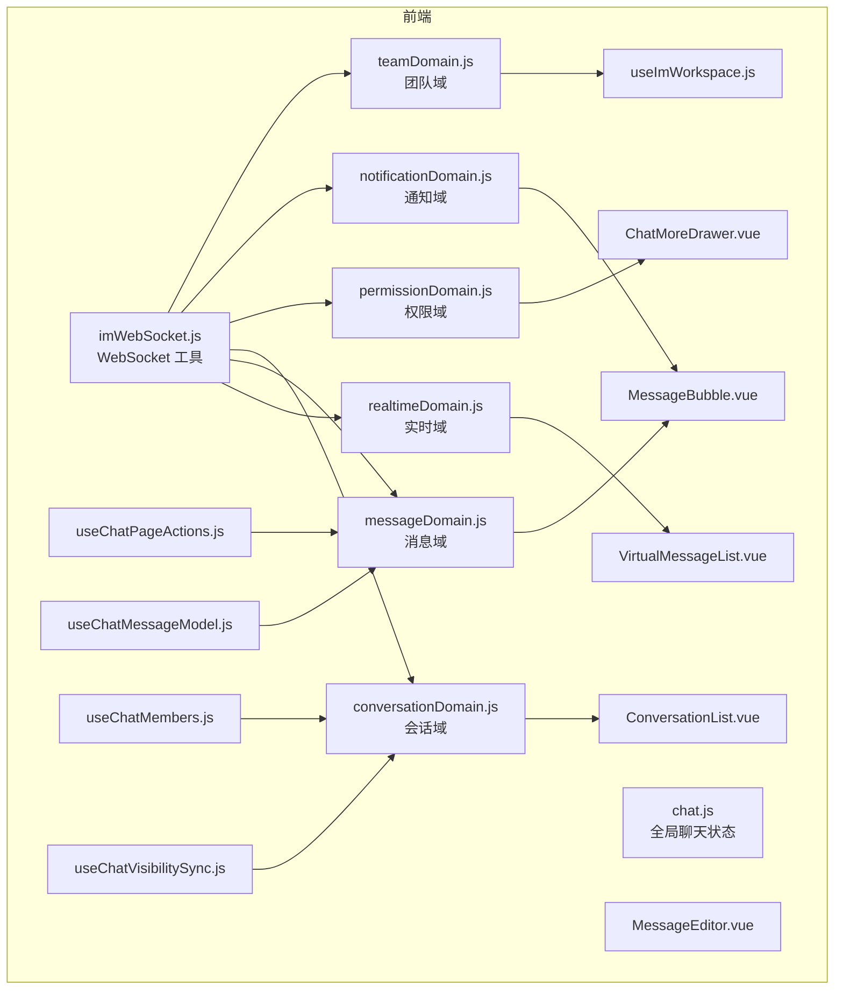
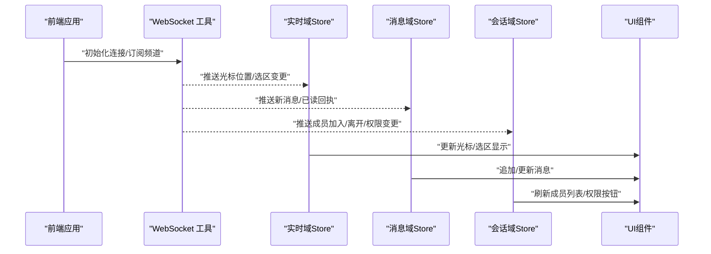
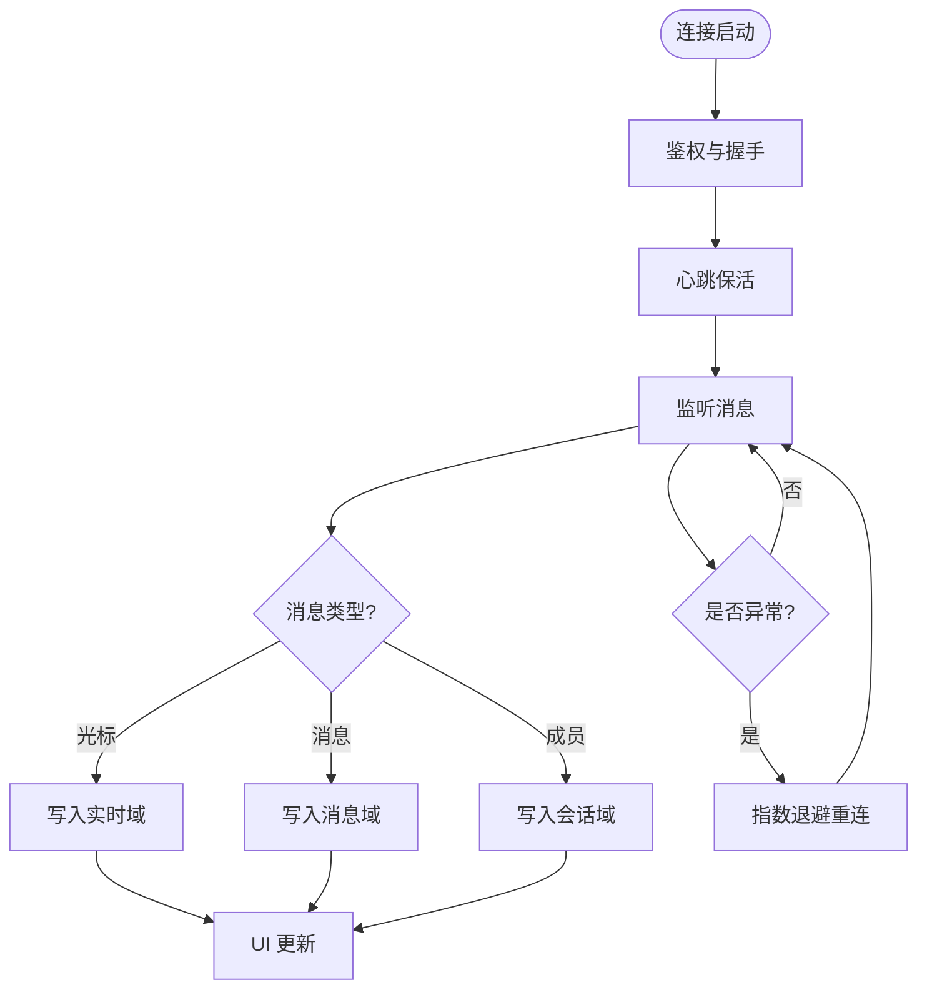
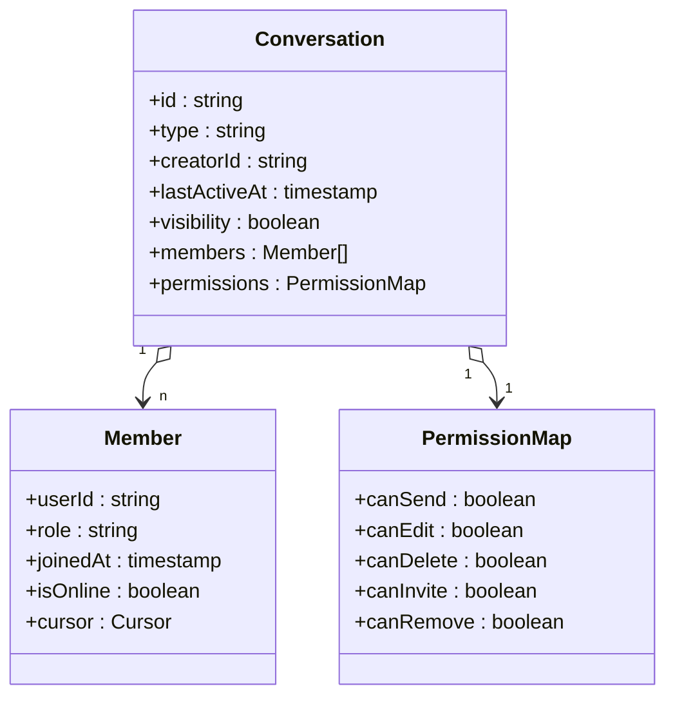
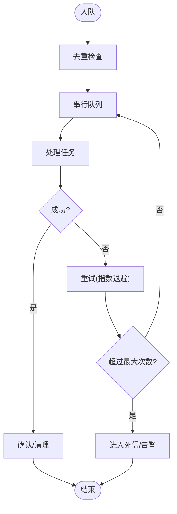
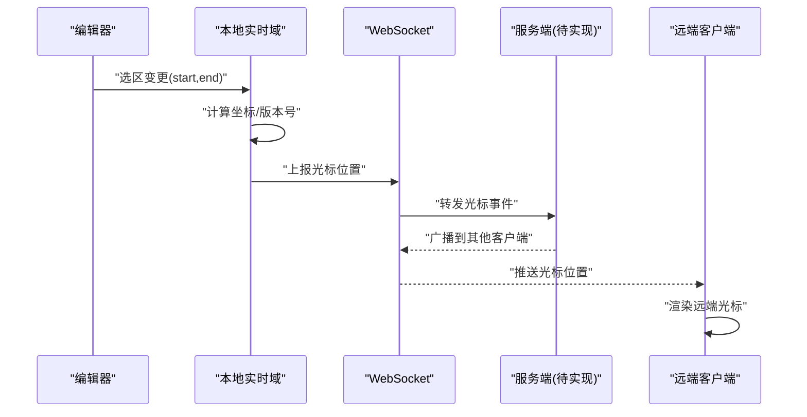
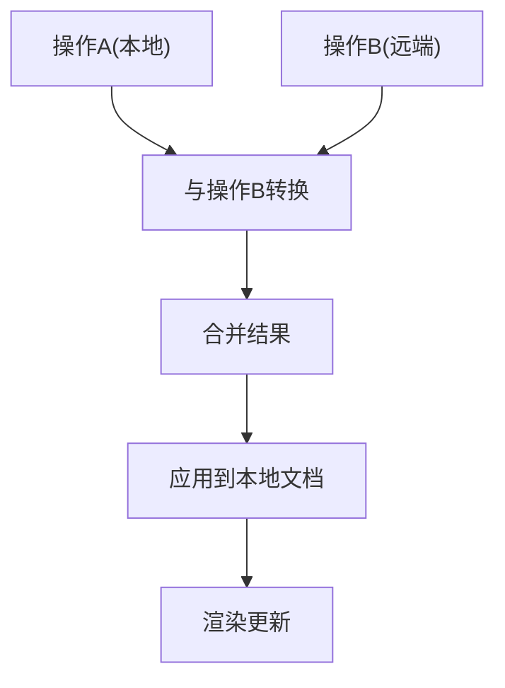
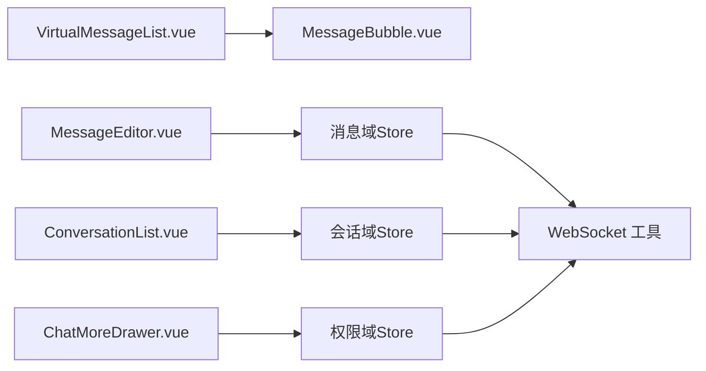
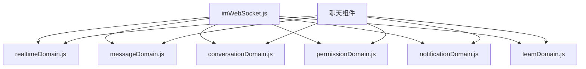

# 实时协作特性

<cite>
**本文引用的文件**   
- [zxyz-im-service/pom.xml](file://ZXYZdatabaseBack/zxyz-im-service/pom.xml)
- [ZxyzImApplication.java](file://ZXYZdatabaseBack/zxyz-im-service/src/main/java/uno/acloud/im/ZxyzImApplication.java)
- [application.yml](file://ZXYZdatabaseBack/zxyz-im-service/src/main/resources/application.yml)
- [application-dev.yml](file://ZXYZdatabaseBack/zxyz-im-service/src/main/resources/application-dev.yml)
- [application-prod.yml](file://ZXYZdatabaseBack/zxyz-im-service/src/main/resources/application-prod.yml)
- [imWebSocket.js](file://ZXYZdatabaseFront/src/utils/imWebSocket.js)
- [chat.js](file://ZXYZdatabaseFront/src/store/chat.js)
- [realtimeDomain.js](file://ZXYZdatabaseFront/src/store/im/realtimeDomain.js)
- [messageDomain.js](file://ZXYZdatabaseFront/src/store/im/messageDomain.js)
- [conversationDomain.js](file://ZXYZdatabaseFront/src/store/im/conversationDomain.js)
- [permissionDomain.js](file://ZXYZdatabaseFront/src/store/im/permissionDomain.js)
- [notificationDomain.js](file://ZXYZdatabaseFront/src/store/im/notificationDomain.js)
- [teamDomain.js](file://ZXYZdatabaseFront/src/store/im/teamDomain.js)
- [useImWorkspace.js](file://ZXYZdatabaseFront/src/composables/useImWorkspace.js)
- [useChatPageActions.js](file://ZXYZdatabaseFront/src/views/chat/composables/useChatPageActions.js)
- [useChatMessageModel.js](file://ZXYZdatabaseFront/src/views/chat/composables/useChatMessageModel.js)
- [useChatMembers.js](file://ZXYZdatabaseFront/src/views/chat/composables/useChatMembers.js)
- [useChatVisibilitySync.js](file://ZXYZdatabaseFront/src/views/chat/composables/useChatVisibilitySync.js)
- [VirtualMessageList.vue](file://ZXYZdatabaseFront/src/views/chat/components/VirtualMessageList.vue)
- [MessageBubble.vue](file://ZXYZdatabaseFront/src/views/chat/components/MessageBubble.vue)
- [MessageEditor.vue](file://ZXYZdatabaseFront/src/views/chat/components/MessageEditor.vue)
- [ConversationList.vue](file://ZXYZdatabaseFront/src/views/chat/components/ConversationList.vue)
- [ChatMoreDrawer.vue](file://ZXYZdatabaseFront/src/views/chat/components/ChatMoreDrawer.vue)
- [im.spec.js](file://ZXYZdatabaseFront/src/api/__tests__/im.spec.js)
- [normalizers.spec.js](file://ZXYZdatabaseFront/src/store/im/__tests__/normalizers.spec.js)
</cite>

## 目录
1. [简介](#简介)
2. [项目结构](#项目结构)
3. [核心组件](#核心组件)
4. [架构总览](#架构总览)
5. [详细组件分析](#详细组件分析)
6. [依赖关系分析](#依赖关系分析)
7. [性能考量](#性能考量)
8. [故障排查指南](#故障排查指南)
9. [结论](#结论)
10. [附录](#附录)

## 简介
本技术文档聚焦 ZXYZ 即时通讯模块的“实时协作”能力，围绕以下目标展开：
- 光标位置共享机制：坐标计算、位置同步、冲突解决与版本控制。
- 文档协同编辑：操作转换（OT）、增量更新、合并策略与冲突检测。
- 实时通信架构：WebSocket 连接管理、消息路由、广播机制与负载均衡。
- 协作状态管理：会话状态、参与者管理、权限控制与状态同步。
- 消息队列处理：串行执行、任务调度、错误处理与重试机制。
- 代码示例：实现光标共享、协同编辑与状态同步的关键流程。
- 性能优化：操作压缩、批量处理与内存管理。

说明：当前仓库未包含后端 IM 服务的 WebSocket 与 OT 实现源码，本文基于前端实现与配置进行推导与总结，并在需要处给出建议性设计。

## 项目结构
IM 相关的前端实现集中在 Vue 3 项目中，采用 Composition API + Pinia 状态管理，并通过自定义 WebSocket 工具类与后端交互。关键目录与职责如下：
- 前端 WebSocket 工具层：封装连接、重连、心跳、消息编解码与事件分发。
- 前端状态域模型：按领域划分 Pinia store（会话、消息、权限、通知、团队等）。
- 聊天页面与组件：消息列表、编辑器、成员面板、更多操作抽屉等。
- Composables：封装页面级交互逻辑（如成员管理、可见性同步、消息模型等）。

图表来源
- [imWebSocket.js](file://ZXYZdatabaseFront/src/utils/imWebSocket.js)
- [chat.js](file://ZXYZdatabaseFront/src/store/chat.js)
- [realtimeDomain.js](file://ZXYZdatabaseFront/src/store/im/realtimeDomain.js)
- [messageDomain.js](file://ZXYZdatabaseFront/src/store/im/messageDomain.js)
- [conversationDomain.js](file://ZXYZdatabaseFront/src/store/im/conversationDomain.js)
- [permissionDomain.js](file://ZXYZdatabaseFront/src/store/im/permissionDomain.js)
- [notificationDomain.js](file://ZXYZdatabaseFront/src/store/im/notificationDomain.js)
- [teamDomain.js](file://ZXYZdatabaseFront/src/store/im/teamDomain.js)
- [VirtualMessageList.vue](file://ZXYZdatabaseFront/src/views/chat/components/VirtualMessageList.vue)
- [MessageBubble.vue](file://ZXYZdatabaseFront/src/views/chat/components/MessageBubble.vue)
- [MessageEditor.vue](file://ZXYZdatabaseFront/src/views/chat/components/MessageEditor.vue)
- [ConversationList.vue](file://ZXYZdatabaseFront/src/views/chat/components/ConversationList.vue)
- [ChatMoreDrawer.vue](file://ZXYZdatabaseFront/src/views/chat/components/ChatMoreDrawer.vue)
- [useImWorkspace.js](file://ZXYZdatabaseFront/src/composables/useImWorkspace.js)
- [useChatPageActions.js](file://ZXYZdatabaseFront/src/views/chat/composables/useChatPageActions.js)
- [useChatMessageModel.js](file://ZXYZdatabaseFront/src/views/chat/composables/useChatMessageModel.js)
- [useChatMembers.js](file://ZXYZdatabaseFront/src/views/chat/composables/useChatMembers.js)
- [useChatVisibilitySync.js](file://ZXYZdatabaseFront/src/views/chat/composables/useChatVisibilitySync.js)

章节来源
- [ZxyzImApplication.java](file://ZXYZdatabaseBack/zxyz-im-service/src/main/java/uno/acloud/im/ZxyzImApplication.java)
- [application.yml](file://ZXYZdatabaseBack/zxyz-im-service/src/main/resources/application.yml)
- [application-dev.yml](file://ZXYZdatabaseBack/zxyz-im-service/src/main/resources/application-dev.yml)
- [application-prod.yml](file://ZXYZdatabaseBack/zxyz-im-service/src/main/resources/application-prod.yml)
- [imWebSocket.js](file://ZXYZdatabaseFront/src/utils/imWebSocket.js)
- [chat.js](file://ZXYZdatabaseFront/src/store/chat.js)

## 核心组件
- 实时通信层（WebSocket）
  - 负责连接建立、断线重连、心跳保活、消息订阅/发布、错误恢复。
  - 通过统一事件总线将服务端消息分派到各领域 store。
- 领域状态（Pinia Stores）
  - 会话域：维护会话元数据、成员列表、角色与权限。
  - 消息域：维护消息集合、排序、去重、渲染态。
  - 实时域：维护光标位置、选区、在线用户、协作标记。
  - 权限域：维护当前用户对会话的操作权限。
  - 通知域：系统提示、协作事件通知。
  - 团队域：团队上下文、成员信息聚合。
- 页面与组件
  - 虚拟滚动消息列表、气泡消息、编辑器、会话列表、更多操作抽屉。
- Composables
  - 封装页面级协作逻辑：成员管理、可见性同步、消息模型、页面动作等。

章节来源
- [realtimeDomain.js](file://ZXYZdatabaseFront/src/store/im/realtimeDomain.js)
- [messageDomain.js](file://ZXYZdatabaseFront/src/store/im/messageDomain.js)
- [conversationDomain.js](file://ZXYZdatabaseFront/src/store/im/conversationDomain.js)
- [permissionDomain.js](file://ZXYZdatabaseFront/src/store/im/permissionDomain.js)
- [notificationDomain.js](file://ZXYZdatabaseFront/src/store/im/notificationDomain.js)
- [teamDomain.js](file://ZXYZdatabaseFront/src/store/im/teamDomain.js)
- [VirtualMessageList.vue](file://ZXYZdatabaseFront/src/views/chat/components/VirtualMessageList.vue)
- [MessageBubble.vue](file://ZXYZdatabaseFront/src/views/chat/components/MessageBubble.vue)
- [MessageEditor.vue](file://ZXYZdatabaseFront/src/views/chat/components/MessageEditor.vue)
- [ConversationList.vue](file://ZXYZdatabaseFront/src/views/chat/components/ConversationList.vue)
- [ChatMoreDrawer.vue](file://ZXYZdatabaseFront/src/views/chat/components/ChatMoreDrawer.vue)
- [useChatMembers.js](file://ZXYZdatabaseFront/src/views/chat/composables/useChatMembers.js)
- [useChatVisibilitySync.js](file://ZXYZdatabaseFront/src/views/chat/composables/useChatVisibilitySync.js)
- [useChatMessageModel.js](file://ZXYZdatabaseFront/src/views/chat/composables/useChatMessageModel.js)
- [useChatPageActions.js](file://ZXYZdatabaseFront/src/views/chat/composables/useChatPageActions.js)

## 架构总览
整体架构由前端 WebSocket 工具与 Pinia 领域状态组成，后端服务提供 REST 与可能的 WebSocket 扩展点（当前仓库未包含具体实现）。前端通过事件驱动将服务端推送的消息映射到对应领域状态，组件消费状态完成渲染与交互。

图表来源
- [imWebSocket.js](file://ZXYZdatabaseFront/src/utils/imWebSocket.js)
- [realtimeDomain.js](file://ZXYZdatabaseFront/src/store/im/realtimeDomain.js)
- [messageDomain.js](file://ZXYZdatabaseFront/src/store/im/messageDomain.js)
- [conversationDomain.js](file://ZXYZdatabaseFront/src/store/im/conversationDomain.js)

## 详细组件分析

### 实时通信层（WebSocket）
- 功能要点
  - 连接生命周期：建立、鉴权、心跳、断线重连、指数退避。
  - 消息协议：定义消息类型、载荷结构、版本号与序列号。
  - 事件分发：根据消息类型路由至不同领域 store。
  - 错误处理：网络异常、协议不兼容、服务端限流。
- 与状态域的集成
  - 收到“光标位置”消息：写入实时域，触发 UI 更新。
  - 收到“新消息”：写入消息域，进行去重与排序。
  - 收到“成员变更”：更新会话域成员列表与权限。

图表来源
- [imWebSocket.js](file://ZXYZdatabaseFront/src/utils/imWebSocket.js)

章节来源
- [imWebSocket.js](file://ZXYZdatabaseFront/src/utils/imWebSocket.js)

### 协作状态管理（会话、参与者、权限、同步）
- 会话状态
  - 维护会话 ID、类型、创建者、最后活跃时间、可见性标志。
- 参与者管理
  - 在线成员列表、角色/权限、最近活动、光标位置。
- 权限控制
  - 基于角色的操作授权（发送、编辑、删除、邀请、移除）。
- 状态同步
  - 服务端推送成员变更、权限变更；本地缓存与一致性校验。

图表来源
- [conversationDomain.js](file://ZXYZdatabaseFront/src/store/im/conversationDomain.js)
- [permissionDomain.js](file://ZXYZdatabaseFront/src/store/im/permissionDomain.js)
- [realtimeDomain.js](file://ZXYZdatabaseFront/src/store/im/realtimeDomain.js)

章节来源
- [conversationDomain.js](file://ZXYZdatabaseFront/src/store/im/conversationDomain.js)
- [permissionDomain.js](file://ZXYZdatabaseFront/src/store/im/permissionDomain.js)
- [realtimeDomain.js](file://ZXYZdatabaseFront/src/store/im/realtimeDomain.js)
- [useChatMembers.js](file://ZXYZdatabaseFront/src/views/chat/composables/useChatMembers.js)
- [useChatVisibilitySync.js](file://ZXYZdatabaseFront/src/views/chat/composables/useChatVisibilitySync.js)

### 消息队列处理（串行执行、任务调度、错误处理、重试）
- 串行执行
  - 对同一会话的消息写入采用队列串行化，避免并发写导致的数据竞争。
- 任务调度
  - 使用微任务或定时器批处理高频事件（如光标移动），降低渲染压力。
- 错误处理
  - 捕获序列化/反序列化异常、字段缺失、类型不匹配。
- 重试机制
  - 对失败的消息推送进行有限次重试，结合指数退避与死信队列（若后端支持）。

图表来源
- [messageDomain.js](file://ZXYZdatabaseFront/src/store/im/messageDomain.js)
- [imWebSocket.js](file://ZXYZdatabaseFront/src/utils/imWebSocket.js)

章节来源
- [messageDomain.js](file://ZXYZdatabaseFront/src/store/im/messageDomain.js)
- [imWebSocket.js](file://ZXYZdatabaseFront/src/utils/imWebSocket.js)

### 光标位置共享机制（坐标计算、位置同步、冲突解决、版本控制）
- 坐标计算
  - 基于文本编辑器选区（startOffset/endOffset）与行号列号换算为可视化坐标。
- 位置同步
  - 高频移动事件节流/防抖，批量上报；服务端广播给同会话其他客户端。
- 冲突解决
  - 以服务端时间为基准，客户端侧做平滑插值与抖动抑制；必要时回滚到一致状态。
- 版本控制
  - 每个光标位置携带版本号/序列号，客户端比较并丢弃过期数据。

图表来源
- [realtimeDomain.js](file://ZXYZdatabaseFront/src/store/im/realtimeDomain.js)
- [imWebSocket.js](file://ZXYZdatabaseFront/src/utils/imWebSocket.js)

章节来源
- [realtimeDomain.js](file://ZXYZdatabaseFront/src/store/im/realtimeDomain.js)
- [imWebSocket.js](file://ZXYZdatabaseFront/src/utils/imWebSocket.js)

### 文档协同编辑（操作转换、增量更新、合并策略、冲突检测）
- 操作转换（OT）
  - 将插入、删除、格式变更等操作转换为可交换的原子操作，保证多端一致性。
- 增量更新
  - 仅传输差异操作，减少带宽占用；客户端按需应用。
- 合并策略
  - 基于操作顺序与版本号的合并算法，优先服务端权威版本。
- 冲突检测
  - 当两个操作作用于相同位置时，依据规则决定保留顺序或提示用户。

图表来源
- [messageDomain.js](file://ZXYZdatabaseFront/src/store/im/messageDomain.js)
- [realtimeDomain.js](file://ZXYZdatabaseFront/src/store/im/realtimeDomain.js)

章节来源
- [messageDomain.js](file://ZXYZdatabaseFront/src/store/im/messageDomain.js)
- [realtimeDomain.js](file://ZXYZdatabaseFront/src/store/im/realtimeDomain.js)

### 页面与组件（消息列表、气泡、编辑器、会话列表、更多操作）
- 虚拟滚动消息列表：高性能渲染大量消息。
- 气泡消息：展示内容、状态、作者、时间戳。
- 编辑器：输入、发送、协作标记、光标同步。
- 会话列表：切换会话、加载历史。
- 更多操作：成员管理、权限设置、可见性控制。

图表来源
- [VirtualMessageList.vue](file://ZXYZdatabaseFront/src/views/chat/components/VirtualMessageList.vue)
- [MessageBubble.vue](file://ZXYZdatabaseFront/src/views/chat/components/MessageBubble.vue)
- [MessageEditor.vue](file://ZXYZdatabaseFront/src/views/chat/components/MessageEditor.vue)
- [ConversationList.vue](file://ZXYZdatabaseFront/src/views/chat/components/ConversationList.vue)
- [ChatMoreDrawer.vue](file://ZXYZdatabaseFront/src/views/chat/components/ChatMoreDrawer.vue)
- [messageDomain.js](file://ZXYZdatabaseFront/src/store/im/messageDomain.js)
- [conversationDomain.js](file://ZXYZdatabaseFront/src/store/im/conversationDomain.js)
- [permissionDomain.js](file://ZXYZdatabaseFront/src/store/im/permissionDomain.js)
- [imWebSocket.js](file://ZXYZdatabaseFront/src/utils/imWebSocket.js)

章节来源
- [VirtualMessageList.vue](file://ZXYZdatabaseFront/src/views/chat/components/VirtualMessageList.vue)
- [MessageBubble.vue](file://ZXYZdatabaseFront/src/views/chat/components/MessageBubble.vue)
- [MessageEditor.vue](file://ZXYZdatabaseFront/src/views/chat/components/MessageEditor.vue)
- [ConversationList.vue](file://ZXYZdatabaseFront/src/views/chat/components/ConversationList.vue)
- [ChatMoreDrawer.vue](file://ZXYZdatabaseFront/src/views/chat/components/ChatMoreDrawer.vue)

### Composables（协作逻辑封装）
- useChatMembers：成员加入/离开、角色变更、在线状态。
- useChatVisibilitySync：会话可见性同步与权限联动。
- useChatMessageModel：消息模型构建、校验、去重。
- useChatPageActions：页面级动作（发送、撤回、置顶、搜索）。

章节来源
- [useChatMembers.js](file://ZXYZdatabaseFront/src/views/chat/composables/useChatMembers.js)
- [useChatVisibilitySync.js](file://ZXYZdatabaseFront/src/views/chat/composables/useChatVisibilitySync.js)
- [useChatMessageModel.js](file://ZXYZdatabaseFront/src/views/chat/composables/useChatMessageModel.js)
- [useChatPageActions.js](file://ZXYZdatabaseFront/src/views/chat/composables/useChatPageActions.js)

## 依赖关系分析
- 前端内部依赖
  - WebSocket 工具被所有领域 store 引用，用于收发消息。
  - 各 store 之间通过事件与状态解耦，避免循环依赖。
- 外部依赖
  - Nacos 配置中心（后端服务配置与服务发现）。
  - RabbitMQ Topic Exchange（异步通信，IM 服务可能使用）。
  - SaToken 鉴权（网关层拦截内部端点）。

图表来源
- [imWebSocket.js](file://ZXYZdatabaseFront/src/utils/imWebSocket.js)
- [realtimeDomain.js](file://ZXYZdatabaseFront/src/store/im/realtimeDomain.js)
- [messageDomain.js](file://ZXYZdatabaseFront/src/store/im/messageDomain.js)
- [conversationDomain.js](file://ZXYZdatabaseFront/src/store/im/conversationDomain.js)
- [permissionDomain.js](file://ZXYZdatabaseFront/src/store/im/permissionDomain.js)
- [notificationDomain.js](file://ZXYZdatabaseFront/src/store/im/notificationDomain.js)
- [teamDomain.js](file://ZXYZdatabaseFront/src/store/im/teamDomain.js)

章节来源
- [imWebSocket.js](file://ZXYZdatabaseFront/src/utils/imWebSocket.js)
- [chat.js](file://ZXYZdatabaseFront/src/store/chat.js)

## 性能考量
- 操作压缩
  - 将多个光标移动或短消息合并为一次上报，降低网络开销。
- 批量处理
  - 对高频事件（如输入、滚动）进行批量提交，减少渲染与状态更新频率。
- 内存管理
  - 消息列表采用虚拟滚动与分页加载，及时释放不可见节点。
  - 定期清理离线成员与过期通知。
- 渲染优化
  - 使用 key 稳定标识、避免不必要的 re-render。
  - 编辑器选择区变更节流，避免频繁计算坐标。

[本节为通用指导，无需引用具体文件]

## 故障排查指南
- 连接问题
  - 检查 WebSocket 握手与鉴权；查看心跳是否正常；观察重连日志。
- 消息丢失
  - 核对消息序列号与版本号；检查去重逻辑；确认队列串行执行。
- 光标漂移
  - 验证坐标换算逻辑；检查版本控制与冲突解决；对比服务端时间戳。
- 权限异常
  - 检查权限域状态与服务端返回；确认角色与操作映射。
- 单元测试参考
  - im.spec.js：API 调用与响应结构校验。
  - normalizers.spec.js：消息规范化与字段映射测试。

章节来源
- [im.spec.js](file://ZXYZdatabaseFront/src/api/__tests__/im.spec.js)
- [normalizers.spec.js](file://ZXYZdatabaseFront/src/store/im/__tests__/normalizers.spec.js)

## 结论
ZXYZ 即时通讯模块在前端实现了完整的实时协作基础能力：WebSocket 通信、领域状态管理、页面组件与协作逻辑封装。尽管后端 WebSocket 与 OT 实现未在仓库中提供，但前端已具备与后端对接的接口与状态模型。建议在后续迭代中完善后端协作引擎，确保高并发下的强一致性与低延迟体验。

[本节为总结，无需引用具体文件]

## 附录
- 配置与环境
  - 后端服务配置位于 application*.yml，开发/生产环境分离。
  - Nacos 管理动态配置与服务注册。
- 部署与 CI/CD
  - Docker Compose 编排容器；GitHub Actions 选择性构建与镜像推送。

章节来源
- [application.yml](file://ZXYZdatabaseBack/zxyz-im-service/src/main/resources/application.yml)
- [application-dev.yml](file://ZXYZdatabaseBack/zxyz-im-service/src/main/resources/application-dev.yml)
- [application-prod.yml](file://ZXYZdatabaseBack/zxyz-im-service/src/main/resources/application-prod.yml)
- [pom.xml](file://ZXYZdatabaseBack/zxyz-im-service/pom.xml)