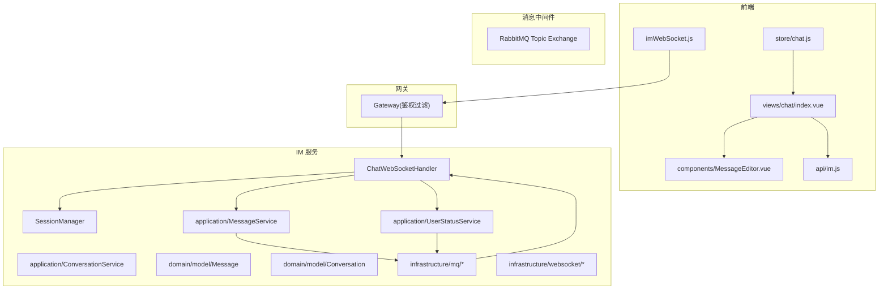
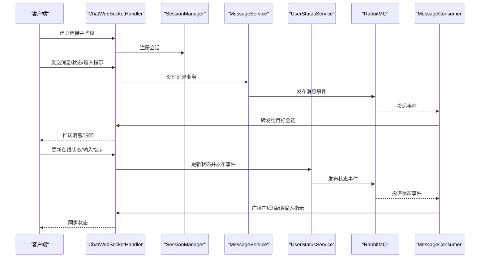
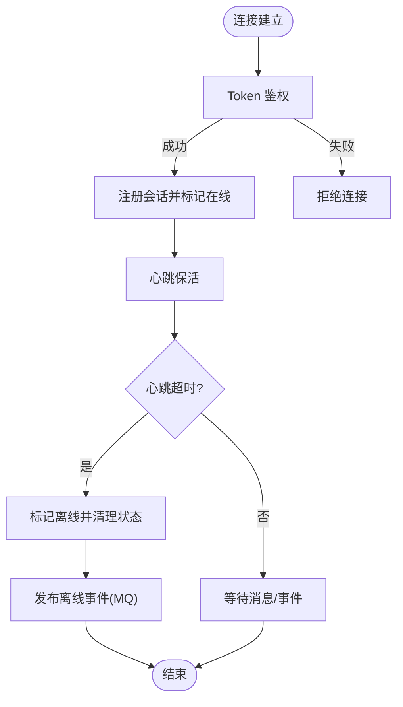
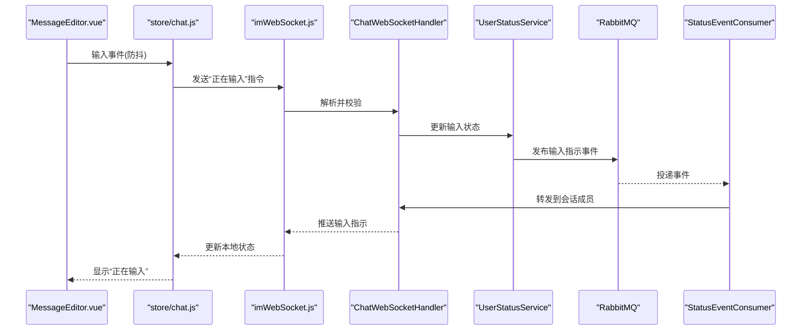
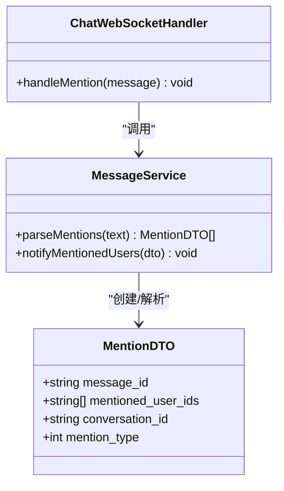
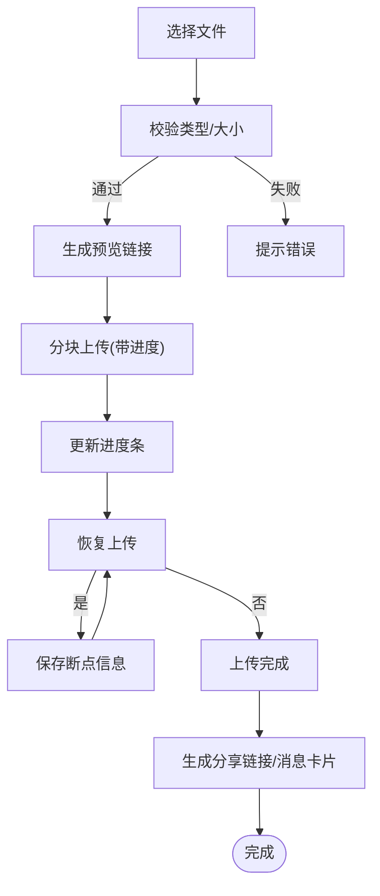
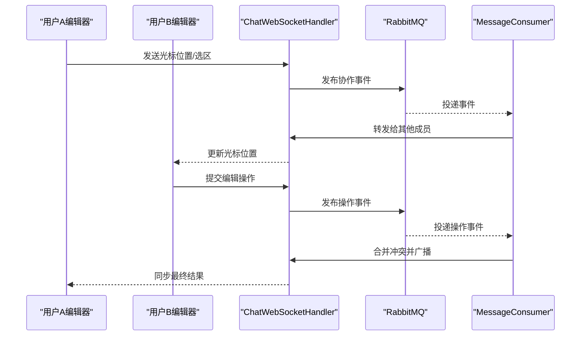
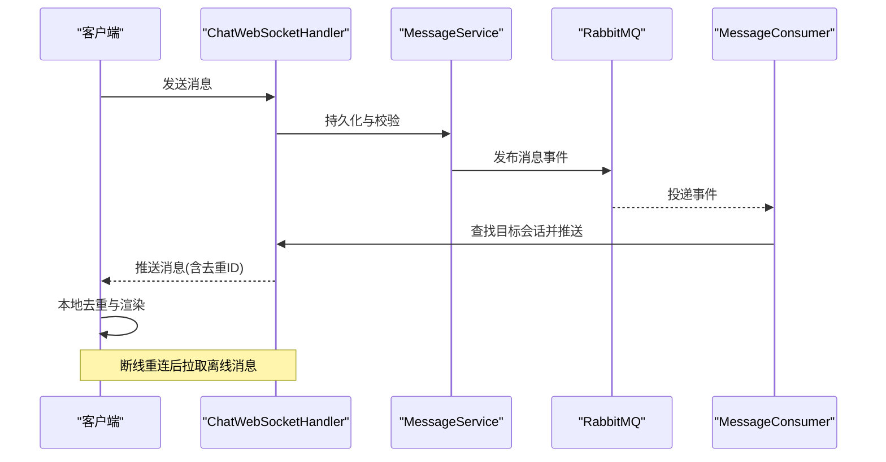
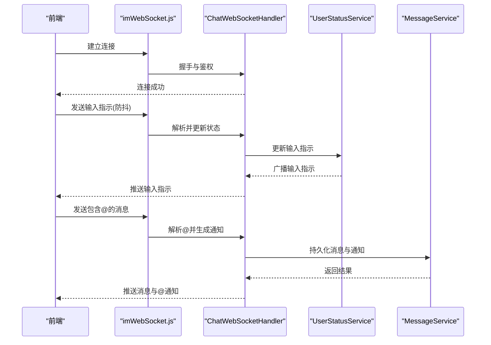
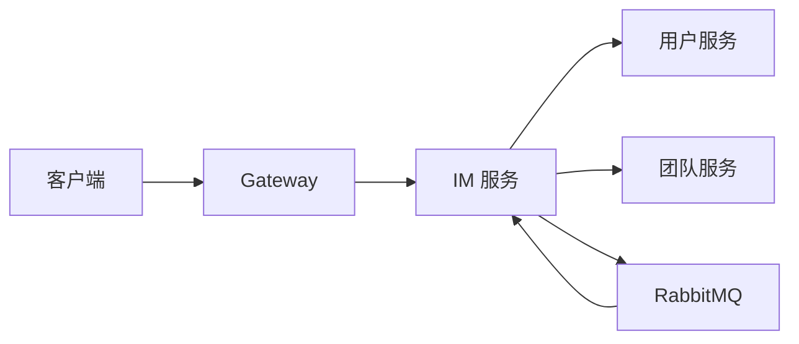

# 实时通信特性

<cite>
**本文引用的文件**
- [zxyz-im-service/src/main/java/uno/acloud/im/ZxyzImApplication.java](file://ZXYZdatabaseBack/zxyz-im-service/src/main/java/uno/acloud/im/ZxyzImApplication.java)
- [zxyz-im-service/src/main/resources/application.yml](file://ZXYZdatabaseBack/zxyz-im-service/src/main/resources/application.yml)
- [zxyz-im-service/src/main/resources/application-dev.yml](file://ZXYZdatabaseBack/zxyz-im-service/src/main/resources/application-dev.yml)
- [zxyz-im-service/src/main/resources/application-prod.yml](file://ZXYZdatabaseBack/zxyz-im-service/src/main/resources/application-prod.yml)
- [zxyz-im-service/src/main/java/uno/acloud/im/config/WebSocketConfig.java](file://ZXYZdatabaseBack/zxyz-im-service/src/main/java/uno/acloud/im/config/WebSocketConfig.java)
- [zxyz-im-service/src/main/java/uno/acloud/im/config/RabbitMqConfig.java](file://ZXYZdatabaseBack/zxyz-im-service/src/main/java/uno/acloud/im/config/RabbitMqConfig.java)
- [zxyz-im-service/src/main/java/uno/acloud/im/controller/ConversationController.java](file://ZXYZdatabaseBack/zxyz-im-service/src/main/java/uno/acloud/im/controller/ConversationController.java)
- [zxyz-im-service/src/main/java/uno/acloud/im/controller/MessageController.java](file://ZXYZdatabaseBack/zxyz-im-service/src/main/java/uno/acloud/im/controller/MessageController.java)
- [zxyz-im-service/src/main/java/uno/acloud/im/controller/UserStatusController.java](file://ZXYZdatabaseBack/zxyz-im-service/src/main/java/uno/acloud/im/controller/UserStatusController.java)
- [zxyz-im-service/src/main/java/uno/acloud/im/application/ConversationService.java](file://ZXYZdatabaseBack/zxyz-im-service/src/main/java/uno/acloud/im/application/ConversationService.java)
- [zxyz-im-service/src/main/java/uno/acloud/im/application/MessageService.java](file://ZXYZdatabaseBack/zxyz-im-service/src/main/java/uno/acloud/im/application/MessageService.java)
- [zxyz-im-service/src/main/java/uno/acloud/im/application/UserStatusService.java](file://ZXYZdatabaseBack/zxyz-im-service/src/main/java/uno/acloud/im/application/UserStatusService.java)
- [zxyz-im-service/src/main/java/uno/acloud/im/domain/model/Message.java](file://ZXYZdatabaseBack/zxyz-im-service/src/main/java/uno/acloud/im/domain/model/Message.java)
- [zxyz-im-service/src/main/java/uno/acloud/im/domain/model/Conversation.java](file://ZXYZdatabaseBack/zxyz-im-service/src/main/java/uno/acloud/im/domain/model/Conversation.java)
- [zxyz-im-service/src/main/java/uno/acloud/im/infrastructure/mq/MessageConsumer.java](file://ZXYZdatabaseBack/zxyz-im-service/src/main/java/uno/acloud/im/infrastructure/mq/MessageConsumer.java)
- [zxyz-im-service/src/main/java/uno/acloud/im/infrastructure/mq/StatusEventConsumer.java](file://ZXYZdatabaseBack/zxyz-im-service/src/main/java/uno/acloud/im/infrastructure/mq/StatusEventConsumer.java)
- [zxyz-im-service/src/main/java/uno/acloud/im/infrastructure/websocket/ChatWebSocketHandler.java](file://ZXYZdatabaseBack/zxyz-im-service/src/main/java/uno/acloud/im/infrastructure/websocket/ChatWebSocketHandler.java)
- [zxyz-im-service/src/main/java/uno/acloud/im/infrastructure/websocket/SessionManager.java](file://ZXYZdatabaseBack/zxyz-im-service/src/main/java/uno/acloud/im/infrastructure/websocket/SessionManager.java)
- [zxyz-im-service/src/main/java/uno/acloud/im/dto/OnlineUserDTO.java](file://ZXYZdatabaseBack/zxyz-im-service/src/main/java/uno/acloud/im/dto/OnlineUserDTO.java)
- [zxyz-im-service/src/main/java/uno/acloud/im/dto/InputIndicatorDTO.java](file://ZXYZdatabaseBack/zxyz-im-service/src/main/java/uno/acloud/im/dto/InputIndicatorDTO.java)
- [zxyz-im-service/src/main/java/uno/acloud/im/dto/MentionDTO.java](file://ZXYZdatabaseBack/zxyz-im-service/src/main/java/uno/acloud/im/dto/MentionDTO.java)
- [zxyz-im-service/src/main/java/uno/acloud/im/dto/FileShareDTO.java](file://ZXYZdatabaseBack/zxyz-im-service/src/main/java/uno/acloud/im/dto/FileShareDTO.java)
- [zxyz-im-service/src/main/java/uno/acloud/im/dto/CursorSyncDTO.java](file://ZXYZdatabaseBack/zxyz-im-service/src/main/java/uno/acloud/im/dto/CursorSyncDTO.java)
- [zxyz-common/src/main/java/uno/acloud/common/event/ImEvents.java](file://ZXYZdatabaseBack/zxyz-common/src/main/java/uno/acloud/common/event/ImEvents.java)
- [ZXYZdatabaseFront/src/utils/imWebSocket.js](file://ZXYZdatabaseFront/src/utils/imWebSocket.js)
- [ZXYZdatabaseFront/src/store/chat.js](file://ZXYZdatabaseFront/src/store/chat.js)
- [ZXYZdatabaseFront/src/views/chat/index.vue](file://ZXYZdatabaseFront/src/views/chat/index.vue)
- [ZXYZdatabaseFront/src/views/chat/components/MessageEditor.vue](file://ZXYZdatabaseFront/src/views/chat/components/MessageEditor.vue)
- [ZXYZdatabaseFront/src/api/im.js](file://ZXYZdatabaseFront/src/api/im.js)
</cite>

## 目录
1. [简介](#简介)
2. [项目结构](#项目结构)
3. [核心组件](#核心组件)
4. [架构总览](#架构总览)
5. [详细组件分析](#详细组件分析)
6. [依赖关系分析](#依赖关系分析)
7. [性能考虑](#性能考虑)
8. [故障排查指南](#故障排查指南)
9. [结论](#结论)
10. [附录](#附录)

## 简介
本技术文档聚焦 ZXYZ 即时通讯模块的实时通信能力，覆盖在线状态管理、输入指示器、@提及系统、文件分享、实时协作（光标共享与协同编辑）、消息推送机制，以及端到端示例与性能优化策略。后端采用微服务架构，IM 服务基于 WebSocket 实现长连接，结合 RabbitMQ Topic Exchange 进行异步事件广播；前端使用 Vue 3 Composition API + Pinia 管理状态，并通过自定义 WebSocket 工具封装连接与会话生命周期。

## 项目结构
IM 相关代码主要分布在以下位置：
- 后端 IM 服务：DDD 分层（interfaces → application → domain → infrastructure），包含控制器、应用服务、领域模型、基础设施（WebSocket、MQ、存储等）
- 公共模块：通用事件定义与工具
- 前端：WebSocket 工具、聊天页面与编辑器、Pinia 状态管理、API 调用封装

图表来源
- [zxyz-im-service/src/main/java/uno/acloud/im/infrastructure/websocket/ChatWebSocketHandler.java](file://ZXYZdatabaseBack/zxyz-im-service/src/main/java/uno/acloud/im/infrastructure/websocket/ChatWebSocketHandler.java)
- [zxyz-im-service/src/main/java/uno/acloud/im/infrastructure/websocket/SessionManager.java](file://ZXYZdatabaseBack/zxyz-im-service/src/main/java/uno/acloud/im/infrastructure/websocket/SessionManager.java)
- [zxyz-im-service/src/main/java/uno/acloud/im/application/MessageService.java](file://ZXYZdatabaseBack/zxyz-im-service/src/main/java/uno/acloud/im/application/MessageService.java)
- [zxyz-im-service/src/main/java/uno/acloud/im/application/UserStatusService.java](file://ZXYZdatabaseBack/zxyz-im-service/src/main/java/uno/acloud/im/application/UserStatusService.java)
- [zxyz-im-service/src/main/java/uno/acloud/im/infrastructure/mq/MessageConsumer.java](file://ZXYZdatabaseBack/zxyz-im-service/src/main/java/uno/acloud/im/infrastructure/mq/MessageConsumer.java)
- [ZXYZdatabaseFront/src/utils/imWebSocket.js](file://ZXYZdatabaseFront/src/utils/imWebSocket.js)
- [ZXYZdatabaseFront/src/store/chat.js](file://ZXYZdatabaseFront/src/store/chat.js)
- [ZXYZdatabaseFront/src/views/chat/index.vue](file://ZXYZdatabaseFront/src/views/chat/index.vue)
- [ZXYZdatabaseFront/src/views/chat/components/MessageEditor.vue](file://ZXYZdatabaseFront/src/views/chat/components/MessageEditor.vue)
- [ZXYZdatabaseFront/src/api/im.js](file://ZXYZdatabaseFront/src/api/im.js)

章节来源
- [zxyz-im-service/src/main/java/uno/acloud/im/ZxyzImApplication.java](file://ZXYZdatabaseBack/zxyz-im-service/src/main/java/uno/acloud/im/ZxyzImApplication.java)
- [zxyz-im-service/src/main/resources/application.yml](file://ZXYZdatabaseBack/zxyz-im-service/src/main/resources/application.yml)
- [zxyz-im-service/src/main/resources/application-dev.yml](file://ZXYZdatabaseBack/zxyz-im-service/src/main/resources/application-dev.yml)
- [zxyz-im-service/src/main/resources/application-prod.yml](file://ZXYZdatabaseBack/zxyz-im-service/src/main/resources/application-prod.yml)

## 核心组件
- WebSocket 处理器与会话管理：负责连接建立、认证、会话路由、心跳保活、断线重连提示
- 应用服务层：对话、消息、用户状态的领域编排与事务边界
- 领域模型：消息、对话等实体与值对象
- 基础设施层：MQ 消费者/生产者、持久化访问、缓存与会话映射
- 前端：WebSocket 工具、聊天状态管理、消息编辑器与列表渲染

章节来源
- [zxyz-im-service/src/main/java/uno/acloud/im/infrastructure/websocket/ChatWebSocketHandler.java](file://ZXYZdatabaseBack/zxyz-im-service/src/main/java/uno/acloud/im/infrastructure/websocket/ChatWebSocketHandler.java)
- [zxyz-im-service/src/main/java/uno/acloud/im/infrastructure/websocket/SessionManager.java](file://ZXYZdatabaseBack/zxyz-im-service/src/main/java/uno/acloud/im/infrastructure/websocket/SessionManager.java)
- [zxyz-im-service/src/main/java/uno/acloud/im/application/MessageService.java](file://ZXYZdatabaseBack/zxyz-im-service/src/main/java/uno/acloud/im/application/MessageService.java)
- [zxyz-im-service/src/main/java/uno/acloud/im/application/UserStatusService.java](file://ZXYZdatabaseBack/zxyz-im-service/src/main/java/uno/acloud/im/application/UserStatusService.java)
- [zxyz-im-service/src/main/java/uno/acloud/im/domain/model/Message.java](file://ZXYZdatabaseBack/zxyz-im-service/src/main/java/uno/acloud/im/domain/model/Message.java)
- [zxyz-im-service/src/main/java/uno/acloud/im/domain/model/Conversation.java](file://ZXYZdatabaseBack/zxyz-im-service/src/main/java/uno/acloud/im/domain/model/Conversation.java)

## 架构总览
IM 实时通信采用“WebSocket 长连接 + MQ 事件总线”的双通道模式：
- 上行：客户端通过 WebSocket 发送消息、状态变更、输入指示、@提及、文件分享、协作光标等指令
- 下行：服务端通过 WebSocket 推送消息、通知、状态同步、离线消息补齐
- 横向：服务间通过 RabbitMQ Topic Exchange 广播事件，保证多实例一致性

图表来源
- [zxyz-im-service/src/main/java/uno/acloud/im/infrastructure/websocket/ChatWebSocketHandler.java](file://ZXYZdatabaseBack/zxyz-im-service/src/main/java/uno/acloud/im/infrastructure/websocket/ChatWebSocketHandler.java)
- [zxyz-im-service/src/main/java/uno/acloud/im/infrastructure/websocket/SessionManager.java](file://ZXYZdatabaseBack/zxyz-im-service/src/main/java/uno/acloud/im/infrastructure/websocket/SessionManager.java)
- [zxyz-im-service/src/main/java/uno/acloud/im/application/MessageService.java](file://ZXYZdatabaseBack/zxyz-im-service/src/main/java/uno/acloud/im/application/MessageService.java)
- [zxyz-im-service/src/main/java/uno/acloud/im/application/UserStatusService.java](file://ZXYZdatabaseBack/zxyz-im-service/src/main/java/uno/acloud/im/application/UserStatusService.java)
- [zxyz-im-service/src/main/java/uno/acloud/im/infrastructure/mq/MessageConsumer.java](file://ZXYZdatabaseBack/zxyz-im-service/src/main/java/uno/acloud/im/infrastructure/mq/MessageConsumer.java)

## 详细组件分析

### 在线状态管理
- 用户在线状态检测：WebSocket 握手时校验 Token，建立会话后标记用户在线；心跳超时判定离线
- 状态广播：通过 MQ 发布用户上线/下线事件，所有 IM 实例订阅并广播到对应会话成员
- 离线处理：会话断开触发离线清理，清理输入指示、临时状态；支持离线消息拉取
- 状态同步：客户端订阅状态频道，接收在线人数、最近活跃时间、是否正在输入等

图表来源
- [zxyz-im-service/src/main/java/uno/acloud/im/infrastructure/websocket/ChatWebSocketHandler.java](file://ZXYZdatabaseBack/zxyz-im-service/src/main/java/uno/acloud/im/infrastructure/websocket/ChatWebSocketHandler.java)
- [zxyz-im-service/src/main/java/uno/acloud/im/infrastructure/websocket/SessionManager.java](file://ZXYZdatabaseBack/zxyz-im-service/src/main/java/uno/acloud/im/infrastructure/websocket/SessionManager.java)
- [zxyz-im-service/src/main/java/uno/acloud/im/application/UserStatusService.java](file://ZXYZdatabaseBack/zxyz-im-service/src/main/java/uno/acloud/im/application/UserStatusService.java)
- [zxyz-im-service/src/main/java/uno/acloud/im/infrastructure/mq/StatusEventConsumer.java](file://ZXYZdatabaseBack/zxyz-im-service/src/main/java/uno/acloud/im/infrastructure/mq/StatusEventConsumer.java)

章节来源
- [zxyz-im-service/src/main/java/uno/acloud/im/controller/UserStatusController.java](file://ZXYZdatabaseBack/zxyz-im-service/src/main/java/uno/acloud/im/controller/UserStatusController.java)
- [zxyz-im-service/src/main/java/uno/acloud/im/application/UserStatusService.java](file://ZXYZdatabaseBack/zxyz-im-service/src/main/java/uno/acloud/im/application/UserStatusService.java)
- [zxyz-im-service/src/main/java/uno/acloud/im/dto/OnlineUserDTO.java](file://ZXYZdatabaseBack/zxyz-im-service/src/main/java/uno/acloud/im/dto/OnlineUserDTO.java)

### 输入指示器功能
- 输入状态检测：监听编辑器输入事件，防抖延迟后上报“正在输入”
- 延迟处理：统一延迟阈值，避免高频抖动导致过多广播
- 多用户支持：按会话维度维护每个用户的输入状态，去重合并
- 状态清理：会话切换或离开时清除输入指示，防止残留

图表来源
- [ZXYZdatabaseFront/src/views/chat/components/MessageEditor.vue](file://ZXYZdatabaseFront/src/views/chat/components/MessageEditor.vue)
- [ZXYZdatabaseFront/src/store/chat.js](file://ZXYZdatabaseFront/src/store/chat.js)
- [ZXYZdatabaseFront/src/utils/imWebSocket.js](file://ZXYZdatabaseFront/src/utils/imWebSocket.js)
- [zxyz-im-service/src/main/java/uno/acloud/im/infrastructure/websocket/ChatWebSocketHandler.java](file://ZXYZdatabaseBack/zxyz-im-service/src/main/java/uno/acloud/im/infrastructure/websocket/ChatWebSocketHandler.java)
- [zxyz-im-service/src/main/java/uno/acloud/im/application/UserStatusService.java](file://ZXYZdatabaseBack/zxyz-im-service/src/main/java/uno/acloud/im/application/UserStatusService.java)
- [zxyz-im-service/src/main/java/uno/acloud/im/infrastructure/mq/StatusEventConsumer.java](file://ZXYZdatabaseBack/zxyz-im-service/src/main/java/uno/acloud/im/infrastructure/mq/StatusEventConsumer.java)

章节来源
- [zxyz-im-service/src/main/java/uno/acloud/im/dto/InputIndicatorDTO.java](file://ZXYZdatabaseBack/zxyz-im-service/src/main/java/uno/acloud/im/dto/InputIndicatorDTO.java)

### @提及系统
- 语法解析：识别文本中的 @用户名/@userId 片段，生成结构化提及信息
- 用户匹配：根据用户名或 ID 匹配有效用户，过滤无效或已离线的用户
- 通知推送：为被提及用户生成高优先级通知，走独立频道推送
- 消息高亮：前端对提及片段进行高亮显示，并提供跳转或回复快捷操作

图表来源
- [zxyz-im-service/src/main/java/uno/acloud/im/dto/MentionDTO.java](file://ZXYZdatabaseBack/zxyz-im-service/src/main/java/uno/acloud/im/dto/MentionDTO.java)
- [zxyz-im-service/src/main/java/uno/acloud/im/application/MessageService.java](file://ZXYZdatabaseBack/zxyz-im-service/src/main/java/uno/acloud/im/application/MessageService.java)
- [zxyz-im-service/src/main/java/uno/acloud/im/infrastructure/websocket/ChatWebSocketHandler.java](file://ZXYZdatabaseBack/zxyz-im-service/src/main/java/uno/acloud/im/infrastructure/websocket/ChatWebSocketHandler.java)

章节来源
- [zxyz-im-service/src/main/java/uno/acloud/im/dto/MentionDTO.java](file://ZXYZdatabaseBack/zxyz-im-service/src/main/java/uno/acloud/im/dto/MentionDTO.java)

### 文件分享功能
- 文件选择：前端提供文件选择与预览，限制大小与类型
- 进度显示：分块上传，实时展示上传进度与剩余时间
- 断点续传：记录已上传分片，网络异常恢复后继续上传
- 预览功能：图片/文档在线预览，生成安全访问链接

图表来源
- [ZXYZdatabaseFront/src/views/chat/components/MessageEditor.vue](file://ZXYZdatabaseFront/src/views/chat/components/MessageEditor.vue)
- [ZXYZdatabaseFront/src/api/im.js](file://ZXYZdatabaseFront/src/api/im.js)

章节来源
- [zxyz-im-service/src/main/java/uno/acloud/im/dto/FileShareDTO.java](file://ZXYZdatabaseBack/zxyz-im-service/src/main/java/uno/acloud/im/dto/FileShareDTO.java)

### 实时协作特性
- 光标位置共享：将光标坐标与选区信息广播到会话成员，用于协同编辑
- 文档协同编辑：基于操作转换（OT）或冲突解决策略，保证多人编辑一致性
- 冲突解决：当并发修改同一区域时，采用版本戳与差异合并策略

图表来源
- [zxyz-im-service/src/main/java/uno/acloud/im/infrastructure/websocket/ChatWebSocketHandler.java](file://ZXYZdatabaseBack/zxyz-im-service/src/main/java/uno/acloud/im/infrastructure/websocket/ChatWebSocketHandler.java)
- [zxyz-im-service/src/main/java/uno/acloud/im/infrastructure/mq/MessageConsumer.java](file://ZXYZdatabaseBack/zxyz-im-service/src/main/java/uno/acloud/im/infrastructure/mq/MessageConsumer.java)
- [zxyz-im-service/src/main/java/uno/acloud/im/dto/CursorSyncDTO.java](file://ZXYZdatabaseBack/zxyz-im-service/src/main/java/uno/acloud/im/dto/CursorSyncDTO.java)

章节来源
- [zxyz-im-service/src/main/java/uno/acloud/im/dto/CursorSyncDTO.java](file://ZXYZdatabaseBack/zxyz-im-service/src/main/java/uno/acloud/im/dto/CursorSyncDTO.java)

### 消息推送机制
- 服务端推送：消息经 MQ 分发后，由 WS 处理器推送到目标会话
- 客户端接收：前端 WebSocket 工具统一接收并路由到不同频道
- 消息去重：基于消息哈希或唯一 ID，避免重复渲染
- 离线消息处理：用户重新连接后拉取离线消息队列，按时间顺序补齐

图表来源
- [zxyz-im-service/src/main/java/uno/acloud/im/infrastructure/websocket/ChatWebSocketHandler.java](file://ZXYZdatabaseBack/zxyz-im-service/src/main/java/uno/acloud/im/infrastructure/websocket/ChatWebSocketHandler.java)
- [zxyz-im-service/src/main/java/uno/acloud/im/application/MessageService.java](file://ZXYZdatabaseBack/zxyz-im-service/src/main/java/uno/acloud/im/application/MessageService.java)
- [zxyz-im-service/src/main/java/uno/acloud/im/infrastructure/mq/MessageConsumer.java](file://ZXYZdatabaseBack/zxyz-im-service/src/main/java/uno/acloud/im/infrastructure/mq/MessageConsumer.java)
- [ZXYZdatabaseFront/src/utils/imWebSocket.js](file://ZXYZdatabaseFront/src/utils/imWebSocket.js)

章节来源
- [zxyz-im-service/src/main/java/uno/acloud/im/controller/MessageController.java](file://ZXYZdatabaseBack/zxyz-im-service/src/main/java/uno/acloud/im/controller/MessageController.java)
- [ZXYZdatabaseFront/src/api/im.js](file://ZXYZdatabaseFront/src/api/im.js)

### 完整示例：在线状态、输入指示器与@提及
- 在线状态：连接建立后自动上报在线，心跳保活；断开时清理状态并广播离线
- 输入指示器：编辑器输入防抖上报，服务端去重并广播，前端显示“正在输入”
- @提及：解析文本中的提及片段，生成通知并推送给被提及用户，前端高亮显示

图表来源
- [ZXYZdatabaseFront/src/utils/imWebSocket.js](file://ZXYZdatabaseFront/src/utils/imWebSocket.js)
- [ZXYZdatabaseFront/src/views/chat/components/MessageEditor.vue](file://ZXYZdatabaseFront/src/views/chat/components/MessageEditor.vue)
- [ZXYZdatabaseFront/src/store/chat.js](file://ZXYZdatabaseFront/src/store/chat.js)
- [zxyz-im-service/src/main/java/uno/acloud/im/infrastructure/websocket/ChatWebSocketHandler.java](file://ZXYZdatabaseBack/zxyz-im-service/src/main/java/uno/acloud/im/infrastructure/websocket/ChatWebSocketHandler.java)
- [zxyz-im-service/src/main/java/uno/acloud/im/application/UserStatusService.java](file://ZXYZdatabaseBack/zxyz-im-service/src/main/java/uno/acloud/im/application/UserStatusService.java)
- [zxyz-im-service/src/main/java/uno/acloud/im/application/MessageService.java](file://ZXYZdatabaseBack/zxyz-im-service/src/main/java/uno/acloud/im/application/MessageService.java)

章节来源
- [ZXYZdatabaseFront/src/views/chat/index.vue](file://ZXYZdatabaseFront/src/views/chat/index.vue)
- [ZXYZdatabaseFront/src/store/chat.js](file://ZXYZdatabaseFront/src/store/chat.js)

## 依赖关系分析
- 内部服务调用：IM 服务通过 ServiceClient 调用用户、团队等服务，获取投影 VO，避免胖 DTO
- 事件总线：RabbitMQ Topic Exchange 作为事件总线，解耦消息与状态事件的生产与消费
- WebSocket 会话：SessionManager 维护用户与会话映射，支持按会话路由与批量推送

图表来源
- [zxyz-common/src/main/java/uno/acloud/common/event/ImEvents.java](file://ZXYZdatabaseBack/zxyz-common/src/main/java/uno/acloud/common/event/ImEvents.java)
- [zxyz-im-service/src/main/java/uno/acloud/im/config/RabbitMqConfig.java](file://ZXYZdatabaseBack/zxyz-im-service/src/main/java/uno/acloud/im/config/RabbitMqConfig.java)

章节来源
- [zxyz-im-service/src/main/java/uno/acloud/im/config/WebSocketConfig.java](file://ZXYZdatabaseBack/zxyz-im-service/src/main/java/uno/acloud/im/config/WebSocketConfig.java)
- [zxyz-im-service/src/main/java/uno/acloud/im/config/RabbitMqConfig.java](file://ZXYZdatabaseBack/zxyz-im-service/src/main/java/uno/acloud/im/config/RabbitMqConfig.java)

## 性能考虑
- 状态合并：输入指示与在线状态在服务端去重合并，减少广播频率
- 批量推送：同会话内多用户同时在线时，采用批量推送降低网络开销
- 内存管理：会话与状态使用有界缓存，定期清理过期数据，避免内存泄漏
- 心跳与超时：合理设置心跳间隔与超时阈值，平衡实时性与资源消耗
- 消息去重：基于唯一 ID 或哈希，避免重复渲染与存储
- 分块上传：大文件分块上传与断点续传，提升稳定性与用户体验

[本节为通用指导，不直接分析具体文件]

## 故障排查指南
- 连接失败：检查 Gateway 鉴权配置与 Token 有效性，确认 WebSocket 端口与路径
- 消息丢失：查看 MQ 消费日志与重试策略，确认消息 ID 去重逻辑
- 状态不同步：核对 SessionManager 映射与心跳超时配置，检查离线清理流程
- 输入指示抖动：调整前端防抖阈值与服务端合并策略
- 文件上传失败：检查分片大小、断点续传记录与存储后端可用性

章节来源
- [zxyz-im-service/src/main/java/uno/acloud/im/infrastructure/websocket/ChatWebSocketHandler.java](file://ZXYZdatabaseBack/zxyz-im-service/src/main/java/uno/acloud/im/infrastructure/websocket/ChatWebSocketHandler.java)
- [zxyz-im-service/src/main/java/uno/acloud/im/infrastructure/mq/MessageConsumer.java](file://ZXYZdatabaseBack/zxyz-im-service/src/main/java/uno/acloud/im/infrastructure/mq/MessageConsumer.java)
- [zxyz-im-service/src/main/java/uno/acloud/im/infrastructure/mq/StatusEventConsumer.java](file://ZXYZdatabaseBack/zxyz-im-service/src/main/java/uno/acloud/im/infrastructure/mq/StatusEventConsumer.java)

## 结论
ZXYZ 即时通讯模块通过 WebSocket 与 RabbitMQ 的组合，实现了高可靠、低延迟的实时通信能力。在线状态、输入指示器、@提及、文件分享与实时协作等功能在前后端协同下提供了良好的用户体验。通过状态合并、批量推送与内存管理等优化策略，系统在大规模场景下仍保持良好性能。建议在生产环境持续监控连接质量、消息吞吐与资源占用，并根据实际负载调优参数。

[本节为总结性内容，不直接分析具体文件]

## 附录
- 配置参考：IM 服务的 WebSocket 与 MQ 配置位于 application*.yml
- 前端接入：使用 imWebSocket.js 封装连接与事件处理，store/chat.js 管理状态
- 接口契约：REST 接口通过 api/im.js 调用，WebSocket 事件遵循约定格式

章节来源
- [zxyz-im-service/src/main/resources/application.yml](file://ZXYZdatabaseBack/zxyz-im-service/src/main/resources/application.yml)
- [zxyz-im-service/src/main/resources/application-dev.yml](file://ZXYZdatabaseBack/zxyz-im-service/src/main/resources/application-dev.yml)
- [zxyz-im-service/src/main/resources/application-prod.yml](file://ZXYZdatabaseBack/zxyz-im-service/src/main/resources/application-prod.yml)
- [ZXYZdatabaseFront/src/utils/imWebSocket.js](file://ZXYZdatabaseFront/src/utils/imWebSocket.js)
- [ZXYZdatabaseFront/src/store/chat.js](file://ZXYZdatabaseFront/src/store/chat.js)
- [ZXYZdatabaseFront/src/api/im.js](file://ZXYZdatabaseFront/src/api/im.js)