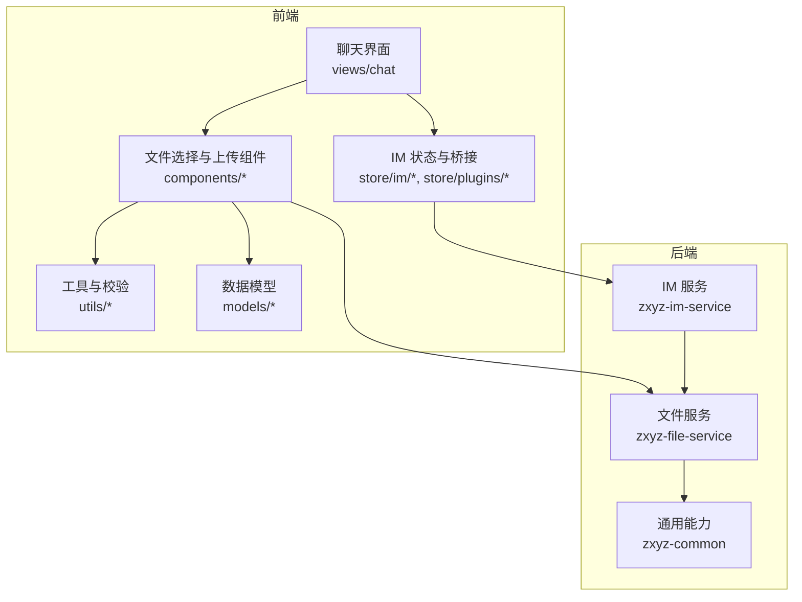
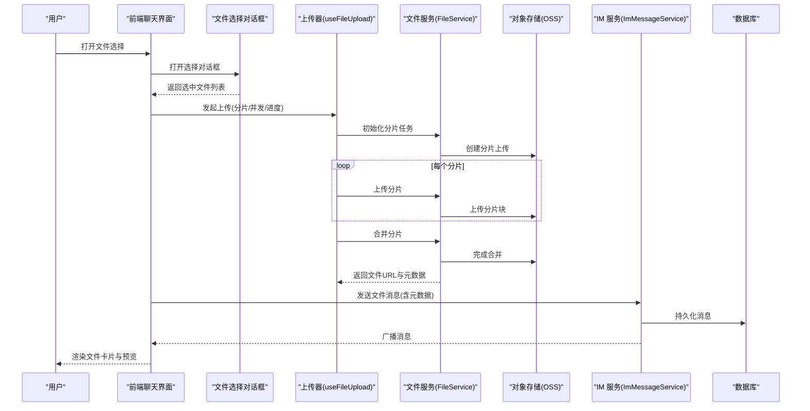
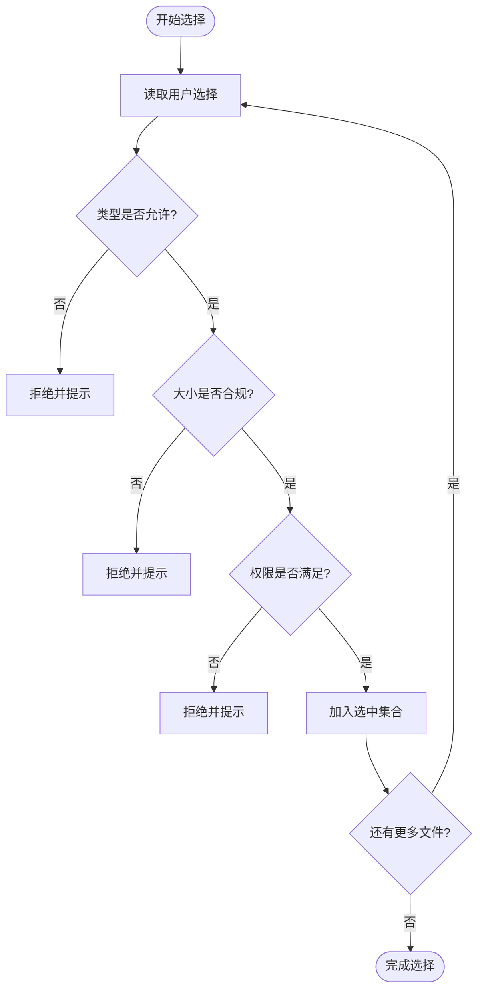
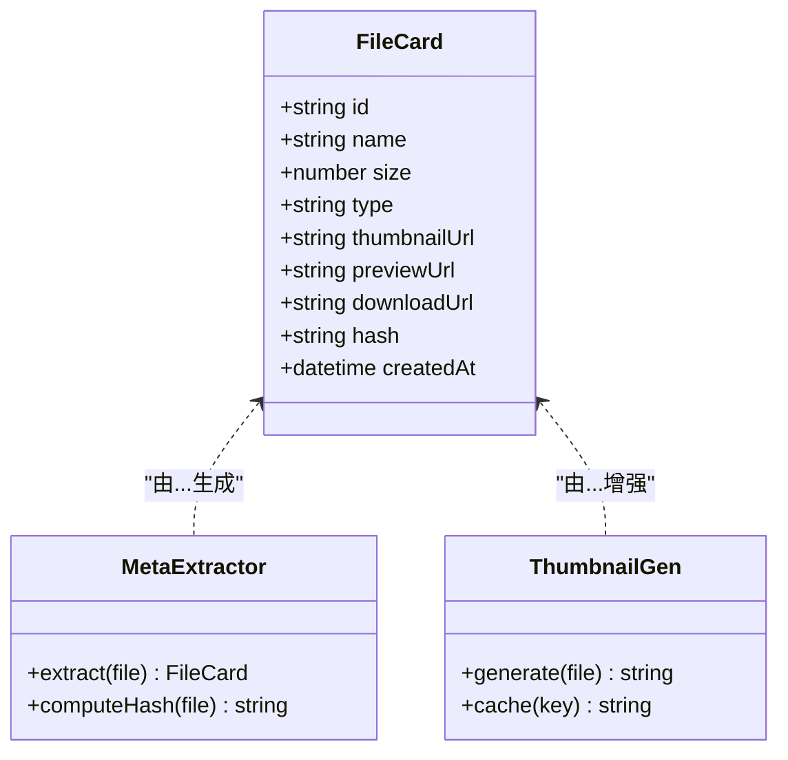
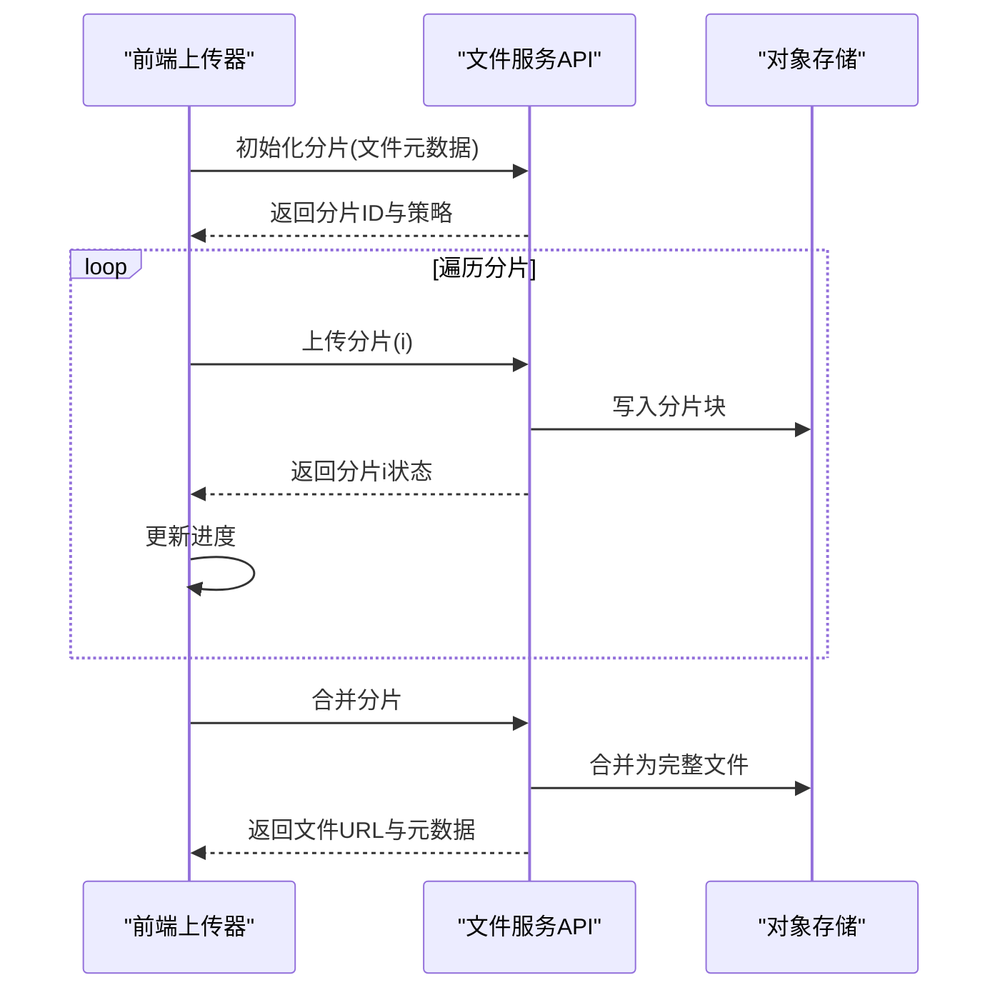
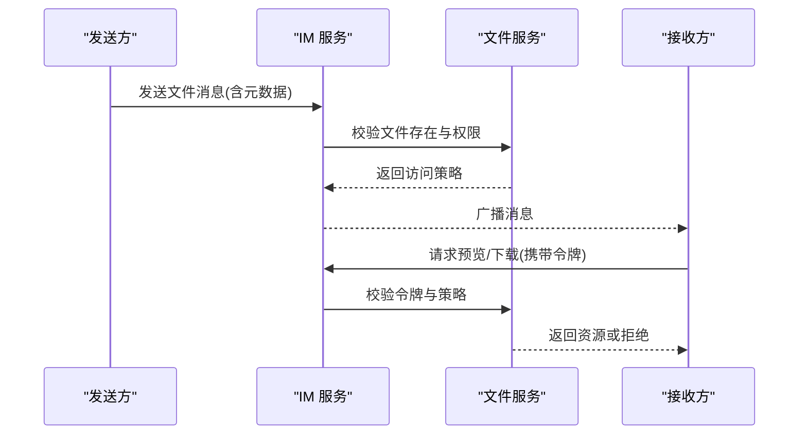
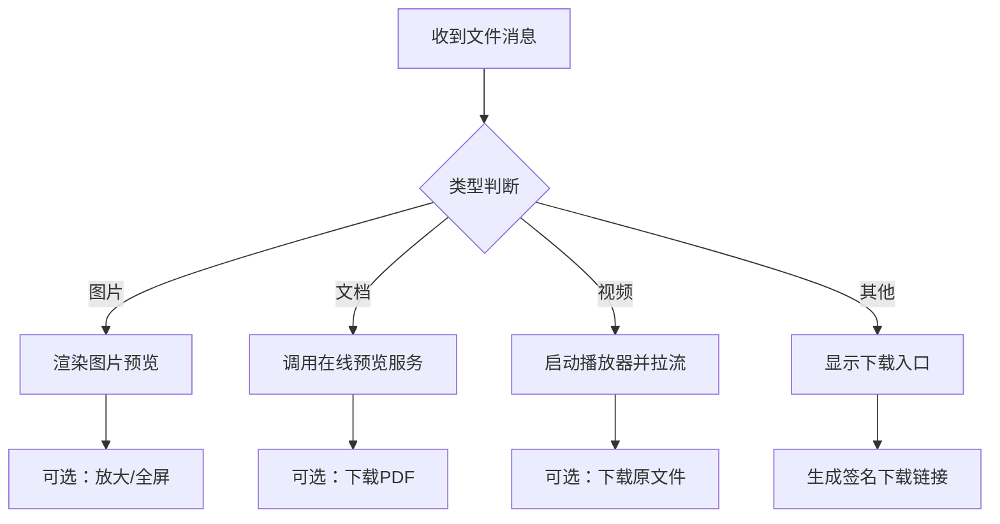
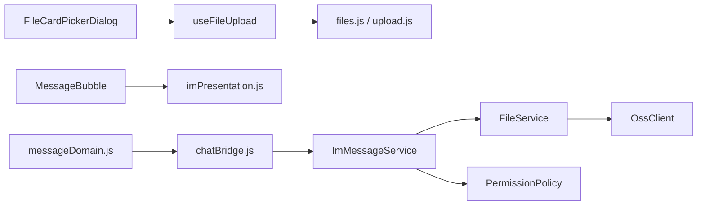

# 文件分享功能

<cite>
**本文引用的文件**   
- [ZXYZdatabaseFront/src/components/FileCardPickerDialog.vue](file://ZXYZdatabaseFront/src/components/FileCardPickerDialog.vue)
- [ZXYZdatabaseFront/src/components/FileUploader.vue](file://ZXYZdatabaseFront/src/components/FileUploader.vue)
- [ZXYZdatabaseFront/src/components/uploader/shared.js](file://ZXYZdatabaseFront/src/components/uploader/shared.js)
- [ZXYZdatabaseFront/src/composables/useFileUpload.js](file://ZXYZdatabaseFront/src/composables/useFileUpload.js)
- [ZXYZdatabaseFront/src/utils/fileValidation.js](file://ZXYZdatabaseFront/src/utils/fileValidation.js)
- [ZXYZdatabaseFront/src/utils/uploadProgress.js](file://ZXYZdatabaseFront/src/utils/uploadProgress.js)
- [ZXYZdatabaseFront/src/models/file.js](file://ZXYZdatabaseFront/src/models/file.js)
- [ZXYZdatabaseFront/src/models/imPresentation.js](file://ZXYZdatabaseFront/src/models/imPresentation.js)
- [ZXYZdatabaseFront/src/services/upload.js](file://ZXYZdatabaseFront/src/services/upload.js)
- [ZXYZdatabaseFront/src/api/files.js](file://ZXYZdatabaseFront/src/api/files.js)
- [ZXYZdatabaseFront/src/views/chat/index.vue](file://ZXYZdatabaseFront/src/views/chat/index.vue)
- [ZXYZdatabaseFront/src/views/chat/components/MessageBubble.vue](file://ZXYZdatabaseFront/src/views/chat/components/MessageBubble.vue)
- [ZXYZdatabaseFront/src/views/chat/components/MessageEditor.vue](file://ZXYZdatabaseFront/src/views/chat/components/MessageEditor.vue)
- [ZXYZdatabaseFront/src/store/im/messageDomain.js](file://ZXYZdatabaseFront/src/store/im/messageDomain.js)
- [ZXYZdatabaseFront/src/store/im/conversationDomain.js](file://ZXYZdatabaseFront/src/store/im/conversationDomain.js)
- [ZXYZdatabaseFront/src/store/plugins/chatBridge.js](file://ZXYZdatabaseFront/src/store/plugins/chatBridge.js)
- [ZXYZdatabaseBack/zxyz-im-service/src/main/java/uno/acloud/im/application/ImMessageService.java](file://ZXYZdatabaseBack/zxyz-im-service/src/main/java/uno/acloud/im/application/ImMessageService.java)
- [ZXYZdatabaseBack/zxyz-file-service/src/main/java/uno/acloud/file/service/FileService.java](file://ZXYZdatabaseBack/zxyz-file-service/src/main/java/uno/acloud/file/service/FileService.java)
- [ZXYZdatabaseBack/zxyz-file-service/src/main/java/uno/acloud/file/controller/FileController.java](file://ZXYZdatabaseBack/zxyz-file-service/src/main/java/uno/acloud/file/controller/FileController.java)
- [ZXYZdatabaseBack/zxyz-common/src/main/java/uno/acloud/common/oss/OssClient.java](file://ZXYZdatabaseBack/zxyz-common/src/main/java/uno/acloud/common/oss/OssClient.java)
- [ZXYZdatabaseBack/zxyz-common/src/main/java/uno/acloud/common/permission/PermissionPolicy.java](file://ZXYZdatabaseBack/zxyz-common/src/main/java/uno/acloud/common/permission/PermissionPolicy.java)
</cite>

## 目录
1. [简介](#简介)
2. [项目结构](#项目结构)
3. [核心组件](#核心组件)
4. [架构总览](#架构总览)
5. [详细组件分析](#详细组件分析)
6. [依赖关系分析](#依赖关系分析)
7. [性能考虑](#性能考虑)
8. [故障排查指南](#故障排查指南)
9. [结论](#结论)
10. [附录：代码示例与最佳实践](#附录代码示例与最佳实践)

## 简介
本技术文档聚焦 ZXYZ 即时通讯模块的文件分享能力，覆盖从前端文件选择、校验、卡片生成到上传（分片、进度、重试、断点续传）、消息封装与发送、权限验证与访问控制，以及预览与下载的全链路实现。文档同时给出架构图、时序图、流程图和关键路径引用，帮助读者快速定位并理解实现细节。

## 项目结构
本项目采用微服务架构，后端包含 IM、文件、共享、用户、团队等独立服务；前端基于 Vue 3 + Element Plus，使用 composables 组织业务逻辑，Pinia 管理状态，并通过内部 ServiceClient 调用后端窄端点。文件分享涉及的关键前端文件位于 components、composables、utils、models、store 等目录；后端主要涉及 zxyz-im-service 与 zxyz-file-service。

图表来源
- [ZXYZdatabaseFront/src/views/chat/index.vue](file://ZXYZdatabaseFront/src/views/chat/index.vue)
- [ZXYZdatabaseFront/src/components/FileCardPickerDialog.vue](file://ZXYZdatabaseFront/src/components/FileCardPickerDialog.vue)
- [ZXYZdatabaseFront/src/composables/useFileUpload.js](file://ZXYZdatabaseFront/src/composables/useFileUpload.js)
- [ZXYZdatabaseBack/zxyz-im-service/src/main/java/uno/acloud/im/application/ImMessageService.java](file://ZXYZdatabaseBack/zxyz-im-service/src/main/java/uno/acloud/im/application/ImMessageService.java)
- [ZXYZdatabaseBack/zxyz-file-service/src/main/java/uno/acloud/file/service/FileService.java](file://ZXYZdatabaseBack/zxyz-file-service/src/main/java/uno/acloud/file/service/FileService.java)

章节来源
- [ZXYZdatabaseFront/src/views/chat/index.vue](file://ZXYZdatabaseFront/src/views/chat/index.vue)
- [ZXYZdatabaseBack/zxyz-im-service/src/main/java/uno/acloud/im/application/ImMessageService.java](file://ZXYZdatabaseBack/zxyz-im-service/src/main/java/uno/acloud/im/application/ImMessageService.java)
- [ZXYZdatabaseBack/zxyz-file-service/src/main/java/uno/acloud/file/service/FileService.java](file://ZXYZdatabaseBack/zxyz-file-service/src/main/java/uno/acloud/file/service/FileService.java)

## 核心组件
- 文件选择与批量选择：通过对话框组件提供多选、类型过滤、大小限制与权限检查。
- 文件卡片生成：提取元数据、生成缩略图、收集预览信息，构造统一卡片数据结构。
- 文件上传：支持分片上传、进度跟踪、错误重试与断点续传。
- 消息处理：定义文件消息格式，解析内容，进行权限验证与访问控制。
- 预览与下载：图片预览、文档查看、视频播放与下载链接生成。

章节来源
- [ZXYZdatabaseFront/src/components/FileCardPickerDialog.vue](file://ZXYZdatabaseFront/src/components/FileCardPickerDialog.vue)
- [ZXYZdatabaseFront/src/components/FileUploader.vue](file://ZXYZdatabaseFront/src/components/FileUploader.vue)
- [ZXYZdatabaseFront/src/composables/useFileUpload.js](file://ZXYZdatabaseFront/src/composables/useFileUpload.js)
- [ZXYZdatabaseFront/src/utils/fileValidation.js](file://ZXYZdatabaseFront/src/utils/fileValidation.js)
- [ZXYZdatabaseFront/src/models/file.js](file://ZXYZdatabaseFront/src/models/file.js)
- [ZXYZdatabaseFront/src/models/imPresentation.js](file://ZXYZdatabaseFront/src/models/imPresentation.js)

## 架构总览
文件分享的整体流程如下：用户在聊天界面选择文件，前端完成类型与大小校验后生成文件卡片；随后触发分片上传至对象存储，服务端记录元数据并返回可访问的 URL；IM 服务将文件消息持久化并广播给会话成员；接收端根据消息中的元数据进行渲染与预览。

图表来源
- [ZXYZdatabaseFront/src/views/chat/index.vue](file://ZXYZdatabaseFront/src/views/chat/index.vue)
- [ZXYZdatabaseFront/src/components/FileCardPickerDialog.vue](file://ZXYZdatabaseFront/src/components/FileCardPickerDialog.vue)
- [ZXYZdatabaseFront/src/composables/useFileUpload.js](file://ZXYZdatabaseFront/src/composables/useFileUpload.js)
- [ZXYZdatabaseBack/zxyz-file-service/src/main/java/uno/acloud/file/service/FileService.java](file://ZXYZdatabaseBack/zxyz-file-service/src/main/java/uno/acloud/file/service/FileService.java)
- [ZXYZdatabaseBack/zxyz-common/src/main/java/uno/acloud/common/oss/OssClient.java](file://ZXYZdatabaseBack/zxyz-common/src/main/java/uno/acloud/common/oss/OssClient.java)
- [ZXYZdatabaseBack/zxyz-im-service/src/main/java/uno/acloud/im/application/ImMessageService.java](file://ZXYZdatabaseBack/zxyz-im-service/src/main/java/uno/acloud/im/application/ImMessageService.java)

## 详细组件分析

### 文件选择机制
- 文件类型验证：在工具层集中维护允许的类型白名单与 MIME 映射，选择时进行扩展名与 MIME 双重校验。
- 大小限制检查：依据配置或策略限制单文件大小与批量总大小，超限提示并阻止选择。
- 权限控制：结合用户角色与团队策略，对敏感类型或大文件进行拦截或要求额外审批。
- 批量选择：支持多选、全选、反选与按类型筛选，提供统一的选中集合管理与去重。

图表来源
- [ZXYZdatabaseFront/src/utils/fileValidation.js](file://ZXYZdatabaseFront/src/utils/fileValidation.js)
- [ZXYZdatabaseFront/src/components/FileCardPickerDialog.vue](file://ZXYZdatabaseFront/src/components/FileCardPickerDialog.vue)

章节来源
- [ZXYZdatabaseFront/src/utils/fileValidation.js](file://ZXYZdatabaseFront/src/utils/fileValidation.js)
- [ZXYZdatabaseFront/src/components/FileCardPickerDialog.vue](file://ZXYZdatabaseFront/src/components/FileCardPickerDialog.vue)

### 文件卡片生成
- 元数据提取：文件名、大小、MIME、修改时间、哈希值等。
- 缩略图生成：对图片类文件生成缩略图，缓存以避免重复计算。
- 预览信息收集：根据类型决定预览方式（图片直链、文档在线预览、视频播放器）。
- 卡片数据结构：统一字段包括 id、name、size、type、thumbnailUrl、previewUrl、downloadUrl、hash、createdAt 等。

图表来源
- [ZXYZdatabaseFront/src/models/file.js](file://ZXYZdatabaseFront/src/models/file.js)
- [ZXYZdatabaseFront/src/components/FileCardPickerDialog.vue](file://ZXYZdatabaseFront/src/components/FileCardPickerDialog.vue)

章节来源
- [ZXYZdatabaseFront/src/models/file.js](file://ZXYZdatabaseFront/src/models/file.js)
- [ZXYZdatabaseFront/src/components/FileCardPickerDialog.vue](file://ZXYZdatabaseFront/src/components/FileCardPickerDialog.vue)

### 文件上传流程（分片、进度、重试、断点续传）
- 分片上传：将大文件切分为固定大小的分片，并发上传以提升吞吐。
- 进度跟踪：实时上报已上传字节数与百分比，驱动 UI 反馈。
- 错误重试：网络异常或服务器错误时自动重试，指数退避。
- 断点续传：基于分片哈希与服务器状态，跳过已上传的分片。

图表来源
- [ZXYZdatabaseFront/src/composables/useFileUpload.js](file://ZXYZdatabaseFront/src/composables/useFileUpload.js)
- [ZXYZdatabaseFront/src/components/FileUploader.vue](file://ZXYZdatabaseFront/src/components/FileUploader.vue)
- [ZXYZdatabaseFront/src/utils/uploadProgress.js](file://ZXYZdatabaseFront/src/utils/uploadProgress.js)
- [ZXYZdatabaseBack/zxyz-file-service/src/main/java/uno/acloud/file/service/FileService.java](file://ZXYZdatabaseBack/zxyz-file-service/src/main/java/uno/acloud/file/service/FileService.java)
- [ZXYZdatabaseBack/zxyz-common/src/main/java/uno/acloud/common/oss/OssClient.java](file://ZXYZdatabaseBack/zxyz-common/src/main/java/uno/acloud/common/oss/OssClient.java)

章节来源
- [ZXYZdatabaseFront/src/composables/useFileUpload.js](file://ZXYZdatabaseFront/src/composables/useFileUpload.js)
- [ZXYZdatabaseFront/src/components/FileUploader.vue](file://ZXYZdatabaseFront/src/components/FileUploader.vue)
- [ZXYZdatabaseFront/src/utils/uploadProgress.js](file://ZXYZdatabaseFront/src/utils/uploadProgress.js)
- [ZXYZdatabaseBack/zxyz-file-service/src/main/java/uno/acloud/file/service/FileService.java](file://ZXYZdatabaseBack/zxyz-file-service/src/main/java/uno/acloud/file/service/FileService.java)

### 文件分享消息处理
- 消息格式定义：包含消息类型、发送者、时间戳、文件元数据、访问令牌与有效期。
- 内容解析：接收端解析消息体，校验签名与权限，构建渲染所需的数据。
- 权限验证与访问控制：基于用户角色、团队策略与分享策略，决定是否允许预览/下载。
- 访问控制：短效令牌、IP/UA 限制、下载次数限制、过期时间控制。

图表来源
- [ZXYZdatabaseFront/src/models/imPresentation.js](file://ZXYZdatabaseFront/src/models/imPresentation.js)
- [ZXYZdatabaseBack/zxyz-im-service/src/main/java/uno/acloud/im/application/ImMessageService.java](file://ZXYZdatabaseBack/zxyz-im-service/src/main/java/uno/acloud/im/application/ImMessageService.java)
- [ZXYZdatabaseBack/zxyz-file-service/src/main/java/uno/acloud/file/controller/FileController.java](file://ZXYZdatabaseBack/zxyz-file-service/src/main/java/uno/acloud/file/controller/FileController.java)
- [ZXYZdatabaseBack/zxyz-common/src/main/java/uno/acloud/common/permission/PermissionPolicy.java](file://ZXYZdatabaseBack/zxyz-common/src/main/java/uno/acloud/common/permission/PermissionPolicy.java)

章节来源
- [ZXYZdatabaseFront/src/models/imPresentation.js](file://ZXYZdatabaseFront/src/models/imPresentation.js)
- [ZXYZdatabaseBack/zxyz-im-service/src/main/java/uno/acloud/im/application/ImMessageService.java](file://ZXYZdatabaseBack/zxyz-im-service/src/main/java/uno/acloud/im/application/ImMessageService.java)
- [ZXYZdatabaseBack/zxyz-file-service/src/main/java/uno/acloud/file/controller/FileController.java](file://ZXYZdatabaseBack/zxyz-file-service/src/main/java/uno/acloud/file/controller/FileController.java)
- [ZXYZdatabaseBack/zxyz-common/src/main/java/uno/acloud/common/permission/PermissionPolicy.java](file://ZXYZdatabaseBack/zxyz-common/src/main/java/uno/acloud/common/permission/PermissionPolicy.java)

### 文件预览功能
- 图片预览：直接加载缩略图或原图，支持缩放与全屏。
- 文档查看：通过在线预览服务或转换后的 HTML/PDF 展示。
- 视频播放：流式播放，支持自适应码率与字幕。
- 下载链接：生成带签名的短期下载链接，限制次数与有效期。

图表来源
- [ZXYZdatabaseFront/src/views/chat/components/MessageBubble.vue](file://ZXYZdatabaseFront/src/views/chat/components/MessageBubble.vue)
- [ZXYZdatabaseFront/src/models/imPresentation.js](file://ZXYZdatabaseFront/src/models/imPresentation.js)

章节来源
- [ZXYZdatabaseFront/src/views/chat/components/MessageBubble.vue](file://ZXYZdatabaseFront/src/views/chat/components/MessageBubble.vue)
- [ZXYZdatabaseFront/src/models/imPresentation.js](file://ZXYZdatabaseFront/src/models/imPresentation.js)

## 依赖关系分析
- 前端依赖：
  - 组件层：FileCardPickerDialog、FileUploader、MessageBubble、MessageEditor。
  - 工具层：fileValidation、uploadProgress、shared。
  - 模型层：file、imPresentation。
  - 状态层：messageDomain、conversationDomain、chatBridge。
- 后端依赖：
  - IM 服务依赖文件服务获取元数据与访问策略。
  - 文件服务依赖对象存储进行分片上传与合并。
  - 权限策略由公共模块提供，贯穿 IM 与文件服务。

图表来源
- [ZXYZdatabaseFront/src/components/FileCardPickerDialog.vue](file://ZXYZdatabaseFront/src/components/FileCardPickerDialog.vue)
- [ZXYZdatabaseFront/src/composables/useFileUpload.js](file://ZXYZdatabaseFront/src/composables/useFileUpload.js)
- [ZXYZdatabaseFront/src/api/files.js](file://ZXYZdatabaseFront/src/api/files.js)
- [ZXYZdatabaseFront/src/services/upload.js](file://ZXYZdatabaseFront/src/services/upload.js)
- [ZXYZdatabaseFront/src/views/chat/components/MessageBubble.vue](file://ZXYZdatabaseFront/src/views/chat/components/MessageBubble.vue)
- [ZXYZdatabaseFront/src/models/imPresentation.js](file://ZXYZdatabaseFront/src/models/imPresentation.js)
- [ZXYZdatabaseFront/src/store/im/messageDomain.js](file://ZXYZdatabaseFront/src/store/im/messageDomain.js)
- [ZXYZdatabaseFront/src/store/plugins/chatBridge.js](file://ZXYZdatabaseFront/src/store/plugins/chatBridge.js)
- [ZXYZdatabaseBack/zxyz-im-service/src/main/java/uno/acloud/im/application/ImMessageService.java](file://ZXYZdatabaseBack/zxyz-im-service/src/main/java/uno/acloud/im/application/ImMessageService.java)
- [ZXYZdatabaseBack/zxyz-file-service/src/main/java/uno/acloud/file/service/FileService.java](file://ZXYZdatabaseBack/zxyz-file-service/src/main/java/uno/acloud/file/service/FileService.java)
- [ZXYZdatabaseBack/zxyz-common/src/main/java/uno/acloud/common/oss/OssClient.java](file://ZXYZdatabaseBack/zxyz-common/src/main/java/uno/acloud/common/oss/OssClient.java)
- [ZXYZdatabaseBack/zxyz-common/src/main/java/uno/acloud/common/permission/PermissionPolicy.java](file://ZXYZdatabaseBack/zxyz-common/src/main/java/uno/acloud/common/permission/PermissionPolicy.java)

章节来源
- [ZXYZdatabaseFront/src/components/FileCardPickerDialog.vue](file://ZXYZdatabaseFront/src/components/FileCardPickerDialog.vue)
- [ZXYZdatabaseFront/src/composables/useFileUpload.js](file://ZXYZdatabaseFront/src/composables/useFileUpload.js)
- [ZXYZdatabaseFront/src/api/files.js](file://ZXYZdatabaseFront/src/api/files.js)
- [ZXYZdatabaseFront/src/services/upload.js](file://ZXYZdatabaseFront/src/services/upload.js)
- [ZXYZdatabaseFront/src/views/chat/components/MessageBubble.vue](file://ZXYZdatabaseFront/src/views/chat/components/MessageBubble.vue)
- [ZXYZdatabaseFront/src/models/imPresentation.js](file://ZXYZdatabaseFront/src/models/imPresentation.js)
- [ZXYZdatabaseFront/src/store/im/messageDomain.js](file://ZXYZdatabaseFront/src/store/im/messageDomain.js)
- [ZXYZdatabaseFront/src/store/plugins/chatBridge.js](file://ZXYZdatabaseFront/src/store/plugins/chatBridge.js)
- [ZXYZdatabaseBack/zxyz-im-service/src/main/java/uno/acloud/im/application/ImMessageService.java](file://ZXYZdatabaseBack/zxyz-im-service/src/main/java/uno/acloud/im/application/ImMessageService.java)
- [ZXYZdatabaseBack/zxyz-file-service/src/main/java/uno/acloud/file/service/FileService.java](file://ZXYZdatabaseBack/zxyz-file-service/src/main/java/uno/acloud/file/service/FileService.java)
- [ZXYZdatabaseBack/zxyz-common/src/main/java/uno/acloud/common/oss/OssClient.java](file://ZXYZdatabaseBack/zxyz-common/src/main/java/uno/acloud/common/oss/OssClient.java)
- [ZXYZdatabaseBack/zxyz-common/src/main/java/uno/acloud/common/permission/PermissionPolicy.java](file://ZXYZdatabaseBack/zxyz-common/src/main/java/uno/acloud/common/permission/PermissionPolicy.java)

## 性能考虑
- 异步处理：上传与预览均使用异步任务，避免阻塞 UI；消息广播采用事件驱动。
- 缓存机制：缩略图与预览结果本地缓存，减少重复生成与请求；分片状态在服务端缓存以支持断点续传。
- 带宽优化：分片并发度可调，按需启用压缩与懒加载；预览优先加载缩略图，按需加载原图。
- 重试与退避：网络失败指数退避重试，降低瞬时抖动影响。
- 内存管理：大文件分片上传避免一次性加载；预览组件销毁时释放资源。

[本节为通用指导，不直接分析具体文件]

## 故障排查指南
- 文件选择失败：检查类型白名单与 MIME 映射是否正确；确认大小限制配置；查看权限策略是否拦截。
- 上传中断：核对分片大小与并发设置；检查对象存储配额与限流；查看重试策略与退避参数。
- 预览失败：确认预览服务可用性；检查令牌有效期与访问策略；验证跨域与鉴权头。
- 消息未达：检查 IM 服务健康与队列消费；确认消息序列化与反序列化一致；查看权限校验日志。

章节来源
- [ZXYZdatabaseFront/src/utils/fileValidation.js](file://ZXYZdatabaseFront/src/utils/fileValidation.js)
- [ZXYZdatabaseFront/src/composables/useFileUpload.js](file://ZXYZdatabaseFront/src/composables/useFileUpload.js)
- [ZXYZdatabaseFront/src/utils/uploadProgress.js](file://ZXYZdatabaseFront/src/utils/uploadProgress.js)
- [ZXYZdatabaseBack/zxyz-file-service/src/main/java/uno/acloud/file/service/FileService.java](file://ZXYZdatabaseBack/zxyz-file-service/src/main/java/uno/acloud/file/service/FileService.java)
- [ZXYZdatabaseBack/zxyz-im-service/src/main/java/uno/acloud/im/application/ImMessageService.java](file://ZXYZdatabaseBack/zxyz-im-service/src/main/java/uno/acloud/im/application/ImMessageService.java)

## 结论
文件分享功能在前端通过组件化与组合式逻辑实现了健壮的选择、校验与上传体验；在后端通过 IM 与文件服务的协作，提供了安全、可控且可扩展的消息与资源管理能力。通过分片上传、断点续传、权限策略与预览优化，整体方案兼顾了性能与安全。建议在生产环境持续监控上传成功率、预览延迟与权限拒绝率，并根据业务策略动态调整分片大小与并发度。

[本节为总结性内容，不直接分析具体文件]

## 附录：代码示例与最佳实践
- 文件选择与校验
  - 参考路径：[文件选择对话框](file://ZXYZdatabaseFront/src/components/FileCardPickerDialog.vue)、[类型与大小校验](file://ZXYZdatabaseFront/src/utils/fileValidation.js)
  - 最佳实践：统一白名单、MIME 与扩展名双检；批量选择前预聚合大小与类型统计。
- 卡片生成与预览
  - 参考路径：[文件模型](file://ZXYZdatabaseFront/src/models/file.js)、[IM 展示模型](file://ZXYZdatabaseFront/src/models/imPresentation.js)、[消息气泡渲染](file://ZXYZdatabaseFront/src/views/chat/components/MessageBubble.vue)
  - 最佳实践：缩略图缓存键包含文件哈希与尺寸；预览链接带短效令牌与访问计数。
- 上传与进度
  - 参考路径：[上传组合式函数](file://ZXYZdatabaseFront/src/composables/useFileUpload.js)、[上传组件](file://ZXYZdatabaseFront/src/components/FileUploader.vue)、[进度工具](file://ZXYZdatabaseFront/src/utils/uploadProgress.js)、[上传服务](file://ZXYZdatabaseFront/src/services/upload.js)
  - 最佳实践：分片大小按网络与设备动态调整；失败重试上限与退避策略可配置；断点续传需与服务端分片状态一致。
- 消息发送与权限
  - 参考路径：[消息编辑器](file://ZXYZdatabaseFront/src/views/chat/components/MessageEditor.vue)、[消息领域](file://ZXYZdatabaseFront/src/store/im/messageDomain.js)、[对话领域](file://ZXYZdatabaseFront/src/store/im/conversationDomain.js)、[聊天桥接](file://ZXYZdatabaseFront/src/store/plugins/chatBridge.js)
  - 最佳实践：消息体最小化，仅携带必要元数据；权限校验在服务端统一执行，前端只负责展示与交互。

章节来源
- [ZXYZdatabaseFront/src/components/FileCardPickerDialog.vue](file://ZXYZdatabaseFront/src/components/FileCardPickerDialog.vue)
- [ZXYZdatabaseFront/src/utils/fileValidation.js](file://ZXYZdatabaseFront/src/utils/fileValidation.js)
- [ZXYZdatabaseFront/src/models/file.js](file://ZXYZdatabaseFront/src/models/file.js)
- [ZXYZdatabaseFront/src/models/imPresentation.js](file://ZXYZdatabaseFront/src/models/imPresentation.js)
- [ZXYZdatabaseFront/src/views/chat/components/MessageBubble.vue](file://ZXYZdatabaseFront/src/views/chat/components/MessageBubble.vue)
- [ZXYZdatabaseFront/src/composables/useFileUpload.js](file://ZXYZdatabaseFront/src/composables/useFileUpload.js)
- [ZXYZdatabaseFront/src/components/FileUploader.vue](file://ZXYZdatabaseFront/src/components/FileUploader.vue)
- [ZXYZdatabaseFront/src/utils/uploadProgress.js](file://ZXYZdatabaseFront/src/utils/uploadProgress.js)
- [ZXYZdatabaseFront/src/services/upload.js](file://ZXYZdatabaseFront/src/services/upload.js)
- [ZXYZdatabaseFront/src/views/chat/components/MessageEditor.vue](file://ZXYZdatabaseFront/src/views/chat/components/MessageEditor.vue)
- [ZXYZdatabaseFront/src/store/im/messageDomain.js](file://ZXYZdatabaseFront/src/store/im/messageDomain.js)
- [ZXYZdatabaseFront/src/store/im/conversationDomain.js](file://ZXYZdatabaseFront/src/store/im/conversationDomain.js)
- [ZXYZdatabaseFront/src/store/plugins/chatBridge.js](file://ZXYZdatabaseFront/src/store/plugins/chatBridge.js)