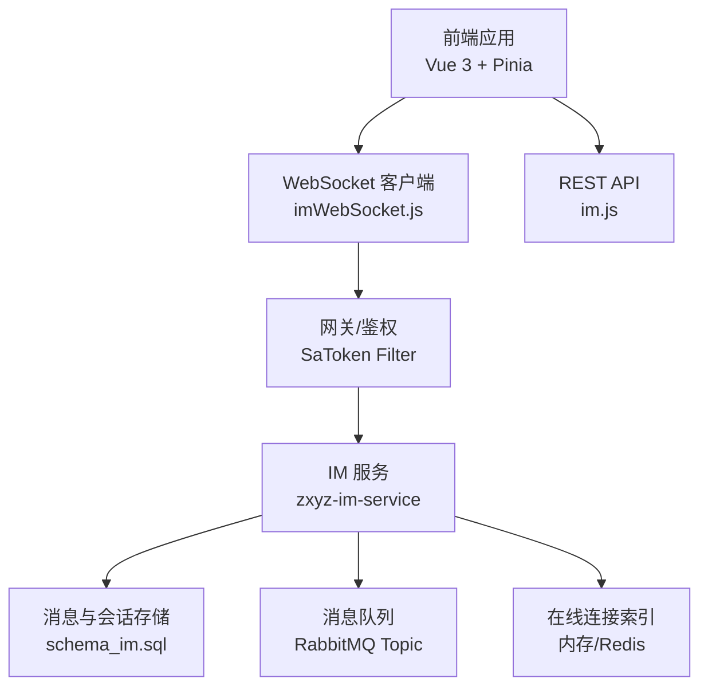
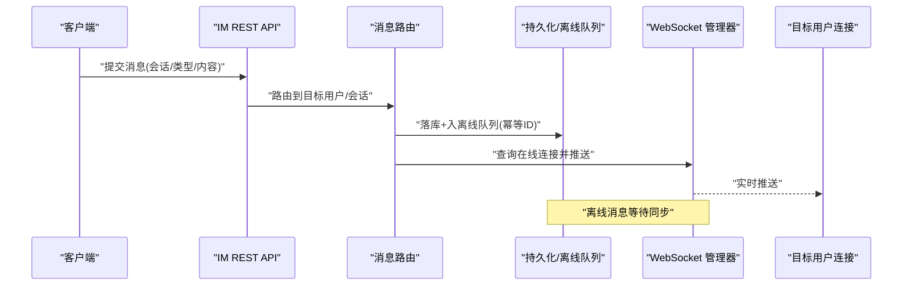
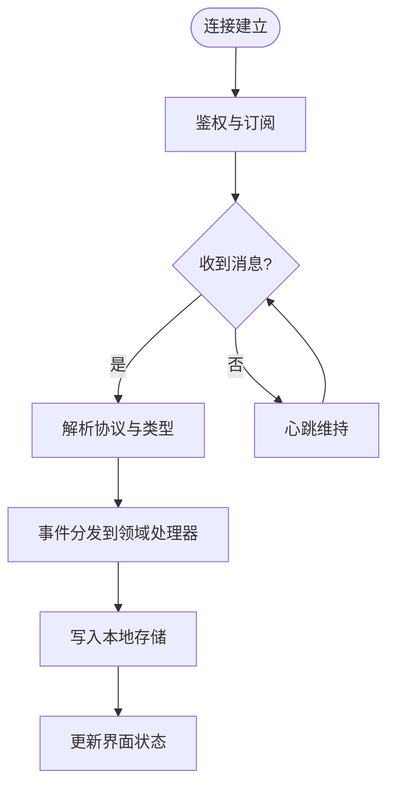
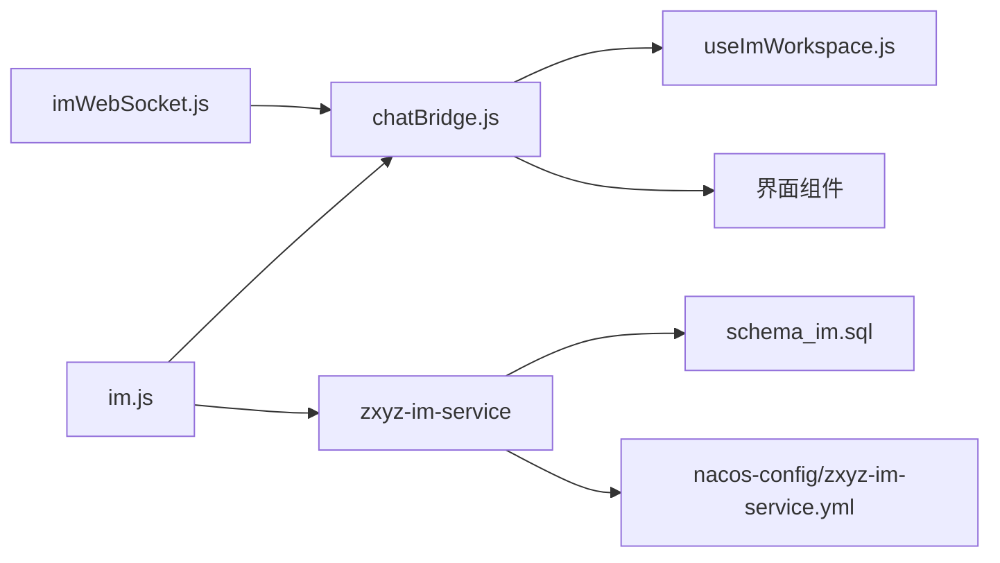

# 消息推送机制

<cite>
**本文引用的文件**   
- [zxyz-im-service/src/main/java/uno/acloud/im/ZxyzImApplication.java](file://ZXYZdatabaseBack/zxyz-im-service/src/main/java/uno/acloud/im/ZxyzImApplication.java)
- [zxyz-im-service/src/main/resources/application.yml](file://ZXYZdatabaseBack/zxyz-im-service/src/main/resources/application.yml)
- [zxyz-im-service/src/main/resources/application-dev.yml](file://ZXYZdatabaseBack/zxyz-im-service/src/main/resources/application-dev.yml)
- [zxyz-im-service/src/main/resources/application-prod.yml](file://ZXYZdatabaseBack/zxyz-im-service/src/main/resources/application-prod.yml)
- [ZXYZdatabaseFront/src/utils/imWebSocket.js](file://ZXYZdatabaseFront/src/utils/imWebSocket.js)
- [ZXYZdatabaseFront/src/store/plugins/chatBridge.js](file://ZXYZdatabaseFront/src/store/plugins/chatBridge.js)
- [ZXYZdatabaseFront/src/composables/useImWorkspace.js](file://ZXYZdatabaseFront/src/composables/useImWorkspace.js)
- [ZXYZdatabaseFront/src/api/im.js](file://ZXYZdatabaseFront/src/api/im.js)
- [ZXYZdatabaseBack/nacos-config/zxyz-im-service.yml](file://ZXYZdatabaseBack/nacos-config/zxyz-im-service.yml)
- [ZXYZdatabaseBack/sql/schema_im.sql](file://ZXYZdatabaseBack/ZXYZdatabaseBack/sql/schema_im.sql)
</cite>

## 目录
1. [简介](#简介)
2. [项目结构](#项目结构)
3. [核心组件](#核心组件)
4. [架构总览](#架构总览)
5. [详细组件分析](#详细组件分析)
6. [依赖关系分析](#依赖关系分析)
7. [性能考量](#性能考量)
8. [故障排查指南](#故障排查指南)
9. [结论](#结论)
10. [附录：端到端示例与最佳实践](#附录：端到端示例与最佳实践)

## 简介
本技术文档聚焦 ZXYZ 即时通讯模块的消息推送机制，覆盖服务端推送实现（消息路由、目标用户查找、连接管理、推送策略）、客户端接收处理（WebSocket 建立、消息解析、事件分发、本地存储）、消息去重（唯一标识、重复检测、幂等、冲突解决）、离线消息（缓存、持久化、同步、清理）以及推送优化（批量、优先级、流量控制、错误重试）。同时给出端到端的代码示例路径与性能优化建议，帮助读者快速理解并落地实现。

## 项目结构
ZXYZ 采用微服务架构，IM 能力由 zxyz-im-service 提供，前端通过 WebSocket 与 IM 服务通信，并通过 REST API 完成会话与消息的查询、历史拉取等操作。Nacos 集中管理配置，RabbitMQ 用于异步事件与解耦，数据库用于持久化消息与会话元数据。

图表来源
- [ZXYZdatabaseFront/src/utils/imWebSocket.js](file://ZXYZdatabaseFront/src/utils/imWebSocket.js)
- [ZXYZdatabaseFront/src/api/im.js](file://ZXYZdatabaseFront/src/api/im.js)
- [ZXYZdatabaseBack/zxyz-im-service/src/main/java/uno/acloud/im/ZxyzImApplication.java](file://ZXYZdatabaseBack/zxyz-im-service/src/main/java/uno/acloud/im/ZxyzImApplication.java)
- [ZXYZdatabaseBack/ZXYZdatabaseBack/sql/schema_im.sql](file://ZXYZdatabaseBack/ZXYZdatabaseBack/sql/schema_im.sql)

章节来源
- [ZXYZdatabaseBack/zxyz-im-service/src/main/java/uno/acloud/im/ZxyzImApplication.java](file://ZXYZdatabaseBack/zxyz-im-service/src/main/java/uno/acloud/im/ZxyzImApplication.java)
- [ZXYZdatabaseBack/zxyz-im-service/src/main/resources/application.yml](file://ZXYZdatabaseBack/zxyz-im-service/src/main/resources/application.yml)
- [ZXYZdatabaseBack/nacos-config/zxyz-im-service.yml](file://ZXYZdatabaseBack/nacos-config/zxyz-im-service.yml)

## 核心组件
- 服务端 IM 服务（zxyz-im-service）
  - 启动入口与装配：ZxyzImApplication
  - 配置中心集成：application.yml / application-{env}.yml / nacos 配置
  - 数据模型与持久化：schema_im.sql
- 前端 WebSocket 客户端
  - 连接管理与心跳：imWebSocket.js
  - 状态桥接与事件分发：chatBridge.js
  - 业务编排与上下文：useImWorkspace.js
  - REST 接口封装：im.js

章节来源
- [ZXYZdatabaseBack/zxyz-im-service/src/main/java/uno/acloud/im/ZxyzImApplication.java](file://ZXYZdatabaseBack/zxyz-im-service/src/main/java/uno/acloud/im/ZxyzImApplication.java)
- [ZXYZdatabaseBack/zxyz-im-service/src/main/resources/application.yml](file://ZXYZdatabaseBack/zxyz-im-service/src/main/resources/application.yml)
- [ZXYZdatabaseBack/zxyz-im-service/src/main/resources/application-dev.yml](file://ZXYZdatabaseBack/zxyz-im-service/src/main/resources/application-dev.yml)
- [ZXYZdatabaseBack/zxyz-im-service/src/main/resources/application-prod.yml](file://ZXYZdatabaseBack/zxyz-im-service/src/main/resources/application-prod.yml)
- [ZXYZdatabaseFront/src/utils/imWebSocket.js](file://ZXYZdatabaseFront/src/utils/imWebSocket.js)
- [ZXYZdatabaseFront/src/store/plugins/chatBridge.js](file://ZXYZdatabaseFront/src/store/plugins/chatBridge.js)
- [ZXYZdatabaseFront/src/composables/useImWorkspace.js](file://ZXYZdatabaseFront/src/composables/useImWorkspace.js)
- [ZXYZdatabaseFront/src/api/im.js](file://ZXYZdatabaseFront/src/api/im.js)
- [ZXYZdatabaseBack/ZXYZdatabaseBack/sql/schema_im.sql](file://ZXYZdatabaseBack/ZXYZdatabaseBack/sql/schema_im.sql)

## 架构总览
IM 推送链路包含“发送 → 路由 → 投递”三部分：
- 发送侧：调用方通过 REST 或内部接口提交消息，IM 服务生成唯一消息 ID，写入持久层与离线队列。
- 路由侧：根据目标用户/会话维度查找在线连接，按优先级与批量策略组织推送。
- 投递侧：通过 WebSocket 向在线用户推送；离线用户进入离线消息队列，后续由同步任务拉取。

图表来源
- [ZXYZdatabaseBack/zxyz-im-service/src/main/java/uno/acloud/im/ZxyzImApplication.java](file://ZXYZdatabaseBack/zxyz-im-service/src/main/java/uno/acloud/im/ZxyzImApplication.java)
- [ZXYZdatabaseFront/src/api/im.js](file://ZXYZdatabaseFront/src/api/im.js)

## 详细组件分析

### 服务端推送实现
- 消息路由
  - 依据会话类型（私聊/群聊）与成员列表计算目标用户集合。
  - 对同一会话的多条消息进行批量化聚合，降低网络开销。
- 目标用户查找
  - 基于用户 ID 映射到 WebSocket 连接句柄，支持多设备在线。
  - 结合权限校验与可见性规则过滤不可达目标。
- 连接管理
  - 连接生命周期：握手认证 → 心跳保活 → 断线重连 → 资源释放。
  - 连接池/会话表维护活跃连接，异常断开时触发清理与离线标记。
- 推送策略
  - 优先级：系统通知 > 重要消息 > 普通消息。
  - 批量：同会话短窗口内合并推送，减少帧数量。
  - 限流：按用户/会话维度令牌桶或滑动窗口控制速率。
  - 重试：指数退避 + 死信队列兜底，保证最终可达。

章节来源
- [ZXYZdatabaseBack/zxyz-im-service/src/main/java/uno/acloud/im/ZxyzImApplication.java](file://ZXYZdatabaseBack/zxyz-im-service/src/main/java/uno/acloud/im/ZxyzImApplication.java)
- [ZXYZdatabaseBack/zxyz-im-service/src/main/resources/application.yml](file://ZXYZdatabaseBack/zxyz-im-service/src/main/resources/application.yml)
- [ZXYZdatabaseBack/nacos-config/zxyz-im-service.yml](file://ZXYZdatabaseBack/nacos-config/zxyz-im-service.yml)

### 客户端接收处理
- WebSocket 连接建立
  - 使用 imWebSocket.js 封装连接、鉴权头注入、自动重连与心跳。
  - 连接成功后订阅频道（如会话级或用户级），确保消息定向投递。
- 消息解析与事件分发
  - 统一协议解析为内部事件对象，按类型分发至聊天域、通知域等。
  - chatBridge.js 将事件写入 Pinia store，驱动 UI 更新。
- 本地存储
  - 消息落盘（IndexedDB/LocalStorage）保障离线可回溯。
  - 增量同步：以时间戳/游标拉取未读消息，避免全量覆盖。

图表来源
- [ZXYZdatabaseFront/src/utils/imWebSocket.js](file://ZXYZdatabaseFront/src/utils/imWebSocket.js)
- [ZXYZdatabaseFront/src/store/plugins/chatBridge.js](file://ZXYZdatabaseFront/src/store/plugins/chatBridge.js)

章节来源
- [ZXYZdatabaseFront/src/utils/imWebSocket.js](file://ZXYZdatabaseFront/src/utils/imWebSocket.js)
- [ZXYZdatabaseFront/src/store/plugins/chatBridge.js](file://ZXYZdatabaseFront/src/store/plugins/chatBridge.js)
- [ZXYZdatabaseFront/src/composables/useImWorkspace.js](file://ZXYZdatabaseFront/src/composables/useImWorkspace.js)

### 消息去重机制
- 唯一标识生成
  - 服务端生成全局唯一消息 ID（如雪花算法），并在协议中透传。
- 重复检测
  - 客户端基于消息 ID 去重，避免重复渲染。
  - 服务端在幂等写入时使用唯一约束或去重表。
- 幂等处理
  - 发送端携带幂等键，服务端按幂等键去重投递。
- 冲突解决
  - 针对并发编辑/撤回场景，使用时间戳与版本号进行合并与回滚。

章节来源
- [ZXYZdatabaseBack/ZXYZdatabaseBack/sql/schema_im.sql](file://ZXYZdatabaseBack/ZXYZdatabaseBack/sql/schema_im.sql)
- [ZXYZdatabaseFront/src/utils/imWebSocket.js](file://ZXYZdatabaseFront/src/utils/imWebSocket.js)

### 离线消息处理
- 消息缓存
  - 在线时仅落盘增量，不阻塞推送。
- 持久化存储
  - 消息表与会话表设计支持分页与范围查询。
- 同步策略
  - 客户端上线后按会话拉取未读区间，服务端返回增量集合并去重。
- 清理机制
  - 过期策略（TTL）与归档策略（冷热分离），定期清理无用数据。

章节来源
- [ZXYZdatabaseBack/ZXYZdatabaseBack/sql/schema_im.sql](file://ZXYZdatabaseBack/ZXYZdatabaseBack/sql/schema_im.sql)
- [ZXYZdatabaseFront/src/api/im.js](file://ZXYZdatabaseFront/src/api/im.js)

### 推送优化策略
- 批量推送
  - 同会话短窗口内合并消息，减少帧数与握手成本。
- 优先级处理
  - 高优消息优先出队与投递，低优消息延迟或降级。
- 流量控制
  - 服务端按用户/会话维度限流，客户端自适应降频。
- 错误重试
  - 指数退避 + 最大重试次数 + 死信队列兜底。

章节来源
- [ZXYZdatabaseBack/nacos-config/zxyz-im-service.yml](file://ZXYZdatabaseBack/nacos-config/zxyz-im-service.yml)
- [ZXYZdatabaseBack/zxyz-im-service/src/main/resources/application.yml](file://ZXYZdatabaseBack/zxyz-im-service/src/main/resources/application.yml)

## 依赖关系分析
- 前端依赖
  - imWebSocket.js：WebSocket 连接、心跳、重连、订阅。
  - chatBridge.js：事件桥接到 Pinia store，驱动视图。
  - useImWorkspace.js：会话上下文、消息操作编排。
  - im.js：REST 接口封装（会话、消息、历史拉取）。
- 后端依赖
  - ZxyzImApplication：服务装配与配置加载。
  - schema_im.sql：消息与会话相关表结构。
  - Nacos 配置：动态开关、限流参数、重试策略。

图表来源
- [ZXYZdatabaseFront/src/utils/imWebSocket.js](file://ZXYZdatabaseFront/src/utils/imWebSocket.js)
- [ZXYZdatabaseFront/src/store/plugins/chatBridge.js](file://ZXYZdatabaseFront/src/store/plugins/chatBridge.js)
- [ZXYZdatabaseFront/src/composables/useImWorkspace.js](file://ZXYZdatabaseFront/src/composables/useImWorkspace.js)
- [ZXYZdatabaseFront/src/api/im.js](file://ZXYZdatabaseFront/src/api/im.js)
- [ZXYZdatabaseBack/zxyz-im-service/src/main/java/uno/acloud/im/ZxyzImApplication.java](file://ZXYZdatabaseBack/zxyz-im-service/src/main/java/uno/acloud/im/ZxyzImApplication.java)
- [ZXYZdatabaseBack/ZXYZdatabaseBack/sql/schema_im.sql](file://ZXYZdatabaseBack/ZXYZdatabaseBack/sql/schema_im.sql)
- [ZXYZdatabaseBack/nacos-config/zxyz-im-service.yml](file://ZXYZdatabaseBack/nacos-config/zxyz-im-service.yml)

章节来源
- [ZXYZdatabaseFront/src/utils/imWebSocket.js](file://ZXYZdatabaseFront/src/utils/imWebSocket.js)
- [ZXYZdatabaseFront/src/store/plugins/chatBridge.js](file://ZXYZdatabaseFront/src/store/plugins/chatBridge.js)
- [ZXYZdatabaseFront/src/composables/useImWorkspace.js](file://ZXYZdatabaseFront/src/composables/useImWorkspace.js)
- [ZXYZdatabaseFront/src/api/im.js](file://ZXYZdatabaseFront/src/api/im.js)
- [ZXYZdatabaseBack/zxyz-im-service/src/main/java/uno/acloud/im/ZxyzImApplication.java](file://ZXYZdatabaseBack/zxyz-im-service/src/main/java/uno/acloud/im/ZxyzImApplication.java)
- [ZXYZdatabaseBack/ZXYZdatabaseBack/sql/schema_im.sql](file://ZXYZdatabaseBack/ZXYZdatabaseBack/sql/schema_im.sql)
- [ZXYZdatabaseBack/nacos-config/zxyz-im-service.yml](file://ZXYZdatabaseBack/nacos-config/zxyz-im-service.yml)

## 性能考量
- 连接池管理
  - 服务端维护连接池，限制单用户并发连接数，避免资源耗尽。
  - 前端复用连接，避免频繁握手与鉴权。
- 内存优化
  - 消息体分片与懒加载，避免大消息阻塞。
  - 客户端本地存储按会话分区，定期清理历史。
- 并发控制
  - 服务端按会话维度串行写，避免乱序与锁竞争。
  - 消费者侧批量消费与限速，削峰填谷。
- 网络优化
  - 压缩与二进制协议可选，减少带宽占用。
  - 心跳间隔与超时阈值调优，平衡保活与能耗。

[本节为通用指导，不直接分析具体文件]

## 故障排查指南
- 连接问题
  - 检查鉴权流程与 Cookie/Token 有效性。
  - 查看心跳日志与重连次数，定位网络抖动或服务端拒绝。
- 消息丢失
  - 核对消息唯一 ID 与幂等键是否一致。
  - 检查离线队列与同步任务是否执行成功。
- 性能瓶颈
  - 监控连接数、消息吞吐、CPU/内存使用率。
  - 调整限流与批量大小，观察延迟变化。
- 常见错误码
  - 鉴权失败、连接被拒、消息过大、频率限制等。

章节来源
- [ZXYZdatabaseFront/src/utils/imWebSocket.js](file://ZXYZdatabaseFront/src/utils/imWebSocket.js)
- [ZXYZdatabaseFront/src/api/im.js](file://ZXYZdatabaseFront/src/api/im.js)
- [ZXYZdatabaseBack/zxyz-im-service/src/main/resources/application.yml](file://ZXYZdatabaseBack/zxyz-im-service/src/main/resources/application.yml)

## 结论
ZXYZ 的 IM 推送机制围绕“可靠、高效、可扩展”的目标构建：服务端通过路由与连接管理实现精准投递，客户端通过 WebSocket 与事件分发实现即时响应。去重与离线机制保障一致性，批量与限流提升吞吐，重试与死信兜底增强鲁棒性。配合 Nacos 动态配置与数据库持久化，整体具备生产级稳定性与弹性。

[本节为总结性内容，不直接分析具体文件]

## 附录：端到端示例与最佳实践
- 服务端推送示例（路径参考）
  - 启动与服务装配：[ZxyzImApplication.java](file://ZXYZdatabaseBack/zxyz-im-service/src/main/java/uno/acloud/im/ZxyzImApplication.java)
  - 配置项（限流/重试/批量）：[application.yml](file://ZXYZdatabaseBack/zxyz-im-service/src/main/resources/application.yml)、[application-dev.yml](file://ZXYZdatabaseBack/zxyz-im-service/src/main/resources/application-dev.yml)、[application-prod.yml](file://ZXYZdatabaseBack/zxyz-im-service/src/main/resources/application-prod.yml)、[nacos-config/zxyz-im-service.yml](file://ZXYZdatabaseBack/nacos-config/zxyz-im-service.yml)
  - 数据模型：[schema_im.sql](file://ZXYZdatabaseBack/ZXYZdatabaseBack/sql/schema_im.sql)
- 客户端接收与离线同步示例（路径参考）
  - WebSocket 连接与心跳：[imWebSocket.js](file://ZXYZdatabaseFront/src/utils/imWebSocket.js)
  - 事件桥接与状态更新：[chatBridge.js](file://ZXYZdatabaseFront/src/store/plugins/chatBridge.js)
  - 业务编排与上下文：[useImWorkspace.js](file://ZXYZdatabaseFront/src/composables/useImWorkspace.js)
  - REST 接口封装（历史拉取/未读同步）：[im.js](file://ZXYZdatabaseFront/src/api/im.js)

章节来源
- [ZXYZdatabaseBack/zxyz-im-service/src/main/java/uno/acloud/im/ZxyzImApplication.java](file://ZXYZdatabaseBack/zxyz-im-service/src/main/java/uno/acloud/im/ZxyzImApplication.java)
- [ZXYZdatabaseBack/zxyz-im-service/src/main/resources/application.yml](file://ZXYZdatabaseBack/zxyz-im-service/src/main/resources/application.yml)
- [ZXYZdatabaseBack/zxyz-im-service/src/main/resources/application-dev.yml](file://ZXYZdatabaseBack/zxyz-im-service/src/main/resources/application-dev.yml)
- [ZXYZdatabaseBack/zxyz-im-service/src/main/resources/application-prod.yml](file://ZXYZdatabaseBack/zxyz-im-service/src/main/resources/application-prod.yml)
- [ZXYZdatabaseBack/nacos-config/zxyz-im-service.yml](file://ZXYZdatabaseBack/nacos-config/zxyz-im-service.yml)
- [ZXYZdatabaseBack/ZXYZdatabaseBack/sql/schema_im.sql](file://ZXYZdatabaseBack/ZXYZdatabaseBack/sql/schema_im.sql)
- [ZXYZdatabaseFront/src/utils/imWebSocket.js](file://ZXYZdatabaseFront/src/utils/imWebSocket.js)
- [ZXYZdatabaseFront/src/store/plugins/chatBridge.js](file://ZXYZdatabaseFront/src/store/plugins/chatBridge.js)
- [ZXYZdatabaseFront/src/composables/useImWorkspace.js](file://ZXYZdatabaseFront/src/composables/useImWorkspace.js)
- [ZXYZdatabaseFront/src/api/im.js](file://ZXYZdatabaseFront/src/api/im.js)