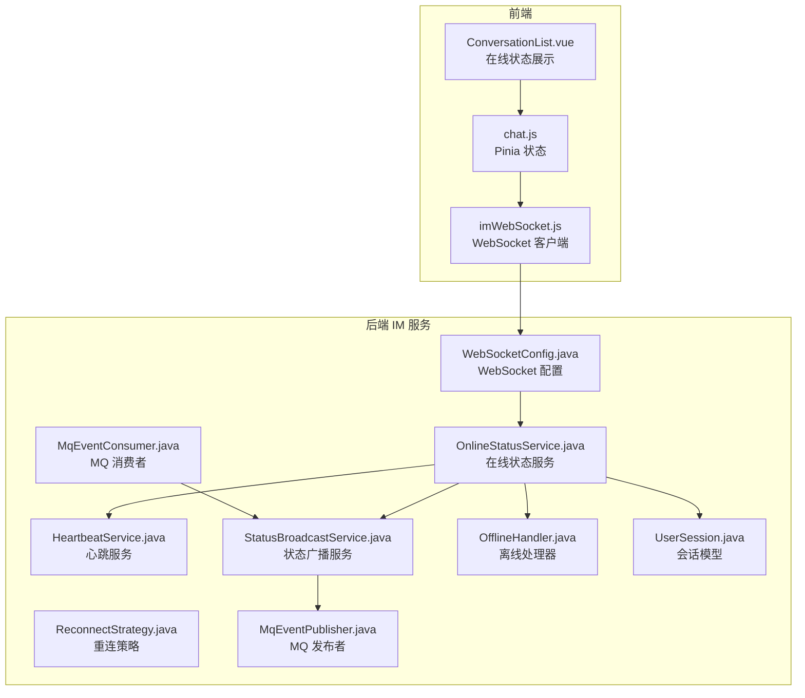
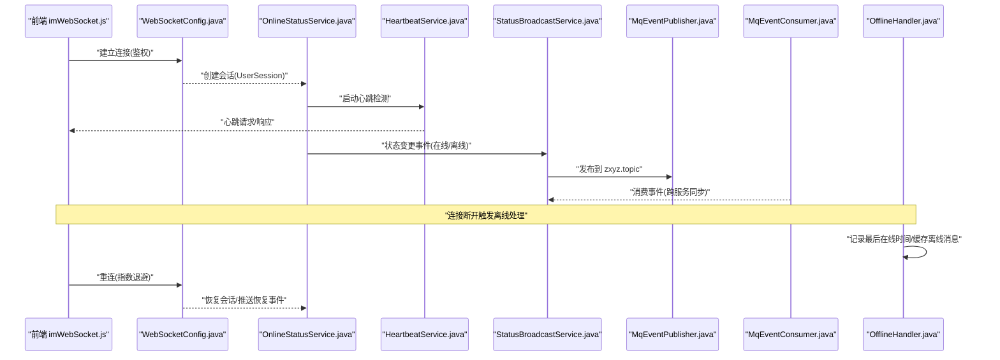
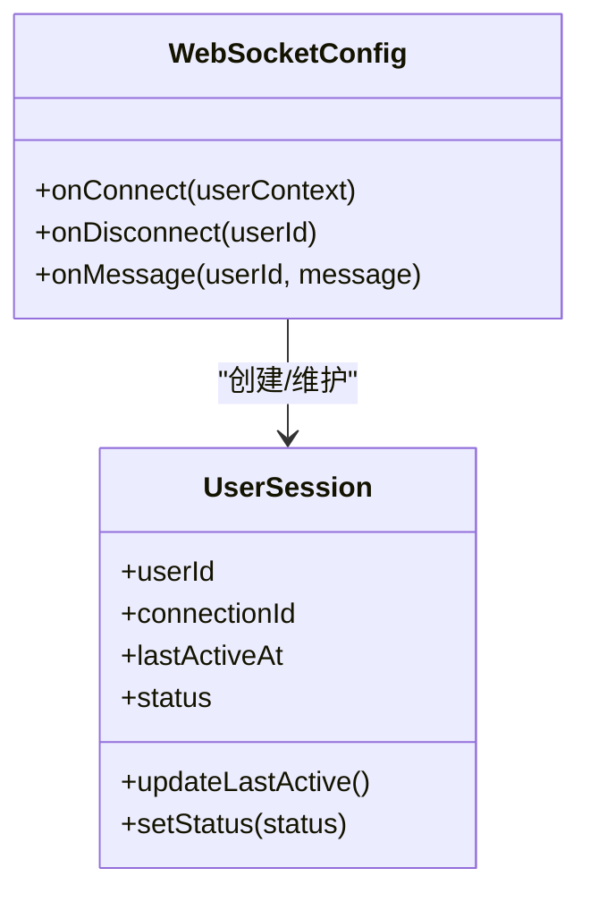
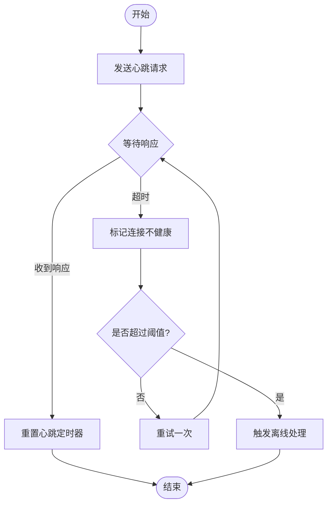
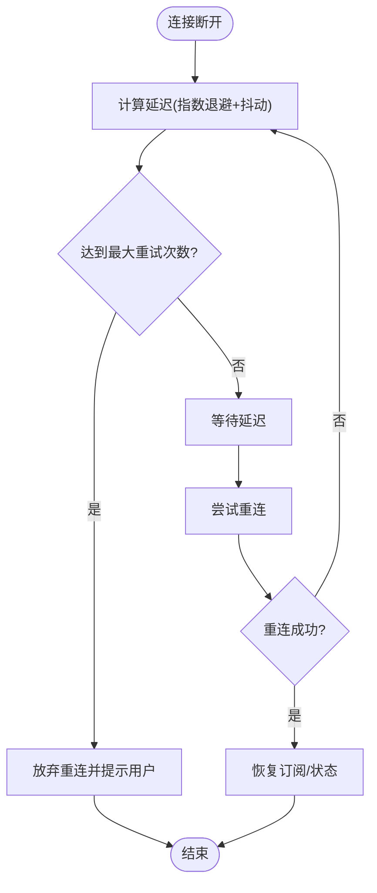
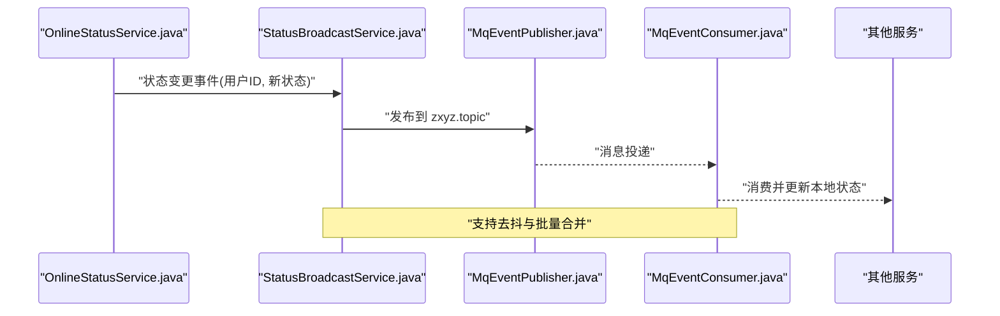
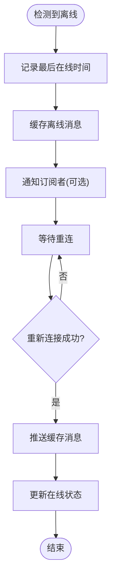
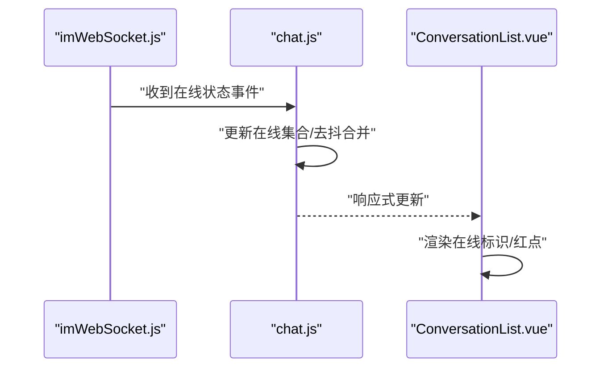
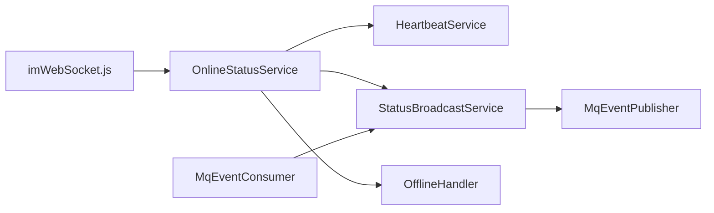

# 用户在线状态管理

<cite>
**本文引用的文件**   
- [zxyz-im-service/src/main/java/uno/acloud/im/ZxyzImApplication.java](file://ZXYZdatabaseBack/zxyz-im-service/src/main/java/uno/acloud/im/ZxyzImApplication.java)
- [zxyz-im-service/src/main/java/uno/acloud/im/config/WebSocketConfig.java](file://ZXYZdatabaseBack/zxyz-im-service/src/main/java/uno/acloud/im/config/WebSocketConfig.java)
- [zxyz-im-service/src/main/java/uno/acloud/im/application/OnlineStatusService.java](file://ZXYZdatabaseBack/zxyz-im-service/src/main/java/uno/acloud/im/application/OnlineStatusService.java)
- [zxyz-im-service/src/main/java/uno/acloud/im/application/HeartbeatService.java](file://ZXYZdatabaseBack/zxyz-im-service/src/main/java/uno/acloud/im/application/HeartbeatService.java)
- [zxyz-im-service/src/main/java/uno/acloud/im/application/ReconnectStrategy.java](file://ZXYZdatabaseBack/zxyz-im-service/src/main/java/uno/acloud/im/application/ReconnectStrategy.java)
- [zxyz-im-service/src/main/java/uno/acloud/im/application/StatusBroadcastService.java](file://ZXYZdatabaseBack/zxyz-im-service/src/main/java/uno/acloud/im/application/StatusBroadcastService.java)
- [zxyz-im-service/src/main/java/uno/acloud/im/application/OfflineHandler.java](file://ZXYZdatabaseBack/zxyz-im-service/src/main/java/uno/acloud/im/application/OfflineHandler.java)
- [zxyz-im-service/src/main/java/uno/acloud/im/domain/model/UserSession.java](file://ZXYZdatabaseBack/zxyz-im-service/src/main/java/uno/acloud/im/domain/model/UserSession.java)
- [zxyz-im-service/src/main/java/uno/acloud/im/infrastructure/mq/MqEventPublisher.java](file://ZXYZdatabaseBack/zxyz-im-service/src/main/java/uno/acloud/im/infrastructure/mq/MqEventPublisher.java)
- [zxyz-im-service/src/main/java/uno/acloud/im/infrastructure/mq/MqEventConsumer.java](file://ZXYZdatabaseBack/zxyz-im-service/src/main/java/uno/acloud/im/infrastructure/mq/MqEventConsumer.java)
- [zxyz-im-service/src/main/resources/application.yml](file://ZXYZdatabaseBack/zxyz-im-service/src/main/resources/application.yml)
- [ZXYZdatabaseFront/src/utils/imWebSocket.js](file://ZXYZdatabaseFront/src/utils/imWebSocket.js)
- [ZXYZdatabaseFront/src/store/chat.js](file://ZXYZdatabaseFront/src/store/chat.js)
- [ZXYZdatabaseFront/src/views/chat/components/ConversationList.vue](file://ZXYZdatabaseFront/src/views/chat/components/ConversationList.vue)
</cite>

## 目录
1. [简介](#简介)
2. [项目结构](#项目结构)
3. [核心组件](#核心组件)
4. [架构总览](#架构总览)
5. [详细组件分析](#详细组件分析)
6. [依赖关系分析](#依赖关系分析)
7. [性能考虑](#性能考虑)
8. [故障排查指南](#故障排查指南)
9. [结论](#结论)
10. [附录](#附录)

## 简介
本技术文档聚焦于 ZXYZ 即时通讯模块的用户在线状态管理，覆盖以下关键能力：
- WebSocket 连接建立时的在线状态更新
- 心跳检测、连接超时与断线重连策略
- 在线状态广播系统（事件发布、订阅者通知、跨服务一致性）
- 离线处理（下线检测、最后在线时间记录、离线消息缓存、重新上线恢复）
- 前端状态管理（Vue 组件显示、实时更新、UI 反馈与交互优化）
- 性能优化（批量更新、内存管理、并发控制）

## 项目结构
后端采用微服务架构，IM 服务遵循 DDD 分层（interfaces → application → domain → infrastructure），负责在线状态的核心逻辑；前端使用 Vue 3 + Pinia + WebSocket 客户端封装实现实时状态同步。

**图表来源**
- [zxyz-im-service/src/main/java/uno/acloud/im/config/WebSocketConfig.java](file://ZXYZdatabaseBack/zxyz-im-service/src/main/java/uno/acloud/im/config/WebSocketConfig.java)
- [zxyz-im-service/src/main/java/uno/acloud/im/application/OnlineStatusService.java](file://ZXYZdatabaseBack/zxyz-im-service/src/main/java/uno/acloud/im/application/OnlineStatusService.java)
- [zxyz-im-service/src/main/java/uno/acloud/im/application/HeartbeatService.java](file://ZXYZdatabaseBack/zxyz-im-service/src/main/java/uno/acloud/im/application/HeartbeatService.java)
- [zxyz-im-service/src/main/java/uno/acloud/im/application/ReconnectStrategy.java](file://ZXYZdatabaseBack/zxyz-im-service/src/main/java/uno/acloud/im/application/ReconnectStrategy.java)
- [zxyz-im-service/src/main/java/uno/acloud/im/application/StatusBroadcastService.java](file://ZXYZdatabaseBack/zxyz-im-service/src/main/java/uno/acloud/im/application/StatusBroadcastService.java)
- [zxyz-im-service/src/main/java/uno/acloud/im/application/OfflineHandler.java](file://ZXYZdatabaseBack/zxyz-im-service/src/main/java/uno/acloud/im/application/OfflineHandler.java)
- [zxyz-im-service/src/main/java/uno/acloud/im/domain/model/UserSession.java](file://ZXYZdatabaseBack/zxyz-im-service/src/main/java/uno/acloud/im/domain/model/UserSession.java)
- [zxyz-im-service/src/main/java/uno/acloud/im/infrastructure/mq/MqEventPublisher.java](file://ZXYZdatabaseBack/zxyz-im-service/src/main/java/uno/acloud/im/infrastructure/mq/MqEventPublisher.java)
- [zxyz-im-service/src/main/java/uno/acloud/im/infrastructure/mq/MqEventConsumer.java](file://ZXYZdatabaseBack/zxyz-im-service/src/main/java/uno/acloud/im/infrastructure/mq/MqEventConsumer.java)
- [ZXYZdatabaseFront/src/utils/imWebSocket.js](file://ZXYZdatabaseFront/src/utils/imWebSocket.js)
- [ZXYZdatabaseFront/src/store/chat.js](file://ZXYZdatabaseFront/src/store/chat.js)
- [ZXYZdatabaseFront/src/views/chat/components/ConversationList.vue](file://ZXYZdatabaseFront/src/views/chat/components/ConversationList.vue)

**章节来源**
- [zxyz-im-service/src/main/java/uno/acloud/im/ZxyzImApplication.java](file://ZXYZdatabaseBack/zxyz-im-service/src/main/java/uno/acloud/im/ZxyzImApplication.java)
- [zxyz-im-service/src/main/resources/application.yml](file://ZXYZdatabaseBack/zxyz-im-service/src/main/resources/application.yml)

## 核心组件
- WebSocket 配置与接入：负责建立与销毁连接、鉴权上下文绑定、会话生命周期管理
- 在线状态服务：维护用户会话、状态变更、心跳调度、超时判定
- 心跳服务：周期性发送心跳、接收心跳响应、异常处理
- 重连策略：指数退避、最大重试次数、抖动参数
- 状态广播服务：事件聚合、去抖合并、跨服务一致性（通过 MQ Topic Exchange）
- 离线处理器：下线检测、最后在线时间落库、离线消息缓存、重新上线恢复
- 前端 WebSocket 客户端：连接管理、心跳、重连、状态订阅与本地存储同步
- 前端状态管理：Pinia store 维护在线集合、UI 实时更新与反馈

**章节来源**
- [zxyz-im-service/src/main/java/uno/acloud/im/config/WebSocketConfig.java](file://ZXYZdatabaseBack/zxyz-im-service/src/main/java/uno/acloud/im/config/WebSocketConfig.java)
- [zxyz-im-service/src/main/java/uno/acloud/im/application/OnlineStatusService.java](file://ZXYZdatabaseBack/zxyz-im-service/src/main/java/uno/acloud/im/application/OnlineStatusService.java)
- [zxyz-im-service/src/main/java/uno/acloud/im/application/HeartbeatService.java](file://ZXYZdatabaseBack/zxyz-im-service/src/main/java/uno/acloud/im/application/HeartbeatService.java)
- [zxyz-im-service/src/main/java/uno/acloud/im/application/ReconnectStrategy.java](file://ZXYZdatabaseBack/zxyz-im-service/src/main/java/uno/acloud/im/application/ReconnectStrategy.java)
- [zxyz-im-service/src/main/java/uno/acloud/im/application/StatusBroadcastService.java](file://ZXYZdatabaseBack/zxyz-im-service/src/main/java/uno/acloud/im/application/StatusBroadcastService.java)
- [zxyz-im-service/src/main/java/uno/acloud/im/application/OfflineHandler.java](file://ZXYZdatabaseBack/zxyz-im-service/src/main/java/uno/acloud/im/application/OfflineHandler.java)
- [ZXYZdatabaseFront/src/utils/imWebSocket.js](file://ZXYZdatabaseFront/src/utils/imWebSocket.js)
- [ZXYZdatabaseFront/src/store/chat.js](file://ZXYZdatabaseFront/src/store/chat.js)

## 架构总览
在线状态管理的端到端流程如下：
- 前端通过 imWebSocket.js 建立 WebSocket 连接，完成鉴权与会话绑定
- 服务端 OnlineStatusService 维护 UserSession，启动 HeartbeatService 进行心跳检测
- 状态变更由 StatusBroadcastService 统一发布到 MQ Topic Exchange zxyz.topic，供其他服务订阅
- 离线时 OfflineHandler 记录最后在线时间并缓存离线消息；重新上线后恢复状态与消息
- 前端 chat.js 订阅状态事件，实时更新 ConversationList.vue 中的在线标识

**图表来源**
- [ZXYZdatabaseFront/src/utils/imWebSocket.js](file://ZXYZdatabaseFront/src/utils/imWebSocket.js)
- [zxyz-im-service/src/main/java/uno/acloud/im/config/WebSocketConfig.java](file://ZXYZdatabaseBack/zxyz-im-service/src/main/java/uno/acloud/im/config/WebSocketConfig.java)
- [zxyz-im-service/src/main/java/uno/acloud/im/application/OnlineStatusService.java](file://ZXYZdatabaseBack/zxyz-im-service/src/main/java/uno/acloud/im/application/OnlineStatusService.java)
- [zxyz-im-service/src/main/java/uno/acloud/im/application/HeartbeatService.java](file://ZXYZdatabaseBack/zxyz-im-service/src/main/java/uno/acloud/im/application/HeartbeatService.java)
- [zxyz-im-service/src/main/java/uno/acloud/im/application/StatusBroadcastService.java](file://ZXYZdatabaseBack/zxyz-im-service/src/main/java/uno/acloud/im/application/StatusBroadcastService.java)
- [zxyz-im-service/src/main/java/uno/acloud/im/infrastructure/mq/MqEventPublisher.java](file://ZXYZdatabaseBack/zxyz-im-service/src/main/java/uno/acloud/im/infrastructure/mq/MqEventPublisher.java)
- [zxyz-im-service/src/main/java/uno/acloud/im/infrastructure/mq/MqEventConsumer.java](file://ZXYZdatabaseBack/zxyz-im-service/src/main/java/uno/acloud/im/infrastructure/mq/MqEventConsumer.java)
- [zxyz-im-service/src/main/java/uno/acloud/im/application/OfflineHandler.java](file://ZXYZdatabaseBack/zxyz-im-service/src/main/java/uno/acloud/im/application/OfflineHandler.java)

## 详细组件分析

### WebSocket 连接与会话管理
- 连接建立：前端调用 imWebSocket.js 发起连接，携带鉴权信息；服务端 WebSocketConfig 解析并绑定用户上下文
- 会话模型：UserSession 保存连接标识、用户ID、最后活跃时间、状态等
- 生命周期：连接关闭或异常时触发下线流程，清理会话资源

**图表来源**
- [zxyz-im-service/src/main/java/uno/acloud/im/config/WebSocketConfig.java](file://ZXYZdatabaseBack/zxyz-im-service/src/main/java/uno/acloud/im/config/WebSocketConfig.java)
- [zxyz-im-service/src/main/java/uno/acloud/im/domain/model/UserSession.java](file://ZXYZdatabaseBack/zxyz-im-service/src/main/java/uno/acloud/im/domain/model/UserSession.java)

**章节来源**
- [zxyz-im-service/src/main/java/uno/acloud/im/config/WebSocketConfig.java](file://ZXYZdatabaseBack/zxyz-im-service/src/main/java/uno/acloud/im/config/WebSocketConfig.java)
- [zxyz-im-service/src/main/java/uno/acloud/im/domain/model/UserSession.java](file://ZXYZdatabaseBack/zxyz-im-service/src/main/java/uno/acloud/im/domain/model/UserSession.java)

### 心跳检测与超时处理
- 心跳机制：HeartbeatService 定时向连接发送心跳，若未收到响应则标记为不健康
- 超时策略：超过阈值判定为断线，触发离线处理与重连提示
- 前端配合：imWebSocket.js 定期发送心跳并处理响应，失败时进入重连流程

**图表来源**
- [zxyz-im-service/src/main/java/uno/acloud/im/application/HeartbeatService.java](file://ZXYZdatabaseBack/zxyz-im-service/src/main/java/uno/acloud/im/application/HeartbeatService.java)
- [ZXYZdatabaseFront/src/utils/imWebSocket.js](file://ZXYZdatabaseFront/src/utils/imWebSocket.js)

**章节来源**
- [zxyz-im-service/src/main/java/uno/acloud/im/application/HeartbeatService.java](file://ZXYZdatabaseBack/zxyz-im-service/src/main/java/uno/acloud/im/application/HeartbeatService.java)
- [ZXYZdatabaseFront/src/utils/imWebSocket.js](file://ZXYZdatabaseFront/src/utils/imWebSocket.js)

### 断线重连策略
- 指数退避：重连间隔按指数增长，避免雪崩
- 最大重试次数：防止无限重连导致资源耗尽
- 抖动参数：加入随机抖动，降低集中重连概率
- 前端实现：imWebSocket.js 根据策略自动重连，并在成功时恢复订阅

**图表来源**
- [zxyz-im-service/src/main/java/uno/acloud/im/application/ReconnectStrategy.java](file://ZXYZdatabaseBack/zxyz-im-service/src/main/java/uno/acloud/im/application/ReconnectStrategy.java)
- [ZXYZdatabaseFront/src/utils/imWebSocket.js](file://ZXYZdatabaseFront/src/utils/imWebSocket.js)

**章节来源**
- [zxyz-im-service/src/main/java/uno/acloud/im/application/ReconnectStrategy.java](file://ZXYZdatabaseBack/zxyz-im-service/src/main/java/uno/acloud/im/application/ReconnectStrategy.java)
- [ZXYZdatabaseFront/src/utils/imWebSocket.js](file://ZXYZdatabaseFront/src/utils/imWebSocket.js)

### 在线状态广播系统
- 事件发布：StatusBroadcastService 将状态变更事件发布到 MQ Topic Exchange zxyz.topic
- 订阅者通知：其他服务通过 MqEventConsumer 订阅并处理状态变化
- 一致性保证：基于 MQ 的可靠投递与幂等消费，确保跨服务状态一致

**图表来源**
- [zxyz-im-service/src/main/java/uno/acloud/im/application/StatusBroadcastService.java](file://ZXYZdatabaseBack/zxyz-im-service/src/main/java/uno/acloud/im/application/StatusBroadcastService.java)
- [zxyz-im-service/src/main/java/uno/acloud/im/infrastructure/mq/MqEventPublisher.java](file://ZXYZdatabaseBack/zxyz-im-service/src/main/java/uno/acloud/im/infrastructure/mq/MqEventPublisher.java)
- [zxyz-im-service/src/main/java/uno/acloud/im/infrastructure/mq/MqEventConsumer.java](file://ZXYZdatabaseBack/zxyz-im-service/src/main/java/uno/acloud/im/infrastructure/mq/MqEventConsumer.java)

**章节来源**
- [zxyz-im-service/src/main/java/uno/acloud/im/application/StatusBroadcastService.java](file://ZXYZdatabaseBack/zxyz-im-service/src/main/java/uno/acloud/im/application/StatusBroadcastService.java)
- [zxyz-im-service/src/main/java/uno/acloud/im/infrastructure/mq/MqEventPublisher.java](file://ZXYZdatabaseBack/zxyz-im-service/src/main/java/uno/acloud/im/infrastructure/mq/MqEventPublisher.java)
- [zxyz-im-service/src/main/java/uno/acloud/im/infrastructure/mq/MqEventConsumer.java](file://ZXYZdatabaseBack/zxyz-im-service/src/main/java/uno/acloud/im/infrastructure/mq/MqEventConsumer.java)

### 离线状态处理
- 下线检测：连接断开或心跳超时触发 OfflineHandler
- 最后在线时间：记录用户最后活跃时间，用于展示与审计
- 离线消息缓存：在用户离线期间缓存消息，待重新上线后推送
- 重新上线恢复：恢复会话、推送积压消息、更新在线状态

**图表来源**
- [zxyz-im-service/src/main/java/uno/acloud/im/application/OfflineHandler.java](file://ZXYZdatabaseBack/zxyz-im-service/src/main/java/uno/acloud/im/application/OfflineHandler.java)

**章节来源**
- [zxyz-im-service/src/main/java/uno/acloud/im/application/OfflineHandler.java](file://ZXYZdatabaseBack/zxyz-im-service/src/main/java/uno/acloud/im/application/OfflineHandler.java)

### 前端状态管理
- WebSocket 客户端：imWebSocket.js 管理连接、心跳、重连与事件订阅
- Pinia 状态：chat.js 维护在线用户集合、消息队列与 UI 状态
- 组件展示：ConversationList.vue 根据在线状态显示头像标识、红点等反馈

**图表来源**
- [ZXYZdatabaseFront/src/utils/imWebSocket.js](file://ZXYZdatabaseFront/src/utils/imWebSocket.js)
- [ZXYZdatabaseFront/src/store/chat.js](file://ZXYZdatabaseFront/src/store/chat.js)
- [ZXYZdatabaseFront/src/views/chat/components/ConversationList.vue](file://ZXYZdatabaseFront/src/views/chat/components/ConversationList.vue)

**章节来源**
- [ZXYZdatabaseFront/src/utils/imWebSocket.js](file://ZXYZdatabaseFront/src/utils/imWebSocket.js)
- [ZXYZdatabaseFront/src/store/chat.js](file://ZXYZdatabaseFront/src/store/chat.js)
- [ZXYZdatabaseFront/src/views/chat/components/ConversationList.vue](file://ZXYZdatabaseFront/src/views/chat/components/ConversationList.vue)

## 依赖关系分析
- 内聚性：OnlineStatusService 作为核心协调器，低耦合地组合心跳、广播、离线处理等子服务
- 耦合度：通过 MQ 解耦状态广播，避免直接服务间调用带来的紧耦合
- 外部依赖：Nacos 配置中心管理心跳间隔、重连参数等运行时配置

**图表来源**
- [zxyz-im-service/src/main/java/uno/acloud/im/application/OnlineStatusService.java](file://ZXYZdatabaseBack/zxyz-im-service/src/main/java/uno/acloud/im/application/OnlineStatusService.java)
- [zxyz-im-service/src/main/java/uno/acloud/im/application/HeartbeatService.java](file://ZXYZdatabaseBack/zxyz-im-service/src/main/java/uno/acloud/im/application/HeartbeatService.java)
- [zxyz-im-service/src/main/java/uno/acloud/im/application/StatusBroadcastService.java](file://ZXYZdatabaseBack/zxyz-im-service/src/main/java/uno/acloud/im/application/StatusBroadcastService.java)
- [zxyz-im-service/src/main/java/uno/acloud/im/application/OfflineHandler.java](file://ZXYZdatabaseBack/zxyz-im-service/src/main/java/uno/acloud/im/application/OfflineHandler.java)
- [zxyz-im-service/src/main/java/uno/acloud/im/infrastructure/mq/MqEventPublisher.java](file://ZXYZdatabaseBack/zxyz-im-service/src/main/java/uno/acloud/im/infrastructure/mq/MqEventPublisher.java)
- [zxyz-im-service/src/main/java/uno/acloud/im/infrastructure/mq/MqEventConsumer.java](file://ZXYZdatabaseBack/zxyz-im-service/src/main/java/uno/acloud/im/infrastructure/mq/MqEventConsumer.java)
- [ZXYZdatabaseFront/src/utils/imWebSocket.js](file://ZXYZdatabaseFront/src/utils/imWebSocket.js)

**章节来源**
- [zxyz-im-service/src/main/resources/application.yml](file://ZXYZdatabaseBack/zxyz-im-service/src/main/resources/application.yml)

## 性能考虑
- 状态批量更新：StatusBroadcastService 对高频状态变更进行去抖与合并，减少 MQ 压力
- 内存管理：UserSession 设置 TTL，定期清理过期会话，避免内存泄漏
- 并发控制：心跳与重连使用线程池隔离，避免阻塞主流程
- 前端优化：chat.js 对状态更新进行节流，减少不必要的 UI 重渲染

[本节提供通用指导，无需特定文件引用]

## 故障排查指南
- 连接失败：检查鉴权信息与 Nacos 配置，确认 WebSocket 端口可达
- 心跳超时：调整 HeartbeatService 的超时阈值，观察网络延迟
- 重连风暴：检查 ReconnectStrategy 的最大重试次数与抖动参数
- 状态不一致：查看 MqEventConsumer 的消费日志，确认幂等处理
- 前端无更新：验证 imWebSocket.js 的事件订阅与 chat.js 的状态同步逻辑

**章节来源**
- [zxyz-im-service/src/main/java/uno/acloud/im/application/HeartbeatService.java](file://ZXYZdatabaseBack/zxyz-im-service/src/main/java/uno/acloud/im/application/HeartbeatService.java)
- [zxyz-im-service/src/main/java/uno/acloud/im/application/ReconnectStrategy.java](file://ZXYZdatabaseBack/zxyz-im-service/src/main/java/uno/acloud/im/application/ReconnectStrategy.java)
- [zxyz-im-service/src/main/java/uno/acloud/im/infrastructure/mq/MqEventConsumer.java](file://ZXYZdatabaseBack/zxyz-im-service/src/main/java/uno/acloud/im/infrastructure/mq/MqEventConsumer.java)
- [ZXYZdatabaseFront/src/utils/imWebSocket.js](file://ZXYZdatabaseFront/src/utils/imWebSocket.js)
- [ZXYZdatabaseFront/src/store/chat.js](file://ZXYZdatabaseFront/src/store/chat.js)

## 结论
ZXYZ 即时通讯模块的用户在线状态管理通过清晰的 DDD 分层与 MQ 解耦，实现了高可用、可扩展的在线状态检测、广播与离线处理能力。前端采用轻量级 WebSocket 客户端与 Pinia 状态管理，确保了实时性与用户体验。通过合理的性能优化与故障排查策略，系统在大规模场景下仍能保持稳定与高效。

[本节为总结性内容，无需特定文件引用]

## 附录
- 配置项参考：application.yml 中定义的心跳间隔、重连参数、MQ 主题等
- 扩展建议：可引入 Redis 集群存储在线状态以支持水平扩展；增加状态快照用于快速恢复

[本节为补充信息，无需特定文件引用]