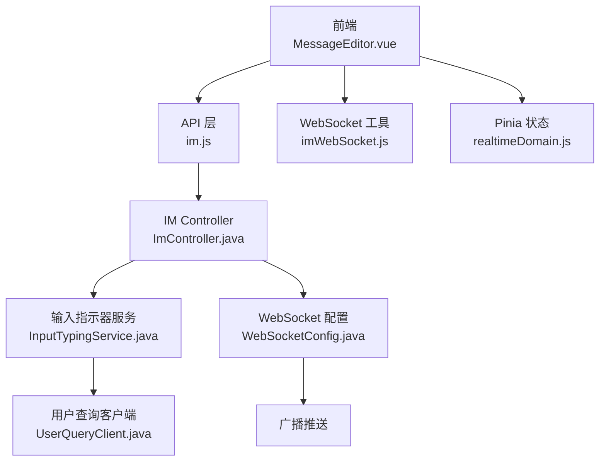
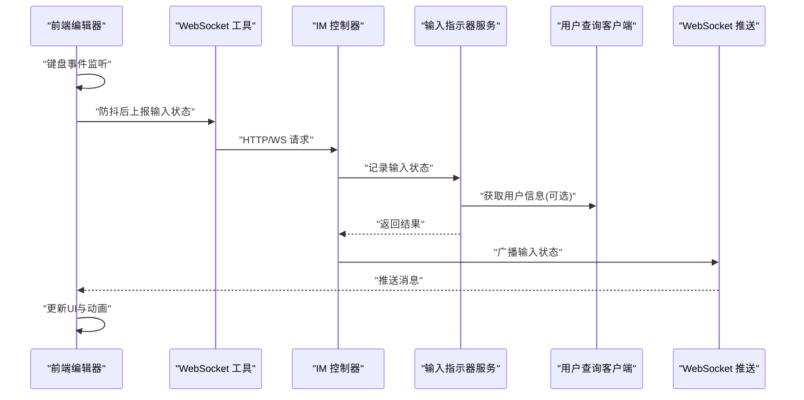
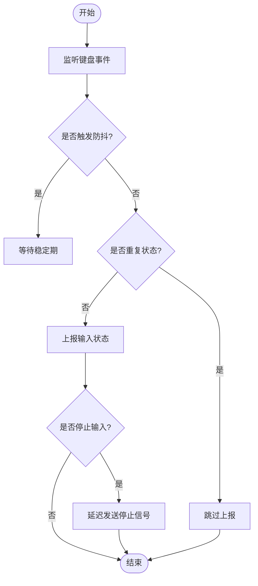
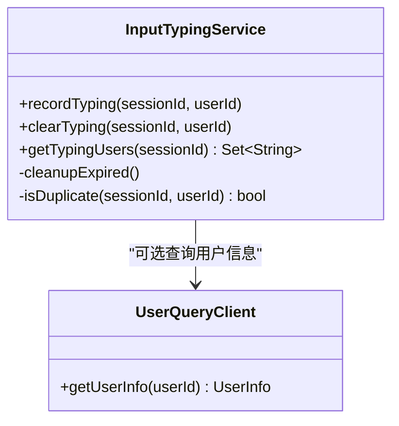
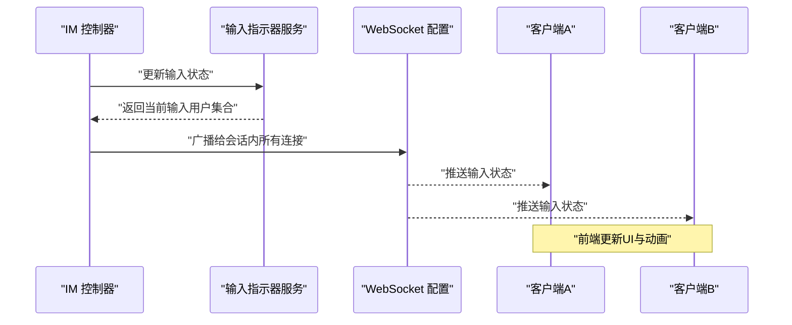
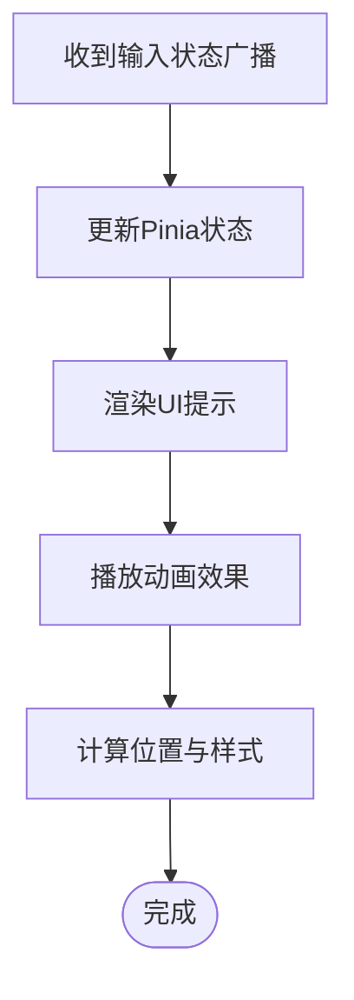
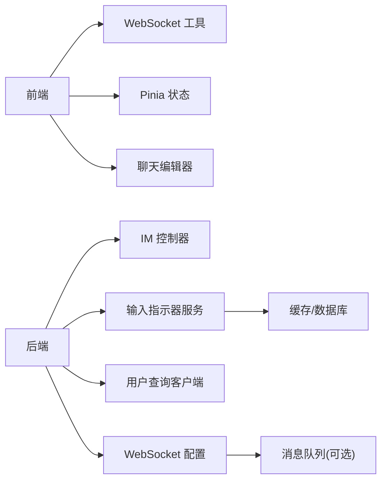

# 输入指示器

<cite>
**本文引用的文件**
- [zxyz-im-service/src/main/java/uno/acloud/im/application/InputTypingService.java](file://ZXYZdatabaseBack/zxyz-im-service/src/main/java/uno/acloud/im/application/InputTypingService.java)
- [zxyz-im-service/src/main/java/uno/acloud/im/controller/ImController.java](file://ZXYZdatabaseBack/zxyz-im-service/src/main/java/uno/acloud/im/controller/ImController.java)
- [zxyz-im-service/src/main/java/uno/acloud/im/config/WebSocketConfig.java](file://ZXYZdatabaseBack/zxyz-im-service/src/main/java/uno/acloud/im/config/WebSocketConfig.java)
- [zxyz-im-service/src/main/java/uno/acloud/im/infrastructure/client/UserQueryClient.java](file://ZXYZdatabaseBack/zxyz-im-service/src/main/java/uno/acloud/im/infrastructure/client/UserQueryClient.java)
- [ZXYZdatabaseFront/src/utils/imWebSocket.js](file://ZXYZdatabaseFront/src/utils/imWebSocket.js)
- [ZXYZdatabaseFront/src/views/chat/components/MessageEditor.vue](file://ZXYZdatabaseFront/src/views/chat/components/MessageEditor.vue)
- [ZXYZdatabaseFront/src/store/im/realtimeDomain.js](file://ZXYZdatabaseFront/src/store/im/realtimeDomain.js)
- [ZXYZdatabaseFront/src/api/im.js](file://ZXYZdatabaseFront/src/api/im.js)
</cite>

## 目录
1. [简介](#简介)
2. [项目结构](#项目结构)
3. [核心组件](#核心组件)
4. [架构总览](#架构总览)
5. [详细组件分析](#详细组件分析)
6. [依赖分析](#依赖分析)
7. [性能考虑](#性能考虑)
8. [故障排查指南](#故障排查指南)
9. [结论](#结论)
10. [附录](#附录)

## 简介
本技术文档聚焦 ZXYZ 即时通讯模块的“输入指示器”（Typing Indicator）功能，覆盖从前端输入状态检测、防抖与延迟发送策略，到服务端状态存储、过期清理、并发控制，再到 WebSocket 实时广播与前端 UI 展示的全链路实现。文档同时给出关键流程图与时序图，帮助读者快速理解并落地该能力。

## 项目结构
输入指示器涉及前后端协同：
- 后端服务：im-service 提供输入状态处理、用户查询与 WebSocket 推送；通过内部客户端调用其他服务获取用户信息。
- 前端应用：Vue 3 + Pinia，使用自定义 WebSocket 工具与聊天编辑器组件监听键盘事件，触发输入状态上报与展示。

**图示来源**
- [MessageEditor.vue:1-200](file://ZXYZdatabaseFront/src/views/chat/components/MessageEditor.vue#L1-L200)
- [imWebSocket.js:1-200](file://ZXYZdatabaseFront/src/utils/imWebSocket.js#L1-L200)
- [realtimeDomain.js:1-200](file://ZXYZdatabaseFront/src/store/im/realtimeDomain.js#L1-L200)
- [im.js:1-200](file://ZXYZdatabaseFront/src/api/im.js#L1-L200)
- [ImController.java:1-200](file://ZXYZdatabaseBack/zxyz-im-service/src/main/java/uno/acloud/im/controller/ImController.java#L1-L200)
- [InputTypingService.java:1-200](file://ZXYZdatabaseBack/zxyz-im-service/src/main/java/uno/acloud/im/application/InputTypingService.java#L1-L200)
- [UserQueryClient.java:1-200](file://ZXYZdatabaseBack/zxyz-im-service/src/main/java/uno/acloud/im/infrastructure/client/UserQueryClient.java#L1-L200)
- [WebSocketConfig.java:1-200](file://ZXYZdatabaseBack/zxyz-im-service/src/main/java/uno/acloud/im/config/WebSocketConfig.java#L1-L200)

**章节来源**
- [MessageEditor.vue:1-200](file://ZXYZdatabaseFront/src/views/chat/components/MessageEditor.vue#L1-L200)
- [imWebSocket.js:1-200](file://ZXYZdatabaseFront/src/utils/imWebSocket.js#L1-L200)
- [realtimeDomain.js:1-200](file://ZXYZdatabaseFront/src/store/im/realtimeDomain.js#L1-L200)
- [im.js:1-200](file://ZXYZdatabaseFront/src/api/im.js#L1-L200)
- [ImController.java:1-200](file://ZXYZdatabaseBack/zxyz-im-service/src/main/java/uno/acloud/im/controller/ImController.java#L1-L200)
- [InputTypingService.java:1-200](file://ZXYZdatabaseBack/zxyz-im-service/src/main/java/uno/acloud/im/application/InputTypingService.java#L1-L200)
- [UserQueryClient.java:1-200](file://ZXYZdatabaseBack/zxyz-im-service/src/main/java/uno/acloud/im/infrastructure/client/UserQueryClient.java#L1-L200)
- [WebSocketConfig.java:1-200](file://ZXYZdatabaseBack/zxyz-im-service/src/main/java/uno/acloud/im/config/WebSocketConfig.java#L1-L200)

## 核心组件
- 前端输入检测与上报：在聊天编辑器中监听键盘事件，结合防抖与延迟策略，避免频繁上报；将输入状态通过 WebSocket 或 HTTP 接口上报至服务端。
- 服务端输入状态管理：接收输入状态，进行去重与合并，持久化或缓存当前会话的输入用户集合，设置过期时间，定时清理。
- 实时广播系统：基于 WebSocket 向会话内在线用户推送输入状态变更，支持多用户并发与异常重连。
- 前端显示与动画：根据收到的输入状态更新 UI，展示“正在输入”提示，支持位置计算与多会话隔离。

**章节来源**
- [MessageEditor.vue:1-200](file://ZXYZdatabaseFront/src/views/chat/components/MessageEditor.vue#L1-L200)
- [imWebSocket.js:1-200](file://ZXYZdatabaseFront/src/utils/imWebSocket.js#L1-L200)
- [realtimeDomain.js:1-200](file://ZXYZdatabaseFront/src/store/im/realtimeDomain.js#L1-L200)
- [ImController.java:1-200](file://ZXYZdatabaseBack/zxyz-im-service/src/main/java/uno/acloud/im/controller/ImController.java#L1-L200)
- [InputTypingService.java:1-200](file://ZXYZdatabaseBack/zxyz-im-service/src/main/java/uno/acloud/im/application/InputTypingService.java#L1-L200)
- [WebSocketConfig.java:1-200](file://ZXYZdatabaseBack/zxyz-im-service/src/main/java/uno/acloud/im/config/WebSocketConfig.java#L1-L200)

## 架构总览
输入指示器的端到端流程如下：
- 前端捕获键盘事件，经防抖后触发上报。
- 服务端校验与会话上下文，更新输入状态缓存，设置过期时间。
- 服务端通过 WebSocket 向同会话的其他在线用户广播输入状态。
- 前端收到广播后更新本地状态与 UI 动画。

**图示来源**
- [MessageEditor.vue:1-200](file://ZXYZdatabaseFront/src/views/chat/components/MessageEditor.vue#L1-L200)
- [imWebSocket.js:1-200](file://ZXYZdatabaseFront/src/utils/imWebSocket.js#L1-L200)
- [ImController.java:1-200](file://ZXYZdatabaseBack/zxyz-im-service/src/main/java/uno/acloud/im/controller/ImController.java#L1-L200)
- [InputTypingService.java:1-200](file://ZXYZdatabaseBack/zxyz-im-service/src/main/java/uno/acloud/im/application/InputTypingService.java#L1-L200)
- [UserQueryClient.java:1-200](file://ZXYZdatabaseBack/zxyz-im-service/src/main/java/uno/acloud/im/infrastructure/client/UserQueryClient.java#L1-L200)
- [WebSocketConfig.java:1-200](file://ZXYZdatabaseBack/zxyz-im-service/src/main/java/uno/acloud/im/config/WebSocketConfig.java#L1-L200)

## 详细组件分析

### 前端输入检测与上报
- 键盘事件监听：在编辑器组件中绑定 keydown/keyup 事件，识别有效输入行为。
- 输入防抖处理：对高频输入事件进行节流/防抖，降低网络压力。
- 延迟发送策略：在停止输入后延迟一段时间再发送“停止输入”信号，减少抖动。
- 状态去重逻辑：同一会话内相同用户的输入状态重复时跳过上报。

**图示来源**
- [MessageEditor.vue:1-200](file://ZXYZdatabaseFront/src/views/chat/components/MessageEditor.vue#L1-L200)
- [imWebSocket.js:1-200](file://ZXYZdatabaseFront/src/utils/imWebSocket.js#L1-L200)

**章节来源**
- [MessageEditor.vue:1-200](file://ZXYZdatabaseFront/src/views/chat/components/MessageEditor.vue#L1-L200)
- [imWebSocket.js:1-200](file://ZXYZdatabaseFront/src/utils/imWebSocket.js#L1-L200)

### 服务端输入状态管理
- 输入状态存储：维护会话维度的输入用户集合，支持并发写入。
- 过期清理：为每个输入状态设置 TTL，定期清理过期条目。
- 内存优化：限制集合大小，避免无限增长；必要时落盘或迁移至缓存中间件。
- 并发访问控制：使用线程安全的数据结构与锁机制保证一致性。

**图示来源**
- [InputTypingService.java:1-200](file://ZXYZdatabaseBack/zxyz-im-service/src/main/java/uno/acloud/im/application/InputTypingService.java#L1-L200)
- [UserQueryClient.java:1-200](file://ZXYZdatabaseBack/zxyz-im-service/src/main/java/uno/acloud/im/infrastructure/client/UserQueryClient.java#L1-L200)

**章节来源**
- [InputTypingService.java:1-200](file://ZXYZdatabaseBack/zxyz-im-service/src/main/java/uno/acloud/im/application/InputTypingService.java#L1-L200)
- [UserQueryClient.java:1-200](file://ZXYZdatabaseBack/zxyz-im-service/src/main/java/uno/acloud/im/infrastructure/client/UserQueryClient.java#L1-L200)

### 实时广播系统
- 实时推送实现：基于 WebSocket 建立长连接，按会话维度分发消息。
- 多用户支持：会话内多个在线用户均可接收输入状态广播。
- 状态清理机制：当用户断开连接或会话结束时，清理相关状态。
- 网络异常处理：断线重连、消息重试与降级策略。

**图示来源**
- [ImController.java:1-200](file://ZXYZdatabaseBack/zxyz-im-service/src/main/java/uno/acloud/im/controller/ImController.java#L1-L200)
- [InputTypingService.java:1-200](file://ZXYZdatabaseBack/zxyz-im-service/src/main/java/uno/acloud/im/application/InputTypingService.java#L1-L200)
- [WebSocketConfig.java:1-200](file://ZXYZdatabaseBack/zxyz-im-service/src/main/java/uno/acloud/im/config/WebSocketConfig.java#L1-L200)

**章节来源**
- [ImController.java:1-200](file://ZXYZdatabaseBack/zxyz-im-service/src/main/java/uno/acloud/im/controller/ImController.java#L1-L200)
- [WebSocketConfig.java:1-200](file://ZXYZdatabaseBack/zxyz-im-service/src/main/java/uno/acloud/im/config/WebSocketConfig.java#L1-L200)

### 前端显示与动画
- 用户界面显示：在聊天窗口底部或侧边栏显示“正在输入”提示。
- 动画效果：使用淡入淡出或打字机动画增强用户体验。
- 位置计算：根据会话布局动态调整提示位置。
- 多会话支持：不同会话的输入状态独立管理，互不干扰。

**图示来源**
- [realtimeDomain.js:1-200](file://ZXYZdatabaseFront/src/store/im/realtimeDomain.js#L1-L200)
- [MessageEditor.vue:1-200](file://ZXYZdatabaseFront/src/views/chat/components/MessageEditor.vue#L1-L200)

**章节来源**
- [realtimeDomain.js:1-200](file://ZXYZdatabaseFront/src/store/im/realtimeDomain.js#L1-L200)
- [MessageEditor.vue:1-200](file://ZXYZdatabaseFront/src/views/chat/components/MessageEditor.vue#L1-L200)

## 依赖分析
输入指示器功能的依赖关系如下：
- 前端依赖：WebSocket 工具、Pinia 状态管理、聊天编辑器组件。
- 后端依赖：IM 控制器、输入指示器服务、用户查询客户端、WebSocket 配置。
- 外部依赖：Nacos 配置中心、Redis（用于会话状态与缓存）、RabbitMQ（可选，用于异步任务）。

**图示来源**
- [imWebSocket.js:1-200](file://ZXYZdatabaseFront/src/utils/imWebSocket.js#L1-L200)
- [realtimeDomain.js:1-200](file://ZXYZdatabaseFront/src/store/im/realtimeDomain.js#L1-L200)
- [MessageEditor.vue:1-200](file://ZXYZdatabaseFront/src/views/chat/components/MessageEditor.vue#L1-L200)
- [ImController.java:1-200](file://ZXYZdatabaseBack/zxyz-im-service/src/main/java/uno/acloud/im/controller/ImController.java#L1-L200)
- [InputTypingService.java:1-200](file://ZXYZdatabaseBack/zxyz-im-service/src/main/java/uno/acloud/im/application/InputTypingService.java#L1-L200)
- [UserQueryClient.java:1-200](file://ZXYZdatabaseBack/zxyz-im-service/src/main/java/uno/acloud/im/infrastructure/client/UserQueryClient.java#L1-L200)
- [WebSocketConfig.java:1-200](file://ZXYZdatabaseBack/zxyz-im-service/src/main/java/uno/acloud/im/config/WebSocketConfig.java#L1-L200)

**章节来源**
- [imWebSocket.js:1-200](file://ZXYZdatabaseFront/src/utils/imWebSocket.js#L1-L200)
- [realtimeDomain.js:1-200](file://ZXYZdatabaseFront/src/store/im/realtimeDomain.js#L1-L200)
- [MessageEditor.vue:1-200](file://ZXYZdatabaseFront/src/views/chat/components/MessageEditor.vue#L1-L200)
- [ImController.java:1-200](file://ZXYZdatabaseBack/zxyz-im-service/src/main/java/uno/acloud/im/controller/ImController.java#L1-L200)
- [InputTypingService.java:1-200](file://ZXYZdatabaseBack/zxyz-im-service/src/main/java/uno/acloud/im/application/InputTypingService.java#L1-L200)
- [UserQueryClient.java:1-200](file://ZXYZdatabaseBack/zxyz-im-service/src/main/java/uno/acloud/im/infrastructure/client/UserQueryClient.java#L1-L200)
- [WebSocketConfig.java:1-200](file://ZXYZdatabaseBack/zxyz-im-service/src/main/java/uno/acloud/im/config/WebSocketConfig.java#L1-L200)

## 性能考虑
- 状态合并：在同一会话内合并相同用户的输入状态，避免重复广播。
- 批量处理：将多个输入状态变更合并为一次广播，减少网络开销。
- 资源清理：定期清理过期的输入状态与断开的连接，防止内存泄漏。
- 缓存优化：使用 Redis 等缓存中间件存储会话输入状态，提升读写性能。
- 限流与降级：对高频输入事件进行限流，在网络异常时降级为轮询模式。

[本节为通用指导，无需特定文件引用]

## 故障排查指南
- 前端问题：检查键盘事件监听是否正确绑定，防抖与延迟策略是否生效，WebSocket 连接是否正常。
- 后端问题：确认输入状态存储是否成功，过期清理任务是否运行，WebSocket 广播是否到达目标用户。
- 网络问题：检查防火墙与代理设置，确保 WebSocket 端口开放，重连机制正常工作。
- 日志分析：查看前端控制台与服务端日志，定位错误堆栈与异常信息。

**章节来源**
- [imWebSocket.js:1-200](file://ZXYZdatabaseFront/src/utils/imWebSocket.js#L1-L200)
- [ImController.java:1-200](file://ZXYZdatabaseBack/zxyz-im-service/src/main/java/uno/acloud/im/controller/ImController.java#L1-L200)
- [InputTypingService.java:1-200](file://ZXYZdatabaseBack/zxyz-im-service/src/main/java/uno/acloud/im/application/InputTypingService.java#L1-L200)

## 结论
输入指示器功能通过前后端协同实现了高效的实时交互体验。前端通过事件监听与防抖策略减少无效上报，后端通过状态管理与广播机制确保状态一致性与实时性。通过合理的性能优化与故障排查策略，可进一步提升系统的稳定性与用户体验。

[本节为总结性内容，无需特定文件引用]

## 附录
- 代码示例路径：
  - 前端输入检测与上报：[MessageEditor.vue](file://ZXYZdatabaseFront/src/views/chat/components/MessageEditor.vue), [imWebSocket.js](file://ZXYZdatabaseFront/src/utils/imWebSocket.js)
  - 服务端输入状态管理：[InputTypingService.java](file://ZXYZdatabaseBack/zxyz-im-service/src/main/java/uno/acloud/im/application/InputTypingService.java)
  - 实时广播系统：[ImController.java](file://ZXYZdatabaseBack/zxyz-im-service/src/main/java/uno/acloud/im/controller/ImController.java), [WebSocketConfig.java](file://ZXYZdatabaseBack/zxyz-im-service/src/main/java/uno/acloud/im/config/WebSocketConfig.java)
  - 前端显示与动画：[realtimeDomain.js](file://ZXYZdatabaseFront/src/store/im/realtimeDomain.js)

[本节为附录内容，无需特定文件引用]