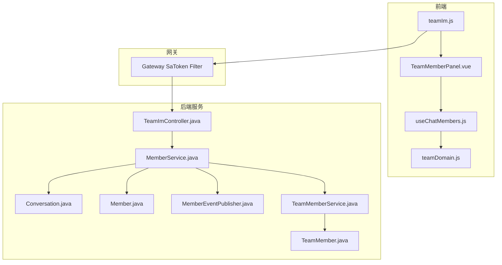
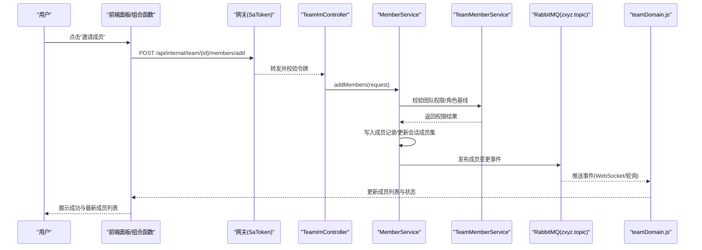
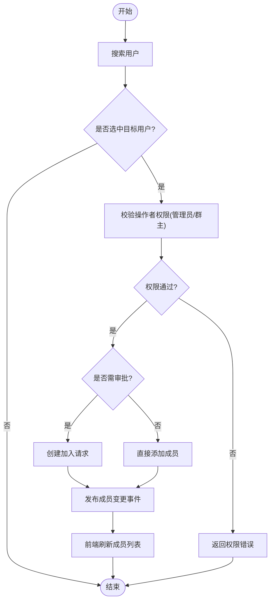
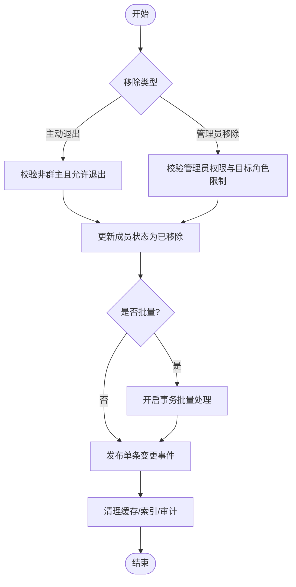
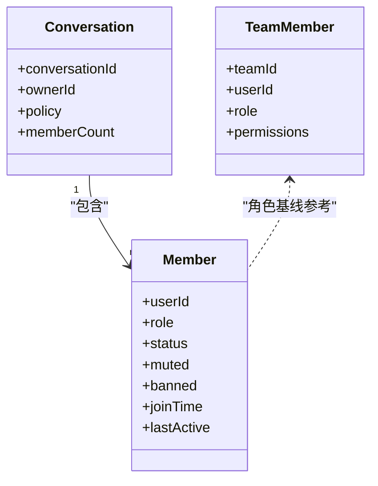
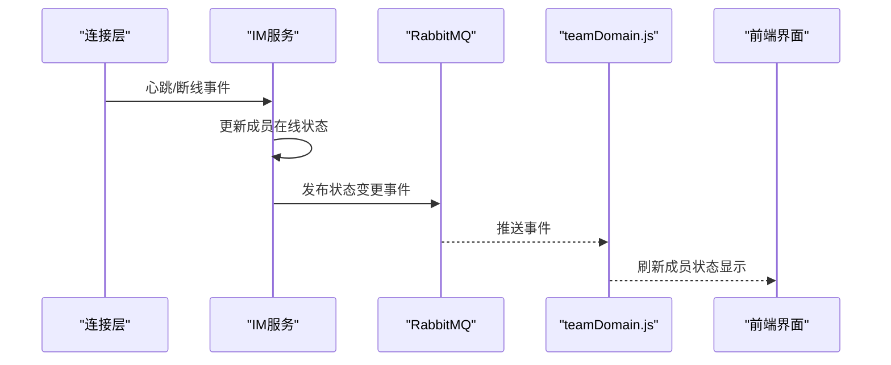
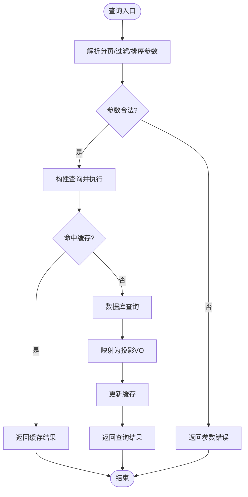
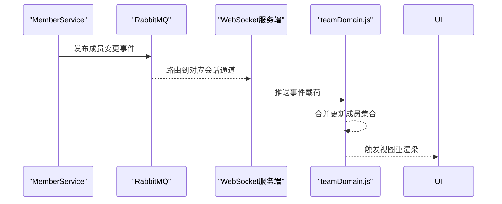
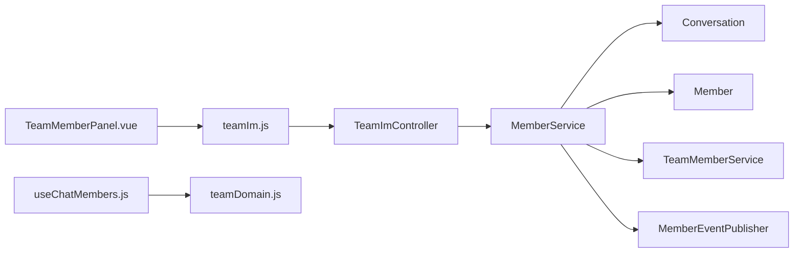

# 成员管理功能

<cite>
**本文引用的文件**   
- [zxyz-im-service/src/main/java/uno/acloud/im/application/MemberService.java](file://ZXYZdatabaseBack/zxyz-im-service/src/main/java/uno/acloud/im/application/MemberService.java)
- [zxyz-im-service/src/main/java/uno/acloud/im/controller/TeamImController.java](file://ZXYZdatabaseBack/zxyz-im-service/src/main/java/uno/acloud/im/controller/TeamImController.java)
- [zxyz-im-service/src/main/java/uno/acloud/im/domain/model/Conversation.java](file://ZXYZdatabaseBack/zxyz-im-service/src/main/java/uno/acloud/im/domain/model/Conversation.java)
- [zxyz-im-service/src/main/java/uno/acloud/im/domain/model/Member.java](file://ZXYZdatabaseBack/zxyz-im-service/src/main/java/uno/acloud/im/domain/model/Member.java)
- [zxyz-im-service/src/main/java/uno/acloud/im/dto/AddMemberRequest.java](file://ZXYZdatabaseBack/zxyz-im-service/src/main/java/uno/acloud/im/dto/AddMemberRequest.java)
- [zxyz-im-service/src/main/java/uno/acloud/im/dto/RemoveMemberRequest.java](file://ZXYZdatabaseBack/zxyz-im-service/src/main/java/uno/acloud/im/dto/RemoveMemberRequest.java)
- [zxyz-im-service/src/main/java/uno/acloud/im/dto/ListMembersRequest.java](file://ZXYZdatabaseBack/zxyz-im-service/src/main/java/uno/acloud/im/dto/ListMembersRequest.java)
- [zxyz-im-service/src/main/java/uno/acloud/im/dto/UpdateMemberRoleRequest.java](file://ZXYZdatabaseBack/zxyz-im-service/src/main/java/uno/acloud/im/dto/UpdateMemberRoleRequest.java)
- [zxyz-im-service/src/main/java/uno/acloud/im/infrastructure/mq/MemberEventPublisher.java](file://ZXYZdatabaseBack/zxyz-im-service/src/main/java/uno/acloud/im/infrastructure/mq/MemberEventPublisher.java)
- [zxyz-team-service/src/main/java/uno/acloud/team/service/TeamMemberService.java](file://ZXYZdatabaseBack/zxyz-team-service/src/main/java/uno/acloud/team/service/TeamMemberService.java)
- [zxyz-team-service/src/main/java/uno/acloud/team/entity/TeamMember.java](file://ZXYZdatabaseBack/zxyz-team-service/src/main/java/uno/acloud/team/entity/TeamMember.java)
- [ZXYZdatabaseFront/src/api/teamIm.js](file://ZXYZdatabaseFront/src/api/teamIm.js)
- [ZXYZdatabaseFront/src/components/team-settings/TeamMemberPanel.vue](file://ZXYZdatabaseFront/src/components/team-settings/TeamMemberPanel.vue)
- [ZXYZdatabaseFront/src/composables/useChatMembers.js](file://ZXYZdatabaseFront/src/composables/useChatMembers.js)
- [ZXYZdatabaseFront/src/store/im/teamDomain.js](file://ZXYZdatabaseFront/src/store/im/teamDomain.js)
</cite>

## 目录
1. [简介](#简介)
2. [项目结构](#项目结构)
3. [核心组件](#核心组件)
4. [架构总览](#架构总览)
5. [详细组件分析](#详细组件分析)
6. [依赖关系分析](#依赖关系分析)
7. [性能考虑](#性能考虑)
8. [故障排查指南](#故障排查指南)
9. [结论](#结论)
10. [附录：API调用示例](#附录api调用示例)

## 简介
本技术文档聚焦于ZXYZ即时通讯模块的成员管理功能，覆盖成员添加、移除、角色体系、状态管理与列表查询、变更通知机制、安全与一致性保障等关键方面。文档面向后端与前端开发者以及产品与运维人员，力求以循序渐进的方式呈现系统设计与实现细节，并提供可操作的API示例与排障建议。

## 项目结构
- 后端采用微服务架构，IM服务（zxyz-im-service）负责会话与成员管理的业务编排，团队服务（zxyz-team-service）提供团队维度的成员数据与权限基础。
- IM服务采用DDD分层（interfaces → application → domain → infrastructure），团队服务采用传统分层（controller → service → mapper → entity）。
- 前后端通过REST API交互，内部服务间通过窄端点+投影VO进行调用；异步事件通过RabbitMQ Topic Exchange zxyz.topic传递。

图表来源
- [TeamImController.java](file://ZXYZdatabaseBack/zxyz-im-service/src/main/java/uno/acloud/im/controller/TeamImController.java)
- [MemberService.java](file://ZXYZdatabaseBack/zxyz-im-service/src/main/java/uno/acloud/im/application/MemberService.java)
- [Conversation.java](file://ZXYZdatabaseBack/zxyz-im-service/src/main/java/uno/acloud/im/domain/model/Conversation.java)
- [Member.java](file://ZXYZdatabaseBack/zxyz-im-service/src/main/java/uno/acloud/im/domain/model/Member.java)
- [MemberEventPublisher.java](file://ZXYZdatabaseBack/zxyz-im-service/src/main/java/uno/acloud/im/infrastructure/mq/MemberEventPublisher.java)
- [TeamMemberService.java](file://ZXYZdatabaseBack/zxyz-team-service/src/main/java/uno/acloud/team/service/TeamMemberService.java)
- [TeamMember.java](file://ZXYZdatabaseBack/zxyz-team-service/src/main/java/uno/acloud/team/entity/TeamMember.java)
- [teamIm.js](file://ZXYZdatabaseFront/src/api/teamIm.js)
- [TeamMemberPanel.vue](file://ZXYZdatabaseFront/src/components/team-settings/TeamMemberPanel.vue)
- [useChatMembers.js](file://ZXYZdatabaseFront/src/composables/useChatMembers.js)
- [teamDomain.js](file://ZXYZdatabaseFront/src/store/im/teamDomain.js)

章节来源
- [TeamImController.java](file://ZXYZdatabaseBack/zxyz-im-service/src/main/java/uno/acloud/im/controller/TeamImController.java)
- [MemberService.java](file://ZXYZdatabaseBack/zxyz-im-service/src/main/java/uno/acloud/im/application/MemberService.java)
- [TeamMemberService.java](file://ZXYZdatabaseBack/zxyz-team-service/src/main/java/uno/acloud/team/service/TeamMemberService.java)

## 核心组件
- 控制器层：对外暴露成员管理相关接口，统一鉴权与参数校验。
- 应用服务层：编排成员增删改查、权限分配、加入确认、批量操作与事件发布。
- 领域模型：会话与成员实体，承载角色、状态与约束。
- 基础设施层：消息队列发布者，用于成员变更的异步广播。
- 团队服务：提供团队维度成员信息与权限基线，供IM服务聚合使用。
- 前端：页面面板、组合式函数与状态域，封装用户交互、请求与本地状态同步。

章节来源
- [TeamImController.java](file://ZXYZdatabaseBack/zxyz-im-service/src/main/java/uno/acloud/im/controller/TeamImController.java)
- [MemberService.java](file://ZXYZdatabaseBack/zxyz-im-service/src/main/java/uno/acloud/im/application/MemberService.java)
- [Conversation.java](file://ZXYZdatabaseBack/zxyz-im-service/src/main/java/uno/acloud/im/domain/model/Conversation.java)
- [Member.java](file://ZXYZdatabaseBack/zxyz-im-service/src/main/java/uno/acloud/im/domain/model/Member.java)
- [MemberEventPublisher.java](file://ZXYZdatabaseBack/zxyz-im-service/src/main/java/uno/acloud/im/infrastructure/mq/MemberEventPublisher.java)
- [TeamMemberService.java](file://ZXYZdatabaseBack/zxyz-team-service/src/main/java/uno/acloud/team/service/TeamMemberService.java)
- [TeamMember.java](file://ZXYZdatabaseBack/zxyz-team-service/src/main/java/uno/acloud/team/entity/TeamMember.java)
- [teamIm.js](file://ZXYZdatabaseFront/src/api/teamIm.js)
- [TeamMemberPanel.vue](file://ZXYZdatabaseFront/src/components/team-settings/TeamMemberPanel.vue)
- [useChatMembers.js](file://ZXYZdatabaseFront/src/composables/useChatMembers.js)
- [teamDomain.js](file://ZXYZdatabaseFront/src/store/im/teamDomain.js)

## 架构总览
成员管理流程贯穿“前端交互 → 网关鉴权 → IM控制器 → 应用服务 → 领域模型/团队服务 → MQ事件 → 客户端状态同步”。

图表来源
- [TeamImController.java](file://ZXYZdatabaseBack/zxyz-im-service/src/main/java/uno/acloud/im/controller/TeamImController.java)
- [MemberService.java](file://ZXYZdatabaseBack/zxyz-im-service/src/main/java/uno/acloud/im/application/MemberService.java)
- [TeamMemberService.java](file://ZXYZdatabaseBack/zxyz-team-service/src/main/java/uno/acloud/team/service/TeamMemberService.java)
- [MemberEventPublisher.java](file://ZXYZdatabaseBack/zxyz-im-service/src/main/java/uno/acloud/im/infrastructure/mq/MemberEventPublisher.java)
- [teamDomain.js](file://ZXYZdatabaseFront/src/store/im/teamDomain.js)

## 详细组件分析

### 成员添加流程（搜索、邀请、权限、加入确认）
- 用户搜索：前端根据输入关键字发起搜索，后端基于用户服务或索引返回候选用户。
- 邀请发送：选择目标用户后，调用内部接口创建成员申请或直加（取决于策略配置）。
- 权限分配：在应用服务中校验当前操作者对会话的管理员/群主权限，并依据角色策略设置初始角色。
- 加入确认：若为需审批模式，生成加入请求并等待审批；否则直接生效并发布成员变更事件。

图表来源
- [MemberService.java](file://ZXYZdatabaseBack/zxyz-im-service/src/main/java/uno/acloud/im/application/MemberService.java)
- [TeamMemberService.java](file://ZXYZdatabaseBack/zxyz-team-service/src/main/java/uno/acloud/team/service/TeamMemberService.java)
- [MemberEventPublisher.java](file://ZXYZdatabaseBack/zxyz-im-service/src/main/java/uno/acloud/im/infrastructure/mq/MemberEventPublisher.java)

章节来源
- [MemberService.java](file://ZXYZdatabaseBack/zxyz-im-service/src/main/java/uno/acloud/im/application/MemberService.java)
- [TeamMemberService.java](file://ZXYZdatabaseBack/zxyz-team-service/src/main/java/uno/acloud/team/service/TeamMemberService.java)

### 成员移除机制（主动退出、管理员移除、批量操作、数据清理）
- 主动退出：成员自行退出会话，应用服务校验其非群主且具备退出权限，更新成员状态并发布事件。
- 管理员移除：管理员对指定成员执行移除，需校验管理员权限与目标角色限制（如不可移除群主）。
- 批量操作：支持一次移除多个成员，内部事务保证原子性，失败回滚并汇总错误。
- 数据清理：移除后清理冗余缓存与索引，确保一致性；必要时触发审计日志。

图表来源
- [MemberService.java](file://ZXYZdatabaseBack/zxyz-im-service/src/main/java/uno/acloud/im/application/MemberService.java)
- [MemberEventPublisher.java](file://ZXYZdatabaseBack/zxyz-im-service/src/main/java/uno/acloud/im/infrastructure/mq/MemberEventPublisher.java)

章节来源
- [MemberService.java](file://ZXYZdatabaseBack/zxyz-im-service/src/main/java/uno/acloud/im/application/MemberService.java)

### 成员角色体系（普通成员、管理员、群主）
- 普通成员：仅具备基础聊天能力，无管理操作权限。
- 管理员：可执行成员增删、角色调整、静音/禁言等操作，受会话策略控制。
- 群主：拥有最高权限，包括解散会话、转移群主、删除所有成员等。
- 权限校验：在应用服务层结合团队服务提供的角色基线与IM策略进行决策。

图表来源
- [Member.java](file://ZXYZdatabaseBack/zxyz-im-service/src/main/java/uno/acloud/im/domain/model/Member.java)
- [Conversation.java](file://ZXYZdatabaseBack/zxyz-im-service/src/main/java/uno/acloud/im/domain/model/Conversation.java)
- [TeamMember.java](file://ZXYZdatabaseBack/zxyz-team-service/src/main/java/uno/acloud/team/entity/TeamMember.java)

章节来源
- [Member.java](file://ZXYZdatabaseBack/zxyz-im-service/src/main/java/uno/acloud/im/domain/model/Member.java)
- [Conversation.java](file://ZXYZdatabaseBack/zxyz-im-service/src/main/java/uno/acloud/im/domain/model/Conversation.java)
- [TeamMember.java](file://ZXYZdatabaseBack/zxyz-team-service/src/main/java/uno/acloud/team/entity/TeamMember.java)

### 成员状态管理（在线、静音、禁言、状态同步）
- 在线状态：由连接层维护，IM服务订阅心跳与断线事件，更新成员在线状态。
- 静音状态：管理员可对成员设置静音，影响其接收通知的能力。
- 禁言状态：管理员可对成员设置禁言，限制其发言能力。
- 状态同步：通过MQ事件推送至前端，前端store更新并渲染最新状态。

图表来源
- [MemberEventPublisher.java](file://ZXYZdatabaseBack/zxyz-im-service/src/main/java/uno/acloud/im/infrastructure/mq/MemberEventPublisher.java)
- [teamDomain.js](file://ZXYZdatabaseFront/src/store/im/teamDomain.js)

章节来源
- [MemberEventPublisher.java](file://ZXYZdatabaseBack/zxyz-im-service/src/main/java/uno/acloud/im/infrastructure/mq/MemberEventPublisher.java)
- [teamDomain.js](file://ZXYZdatabaseFront/src/store/im/teamDomain.js)

### 成员列表查询（分页、搜索过滤、排序、性能优化）
- 分页加载：支持页码与每页大小参数，避免一次性加载大量数据。
- 搜索过滤：按用户名、ID、角色、状态等条件过滤。
- 排序规则：支持按加入时间、最后活跃时间、角色优先级排序。
- 性能优化：使用投影VO减少数据传输，结合缓存与索引提升查询效率。

图表来源
- [MemberService.java](file://ZXYZdatabaseBack/zxyz-im-service/src/main/java/uno/acloud/im/application/MemberService.java)
- [ListMembersRequest.java](file://ZXYZdatabaseBack/zxyz-im-service/src/main/java/uno/acloud/im/dto/ListMembersRequest.java)

章节来源
- [MemberService.java](file://ZXYZdatabaseBack/zxyz-im-service/src/main/java/uno/acloud/im/application/MemberService.java)
- [ListMembersRequest.java](file://ZXYZdatabaseBack/zxyz-im-service/src/main/java/uno/acloud/im/dto/ListMembersRequest.java)

### 成员变更通知机制（实时推送、消息队列、客户端同步）
- 实时推送：通过WebSocket或长轮询将成员变更事件推送给客户端。
- 消息队列：IM服务发布事件到zxyz.topic，消费者订阅并分发。
- 客户端同步：前端store监听事件，合并增量更新，保持UI一致。

图表来源
- [MemberEventPublisher.java](file://ZXYZdatabaseBack/zxyz-im-service/src/main/java/uno/acloud/im/infrastructure/mq/MemberEventPublisher.java)
- [teamDomain.js](file://ZXYZdatabaseFront/src/store/im/teamDomain.js)

章节来源
- [MemberEventPublisher.java](file://ZXYZdatabaseBack/zxyz-im-service/src/main/java/uno/acloud/im/infrastructure/mq/MemberEventPublisher.java)
- [teamDomain.js](file://ZXYZdatabaseFront/src/store/im/teamDomain.js)

## 依赖关系分析
- 控制器依赖应用服务，应用服务依赖领域模型与团队服务，基础设施层依赖消息队列。
- 前端依赖API封装、组合函数与store，store依赖事件源（WebSocket/MQ）。
- 服务间调用遵循窄端点与投影VO，避免胖DTO泄露。

图表来源
- [TeamImController.java](file://ZXYZdatabaseBack/zxyz-im-service/src/main/java/uno/acloud/im/controller/TeamImController.java)
- [MemberService.java](file://ZXYZdatabaseBack/zxyz-im-service/src/main/java/uno/acloud/im/application/MemberService.java)
- [Conversation.java](file://ZXYZdatabaseBack/zxyz-im-service/src/main/java/uno/acloud/im/domain/model/Conversation.java)
- [Member.java](file://ZXYZdatabaseBack/zxyz-im-service/src/main/java/uno/acloud/im/domain/model/Member.java)
- [TeamMemberService.java](file://ZXYZdatabaseBack/zxyz-team-service/src/main/java/uno/acloud/team/service/TeamMemberService.java)
- [MemberEventPublisher.java](file://ZXYZdatabaseBack/zxyz-im-service/src/main/java/uno/acloud/im/infrastructure/mq/MemberEventPublisher.java)
- [teamIm.js](file://ZXYZdatabaseFront/src/api/teamIm.js)
- [TeamMemberPanel.vue](file://ZXYZdatabaseFront/src/components/team-settings/TeamMemberPanel.vue)
- [useChatMembers.js](file://ZXYZdatabaseFront/src/composables/useChatMembers.js)
- [teamDomain.js](file://ZXYZdatabaseFront/src/store/im/teamDomain.js)

章节来源
- [TeamImController.java](file://ZXYZdatabaseBack/zxyz-im-service/src/main/java/uno/acloud/im/controller/TeamImController.java)
- [MemberService.java](file://ZXYZdatabaseBack/zxyz-im-service/src/main/java/uno/acloud/im/application/MemberService.java)
- [teamIm.js](file://ZXYZdatabaseFront/src/api/teamIm.js)
- [teamDomain.js](file://ZXYZdatabaseFront/src/store/im/teamDomain.js)

## 性能考虑
- 分页与投影：合理设置页大小，使用投影VO减少网络传输。
- 缓存策略：热点成员列表与状态缓存，注意失效与一致性。
- 索引优化：对常用查询字段建立索引，避免全表扫描。
- 异步化：成员变更事件异步处理，降低主链路延迟。
- 限流与熔断：对批量操作与高频查询实施限流，防止雪崩。

[本节为通用指导，不直接分析具体文件]

## 故障排查指南
- 权限错误：检查操作者角色与会话策略，确认管理员/群主权限。
- 事件未推送：查看MQ消费日志与WebSocket连接状态。
- 列表不一致：核对缓存与数据库一致性，检查事件顺序与去重。
- 批量操作失败：定位事务回滚点，检查单条失败原因与重试策略。

章节来源
- [MemberService.java](file://ZXYZdatabaseBack/zxyz-im-service/src/main/java/uno/acloud/im/application/MemberService.java)
- [MemberEventPublisher.java](file://ZXYZdatabaseBack/zxyz-im-service/src/main/java/uno/acloud/im/infrastructure/mq/MemberEventPublisher.java)
- [teamDomain.js](file://ZXYZdatabaseFront/src/store/im/teamDomain.js)

## 结论
成员管理功能围绕权限校验、状态同步与事件驱动展开，通过DDD与传统分层结合，实现了高内聚、低耦合的设计。前端以组合函数与store为核心，保证了良好的用户体验与可维护性。后续可在缓存一致性、批量操作幂等性与监控告警方面持续优化。

[本节为总结，不直接分析具体文件]

## 附录：API调用示例
以下为常见场景的API调用说明（路径与方法以实际实现为准）：
- 添加成员：POST /api/internal/team/{id}/members/add，请求体包含目标用户ID与期望角色。
- 移除成员：POST /api/internal/team/{id}/members/remove，请求体包含待移除用户ID列表。
- 查询成员列表：GET /api/internal/team/{id}/members/list，支持分页、搜索与排序参数。
- 更新成员角色：PUT /api/internal/team/{id}/members/role，请求体包含用户ID与新角色。
- 获取成员状态：GET /api/internal/team/{id}/members/status，返回在线、静音、禁言等状态。

章节来源
- [TeamImController.java](file://ZXYZdatabaseBack/zxyz-im-service/src/main/java/uno/acloud/im/controller/TeamImController.java)
- [AddMemberRequest.java](file://ZXYZdatabaseBack/zxyz-im-service/src/main/java/uno/acloud/im/dto/AddMemberRequest.java)
- [RemoveMemberRequest.java](file://ZXYZdatabaseBack/zxyz-im-service/src/main/java/uno/acloud/im/dto/RemoveMemberRequest.java)
- [ListMembersRequest.java](file://ZXYZdatabaseBack/zxyz-im-service/src/main/java/uno/acloud/im/dto/ListMembersRequest.java)
- [UpdateMemberRoleRequest.java](file://ZXYZdatabaseBack/zxyz-im-service/src/main/java/uno/acloud/im/dto/UpdateMemberRoleRequest.java)
- [teamIm.js](file://ZXYZdatabaseFront/src/api/teamIm.js)