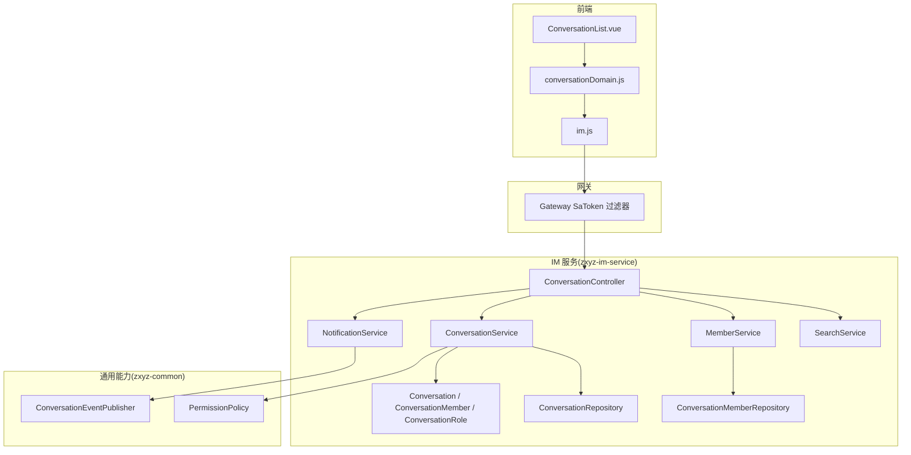
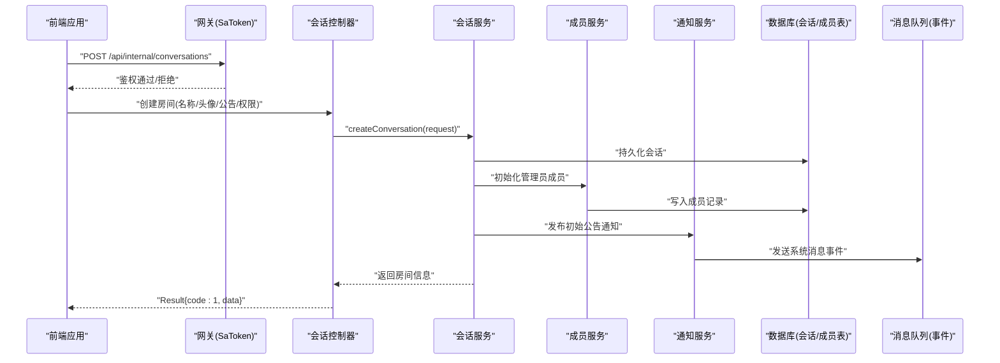
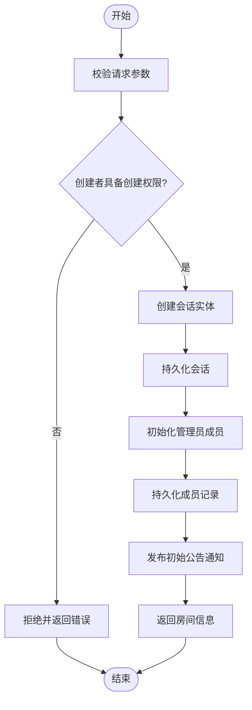
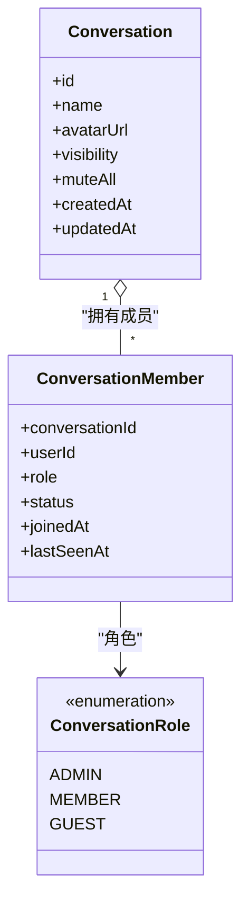
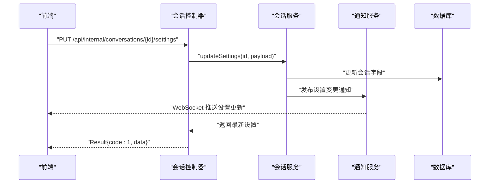
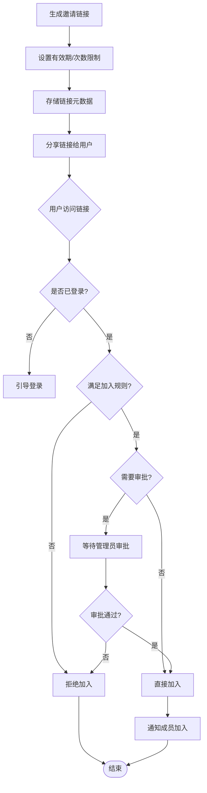
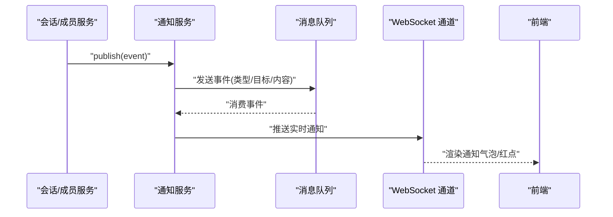
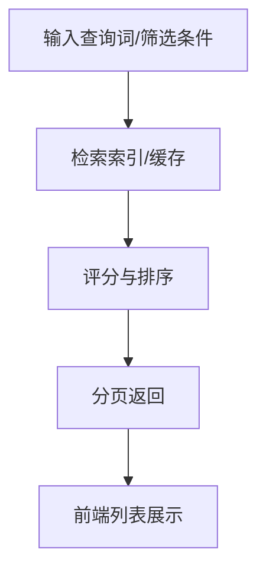
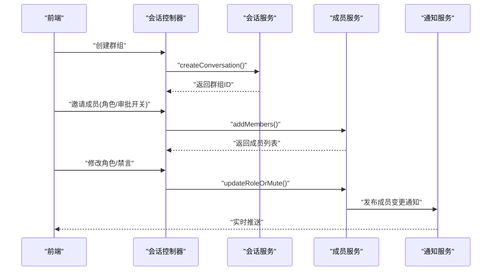
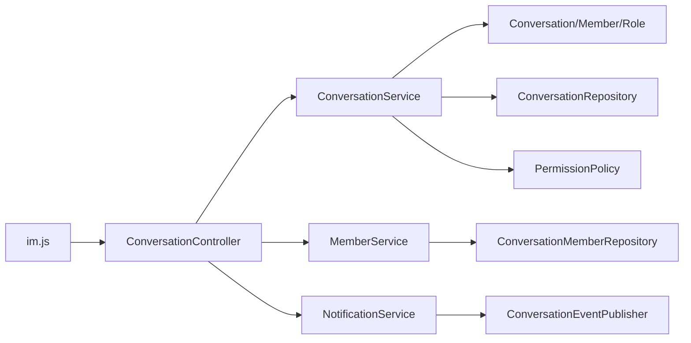

# 房间管理功能

<cite>
**本文档引用的文件**   
- [zxyz-im-service/src/main/java/uno/acloud/im/ZxyzImApplication.java](file://ZXYZdatabaseBack/zxyz-im-service/src/main/java/uno/acloud/im/ZxyzImApplication.java)
- [zxyz-im-service/src/main/java/uno/acloud/im/controller/ConversationController.java](file://ZXYZdatabaseBack/zxyz-im-service/src/main/java/uno/acloud/im/controller/ConversationController.java)
- [zxyz-im-service/src/main/java/uno/acloud/im/application/ConversationService.java](file://ZXYZdatabaseBack/zxyz-im-service/src/main/java/uno/acloud/im/application/ConversationService.java)
- [zxyz-im-service/src/main/java/uno/acloud/im/domain/model/conversation/Conversation.java](file://ZXYZdatabaseBack/zxyz-im-service/src/main/java/uno/acloud/im/domain/model/conversation/Conversation.java)
- [zxyz-im-service/src/main/java/uno/acloud/im/domain/model/conversation/ConversationMember.java](file://ZXYZdatabaseBack/zxyz-im-service/src/main/java/uno/acloud/im/domain/model/conversation/ConversationMember.java)
- [zxyz-im-service/src/main/java/uno/acloud/im/domain/model/conversation/ConversationRole.java](file://ZXYZdatabaseBack/zxyz-im-service/src/main/java/uno/acloud/im/domain/model/conversation/ConversationRole.java)
- [zxyz-im-service/src/main/java/uno/acloud/im/application/MemberService.java](file://ZXYZdatabaseBack/zxyz-im-service/src/main/java/uno/acloud/im/application/MemberService.java)
- [zxyz-im-service/src/main/java/uno/acloud/im/application/NotificationService.java](file://ZXYZdatabaseBack/zxyz-im-service/src/main/java/uno/acloud/im/application/NotificationService.java)
- [zxyz-im-service/src/main/java/uno/acloud/im/application/SearchService.java](file://ZXYZdatabaseBack/zxyz-im-service/src/main/java/uno/acloud/im/application/SearchService.java)
- [zxyz-im-service/src/main/java/uno/acloud/im/infrastructure/repository/ConversationRepository.java](file://ZXYZdatabaseBack/zxyz-im-service/src/main/java/uno/acloud/im/infrastructure/repository/ConversationRepository.java)
- [zxyz-im-service/src/main/java/uno/acloud/im/infrastructure/repository/ConversationMemberRepository.java](file://ZXYZdatabaseBack/zxyz-im-service/src/main/java/uno/acloud/im/infrastructure/repository/ConversationMemberRepository.java)
- [zxyz-im-service/src/main/resources/db/migration/V1__init_im_schema.sql](file://ZXYZdatabaseBack/zxyz-im-service/src/main/resources/db/migration/V1__init_im_schema.sql)
- [zxyz-common/src/main/java/uno/acloud/common/event/ConversationEventPublisher.java](file://ZXYZdatabaseBack/zxyz-common/src/main/java/uno/acloud/common/event/ConversationEventPublisher.java)
- [zxyz-common/src/main/java/uno/acloud/common/permission/PermissionPolicy.java](file://ZXYZdatabaseBack/zxyz-common/src/main/java/uno/acloud/common/permission/PermissionPolicy.java)
- [ZXYZdatabaseFront/src/api/im.js](file://ZXYZdatabaseFront/src/api/im.js)
- [ZXYZdatabaseFront/src/store/im/conversationDomain.js](file://ZXYZdatabaseFront/src/store/im/conversationDomain.js)
- [ZXYZdatabaseFront/src/views/chat/components/ConversationList.vue](file://ZXYZdatabaseFront/src/views/chat/components/ConversationList.vue)
</cite>

## 目录
1. [简介](#简介)
2. [项目结构](#项目结构)
3. [核心组件](#核心组件)
4. [架构总览](#架构总览)
5. [详细组件分析](#详细组件分析)
6. [依赖关系分析](#依赖关系分析)
7. [性能考虑](#性能考虑)
8. [故障排查指南](#故障排查指南)
9. [结论](#结论)
10. [附录](#附录)

## 简介
本文件为 ZXYZ 即时通讯模块的“房间管理”能力提供全面开发文档，覆盖群组创建、成员管理、群组设置、邀请链接、通知系统、搜索与发现、完整示例流程与安全策略。文档面向后端与前端开发者，兼顾非技术读者理解。

## 项目结构
IM 服务采用 DDD 分层（interfaces → application → domain → infrastructure），配合通用能力模块 zxyz-common 提供事件发布与权限策略；前端基于 Vue 3 + Pinia，通过 API 层与 IM 服务交互，状态集中在 store/im 域。

图表来源
- [ConversationController.java](file://ZXYZdatabaseBack/zxyz-im-service/src/main/java/uno/acloud/im/controller/ConversationController.java)
- [ConversationService.java](file://ZXYZdatabaseBack/zxyz-im-service/src/main/java/uno/acloud/im/application/ConversationService.java)
- [MemberService.java](file://ZXYZdatabaseBack/zxyz-im-service/src/main/java/uno/acloud/im/application/MemberService.java)
- [NotificationService.java](file://ZXYZdatabaseBack/zxyz-im-service/src/main/java/uno/acloud/im/application/NotificationService.java)
- [SearchService.java](file://ZXYZdatabaseBack/zxyz-im-service/src/main/java/uno/acloud/im/application/SearchService.java)
- [Conversation.java](file://ZXYZdatabaseBack/zxyz-im-service/src/main/java/uno/acloud/im/domain/model/conversation/Conversation.java)
- [ConversationMember.java](file://ZXYZdatabaseBack/zxyz-im-service/src/main/java/uno/acloud/im/domain/model/conversation/ConversationMember.java)
- [ConversationRole.java](file://ZXYZdatabaseBack/zxyz-im-service/src/main/java/uno/acloud/im/domain/model/conversation/ConversationRole.java)
- [ConversationRepository.java](file://ZXYZdatabaseBack/zxyz-im-service/src/main/java/uno/acloud/im/infrastructure/repository/ConversationRepository.java)
- [ConversationMemberRepository.java](file://ZXYZdatabaseBack/zxyz-im-service/src/main/java/uno/acloud/im/infrastructure/repository/ConversationMemberRepository.java)
- [ConversationEventPublisher.java](file://ZXYZdatabaseBack/zxyz-common/src/main/java/uno/acloud/common/event/ConversationEventPublisher.java)
- [PermissionPolicy.java](file://ZXYZdatabaseBack/zxyz-common/src/main/java/uno/acloud/common/permission/PermissionPolicy.java)
- [im.js](file://ZXYZdatabaseFront/src/api/im.js)
- [conversationDomain.js](file://ZXYZdatabaseFront/src/store/im/conversationDomain.js)
- [ConversationList.vue](file://ZXYZdatabaseFront/src/views/chat/components/ConversationList.vue)

章节来源
- [ZxyzImApplication.java](file://ZXYZdatabaseBack/zxyz-im-service/src/main/java/uno/acloud/im/ZxyzImApplication.java)

## 核心组件
- 会话控制器：暴露房间相关的 REST 端点，负责参数校验、鉴权与响应封装。
- 会话服务：编排房间生命周期（创建、更新、公告、静音等）与权限检查。
- 成员服务：处理成员增删、角色分配、加入审批与状态监控。
- 通知服务：统一发送系统消息、成员变更通知与重要提醒。
- 搜索服务：实现房间搜索、推荐与热门展示。
- 领域模型：会话、成员、角色定义业务语义与不变式。
- 仓储接口：抽象持久化访问，屏蔽数据库细节。
- 通用能力：事件发布与权限策略，保证跨服务一致性与安全。

章节来源
- [ConversationController.java](file://ZXYZdatabaseBack/zxyz-im-service/src/main/java/uno/acloud/im/controller/ConversationController.java)
- [ConversationService.java](file://ZXYZdatabaseBack/zxyz-im-service/src/main/java/uno/acloud/im/application/ConversationService.java)
- [MemberService.java](file://ZXYZdatabaseBack/zxyz-im-service/src/main/java/uno/acloud/im/application/MemberService.java)
- [NotificationService.java](file://ZXYZdatabaseBack/zxyz-im-service/src/main/java/uno/acloud/im/application/NotificationService.java)
- [SearchService.java](file://ZXYZdatabaseBack/zxyz-im-service/src/main/java/uno/acloud/im/application/SearchService.java)
- [Conversation.java](file://ZXYZdatabaseBack/zxyz-im-service/src/main/java/uno/acloud/im/domain/model/conversation/Conversation.java)
- [ConversationMember.java](file://ZXYZdatabaseBack/zxyz-im-service/src/main/java/uno/acloud/im/domain/model/conversation/ConversationMember.java)
- [ConversationRole.java](file://ZXYZdatabaseBack/zxyz-im-service/src/main/java/uno/acloud/im/domain/model/conversation/ConversationRole.java)
- [ConversationRepository.java](file://ZXYZdatabaseBack/zxyz-im-service/src/main/java/uno/acloud/im/infrastructure/repository/ConversationRepository.java)
- [ConversationMemberRepository.java](file://ZXYZdatabaseBack/zxyz-im-service/src/main/java/uno/acloud/im/infrastructure/repository/ConversationMemberRepository.java)
- [ConversationEventPublisher.java](file://ZXYZdatabaseBack/zxyz-common/src/main/java/uno/acloud/common/event/ConversationEventPublisher.java)
- [PermissionPolicy.java](file://ZXYZdatabaseBack/zxyz-common/src/main/java/uno/acloud/common/permission/PermissionPolicy.java)

## 架构总览
下图展示了从前端到后端的请求链路，以及 IM 服务内部的分层协作。

图表来源
- [ConversationController.java](file://ZXYZdatabaseBack/zxyz-im-service/src/main/java/uno/acloud/im/controller/ConversationController.java)
- [ConversationService.java](file://ZXYZdatabaseBack/zxyz-im-service/src/main/java/uno/acloud/im/application/ConversationService.java)
- [MemberService.java](file://ZXYZdatabaseBack/zxyz-im-service/src/main/java/uno/acloud/im/application/MemberService.java)
- [NotificationService.java](file://ZXYZdatabaseBack/zxyz-im-service/src/main/java/uno/acloud/im/application/NotificationService.java)
- [ConversationRepository.java](file://ZXYZdatabaseBack/zxyz-im-service/src/main/java/uno/acloud/im/infrastructure/repository/ConversationRepository.java)
- [ConversationMemberRepository.java](file://ZXYZdatabaseBack/zxyz-im-service/src/main/java/uno/acloud/im/infrastructure/repository/ConversationMemberRepository.java)
- [ConversationEventPublisher.java](file://ZXYZdatabaseBack/zxyz-common/src/main/java/uno/acloud/common/event/ConversationEventPublisher.java)

## 详细组件分析

### 群组创建流程
- 基本信息设置：名称、头像、可见性、是否允许外部加入等。
- 成员邀请：创建者自动成为管理员，可批量邀请成员并指定初始角色。
- 权限配置：默认权限策略由 PermissionPolicy 控制，支持按角色细粒度授权。
- 初始公告：创建成功后发布系统公告，确保新成员首次进入即知规则。

图表来源
- [ConversationService.java](file://ZXYZdatabaseBack/zxyz-im-service/src/main/java/uno/acloud/im/application/ConversationService.java)
- [PermissionPolicy.java](file://ZXYZdatabaseBack/zxyz-common/src/main/java/uno/acloud/common/permission/PermissionPolicy.java)
- [ConversationRepository.java](file://ZXYZdatabaseBack/zxyz-im-service/src/main/java/uno/acloud/im/infrastructure/repository/ConversationRepository.java)
- [ConversationMemberRepository.java](file://ZXYZdatabaseBack/zxyz-im-service/src/main/java/uno/acloud/im/infrastructure/repository/ConversationMemberRepository.java)
- [NotificationService.java](file://ZXYZdatabaseBack/zxyz-im-service/src/main/java/uno/acloud/im/application/NotificationService.java)

章节来源
- [ConversationController.java](file://ZXYZdatabaseBack/zxyz-im-service/src/main/java/uno/acloud/im/controller/ConversationController.java)
- [ConversationService.java](file://ZXYZdatabaseBack/zxyz-im-service/src/main/java/uno/acloud/im/application/ConversationService.java)
- [Conversation.java](file://ZXYZdatabaseBack/zxyz-im-service/src/main/java/uno/acloud/im/domain/model/conversation/Conversation.java)
- [ConversationMember.java](file://ZXYZdatabaseBack/zxyz-im-service/src/main/java/uno/acloud/im/domain/model/conversation/ConversationMember.java)
- [ConversationRole.java](file://ZXYZdatabaseBack/zxyz-im-service/src/main/java/uno/acloud/im/domain/model/conversation/ConversationRole.java)
- [V1__init_im_schema.sql](file://ZXYZdatabaseBack/zxyz-im-service/src/main/resources/db/migration/V1__init_im_schema.sql)

### 成员管理功能
- 添加/移除成员：支持单人与批量操作，包含加入审批流程（可选）。
- 角色分配：管理员、普通成员、访客等角色，不同角色具备不同权限。
- 权限控制：基于 PermissionPolicy 进行资源级权限判定，防止越权。
- 状态监控：在线/离线、禁言、冻结等状态变化通过通知与事件传播。

图表来源
- [Conversation.java](file://ZXYZdatabaseBack/zxyz-im-service/src/main/java/uno/acloud/im/domain/model/conversation/Conversation.java)
- [ConversationMember.java](file://ZXYZdatabaseBack/zxyz-im-service/src/main/java/uno/acloud/im/domain/model/conversation/ConversationMember.java)
- [ConversationRole.java](file://ZXYZdatabaseBack/zxyz-im-service/src/main/java/uno/acloud/im/domain/model/conversation/ConversationRole.java)

章节来源
- [MemberService.java](file://ZXYZdatabaseBack/zxyz-im-service/src/main/java/uno/acloud/im/application/MemberService.java)
- [ConversationMemberRepository.java](file://ZXYZdatabaseBack/zxyz-im-service/src/main/java/uno/acloud/im/infrastructure/repository/ConversationMemberRepository.java)
- [PermissionPolicy.java](file://ZXYZdatabaseBack/zxyz-common/src/main/java/uno/acloud/common/permission/PermissionPolicy.java)

### 群组设置管理
- 修改群名与头像：需具备相应权限，变更后广播给成员。
- 发布公告：支持富文本或模板化公告，可标记重要程度。
- 静音设置：全群静音或针对特定用户禁言，影响消息推送与显示。

图表来源
- [ConversationController.java](file://ZXYZdatabaseBack/zxyz-im-service/src/main/java/uno/acloud/im/controller/ConversationController.java)
- [ConversationService.java](file://ZXYZdatabaseBack/zxyz-im-service/src/main/java/uno/acloud/im/application/ConversationService.java)
- [NotificationService.java](file://ZXYZdatabaseBack/zxyz-im-service/src/main/java/uno/acloud/im/application/NotificationService.java)

章节来源
- [ConversationService.java](file://ZXYZdatabaseBack/zxyz-im-service/src/main/java/uno/acloud/im/application/ConversationService.java)
- [ConversationRepository.java](file://ZXYZdatabaseBack/zxyz-im-service/src/main/java/uno/acloud/im/infrastructure/repository/ConversationRepository.java)

### 邀请链接机制
- 链接生成：支持一次性或多次使用，可设置有效期与最大加入人数。
- 访问控制：未登录用户需先认证，已登录用户需满足加入条件（如团队归属）。
- 加入审批：可开启审批流，由管理员审核通过后加入。

图表来源
- [ConversationService.java](file://ZXYZdatabaseBack/zxyz-im-service/src/main/java/uno/acloud/im/application/ConversationService.java)
- [MemberService.java](file://ZXYZdatabaseBack/zxyz-im-service/src/main/java/uno/acloud/im/application/MemberService.java)
- [NotificationService.java](file://ZXYZdatabaseBack/zxyz-im-service/src/main/java/uno/acloud/im/application/NotificationService.java)

章节来源
- [ConversationController.java](file://ZXYZdatabaseBack/zxyz-im-service/src/main/java/uno/acloud/im/controller/ConversationController.java)
- [ConversationService.java](file://ZXYZdatabaseBack/zxyz-im-service/src/main/java/uno/acloud/im/application/ConversationService.java)
- [MemberService.java](file://ZXYZdatabaseBack/zxyz-im-service/src/main/java/uno/acloud/im/application/MemberService.java)

### 群组通知系统
- 系统消息：公告、规则更新、维护通知。
- 成员变更通知：加入、离开、角色变更、禁言/解禁。
- 重要提醒：@提及、任务提醒、审批结果。

图表来源
- [NotificationService.java](file://ZXYZdatabaseBack/zxyz-im-service/src/main/java/uno/acloud/im/application/NotificationService.java)
- [ConversationEventPublisher.java](file://ZXYZdatabaseBack/zxyz-common/src/main/java/uno/acloud/common/event/ConversationEventPublisher.java)

章节来源
- [NotificationService.java](file://ZXYZdatabaseBack/zxyz-im-service/src/main/java/uno/acloud/im/application/NotificationService.java)
- [ConversationEventPublisher.java](file://ZXYZdatabaseBack/zxyz-common/src/main/java/uno/acloud/common/event/ConversationEventPublisher.java)

### 群组搜索与发现
- 搜索：按名称、标签、描述模糊匹配，支持分页与排序。
- 推荐：基于团队内活跃度、共同成员、历史互动计算推荐分。
- 热门：统计加入速率、消息量、活跃天数，展示热门群组。

图表来源
- [SearchService.java](file://ZXYZdatabaseBack/zxyz-im-service/src/main/java/uno/acloud/im/application/SearchService.java)
- [ConversationRepository.java](file://ZXYZdatabaseBack/zxyz-im-service/src/main/java/uno/acloud/im/infrastructure/repository/ConversationRepository.java)

章节来源
- [SearchService.java](file://ZXYZdatabaseBack/zxyz-im-service/src/main/java/uno/acloud/im/application/SearchService.java)

### 完整示例：创建群组、管理成员、处理权限变更
- 创建群组：调用会话创建接口，设置基本信息与初始公告。
- 邀请成员：批量添加成员并分配角色，必要时开启审批。
- 权限变更：调整成员角色或禁言，触发通知与审计。

图表来源
- [ConversationController.java](file://ZXYZdatabaseBack/zxyz-im-service/src/main/java/uno/acloud/im/controller/ConversationController.java)
- [ConversationService.java](file://ZXYZdatabaseBack/zxyz-im-service/src/main/java/uno/acloud/im/application/ConversationService.java)
- [MemberService.java](file://ZXYZdatabaseBack/zxyz-im-service/src/main/java/uno/acloud/im/application/MemberService.java)
- [NotificationService.java](file://ZXYZdatabaseBack/zxyz-im-service/src/main/java/uno/acloud/im/application/NotificationService.java)

章节来源
- [ConversationController.java](file://ZXYZdatabaseBack/zxyz-im-service/src/main/java/uno/acloud/im/controller/ConversationController.java)
- [ConversationService.java](file://ZXYZdatabaseBack/zxyz-im-service/src/main/java/uno/acloud/im/application/ConversationService.java)
- [MemberService.java](file://ZXYZdatabaseBack/zxyz-im-service/src/main/java/uno/acloud/im/application/MemberService.java)

## 依赖关系分析
- 控制器依赖应用服务，应用服务依赖领域模型与仓储接口。
- 通知服务依赖事件发布器，通过消息队列异步解耦。
- 权限策略在通用模块中集中管理，所有服务共享同一套策略。
- 前端通过 im.js 调用后端 API，conversationDomain.js 管理会话状态。

图表来源
- [im.js](file://ZXYZdatabaseFront/src/api/im.js)
- [ConversationController.java](file://ZXYZdatabaseBack/zxyz-im-service/src/main/java/uno/acloud/im/controller/ConversationController.java)
- [ConversationService.java](file://ZXYZdatabaseBack/zxyz-im-service/src/main/java/uno/acloud/im/application/ConversationService.java)
- [MemberService.java](file://ZXYZdatabaseBack/zxyz-im-service/src/main/java/uno/acloud/im/application/MemberService.java)
- [NotificationService.java](file://ZXYZdatabaseBack/zxyz-im-service/src/main/java/uno/acloud/im/application/NotificationService.java)
- [Conversation.java](file://ZXYZdatabaseBack/zxyz-im-service/src/main/java/uno/acloud/im/domain/model/conversation/Conversation.java)
- [ConversationMember.java](file://ZXYZdatabaseBack/zxyz-im-service/src/main/java/uno/acloud/im/domain/model/conversation/ConversationMember.java)
- [ConversationRole.java](file://ZXYZdatabaseBack/zxyz-im-service/src/main/java/uno/acloud/im/domain/model/conversation/ConversationRole.java)
- [ConversationRepository.java](file://ZXYZdatabaseBack/zxyz-im-service/src/main/java/uno/acloud/im/infrastructure/repository/ConversationRepository.java)
- [ConversationMemberRepository.java](file://ZXYZdatabaseBack/zxyz-im-service/src/main/java/uno/acloud/im/infrastructure/repository/ConversationMemberRepository.java)
- [ConversationEventPublisher.java](file://ZXYZdatabaseBack/zxyz-common/src/main/java/uno/acloud/common/event/ConversationEventPublisher.java)
- [PermissionPolicy.java](file://ZXYZdatabaseBack/zxyz-common/src/main/java/uno/acloud/common/permission/PermissionPolicy.java)

章节来源
- [conversationDomain.js](file://ZXYZdatabaseFront/src/store/im/conversationDomain.js)
- [ConversationList.vue](file://ZXYZdatabaseFront/src/views/chat/components/ConversationList.vue)

## 性能考虑
- 读写分离与缓存：对热门群组信息与成员列表使用缓存，降低数据库压力。
- 事件异步化：通知与审计通过消息队列异步处理，提升主流程吞吐。
- 分页与限流：搜索与列表接口强制分页，避免大结果集；对写操作进行频率限制。
- 连接池与超时：合理配置数据库与 HTTP 客户端连接池，避免资源耗尽。

[本节为通用指导，不直接分析具体文件]

## 故障排查指南
- 鉴权失败：检查 Gateway 的 SaToken 过滤器与 Cookie/Session 配置。
- 权限不足：确认 PermissionPolicy 的规则与成员角色是否正确。
- 通知未达：核查消息队列消费者与 WebSocket 通道状态。
- 数据不一致：查看事务边界与重试策略，必要时回滚补偿。

章节来源
- [ConversationController.java](file://ZXYZdatabaseBack/zxyz-im-service/src/main/java/uno/acloud/im/controller/ConversationController.java)
- [PermissionPolicy.java](file://ZXYZdatabaseBack/zxyz-common/src/main/java/uno/acloud/common/permission/PermissionPolicy.java)
- [ConversationEventPublisher.java](file://ZXYZdatabaseBack/zxyz-common/src/main/java/uno/acloud/common/event/ConversationEventPublisher.java)

## 结论
房间管理功能围绕会话与成员两大核心领域展开，通过 DDD 分层与通用权限策略保障扩展性与安全性。前后端协作清晰，事件驱动的通知体系提升了用户体验。建议在生产环境完善监控与审计，持续优化搜索与推荐算法。

[本节为总结，不直接分析具体文件]

## 附录
- 数据库迁移：参考 V1__init_im_schema.sql 了解会话与成员表结构。
- 前端集成：参考 im.js 与 conversationDomain.js 完成 API 调用与状态管理。
- 部署与配置：Nacos 动态配置与 Jasypt 加密敏感项，详见项目根目录配置说明。

章节来源
- [V1__init_im_schema.sql](file://ZXYZdatabaseBack/zxyz-im-service/src/main/resources/db/migration/V1__init_im_schema.sql)
- [im.js](file://ZXYZdatabaseFront/src/api/im.js)
- [conversationDomain.js](file://ZXYZdatabaseFront/src/store/im/conversationDomain.js)