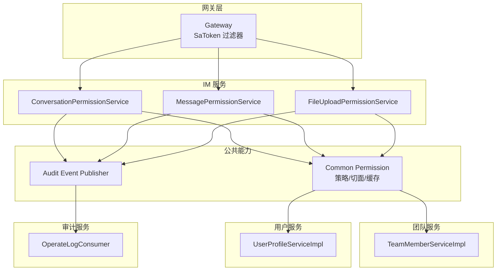
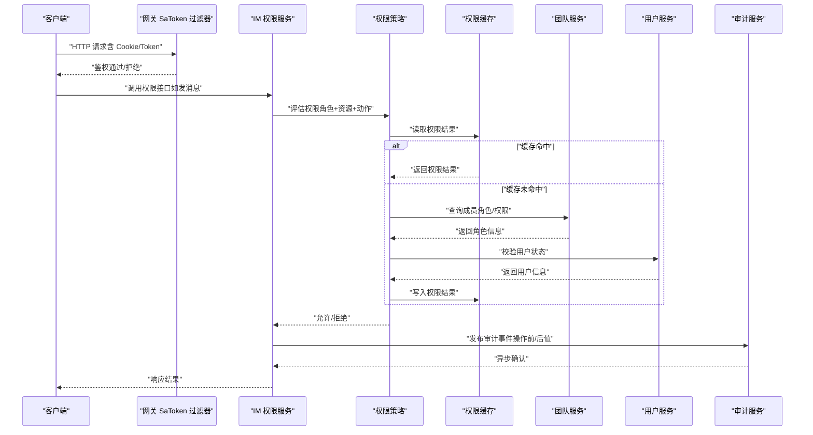
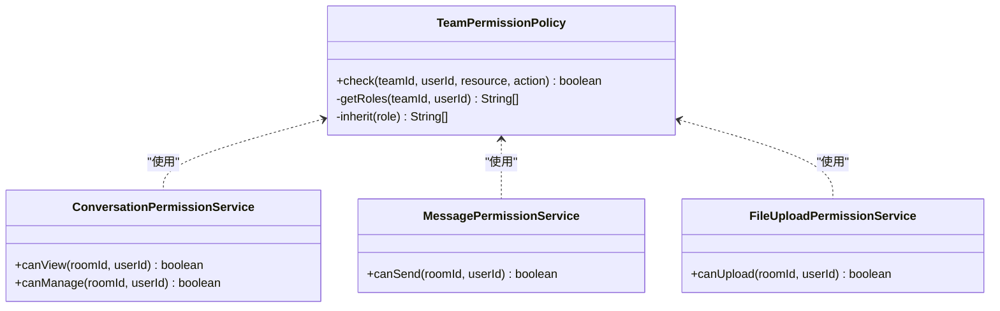
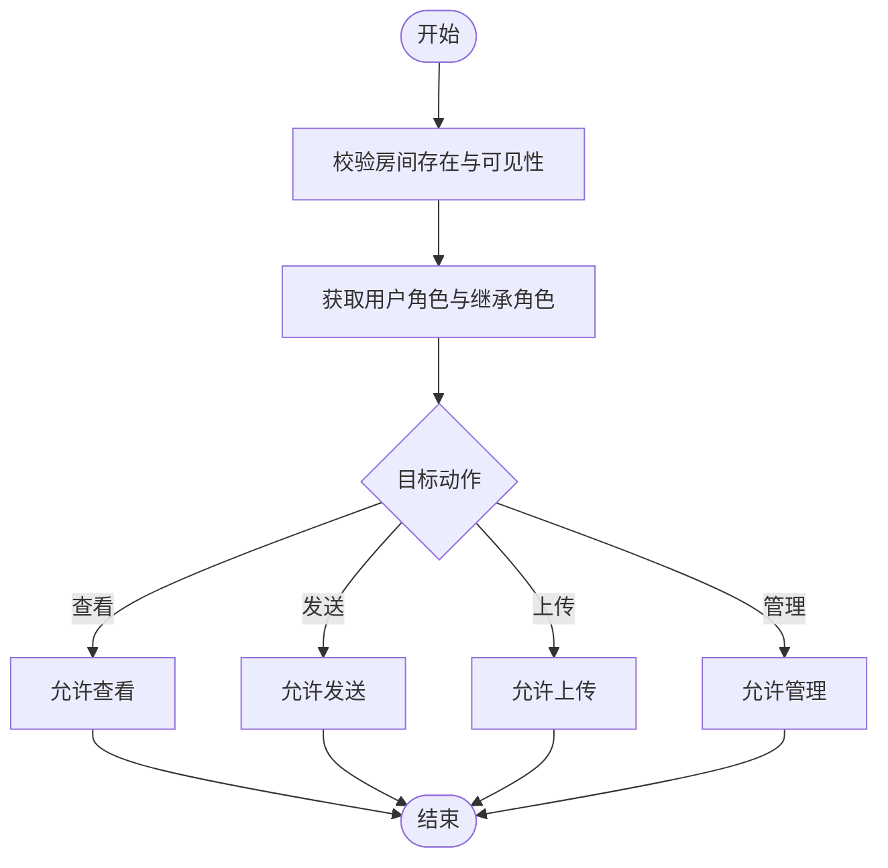
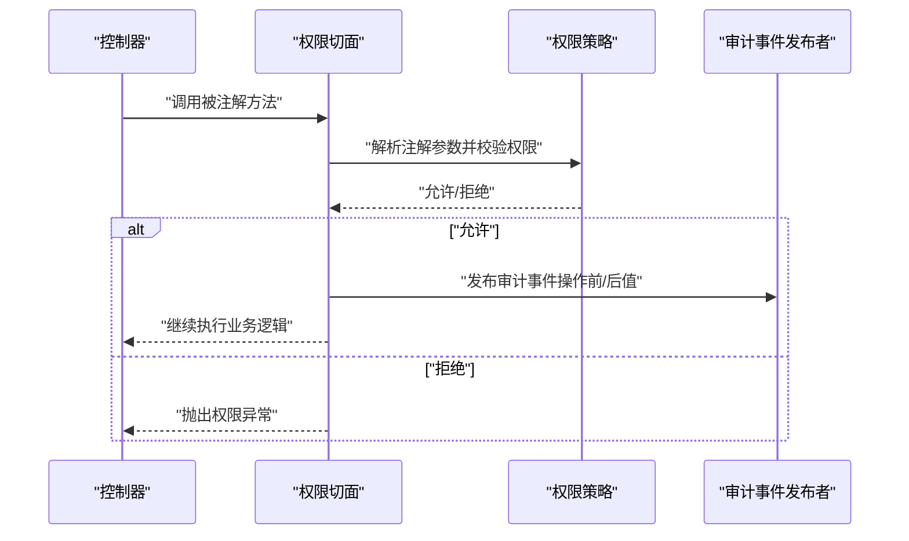
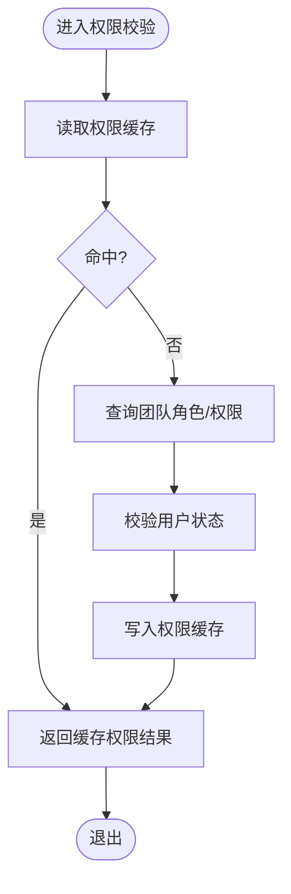
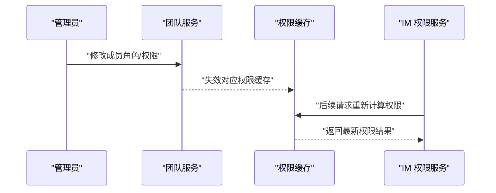
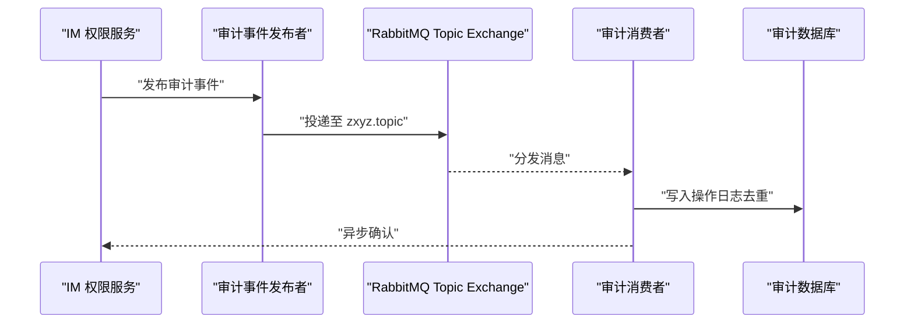
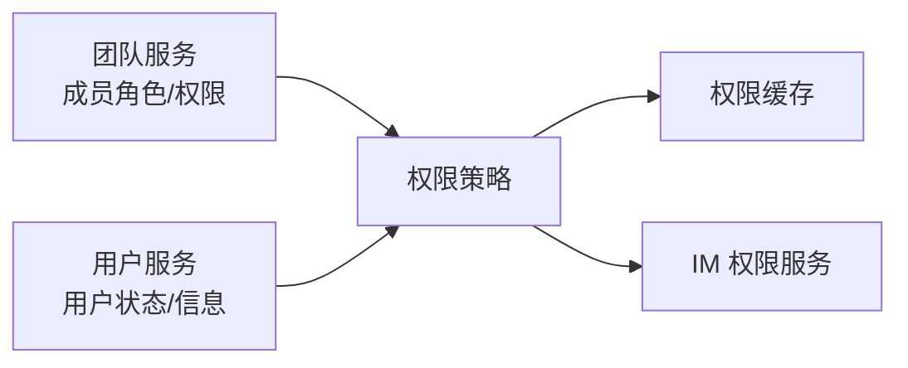
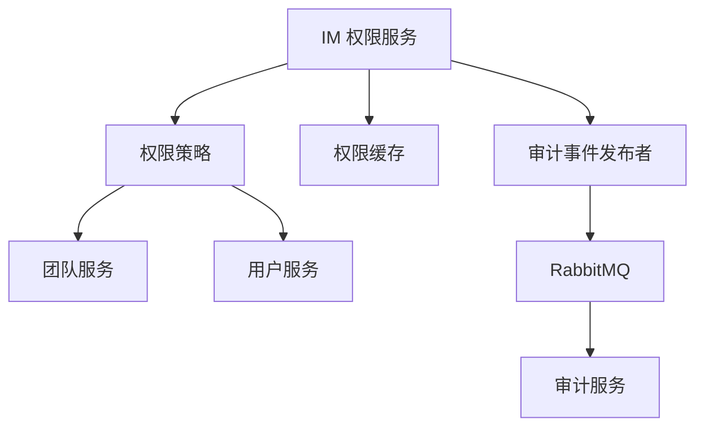

# 权限控制功能

<cite>
**本文引用的文件**   
- [zxyz-im-service/src/main/java/uno/acloud/im/application/ConversationPermissionService.java](file://ZXYZdatabaseBack/zxyz-im-service/src/main/java/uno/acloud/im/application/ConversationPermissionService.java)
- [zxyz-im-service/src/main/java/uno/acloud/im/application/MessagePermissionService.java](file://ZXYZdatabaseBack/zxyz-im-service/src/main/java/uno/acloud/im/application/MessagePermissionService.java)
- [zxyz-im-service/src/main/java/uno/acloud/im/application/FileUploadPermissionService.java](file://ZXYZdatabaseBack/zxyz-im-service/src/main/java/uno/acloud/im/application/FileUploadPermissionService.java)
- [zxyz-common/src/main/java/uno/acloud/common/permission/TeamPermissionPolicy.java](file://ZXYZdatabaseBack/zxyz-common/src/main/java/uno/acloud/common/permission/TeamPermissionPolicy.java)
- [zxyz-common/src/main/java/uno/acloud/common/permission/PermissionAspect.java](file://ZXYZdatabaseBack/zxyz-common/src/main/java/uno/acloud/common/permission/PermissionAspect.java)
- [zxyz-common/src/main/java/uno/acloud/common/permission/PermissionCache.java](file://ZXYZdatabaseBack/zxyz-common/src/main/java/uno/acloud/common/permission/PermissionCache.java)
- [zxyz-team-service/src/main/java/uno/acloud/team/service/impl/TeamMemberServiceImpl.java](file://ZXYZdatabaseBack/zxyz-team-service/src/main/java/uno/acloud/team/service/impl/TeamMemberServiceImpl.java)
- [zxyz-user-service/src/main/java/uno/acloud/user/service/impl/UserProfileServiceImpl.java](file://ZXYZdatabaseBack/zxyz-user-service/src/main/java/uno/acloud/user/service/impl/UserProfileServiceImpl.java)
- [zxyz-audit-service/src/main/java/uno/acloud/audit/mq/OperateLogConsumer.java](file://ZXYZdatabaseBack/zxyz-audit-service/src/main/java/uno/acloud/audit/mq/OperateLogConsumer.java)
- [zxyz-common/src/main/java/uno/acloud/common/audit/AuditEventPublisher.java](file://ZXYZdatabaseBack/zxyz-common/src/main/java/uno/acloud/common/audit/AuditEventPublisher.java)
- [zxyz-gateway/src/main/java/uno/acloud/gateway/filter/SaTokenFilterConfig.java](file://ZXYZdatabaseBack/zxyz-gateway/src/main/java/uno/acloud/gateway/filter/SaTokenFilterConfig.java)
- [nacos-config/zxyz-dynamic.yml](file://nacos-config/zxyz-dynamic.yml)
</cite>

## 目录
1. [简介](#简介)
2. [项目结构](#项目结构)
3. [核心组件](#核心组件)
4. [架构总览](#架构总览)
5. [详细组件分析](#详细组件分析)
6. [依赖关系分析](#依赖关系分析)
7. [性能考虑](#性能考虑)
8. [故障排查指南](#故障排查指南)
9. [结论](#结论)
10. [附录](#附录)

## 简介
本技术文档聚焦 ZXYZ 即时通讯（IM）模块的权限控制能力，围绕 RBAC 模型在房间管理中的应用展开，涵盖角色定义、权限粒度与继承关系；详细说明房间级权限校验（成员查看、消息发送、文件上传、成员管理等）；阐述 AOP 切面实现、缓存策略与性能优化；解释动态权限调整（角色变更、授权与撤销的实时生效）；描述权限审计（操作记录、日志追踪、合规性检查）；说明跨服务权限同步（团队服务、用户服务的一致性保证）；并提供完整示例与安全最佳实践。

## 项目结构
本项目采用微服务架构，后端包含多个 Maven 模块，前端为 Vue 应用。权限相关代码主要分布在：
- zxyz-common：通用权限策略、AOP 切面、权限缓存、审计事件发布等
- zxyz-im-service：IM 业务中的权限服务（会话/消息/文件上传）
- zxyz-team-service：团队与成员权限数据源
- zxyz-user-service：用户身份与基础信息
- zxyz-audit-service：审计日志消费与落库
- zxyz-gateway：网关鉴权过滤（Sa-Token）
- nacos-config：动态配置中心（权限开关、缓存策略等）

图表来源
- [zxyz-gateway/src/main/java/uno/acloud/gateway/filter/SaTokenFilterConfig.java](file://ZXYZdatabaseBack/zxyz-gateway/src/main/java/uno/acloud/gateway/filter/SaTokenFilterConfig.java)
- [zxyz-common/src/main/java/uno/acloud/common/permission/TeamPermissionPolicy.java](file://ZXYZdatabaseBack/zxyz-common/src/main/java/uno/acloud/common/permission/TeamPermissionPolicy.java)
- [zxyz-common/src/main/java/uno/acloud/common/permission/PermissionAspect.java](file://ZXYZdatabaseBack/zxyz-common/src/main/java/uno/acloud/common/permission/PermissionAspect.java)
- [zxyz-common/src/main/java/uno/acloud/common/permission/PermissionCache.java](file://ZXYZdatabaseBack/zxyz-common/src/main/java/uno/acloud/common/permission/PermissionCache.java)
- [zxyz-im-service/src/main/java/uno/acloud/im/application/ConversationPermissionService.java](file://ZXYZdatabaseBack/zxyz-im-service/src/main/java/uno/acloud/im/application/ConversationPermissionService.java)
- [zxyz-im-service/src/main/java/uno/acloud/im/application/MessagePermissionService.java](file://ZXYZdatabaseBack/zxyz-im-service/src/main/java/uno/acloud/im/application/MessagePermissionService.java)
- [zxyz-im-service/src/main/java/uno/acloud/im/application/FileUploadPermissionService.java](file://ZXYZdatabaseBack/zxyz-im-service/src/main/java/uno/acloud/im/application/FileUploadPermissionService.java)
- [zxyz-team-service/src/main/java/uno/acloud/team/service/impl/TeamMemberServiceImpl.java](file://ZXYZdatabaseBack/zxyz-team-service/src/main/java/uno/acloud/team/service/impl/TeamMemberServiceImpl.java)
- [zxyz-user-service/src/main/java/uno/acloud/user/service/impl/UserProfileServiceImpl.java](file://ZXYZdatabaseBack/zxyz-user-service/src/main/java/uno/acloud/user/service/impl/UserProfileServiceImpl.java)
- [zxyz-audit-service/src/main/java/uno/acloud/audit/mq/OperateLogConsumer.java](file://ZXYZdatabaseBack/zxyz-audit-service/src/main/java/uno/acloud/audit/mq/OperateLogConsumer.java)
- [zxyz-common/src/main/java/uno/acloud/common/audit/AuditEventPublisher.java](file://ZXYZdatabaseBack/zxyz-common/src/main/java/uno/acloud/common/audit/AuditEventPublisher.java)

章节来源
- [zxyz-gateway/src/main/java/uno/acloud/gateway/filter/SaTokenFilterConfig.java](file://ZXYZdatabaseBack/zxyz-gateway/src/main/java/uno/acloud/gateway/filter/SaTokenFilterConfig.java)
- [zxyz-common/src/main/java/uno/acloud/common/permission/TeamPermissionPolicy.java](file://ZXYZdatabaseBack/zxyz-common/src/main/java/uno/acloud/common/permission/TeamPermissionPolicy.java)
- [zxyz-common/src/main/java/uno/acloud/common/permission/PermissionAspect.java](file://ZXYZdatabaseBack/zxyz-common/src/main/java/uno/acloud/common/permission/PermissionAspect.java)
- [zxyz-common/src/main/java/uno/acloud/common/permission/PermissionCache.java](file://ZXYZdatabaseBack/zxyz-common/src/main/java/uno/acloud/common/permission/PermissionCache.java)
- [zxyz-im-service/src/main/java/uno/acloud/im/application/ConversationPermissionService.java](file://ZXYZdatabaseBack/zxyz-im-service/src/main/java/uno/acloud/im/application/ConversationPermissionService.java)
- [zxyz-im-service/src/main/java/uno/acloud/im/application/MessagePermissionService.java](file://ZXYZdatabaseBack/zxyz-im-service/src/main/java/uno/acloud/im/application/MessagePermissionService.java)
- [zxyz-im-service/src/main/java/uno/acloud/im/application/FileUploadPermissionService.java](file://ZXYZdatabaseBack/zxyz-im-service/src/main/java/uno/acloud/im/application/FileUploadPermissionService.java)
- [zxyz-team-service/src/main/java/uno/acloud/team/service/impl/TeamMemberServiceImpl.java](file://ZXYZdatabaseBack/zxyz-team-service/src/main/java/uno/acloud/team/service/impl/TeamMemberServiceImpl.java)
- [zxyz-user-service/src/main/java/uno/acloud/user/service/impl/UserProfileServiceImpl.java](file://ZXYZdatabaseBack/zxyz-user-service/src/main/java/uno/acloud/user/service/impl/UserProfileServiceImpl.java)
- [zxyz-audit-service/src/main/java/uno/acloud/audit/mq/OperateLogConsumer.java](file://ZXYZdatabaseBack/zxyz-audit-service/src/main/java/uno/acloud/audit/mq/OperateLogConsumer.java)
- [zxyz-common/src/main/java/uno/acloud/common/audit/AuditEventPublisher.java](file://ZXYZdatabaseBack/zxyz-common/src/main/java/uno/acloud/common/audit/AuditEventPublisher.java)

## 核心组件
- 权限策略（RBAC）：基于团队角色的权限判定，支持角色继承与最小权限原则
- AOP 切面：统一拦截权限注解，执行权限校验并触发审计事件
- 权限缓存：热点权限结果缓存，降低跨服务调用与数据库查询压力
- IM 权限服务：会话查看、消息发送、文件上传、成员管理等场景的权限校验
- 审计事件：操作前后值记录、幂等去重、死信队列保障
- 网关鉴权：Sa-Token 过滤器对内部端点访问进行鉴权

章节来源
- [zxyz-common/src/main/java/uno/acloud/common/permission/TeamPermissionPolicy.java](file://ZXYZdatabaseBack/zxyz-common/src/main/java/uno/acloud/common/permission/TeamPermissionPolicy.java)
- [zxyz-common/src/main/java/uno/acloud/common/permission/PermissionAspect.java](file://ZXYZdatabaseBack/zxyz-common/src/main/java/uno/acloud/common/permission/PermissionAspect.java)
- [zxyz-common/src/main/java/uno/acloud/common/permission/PermissionCache.java](file://ZXYZdatabaseBack/zxyz-common/src/main/java/uno/acloud/common/permission/PermissionCache.java)
- [zxyz-im-service/src/main/java/uno/acloud/im/application/ConversationPermissionService.java](file://ZXYZdatabaseBack/zxyz-im-service/src/main/java/uno/acloud/im/application/ConversationPermissionService.java)
- [zxyz-im-service/src/main/java/uno/acloud/im/application/MessagePermissionService.java](file://ZXYZdatabaseBack/zxyz-im-service/src/main/java/uno/acloud/im/application/MessagePermissionService.java)
- [zxyz-im-service/src/main/java/uno/acloud/im/application/FileUploadPermissionService.java](file://ZXYZdatabaseBack/zxyz-im-service/src/main/java/uno/acloud/im/application/FileUploadPermissionService.java)
- [zxyz-audit-service/src/main/java/uno/acloud/audit/mq/OperateLogConsumer.java](file://ZXYZdatabaseBack/zxyz-audit-service/src/main/java/uno/acloud/audit/mq/OperateLogConsumer.java)
- [zxyz-common/src/main/java/uno/acloud/common/audit/AuditEventPublisher.java](file://ZXYZdatabaseBack/zxyz-common/src/main/java/uno/acloud/common/audit/AuditEventPublisher.java)
- [zxyz-gateway/src/main/java/uno/acloud/gateway/filter/SaTokenFilterConfig.java](file://ZXYZdatabaseBack/zxyz-gateway/src/main/java/uno/acloud/gateway/filter/SaTokenFilterConfig.java)

## 架构总览
权限控制贯穿网关、公共能力、IM 服务、团队/用户服务与审计服务，形成“请求进入 → 网关鉴权 → AOP 切面 → 权限策略 → 缓存命中/回源 → 审计事件 → 异步落库”的闭环流程。

图表来源
- [zxyz-gateway/src/main/java/uno/acloud/gateway/filter/SaTokenFilterConfig.java](file://ZXYZdatabaseBack/zxyz-gateway/src/main/java/uno/acloud/gateway/filter/SaTokenFilterConfig.java)
- [zxyz-im-service/src/main/java/uno/acloud/im/application/MessagePermissionService.java](file://ZXYZdatabaseBack/zxyz-im-service/src/main/java/uno/acloud/im/application/MessagePermissionService.java)
- [zxyz-common/src/main/java/uno/acloud/common/permission/TeamPermissionPolicy.java](file://ZXYZdatabaseBack/zxyz-common/src/main/java/uno/acloud/common/permission/TeamPermissionPolicy.java)
- [zxyz-common/src/main/java/uno/acloud/common/permission/PermissionCache.java](file://ZXYZdatabaseBack/zxyz-common/src/main/java/uno/acloud/common/permission/PermissionCache.java)
- [zxyz-team-service/src/main/java/uno/acloud/team/service/impl/TeamMemberServiceImpl.java](file://ZXYZdatabaseBack/zxyz-team-service/src/main/java/uno/acloud/team/service/impl/TeamMemberServiceImpl.java)
- [zxyz-user-service/src/main/java/uno/acloud/user/service/impl/UserProfileServiceImpl.java](file://ZXYZdatabaseBack/zxyz-user-service/src/main/java/uno/acloud/user/service/impl/UserProfileServiceImpl.java)
- [zxyz-audit-service/src/main/java/uno/acloud/audit/mq/OperateLogConsumer.java](file://ZXYZdatabaseBack/zxyz-audit-service/src/main/java/uno/acloud/audit/mq/OperateLogConsumer.java)

## 详细组件分析

### RBAC 权限模型与角色继承
- 角色定义：以团队为单位，常见角色包括管理员、普通成员、访客等，不同角色具备不同资源访问与操作能力
- 权限粒度：按“资源（房间/消息/文件）+ 动作（查看/发送/上传/管理）”组合，细粒度控制
- 继承关系：高级角色天然具备低级别角色的权限，避免重复配置

图表来源
- [zxyz-common/src/main/java/uno/acloud/common/permission/TeamPermissionPolicy.java](file://ZXYZdatabaseBack/zxyz-common/src/main/java/uno/acloud/common/permission/TeamPermissionPolicy.java)
- [zxyz-im-service/src/main/java/uno/acloud/im/application/ConversationPermissionService.java](file://ZXYZdatabaseBack/zxyz-im-service/src/main/java/uno/acloud/im/application/ConversationPermissionService.java)
- [zxyz-im-service/src/main/java/uno/acloud/im/application/MessagePermissionService.java](file://ZXYZdatabaseBack/zxyz-im-service/src/main/java/uno/acloud/im/application/MessagePermissionService.java)
- [zxyz-im-service/src/main/java/uno/acloud/im/application/FileUploadPermissionService.java](file://ZXYZdatabaseBack/zxyz-im-service/src/main/java/uno/acloud/im/application/FileUploadPermissionService.java)

章节来源
- [zxyz-common/src/main/java/uno/acloud/common/permission/TeamPermissionPolicy.java](file://ZXYZdatabaseBack/zxyz-common/src/main/java/uno/acloud/common/permission/TeamPermissionPolicy.java)
- [zxyz-im-service/src/main/java/uno/acloud/im/application/ConversationPermissionService.java](file://ZXYZdatabaseBack/zxyz-im-service/src/main/java/uno/acloud/im/application/ConversationPermissionService.java)
- [zxyz-im-service/src/main/java/uno/acloud/im/application/MessagePermissionService.java](file://ZXYZdatabaseBack/zxyz-im-service/src/main/java/uno/acloud/im/application/MessagePermissionService.java)
- [zxyz-im-service/src/main/java/uno/acloud/im/application/FileUploadPermissionService.java](file://ZXYZdatabaseBack/zxyz-im-service/src/main/java/uno/acloud/im/application/FileUploadPermissionService.java)

### 房间级权限控制
- 成员查看：仅当用户在房间中且具备查看权限时允许
- 消息发送：需具备发送权限，通常要求为成员及以上角色
- 文件上传：需具备上传权限，可能受房间设置或文件大小限制影响
- 成员管理：仅管理员或具备管理权限的成员可执行

图表来源
- [zxyz-im-service/src/main/java/uno/acloud/im/application/ConversationPermissionService.java](file://ZXYZdatabaseBack/zxyz-im-service/src/main/java/uno/acloud/im/application/ConversationPermissionService.java)
- [zxyz-im-service/src/main/java/uno/acloud/im/application/MessagePermissionService.java](file://ZXYZdatabaseBack/zxyz-im-service/src/main/java/uno/acloud/im/application/MessagePermissionService.java)
- [zxyz-im-service/src/main/java/uno/acloud/im/application/FileUploadPermissionService.java](file://ZXYZdatabaseBack/zxyz-im-service/src/main/java/uno/acloud/im/application/FileUploadPermissionService.java)
- [zxyz-common/src/main/java/uno/acloud/common/permission/TeamPermissionPolicy.java](file://ZXYZdatabaseBack/zxyz-common/src/main/java/uno/acloud/common/permission/TeamPermissionPolicy.java)

章节来源
- [zxyz-im-service/src/main/java/uno/acloud/im/application/ConversationPermissionService.java](file://ZXYZdatabaseBack/zxyz-im-service/src/main/java/uno/acloud/im/application/ConversationPermissionService.java)
- [zxyz-im-service/src/main/java/uno/acloud/im/application/MessagePermissionService.java](file://ZXYZdatabaseBack/zxyz-im-service/src/main/java/uno/acloud/im/application/MessagePermissionService.java)
- [zxyz-im-service/src/main/java/uno/acloud/im/application/FileUploadPermissionService.java](file://ZXYZdatabaseBack/zxyz-im-service/src/main/java/uno/acloud/im/application/FileUploadPermissionService.java)

### AOP 切面与权限注解
- 切面职责：拦截标注权限注解的方法，提取上下文（用户、房间、动作），调用权限策略进行校验
- 异常处理：权限不足时抛出统一异常，便于上层捕获与返回
- 审计集成：切面内发布审计事件，记录操作主体、资源、动作与结果

图表来源
- [zxyz-common/src/main/java/uno/acloud/common/permission/PermissionAspect.java](file://ZXYZdatabaseBack/zxyz-common/src/main/java/uno/acloud/common/permission/PermissionAspect.java)
- [zxyz-common/src/main/java/uno/acloud/common/permission/TeamPermissionPolicy.java](file://ZXYZdatabaseBack/zxyz-common/src/main/java/uno/acloud/common/permission/TeamPermissionPolicy.java)
- [zxyz-common/src/main/java/uno/acloud/common/audit/AuditEventPublisher.java](file://ZXYZdatabaseBack/zxyz-common/src/main/java/uno/acloud/common/audit/AuditEventPublisher.java)

章节来源
- [zxyz-common/src/main/java/uno/acloud/common/permission/PermissionAspect.java](file://ZXYZdatabaseBack/zxyz-common/src/main/java/uno/acloud/common/permission/PermissionAspect.java)
- [zxyz-common/src/main/java/uno/acloud/common/audit/AuditEventPublisher.java](file://ZXYZdatabaseBack/zxyz-common/src/main/java/uno/acloud/common/audit/AuditEventPublisher.java)

### 权限缓存与性能优化
- 缓存键设计：以“用户ID+房间ID+动作”作为键，确保细粒度命中
- 失效策略：角色变更、房间成员变动时主动失效或延迟过期
- 降级策略：缓存不可用时回源到团队/用户服务，保证可用性

图表来源
- [zxyz-common/src/main/java/uno/acloud/common/permission/PermissionCache.java](file://ZXYZdatabaseBack/zxyz-common/src/main/java/uno/acloud/common/permission/PermissionCache.java)
- [zxyz-team-service/src/main/java/uno/acloud/team/service/impl/TeamMemberServiceImpl.java](file://ZXYZdatabaseBack/zxyz-team-service/src/main/java/uno/acloud/team/service/impl/TeamMemberServiceImpl.java)
- [zxyz-user-service/src/main/java/uno/acloud/user/service/impl/UserProfileServiceImpl.java](file://ZXYZdatabaseBack/zxyz-user-service/src/main/java/uno/acloud/user/service/impl/UserProfileServiceImpl.java)

章节来源
- [zxyz-common/src/main/java/uno/acloud/common/permission/PermissionCache.java](file://ZXYZdatabaseBack/zxyz-common/src/main/java/uno/acloud/common/permission/PermissionCache.java)
- [zxyz-team-service/src/main/java/uno/acloud/team/service/impl/TeamMemberServiceImpl.java](file://ZXYZdatabaseBack/zxyz-team-service/src/main/java/uno/acloud/team/service/impl/TeamMemberServiceImpl.java)
- [zxyz-user-service/src/main/java/uno/acloud/user/service/impl/UserProfileServiceImpl.java](file://ZXYZdatabaseBack/zxyz-user-service/src/main/java/uno/acloud/user/service/impl/UserProfileServiceImpl.java)

### 动态权限调整与实时生效
- 角色变更：团队服务更新成员角色后，触发权限缓存失效或广播通知
- 授权与撤销：通过团队管理接口授予/撤销权限，IM 侧按需刷新缓存
- 一致性保证：通过事件驱动与重试机制，确保跨服务最终一致

图表来源
- [zxyz-team-service/src/main/java/uno/acloud/team/service/impl/TeamMemberServiceImpl.java](file://ZXYZdatabaseBack/zxyz-team-service/src/main/java/uno/acloud/team/service/impl/TeamMemberServiceImpl.java)
- [zxyz-common/src/main/java/uno/acloud/common/permission/PermissionCache.java](file://ZXYZdatabaseBack/zxyz-common/src/main/java/uno/acloud/common/permission/PermissionCache.java)
- [zxyz-im-service/src/main/java/uno/acloud/im/application/ConversationPermissionService.java](file://ZXYZdatabaseBack/zxyz-im-service/src/main/java/uno/acloud/im/application/ConversationPermissionService.java)

章节来源
- [zxyz-team-service/src/main/java/uno/acloud/team/service/impl/TeamMemberServiceImpl.java](file://ZXYZdatabaseBack/zxyz-team-service/src/main/java/uno/acloud/team/service/impl/TeamMemberServiceImpl.java)
- [zxyz-common/src/main/java/uno/acloud/common/permission/PermissionCache.java](file://ZXYZdatabaseBack/zxyz-common/src/main/java/uno/acloud/common/permission/PermissionCache.java)
- [zxyz-im-service/src/main/java/uno/acloud/im/application/ConversationPermissionService.java](file://ZXYZdatabaseBack/zxyz-im-service/src/main/java/uno/acloud/im/application/ConversationPermissionService.java)

### 权限审计与合规性检查
- 审计事件：记录操作主体、资源、动作、前后值与结果
- 幂等与去重：基于消息哈希唯一键避免重复落库
- 死信队列：失败消息进入死信队列，便于重试与人工干预

图表来源
- [zxyz-common/src/main/java/uno/acloud/common/audit/AuditEventPublisher.java](file://ZXYZdatabaseBack/zxyz-common/src/main/java/uno/acloud/common/audit/AuditEventPublisher.java)
- [zxyz-audit-service/src/main/java/uno/acloud/audit/mq/OperateLogConsumer.java](file://ZXYZdatabaseBack/zxyz-audit-service/src/main/java/uno/acloud/audit/mq/OperateLogConsumer.java)

章节来源
- [zxyz-common/src/main/java/uno/acloud/common/audit/AuditEventPublisher.java](file://ZXYZdatabaseBack/zxyz-common/src/main/java/uno/acloud/common/audit/AuditEventPublisher.java)
- [zxyz-audit-service/src/main/java/uno/acloud/audit/mq/OperateLogConsumer.java](file://ZXYZdatabaseBack/zxyz-audit-service/src/main/java/uno/acloud/audit/mq/OperateLogConsumer.java)

### 跨服务权限同步
- 团队服务：提供成员角色与权限查询接口，作为权威数据源
- 用户服务：提供用户状态与基本信息，用于权限前置校验
- 一致性策略：事件驱动 + 缓存失效 + 重试补偿，确保最终一致

图表来源
- [zxyz-team-service/src/main/java/uno/acloud/team/service/impl/TeamMemberServiceImpl.java](file://ZXYZdatabaseBack/zxyz-team-service/src/main/java/uno/acloud/team/service/impl/TeamMemberServiceImpl.java)
- [zxyz-user-service/src/main/java/uno/acloud/user/service/impl/UserProfileServiceImpl.java](file://ZXYZdatabaseBack/zxyz-user-service/src/main/java/uno/acloud/user/service/impl/UserProfileServiceImpl.java)
- [zxyz-common/src/main/java/uno/acloud/common/permission/TeamPermissionPolicy.java](file://ZXYZdatabaseBack/zxyz-common/src/main/java/uno/acloud/common/permission/TeamPermissionPolicy.java)
- [zxyz-common/src/main/java/uno/acloud/common/permission/PermissionCache.java](file://ZXYZdatabaseBack/zxyz-common/src/main/java/uno/acloud/common/permission/PermissionCache.java)

章节来源
- [zxyz-team-service/src/main/java/uno/acloud/team/service/impl/TeamMemberServiceImpl.java](file://ZXYZdatabaseBack/zxyz-team-service/src/main/java/uno/acloud/team/service/impl/TeamMemberServiceImpl.java)
- [zxyz-user-service/src/main/java/uno/acloud/user/service/impl/UserProfileServiceImpl.java](file://ZXYZdatabaseBack/zxyz-user-service/src/main/java/uno/acloud/user/service/impl/UserProfileServiceImpl.java)
- [zxyz-common/src/main/java/uno/acloud/common/permission/TeamPermissionPolicy.java](file://ZXYZdatabaseBack/zxyz-common/src/main/java/uno/acloud/common/permission/TeamPermissionPolicy.java)
- [zxyz-common/src/main/java/uno/acloud/common/permission/PermissionCache.java](file://ZXYZdatabaseBack/zxyz-common/src/main/java/uno/acloud/common/permission/PermissionCache.java)

### 完整示例：不同场景下的权限验证
- 场景一：成员查看房间列表
  - 入口：会话权限服务
  - 校验：用户是否属于房间、是否具备查看权限
  - 结果：允许或拒绝，并记录审计事件
- 场景二：发送消息
  - 入口：消息权限服务
  - 校验：用户角色是否允许发送、房间是否开放发言
  - 结果：允许或拒绝，并记录审计事件
- 场景三：上传文件
  - 入口：文件上传权限服务
  - 校验：用户角色是否允许上传、房间是否允许上传、大小限制
  - 结果：允许或拒绝，并记录审计事件
- 场景四：管理成员（邀请/移除）
  - 入口：会话权限服务
  - 校验：用户是否为管理员或具备管理权限
  - 结果：允许或拒绝，并记录审计事件

章节来源
- [zxyz-im-service/src/main/java/uno/acloud/im/application/ConversationPermissionService.java](file://ZXYZdatabaseBack/zxyz-im-service/src/main/java/uno/acloud/im/application/ConversationPermissionService.java)
- [zxyz-im-service/src/main/java/uno/acloud/im/application/MessagePermissionService.java](file://ZXYZdatabaseBack/zxyz-im-service/src/main/java/uno/acloud/im/application/MessagePermissionService.java)
- [zxyz-im-service/src/main/java/uno/acloud/im/application/FileUploadPermissionService.java](file://ZXYZdatabaseBack/zxyz-im-service/src/main/java/uno/acloud/im/application/FileUploadPermissionService.java)

## 依赖关系分析
- 组件耦合：IM 权限服务依赖权限策略与缓存；策略依赖团队/用户服务；审计事件由 IM 权限服务发布
- 外部依赖：RabbitMQ 用于审计事件传输；Nacos 用于动态配置（如缓存策略、开关）
- 潜在循环：避免策略直接依赖 IM 服务，保持单向依赖

图表来源
- [zxyz-im-service/src/main/java/uno/acloud/im/application/ConversationPermissionService.java](file://ZXYZdatabaseBack/zxyz-im-service/src/main/java/uno/acloud/im/application/ConversationPermissionService.java)
- [zxyz-common/src/main/java/uno/acloud/common/permission/TeamPermissionPolicy.java](file://ZXYZdatabaseBack/zxyz-common/src/main/java/uno/acloud/common/permission/TeamPermissionPolicy.java)
- [zxyz-common/src/main/java/uno/acloud/common/permission/PermissionCache.java](file://ZXYZdatabaseBack/zxyz-common/src/main/java/uno/acloud/common/permission/PermissionCache.java)
- [zxyz-common/src/main/java/uno/acloud/common/audit/AuditEventPublisher.java](file://ZXYZdatabaseBack/zxyz-common/src/main/java/uno/acloud/common/audit/AuditEventPublisher.java)
- [zxyz-audit-service/src/main/java/uno/acloud/audit/mq/OperateLogConsumer.java](file://ZXYZdatabaseBack/zxyz-audit-service/src/main/java/uno/acloud/audit/mq/OperateLogConsumer.java)

章节来源
- [zxyz-im-service/src/main/java/uno/acloud/im/application/ConversationPermissionService.java](file://ZXYZdatabaseBack/zxyz-im-service/src/main/java/uno/acloud/im/application/ConversationPermissionService.java)
- [zxyz-common/src/main/java/uno/acloud/common/permission/TeamPermissionPolicy.java](file://ZXYZdatabaseBack/zxyz-common/src/main/java/uno/acloud/common/permission/TeamPermissionPolicy.java)
- [zxyz-common/src/main/java/uno/acloud/common/permission/PermissionCache.java](file://ZXYZdatabaseBack/zxyz-common/src/main/java/uno/acloud/common/permission/PermissionCache.java)
- [zxyz-common/src/main/java/uno/acloud/common/audit/AuditEventPublisher.java](file://ZXYZdatabaseBack/zxyz-common/src/main/java/uno/acloud/common/audit/AuditEventPublisher.java)
- [zxyz-audit-service/src/main/java/uno/acloud/audit/mq/OperateLogConsumer.java](file://ZXYZdatabaseBack/zxyz-audit-service/src/main/java/uno/acloud/audit/mq/OperateLogConsumer.java)

## 性能考虑
- 缓存命中率：合理设计缓存键与过期时间，提升命中率
- 回源限流：对团队/用户服务调用进行限流与熔断保护
- 批量校验：对批量操作进行权限合并与批量查询，减少网络开销
- 异步审计：审计事件异步处理，避免阻塞主流程

[本节为通用指导，不直接分析具体文件]

## 故障排查指南
- 权限不一致：检查团队服务角色变更是否触发缓存失效，确认 Nacos 动态配置是否正确
- 审计缺失：检查 RabbitMQ 连接与消费者状态，查看死信队列是否有失败消息
- 鉴权失败：检查网关 Sa-Token 过滤器配置与 Cookie/Token 有效性
- 性能问题：监控缓存命中率与回源耗时，必要时扩容或优化查询

章节来源
- [zxyz-gateway/src/main/java/uno/acloud/gateway/filter/SaTokenFilterConfig.java](file://ZXYZdatabaseBack/zxyz-gateway/src/main/java/uno/acloud/gateway/filter/SaTokenFilterConfig.java)
- [zxyz-common/src/main/java/uno/acloud/common/permission/PermissionCache.java](file://ZXYZdatabaseBack/zxyz-common/src/main/java/uno/acloud/common/permission/PermissionCache.java)
- [zxyz-audit-service/src/main/java/uno/acloud/audit/mq/OperateLogConsumer.java](file://ZXYZdatabaseBack/zxyz-audit-service/src/main/java/uno/acloud/audit/mq/OperateLogConsumer.java)
- [nacos-config/zxyz-dynamic.yml](file://nacos-config/zxyz-dynamic.yml)

## 结论
本权限控制方案以 RBAC 为核心，结合 AOP 切面、权限缓存与审计事件，实现了房间级细粒度权限校验与动态调整。通过跨服务一致性策略与网关鉴权，保障了安全性与性能。建议在生产环境中持续监控缓存命中率、审计消息堆积与鉴权失败率，并根据业务变化迭代角色与权限策略。

[本节为总结性内容，不直接分析具体文件]

## 附录
- 安全最佳实践
  - 最小权限原则：默认拒绝，按需授予
  - 权限隔离：房间间权限隔离，避免越权访问
  - 防越权攻击：服务端严格校验资源归属与用户身份，禁止信任前端传入的权限信息
  - 审计完备：关键操作必须记录审计事件，支持回溯与合规检查
  - 密钥与令牌：使用 HttpOnly Cookie 与 Sa-Token，避免敏感信息泄露

[本节为通用指导，不直接分析具体文件]