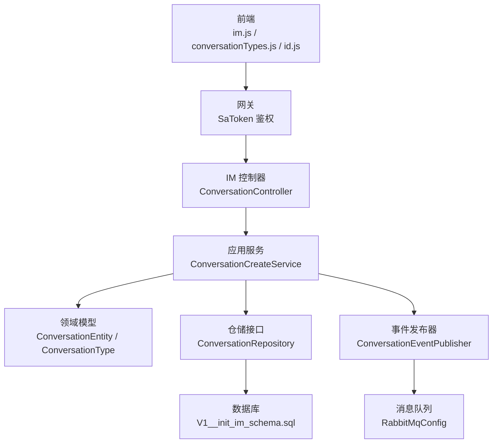
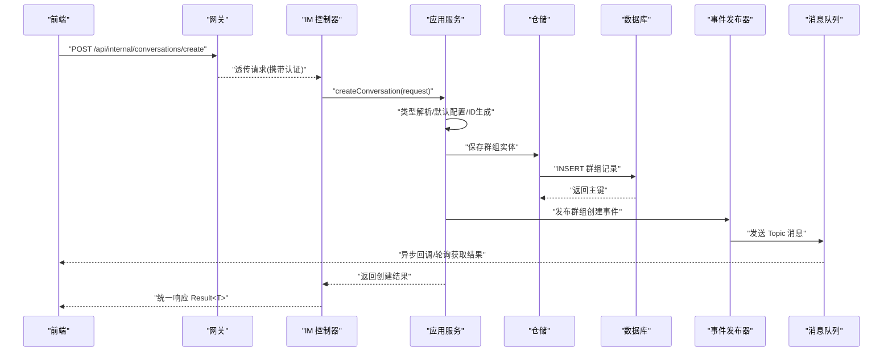
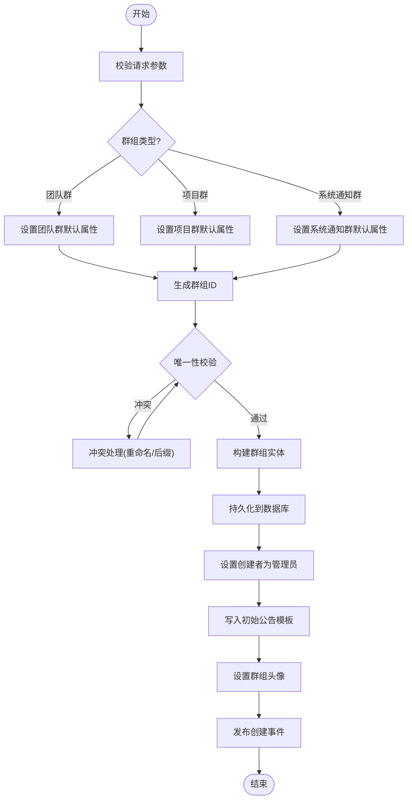
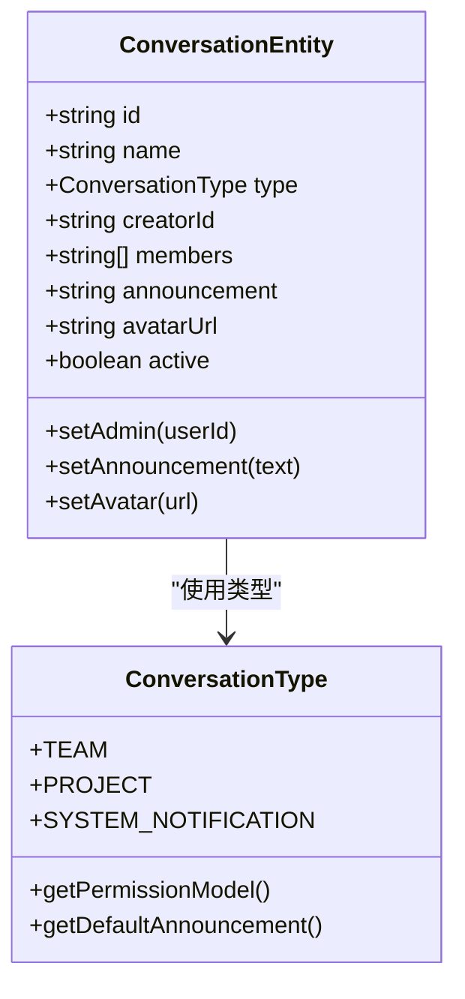
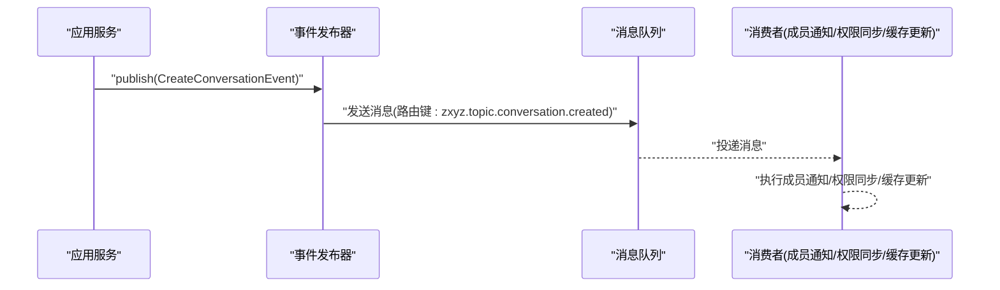
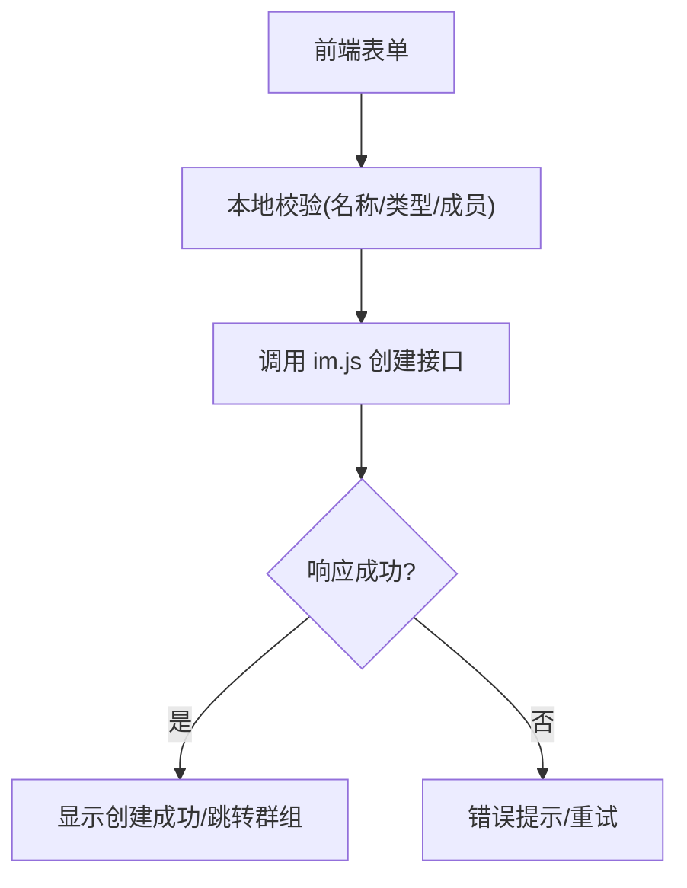
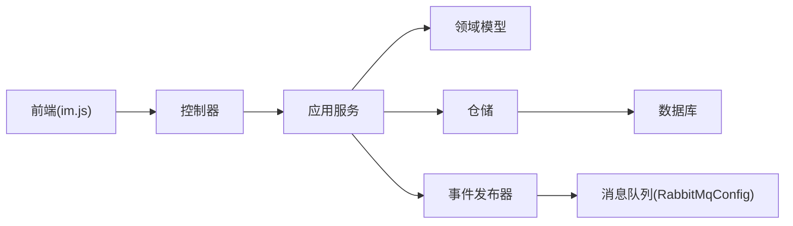

# 群组创建功能

<cite>
**本文引用的文件**   
- [zxyz-im-service/src/main/java/uno/acloud/im/application/ConversationCreateService.java](file://ZXYZdatabaseBack/zxyz-im-service/src/main/java/uno/acloud/im/application/ConversationCreateService.java)
- [zxyz-im-service/src/main/java/uno/acloud/im/controller/ConversationController.java](file://ZXYZdatabaseBack/zxyz-im-service/src/main/java/uno/acloud/im/controller/ConversationController.java)
- [zxyz-im-service/src/main/java/uno/acloud/im/dto/CreateConversationRequest.java](file://ZXYZdatabaseBack/zxyz-im-service/src/main/java/uno/acloud/im/dto/CreateConversationRequest.java)
- [zxyz-im-service/src/main/java/uno/acloud/im/domain/conversation/model/ConversationType.java](file://ZXYZdatabaseBack/zxyz-im-service/src/main/java/uno/acloud/im/domain/conversation/model/ConversationType.java)
- [zxyz-im-service/src/main/java/uno/acloud/im/domain/conversation/entity/ConversationEntity.java](file://ZXYZdatabaseBack/zxyz-im-service/src/main/java/uno/acloud/im/domain/conversation/entity/ConversationEntity.java)
- [zxyz-im-service/src/main/java/uno/acloud/im/infrastructure/repository/ConversationRepository.java](file://ZXYZdatabaseBack/zxyz-im-service/src/main/java/uno/acloud/im/infrastructure/repository/ConversationRepository.java)
- [zxyz-im-service/src/main/java/uno/acloud/im/application/event/ConversationEventPublisher.java](file://ZXYZdatabaseBack/zxyz-im-service/src/main/java/uno/acloud/im/application/event/ConversationEventPublisher.java)
- [zxyz-common/src/main/java/uno/acloud/common/event/DomainEventPublisher.java](file://ZXYZdatabaseBack/zxyz-common/src/main/java/uno/acloud/common/event/DomainEventPublisher.java)
- [zxyz-common/src/main/java/uno/acloud/common/mq/RabbitMqConfig.java](file://ZXYZdatabaseBack/zxyz-common/src/main/java/uno/acloud/common/mq/RabbitMqConfig.java)
- [ZXYZdatabaseFront/src/api/im.js](file://ZXYZdatabaseFront/src/api/im.js)
- [ZXYZdatabaseFront/src/constants/conversationTypes.js](file://ZXYZdatabaseFront/src/constants/conversationTypes.js)
- [ZXYZdatabaseFront/src/utils/id.js](file://ZXYZdatabaseFront/src/utils/id.js)
- [ZXYZdatabaseBack/zxyz-im-service/src/main/resources/db/migration/V1__init_im_schema.sql](file://ZXYZdatabaseBack/zxyz-im-service/src/main/resources/db/migration/V1__init_im_schema.sql)
</cite>

## 目录
1. [简介](#简介)
2. [项目结构](#项目结构)
3. [核心组件](#核心组件)
4. [架构总览](#架构总览)
5. [详细组件分析](#详细组件分析)
6. [依赖关系分析](#依赖关系分析)
7. [性能考虑](#性能考虑)
8. [故障排查指南](#故障排查指南)
9. [结论](#结论)
10. [附录：接口与示例](#附录接口与示例)

## 简介
本技术文档聚焦于 ZXYZ 即时通讯模块的“群组创建”能力，覆盖从前端表单校验、后端业务编排、数据库持久化到事件发布的全链路实现。文档重点说明三类群组（团队群、项目群、系统通知群）的类型区分与权限模型，阐述群组初始化流程（创建者自动管理员、默认权限、公告模板、头像策略），并给出群组 ID 生成策略、唯一性校验与冲突处理机制。同时提供事件发布机制（成员通知、权限同步、缓存更新）、完整调用示例与最佳实践建议。

## 项目结构
- 后端采用微服务架构，IM 服务使用 DDD 分层（interfaces → application → domain → infrastructure）。群组创建的核心逻辑位于 application 层，领域模型在 domain 层，数据访问在 infrastructure 层。
- 前端基于 Vue 3 + Composition API，通过统一的 im.js 发起请求，常量定义 conversationTypes.js 管理群组类型枚举，id.js 提供 ID 生成工具。

**图表来源** 
- [ConversationController.java](file://ZXYZdatabaseBack/zxyz-im-service/src/main/java/uno/acloud/im/controller/ConversationController.java)
- [ConversationCreateService.java](file://ZXYZdatabaseBack/zxyz-im-service/src/main/java/uno/acloud/im/application/ConversationCreateService.java)
- [ConversationEntity.java](file://ZXYZdatabaseBack/zxyz-im-service/src/main/java/uno/acloud/im/domain/conversation/entity/ConversationEntity.java)
- [ConversationType.java](file://ZXYZdatabaseBack/zxyz-im-service/src/main/java/uno/acloud/im/domain/conversation/model/ConversationType.java)
- [ConversationRepository.java](file://ZXYZdatabaseBack/zxyz-im-service/src/main/java/uno/acloud/im/infrastructure/repository/ConversationRepository.java)
- [ConversationEventPublisher.java](file://ZXYZdatabaseBack/zxyz-im-service/src/main/java/uno/acloud/im/application/event/ConversationEventPublisher.java)
- [RabbitMqConfig.java](file://ZXYZdatabaseBack/zxyz-common/src/main/java/uno/acloud/common/mq/RabbitMqConfig.java)
- [V1__init_im_schema.sql](file://ZXYZdatabaseBack/zxyz-im-service/src/main/resources/db/migration/V1__init_im_schema.sql)

**章节来源**
- [ConversationController.java](file://ZXYZdatabaseBack/zxyz-im-service/src/main/java/uno/acloud/im/controller/ConversationController.java)
- [ConversationCreateService.java](file://ZXYZdatabaseBack/zxyz-im-service/src/main/java/uno/acloud/im/application/ConversationCreateService.java)
- [ConversationEntity.java](file://ZXYZdatabaseBack/zxyz-im-service/src/main/java/uno/acloud/im/domain/conversation/entity/ConversationEntity.java)
- [ConversationType.java](file://ZXYZdatabaseBack/zxyz-im-service/src/main/java/uno/acloud/im/domain/conversation/model/ConversationType.java)
- [ConversationRepository.java](file://ZXYZdatabaseBack/zxyz-im-service/src/main/java/uno/acloud/im/infrastructure/repository/ConversationRepository.java)
- [ConversationEventPublisher.java](file://ZXYZdatabaseBack/zxyz-im-service/src/main/java/uno/acloud/im/application/event/ConversationEventPublisher.java)
- [RabbitMqConfig.java](file://ZXYZdatabaseBack/zxyz-common/src/main/java/uno/acloud/common/mq/RabbitMqConfig.java)
- [V1__init_im_schema.sql](file://ZXYZdatabaseBack/zxyz-im-service/src/main/resources/db/migration/V1__init_im_schema.sql)
- [im.js](file://ZXYZdatabaseFront/src/api/im.js)
- [conversationTypes.js](file://ZXYZdatabaseFront/src/constants/conversationTypes.js)
- [id.js](file://ZXYZdatabaseFront/src/utils/id.js)

## 核心组件
- 控制器层：接收前端请求，参数校验与上下文注入（当前用户、团队/项目上下文）。
- 应用服务层：编排创建流程，包括类型解析、ID 生成、唯一性校验、实体构建、持久化、初始配置与事件发布。
- 领域模型：群组实体与类型枚举，承载业务不变量与默认值。
- 仓储层：负责群组数据的持久化与查询。
- 事件发布器：将创建完成事件投递至消息队列，触发成员通知、权限同步与缓存更新。

**章节来源**
- [ConversationController.java](file://ZXYZdatabaseBack/zxyz-im-service/src/main/java/uno/acloud/im/controller/ConversationController.java)
- [ConversationCreateService.java](file://ZXYZdatabaseBack/zxyz-im-service/src/main/java/uno/acloud/im/application/ConversationCreateService.java)
- [ConversationEntity.java](file://ZXYZdatabaseBack/zxyz-im-service/src/main/java/uno/acloud/im/domain/conversation/entity/ConversationEntity.java)
- [ConversationType.java](file://ZXYZdatabaseBack/zxyz-im-service/src/main/java/uno/acloud/im/domain/conversation/model/ConversationType.java)
- [ConversationRepository.java](file://ZXYZdatabaseBack/zxyz-im-service/src/main/java/uno/acloud/im/infrastructure/repository/ConversationRepository.java)
- [ConversationEventPublisher.java](file://ZXYZdatabaseBack/zxyz-im-service/src/main/java/uno/acloud/im/application/event/ConversationEventPublisher.java)

## 架构总览
群组创建的端到端流程如下：
- 前端提交创建请求（包含名称、类型、成员列表、头像等）。
- 网关进行鉴权后转发至 IM 服务控制器。
- 控制器校验入参并委托应用服务。
- 应用服务根据类型设置默认属性，生成唯一 ID，执行唯一性校验，持久化群组实体，写入初始公告与头像，设置创建者为管理员。
- 应用服务发布创建事件，由消息队列异步驱动成员通知、权限同步与缓存刷新。

**图表来源** 
- [ConversationController.java](file://ZXYZdatabaseBack/zxyz-im-service/src/main/java/uno/acloud/im/controller/ConversationController.java)
- [ConversationCreateService.java](file://ZXYZdatabaseBack/zxyz-im-service/src/main/java/uno/acloud/im/application/ConversationCreateService.java)
- [ConversationRepository.java](file://ZXYZdatabaseBack/zxyz-im-service/src/main/java/uno/acloud/im/infrastructure/repository/ConversationRepository.java)
- [ConversationEventPublisher.java](file://ZXYZdatabaseBack/zxyz-im-service/src/main/java/uno/acloud/im/application/event/ConversationEventPublisher.java)
- [RabbitMqConfig.java](file://ZXYZdatabaseBack/zxyz-common/src/main/java/uno/acloud/common/mq/RabbitMqConfig.java)

## 详细组件分析

### 控制器层：请求接入与校验
- 职责：接收前端创建请求，进行基础参数校验，提取当前用户与上下文信息，调用应用服务。
- 关键点：内部端点受 SaToken 保护；统一返回 Result<T> 结构；错误码与异常映射。

**章节来源**
- [ConversationController.java](file://ZXYZdatabaseBack/zxyz-im-service/src/main/java/uno/acloud/im/controller/ConversationController.java)
- [CreateConversationRequest.java](file://ZXYZdatabaseBack/zxyz-im-service/src/main/java/uno/acloud/im/dto/CreateConversationRequest.java)

### 应用服务层：业务编排与初始化
- 职责：编排群组创建全流程，包括类型判断、默认配置、ID 生成、唯一性校验、实体构建、持久化、初始公告与头像设置、创建者管理员角色赋予、事件发布。
- 关键点：
  - 类型区分：团队群、项目群、系统通知群，各自具有不同默认属性与权限模型。
  - 唯一性校验：基于群组名称或业务键进行重复检查，必要时结合时间戳或随机后缀解决冲突。
  - 初始化：创建者自动成为管理员；默认权限按类型设定；初始公告模板填充；头像策略（默认或上传）。
  - 事件发布：通过 DomainEventPublisher 抽象，实际由 RabbitMqConfig 驱动的消息通道投递。

**图表来源** 
- [ConversationCreateService.java](file://ZXYZdatabaseBack/zxyz-im-service/src/main/java/uno/acloud/im/application/ConversationCreateService.java)
- [ConversationType.java](file://ZXYZdatabaseBack/zxyz-im-service/src/main/java/uno/acloud/im/domain/conversation/model/ConversationType.java)
- [ConversationEntity.java](file://ZXYZdatabaseBack/zxyz-im-service/src/main/java/uno/acloud/im/domain/conversation/entity/ConversationEntity.java)
- [ConversationRepository.java](file://ZXYZdatabaseBack/zxyz-im-service/src/main/java/uno/acloud/im/infrastructure/repository/ConversationRepository.java)
- [ConversationEventPublisher.java](file://ZXYZdatabaseBack/zxyz-im-service/src/main/java/uno/acloud/im/application/event/ConversationEventPublisher.java)

**章节来源**
- [ConversationCreateService.java](file://ZXYZdatabaseBack/zxyz-im-service/src/main/java/uno/acloud/im/application/ConversationCreateService.java)
- [ConversationType.java](file://ZXYZdatabaseBack/zxyz-im-service/src/main/java/uno/acloud/im/domain/conversation/model/ConversationType.java)
- [ConversationEntity.java](file://ZXYZdatabaseBack/zxyz-im-service/src/main/java/uno/acloud/im/domain/conversation/entity/ConversationEntity.java)
- [ConversationRepository.java](file://ZXYZdatabaseBack/zxyz-im-service/src/main/java/uno/acloud/im/infrastructure/repository/ConversationRepository.java)
- [ConversationEventPublisher.java](file://ZXYZdatabaseBack/zxyz-im-service/src/main/java/uno/acloud/im/application/event/ConversationEventPublisher.java)

### 领域模型：类型与实体
- 群组类型枚举：团队群、项目群、系统通知群，每种类型对应不同的权限模型与默认行为。
- 群组实体：包含 ID、名称、类型、创建者、成员集合、公告、头像、状态等字段。

**图表来源** 
- [ConversationType.java](file://ZXYZdatabaseBack/zxyz-im-service/src/main/java/uno/acloud/im/domain/conversation/model/ConversationType.java)
- [ConversationEntity.java](file://ZXYZdatabaseBack/zxyz-im-service/src/main/java/uno/acloud/im/domain/conversation/entity/ConversationEntity.java)

**章节来源**
- [ConversationType.java](file://ZXYZdatabaseBack/zxyz-im-service/src/main/java/uno/acloud/im/domain/conversation/model/ConversationType.java)
- [ConversationEntity.java](file://ZXYZdatabaseBack/zxyz-im-service/src/main/java/uno/acloud/im/domain/conversation/entity/ConversationEntity.java)

### 仓储层：数据持久化
- 职责：提供群组实体的保存与查询方法，确保事务边界与一致性。
- 关键点：插入成功后返回主键；支持唯一约束冲突的回滚与提示。

**章节来源**
- [ConversationRepository.java](file://ZXYZdatabaseBack/zxyz-im-service/src/main/java/uno/acloud/im/infrastructure/repository/ConversationRepository.java)
- [V1__init_im_schema.sql](file://ZXYZdatabaseBack/zxyz-im-service/src/main/resources/db/migration/V1__init_im_schema.sql)

### 事件发布：成员通知、权限同步与缓存更新
- 职责：在群组创建完成后，发布领域事件，交由消息队列异步处理。
- 关键点：使用 DomainEventPublisher 抽象，底层通过 RabbitMqConfig 配置 Topic Exchange 与路由键；消费者可订阅以触发成员通知、权限同步与缓存刷新。

**图表来源** 
- [ConversationEventPublisher.java](file://ZXYZdatabaseBack/zxyz-im-service/src/main/java/uno/acloud/im/application/event/ConversationEventPublisher.java)
- [DomainEventPublisher.java](file://ZXYZdatabaseBack/zxyz-common/src/main/java/uno/acloud/common/event/DomainEventPublisher.java)
- [RabbitMqConfig.java](file://ZXYZdatabaseBack/zxyz-common/src/main/java/uno/acloud/common/mq/RabbitMqConfig.java)

**章节来源**
- [ConversationEventPublisher.java](file://ZXYZdatabaseBack/zxyz-im-service/src/main/java/uno/acloud/im/application/event/ConversationEventPublisher.java)
- [DomainEventPublisher.java](file://ZXYZdatabaseBack/zxyz-common/src/main/java/uno/acloud/common/event/DomainEventPublisher.java)
- [RabbitMqConfig.java](file://ZXYZdatabaseBack/zxyz-common/src/main/java/uno/acloud/common/mq/RabbitMqConfig.java)

### 前端：表单验证与调用
- 常量定义：conversationTypes.js 维护群组类型枚举，供表单选择与校验。
- ID 生成：id.js 提供前端 ID 生成工具（用于临时占位或展示）。
- API 调用：im.js 封装创建接口，处理请求头、鉴权与响应解析。

**图表来源** 
- [conversationTypes.js](file://ZXYZdatabaseFront/src/constants/conversationTypes.js)
- [id.js](file://ZXYZdatabaseFront/src/utils/id.js)
- [im.js](file://ZXYZdatabaseFront/src/api/im.js)

**章节来源**
- [conversationTypes.js](file://ZXYZdatabaseFront/src/constants/conversationTypes.js)
- [id.js](file://ZXYZdatabaseFront/src/utils/id.js)
- [im.js](file://ZXYZdatabaseFront/src/api/im.js)

## 依赖关系分析
- 控制器依赖应用服务；应用服务依赖领域模型与仓储；仓储依赖数据库迁移脚本；事件发布器依赖通用事件抽象与 MQ 配置。
- 前端依赖常量与工具库，通过 API 模块与后端交互。

**图表来源** 
- [ConversationController.java](file://ZXYZdatabaseBack/zxyz-im-service/src/main/java/uno/acloud/im/controller/ConversationController.java)
- [ConversationCreateService.java](file://ZXYZdatabaseBack/zxyz-im-service/src/main/java/uno/acloud/im/application/ConversationCreateService.java)
- [ConversationEntity.java](file://ZXYZdatabaseBack/zxyz-im-service/src/main/java/uno/acloud/im/domain/conversation/entity/ConversationEntity.java)
- [ConversationRepository.java](file://ZXYZdatabaseBack/zxyz-im-service/src/main/java/uno/acloud/im/infrastructure/repository/ConversationRepository.java)
- [ConversationEventPublisher.java](file://ZXYZdatabaseBack/zxyz-im-service/src/main/java/uno/acloud/im/application/event/ConversationEventPublisher.java)
- [RabbitMqConfig.java](file://ZXYZdatabaseBack/zxyz-common/src/main/java/uno/acloud/common/mq/RabbitMqConfig.java)
- [im.js](file://ZXYZdatabaseFront/src/api/im.js)

**章节来源**
- [ConversationController.java](file://ZXYZdatabaseBack/zxyz-im-service/src/main/java/uno/acloud/im/controller/ConversationController.java)
- [ConversationCreateService.java](file://ZXYZdatabaseBack/zxyz-im-service/src/main/java/uno/acloud/im/application/ConversationCreateService.java)
- [ConversationEntity.java](file://ZXYZdatabaseBack/zxyz-im-service/src/main/java/uno/acloud/im/domain/conversation/entity/ConversationEntity.java)
- [ConversationRepository.java](file://ZXYZdatabaseBack/zxyz-im-service/src/main/java/uno/acloud/im/infrastructure/repository/ConversationRepository.java)
- [ConversationEventPublisher.java](file://ZXYZdatabaseBack/zxyz-im-service/src/main/java/uno/acloud/im/application/event/ConversationEventPublisher.java)
- [RabbitMqConfig.java](file://ZXYZdatabaseBack/zxyz-common/src/main/java/uno/acloud/common/mq/RabbitMqConfig.java)
- [im.js](file://ZXYZdatabaseFront/src/api/im.js)

## 性能考虑
- 批量操作：成员加入与权限初始化尽量批量化，减少数据库往返。
- 异步化：成员通知与缓存更新通过消息队列异步处理，降低主流程延迟。
- 索引优化：对群组名称、类型、创建者等高频查询字段建立索引。
- 幂等性：为创建接口设计幂等键（如请求 ID），避免重复提交导致重复群组。
- 限流与熔断：在高并发场景下对创建接口进行限流，防止雪崩。

[本节为通用指导，不直接分析具体文件]

## 故障排查指南
- 参数校验失败：检查前端表单校验规则与后端 DTO 校验注解是否一致。
- 唯一性冲突：查看群组名称或业务键的唯一约束，确认冲突处理逻辑是否生效。
- 事件未消费：检查消息队列配置、路由键与消费者订阅是否正确。
- 权限不同步：确认权限同步消费者是否正常运行，检查权限表写入日志。
- 缓存不一致：清理相关缓存键，观察缓存刷新消费者是否触发。

**章节来源**
- [ConversationCreateService.java](file://ZXYZdatabaseBack/zxyz-im-service/src/main/java/uno/acloud/im/application/ConversationCreateService.java)
- [ConversationEventPublisher.java](file://ZXYZdatabaseBack/zxyz-im-service/src/main/java/uno/acloud/im/application/event/ConversationEventPublisher.java)
- [RabbitMqConfig.java](file://ZXYZdatabaseBack/zxyz-common/src/main/java/uno/acloud/common/mq/RabbitMqConfig.java)

## 结论
群组创建功能通过清晰的分层与事件驱动架构，实现了高内聚、低耦合的业务流程。类型化的群组模型与完善的初始化策略确保了权限与配置的准确性。借助消息队列的异步处理能力，系统在扩展性与性能方面具备良好表现。遵循本文的最佳实践与排查指南，可有效提升系统的稳定性与可维护性。

[本节为总结，不直接分析具体文件]

## 附录：接口与示例
- 前端调用示例路径：[im.js](file://ZXYZdatabaseFront/src/api/im.js)
- 群组类型常量路径：[conversationTypes.js](file://ZXYZdatabaseFront/src/constants/conversationTypes.js)
- 前端 ID 生成工具路径：[id.js](file://ZXYZdatabaseFront/src/utils/id.js)
- 后端控制器入口路径：[ConversationController.java](file://ZXYZdatabaseBack/zxyz-im-service/src/main/java/uno/acloud/im/controller/ConversationController.java)
- 应用服务编排路径：[ConversationCreateService.java](file://ZXYZdatabaseBack/zxyz-im-service/src/main/java/uno/acloud/im/application/ConversationCreateService.java)
- 领域模型路径：[ConversationEntity.java](file://ZXYZdatabaseBack/zxyz-im-service/src/main/java/uno/acloud/im/domain/conversation/entity/ConversationEntity.java)、[ConversationType.java](file://ZXYZdatabaseBack/zxyz-im-service/src/main/java/uno/acloud/im/domain/conversation/model/ConversationType.java)
- 仓储接口路径：[ConversationRepository.java](file://ZXYZdatabaseBack/zxyz-im-service/src/main/java/uno/acloud/im/infrastructure/repository/ConversationRepository.java)
- 事件发布路径：[ConversationEventPublisher.java](file://ZXYZdatabaseBack/zxyz-im-service/src/main/java/uno/acloud/im/application/event/ConversationEventPublisher.java)
- 消息队列配置路径：[RabbitMqConfig.java](file://ZXYZdatabaseBack/zxyz-common/src/main/java/uno/acloud/common/mq/RabbitMqConfig.java)
- 数据库迁移脚本路径：[V1__init_im_schema.sql](file://ZXYZdatabaseBack/zxyz-im-service/src/main/resources/db/migration/V1__init_im_schema.sql)

[本节为参考路径汇总，不直接分析具体文件]