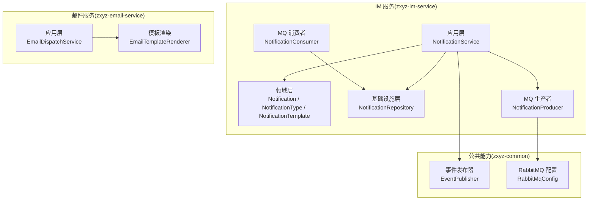
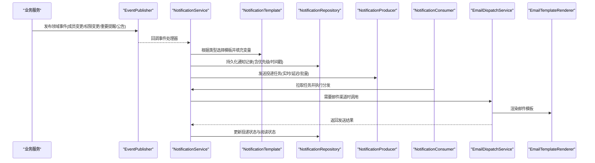
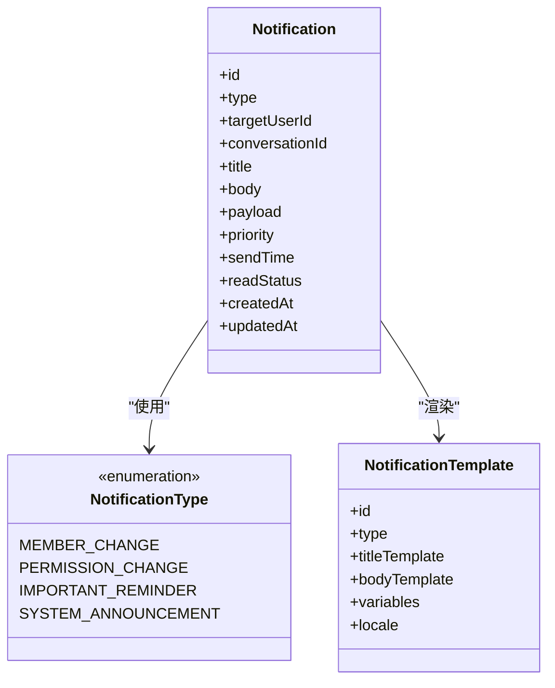
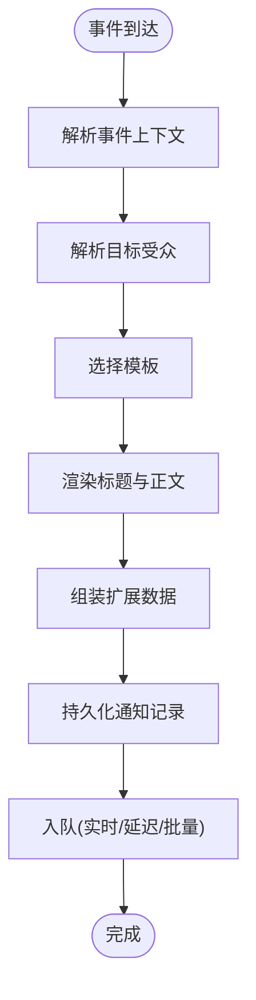
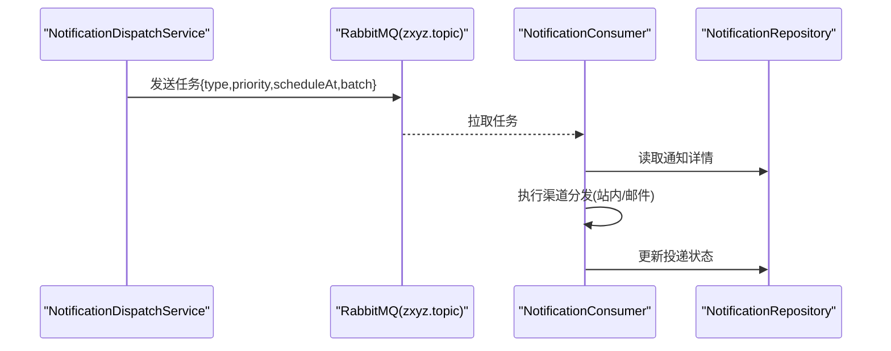
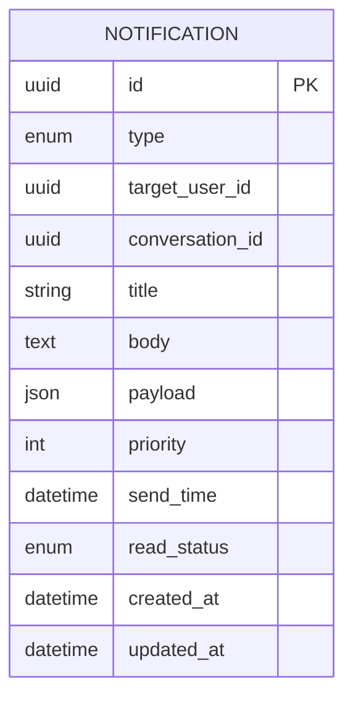
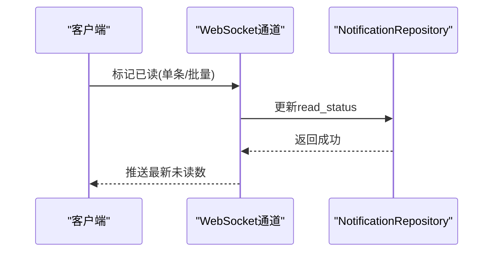
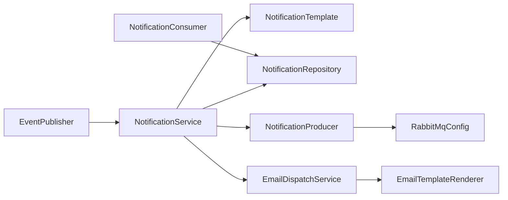

# 通知系统功能

<cite>
**本文引用的文件**   
- [zxyz-im-service/src/main/java/uno/acloud/im/application/NotificationService.java](file://ZXYZdatabaseBack/zxyz-im-service/src/main/java/uno/acloud/im/application/NotificationService.java)
- [zxyz-im-service/src/main/java/uno/acloud/im/domain/notification/Notification.java](file://ZXYZdatabaseBack/zxyz-im-service/src/main/java/uno/acloud/im/domain/notification/Notification.java)
- [zxyz-im-service/src/main/java/uno/acloud/im/domain/notification/NotificationType.java](file://ZXYZdatabaseBack/zxyz-im-service/src/main/java/uno/acloud/im/domain/notification/NotificationType.java)
- [zxyz-im-service/src/main/java/uno/acloud/im/domain/notification/NotificationTemplate.java](file://ZXYZdatabaseBack/zxyz-im-service/src/main/java/uno/acloud/im/domain/notification/NotificationTemplate.java)
- [zxyz-im-service/src/main/java/uno/acloud/im/application/NotificationDispatchService.java](file://ZXYZdatabaseBack/zxyz-im-service/src/main/java/uno/acloud/im/application/NotificationDispatchService.java)
- [zxyz-im-service/src/main/java/uno/acloud/im/mq/NotificationProducer.java](file://ZXYZdatabaseBack/zxyz-im-service/src/main/java/uno/acloud/im/mq/NotificationProducer.java)
- [zxyz-im-service/src/main/java/uno/acloud/im/mq/NotificationConsumer.java](file://ZXYZdatabaseBack/zxyz-im-service/src/main/java/uno/acloud/im/mq/NotificationConsumer.java)
- [zxyz-im-service/src/main/java/uno/acloud/im/infrastructure/repository/NotificationRepository.java](file://ZXYZdatabaseBack/zxyz-im-service/src/main/java/uno/acloud/im/infrastructure/repository/NotificationRepository.java)
- [zxyz-im-service/src/main/resources/db/migration/V1__init_im_schema.sql](file://ZXYZdatabaseBack/zxyz-im-service/src/main/resources/db/migration/V1__init_im_schema.sql)
- [zxyz-email-service/src/main/java/uno/acloud/email/application/EmailDispatchService.java](file://ZXYZdatabaseBack/zxyz-email-service/src/main/java/uno/acloud/email/application/EmailDispatchService.java)
- [zxyz-email-service/src/main/java/uno/acloud/email/application/EmailTemplateRenderer.java](file://ZXYZdatabaseBack/zxyz-email-service/src/main/java/uno/acloud/email/application/EmailTemplateRenderer.java)
- [zxyz-common/src/main/java/uno/acloud/common/event/EventPublisher.java](file://ZXYZdatabaseBack/zxyz-common/src/main/java/uno/acloud/common/event/EventPublisher.java)
- [zxyz-common/src/main/java/uno/acloud/common/mq/RabbitMqConfig.java](file://ZXYZdatabaseBack/zxyz-common/src/main/java/uno/acloud/common/mq/RabbitMqConfig.java)
- [nacos-config/zxyz-im-service.yml](file://nacos-config/zxyz-im-service.yml)
- [nacos-config/zxyz-email-service.yml](file://nacos-config/zxyz-email-service.yml)
</cite>

## 目录
1. [引言](#引言)
2. [项目结构](#项目结构)
3. [核心组件](#核心组件)
4. [架构总览](#架构总览)
5. [详细组件分析](#详细组件分析)
6. [依赖分析](#依赖分析)
7. [性能考虑](#性能考虑)
8. [故障排查指南](#故障排查指南)
9. [结论](#结论)
10. [附录](#附录)

## 引言
本技术文档围绕 ZXYZ 即时通讯模块的通知系统，系统化阐述以下方面：
- 通知类型分类：成员变更通知、权限变更通知、重要提醒与系统公告
- 通知生成机制：事件触发、内容组装、模板渲染与个性化定制
- 分发策略：实时推送、延迟发送、批量处理与优先级调度
- 存储与管理：持久化、索引优化、查询性能与历史追溯
- 阅读状态管理：已读未读标记、批量操作、状态同步与离线处理
- 过滤与定制：用户偏好、免打扰模式、关键词过滤与智能推荐
- 完整示例：不同类型通知的创建、发送与接收处理
- 性能优化：消息队列削峰、异步处理与缓存策略

## 项目结构
通知系统主要位于 IM 服务（DDD 分层）与邮件服务（DDD 分层），并通过通用事件与 MQ 配置进行跨服务协作。前端通过 WebSocket 与 REST 接口消费通知。

图表来源
- [zxyz-im-service/src/main/java/uno/acloud/im/application/NotificationService.java](file://ZXYZdatabaseBack/zxyz-im-service/src/main/java/uno/acloud/im/application/NotificationService.java)
- [zxyz-im-service/src/main/java/uno/acloud/im/domain/notification/Notification.java](file://ZXYZdatabaseBack/zxyz-im-service/src/main/java/uno/acloud/im/domain/notification/Notification.java)
- [zxyz-im-service/src/main/java/uno/acloud/im/domain/notification/NotificationType.java](file://ZXYZdatabaseBack/zxyz-im-service/src/main/java/uno/acloud/im/domain/notification/NotificationType.java)
- [zxyz-im-service/src/main/java/uno/acloud/im/domain/notification/NotificationTemplate.java](file://ZXYZdatabaseBack/zxyz-im-service/src/main/java/uno/acloud/im/domain/notification/NotificationTemplate.java)
- [zxyz-im-service/src/main/java/uno/acloud/im/infrastructure/repository/NotificationRepository.java](file://ZXYZdatabaseBack/zxyz-im-service/src/main/java/uno/acloud/im/infrastructure/repository/NotificationRepository.java)
- [zxyz-im-service/src/main/java/uno/acloud/im/mq/NotificationProducer.java](file://ZXYZdatabaseBack/zxyz-im-service/src/main/java/uno/acloud/im/mq/NotificationProducer.java)
- [zxyz-im-service/src/main/java/uno/acloud/im/mq/NotificationConsumer.java](file://ZXYZdatabaseBack/zxyz-im-service/src/main/java/uno/acloud/im/mq/NotificationConsumer.java)
- [zxyz-email-service/src/main/java/uno/acloud/email/application/EmailDispatchService.java](file://ZXYZdatabaseBack/zxyz-email-service/src/main/java/uno/acloud/email/application/EmailDispatchService.java)
- [zxyz-email-service/src/main/java/uno/acloud/email/application/EmailTemplateRenderer.java](file://ZXYZdatabaseBack/zxyz-email-service/src/main/java/uno/acloud/email/application/EmailTemplateRenderer.java)
- [zxyz-common/src/main/java/uno/acloud/common/event/EventPublisher.java](file://ZXYZdatabaseBack/zxyz-common/src/main/java/uno/acloud/common/event/EventPublisher.java)
- [zxyz-common/src/main/java/uno/acloud/common/mq/RabbitMqConfig.java](file://ZXYZdatabaseBack/zxyz-common/src/main/java/uno/acloud/common/mq/RabbitMqConfig.java)

章节来源
- [zxyz-im-service/src/main/java/uno/acloud/im/application/NotificationService.java](file://ZXYZdatabaseBack/zxyz-im-service/src/main/java/uno/acloud/im/application/NotificationService.java)
- [zxyz-im-service/src/main/java/uno/acloud/im/domain/notification/Notification.java](file://ZXYZdatabaseBack/zxyz-im-service/src/main/java/uno/acloud/im/domain/notification/Notification.java)
- [zxyz-im-service/src/main/java/uno/acloud/im/domain/notification/NotificationType.java](file://ZXYZdatabaseBack/zxyz-im-service/src/main/java/uno/acloud/im/domain/notification/NotificationType.java)
- [zxyz-im-service/src/main/java/uno/acloud/im/domain/notification/NotificationTemplate.java](file://ZXYZdatabaseBack/zxyz-im-service/src/main/java/uno/acloud/im/domain/notification/NotificationTemplate.java)
- [zxyz-im-service/src/main/java/uno/acloud/im/infrastructure/repository/NotificationRepository.java](file://ZXYZdatabaseBack/zxyz-im-service/src/main/java/uno/acloud/im/infrastructure/repository/NotificationRepository.java)
- [zxyz-im-service/src/main/java/uno/acloud/im/mq/NotificationProducer.java](file://ZXYZdatabaseBack/zxyz-im-service/src/main/java/uno/acloud/im/mq/NotificationProducer.java)
- [zxyz-im-service/src/main/java/uno/acloud/im/mq/NotificationConsumer.java](file://ZXYZdatabaseBack/zxyz-im-service/src/main/java/uno/acloud/im/mq/NotificationConsumer.java)
- [zxyz-email-service/src/main/java/uno/acloud/email/application/EmailDispatchService.java](file://ZXYZdatabaseBack/zxyz-email-service/src/main/java/uno/acloud/email/application/EmailDispatchService.java)
- [zxyz-email-service/src/main/java/uno/acloud/email/application/EmailTemplateRenderer.java](file://ZXYZdatabaseBack/zxyz-email-service/src/main/java/uno/acloud/email/application/EmailTemplateRenderer.java)
- [zxyz-common/src/main/java/uno/acloud/common/event/EventPublisher.java](file://ZXYZdatabaseBack/zxyz-common/src/main/java/uno/acloud/common/event/EventPublisher.java)
- [zxyz-common/src/main/java/uno/acloud/common/mq/RabbitMqConfig.java](file://ZXYZdatabaseBack/zxyz-common/src/main/java/uno/acloud/common/mq/RabbitMqConfig.java)

## 核心组件
- 通知领域模型
  - 通知实体：承载通知 ID、类型、目标用户/会话、标题、正文、扩展数据、优先级、发送时间、阅读状态等
  - 通知类型枚举：成员变更、权限变更、重要提醒、系统公告等
  - 通知模板：定义不同通知类型的标题/正文模板与占位符
- 应用服务
  - 通知服务：负责事件到通知的转换、模板渲染、个性化定制、持久化与入队
  - 分发服务：负责按策略（实时/延迟/批量/优先级）调度投递
- 基础设施
  - 通知仓库：持久化与查询（含分页、索引字段）
  - MQ 生产者/消费者：基于 RabbitMQ Topic Exchange zxyz.topic 的异步解耦
- 邮件服务协作
  - 邮件分发服务与模板渲染：将通知转为邮件并渲染模板

章节来源
- [zxyz-im-service/src/main/java/uno/acloud/im/domain/notification/Notification.java](file://ZXYZdatabaseBack/zxyz-im-service/src/main/java/uno/acloud/im/domain/notification/Notification.java)
- [zxyz-im-service/src/main/java/uno/acloud/im/domain/notification/NotificationType.java](file://ZXYZdatabaseBack/zxyz-im-service/src/main/java/uno/acloud/im/domain/notification/NotificationType.java)
- [zxyz-im-service/src/main/java/uno/acloud/im/domain/notification/NotificationTemplate.java](file://ZXYZdatabaseBack/zxyz-im-service/src/main/java/uno/acloud/im/domain/notification/NotificationTemplate.java)
- [zxyz-im-service/src/main/java/uno/acloud/im/application/NotificationService.java](file://ZXYZdatabaseBack/zxyz-im-service/src/main/java/uno/acloud/im/application/NotificationService.java)
- [zxyz-im-service/src/main/java/uno/acloud/im/application/NotificationDispatchService.java](file://ZXYZdatabaseBack/zxyz-im-service/src/main/java/uno/acloud/im/application/NotificationDispatchService.java)
- [zxyz-im-service/src/main/java/uno/acloud/im/infrastructure/repository/NotificationRepository.java](file://ZXYZdatabaseBack/zxyz-im-service/src/main/java/uno/acloud/im/infrastructure/repository/NotificationRepository.java)
- [zxyz-im-service/src/main/java/uno/acloud/im/mq/NotificationProducer.java](file://ZXYZdatabaseBack/zxyz-im-service/src/main/java/uno/acloud/im/mq/NotificationProducer.java)
- [zxyz-im-service/src/main/java/uno/acloud/im/mq/NotificationConsumer.java](file://ZXYZdatabaseBack/zxyz-im-service/src/main/java/uno/acloud/im/mq/NotificationConsumer.java)
- [zxyz-email-service/src/main/java/uno/acloud/email/application/EmailDispatchService.java](file://ZXYZdatabaseBack/zxyz-email-service/src/main/java/uno/acloud/email/application/EmailDispatchService.java)
- [zxyz-email-service/src/main/java/uno/acloud/email/application/EmailTemplateRenderer.java](file://ZXYZdatabaseBack/zxyz-email-service/src/main/java/uno/acloud/email/application/EmailTemplateRenderer.java)

## 架构总览
通知系统采用“事件驱动 + 消息队列”的架构，结合 DDD 分层与模板渲染，实现高内聚、低耦合的可扩展通知能力。

图表来源
- [zxyz-common/src/main/java/uno/acloud/common/event/EventPublisher.java](file://ZXYZdatabaseBack/zxyz-common/src/main/java/uno/acloud/common/event/EventPublisher.java)
- [zxyz-im-service/src/main/java/uno/acloud/im/application/NotificationService.java](file://ZXYZdatabaseBack/zxyz-im-service/src/main/java/uno/acloud/im/application/NotificationService.java)
- [zxyz-im-service/src/main/java/uno/acloud/im/domain/notification/NotificationTemplate.java](file://ZXYZdatabaseBack/zxyz-im-service/src/main/java/uno/acloud/im/domain/notification/NotificationTemplate.java)
- [zxyz-im-service/src/main/java/uno/acloud/im/infrastructure/repository/NotificationRepository.java](file://ZXYZdatabaseBack/zxyz-im-service/src/main/java/uno/acloud/im/infrastructure/repository/NotificationRepository.java)
- [zxyz-im-service/src/main/java/uno/acloud/im/mq/NotificationProducer.java](file://ZXYZdatabaseBack/zxyz-im-service/src/main/java/uno/acloud/im/mq/NotificationProducer.java)
- [zxyz-im-service/src/main/java/uno/acloud/im/mq/NotificationConsumer.java](file://ZXYZdatabaseBack/zxyz-im-service/src/main/java/uno/acloud/im/mq/NotificationConsumer.java)
- [zxyz-email-service/src/main/java/uno/acloud/email/application/EmailDispatchService.java](file://ZXYZdatabaseBack/zxyz-email-service/src/main/java/uno/acloud/email/application/EmailDispatchService.java)
- [zxyz-email-service/src/main/java/uno/acloud/email/application/EmailTemplateRenderer.java](file://ZXYZdatabaseBack/zxyz-email-service/src/main/java/uno/acloud/email/application/EmailTemplateRenderer.java)

## 详细组件分析

### 通知类型与领域模型
- 通知类型
  - 成员变更通知：用于团队/会话成员加入、退出、角色调整等
  - 权限变更通知：资源或会话权限变化（如协作者授权/撤销）
  - 重要提醒：高优先级提醒（如审批待办、截止日期）
  - 系统公告：全局或定向公告（维护、升级、政策变更）
- 领域模型关系

图表来源
- [zxyz-im-service/src/main/java/uno/acloud/im/domain/notification/Notification.java](file://ZXYZdatabaseBack/zxyz-im-service/src/main/java/uno/acloud/im/domain/notification/Notification.java)
- [zxyz-im-service/src/main/java/uno/acloud/im/domain/notification/NotificationType.java](file://ZXYZdatabaseBack/zxyz-im-service/src/main/java/uno/acloud/im/domain/notification/NotificationType.java)
- [zxyz-im-service/src/main/java/uno/acloud/im/domain/notification/NotificationTemplate.java](file://ZXYZdatabaseBack/zxyz-im-service/src/main/java/uno/acloud/im/domain/notification/NotificationTemplate.java)

章节来源
- [zxyz-im-service/src/main/java/uno/acloud/im/domain/notification/Notification.java](file://ZXYZdatabaseBack/zxyz-im-service/src/main/java/uno/acloud/im/domain/notification/Notification.java)
- [zxyz-im-service/src/main/java/uno/acloud/im/domain/notification/NotificationType.java](file://ZXYZdatabaseBack/zxyz-im-service/src/main/java/uno/acloud/im/domain/notification/NotificationType.java)
- [zxyz-im-service/src/main/java/uno/acloud/im/domain/notification/NotificationTemplate.java](file://ZXYZdatabaseBack/zxyz-im-service/src/main/java/uno/acloud/im/domain/notification/NotificationTemplate.java)

### 通知生成机制
- 事件触发：业务服务通过 EventPublisher 发布领域事件（成员变更、权限变更、重要提醒、公告）
- 内容组装：NotificationService 根据事件上下文构建通知对象，解析目标受众（个人/群组/全员）
- 模板渲染：依据 NotificationType 选择对应模板，注入变量（用户名、会话名、时间、链接等）
- 个性化定制：支持多语言、主题样式、渠道偏好（站内/邮件/短信）

图表来源
- [zxyz-common/src/main/java/uno/acloud/common/event/EventPublisher.java](file://ZXYZdatabaseBack/zxyz-common/src/main/java/uno/acloud/common/event/EventPublisher.java)
- [zxyz-im-service/src/main/java/uno/acloud/im/application/NotificationService.java](file://ZXYZdatabaseBack/zxyz-im-service/src/main/java/uno/acloud/im/application/NotificationService.java)
- [zxyz-im-service/src/main/java/uno/acloud/im/domain/notification/NotificationTemplate.java](file://ZXYZdatabaseBack/zxyz-im-service/src/main/java/uno/acloud/im/domain/notification/NotificationTemplate.java)

章节来源
- [zxyz-common/src/main/java/uno/acloud/common/event/EventPublisher.java](file://ZXYZdatabaseBack/zxyz-common/src/main/java/uno/acloud/common/event/EventPublisher.java)
- [zxyz-im-service/src/main/java/uno/acloud/im/application/NotificationService.java](file://ZXYZdatabaseBack/zxyz-im-service/src/main/java/uno/acloud/im/application/NotificationService.java)
- [zxyz-im-service/src/main/java/uno/acloud/im/domain/notification/NotificationTemplate.java](file://ZXYZdatabaseBack/zxyz-im-service/src/main/java/uno/acloud/im/domain/notification/NotificationTemplate.java)

### 分发策略
- 实时推送：高优先级通知立即入队，消费者快速消费并推送到在线客户端
- 延迟发送：定时任务或延迟队列在指定时间投递（如会议提醒）
- 批量处理：聚合相同类型/目标的通知，减少重复渲染与传输
- 优先级调度：按 priority 字段排序，确保重要提醒优先送达

图表来源
- [zxyz-im-service/src/main/java/uno/acloud/im/application/NotificationDispatchService.java](file://ZXYZdatabaseBack/zxyz-im-service/src/main/java/uno/acloud/im/application/NotificationDispatchService.java)
- [zxyz-common/src/main/java/uno/acloud/common/mq/RabbitMqConfig.java](file://ZXYZdatabaseBack/zxyz-common/src/main/java/uno/acloud/common/mq/RabbitMqConfig.java)
- [zxyz-im-service/src/main/java/uno/acloud/im/mq/NotificationProducer.java](file://ZXYZdatabaseBack/zxyz-im-service/src/main/java/uno/acloud/im/mq/NotificationProducer.java)
- [zxyz-im-service/src/main/java/uno/acloud/im/mq/NotificationConsumer.java](file://ZXYZdatabaseBack/zxyz-im-service/src/main/java/uno/acloud/im/mq/NotificationConsumer.java)
- [zxyz-im-service/src/main/java/uno/acloud/im/infrastructure/repository/NotificationRepository.java](file://ZXYZdatabaseBack/zxyz-im-service/src/main/java/uno/acloud/im/infrastructure/repository/NotificationRepository.java)

章节来源
- [zxyz-im-service/src/main/java/uno/acloud/im/application/NotificationDispatchService.java](file://ZXYZdatabaseBack/zxyz-im-service/src/main/java/uno/acloud/im/application/NotificationDispatchService.java)
- [zxyz-common/src/main/java/uno/acloud/common/mq/RabbitMqConfig.java](file://ZXYZdatabaseBack/zxyz-common/src/main/java/uno/acloud/common/mq/RabbitMqConfig.java)
- [zxyz-im-service/src/main/java/uno/acloud/im/mq/NotificationProducer.java](file://ZXYZdatabaseBack/zxyz-im-service/src/main/java/uno/acloud/im/mq/NotificationProducer.java)
- [zxyz-im-service/src/main/java/uno/acloud/im/mq/NotificationConsumer.java](file://ZXYZdatabaseBack/zxyz-im-service/src/main/java/uno/acloud/im/mq/NotificationConsumer.java)
- [zxyz-im-service/src/main/java/uno/acloud/im/infrastructure/repository/NotificationRepository.java](file://ZXYZdatabaseBack/zxyz-im-service/src/main/java/uno/acloud/im/infrastructure/repository/NotificationRepository.java)

### 存储与管理
- 持久化存储：通知记录包含类型、目标、内容、优先级、时间戳、投递与阅读状态
- 索引优化：针对 userId、conversationId、type、sendTime、readStatus 建立索引以提升查询效率
- 查询性能：分页查询、条件筛选（按类型/时间范围/是否已读）、聚合统计（未读数）
- 历史追溯：保留投递日志与状态变更轨迹，便于审计与问题定位

图表来源
- [zxyz-im-service/src/main/resources/db/migration/V1__init_im_schema.sql](file://ZXYZdatabaseBack/zxyz-im-service/src/main/resources/db/migration/V1__init_im_schema.sql)

章节来源
- [zxyz-im-service/src/main/resources/db/migration/V1__init_im_schema.sql](file://ZXYZdatabaseBack/zxyz-im-service/src/main/resources/db/migration/V1__init_im_schema.sql)
- [zxyz-im-service/src/main/java/uno/acloud/im/infrastructure/repository/NotificationRepository.java](file://ZXYZdatabaseBack/zxyz-im-service/src/main/java/uno/acloud/im/infrastructure/repository/NotificationRepository.java)

### 阅读状态管理
- 已读未读标记：单条标记与批量标记（按会话/类型/时间范围）
- 状态同步：WebSocket 推送状态变更，REST 接口提供查询与更新
- 离线处理：离线期间累积未读，上线后合并增量同步
- 去重与幂等：基于消息 ID 避免重复标记

图表来源
- [zxyz-im-service/src/main/java/uno/acloud/im/infrastructure/repository/NotificationRepository.java](file://ZXYZdatabaseBack/zxyz-im-service/src/main/java/uno/acloud/im/infrastructure/repository/NotificationRepository.java)

章节来源
- [zxyz-im-service/src/main/java/uno/acloud/im/infrastructure/repository/NotificationRepository.java](file://ZXYZdatabaseBack/zxyz-im-service/src/main/java/uno/acloud/im/infrastructure/repository/NotificationRepository.java)

### 过滤与定制
- 用户偏好设置：渠道开关（站内/邮件）、通知频率、免打扰时段
- 关键词过滤：对标题/正文进行关键词匹配，屏蔽无关通知
- 智能推荐：基于用户行为与历史阅读率，动态调整推送策略
- 模板个性化：按用户语言、主题、设备类型渲染差异化内容

章节来源
- [zxyz-im-service/src/main/java/uno/acloud/im/application/NotificationService.java](file://ZXYZdatabaseBack/zxyz-im-service/src/main/java/uno/acloud/im/application/NotificationService.java)
- [zxyz-im-service/src/main/java/uno/acloud/im/domain/notification/NotificationTemplate.java](file://ZXYZdatabaseBack/zxyz-im-service/src/main/java/uno/acloud/im/domain/notification/NotificationTemplate.java)

### 完整示例
- 成员变更通知
  - 触发：团队成员加入/退出
  - 生成：选择“成员变更”模板，填充成员名、角色、时间
  - 分发：实时推送给相关成员；必要时发送邮件
- 权限变更通知
  - 触发：资源权限授予/撤销
  - 生成：选择“权限变更”模板，填充资源名、新权限、操作人
  - 分发：高优先级，立即推送；可批量聚合
- 重要提醒
  - 触发：审批待办、截止日期临近
  - 生成：选择“重要提醒”模板，填充截止时间、链接
  - 分发：延迟发送（提前 N 分钟），优先级最高
- 系统公告
  - 触发：系统维护、版本升级
  - 生成：选择“系统公告”模板，填充公告内容、影响范围
  - 分发：定向或全员，可定时发布

章节来源
- [zxyz-im-service/src/main/java/uno/acloud/im/application/NotificationService.java](file://ZXYZdatabaseBack/zxyz-im-service/src/main/java/uno/acloud/im/application/NotificationService.java)
- [zxyz-im-service/src/main/java/uno/acloud/im/domain/notification/NotificationType.java](file://ZXYZdatabaseBack/zxyz-im-service/src/main/java/uno/acloud/im/domain/notification/NotificationType.java)
- [zxyz-im-service/src/main/java/uno/acloud/im/domain/notification/NotificationTemplate.java](file://ZXYZdatabaseBack/zxyz-im-service/src/main/java/uno/acloud/im/domain/notification/NotificationTemplate.java)
- [zxyz-email-service/src/main/java/uno/acloud/email/application/EmailDispatchService.java](file://ZXYZdatabaseBack/zxyz-email-service/src/main/java/uno/acloud/email/application/EmailDispatchService.java)
- [zxyz-email-service/src/main/java/uno/acloud/email/application/EmailTemplateRenderer.java](file://ZXYZdatabaseBack/zxyz-email-service/src/main/java/uno/acloud/email/application/EmailTemplateRenderer.java)

## 依赖分析
通知系统与事件、MQ、邮件服务存在紧密依赖，需关注耦合度与循环依赖风险。

图表来源
- [zxyz-common/src/main/java/uno/acloud/common/event/EventPublisher.java](file://ZXYZdatabaseBack/zxyz-common/src/main/java/uno/acloud/common/event/EventPublisher.java)
- [zxyz-im-service/src/main/java/uno/acloud/im/application/NotificationService.java](file://ZXYZdatabaseBack/zxyz-im-service/src/main/java/uno/acloud/im/application/NotificationService.java)
- [zxyz-im-service/src/main/java/uno/acloud/im/domain/notification/NotificationTemplate.java](file://ZXYZdatabaseBack/zxyz-im-service/src/main/java/uno/acloud/im/domain/notification/NotificationTemplate.java)
- [zxyz-im-service/src/main/java/uno/acloud/im/infrastructure/repository/NotificationRepository.java](file://ZXYZdatabaseBack/zxyz-im-service/src/main/java/uno/acloud/im/infrastructure/repository/NotificationRepository.java)
- [zxyz-im-service/src/main/java/uno/acloud/im/mq/NotificationProducer.java](file://ZXYZdatabaseBack/zxyz-im-service/src/main/java/uno/acloud/im/mq/NotificationProducer.java)
- [zxyz-common/src/main/java/uno/acloud/common/mq/RabbitMqConfig.java](file://ZXYZdatabaseBack/zxyz-common/src/main/java/uno/acloud/common/mq/RabbitMqConfig.java)
- [zxyz-im-service/src/main/java/uno/acloud/im/mq/NotificationConsumer.java](file://ZXYZdatabaseBack/zxyz-im-service/src/main/java/uno/acloud/im/mq/NotificationConsumer.java)
- [zxyz-email-service/src/main/java/uno/acloud/email/application/EmailDispatchService.java](file://ZXYZdatabaseBack/zxyz-email-service/src/main/java/uno/acloud/email/application/EmailDispatchService.java)
- [zxyz-email-service/src/main/java/uno/acloud/email/application/EmailTemplateRenderer.java](file://ZXYZdatabaseBack/zxyz-email-service/src/main/java/uno/acloud/email/application/EmailTemplateRenderer.java)

章节来源
- [zxyz-common/src/main/java/uno/acloud/common/event/EventPublisher.java](file://ZXYZdatabaseBack/zxyz-common/src/main/java/uno/acloud/common/event/EventPublisher.java)
- [zxyz-im-service/src/main/java/uno/acloud/im/application/NotificationService.java](file://ZXYZdatabaseBack/zxyz-im-service/src/main/java/uno/acloud/im/application/NotificationService.java)
- [zxyz-im-service/src/main/java/uno/acloud/im/mq/NotificationProducer.java](file://ZXYZdatabaseBack/zxyz-im-service/src/main/java/uno/acloud/im/mq/NotificationProducer.java)
- [zxyz-common/src/main/java/uno/acloud/common/mq/RabbitMqConfig.java](file://ZXYZdatabaseBack/zxyz-common/src/main/java/uno/acloud/common/mq/RabbitMqConfig.java)
- [zxyz-im-service/src/main/java/uno/acloud/im/mq/NotificationConsumer.java](file://ZXYZdatabaseBack/zxyz-im-service/src/main/java/uno/acloud/im/mq/NotificationConsumer.java)
- [zxyz-email-service/src/main/java/uno/acloud/email/application/EmailDispatchService.java](file://ZXYZdatabaseBack/zxyz-email-service/src/main/java/uno/acloud/email/application/EmailDispatchService.java)
- [zxyz-email-service/src/main/java/uno/acloud/email/application/EmailTemplateRenderer.java](file://ZXYZdatabaseBack/zxyz-email-service/src/main/java/uno/acloud/email/application/EmailTemplateRenderer.java)

## 性能考虑
- 消息队列削峰：通过 RabbitMQ Topic Exchange 缓冲突发流量，消费者按能力消费
- 异步处理：通知生成与投递分离，降低主流程延迟
- 缓存策略：热点模板与用户偏好缓存，减少重复计算与查询
- 批量聚合：同类型/同目标通知合并发送，降低 IO 与网络开销
- 优先级调度：高优先级任务优先消费，保障关键通知时效性
- 连接池与限流：数据库与外部服务连接池配置合理，避免资源耗尽

章节来源
- [zxyz-common/src/main/java/uno/acloud/common/mq/RabbitMqConfig.java](file://ZXYZdatabaseBack/zxyz-common/src/main/java/uno/acloud/common/mq/RabbitMqConfig.java)
- [zxyz-im-service/src/main/java/uno/acloud/im/application/NotificationDispatchService.java](file://ZXYZdatabaseBack/zxyz-im-service/src/main/java/uno/acloud/im/application/NotificationDispatchService.java)
- [nacos-config/zxyz-im-service.yml](file://nacos-config/zxyz-im-service.yml)
- [nacos-config/zxyz-email-service.yml](file://nacos-config/zxyz-email-service.yml)

## 故障排查指南
- 常见问题
  - 通知未送达：检查 MQ 路由键、队列绑定、消费者健康状态
  - 模板渲染失败：校验模板变量完整性与语言包可用性
  - 阅读状态不同步：确认 WebSocket 连接与幂等标记逻辑
  - 延迟发送异常：核对延迟队列配置与调度任务运行状态
- 诊断步骤
  - 查看通知记录与投递状态（仓库查询）
  - 检查 MQ 消息堆积与消费日志
  - 验证模板渲染与邮件发送链路
  - 核对用户偏好与免打扰设置

章节来源
- [zxyz-im-service/src/main/java/uno/acloud/im/infrastructure/repository/NotificationRepository.java](file://ZXYZdatabaseBack/zxyz-im-service/src/main/java/uno/acloud/im/infrastructure/repository/NotificationRepository.java)
- [zxyz-im-service/src/main/java/uno/acloud/im/mq/NotificationConsumer.java](file://ZXYZdatabaseBack/zxyz-im-service/src/main/java/uno/acloud/im/mq/NotificationConsumer.java)
- [zxyz-email-service/src/main/java/uno/acloud/email/application/EmailDispatchService.java](file://ZXYZdatabaseBack/zxyz-email-service/src/main/java/uno/acloud/email/application/EmailDispatchService.java)
- [zxyz-email-service/src/main/java/uno/acloud/email/application/EmailTemplateRenderer.java](file://ZXYZdatabaseBack/zxyz-email-service/src/main/java/uno/acloud/email/application/EmailTemplateRenderer.java)

## 结论
通知系统以事件驱动为核心，结合 DDD 分层与模板渲染，实现了灵活、可扩展且高性能的通知能力。通过 MQ 异步解耦、优先级调度与批量聚合，有效应对高并发场景。完善的存储与查询设计保障了历史追溯与性能表现。建议持续优化模板缓存、用户偏好缓存与消息路由策略，进一步提升整体体验与稳定性。

## 附录
- 配置要点
  - IM 服务：MQ 连接、队列名称、消费者线程数、优先级策略
  - 邮件服务：SMTP 配置、模板路径、重试策略
- 最佳实践
  - 模板变量标准化，避免空值导致渲染失败
  - 通知类型与模板一一对应，便于维护与扩展
  - 严格区分内部端点与公网访问，遵循安全规范

章节来源
- [nacos-config/zxyz-im-service.yml](file://nacos-config/zxyz-im-service.yml)
- [nacos-config/zxyz-email-service.yml](file://nacos-config/zxyz-email-service.yml)