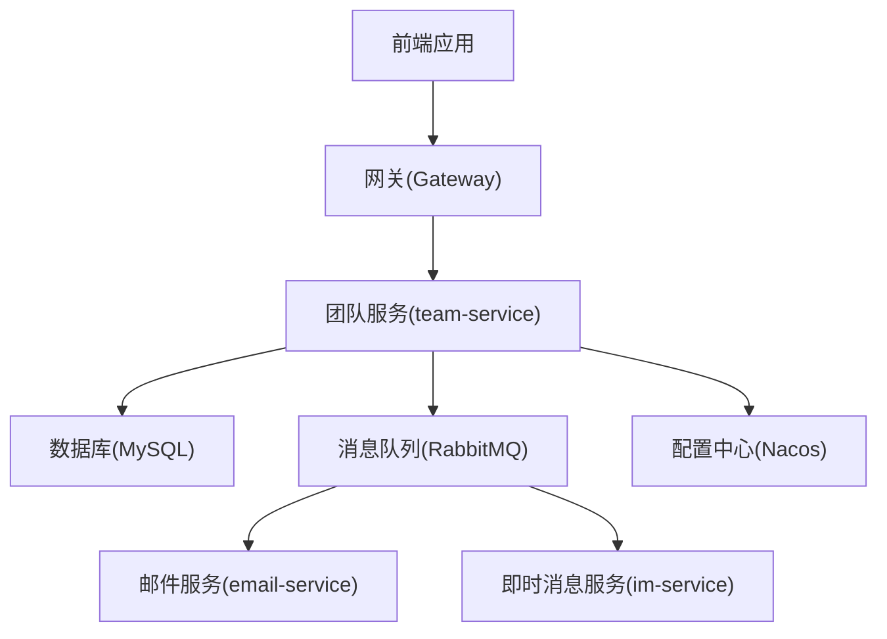
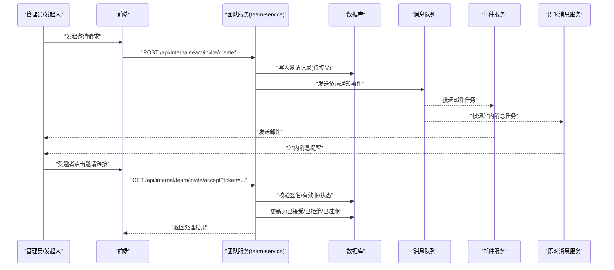
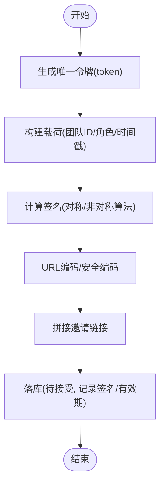
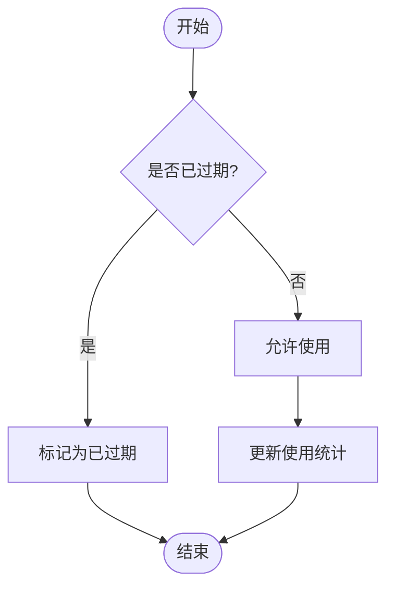
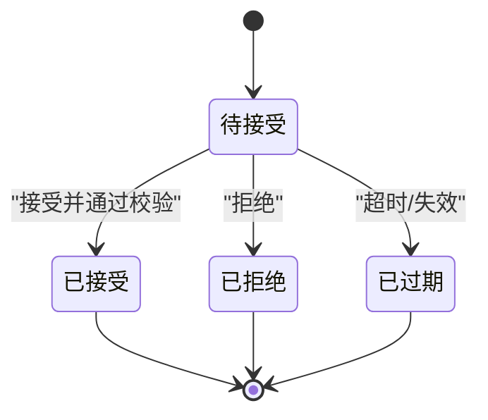
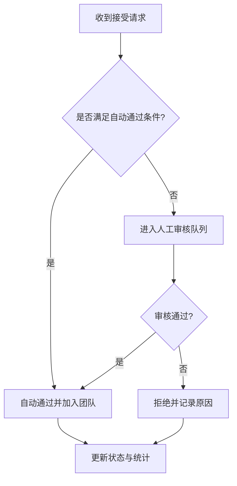
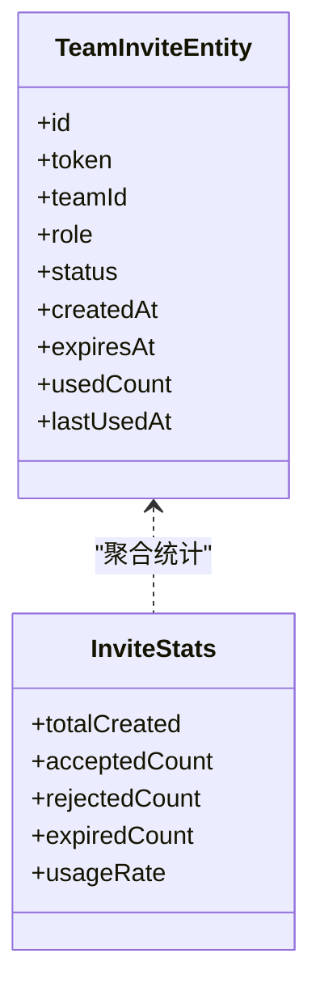
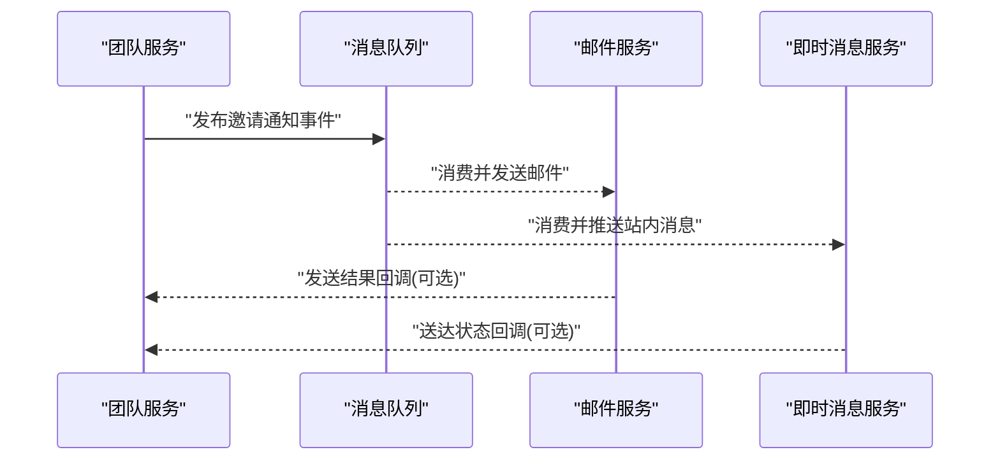
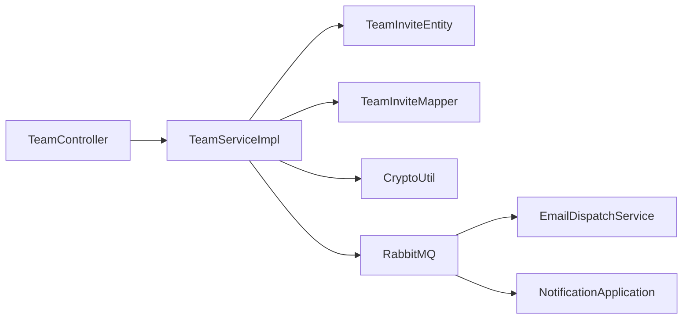

# 邀请系统功能

<cite>
**本文引用的文件**   
- [zxyz-team-service/.../controller/TeamController.java](file://ZXYZdatabaseBack/zxyz-team-service/src/main/java/uno/acloud/team/controller/TeamController.java)
- [zxyz-team-service/.../service/impl/TeamServiceImpl.java](file://ZXYZdatabaseBack/zxyz-team-service/src/main/java/uno/acloud/team/service/impl/TeamServiceImpl.java)
- [zxyz-team-service/.../entity/TeamInviteEntity.java](file://ZXYZdatabaseBack/zxyz-team-service/src/main/java/uno/acloud/team/entity/TeamInviteEntity.java)
- [zxyz-team-service/.../mapper/TeamInviteMapper.java](file://ZXYZdatabaseBack/zxyz-team-service/src/main/java/uno/acloud/team/mapper/TeamInviteMapper.java)
- [zxyz-team-service/.../dto/CreateInviteRequest.java](file://ZXYZdatabaseBack/zxyz-team-service/src/main/java/uno/acloud/team/dto/CreateInviteRequest.java)
- [zxyz-team-service/.../vo/InviteVO.java](file://ZXYZdatabaseBack/zxyz-team-service/src/main/java/uno/acloud/team/vo/InviteVO.java)
- [zxyz-common/.../common/util/CryptoUtil.java](file://ZXYZdatabaseBack/zxyz-common/src/main/java/uno/acloud/common/util/CryptoUtil.java)
- [zxyz-email-service/.../application/EmailDispatchService.java](file://ZXYZdatabaseBack/zxyz-email-service/src/main/java/uno/acloud/email/application/EmailDispatchService.java)
- [zxyz-im-service/.../application/NotificationApplication.java](file://ZXYZdatabaseBack/zxyz-im-service/src/main/java/uno/acloud/im/application/NotificationApplication.java)
- [nacos-config/zxyz-dynamic.yml](file://nacos-config/zxyz-dynamic.yml)
- [nacos-config/zxyz-team-service.yml](file://nacos-config/zxyz-team-service.yml)
- [sql/schema_team.sql](file://ZXYZdatabaseBack/sql/schema_team.sql)
</cite>

## 目录
1. [简介](#简介)
2. [项目结构](#项目结构)
3. [核心组件](#核心组件)
4. [架构总览](#架构总览)
5. [详细组件分析](#详细组件分析)
6. [依赖关系分析](#依赖关系分析)
7. [性能考虑](#性能考虑)
8. [故障排查指南](#故障排查指南)
9. [结论](#结论)
10. [附录：API 文档](#附录api-文档)

## 简介
本技术文档聚焦 ZXYZ 即时通讯模块的“邀请系统”能力，围绕邀请链接生成、有效期管理、状态流转、审批流程、使用统计与通知机制展开，并给出完整 API 说明与安全策略。该功能主要位于团队服务（team-service）中，通过邮件服务（email-service）和即时消息服务（im-service）完成多渠道通知，配合通用加密工具与配置中心实现安全与可运维性。

## 项目结构
- 后端采用微服务架构，邀请系统核心逻辑集中在 zxyz-team-service，数据模型与持久化在 team-service 内完成；通知由 email-service 与 im-service 提供。
- 前端通过 REST 接口调用 team-service 的邀请相关端点，统一返回 Result<T> 结构。
- 配置通过 Nacos 动态下发，敏感信息通过 Jasypt 加密。

图表来源 
- [zxyz-team-service/.../controller/TeamController.java](file://ZXYZdatabaseBack/zxyz-team-service/src/main/java/uno/acloud/team/controller/TeamController.java)
- [zxyz-email-service/.../application/EmailDispatchService.java](file://ZXYZdatabaseBack/zxyz-email-service/src/main/java/uno/acloud/email/application/EmailDispatchService.java)
- [zxyz-im-service/.../application/NotificationApplication.java](file://ZXYZdatabaseBack/zxyz-im-service/src/main/java/uno/acloud/im/application/NotificationApplication.java)
- [nacos-config/zxyz-dynamic.yml](file://nacos-config/zxyz-dynamic.yml)

章节来源
- [zxyz-team-service/.../controller/TeamController.java](file://ZXYZdatabaseBack/zxyz-team-service/src/main/java/uno/acloud/team/controller/TeamController.java)
- [zxyz-team-service/.../service/impl/TeamServiceImpl.java](file://ZXYZdatabaseBack/zxyz-team-service/src/main/java/uno/acloud/team/service/impl/TeamServiceImpl.java)
- [zxyz-team-service/.../entity/TeamInviteEntity.java](file://ZXYZdatabaseBack/zxyz-team-service/src/main/java/uno/acloud/team/entity/TeamInviteEntity.java)
- [zxyz-team-service/.../mapper/TeamInviteMapper.java](file://ZXYZdatabaseBack/zxyz-team-service/src/main/java/uno/acloud/team/mapper/TeamInviteMapper.java)
- [zxyz-common/.../common/util/CryptoUtil.java](file://ZXYZdatabaseBack/zxyz-common/src/main/java/uno/acloud/common/util/CryptoUtil.java)
- [zxyz-email-service/.../application/EmailDispatchService.java](file://ZXYZdatabaseBack/zxyz-email-service/src/main/java/uno/acloud/email/application/EmailDispatchService.java)
- [zxyz-im-service/.../application/NotificationApplication.java](file://ZXYZdatabaseBack/zxyz-im-service/src/main/java/uno/acloud/im/application/NotificationApplication.java)
- [nacos-config/zxyz-dynamic.yml](file://nacos-config/zxyz-dynamic.yml)
- [nacos-config/zxyz-team-service.yml](file://nacos-config/zxyz-team-service.yml)
- [sql/schema_team.sql](file://ZXYZdatabaseBack/sql/schema_team.sql)

## 核心组件
- 控制器层：对外暴露邀请创建、查询、接受、拒绝等接口，负责参数校验与结果封装。
- 服务层：编排邀请生命周期，包括唯一令牌生成、签名计算、有效期控制、状态机转换、审批规则执行、统计计数与通知触发。
- 数据层：邀请记录实体与 Mapper，存储邀请码、签名、有效期、状态、使用次数、关联用户/团队等信息。
- 通用工具：加密签名工具，用于生成不可伪造的邀请链接签名。
- 通知服务：邮件与站内消息推送，支持模板渲染与失败重试。

章节来源
- [zxyz-team-service/.../controller/TeamController.java](file://ZXYZdatabaseBack/zxyz-team-service/src/main/java/uno/acloud/team/controller/TeamController.java)
- [zxyz-team-service/.../service/impl/TeamServiceImpl.java](file://ZXYZdatabaseBack/zxyz-team-service/src/main/java/uno/acloud/team/service/impl/TeamServiceImpl.java)
- [zxyz-team-service/.../entity/TeamInviteEntity.java](file://ZXYZdatabaseBack/zxyz-team-service/src/main/java/uno/acloud/team/entity/TeamInviteEntity.java)
- [zxyz-team-service/.../mapper/TeamInviteMapper.java](file://ZXYZdatabaseBack/zxyz-team-service/src/main/java/uno/acloud/team/mapper/TeamInviteMapper.java)
- [zxyz-common/.../common/util/CryptoUtil.java](file://ZXYZdatabaseBack/zxyz-common/src/main/java/uno/acloud/common/util/CryptoUtil.java)
- [zxyz-email-service/.../application/EmailDispatchService.java](file://ZXYZdatabaseBack/zxyz-email-service/src/main/java/uno/acloud/email/application/EmailDispatchService.java)
- [zxyz-im-service/.../application/NotificationApplication.java](file://ZXYZdatabaseBack/zxyz-im-service/src/main/java/uno/acloud/im/application/NotificationApplication.java)

## 架构总览
邀请系统采用“窄端点 + 投影模式”，内部服务间调用通过 ServiceClient 与 X-Internal-Service-Token 鉴权，异步通信通过 RabbitMQ Topic Exchange zxyz.topic。邀请链接生成后，通过邮件或站内消息触达受邀者；受邀者点击链接进入接受页面，服务端校验签名与有效期，更新状态并记录使用统计。

图表来源 
- [zxyz-team-service/.../controller/TeamController.java](file://ZXYZdatabaseBack/zxyz-team-service/src/main/java/uno/acloud/team/controller/TeamController.java)
- [zxyz-team-service/.../service/impl/TeamServiceImpl.java](file://ZXYZdatabaseBack/zxyz-team-service/src/main/java/uno/acloud/team/service/impl/TeamServiceImpl.java)
- [zxyz-email-service/.../application/EmailDispatchService.java](file://ZXYZdatabaseBack/zxyz-email-service/src/main/java/uno/acloud/email/application/EmailDispatchService.java)
- [zxyz-im-service/.../application/NotificationApplication.java](file://ZXYZdatabaseBack/zxyz-im-service/src/main/java/uno/acloud/im/application/NotificationApplication.java)

## 详细组件分析

### 邀请链接生成机制
- 链接格式设计：包含邀请令牌 token、目标团队 ID、可选角色/权限标识、时间戳等字段，经序列化后生成签名。
- 唯一性保证：token 使用高熵随机数或 UUID，结合数据库唯一索引确保全局唯一。
- 加密签名与安全校验：使用 CryptoUtil 对关键参数进行签名，服务端校验时验证签名与时间戳，防止篡改与重放。
- 防伪造策略：禁止将敏感信息明文放入 URL；仅传递 token，服务端根据 token 反查上下文。

图表来源 
- [zxyz-team-service/.../service/impl/TeamServiceImpl.java](file://ZXYZdatabaseBack/zxyz-team-service/src/main/java/uno/acloud/team/service/impl/TeamServiceImpl.java)
- [zxyz-common/.../common/util/CryptoUtil.java](file://ZXYZdatabaseBack/zxyz-common/src/main/java/uno/acloud/common/util/CryptoUtil.java)
- [zxyz-team-service/.../entity/TeamInviteEntity.java](file://ZXYZdatabaseBack/zxyz-team-service/src/main/java/uno/acloud/team/entity/TeamInviteEntity.java)

章节来源
- [zxyz-team-service/.../service/impl/TeamServiceImpl.java](file://ZXYZdatabaseBack/zxyz-team-service/src/main/java/uno/acloud/team/service/impl/TeamServiceImpl.java)
- [zxyz-common/.../common/util/CryptoUtil.java](file://ZXYZdatabaseBack/zxyz-common/src/main/java/uno/acloud/common/util/CryptoUtil.java)
- [zxyz-team-service/.../entity/TeamInviteEntity.java](file://ZXYZdatabaseBack/zxyz-team-service/src/main/java/uno/acloud/team/entity/TeamInviteEntity.java)

### 邀请有效期管理
- 时间控制：创建时设置生效时间与过期时间，支持相对时长与绝对时间点。
- 自动过期：定时任务扫描过期记录，将状态更新为“已过期”。
- 延期申请：允许发起人申请延长有效期，需满足条件（如未使用、未拒绝）。
- 批量处理：支持按团队/时间段批量延期或清理过期邀请。

图表来源 
- [zxyz-team-service/.../service/impl/TeamServiceImpl.java](file://ZXYZdatabaseBack/zxyz-team-service/src/main/java/uno/acloud/team/service/impl/TeamServiceImpl.java)
- [nacos-config/zxyz-dynamic.yml](file://nacos-config/zxyz-dynamic.yml)

章节来源
- [zxyz-team-service/.../service/impl/TeamServiceImpl.java](file://ZXYZdatabaseBack/zxyz-team-service/src/main/java/uno/acloud/team/service/impl/TeamServiceImpl.java)
- [nacos-config/zxyz-dynamic.yml](file://nacos-config/zxyz-dynamic.yml)

### 邀请状态流转
- 状态定义：待接受、已接受、已拒绝、已过期。
- 转换规则：
  - 待接受 → 已接受：受邀者成功接受且通过校验。
  - 待接受 → 已拒绝：受邀者明确拒绝。
  - 待接受 → 已过期：超过有效期或被主动失效。
  - 已接受/已拒绝/已过期：不可逆，避免回滚。
- 并发控制：使用乐观锁或分布式锁防止重复接受。

图表来源 
- [zxyz-team-service/.../entity/TeamInviteEntity.java](file://ZXYZdatabaseBack/zxyz-team-service/src/main/java/uno/acloud/team/entity/TeamInviteEntity.java)
- [zxyz-team-service/.../service/impl/TeamServiceImpl.java](file://ZXYZdatabaseBack/zxyz-team-service/src/main/java/uno/acloud/team/service/impl/TeamServiceImpl.java)

章节来源
- [zxyz-team-service/.../entity/TeamInviteEntity.java](file://ZXYZdatabaseBack/zxyz-team-service/src/main/java/uno/acloud/team/entity/TeamInviteEntity.java)
- [zxyz-team-service/.../service/impl/TeamServiceImpl.java](file://ZXYZdatabaseBack/zxyz-team-service/src/main/java/uno/acloud/team/service/impl/TeamServiceImpl.java)

### 邀请审批流程
- 自动通过：满足预设条件（如角色白名单、团队策略）直接通过。
- 人工审核：复杂场景转人工审批，支持多级审核与条件限制。
- 批量处理：支持批量通过/拒绝，附带审计日志。
- 条件限制：基于团队配额、成员上限、权限矩阵等进行校验。

图表来源 
- [zxyz-team-service/.../service/impl/TeamServiceImpl.java](file://ZXYZdatabaseBack/zxyz-team-service/src/main/java/uno/acloud/team/service/impl/TeamServiceImpl.java)
- [nacos-config/zxyz-team-service.yml](file://nacos-config/zxyz-team-service.yml)

章节来源
- [zxyz-team-service/.../service/impl/TeamServiceImpl.java](file://ZXYZdatabaseBack/zxyz-team-service/src/main/java/uno/acloud/team/service/impl/TeamServiceImpl.java)
- [nacos-config/zxyz-team-service.yml](file://nacos-config/zxyz-team-service.yml)

### 邀请使用统计
- 次数限制：单条邀请最大使用次数，超限则拒绝后续使用。
- 使用记录：每次使用记录时间、IP、设备指纹等，便于审计与分析。
- 效果分析：统计转化率、渠道来源、活跃度等指标。
- 防滥用策略：频率限制、黑名单、异常行为检测。

图表来源 
- [zxyz-team-service/.../entity/TeamInviteEntity.java](file://ZXYZdatabaseBack/zxyz-team-service/src/main/java/uno/acloud/team/entity/TeamInviteEntity.java)
- [zxyz-team-service/.../service/impl/TeamServiceImpl.java](file://ZXYZdatabaseBack/zxyz-team-service/src/main/java/uno/acloud/team/service/impl/TeamServiceImpl.java)

章节来源
- [zxyz-team-service/.../entity/TeamInviteEntity.java](file://ZXYZdatabaseBack/zxyz-team-service/src/main/java/uno/acloud/team/entity/TeamInviteEntity.java)
- [zxyz-team-service/.../service/impl/TeamServiceImpl.java](file://ZXYZdatabaseBack/zxyz-team-service/src/main/java/uno/acloud/team/service/impl/TeamServiceImpl.java)

### 邀请通知机制
- 邮件通知：通过 email-service 发送模板邮件，支持失败重试与退信处理。
- 站内消息：通过 im-service 推送站内通知，支持多端同步。
- 多渠道触达：可根据策略选择邮件、站内消息或两者并行。
- 模板与变量：支持动态内容替换，提升个性化体验。

图表来源 
- [zxyz-email-service/.../application/EmailDispatchService.java](file://ZXYZdatabaseBack/zxyz-email-service/src/main/java/uno/acloud/email/application/EmailDispatchService.java)
- [zxyz-im-service/.../application/NotificationApplication.java](file://ZXYZdatabaseBack/zxyz-im-service/src/main/java/uno/acloud/im/application/NotificationApplication.java)

章节来源
- [zxyz-email-service/.../application/EmailDispatchService.java](file://ZXYZdatabaseBack/zxyz-email-service/src/main/java/uno/acloud/email/application/EmailDispatchService.java)
- [zxyz-im-service/.../application/NotificationApplication.java](file://ZXYZdatabaseBack/zxyz-im-service/src/main/java/uno/acloud/im/application/NotificationApplication.java)

## 依赖关系分析
- 控制器依赖服务层，服务层依赖数据层与通用工具。
- 通知通过消息队列解耦，降低耦合度与提升可靠性。
- 配置中心统一管理阈值、开关与策略，支持热更新。

图表来源 
- [zxyz-team-service/.../controller/TeamController.java](file://ZXYZdatabaseBack/zxyz-team-service/src/main/java/uno/acloud/team/controller/TeamController.java)
- [zxyz-team-service/.../service/impl/TeamServiceImpl.java](file://ZXYZdatabaseBack/zxyz-team-service/src/main/java/uno/acloud/team/service/impl/TeamServiceImpl.java)
- [zxyz-team-service/.../entity/TeamInviteEntity.java](file://ZXYZdatabaseBack/zxyz-team-service/src/main/java/uno/acloud/team/entity/TeamInviteEntity.java)
- [zxyz-team-service/.../mapper/TeamInviteMapper.java](file://ZXYZdatabaseBack/zxyz-team-service/src/main/java/uno/acloud/team/mapper/TeamInviteMapper.java)
- [zxyz-common/.../common/util/CryptoUtil.java](file://ZXYZdatabaseBack/zxyz-common/src/main/java/uno/acloud/common/util/CryptoUtil.java)
- [zxyz-email-service/.../application/EmailDispatchService.java](file://ZXYZdatabaseBack/zxyz-email-service/src/main/java/uno/acloud/email/application/EmailDispatchService.java)
- [zxyz-im-service/.../application/NotificationApplication.java](file://ZXYZdatabaseBack/zxyz-im-service/src/main/java/uno/acloud/im/application/NotificationApplication.java)

章节来源
- [zxyz-team-service/.../controller/TeamController.java](file://ZXYZdatabaseBack/zxyz-team-service/src/main/java/uno/acloud/team/controller/TeamController.java)
- [zxyz-team-service/.../service/impl/TeamServiceImpl.java](file://ZXYZdatabaseBack/zxyz-team-service/src/main/java/uno/acloud/team/service/impl/TeamServiceImpl.java)
- [zxyz-team-service/.../entity/TeamInviteEntity.java](file://ZXYZdatabaseBack/zxyz-team-service/src/main/java/uno/acloud/team/entity/TeamInviteEntity.java)
- [zxyz-team-service/.../mapper/TeamInviteMapper.java](file://ZXYZdatabaseBack/zxyz-team-service/src/main/java/uno/acloud/team/mapper/TeamInviteMapper.java)
- [zxyz-common/.../common/util/CryptoUtil.java](file://ZXYZdatabaseBack/zxyz-common/src/main/java/uno/acloud/common/util/CryptoUtil.java)
- [zxyz-email-service/.../application/EmailDispatchService.java](file://ZXYZdatabaseBack/zxyz-email-service/src/main/java/uno/acloud/email/application/EmailDispatchService.java)
- [zxyz-im-service/.../application/NotificationApplication.java](file://ZXYZdatabaseBack/zxyz-im-service/src/main/java/uno/acloud/im/application/NotificationApplication.java)

## 性能考虑
- 令牌生成与签名计算应使用高效算法，避免阻塞主线程。
- 数据库操作加索引优化（token、teamId、status、expiresAt），减少全表扫描。
- 通知异步化，避免同步 I/O 影响响应时间。
- 批量操作使用事务与分批提交，降低锁竞争与内存占用。
- 缓存热点数据（如团队策略、角色映射），减少重复查询。

[本节为通用指导，不直接分析具体文件]

## 故障排查指南
- 邀请链接无效：检查签名是否正确、时间戳是否过期、token 是否存在于数据库。
- 通知未送达：查看消息队列消费日志、邮件服务连接配置、IM 推送通道状态。
- 状态不一致：检查并发控制与事务边界，确认是否有重复接受或状态回滚。
- 性能问题：监控慢查询、GC 情况、线程池饱和度，定位瓶颈。

章节来源
- [zxyz-team-service/.../service/impl/TeamServiceImpl.java](file://ZXYZdatabaseBack/zxyz-team-service/src/main/java/uno/acloud/team/service/impl/TeamServiceImpl.java)
- [zxyz-email-service/.../application/EmailDispatchService.java](file://ZXYZdatabaseBack/zxyz-email-service/src/main/java/uno/acloud/email/application/EmailDispatchService.java)
- [zxyz-im-service/.../application/NotificationApplication.java](file://ZXYZdatabaseBack/zxyz-im-service/src/main/java/uno/acloud/im/application/NotificationApplication.java)

## 结论
邀请系统以团队服务为核心，结合邮件与即时消息服务实现多渠道通知，通过加密签名与状态机保障安全与一致性。通过配置中心与消息队列实现灵活扩展与高可用。建议持续优化性能与监控告警，完善审计与合规能力。

[本节为总结，不直接分析具体文件]

## 附录：API 文档
- 创建邀请
  - 方法：POST
  - 路径：/api/internal/team/invite/create
  - 请求体：CreateInviteRequest（包含团队ID、角色、有效期、接收人信息等）
  - 响应：Result<InviteVO>（包含邀请链接、token、有效期等）
- 接受邀请
  - 方法：GET
  - 路径：/api/internal/team/invite/accept
  - 查询参数：token（必填）、userId（可选，用于绑定）
  - 响应：Result<Void>（成功或错误信息）
- 拒绝邀请
  - 方法：POST
  - 路径：/api/internal/team/invite/reject
  - 请求体：{ token, reason }
  - 响应：Result<Void>
- 查询邀请列表
  - 方法：GET
  - 路径：/api/internal/team/invite/list
  - 查询参数：teamId、status、page、size
  - 响应：Result<List<InviteVO>>
- 批量处理
  - 方法：POST
  - 路径：/api/internal/team/invite/batch
  - 请求体：{ actions: [{ token, action }] }
  - 响应：Result<Map<String, String>>（每个 token 的处理结果）

错误码说明
- code: 1 表示成功
- 其他 code 表示失败，message 描述错误原因
- 常见错误：token 无效、已过期、已被使用、权限不足、系统异常

章节来源
- [zxyz-team-service/.../controller/TeamController.java](file://ZXYZdatabaseBack/zxyz-team-service/src/main/java/uno/acloud/team/controller/TeamController.java)
- [zxyz-team-service/.../dto/CreateInviteRequest.java](file://ZXYZdatabaseBack/zxyz-team-service/src/main/java/uno/acloud/team/dto/CreateInviteRequest.java)
- [zxyz-team-service/.../vo/InviteVO.java](file://ZXYZdatabaseBack/zxyz-team-service/src/main/java/uno/acloud/team/vo/InviteVO.java)