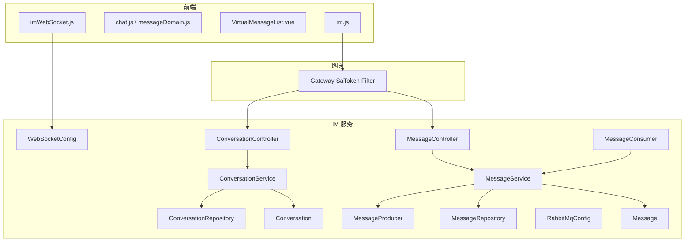
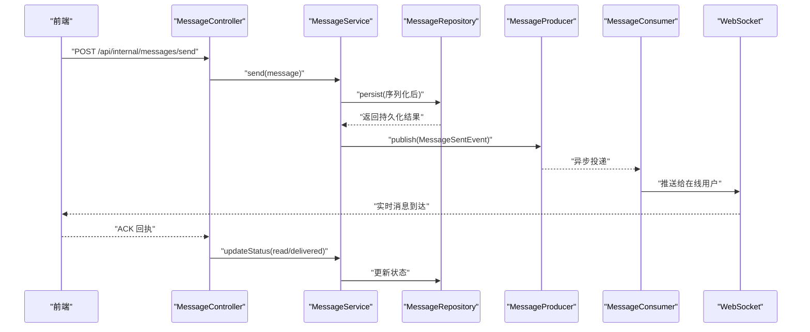
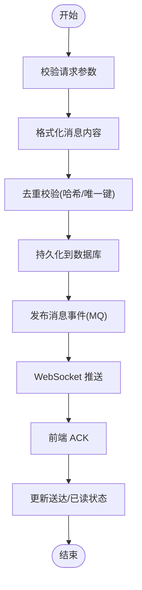
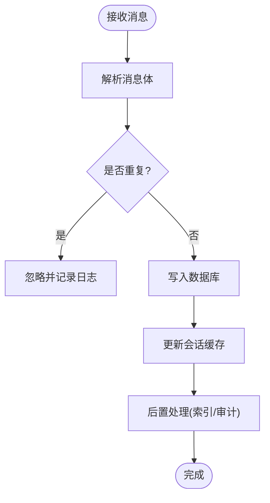
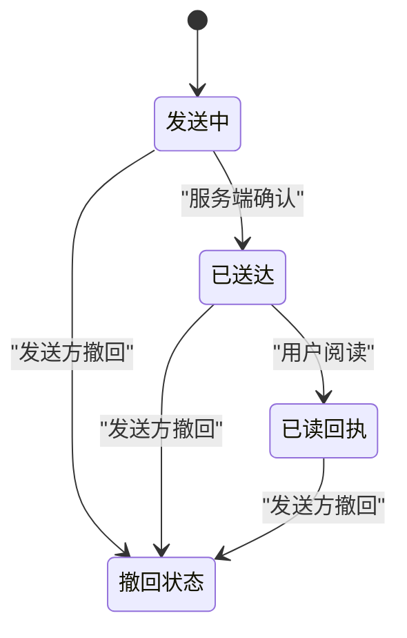
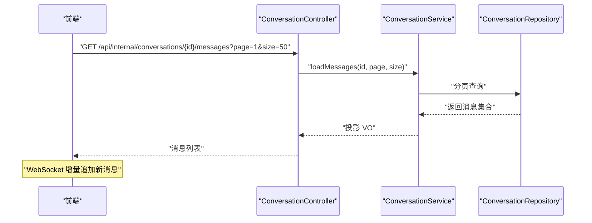
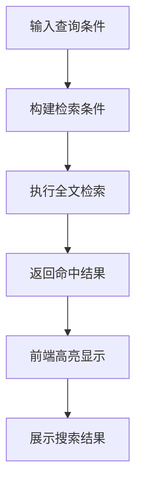
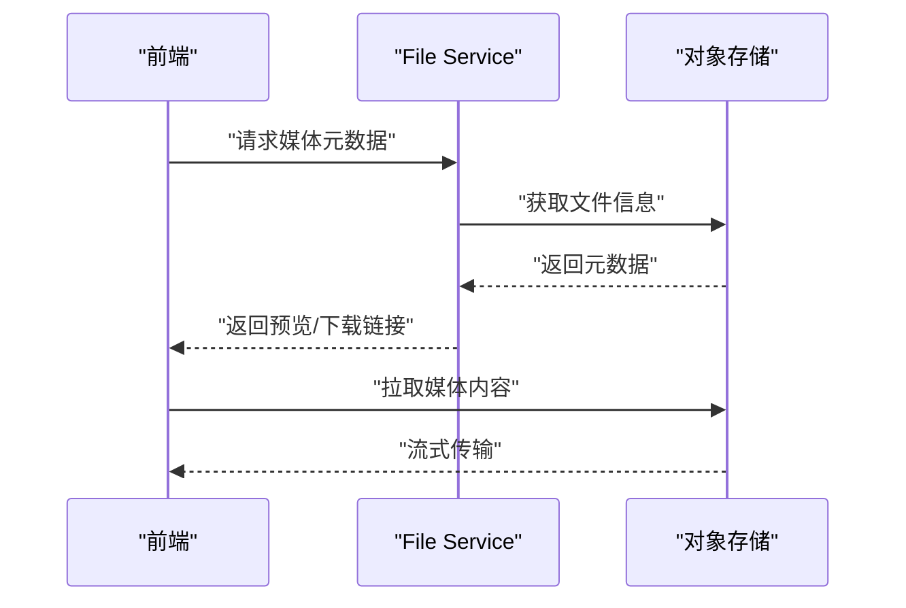
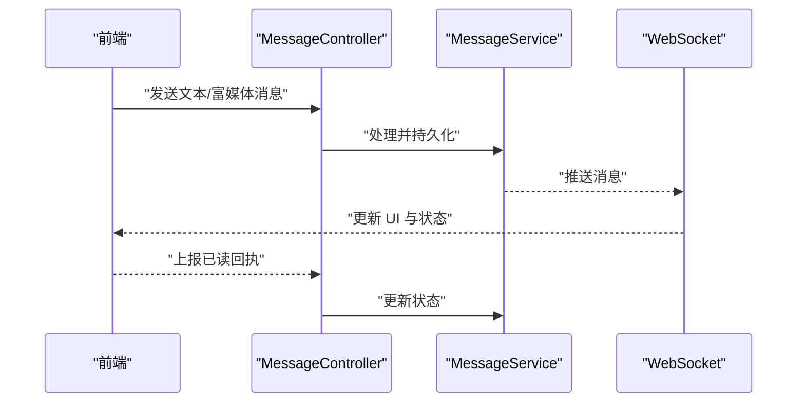
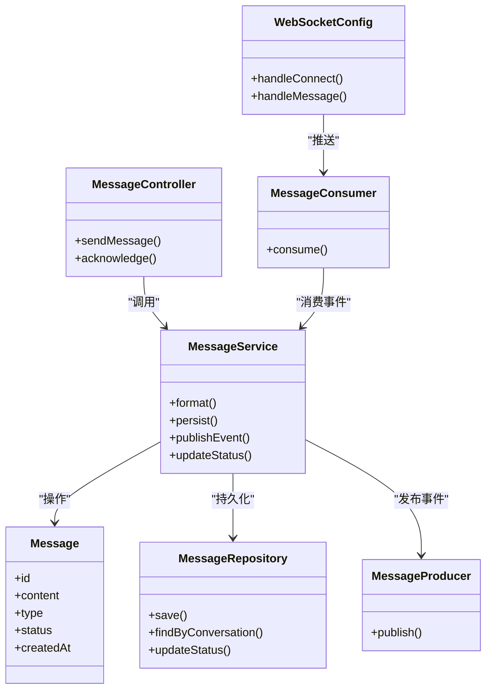

# 消息处理机制

<cite>
**本文引用的文件**   
- [zxyz-im-service/src/main/java/uno/acloud/im/ZxyzImApplication.java](file://ZXYZdatabaseBack/zxyz-im-service/src/main/java/uno/acloud/im/ZxyzImApplication.java)
- [zxyz-im-service/src/main/resources/application.yml](file://ZXYZdatabaseBack/zxyz-im-service/src/main/resources/application.yml)
- [zxyz-im-service/src/main/resources/application-dev.yml](file://ZXYZdatabaseBack/zxyz-im-service/src/main/resources/application-dev.yml)
- [zxyz-im-service/src/main/resources/application-prod.yml](file://ZXYZdatabaseBack/zxyz-im-service/src/main/resources/application-prod.yml)
- [zxyz-im-service/src/main/java/uno/acloud/im/controller/MessageController.java](file://ZXYZdatabaseBack/zxyz-im-service/src/main/java/uno/acloud/im/controller/MessageController.java)
- [zxyz-im-service/src/main/java/uno/acloud/im/controller/ConversationController.java](file://ZXYZdatabaseBack/zxyz-im-service/src/main/java/uno/acloud/im/controller/ConversationController.java)
- [zxyz-im-service/src/main/java/uno/acloud/im/application/MessageService.java](file://ZXYZdatabaseBack/zxyz-im-service/src/main/java/uno/acloud/im/application/MessageService.java)
- [zxyz-im-service/src/main/java/uno/acloud/im/application/ConversationService.java](file://ZXYZdatabaseBack/zxyz-im-service/src/main/java/uno/acloud/im/application/ConversationService.java)
- [zxyz-im-service/src/main/java/uno/acloud/im/domain/model/Message.java](file://ZXYZdatabaseBack/zxyz-im-service/src/main/java/uno/acloud/im/domain/model/Message.java)
- [zxyz-im-service/src/main/java/uno/acloud/im/domain/model/Conversation.java](file://ZXYZdatabaseBack/zxyz-im-service/src/main/java/uno/acloud/im/domain/model/Conversation.java)
- [zxyz-im-service/src/main/java/uno/acloud/im/infrastructure/repository/MessageRepository.java](file://ZXYZdatabaseBack/zxyz-im-service/src/main/java/uno/acloud/im/infrastructure/repository/MessageRepository.java)
- [zxyz-im-service/src/main/java/uno/acloud/im/infrastructure/repository/ConversationRepository.java](file://ZXYZdatabaseBack/zxyz-im-service/src/main/java/uno/acloud/im/infrastructure/repository/ConversationRepository.java)
- [zxyz-im-service/src/main/java/uno/acloud/im/config/WebSocketConfig.java](file://ZXYZdatabaseBack/zxyz-im-service/src/main/java/uno/acloud/im/config/WebSocketConfig.java)
- [zxyz-im-service/src/main/java/uno/acloud/im/config/RabbitMqConfig.java](file://ZXYZdatabaseBack/zxyz-im-service/src/main/java/uno/acloud/im/config/RabbitMqConfig.java)
- [zxyz-im-service/src/main/java/uno/acloud/im/mq/MessageProducer.java](file://ZXYZdatabaseBack/zxyz-im-service/src/main/java/uno/acloud/im/mq/MessageProducer.java)
- [zxyz-im-service/src/main/java/uno/acloud/im/mq/MessageConsumer.java](file://ZXYZdatabaseBack/zxyz-im-service/src/main/java/uno/acloud/im/mq/MessageConsumer.java)
- [zxyz-im-service/src/main/java/uno/acloud/im/dto/SendMessageRequest.java](file://ZXYZdatabaseBack/zxyz-im-service/src/main/java/uno/acloud/im/dto/SendMessageRequest.java)
- [zxyz-im-service/src/main/java/uno/acloud/im/dto/MessageResponse.java](file://ZXYZdatabaseBack/zxyz-im-service/src/main/java/uno/acloud/im/dto/MessageResponse.java)
- [zxyz-im-service/src/main/java/uno/acloud/im/vo/MessageVO.java](file://ZXYZdatabaseBack/zxyz-im-service/src/main/java/uno/acloud/im/vo/MessageVO.java)
- [zxyz-common/src/main/java/uno/acloud/common/event/MessageSentEvent.java](file://ZXYZdatabaseBack/zxyz-common/src/main/java/uno/acloud/common/event/MessageSentEvent.java)
- [zxyz-common/src/main/java/uno/acloud/common/event/MessageReadEvent.java](file://ZXYZdatabaseBack/zxyz-common/src/main/java/uno/acloud/common/event/MessageReadEvent.java)
- [ZXYZdatabaseFront/src/utils/imWebSocket.js](file://ZXYZdatabaseFront/src/utils/imWebSocket.js)
- [ZXYZdatabaseFront/src/store/chat.js](file://ZXYZdatabaseFront/src/store/chat.js)
- [ZXYZdatabaseFront/src/store/im/messageDomain.js](file://ZXYZdatabaseFront/src/store/im/messageDomain.js)
- [ZXYZdatabaseFront/src/views/chat/components/VirtualMessageList.vue](file://ZXYZdatabaseFront/src/views/chat/components/VirtualMessageList.vue)
- [ZXYZdatabaseFront/src/api/im.js](file://ZXYZdatabaseFront/src/api/im.js)
</cite>

## 目录
1. [简介](#简介)
2. [项目结构](#项目结构)
3. [核心组件](#核心组件)
4. [架构总览](#架构总览)
5. [详细组件分析](#详细组件分析)
6. [依赖关系分析](#依赖关系分析)
7. [性能考量](#性能考量)
8. [故障排查指南](#故障排查指南)
9. [结论](#结论)
10. [附录](#附录)

## 简介
本技术文档围绕 ZXYZ 即时通讯模块的消息处理机制展开，覆盖消息发送与接收、状态管理、分页加载、搜索、富媒体处理以及端到端示例与性能优化建议。系统采用微服务架构，IM 服务遵循 DDD 分层（interfaces → application → domain → infrastructure），前端使用 Vue 3 + Pinia + WebSocket 实现实时交互。

## 项目结构
IM 相关代码主要分布在后端 zxyz-im-service 与前端的 chat 视图与 store 中：
- 后端 IM 服务：控制器、应用服务、领域模型、仓储、配置、MQ 与 DTO/VO 定义
- 前端：WebSocket 工具、聊天 Store、虚拟滚动列表、API 封装

图表来源
- [zxyz-im-service/src/main/java/uno/acloud/im/controller/MessageController.java](file://ZXYZdatabaseBack/zxyz-im-service/src/main/java/uno/acloud/im/controller/MessageController.java)
- [zxyz-im-service/src/main/java/uno/acloud/im/application/MessageService.java](file://ZXYZdatabaseBack/zxyz-im-service/src/main/java/uno/acloud/im/application/MessageService.java)
- [zxyz-im-service/src/main/java/uno/acloud/im/infrastructure/repository/MessageRepository.java](file://ZXYZdatabaseBack/zxyz-im-service/src/main/java/uno/acloud/im/infrastructure/repository/MessageRepository.java)
- [zxyz-im-service/src/main/java/uno/acloud/im/config/WebSocketConfig.java](file://ZXYZdatabaseBack/zxyz-im-service/src/main/java/uno/acloud/im/config/WebSocketConfig.java)
- [zxyz-im-service/src/main/java/uno/acloud/im/config/RabbitMqConfig.java](file://ZXYZdatabaseBack/zxyz-im-service/src/main/java/uno/acloud/im/config/RabbitMqConfig.java)
- [zxyz-im-service/src/main/java/uno/acloud/im/mq/MessageProducer.java](file://ZXYZdatabaseBack/zxyz-im-service/src/main/java/uno/acloud/im/mq/MessageProducer.java)
- [zxyz-im-service/src/main/java/uno/acloud/im/mq/MessageConsumer.java](file://ZXYZdatabaseBack/zxyz-im-service/src/main/java/uno/acloud/im/mq/MessageConsumer.java)
- [ZXYZdatabaseFront/src/utils/imWebSocket.js](file://ZXYZdatabaseFront/src/utils/imWebSocket.js)
- [ZXYZdatabaseFront/src/store/chat.js](file://ZXYZdatabaseFront/src/store/chat.js)
- [ZXYZdatabaseFront/src/store/im/messageDomain.js](file://ZXYZdatabaseFront/src/store/im/messageDomain.js)
- [ZXYZdatabaseFront/src/views/chat/components/VirtualMessageList.vue](file://ZXYZdatabaseFront/src/views/chat/components/VirtualMessageList.vue)
- [ZXYZdatabaseFront/src/api/im.js](file://ZXYZdatabaseFront/src/api/im.js)

章节来源
- [zxyz-im-service/src/main/java/uno/acloud/im/ZxyzImApplication.java](file://ZXYZdatabaseBack/zxyz-im-service/src/main/java/uno/acloud/im/ZxyzImApplication.java)
- [zxyz-im-service/src/main/resources/application.yml](file://ZXYZdatabaseBack/zxyz-im-service/src/main/resources/application.yml)
- [zxyz-im-service/src/main/resources/application-dev.yml](file://ZXYZdatabaseBack/zxyz-im-service/src/main/resources/application-dev.yml)
- [zxyz-im-service/src/main/resources/application-prod.yml](file://ZXYZdatabaseBack/zxyz-im-service/src/main/resources/application-prod.yml)

## 核心组件
- 控制器层：消息与会话的 HTTP 入口，负责参数校验、权限检查与响应封装
- 应用服务层：编排业务流程，协调领域模型与仓储、事件发布
- 领域模型：Message、Conversation 等实体与值对象
- 仓储层：数据持久化访问（数据库）
- 配置层：WebSocket、RabbitMQ、数据库等基础设施配置
- MQ 层：消息生产者与消费者，用于异步广播与状态同步
- 前端：WebSocket 客户端、Pinia Store、虚拟滚动列表、API 调用封装

章节来源
- [zxyz-im-service/src/main/java/uno/acloud/im/controller/MessageController.java](file://ZXYZdatabaseBack/zxyz-im-service/src/main/java/uno/acloud/im/controller/MessageController.java)
- [zxyz-im-service/src/main/java/uno/acloud/im/application/MessageService.java](file://ZXYZdatabaseBack/zxyz-im-service/src/main/java/uno/acloud/im/application/MessageService.java)
- [zxyz-im-service/src/main/java/uno/acloud/im/domain/model/Message.java](file://ZXYZdatabaseBack/zxyz-im-service/src/main/java/uno/acloud/im/domain/model/Message.java)
- [zxyz-im-service/src/main/java/uno/acloud/im/infrastructure/repository/MessageRepository.java](file://ZXYZdatabaseBack/zxyz-im-service/src/main/java/uno/acloud/im/infrastructure/repository/MessageRepository.java)
- [zxyz-im-service/src/main/java/uno/acloud/im/config/WebSocketConfig.java](file://ZXYZdatabaseBack/zxyz-im-service/src/main/java/uno/acloud/im/config/WebSocketConfig.java)
- [zxyz-im-service/src/main/java/uno/acloud/im/config/RabbitMqConfig.java](file://ZXYZdatabaseBack/zxyz-im-service/src/main/java/uno/acloud/im/config/RabbitMqConfig.java)
- [zxyz-im-service/src/main/java/uno/acloud/im/mq/MessageProducer.java](file://ZXYZdatabaseBack/zxyz-im-service/src/main/java/uno/acloud/im/mq/MessageProducer.java)
- [zxyz-im-service/src/main/java/uno/acloud/im/mq/MessageConsumer.java](file://ZXYZdatabaseBack/zxyz-im-service/src/main/java/uno/acloud/im/mq/MessageConsumer.java)
- [ZXYZdatabaseFront/src/utils/imWebSocket.js](file://ZXYZdatabaseFront/src/utils/imWebSocket.js)
- [ZXYZdatabaseFront/src/store/chat.js](file://ZXYZdatabaseFront/src/store/chat.js)
- [ZXYZdatabaseFront/src/store/im/messageDomain.js](file://ZXYZdatabaseFront/src/store/im/messageDomain.js)
- [ZXYZdatabaseFront/src/views/chat/components/VirtualMessageList.vue](file://ZXYZdatabaseFront/src/views/chat/components/VirtualMessageList.vue)
- [ZXYZdatabaseFront/src/api/im.js](file://ZXYZdatabaseFront/src/api/im.js)

## 架构总览
整体流程分为“发送”和“接收”两条主线，辅以状态同步与持久化。

图表来源
- [zxyz-im-service/src/main/java/uno/acloud/im/controller/MessageController.java](file://ZXYZdatabaseBack/zxyz-im-service/src/main/java/uno/acloud/im/controller/MessageController.java)
- [zxyz-im-service/src/main/java/uno/acloud/im/application/MessageService.java](file://ZXYZdatabaseBack/zxyz-im-service/src/main/java/uno/acloud/im/application/MessageService.java)
- [zxyz-im-service/src/main/java/uno/acloud/im/infrastructure/repository/MessageRepository.java](file://ZXYZdatabaseBack/zxyz-im-service/src/main/java/uno/acloud/im/infrastructure/repository/MessageRepository.java)
- [zxyz-im-service/src/main/java/uno/acloud/im/mq/MessageProducer.java](file://ZXYZdatabaseBack/zxyz-im-service/src/main/java/uno/acloud/im/mq/MessageProducer.java)
- [zxyz-im-service/src/main/java/uno/acloud/im/mq/MessageConsumer.java](file://ZXYZdatabaseBack/zxyz-im-service/src/main/java/uno/acloud/im/mq/MessageConsumer.java)
- [zxyz-im-service/src/main/java/uno/acloud/im/config/WebSocketConfig.java](file://ZXYZdatabaseBack/zxyz-im-service/src/main/java/uno/acloud/im/config/WebSocketConfig.java)
- [ZXYZdatabaseFront/src/utils/imWebSocket.js](file://ZXYZdatabaseFront/src/utils/imWebSocket.js)

## 详细组件分析

### 消息发送流程
- 请求进入 MessageController，进行参数校验与鉴权
- 应用服务 MessageService 完成消息格式化、去重校验、持久化与事件发布
- 通过 RabbitMQ 异步广播，WebSocket 推送至在线用户
- 前端收到消息后更新本地缓存并返回 ACK，服务端更新送达/已读状态

章节来源
- [zxyz-im-service/src/main/java/uno/acloud/im/controller/MessageController.java](file://ZXYZdatabaseBack/zxyz-im-service/src/main/java/uno/acloud/im/controller/MessageController.java)
- [zxyz-im-service/src/main/java/uno/acloud/im/application/MessageService.java](file://ZXYZdatabaseBack/zxyz-im-service/src/main/java/uno/acloud/im/application/MessageService.java)
- [zxyz-im-service/src/main/java/uno/acloud/im/dto/SendMessageRequest.java](file://ZXYZdatabaseBack/zxyz-im-service/src/main/java/uno/acloud/im/dto/SendMessageRequest.java)
- [zxyz-im-service/src/main/java/uno/acloud/im/dto/MessageResponse.java](file://ZXYZdatabaseBack/zxyz-im-service/src/main/java/uno/acloud/im/dto/MessageResponse.java)
- [zxyz-im-service/src/main/java/uno/acloud/im/mq/MessageProducer.java](file://ZXYZdatabaseBack/zxyz-im-service/src/main/java/uno/acloud/im/mq/MessageProducer.java)
- [zxyz-im-service/src/main/java/uno/acloud/im/mq/MessageConsumer.java](file://ZXYZdatabaseBack/zxyz-im-service/src/main/java/uno/acloud/im/mq/MessageConsumer.java)
- [ZXYZdatabaseFront/src/utils/imWebSocket.js](file://ZXYZdatabaseFront/src/utils/imWebSocket.js)

### 消息接收处理
- 解析消息体，执行去重逻辑（基于哈希或业务唯一键）
- 存储持久化（按会话分表/分区策略）
- 更新内存缓存（会话最近消息、未读数）
- 触发后续处理（如富媒体下载、索引构建）

章节来源
- [zxyz-im-service/src/main/java/uno/acloud/im/application/MessageService.java](file://ZXYZdatabaseBack/zxyz-im-service/src/main/java/uno/acloud/im/application/MessageService.java)
- [zxyz-im-service/src/main/java/uno/acloud/im/infrastructure/repository/MessageRepository.java](file://ZXYZdatabaseBack/zxyz-im-service/src/main/java/uno/acloud/im/infrastructure/repository/MessageRepository.java)
- [ZXYZdatabaseFront/src/store/im/messageDomain.js](file://ZXYZdatabaseFront/src/store/im/messageDomain.js)

### 消息状态管理
- 发送中：前端在本地标记为“发送中”，等待服务端确认
- 已送达：服务端收到并持久化后，通过 WebSocket 推送送达回执
- 已读回执：用户打开会话或阅读消息后上报，服务端更新并广播
- 撤回状态：发送方撤回消息，服务端更新状态并通知所有在线成员

章节来源
- [zxyz-im-service/src/main/java/uno/acloud/im/application/MessageService.java](file://ZXYZdatabaseBack/zxyz-im-service/src/main/java/uno/acloud/im/application/MessageService.java)
- [ZXYZdatabaseFront/src/store/chat.js](file://ZXYZdatabaseFront/src/store/chat.js)
- [ZXYZdatabaseFront/src/utils/imWebSocket.js](file://ZXYZdatabaseFront/src/utils/imWebSocket.js)

### 消息分页加载
- 历史消息获取：按会话 ID、时间戳或游标分页，支持倒序加载
- 增量更新：新消息通过 WebSocket 增量追加，避免全量刷新
- 内存优化：虚拟滚动列表仅渲染可视区域，结合分页减少内存占用

章节来源
- [zxyz-im-service/src/main/java/uno/acloud/im/controller/ConversationController.java](file://ZXYZdatabaseBack/zxyz-im-service/src/main/java/uno/acloud/im/controller/ConversationController.java)
- [zxyz-im-service/src/main/java/uno/acloud/im/application/ConversationService.java](file://ZXYZdatabaseBack/zxyz-im-service/src/main/java/uno/acloud/im/application/ConversationService.java)
- [zxyz-im-service/src/main/java/uno/acloud/im/infrastructure/repository/ConversationRepository.java](file://ZXYZdatabaseBack/zxyz-im-service/src/main/java/uno/acloud/im/infrastructure/repository/ConversationRepository.java)
- [ZXYZdatabaseFront/src/views/chat/components/VirtualMessageList.vue](file://ZXYZdatabaseFront/src/views/chat/components/VirtualMessageList.vue)

### 消息搜索功能
- 全文检索：对文本类消息建立索引，支持关键词匹配
- 过滤条件：按会话、时间范围、消息类型、发送人筛选
- 搜索结果高亮：前端对命中片段进行高亮展示

章节来源
- [zxyz-im-service/src/main/java/uno/acloud/im/application/MessageService.java](file://ZXYZdatabaseBack/zxyz-im-service/src/main/java/uno/acloud/im/application/MessageService.java)
- [ZXYZdatabaseFront/src/api/im.js](file://ZXYZdatabaseFront/src/api/im.js)

### 富媒体消息处理
- 图片预览：生成缩略图与预览链接，支持懒加载
- 文件下载：断点续传与进度回调，安全校验与权限控制
- 视频播放：流式传输与自适应码率
- 音频播放：缓冲与播放控制

章节来源
- [zxyz-im-service/src/main/java/uno/acloud/im/application/MessageService.java](file://ZXYZdatabaseBack/zxyz-im-service/src/main/java/uno/acloud/im/application/MessageService.java)
- [ZXYZdatabaseFront/src/api/im.js](file://ZXYZdatabaseFront/src/api/im.js)

### 完整示例：正确处理各种消息类型与状态变化
- 文本消息：直接渲染，支持 Markdown 扩展
- 富媒体消息：根据类型选择预览/播放器组件
- 状态变化：发送中→已送达→已读回执；撤回时统一更新并提示

章节来源
- [ZXYZdatabaseFront/src/store/chat.js](file://ZXYZdatabaseFront/src/store/chat.js)
- [ZXYZdatabaseFront/src/utils/imWebSocket.js](file://ZXYZdatabaseFront/src/utils/imWebSocket.js)
- [zxyz-im-service/src/main/java/uno/acloud/im/controller/MessageController.java](file://ZXYZdatabaseBack/zxyz-im-service/src/main/java/uno/acloud/im/controller/MessageController.java)
- [zxyz-im-service/src/main/java/uno/acloud/im/application/MessageService.java](file://ZXYZdatabaseBack/zxyz-im-service/src/main/java/uno/acloud/im/application/MessageService.java)

## 依赖关系分析
- 控制器依赖应用服务，应用服务依赖领域模型与仓储
- MQ 解耦发送与推送，提升吞吐与可靠性
- 前端通过 WebSocket 与后端保持长连接，Store 集中管理状态

图表来源
- [zxyz-im-service/src/main/java/uno/acloud/im/controller/MessageController.java](file://ZXYZdatabaseBack/zxyz-im-service/src/main/java/uno/acloud/im/controller/MessageController.java)
- [zxyz-im-service/src/main/java/uno/acloud/im/application/MessageService.java](file://ZXYZdatabaseBack/zxyz-im-service/src/main/java/uno/acloud/im/application/MessageService.java)
- [zxyz-im-service/src/main/java/uno/acloud/im/domain/model/Message.java](file://ZXYZdatabaseBack/zxyz-im-service/src/main/java/uno/acloud/im/domain/model/Message.java)
- [zxyz-im-service/src/main/java/uno/acloud/im/infrastructure/repository/MessageRepository.java](file://ZXYZdatabaseBack/zxyz-im-service/src/main/java/uno/acloud/im/infrastructure/repository/MessageRepository.java)
- [zxyz-im-service/src/main/java/uno/acloud/im/mq/MessageProducer.java](file://ZXYZdatabaseBack/zxyz-im-service/src/main/java/uno/acloud/im/mq/MessageProducer.java)
- [zxyz-im-service/src/main/java/uno/acloud/im/mq/MessageConsumer.java](file://ZXYZdatabaseBack/zxyz-im-service/src/main/java/uno/acloud/im/mq/MessageConsumer.java)
- [zxyz-im-service/src/main/java/uno/acloud/im/config/WebSocketConfig.java](file://ZXYZdatabaseBack/zxyz-im-service/src/main/java/uno/acloud/im/config/WebSocketConfig.java)

章节来源
- [zxyz-im-service/src/main/java/uno/acloud/im/ZxyzImApplication.java](file://ZXYZdatabaseBack/zxyz-im-service/src/main/java/uno/acloud/im/ZxyzImApplication.java)
- [zxyz-im-service/src/main/resources/application.yml](file://ZXYZdatabaseBack/zxyz-im-service/src/main/resources/application.yml)

## 性能考量
- 消息压缩：对大体积富媒体与文本进行压缩传输
- 批量操作：合并状态更新与持久化，减少 IO 次数
- 异步处理：通过 MQ 解耦发送与推送，提升吞吐
- 缓存策略：会话最近消息与未读数缓存，降低数据库压力
- 虚拟滚动：仅渲染可视区域，优化长列表性能
- 连接池与限流：合理配置 WebSocket 与数据库连接池，防止资源耗尽

[本节为通用指导，不直接分析具体文件]

## 故障排查指南
- 常见问题
  - 消息丢失：检查 MQ 队列与消费者重试机制
  - 状态不同步：核对 ACK 回执与状态更新逻辑
  - 内存溢出：调整虚拟滚动阈值与分页大小
  - 富媒体失败：验证对象存储权限与网络连通性
- 调试建议
  - 启用详细日志与链路追踪
  - 监控关键指标（延迟、错误率、队列积压）
  - 使用测试用例复现问题场景

章节来源
- [zxyz-im-service/src/main/java/uno/acloud/im/mq/MessageConsumer.java](file://ZXYZdatabaseBack/zxyz-im-service/src/main/java/uno/acloud/im/mq/MessageConsumer.java)
- [ZXYZdatabaseFront/src/utils/imWebSocket.js](file://ZXYZdatabaseFront/src/utils/imWebSocket.js)
- [ZXYZdatabaseFront/src/store/chat.js](file://ZXYZdatabaseFront/src/store/chat.js)

## 结论
ZXYZ IM 模块通过清晰的 DDD 分层、MQ 异步解耦与 WebSocket 实时推送，构建了稳定高效的消息处理机制。前端采用虚拟滚动与状态集中管理，确保用户体验与性能平衡。建议在大规模场景下进一步优化压缩、批处理与缓存策略，以持续提升系统吞吐与稳定性。

[本节为总结，不直接分析具体文件]

## 附录
- 配置参考：application.yml、application-dev.yml、application-prod.yml
- 事件定义：MessageSentEvent、MessageReadEvent
- 前端 API：im.js 封装统一接口

章节来源
- [zxyz-im-service/src/main/resources/application.yml](file://ZXYZdatabaseBack/zxyz-im-service/src/main/resources/application.yml)
- [zxyz-im-service/src/main/resources/application-dev.yml](file://ZXYZdatabaseBack/zxyz-im-service/src/main/resources/application-dev.yml)
- [zxyz-im-service/src/main/resources/application-prod.yml](file://ZXYZdatabaseBack/zxyz-im-service/src/main/resources/application-prod.yml)
- [zxyz-common/src/main/java/uno/acloud/common/event/MessageSentEvent.java](file://ZXYZdatabaseBack/zxyz-common/src/main/java/uno/acloud/common/event/MessageSentEvent.java)
- [zxyz-common/src/main/java/uno/acloud/common/event/MessageReadEvent.java](file://ZXYZdatabaseBack/zxyz-common/src/main/java/uno/acloud/common/event/MessageReadEvent.java)
- [ZXYZdatabaseFront/src/api/im.js](file://ZXYZdatabaseFront/src/api/im.js)